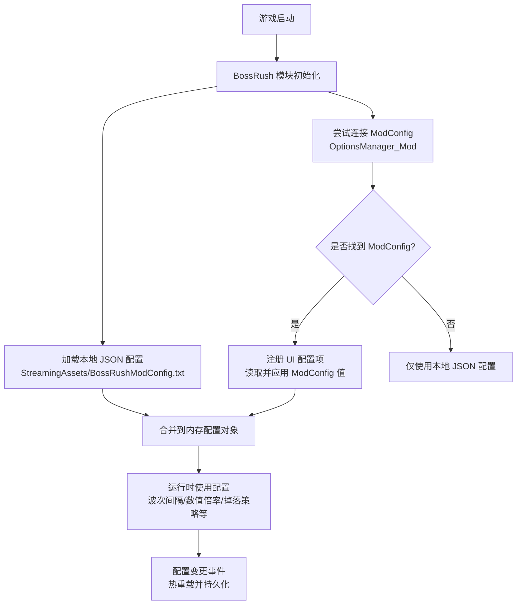
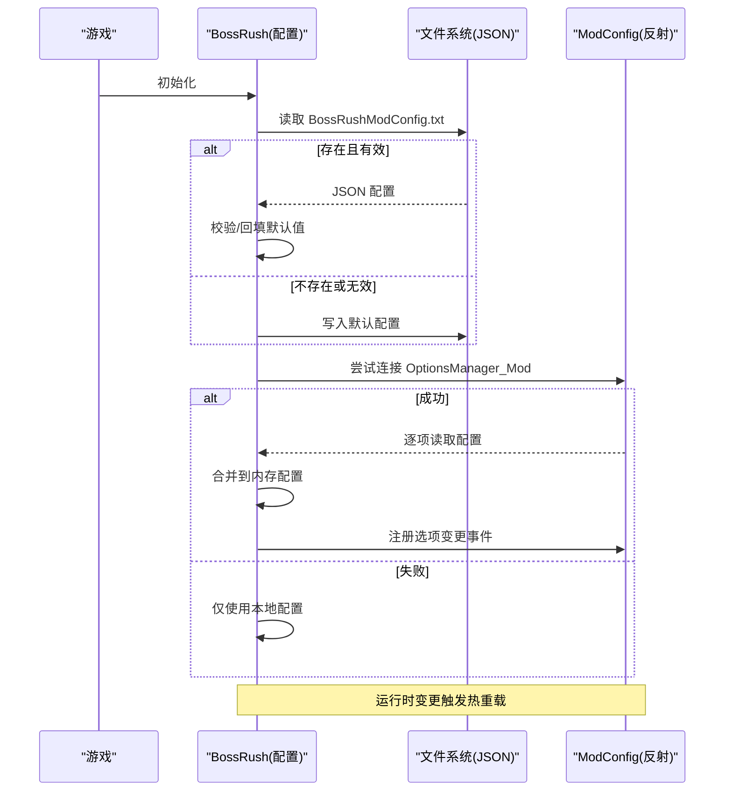
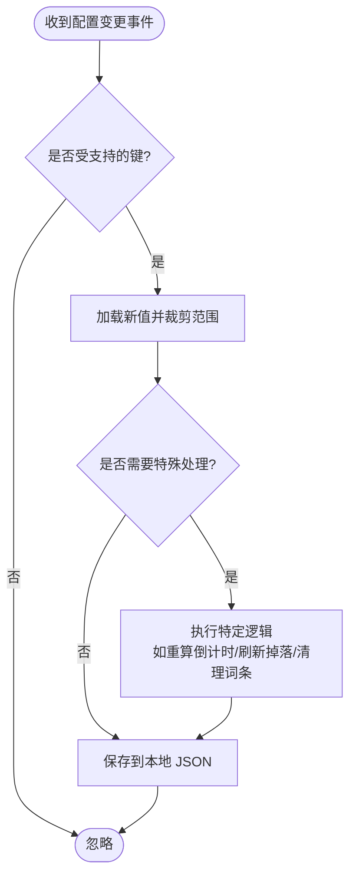
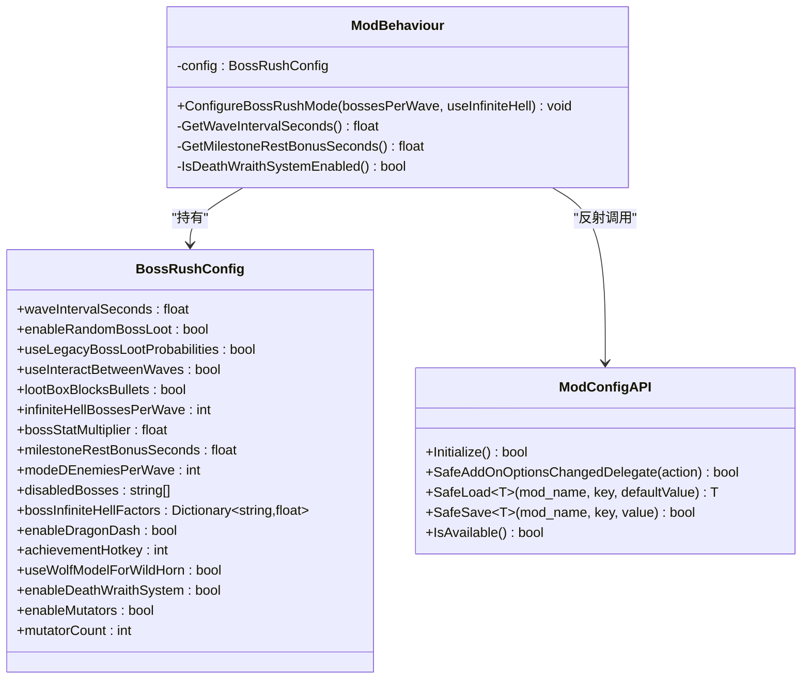

# 配置管理

<cite>
**本文引用的文件**
- [Config.cs](file://Config/Config.cs)
- [ModConfigApi.cs](file://ModConfigApi.cs)
- [ModBehaviour.cs](file://ModBehaviour.cs)
</cite>

## 目录
1. [简介](#简介)
2. [项目结构](#项目结构)
3. [核心组件](#核心组件)
4. [架构总览](#架构总览)
5. [详细组件分析](#详细组件分析)
6. [依赖关系分析](#依赖关系分析)
7. [性能考虑](#性能考虑)
8. [故障排查指南](#故障排查指南)
9. [结论](#结论)
10. [附录：配置项参考与最佳实践](#附录配置项参考与最佳实践)

## 简介
本文件系统性说明 BossRush 的配置系统，包括数据结构、配置文件格式、加载机制（本地 JSON 文件 + ModConfig 模组）、验证规则与默认值管理、热重载与运行时变更处理、持久化策略，以及配置最佳实践、性能调优建议与常见问题解决方案。目标是帮助开发者与高级用户安全、高效地定制 BossRush 行为。

## 项目结构
BossRush 的配置系统主要由以下部分构成：
- 配置数据模型与读写：位于 Config/Config.cs，定义 BossRushConfig 数据结构、JSON 序列化/反序列化、范围校验、默认值、保存路径等。
- ModConfig 集成：通过反射调用 ModConfig 的 OptionsManager_Mod，实现运行时配置项注册、读取、事件监听与热更新。
- 运行时桥接：在 ModBehaviour 中完成配置生效、波次倒计时重算、模式切换时的配置优先级处理等。

图表来源
- [Config.cs:155-232](file://Config/Config.cs#L155-L232)
- [Config.cs:234-407](file://Config/Config.cs#L234-L407)
- [Config.cs:586-704](file://Config/Config.cs#L586-L704)
- [ModBehaviour.cs:252-282](file://ModBehaviour.cs#L252-L282)

章节来源
- [Config.cs:155-232](file://Config/Config.cs#L155-L232)
- [Config.cs:234-407](file://Config/Config.cs#L234-L407)
- [ModBehaviour.cs:252-282](file://ModBehaviour.cs#L252-L282)

## 核心组件
- BossRushConfig 数据类：集中声明所有可配置字段及其默认值，支持 JSON 序列化。
- 本地配置加载器：从 StreamingAssets 下的 BossRushModConfig.txt 读取 JSON，进行基础校验与缺失字段回填。
- ModConfig 集成层：通过反射访问 ModConfig.OptionsManager_Mod，完成配置项注册、读取、事件订阅与单键热更新。
- 运行时应用层：根据配置影响波次间隔、Boss 数值倍率、掉落随机化、Mode D 敌人数、无间炼狱每波 Boss 数等。

章节来源
- [Config.cs:31-81](file://Config/Config.cs#L31-L81)
- [Config.cs:155-232](file://Config/Config.cs#L155-L232)
- [Config.cs:234-407](file://Config/Config.cs#L234-L407)
- [Config.cs:586-704](file://Config/Config.cs#L586-L704)
- [ModBehaviour.cs:252-282](file://ModBehaviour.cs#L252-L282)

## 架构总览
BossRush 配置系统采用“双源合并 + 热重载”的架构：
- 启动时优先加载本地 JSON 配置；若不存在则生成默认文件。
- 若检测到 ModConfig 模组，则通过反射读取其存储的值，覆盖或补充内存中的配置。
- 运行时通过事件监听 ModConfig 的选项变更，即时更新内存配置、持久化到本地文件，并对受影响的游戏逻辑进行最小化重算。

图表来源
- [Config.cs:155-232](file://Config/Config.cs#L155-L232)
- [Config.cs:234-407](file://Config/Config.cs#L234-L407)
- [Config.cs:586-704](file://Config/Config.cs#L586-L704)

## 详细组件分析

### BossRushConfig 数据模型
- 位置与职责：定义所有 BossRush 可配置项，包含开关、数值、列表、字典等类型，并提供默认值。
- 关键字段示例：
  - 波次间隔：float，默认 15 秒，范围 2-60 秒。
  - Boss 掉落随机化：bool，默认开启。
  - 标准 Boss 战利品原版概率：bool，默认开启。
  - 波次间交互点：bool，默认关闭。
  - 掉落箱挡子弹：bool，默认关闭。
  - 无间炼狱每波 Boss 数：int，默认 3，范围 1-10。
  - Boss 全局数值倍率：float，默认 1，范围 0.1-10。
  - 每 5 波额外休息时间：float，默认 30，范围 0-120。
  - Mode D 每波敌人数：int，默认 3，范围 1-10。
  - 禁用 Boss 列表：List<string>。
  - Boss 无间炼狱刷新因子：Dictionary<string,float>。
  - 龙套装冲刺开关：bool，默认开启。
  - 成就界面快捷键：int（KeyCode 索引），默认 L。
  - 荒野号角狼模型替换：bool，默认开启。
  - 死亡亡魂系统：bool，默认开启。
  - 变异词条系统：bool，默认开启。
  - 变异词条数量：int，默认 3，范围 1-10。

章节来源
- [Config.cs:31-81](file://Config/Config.cs#L31-L81)

### 配置文件格式与持久化
- 文件路径：StreamingAssets/BossRushModConfig.txt。
- 格式：JSON，由 Unity JsonUtility 序列化为 BossRushConfig。
- 首次运行：若文件不存在，自动创建默认配置。
- 保存时机：
  - 首次运行生成默认文件。
  - 通过 ModConfig 修改任一受支持的选项后，立即写回本地文件。
- 异常处理：读写失败会记录警告日志，不影响后续流程。

章节来源
- [Config.cs:98-118](file://Config/Config.cs#L98-L118)
- [Config.cs:155-232](file://Config/Config.cs#L155-L232)
- [Config.cs:586-704](file://Config/Config.cs#L586-L704)

### 加载机制与合并策略
- 本地 JSON 加载：
  - 读取 JSON 后对关键项做基础校验（如波次间隔必须大于 0）。
  - 对缺失字段进行回填（如未提供 useLegacyBossLootProbabilities 时设为 true）。
- ModConfig 加载：
  - 通过反射查找 ModConfig.OptionsManager_Mod 类型。
  - 逐项读取对应键值，并进行范围裁剪（例如波次间隔限制在 2-60）。
  - 将读取到的值合并到内存配置对象。
- 优先级：
  - 启动阶段：先 JSON，再 ModConfig 覆盖。
  - 运行时：ModConfig 变更事件触发后，按单键更新并持久化。

章节来源
- [Config.cs:155-232](file://Config/Config.cs#L155-L232)
- [Config.cs:234-407](file://Config/Config.cs#L234-L407)

### 验证规则与默认值管理
- 范围校验：
  - 波次间隔：2-60 秒。
  - 无间炼狱每波 Boss 数：1-10。
  - Boss 数值倍率：0.1-10。
  - 每 5 波额外休息时间：0-120。
  - Mode D 每波敌人数：1-10。
  - 变异词条数量：1-10。
- 默认值：
  - 所有字段均在 BossRushConfig 中声明默认值。
  - 当 JSON 缺失或非法时，使用默认值或合理边界值。
- 特殊回填：
  - 若 JSON 未包含 useLegacyBossLootProbabilities，则默认为 true。

章节来源
- [Config.cs:155-232](file://Config/Config.cs#L155-L232)
- [Config.cs:234-407](file://Config/Config.cs#L234-L407)
- [Config.cs:1047-1100](file://Config/Config.cs#L1047-L1100)

### 热重载与运行时配置变更处理
- 事件订阅：
  - 通过 ModConfig.ModBehaviour.AddOnOptionsChangedDelegate 注册回调。
  - 回调中识别变更键，调用 TryLoadSingleModConfigValue 进行单键加载与裁剪。
- 即时生效：
  - 波次间隔变更：若当前正在等待下一波，重新计算倒计时。
  - 掉落相关变更：刷新 Boss 掉落追踪路径。
  - 死亡亡魂系统开关：执行相应生命周期处理。
  - 变异词条开关：必要时清空已应用的词条。
  - 无间炼狱每波 Boss 数：若处于该模式，同步更新当前波 Boss 数。
- 持久化：
  - 每次成功热重载后，立即保存到本地 JSON 文件。

图表来源
- [Config.cs:586-704](file://Config/Config.cs#L586-L704)
- [Config.cs:409-582](file://Config/Config.cs#L409-L582)

章节来源
- [Config.cs:586-704](file://Config/Config.cs#L586-L704)
- [Config.cs:409-582](file://Config/Config.cs#L409-L582)

### 与游戏模式的集成点
- 无间炼狱模式：
  - ConfigureBossRushMode 在启用无间炼狱时优先使用配置的每波 Boss 数。
- 其他模式：
  - Mode D 敌人数用于白手起家难度控制。
  - Boss 数值倍率影响 Boss 属性缩放。
  - 掉落随机化与原版概率影响 Boss 掉落行为。

章节来源
- [ModBehaviour.cs:252-282](file://ModBehaviour.cs#L252-L282)
- [Config.cs:234-407](file://Config/Config.cs#L234-L407)

## 依赖关系分析
- 反射依赖：
  - 通过 AppDomain.CurrentDomain.GetAssemblies() 扫描程序集，定位 ModConfig 类型与方法。
  - 使用 MakeGenericMethod 动态调用泛型方法以读取不同数据类型。
- 外部接口：
  - ModConfig.OptionsManager_Mod.Load/Save/AddInputWithSlider/AddBoolDropdownList/AddDropdownList。
  - ModConfig.ModBehaviour.AddOnOptionsChangedDelegate/RemoveOnOptionsChangedDelegate。
- 内部耦合：
  - 配置变更事件与游戏逻辑强耦合（如掉落追踪、词条系统、无间炼狱计数）。
  - 配置访问方法集中在 Config.cs 中，便于统一校验与默认值处理。

图表来源
- [Config.cs:31-81](file://Config/Config.cs#L31-L81)
- [Config.cs:586-704](file://Config/Config.cs#L586-L704)
- [ModConfigApi.cs:88-154](file://ModConfigApi.cs#L88-L154)
- [ModBehaviour.cs:252-282](file://ModBehaviour.cs#L252-L282)

章节来源
- [Config.cs:31-81](file://Config/Config.cs#L31-L81)
- [Config.cs:586-704](file://Config/Config.cs#L586-L704)
- [ModConfigApi.cs:88-154](file://ModConfigApi.cs#L88-L154)
- [ModBehaviour.cs:252-282](file://ModBehaviour.cs#L252-L282)

## 性能考虑
- 反射开销：
  - 启动时一次性扫描程序集并缓存类型引用，避免重复反射。
  - 运行时变更事件仅针对单个键进行轻量加载与裁剪。
- 文件 IO：
  - 仅在首次运行和 ModConfig 变更时写入 JSON，减少磁盘写入频率。
- 运行时影响：
  - 波次间隔变更仅在等待下一波时重算倒计时，避免频繁调度。
  - 掉落相关变更仅刷新必要追踪状态，不重建整个掉落系统。

[本节为通用指导，无需具体文件引用]

## 故障排查指南
- 无法找到 ModConfig：
  - 现象：日志提示类型未找到或方法缺失。
  - 处理：确认已安装兼容版本的 ModConfig；检查版本兼容性检查逻辑。
- 配置未生效：
  - 现象：更改后无变化。
  - 处理：确认变更键是否受支持；检查是否在等待下一波期间调整了波次间隔；查看是否触发了持久化。
- JSON 解析失败：
  - 现象：日志记录加载失败警告。
  - 处理：检查文件格式是否为合法 JSON；删除损坏文件让系统重新生成默认配置。
- 范围越界：
  - 现象：设置值被裁剪。
  - 处理：确保值在允许范围内；参考各配置项的范围说明。

章节来源
- [Config.cs:155-232](file://Config/Config.cs#L155-L232)
- [Config.cs:234-407](file://Config/Config.cs#L234-L407)
- [Config.cs:586-704](file://Config/Config.cs#L586-L704)
- [ModConfigApi.cs:88-154](file://ModConfigApi.cs#L88-L154)

## 结论
BossRush 配置系统通过本地 JSON 与 ModConfig 双源合并，实现了灵活、安全的配置管理。严格的范围校验与默认值保障稳定性，事件驱动的热重载机制确保运行时体验流畅。结合最佳实践与性能优化建议，用户可在不影响游戏稳定性的前提下，精细调整 BossRush 的行为与难度。

[本节为总结性内容，无需具体文件引用]

## 附录：配置项参考与最佳实践

### 配置项总览
- 波次间隔（秒）：float，默认 15，范围 2-60。
- Boss 掉落随机化：bool，默认开启。
- 标准 Boss 战利品原版概率：bool，默认开启。
- 波次间使用交互点开启下一波：bool，默认关闭。
- Boss 掉落箱作为掩体（挡子弹）：bool，默认关闭。
- 无间炼狱每波 Boss 数量：int，默认 3，范围 1-10。
- Boss 全局数值倍率：float，默认 1，范围 0.1-10。
- 每 5 波额外休息时间（秒）：float，默认 30，范围 0-120。
- Mode D 每波敌人数：int，默认 3，范围 1-10。
- 禁用 Boss 名称列表：List<string>。
- Boss 无间炼狱刷新因子：Dictionary<string,float>。
- 龙套装冲刺功能开关：bool，默认开启。
- 成就界面快捷键：int（KeyCode 索引），默认 L。
- 荒野号角使用狼模型替换坐骑：bool，默认开启。
- 死亡亡魂系统开关：bool，默认开启。
- 每局变异词条系统开关：bool，默认开启。
- 每局变异词条数量：int，默认 3，范围 1-10。

章节来源
- [Config.cs:31-81](file://Config/Config.cs#L31-L81)
- [Config.cs:234-407](file://Config/Config.cs#L234-L407)
- [Config.cs:877-997](file://Config/Config.cs#L877-L997)

### 最佳实践
- 节奏控制：
  - 加快节奏：降低波次间隔至 5-8 秒。
  - 手动控制：启用波次间交互点，玩家自行决定下一波开始。
- 难度提升：
  - 提高 Boss 数值倍率至 1.5-2.0。
  - 增加 Mode D 每波敌人数至 5-8。
  - 降低无间炼狱每波 Boss 数至 1-2，缓解拥挤。
- 休息调节：
  - 不需要每 5 波额外休息：设置为 0。
- 功能开关：
  - 关闭掉落随机化或启用原版概率，以回归经典掉落体验。
  - 根据需要开启/关闭死亡亡魂系统与变异词条系统。

章节来源
- [Config.cs:234-407](file://Config/Config.cs#L234-L407)
- [Config.cs:877-997](file://Config/Config.cs#L877-L997)

### 性能调优建议
- 合理设置波次间隔，避免过短导致频繁调度。
- 在高难度下谨慎提高 Boss 数值倍率，防止帧率下降。
- 关闭不必要的功能（如掉落箱挡子弹、死亡亡魂系统）以减少运行时开销。
- 使用 ModConfig 进行微调，避免频繁编辑 JSON 文件。

[本节为通用指导，无需具体文件引用]