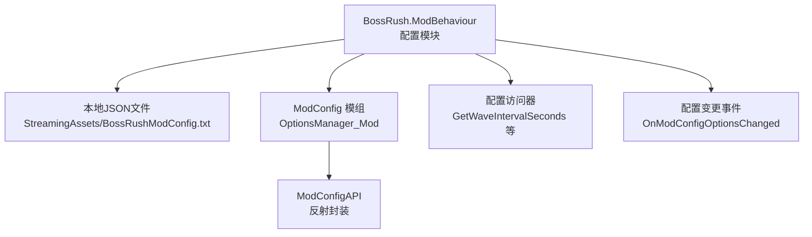
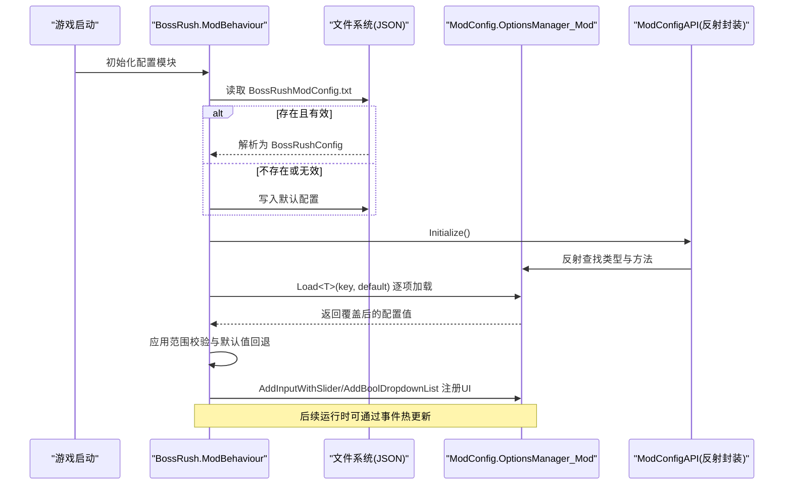
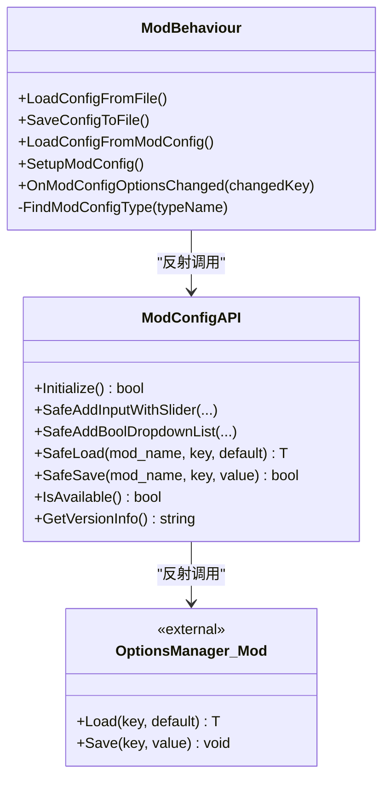
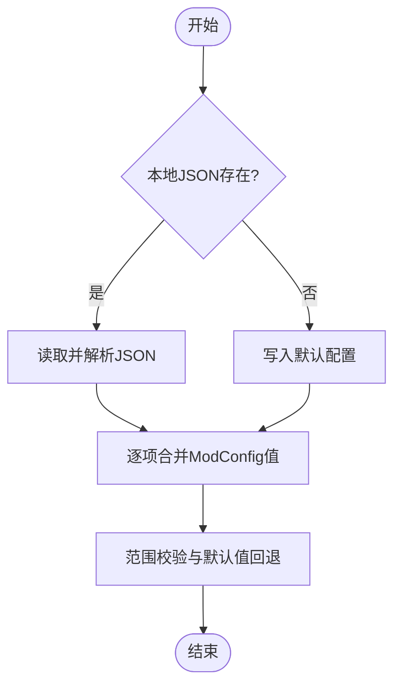
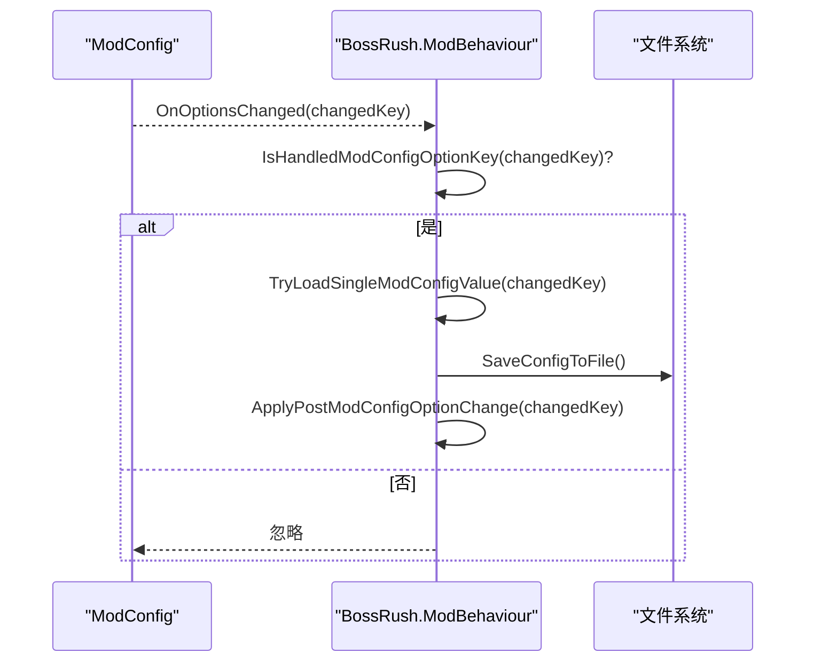
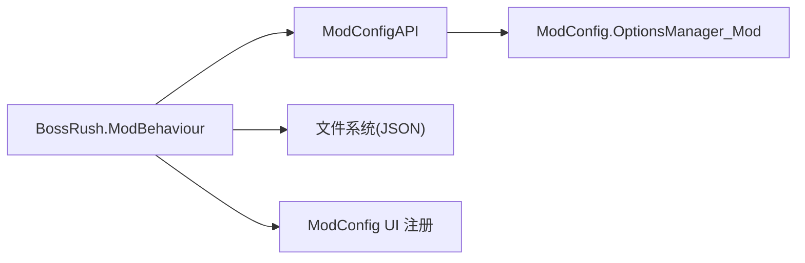

# 配置系统架构

<cite>
**本文引用的文件**
- [Config.cs](file://Config/Config.cs)
- [ModConfigApi.cs](file://ModConfigApi.cs)
- [LootBlacklist.json](file://Assets/Data/LootBlacklist.json)
</cite>

## 目录
1. [简介](#简介)
2. [项目结构](#项目结构)
3. [核心组件](#核心组件)
4. [架构总览](#架构总览)
5. [详细组件分析](#详细组件分析)
6. [依赖关系分析](#依赖关系分析)
7. [性能考量](#性能考量)
8. [故障排查指南](#故障排查指南)
9. [结论](#结论)
10. [附录](#附录)

## 简介
本文件系统性阐述 BossRush 配置系统的整体设计，包括：
- BossRushConfig 数据结构的层次组织与字段语义
- 配置加载优先级机制（本地 JSON 文件 → ModConfig 模组）
- 反射式配置发现与动态注册机制
- 配置路径管理、JSON 序列化/反序列化机制
- 初始化流程、错误处理策略与日志记录
- 扩展性设计与运行时配置变更同步

该配置系统以“本地持久化 + 外部 UI 配置”的双通道模式工作，既保证可移植性与可调试性，又提供友好的用户界面与热更新能力。

## 项目结构
BossRush 的配置相关代码主要分布在以下位置：
- Config/Config.cs：定义 BossRushConfig 数据结构、配置加载/保存、ModConfig 集成与事件处理、UI 配置项注册等
- ModConfigApi.cs：对 ModConfig 模组的反射调用进行安全封装，提供版本检查、方法探测、事件委托注册、配置读写等 API
- Assets/Data/LootBlacklist.json：示例 JSON 数据文件（非 BossRush 主配置，但体现项目中 JSON 使用方式）

图表来源
- [Config.cs:31-116](file://Config/Config.cs#L31-L116)
- [Config.cs:155-232](file://Config/Config.cs#L155-L232)
- [Config.cs:234-407](file://Config/Config.cs#L234-L407)
- [ModConfigApi.cs:92-154](file://ModConfigApi.cs#L92-L154)

章节来源
- [Config.cs:31-116](file://Config/Config.cs#L31-L116)
- [ModConfigApi.cs:92-154](file://ModConfigApi.cs#L92-L154)

## 核心组件
- BossRushConfig 数据结构：集中承载所有 BossRush 可调参数，支持 JSON 序列化/反序列化
- 配置路径管理：通过 Unity StreamingAssets 路径定位配置文件
- 本地 JSON 加载/保存：使用 JsonUtility 完成读取与写入，包含默认值回退与范围校验
- ModConfig 集成：通过反射查找并调用 ModConfig 的 OptionsManager_Mod.Load<T> 等方法，实现跨模组配置共享
- 配置变更事件：订阅 ModConfig 选项变更，实时同步到运行态并落盘
- 配置 UI 注册：将各配置项以滑条、布尔下拉、键位下拉等形式注册到 ModConfig 的 UI 中

章节来源
- [Config.cs:38-81](file://Config/Config.cs#L38-L81)
- [Config.cs:98-116](file://Config/Config.cs#L98-L116)
- [Config.cs:155-232](file://Config/Config.cs#L155-L232)
- [Config.cs:234-407](file://Config/Config.cs#L234-L407)
- [Config.cs:586-704](file://Config/Config.cs#L586-L704)
- [Config.cs:706-1041](file://Config/Config.cs#L706-L1041)
- [ModConfigApi.cs:92-154](file://ModConfigApi.cs#L92-L154)

## 架构总览
BossRush 配置系统采用“双源合并 + 事件驱动”的架构：
- 启动时优先从本地 JSON 文件加载配置；若不存在则创建默认配置并保存
- 随后尝试通过反射加载 ModConfig 中的同名键值，覆盖本地配置（实现“本地文件 → ModConfig 模组”的优先级）
- 运行时监听 ModConfig 的选项变更事件，增量更新对应配置项并写回本地文件
- 所有数值型配置在加载与更新时进行边界钳制，确保稳定性

图表来源
- [Config.cs:155-232](file://Config/Config.cs#L155-L232)
- [Config.cs:234-407](file://Config/Config.cs#L234-L407)
- [ModConfigApi.cs:92-154](file://ModConfigApi.cs#L92-L154)

## 详细组件分析

### BossRushConfig 数据结构
- 作用：集中定义 BossRush 的所有可配置项，便于 JSON 序列化/反序列化
- 关键字段举例：波次间隔、随机掉落开关、原版概率、交互点开启下一波、掉落箱掩体、无间炼狱每波 Boss 数、Boss 全局倍率、里程碑额外休息、Mode D 敌人数、禁用 Boss 列表、Boss 刷新因子、龙套装冲刺、成就快捷键、荒野号角狼模型、死亡亡魂系统、变异词条开关与数量等
- 复杂度：对象内包含基础类型、List<string>、Dictionary<string,float>，序列化开销较低，适合频繁读写

章节来源
- [Config.cs:38-81](file://Config/Config.cs#L38-L81)

### 配置路径管理
- 路径来源：Unity Application.streamingAssetsPath + “BossRushModConfig.txt”
- 容错：路径获取失败时返回 null，避免崩溃
- 目录创建：保存前自动创建必要目录，提升鲁棒性

章节来源
- [Config.cs:98-116](file://Config/Config.cs#L98-L116)
- [Config.cs:204-232](file://Config/Config.cs#L204-L232)

### JSON 序列化/反序列化机制
- 读取：JsonUtility.FromJson<BossRushConfig> 将 JSON 字符串反序列化为配置对象
- 写入：JsonUtility.ToJson(config, true) 将配置对象序列化为格式化 JSON 字符串
- 兼容性：缺失字段时使用默认值；旧格式兼容逻辑（如未包含某字段时赋予默认值）
- 异常处理：读写异常被捕获并记录日志，不中断主流程

章节来源
- [Config.cs:155-199](file://Config/Config.cs#L155-L199)
- [Config.cs:204-232](file://Config/Config.cs#L204-L232)

### 反射式配置发现与 ModConfig 集成
- 类型发现：遍历 AppDomain.CurrentDomain.GetAssemblies() 查找 ModConfig 相关类型
- 方法调用：通过反射获取 OptionsManager_Mod.Load<T> 泛型方法，按类型实例化后调用
- 键名约定：统一以 “BossRush_XXX” 形式作为键名，避免冲突
- 版本检查：ModConfigAPI 内部检查 VERSION 字段，确保 API 兼容
- 事件绑定：通过 AddOnOptionsChangedDelegate 订阅配置变更，实现热更新

图表来源
- [Config.cs:122-153](file://Config/Config.cs#L122-L153)
- [Config.cs:234-407](file://Config/Config.cs#L234-L407)
- [ModConfigApi.cs:92-154](file://ModConfigApi.cs#L92-L154)
- [ModConfigApi.cs:356-442](file://ModConfigApi.cs#L356-L442)

章节来源
- [Config.cs:122-153](file://Config/Config.cs#L122-L153)
- [Config.cs:234-407](file://Config/Config.cs#L234-L407)
- [ModConfigApi.cs:92-154](file://ModConfigApi.cs#L92-L154)
- [ModConfigApi.cs:356-442](file://ModConfigApi.cs#L356-L442)

### 配置加载优先级机制
- 第一优先级：本地 JSON 文件（BossRushModConfig.txt）
- 第二优先级：ModConfig 模组（通过反射加载同名键）
- 合并策略：先加载本地文件，再逐项用 ModConfig 的值覆盖；未找到键时保留本地值
- 默认值与范围校验：加载后对关键数值进行边界钳制，防止非法值影响运行

图表来源
- [Config.cs:155-232](file://Config/Config.cs#L155-L232)
- [Config.cs:234-407](file://Config/Config.cs#L234-L407)

章节来源
- [Config.cs:155-232](file://Config/Config.cs#L155-L232)
- [Config.cs:234-407](file://Config/Config.cs#L234-L407)

### 配置变更事件与热更新
- 事件来源：ModConfig 的选项变更回调
- 处理流程：过滤受支持的键 → 增量加载新值 → 写回本地文件 → 触发运行时生效逻辑（如重启倒计时、清理状态等）
- 特殊处理：波次间隔在倒计时过程中修改会静默重算下一波倒计时

图表来源
- [Config.cs:586-704](file://Config/Config.cs#L586-L704)
- [Config.cs:409-582](file://Config/Config.cs#L409-L582)

章节来源
- [Config.cs:586-704](file://Config/Config.cs#L586-L704)
- [Config.cs:409-582](file://Config/Config.cs#L409-L582)

### 配置 UI 注册
- 类型：滑条（数值）、布尔下拉（开关）、键位下拉（快捷键）
- 目的：将配置项暴露给 ModConfig 的 UI，方便玩家调整
- 容错：每个注册步骤独立 try-catch，单个失败不影响其他项注册

章节来源
- [Config.cs:706-1041](file://Config/Config.cs#L706-L1041)

### 配置访问器
- 提供统一的取值入口，内置范围钳制与默认值回退，确保调用方无需关心细节
- 示例：GetWaveIntervalSeconds、GetMilestoneRestBonusSeconds、GetUseWolfModelForWildHorn、IsDeathWraithSystemEnabled

章节来源
- [Config.cs:1045-1128](file://Config/Config.cs#L1045-L1128)

## 依赖关系分析
- 组件耦合：
  - BossRush.ModBehaviour 强依赖 ModConfigAPI 的反射封装，间接依赖 ModConfig 模组
  - 配置模块与文件系统通过 JsonUtility 解耦，便于替换存储后端
- 外部依赖：
  - Unity 运行时（Application.streamingAssetsPath、JsonUtility）
  - ModConfig 模组（可选，未安装时降级为仅本地 JSON）
- 潜在循环依赖：无直接循环；反射调用发生在运行时，降低编译期耦合

图表来源
- [Config.cs:155-232](file://Config/Config.cs#L155-L232)
- [Config.cs:234-407](file://Config/Config.cs#L234-L407)
- [ModConfigApi.cs:92-154](file://ModConfigApi.cs#L92-L154)

章节来源
- [Config.cs:155-232](file://Config/Config.cs#L155-L232)
- [Config.cs:234-407](file://Config/Config.cs#L234-L407)
- [ModConfigApi.cs:92-154](file://ModConfigApi.cs#L92-L154)

## 性能考量
- 反射调用集中在初始化阶段，运行时仅事件触发时少量反射，总体开销可控
- JSON 读写频率不高（启动与配置变更时），避免频繁 I/O
- 配置值访问器内置钳制，减少重复校验逻辑
- 建议：
  - 批量注册 UI 时保持 try-catch 粒度，避免单点失败影响整体
  - 对大字典/列表字段（如 bossInfiniteHellFactors）谨慎序列化，必要时拆分存储

[本节为通用指导，不直接分析具体文件]

## 故障排查指南
- 常见问题
  - 本地 JSON 文件不存在：首次运行会自动创建默认配置
  - ModConfig 未安装：反射查找失败，降级为仅本地 JSON；日志中会有提示
  - 配置值越界：加载与更新时会被钳制到合法范围
  - 事件未触发：确认已正确注册 AddOnOptionsChangedDelegate，且键名匹配
- 日志定位
  - 使用 DevLog 输出关键步骤（加载、保存、反射调用、事件处理）
  - 关注 “[BossRush]” 前缀日志，快速定位问题阶段
- 恢复步骤
  - 删除本地 JSON 文件，重启以重建默认配置
  - 检查 ModConfig 版本是否兼容（ModConfigAPI 内部有版本检查）

章节来源
- [Config.cs:155-232](file://Config/Config.cs#L155-L232)
- [Config.cs:234-407](file://Config/Config.cs#L234-L407)
- [Config.cs:586-704](file://Config/Config.cs#L586-L704)
- [ModConfigApi.cs:92-154](file://ModConfigApi.cs#L92-L154)

## 结论
BossRush 配置系统通过“本地 JSON + ModConfig 反射集成”的双通道设计，实现了高可用、可扩展、易维护的配置管理。其核心优势包括：
- 明确的加载优先级与默认值回退，保障稳定性
- 反射式发现与动态注册，降低与外部模组的耦合度
- 事件驱动的运行时热更新，提升用户体验
- 完善的日志与错误处理，便于问题定位与修复

建议在后续迭代中继续强化：
- 配置项文档与校验规则自动化
- 多语言 UI 文案的统一管理
- 配置变更的回滚与审计能力

[本节为总结性内容，不直接分析具体文件]

## 附录
- 示例 JSON 文件参考：LootBlacklist.json（展示项目中 JSON 结构与精度控制）
- 配置项清单与范围：参见 BossRushConfig 字段定义与加载时的钳制逻辑

章节来源
- [Assets/Data/LootBlacklist.json:1-23](file://Assets/Data/LootBlacklist.json#L1-L23)
- [Config.cs:38-81](file://Config/Config.cs#L38-L81)
- [Config.cs:234-407](file://Config/Config.cs#L234-L407)