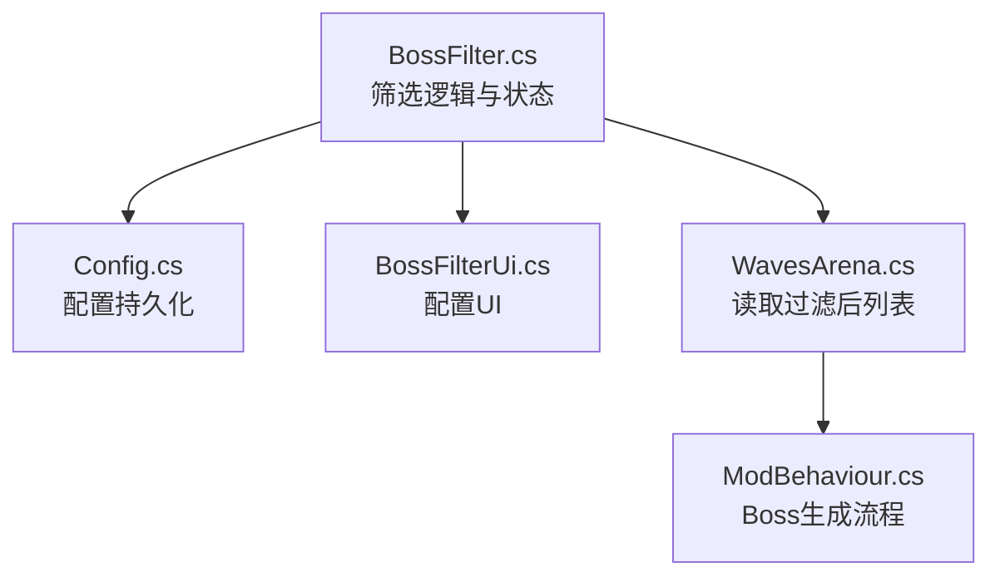
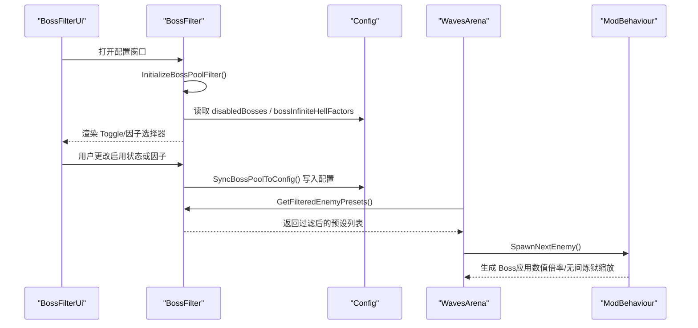
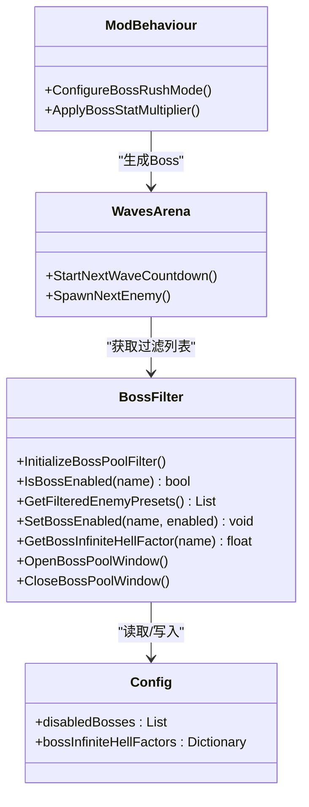

# Boss池筛选配置

<cite>
**本文引用的文件**
- [BossFilter.cs](file://BossFilter/BossFilter.cs)
- [BossFilterUi.cs](file://BossFilter/BossFilterUi.cs)
- [Config.cs](file://Config/Config.cs)
- [WavesArena.cs](file://WavesArena/WavesArena.cs)
- [ModBehaviour.cs](file://ModBehaviour.cs)
- [boss-filter.md（中文）](file://wiki-site/docs/en/systems/boss-filter.md)
</cite>

## 目录
1. [简介](#简介)
2. [项目结构](#项目结构)
3. [核心组件](#核心组件)
4. [架构总览](#架构总览)
5. [详细组件分析](#详细组件分析)
6. [依赖关系分析](#依赖关系分析)
7. [性能考虑](#性能考虑)
8. [故障排查指南](#故障排查指南)
9. [结论](#结论)
10. [附录](#附录)

## 简介
本模块提供 Boss 池筛选能力，支持：
- 禁用特定 Boss（disabledBosses），使其不出现在任何模式的 Boss 池中。
- 为无间炼狱模式设置每个 Boss 的刷新因子（bossInfiniteHellFactors），以调整出现概率与难度体验。
- 通过内置 UI 面板（Ctrl+F10）进行可视化配置，并持久化到配置文件。

该功能覆盖标准 BossRush、白手起家、划地为营、血猎追击等模式；无间炼狱额外支持按 Boss 单独调权。

## 项目结构
- BossFilter/BossFilter.cs：筛选逻辑、状态管理、缓存、配置同步、无间炼狱因子调节。
- BossFilter/BossFilterUi.cs：Boss 池配置窗口 UI（标题栏、工具栏、滚动列表、统计信息）。
- Config/Config.cs：配置数据结构与本地文件读写（包含 disabledBosses 与 bossInfiniteHellFactors）。
- WavesArena/WavesArena.cs：波次流程中读取过滤后的 Boss 列表，用于预告与生成。
- ModBehaviour.cs：Boss 生成流程、前期强力 Boss 排除、数值倍率应用等。
- wiki-site/docs/en/systems/boss-filter.md：官方文档说明（含打开方式、刷新规则、数据保存）。

图表来源
- [BossFilter.cs:91-158](file://BossFilter/BossFilter.cs#L91-L158)
- [Config.cs:41-81](file://Config/Config.cs#L41-L81)
- [WavesArena.cs:128-159](file://WavesArena/WavesArena.cs#L128-L159)
- [ModBehaviour.cs:1027-1198](file://ModBehaviour.cs#L1027-L1198)

章节来源
- [BossFilter.cs:91-158](file://BossFilter/BossFilter.cs#L91-L158)
- [Config.cs:41-81](file://Config/Config.cs#L41-L81)
- [WavesArena.cs:128-159](file://WavesArena/WavesArena.cs#L128-L159)
- [ModBehaviour.cs:1027-1198](file://ModBehaviour.cs#L1027-L1198)

## 核心组件
- 筛选状态与缓存
  - 维护每个 Boss 的启用状态字典，并提供过滤后的预设列表缓存，避免重复计算。
- 配置加载与同步
  - 启动时从配置加载禁用的 Boss 与无间炼狱因子；修改后写回配置文件。
- 无间炼狱因子编辑
  - 提供“极低/低/中/高/极高”五档因子选择器，默认值为 1.0（中等）。
- UI 集成
  - 使用官方 UI Prefab 创建面板，支持全选/全不选、切换至因子编辑模式、滚动列表展示。

章节来源
- [BossFilter.cs:29-83](file://BossFilter/BossFilter.cs#L29-L83)
- [BossFilter.cs:91-158](file://BossFilter/BossFilter.cs#L91-L158)
- [BossFilter.cs:275-327](file://BossFilter/BossFilter.cs#L275-L327)
- [BossFilterUi.cs:14-73](file://BossFilter/BossFilterUi.cs#L14-L73)

## 架构总览
Boss 池筛选在初始化阶段构建启用状态与因子映射，后续由波次系统读取过滤后的 Boss 列表进行生成。无间炼狱模式下，每个 Boss 的刷新因子会参与权重计算，影响出现频率与整体难度体验。

图表来源
- [BossFilter.cs:91-158](file://BossFilter/BossFilter.cs#L91-L158)
- [BossFilter.cs:275-327](file://BossFilter/BossFilter.cs#L275-L327)
- [WavesArena.cs:128-159](file://WavesArena/WavesArena.cs#L128-L159)
- [ModBehaviour.cs:1027-1198](file://ModBehaviour.cs#L1027-L1198)

## 详细组件分析

### 被禁用的 Boss 列表（disabledBosses）
- 作用范围
  - 禁用后，该 Boss 不会出现在标准 BossRush、白手起家、划地为营、血猎追击等模式的 Boss 池中。
- 配置方法
  - 在游戏内按 Ctrl+F10 打开 Boss 池配置窗口，取消勾选对应 Boss 即可；或在配置文件中维护字符串列表。
- 工作原理
  - 初始化时从 enemyPresets 构建所有 Boss 的启用状态，默认全部启用；随后将配置中的 disabledBosses 标记为禁用。
  - 获取过滤列表时，仅保留 IsBossEnabled(name) 为 true 的预设。
- 影响
  - 直接减少可出现的 Boss 种类，缩小掉落目标时可提高效率；过度禁用可能导致某些模式无可用 Boss。

章节来源
- [BossFilter.cs:91-158](file://BossFilter/BossFilter.cs#L91-L158)
- [BossFilter.cs:164-232](file://BossFilter/BossFilter.cs#L164-L232)
- [boss-filter.md（中文）:1-34](file://wiki-site/docs/en/systems/boss-filter.md#L1-L34)

### Boss 无间炼狱刷新因子（bossInfiniteHellFactors）
- 作用范围
  - 仅在无间炼狱模式生效，用于调整各 Boss 的出现权重。
- 配置方法
  - 在 Boss 池配置窗口切换到“无间炼狱因子”模式，使用左右箭头按钮为每个 Boss 选择“极低/低/中/高/极高”。
  - 也可在配置文件中维护键值对（Boss名称 -> 浮点因子）。
- 工作原理
  - 初始化时为未配置的 Boss 设置默认因子 1.0（中等）。
  - 保存时仅记录非默认值（非 1.0）的因子，减小配置体积。
  - 获取单个 Boss 的因子时，若不存在则返回 1.0。
- 影响
  - 因子越大，出现概率越高；设为 0 等同于禁用。
  - 提高因子会增加该 Boss 的出现频率，可能提升整体难度；降低因子可减少其出现，缓解压力。

章节来源
- [BossFilter.cs:62-83](file://BossFilter/BossFilter.cs#L62-L83)
- [BossFilter.cs:129-145](file://BossFilter/BossFilter.cs#L129-L145)
- [BossFilter.cs:330-346](file://BossFilter/BossFilter.cs#L330-L346)
- [boss-filter.md（中文）:20-26](file://wiki-site/docs/en/systems/boss-filter.md#L20-L26)

### Boss 池筛选的工作原理与配置语法
- 工作流程
  - 初始化：从 enemyPresets 收集所有 Boss，默认启用；加载配置中的禁用列表与因子。
  - 过滤：调用 GetFilteredEnemyPresets() 返回启用状态的预设集合，内部使用缓存以减少开销。
  - 更新：当启用状态或因子变化时，标记缓存失效并在下次需要时重新计算。
  - 持久化：SyncBossPoolToConfig() 将当前状态写回配置文件。
- 配置语法
  - disabledBosses：字符串列表，元素为 Boss 的名称（与预设 name 匹配）。
  - bossInfiniteHellFactors：键值对字典，key 为 Boss 名称，value 为浮点因子（默认 1.0）。
- 刷新规则
  - 模组更新或 Boss 池重建后，筛选器会基于当前预设重新构建列表。
  - 运行时临时生成的杂兵预设会被自动剔除，避免污染 Boss 列表。

章节来源
- [BossFilter.cs:91-158](file://BossFilter/BossFilter.cs#L91-L158)
- [BossFilter.cs:197-232](file://BossFilter/BossFilter.cs#L197-L232)
- [BossFilter.cs:275-327](file://BossFilter/BossFilter.cs#L275-L327)
- [boss-filter.md（中文）:27-33](file://wiki-site/docs/en/systems/boss-filter.md#L27-L33)

### Boss 名称映射表
- 映射依据
  - 筛选器使用预设的 name 作为唯一标识；显示名 displayName 用于 UI 展示。
  - 部分 Boss 通过特殊识别逻辑（如龙裔、龙王、大兴兴等）确保不被清理或误判。
- 常见 Boss 名称参考（示例）
  - 龙裔遗族：DragonDescendant
  - 焚天龙皇：boss_dragonking
  - 口口口口/四骑士：Cname_StormBoss1~Cname_StormBoss5
  - 幽灵女巫：Phantom Witch（通过专门生成路径处理）
  - 大兴兴/小兴兴：通过 displayName 或 name 中包含 “daxing” 识别
- 注意
  - 实际名称需与游戏内预设 name 一致；若不确定，可在配置窗口查看 displayName 对照。

章节来源
- [WavesArena.cs:42-66](file://WavesArena/WavesArena.cs#L42-L66)
- [ModBehaviour.cs:1027-1198](file://ModBehaviour.cs#L1027-L1198)
- [ModBehaviour.cs:1282-1310](file://ModBehaviour.cs#L1282-L1310)

### 常用筛选组合示例
- 专注练习单一 Boss
  - 禁用除目标 Boss 外的所有 Boss；无间炼狱中将其他 Boss 因子设为 0。
- 降低高难 Boss 出现频率
  - 将高难 Boss（如焚天龙皇、幽灵女巫）因子设为 0.5 或更低；必要时加入禁用列表。
- 高效刷特定掉落
  - 缩小 Boss 池至目标 Boss 及其相关变种；保持因子为 1.0 或略增以提高出现概率。
- 平衡难度与多样性
  - 保留多数 Boss，仅禁用个别过于烦人的；将部分 Boss 因子调整为 0.75~1.25 微调。

[本节为概念性指导，无需代码引用]

### 配置对出现频率与难度的影响
- 出现频率
  - disabledBosses 直接移除候选；bossInfiniteHellFactors 改变权重比例。
  - 因子 2.0 使出现概率翻倍；0.5 减半；0 等同于禁用。
- 难度体验
  - 提高因子会增加该 Boss 的出现次数，可能提升整体难度；降低因子可减少压力。
  - 结合全局数值倍率（bossStatMultiplier）与无间炼狱缩放，进一步影响战斗强度。

章节来源
- [boss-filter.md（中文）:20-26](file://wiki-site/docs/en/systems/boss-filter.md#L20-L26)
- [ModBehaviour.cs:1131-1139](file://ModBehaviour.cs#L1131-L1139)

### Boss 池管理的最佳实践
- 渐进式调整
  - 先禁用明显不适的 Boss，再逐步调整因子，观察体验变化。
- 避免极端配置
  - 不要将所有 Boss 禁用或因子设为 0，以免模式无法推进。
- 利用缓存机制
  - 批量修改后统一保存，减少频繁刷新带来的性能开销。
- 关注刷新规则
  - 模组更新或 Boss 池重建后检查筛选器是否按预期工作。

[本节为概念性指导，无需代码引用]

### 性能优化建议
- 缓存过滤结果
  - GetFilteredEnemyPresets() 使用 _filteredPresetsCache 与脏标记，避免每次调用都重新计算。
- 延迟刷新
  - 仅在启用状态或因子变化时标记缓存失效，并在下一次需要时重建。
- UI 对象复用
  - 使用官方 UI Prefab（Button、ScrollRect）减少自定义开销。
- 合理保存配置
  - 仅保存非默认因子，减小配置文件体积与解析成本。

章节来源
- [BossFilter.cs:40-42](file://BossFilter/BossFilter.cs#L40-L42)
- [BossFilter.cs:197-232](file://BossFilter/BossFilter.cs#L197-L232)
- [BossFilter.cs:301-318](file://BossFilter/BossFilter.cs#L301-L318)
- [BossFilterUi.cs:14-73](file://BossFilter/BossFilterUi.cs#L14-L73)

### 与 BossFilter 界面的集成使用方法
- 打开方式
  - 按 Ctrl+F10 打开 Boss 池配置窗口。
- 基本操作
  - 勾选/取消勾选 Boss 以启用/禁用。
  - 点击“全选”恢复全部启用；点击“全不选”禁用全部。
  - 点击“无间炼狱因子”进入因子编辑模式，使用左右箭头调整等级。
- 模式切换
  - 因子模式下，“全选”变为“重置”，“无间炼狱因子”变为“返回”。
- 关闭窗口
  - 点击关闭按钮或再次按快捷键退出；输入将被恢复。

章节来源
- [BossFilter.cs:352-424](file://BossFilter/BossFilter.cs#L352-L424)
- [BossFilterUi.cs:14-73](file://BossFilter/BossFilterUi.cs#L14-L73)
- [boss-filter.md（中文）:8-10](file://wiki-site/docs/en/systems/boss-filter.md#L8-L10)

## 依赖关系分析
- BossFilter 依赖
  - enemyPresets：Boss 预设列表，用于构建筛选状态与 UI。
  - config：配置对象，提供 disabledBosses 与 bossInfiniteHellFactors。
  - L10n：本地化文本，用于 UI 显示。
- 下游消费
  - WavesArena：读取过滤后的 Boss 列表用于预告与生成。
  - ModBehaviour：生成 Boss 时应用数值倍率与无间炼狱缩放。

图表来源
- [BossFilter.cs:91-158](file://BossFilter/BossFilter.cs#L91-L158)
- [Config.cs:41-81](file://Config/Config.cs#L41-L81)
- [WavesArena.cs:128-159](file://WavesArena/WavesArena.cs#L128-L159)
- [ModBehaviour.cs:252-282](file://ModBehaviour.cs#L252-L282)

章节来源
- [BossFilter.cs:91-158](file://BossFilter/BossFilter.cs#L91-L158)
- [Config.cs:41-81](file://Config/Config.cs#L41-L81)
- [WavesArena.cs:128-159](file://WavesArena/WavesArena.cs#L128-L159)
- [ModBehaviour.cs:252-282](file://ModBehaviour.cs#L252-L282)

## 性能考虑
- 过滤缓存
  - 使用 _filteredPresetsCache 与 _filteredPresetsCacheDirty 标志，避免重复过滤。
- UI 对象管理
  - 使用官方 Prefab 减少自定义布局开销；按需销毁与重建内容容器。
- 配置保存
  - 仅保存非默认因子，减少 JSON 体积与解析时间。
- 运行时清理
  - 自动剔除 Mode E/F 临时杂兵预设，防止 Boss 列表膨胀。

章节来源
- [BossFilter.cs:40-42](file://BossFilter/BossFilter.cs#L40-L42)
- [BossFilter.cs:197-232](file://BossFilter/BossFilter.cs#L197-L232)
- [BossFilter.cs:301-318](file://BossFilter/BossFilter.cs#L301-L318)
- [boss-filter.md（中文）:27-30](file://wiki-site/docs/en/systems/boss-filter.md#L27-L30)

## 故障排查指南
- 无法打开配置窗口
  - 确认 enemyPresets 已初始化；若为空，尝试先进入游戏触发初始化。
- 配置未生效
  - 检查配置文件路径与权限；确认 disabledBosses 名称与预设 name 一致。
- 因子未保存
  - 确认已切换到因子模式并调整；保存时会忽略默认值 1.0。
- Boss 未出现
  - 检查是否被禁用或因子设为 0；确认未被前期强力 Boss 排除规则影响。
- 日志定位
  - 查看 DevLog 输出，搜索 “[BossRush]” 关键字，定位初始化、保存、生成等环节错误。

章节来源
- [BossFilter.cs:352-424](file://BossFilter/BossFilter.cs#L352-L424)
- [BossFilter.cs:275-327](file://BossFilter/BossFilter.cs#L275-L327)
- [WavesArena.cs:42-66](file://WavesArena/WavesArena.cs#L42-L66)

## 结论
Boss 池筛选配置提供了灵活的 Boss 管理与难度调节能力。通过禁用 Boss 与调整无间炼狱因子，玩家可定制个性化体验。配合缓存与 UI 优化，系统在易用性与性能之间取得平衡。建议根据实际需求渐进调整，并关注刷新规则与配置持久化。

[本节为总结性内容，无需代码引用]

## 附录
- 快速参考
  - 打开配置：Ctrl+F10
  - 禁用 Boss：取消勾选
  - 调整因子：进入因子模式，使用左右箭头选择等级
  - 保存配置：关闭窗口时自动保存
- 注意事项
  - 因子 0 等同于禁用；默认因子为 1.0
  - 模组更新或 Boss 池重建后，筛选器会重新构建列表

[本节为补充信息，无需代码引用]