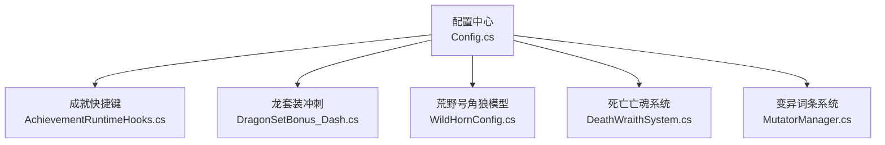
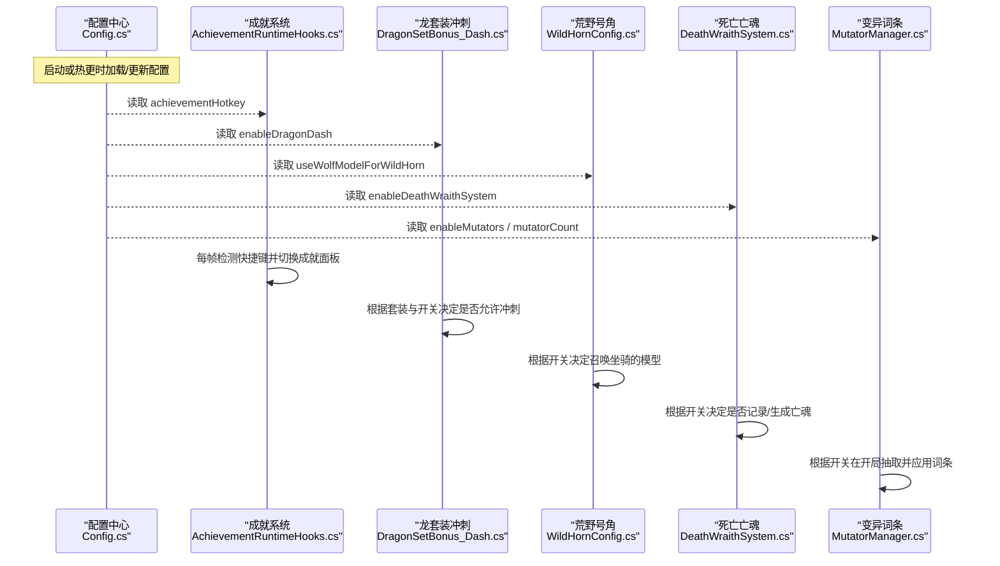
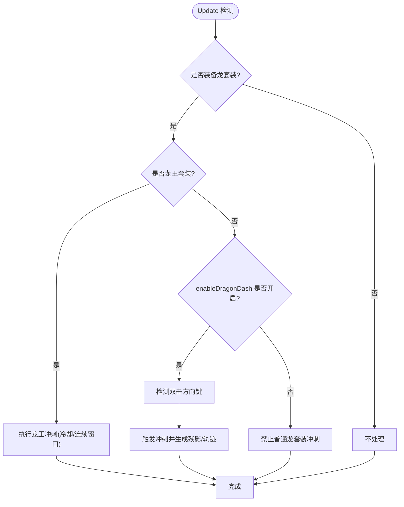
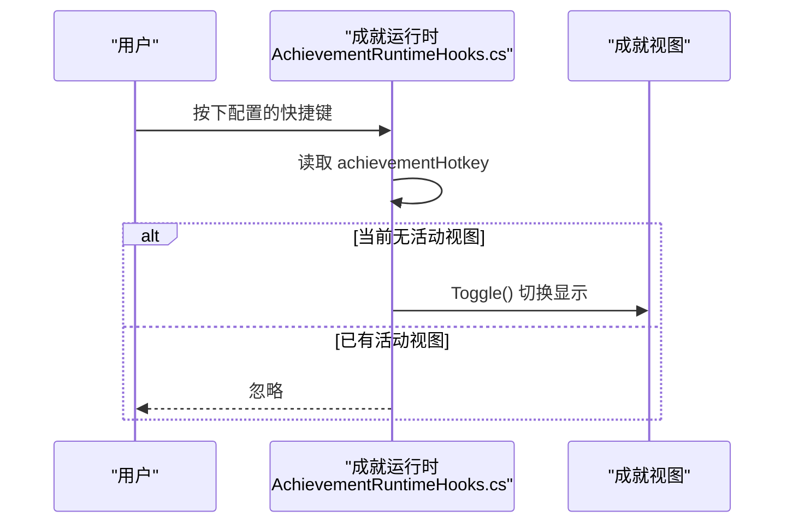
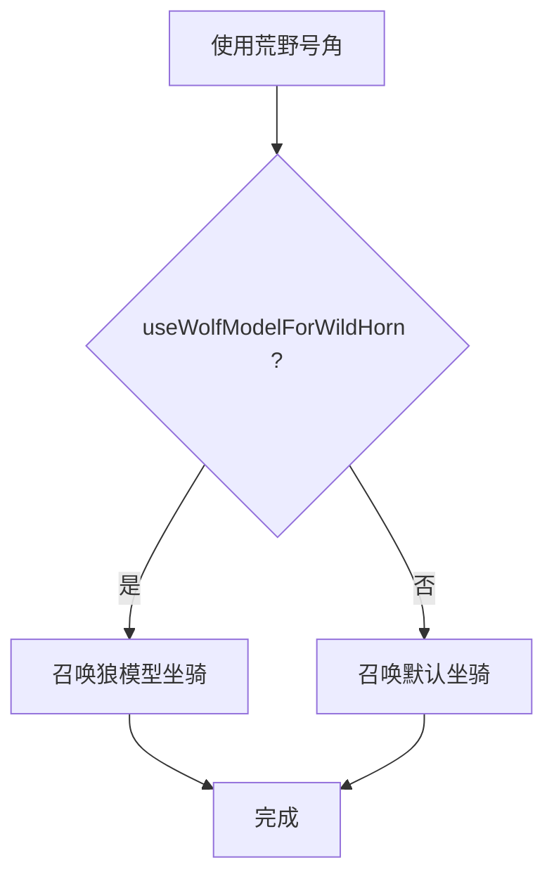
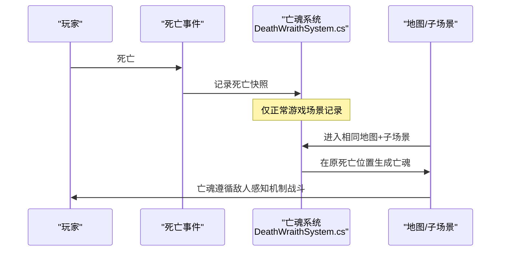
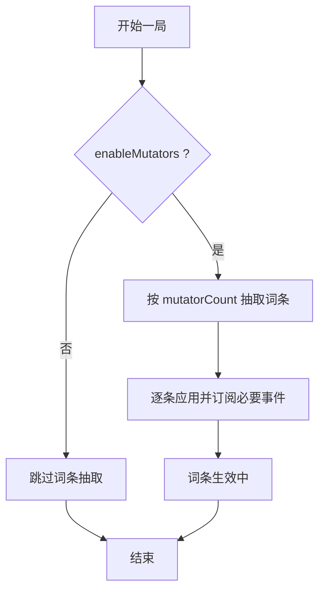
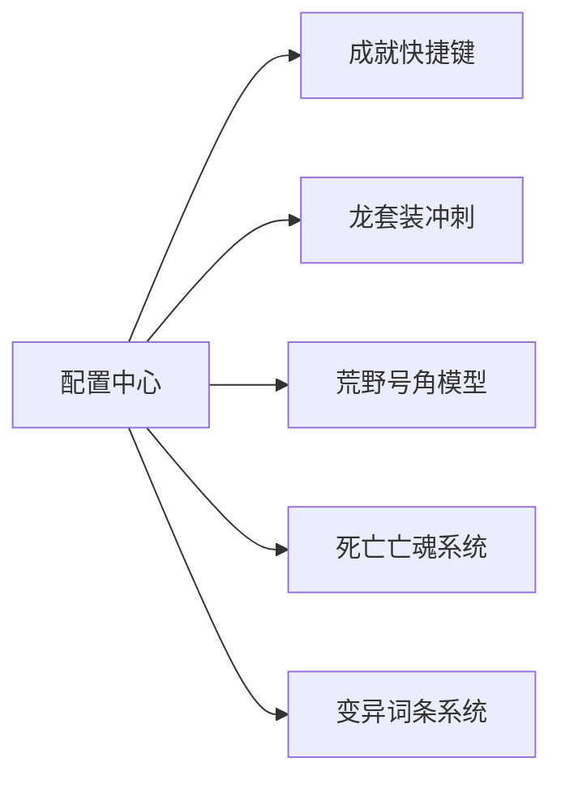

# 功能开关配置

<cite>
**本文引用的文件**
- [Config.cs](file://Config/Config.cs)
- [AchievementRuntimeHooks.cs](file://Achievement/AchievementRuntimeHooks.cs)
- [DragonSetBonus_Dash.cs](file://Integration/Bonus/DragonSetBonus_Dash.cs)
- [WildHornConfig.cs](file://Integration/Items/WildHornConfig.cs)
- [DeathWraithSystem.cs](file://Integration/DeathWraith/DeathWraithSystem.cs)
- [MutatorManager.cs](file://Integration/Mutators/MutatorManager.cs)
- [v2.0.3.md](file://wiki-site/docs/en/changelog/v2.0.3.md)
- [death-wraith.md](file://wiki-site/docs/en/systems/death-wraith.md)
- [mutators.md](file://wiki-site/docs/en/systems/mutators.md)
</cite>

## 目录
1. [简介](#简介)
2. [项目结构](#项目结构)
3. [核心组件](#核心组件)
4. [架构总览](#架构总览)
5. [详细组件分析](#详细组件分析)
6. [依赖关系分析](#依赖关系分析)
7. [性能考量](#性能考量)
8. [故障排查指南](#故障排查指南)
9. [结论](#结论)
10. [附录](#附录)

## 简介
本文件聚焦 BossRush 模组中的关键功能开关，围绕以下五个配置项进行系统化说明：
- 龙套装冲刺功能（enableDragonDash）
- 成就界面快捷键（achievementHotkey）
- 荒野号角狼模型（useWolfModelForWildHorn）
- 死亡亡魂系统（enableDeathWraithSystem）
- 变异词条系统（enableMutators）

文档将解释每个开关的功能作用、启用条件、禁用后果，并给出组合最佳实践与性能建议，同时以图示展示开关对游戏行为的具体影响。

## 项目结构
BossRush 模组的配置入口集中在配置模块中，运行时通过各子系统读取配置并改变行为。关键路径如下：
- 配置定义与加载：Config.cs
- 成就快捷键：AchievementRuntimeHooks.cs
- 龙套装冲刺：DragonSetBonus_Dash.cs
- 荒野号角坐骑模型：WildHornConfig.cs
- 死亡亡魂系统：DeathWraithSystem.cs
- 变异词条系统：MutatorManager.cs

**图表来源**
- [Config.cs:64-80](file://Config/Config.cs#L64-L80)
- [AchievementRuntimeHooks.cs:17-38](file://Achievement/AchievementRuntimeHooks.cs#L17-L38)
- [DragonSetBonus_Dash.cs:63-98](file://Integration/Bonus/DragonSetBonus_Dash.cs#L63-L98)
- [WildHornConfig.cs:248-295](file://Integration/Items/WildHornConfig.cs#L248-L295)
- [DeathWraithSystem.cs:187-200](file://Integration/DeathWraith/DeathWraithSystem.cs#L187-L200)
- [MutatorManager.cs:71-134](file://Integration/Mutators/MutatorManager.cs#L71-L134)

**章节来源**
- [Config.cs:64-80](file://Config/Config.cs#L64-L80)

## 核心组件
- 配置中心（Config.cs）
  - 集中管理所有开关的默认值、持久化与热更新。
  - 支持从本地配置文件与 ModConfig 动态加载，并在变更时触发后续处理。
- 成就快捷键（AchievementRuntimeHooks.cs）
  - 每帧检测配置的快捷键，打开/关闭成就面板。
- 龙套装冲刺（DragonSetBonus_Dash.cs）
  - 根据是否装备龙王套装与普通龙套装，分别实现不同冲刺逻辑；普通龙套装受 enableDragonDash 控制。
- 荒野号角狼模型（WildHornConfig.cs）
  - 提供物品配置与本地化；坐骑模型选择由 useWolfModelForWildHorn 控制。
- 死亡亡魂系统（DeathWraithSystem.cs）
  - 记录玩家死亡信息，下次进入相同子场景时在原位置生成“亡魂”；可被配置开关整体启停。
- 变异词条系统（MutatorManager.cs）
  - 每局开始随机抽取若干词条并应用全局效果；可通过 enableMutators 与 mutatorCount 控制。

**章节来源**
- [Config.cs:64-80](file://Config/Config.cs#L64-L80)
- [AchievementRuntimeHooks.cs:17-38](file://Achievement/AchievementRuntimeHooks.cs#L17-L38)
- [DragonSetBonus_Dash.cs:63-98](file://Integration/Bonus/DragonSetBonus_Dash.cs#L63-L98)
- [WildHornConfig.cs:248-295](file://Integration/Items/WildHornConfig.cs#L248-L295)
- [DeathWraithSystem.cs:187-200](file://Integration/DeathWraith/DeathWraithSystem.cs#L187-L200)
- [MutatorManager.cs:71-134](file://Integration/Mutators/MutatorManager.cs#L71-L134)

## 架构总览
下图展示了配置中心与各子系统之间的交互关系，以及开关如何影响运行时行为。

**图表来源**
- [Config.cs:365-396](file://Config/Config.cs#L365-L396)
- [AchievementRuntimeHooks.cs:17-38](file://Achievement/AchievementRuntimeHooks.cs#L17-L38)
- [DragonSetBonus_Dash.cs:63-98](file://Integration/Bonus/DragonSetBonus_Dash.cs#L63-L98)
- [WildHornConfig.cs:248-295](file://Integration/Items/WildHornConfig.cs#L248-L295)
- [DeathWraithSystem.cs:187-200](file://Integration/DeathWraith/DeathWraithSystem.cs#L187-L200)
- [MutatorManager.cs:71-134](file://Integration/Mutators/MutatorManager.cs#L71-L134)

## 详细组件分析

### 龙套装冲刺功能（enableDragonDash）
- 功能作用
  - 控制普通龙套装的冲刺能力是否可用；龙王套装的冲刺逻辑独立且始终可用。
  - 双击方向键触发冲刺，龙王套装支持连续冲刺窗口与熔浆轨迹。
- 启用条件
  - 装备普通龙套装时，需 enableDragonDash 为 true。
  - 龙王套装不受此开关限制。
- 禁用后果
  - 普通龙套装无法触发冲刺；龙王套装仍可使用其专属冲刺。
- 行为细节
  - 输入检测基于移动轴，兼容自定义按键。
  - 碰撞处理使用强制速度方式，配合物理系统。
  - 残影与特效在不同套装下有所差异。

**图表来源**
- [DragonSetBonus_Dash.cs:63-98](file://Integration/Bonus/DragonSetBonus_Dash.cs#L63-L98)
- [DragonSetBonus_Dash.cs:159-239](file://Integration/Bonus/DragonSetBonus_Dash.cs#L159-L239)
- [DragonSetBonus_Dash.cs:244-283](file://Integration/Bonus/DragonSetBonus_Dash.cs#L244-L283)

**章节来源**
- [DragonSetBonus_Dash.cs:63-98](file://Integration/Bonus/DragonSetBonus_Dash.cs#L63-L98)
- [DragonSetBonus_Dash.cs:159-239](file://Integration/Bonus/DragonSetBonus_Dash.cs#L159-L239)
- [DragonSetBonus_Dash.cs:244-283](file://Integration/Bonus/DragonSetBonus_Dash.cs#L244-L283)
- [v2.0.3.md:1-17](file://wiki-site/docs/en/changelog/v2.0.3.md#L1-L17)

### 成就界面快捷键（achievementHotkey）
- 功能作用
  - 设置打开/关闭成就界面的快捷键。
- 启用条件
  - 任意时刻按下配置的键即可切换成就面板。
- 禁用后果
  - 若未设置有效键值，将无法通过快捷键打开成就面板。
- 行为细节
  - 默认键为 L；支持多种 KeyCode 选项。
  - 仅在无活动视图时切换，避免冲突。

**图表来源**
- [AchievementRuntimeHooks.cs:17-38](file://Achievement/AchievementRuntimeHooks.cs#L17-L38)

**章节来源**
- [AchievementRuntimeHooks.cs:17-38](file://Achievement/AchievementRuntimeHooks.cs#L17-L38)

### 荒野号角狼模型（useWolfModelForWildHorn）
- 功能作用
  - 控制使用荒野号角召唤的坐骑是否使用狼模型。
- 启用条件
  - 当 useWolfModelForWildHorn 为 true 时，召唤的坐骑呈现狼形态。
- 禁用后果
  - 保持默认坐骑形态（非狼）。
- 行为细节
  - 物品配置包含冷却时间、本地化文本与标签等；模型选择由配置驱动。

**图表来源**
- [WildHornConfig.cs:248-295](file://Integration/Items/WildHornConfig.cs#L248-L295)

**章节来源**
- [WildHornConfig.cs:248-295](file://Integration/Items/WildHornConfig.cs#L248-L295)

### 死亡亡魂系统（enableDeathWraithSystem）
- 功能作用
  - 在正常游戏场景中记录玩家死亡时的外观、装备、语音与武器状态；下次回到同一地图与子场景时，在死亡位置生成“亡魂”。
- 启用条件
  - 仅在工作于正常游戏场景时生效；菜单或加载屏不触发。
- 禁用后果
  - 停止记录与生成亡魂；若已存在记录，关闭时会清理当前保存的亡魂数据。
- 行为细节
  - 亡魂强度分三档（弱/均衡/强），依据携带物品价值占总财富比例计算。
  - 亡魂不会掉落战利品箱；击杀后清除该记录。

**图表来源**
- [DeathWraithSystem.cs:187-200](file://Integration/DeathWraith/DeathWraithSystem.cs#L187-L200)
- [death-wraith.md:1-56](file://wiki-site/docs/en/systems/death-wraith.md#L1-L56)

**章节来源**
- [DeathWraithSystem.cs:187-200](file://Integration/DeathWraith/DeathWraithSystem.cs#L187-L200)
- [death-wraith.md:1-56](file://wiki-site/docs/en/systems/death-wraith.md#L1-L56)

### 变异词条系统（enableMutators）
- 功能作用
  - 每局开始时从词条池中随机抽取若干词条并立即应用到整局游戏中，涵盖敌人与环境规则等。
- 启用条件
  - enableMutators 为 true 时，标准模式、无间炼狱、白手起家、阵营战争、血色狩猎均会抽取词条；僵尸模式不受此系统影响。
- 禁用后果
  - 不开启时，模式不再在开局抽取词条；若中途关闭，会清空当前局已应用的词条。
- 行为细节
  - 词条数量由 mutatorCount 控制（范围 1–10，默认 3）。
  - 管理器负责抽取、应用、清理与全局修改器维护。

**图表来源**
- [MutatorManager.cs:71-134](file://Integration/Mutators/MutatorManager.cs#L71-L134)
- [mutators.md:1-34](file://wiki-site/docs/en/systems/mutators.md#L1-L34)

**章节来源**
- [MutatorManager.cs:71-134](file://Integration/Mutators/MutatorManager.cs#L71-L134)
- [mutators.md:1-34](file://wiki-site/docs/en/systems/mutators.md#L1-L34)

## 依赖关系分析
- 配置中心依赖各子系统提供的行为接口，并通过反射与事件机制实现热更新。
- 成就系统依赖配置中的键值映射到 Unity KeyCode。
- 龙套装冲刺依赖套装激活状态与配置开关共同判定。
- 荒野号角依赖配置以切换坐骑模型。
- 死亡亡魂系统依赖配置开关以启停事件绑定与状态清理。
- 变异词条系统依赖配置开关以决定是否抽取与应用词条。

**图表来源**
- [Config.cs:365-396](file://Config/Config.cs#L365-L396)
- [Config.cs:522-574](file://Config/Config.cs#L522-L574)

**章节来源**
- [Config.cs:365-396](file://Config/Config.cs#L365-L396)
- [Config.cs:522-574](file://Config/Config.cs#L522-L574)

## 性能考量
- 龙套装冲刺
  - 残影采用轻量精灵与光源，避免复制完整角色模型；龙王套装额外产生熔浆区域，注意频繁冲刺可能增加特效开销。
  - 碰撞处理使用强制速度，减少复杂计算。
- 成就快捷键
  - 每帧检测按键，但逻辑简单，性能影响极低。
- 荒野号角狼模型
  - 模型切换不影响核心循环；主要开销在资源加载与实例化。
- 死亡亡魂系统
  - 采用内存缓存与延迟落盘策略，避免死亡帧同步序列化导致卡顿；关闭配置时会清理状态，防止残留。
- 变异词条系统
  - 条目抽取与清理集中管理，避免跨局泄漏；敌人死亡回调有重入守卫，防止同帧连锁触发造成卡顿或异常。

[本节为通用性能指导，不直接分析具体文件]

## 故障排查指南
- 成就快捷键无效
  - 检查 achievementHotkey 是否为有效键值；确认当前无活动视图遮挡。
  - 参考：[AchievementRuntimeHooks.cs:17-38](file://Achievement/AchievementRuntimeHooks.cs#L17-L38)
- 龙套装冲刺无法触发
  - 确认是否装备普通龙套装且 enableDragonDash 为 true；龙王套装不受此开关限制。
  - 参考：[DragonSetBonus_Dash.cs:63-98](file://Integration/Bonus/DragonSetBonus_Dash.cs#L63-L98)
- 荒野号角未召唤狼模型
  - 确认 useWolfModelForWildHorn 为 true；检查物品配置是否正确注册。
  - 参考：[WildHornConfig.cs:248-295](file://Integration/Items/WildHornConfig.cs#L248-L295)
- 死亡亡魂不出现或持续存在
  - 确认 enableDeathWraithSystem 为 true；若在菜单或加载屏死亡则不会记录；关闭配置会清理状态。
  - 参考：[DeathWraithSystem.cs:187-200](file://Integration/DeathWraith/DeathWraithSystem.cs#L187-L200)
- 变异词条未生效或被意外保留
  - 确认 enableMutators 为 true；退出局时应调用 RemoveAll 清理；关闭配置会清空当前局词条。
  - 参考：[MutatorManager.cs:71-134](file://Integration/Mutators/MutatorManager.cs#L71-L134)

**章节来源**
- [AchievementRuntimeHooks.cs:17-38](file://Achievement/AchievementRuntimeHooks.cs#L17-L38)
- [DragonSetBonus_Dash.cs:63-98](file://Integration/Bonus/DragonSetBonus_Dash.cs#L63-L98)
- [WildHornConfig.cs:248-295](file://Integration/Items/WildHornConfig.cs#L248-L295)
- [DeathWraithSystem.cs:187-200](file://Integration/DeathWraith/DeathWraithSystem.cs#L187-L200)
- [MutatorManager.cs:71-134](file://Integration/Mutators/MutatorManager.cs#L71-L134)

## 结论
- enableDragonDash：控制普通龙套装冲刺可用性；龙王套装冲刺独立且更强。
- achievementHotkey：自定义成就面板快捷键，便于快速查看进度。
- useWolfModelForWildHorn：切换荒野号角坐骑模型，提升视觉一致性。
- enableDeathWraithSystem：开启后增强挑战性与沉浸感；关闭可简化体验并避免额外开销。
- enableMutators：为多模式增加随机变数；关闭可稳定难度与预期。

合理组合这些开关可在玩法丰富度、性能与兼容性之间取得平衡。例如：在高配设备上开启全部以提升体验；在低配或追求稳定性的场景下关闭死亡亡魂与部分特效相关开关。

[本节为总结性内容，不直接分析具体文件]

## 附录
- 配置项速查
  - enableDragonDash：布尔，默认 true，控制普通龙套装冲刺。
  - achievementHotkey：整数（KeyCode），默认 L，成就面板快捷键。
  - useWolfModelForWildHorn：布尔，默认 true，荒野号角坐骑使用狼模型。
  - enableDeathWraithSystem：布尔，默认 true，死亡亡魂系统开关。
  - enableMutators：布尔，默认 true，变异词条系统开关。
  - mutatorCount：整数，范围 1–10，默认 3，每局抽取词条数量。

**章节来源**
- [Config.cs:64-80](file://Config/Config.cs#L64-L80)
- [mutators.md:27-31](file://wiki-site/docs/en/systems/mutators.md#L27-L31)