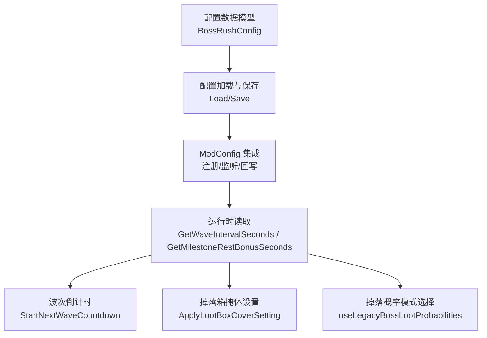
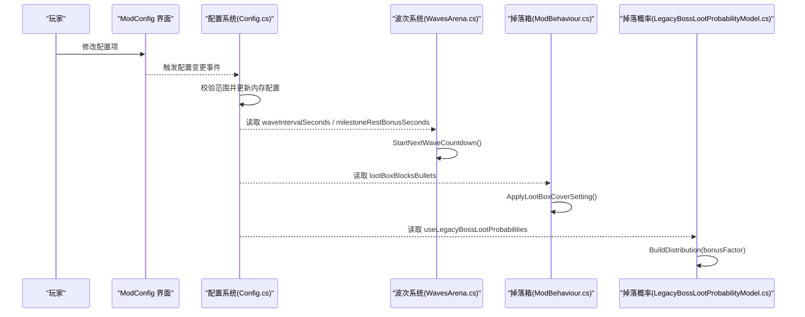
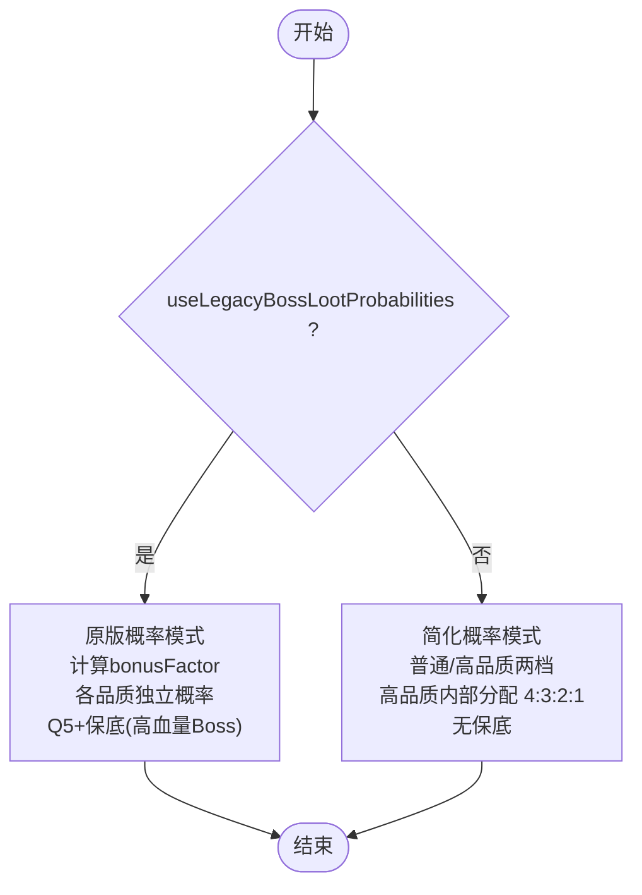
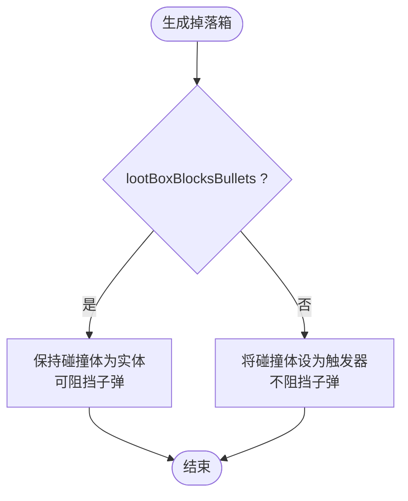
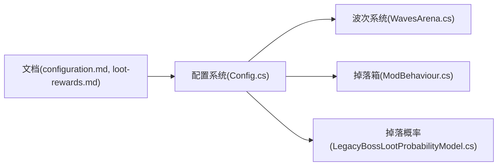

# 核心游戏配置

<cite>
**本文引用的文件**
- [Config.cs](file://Config/Config.cs)
- [WavesArena.cs](file://WavesArena/WavesArena.cs)
- [ModBehaviour.cs](file://ModBehaviour.cs)
- [LegacyBossLootProbabilityModel.cs](file://LootAndRewards/LegacyBossLootProbabilityModel.cs)
- [configuration.md](file://wiki-site/docs/en/systems/configuration.md)
- [loot-rewards.md](file://wiki-site/docs/en/systems/loot-rewards.md)
</cite>

## 目录
1. [简介](#简介)
2. [项目结构](#项目结构)
3. [核心组件](#核心组件)
4. [架构总览](#架构总览)
5. [详细组件分析](#详细组件分析)
6. [依赖关系分析](#依赖关系分析)
7. [性能考量](#性能考量)
8. [故障排查指南](#故障排查指南)
9. [结论](#结论)
10. [附录](#附录)

## 简介
本文件聚焦 BossRush 模组的核心游戏配置，围绕以下关键项进行系统化说明：波次间隔（waveIntervalSeconds）、Boss掉落随机化（enableRandomBossLoot）、原版概率掉落（useLegacyBossLootProbabilities）、波次间交互点（useInteractBetweenWaves）、掉落箱掩体（lootBoxBlocksBullets）。对每个配置项给出数据类型、默认值、有效范围、功能描述与实际影响；提供配置示例、最佳实践建议与性能影响分析；并解释这些配置如何影响游戏节奏与玩家体验。

## 项目结构
BossRush 的配置系统由“配置数据模型 + 配置加载/保存 + ModConfig 集成 + 运行时应用”四部分组成，核心位于 Config/Config.cs；波次倒计时与每5波额外休息逻辑在 WavesArena/WavesArena.cs；掉落箱掩体行为在 ModBehaviour.cs；原版概率掉落算法在 LootAndRewards/LegacyBossLootProbabilityModel.cs。文档页面提供了官方参考与推荐调整建议。

**图示来源**
- [Config.cs:36-81](file://Config/Config.cs#L36-L81)
- [Config.cs:155-232](file://Config/Config.cs#L155-L232)
- [Config.cs:709-1041](file://Config/Config.cs#L709-L1041)
- [WavesArena.cs:108-184](file://WavesArena/WavesArena.cs#L108-L184)
- [ModBehaviour.cs:941-981](file://ModBehaviour.cs#L941-L981)
- [LegacyBossLootProbabilityModel.cs:42-74](file://LootAndRewards/LegacyBossLootProbabilityModel.cs#L42-L74)

**章节来源**
- [Config.cs:36-81](file://Config/Config.cs#L36-L81)
- [Config.cs:155-232](file://Config/Config.cs#L155-L232)
- [Config.cs:709-1041](file://Config/Config.cs#L709-L1041)
- [WavesArena.cs:108-184](file://WavesArena/WavesArena.cs#L108-L184)
- [ModBehaviour.cs:941-981](file://ModBehaviour.cs#L941-L981)
- [LegacyBossLootProbabilityModel.cs:42-74](file://LootAndRewards/LegacyBossLootProbabilityModel.cs#L42-L74)

## 核心组件
- 配置数据模型：定义所有可配置项及其默认值与类型，包含 waveIntervalSeconds、enableRandomBossLoot、useLegacyBossLootProbabilities、useInteractBetweenWaves、lootBoxBlocksBullets 等。
- 配置加载与保存：从本地 JSON 文件加载，缺失时自动生成；支持 ModConfig 动态选项并实时回写。
- 运行时应用：波次倒计时使用配置的间隔与里程碑奖励；掉落箱根据配置决定是否阻挡子弹；掉落概率模式影响品质分布。
- 文档参考：官方 wiki 提供配置项说明与推荐调整建议。

**章节来源**
- [Config.cs:36-81](file://Config/Config.cs#L36-L81)
- [Config.cs:155-232](file://Config/Config.cs#L155-L232)
- [Config.cs:709-1041](file://Config/Config.cs#L709-L1041)
- [configuration.md:13-45](file://wiki-site/docs/en/systems/configuration.md#L13-L45)
- [loot-rewards.md:8-31](file://wiki-site/docs/en/systems/loot-rewards.md#L8-L31)

## 架构总览
下图展示了配置到运行时的关键路径：配置项通过 ModConfig 或本地文件加载后，被运行时模块读取以控制波次节奏、掉落系统与物理交互。

**图示来源**
- [Config.cs:592-641](file://Config/Config.cs#L592-L641)
- [Config.cs:1052-1100](file://Config/Config.cs#L1052-L1100)
- [WavesArena.cs:108-184](file://WavesArena/WavesArena.cs#L108-L184)
- [ModBehaviour.cs:941-981](file://ModBehaviour.cs#L941-L981)
- [LegacyBossLootProbabilityModel.cs:42-74](file://LootAndRewards/LegacyBossLootProbabilityModel.cs#L42-L74)

## 详细组件分析

### 配置项：波次间隔（waveIntervalSeconds）
- 数据类型：浮点数（秒）
- 默认值：15
- 有效范围：2–60
- 功能描述：控制每波之间的倒计时时长。
- 实际影响：
  - 直接决定波次推进速度；数值越小，节奏越快。
  - 支持在倒计时过程中即时重算下一波倒计时，实现热更新。
  - 与“每5波额外休息时间”叠加，形成阶段性节奏变化。
- 配置示例：
  - 快速节奏：设置为 5–8 秒。
  - 休闲节奏：保持默认 15 秒或调至 20–30 秒。
- 最佳实践：
  - 高难度或多人速刷时降低该值以提升连贯性。
  - 低配设备或新手练习时可适当提高，减少压力峰值。
- 性能影响：
  - 主要影响 UI 倒计时刷新频率与提示横幅显示次数，开销较低。
  - 过小的间隔可能导致频繁 UI 更新，轻微增加 CPU 占用。

**章节来源**
- [Config.cs:44-44](file://Config/Config.cs#L44-L44)
- [Config.cs:176-184](file://Config/Config.cs#L176-L184)
- [Config.cs:275-290](file://Config/Config.cs#L275-L290)
- [Config.cs:436-443](file://Config/Config.cs#L436-L443)
- [Config.cs:880-892](file://Config/Config.cs#L880-L892)
- [Config.cs:1052-1075](file://Config/Config.cs#L1052-L1075)
- [WavesArena.cs:108-184](file://WavesArena/WavesArena.cs#L108-L184)
- [configuration.md:13-16](file://wiki-site/docs/en/systems/configuration.md#L13-L16)
- [configuration.md:108-111](file://wiki-site/docs/en/systems/configuration.md#L108-L111)

### 配置项：Boss掉落随机化（enableRandomBossLoot）
- 数据类型：布尔
- 默认值：true
- 有效范围：true/false
- 功能描述：控制是否启用 BossRush 的随机掉落系统。关闭后不再接管原版掉落流程。
- 实际影响：
  - 开启时，Boss 击杀后生成战利品箱，数量由 Boss 生命值决定（7–15件），品质分布受其他配置影响。
  - 关闭时，回归原版掉落逻辑，BossRush 的品质分配规则不生效。
- 配置示例：
  - 希望体验 BossRush 专属掉落：保持 true。
  - 希望完全遵循原版掉落：设为 false。
- 最佳实践：
  - 搭配 useLegacyBossLootProbabilities 使用，以获得更可控的掉落体验。
  - 若追求稳定收益，可关闭随机化并使用固定掉落池（需结合其他模组或自定义内容）。
- 性能影响：
  - 开启时会引入掉落计算与物品生成逻辑，带来少量 CPU/GC 开销。
  - 关闭后减少一次掉落管线调用，略降负载。

**章节来源**
- [Config.cs:45-45](file://Config/Config.cs#L45-L45)
- [Config.cs:292-295](file://Config/Config.cs#L292-L295)
- [Config.cs:446-452](file://Config/Config.cs#L446-L452)
- [Config.cs:741-756](file://Config/Config.cs#L741-L756)
- [loot-rewards.md:8-14](file://wiki-site/docs/en/systems/loot-rewards.md#L8-L14)

### 配置项：原版概率掉落（useLegacyBossLootProbabilities）
- 数据类型：布尔
- 默认值：true
- 有效范围：true/false
- 功能描述：控制品质分布算法。true 为“原版概率模式”，false 为“简化概率模式”。
- 实际影响：
  - 原版概率模式：按品质等级独立概率，基于血量因子与击杀速度因子计算 bonusFactor，并具备 Q5+ 保底机制（当 Boss 最大生命值 > 250 且箱子无 Q5+ 时追加一件）。
  - 简化概率模式：将品质分为普通（1–4）与高品质（5–8），高品质概率受血量与速度加成，内部按 4:3:2:1 分配，无保底。
  - 当前版本中，该配置不仅影响标准 BossRush，也作用于白手起家/划地为营/血猎追击的对应常规掉落品质分布。
- 配置示例：
  - 追求高稀有度与保底保障：保持 true。
  - 偏好简单稳定的品质分布：设为 false。
- 最佳实践：
  - 高血量 Boss 局中开启原版概率可获得更好的保底体验。
  - 低血量或速刷局中可考虑简化模式以减少波动。
- 性能影响：
  - 原版模式涉及多品质概率计算与保底判断，略高于简化模式。
  - 差异较小，通常不构成瓶颈。

**图示来源**
- [LooseBossLootProbabilityModel.cs:42-74](file://LootAndRewards/LegacyBossLootProbabilityModel.cs#L42-L74)
- [LooseBossLootProbabilityModel.cs:76-95](file://LootAndRewards/LegacyBossLootProbabilityModel.cs#L76-L95)
- [loot-rewards.md:16-42](file://wiki-site/docs/en/systems/loot-rewards.md#L16-L42)

**章节来源**
- [Config.cs:46-46](file://Config/Config.cs#L46-L46)
- [Config.cs:297-299](file://Config/Config.cs#L297-L299)
- [Config.cs:455-461](file://Config/Config.cs#L455-L461)
- [Config.cs:758-773](file://Config/Config.cs#L758-L773)
- [LegacyBossLootProbabilityModel.cs:42-95](file://LootAndRewards/LegacyBossLootProbabilityModel.cs#L42-L95)
- [loot-rewards.md:16-42](file://wiki-site/docs/en/systems/loot-rewards.md#L16-L42)

### 配置项：波次间交互点（useInteractBetweenWaves）
- 数据类型：布尔
- 默认值：false
- 有效范围：true/false
- 功能描述：切换为手动触发下一波（通过路标交互）。
- 实际影响：
  - 开启后，玩家需在波次间主动交互以推进进度，适合需要掌控节奏的场景。
  - 关闭则自动倒计时推进。
- 配置示例：
  - 希望手动控节奏：设为 true。
  - 自动推进：保持 false。
- 最佳实践：
  - 配合高难度或教学局使用，便于讲解与停顿。
  - 速刷或重复挑战时建议关闭，提升效率。
- 性能影响：
  - 仅改变输入处理分支，几乎无性能影响。

**章节来源**
- [Config.cs:47-47](file://Config/Config.cs#L47-L47)
- [Config.cs:301-303](file://Config/Config.cs#L301-L303)
- [Config.cs:464-470](file://Config/Config.cs#L464-L470)
- [Config.cs:792-802](file://Config/Config.cs#L792-L802)
- [configuration.md:33-36](file://wiki-site/docs/en/systems/configuration.md#L33-L36)

### 配置项：掉落箱掩体（lootBoxBlocksBullets）
- 数据类型：布尔
- 默认值：false
- 有效范围：true/false
- 功能描述：控制掉落箱是否阻挡子弹。
- 实际影响：
  - 开启后，掉落箱成为临时掩体，可挡敌人子弹，但也会挡住自身射击。
  - 关闭时，掉落箱不阻挡子弹，便于持续输出。
- 配置示例：
  - 战术型玩法：设为 true，利用箱子掩护。
  - 火力压制型玩法：设为 false，避免自阻。
- 最佳实践：
  - 长局或多箱场景下谨慎开启，会显著改变竞技场战术。
  - 小地图或快节奏局建议关闭以保持流畅。
- 性能影响：
  - 开启后需要对掉落箱碰撞体进行遍历与状态设置，产生少量 CPU 开销。
  - 大量箱子同时存在时，可能增加帧时间抖动。

**图示来源**
- [ModBehaviour.cs:941-981](file://ModBehaviour.cs#L941-L981)
- [configuration.md:38-45](file://wiki-site/docs/en/systems/configuration.md#L38-L45)

**章节来源**
- [Config.cs:48-48](file://Config/Config.cs#L48-L48)
- [Config.cs:305-307](file://Config/Config.cs#L305-L307)
- [Config.cs:473-479](file://Config/Config.cs#L473-L479)
- [Config.cs:775-785](file://Config/Config.cs#L775-L785)
- [ModBehaviour.cs:941-981](file://ModBehaviour.cs#L941-L981)
- [configuration.md:38-45](file://wiki-site/docs/en/systems/configuration.md#L38-L45)

## 依赖关系分析
- 配置系统（Config.cs）是所有运行时行为的源头，提供统一的配置访问方法。
- 波次系统（WavesArena.cs）依赖配置中的间隔与里程碑奖励，驱动倒计时与下一波生成。
- 掉落系统（ModBehaviour.cs）依据配置决定是否将掉落箱设为掩体。
- 掉落概率（LegacyBossLootProbabilityModel.cs）受配置开关影响，决定品质分布算法。
- 文档（configuration.md、loot-rewards.md）提供用户侧说明与推荐调整。

**图示来源**
- [Config.cs:1052-1100](file://Config/Config.cs#L1052-L1100)
- [WavesArena.cs:108-184](file://WavesArena/WavesArena.cs#L108-L184)
- [ModBehaviour.cs:941-981](file://ModBehaviour.cs#L941-L981)
- [LegacyBossLootProbabilityModel.cs:42-74](file://LootAndRewards/LegacyBossLootProbabilityModel.cs#L42-L74)
- [configuration.md:13-45](file://wiki-site/docs/en/systems/configuration.md#L13-L45)
- [loot-rewards.md:8-42](file://wiki-site/docs/en/systems/loot-rewards.md#L8-L42)

**章节来源**
- [Config.cs:1052-1100](file://Config/Config.cs#L1052-L1100)
- [WavesArena.cs:108-184](file://WavesArena/WavesArena.cs#L108-L184)
- [ModBehaviour.cs:941-981](file://ModBehaviour.cs#L941-L981)
- [LegacyBossLootProbabilityModel.cs:42-74](file://LootAndRewards/LegacyBossLootProbabilityModel.cs#L42-L74)
- [configuration.md:13-45](file://wiki-site/docs/en/systems/configuration.md#L13-L45)
- [loot-rewards.md:8-42](file://wiki-site/docs/en/systems/loot-rewards.md#L8-L42)

## 性能考量
- 波次间隔过小会导致频繁 UI 更新与横幅显示，轻微增加 CPU 占用；建议在低配设备上保持合理间隔。
- 掉落箱掩体开启后，每次生成掉落箱都会遍历子碰撞体并设置触发器，箱子数量较多时可能引起帧时间抖动；建议在大场景中谨慎开启。
- 原版概率模式涉及更多概率计算与保底判断，相比简化模式略有额外开销；但在现代硬件上差异可忽略。
- 配置热更新（如波次间隔在倒计时中修改）会触发重新计算，应避免频繁改动。

[本节为通用指导，无需特定文件引用]

## 故障排查指南
- 配置未生效：
  - 检查本地配置文件是否存在且格式正确（JSON），首次运行会自动生成。
  - 确认 ModConfig 已安装并成功注册选项；查看日志中“配置已更新并保存到本地文件”的提示。
- 波次间隔无效：
  - 确认范围在 2–60 之间；超出会被钳制。
  - 若在倒计时过程中修改，会静默重算下一波倒计时。
- 掉落箱不挡子弹：
  - 确认 lootBoxBlocksBullets 为 false 时，代码会将碰撞体设为触发器；如需掩体，请设为 true。
- 掉落概率不符合预期：
  - 确认 useLegacyBossLootProbabilities 的设置；原版模式在高血量 Boss 时有 Q5+ 保底。
  - 检查 enableRandomBossLoot 是否关闭，关闭后将回归原版掉落流程。

**章节来源**
- [Config.cs:155-232](file://Config/Config.cs#L155-L232)
- [Config.cs:592-641](file://Config/Config.cs#L592-L641)
- [Config.cs:1052-1100](file://Config/Config.cs#L1052-L1100)
- [ModBehaviour.cs:941-981](file://ModBehaviour.cs#L941-L981)
- [loot-rewards.md:8-42](file://wiki-site/docs/en/systems/loot-rewards.md#L8-L42)

## 结论
上述五个核心配置项共同塑造了 BossRush 的节奏与体验：波次间隔决定推进速度，掉落随机化与概率模式影响收益稳定性与稀有度期望，波次间交互点提供手动控制能力，掉落箱掩体改变战斗空间策略。合理组合这些配置，可以在不同难度与玩法风格之间取得平衡。建议根据设备性能、玩家水平与目标节奏进行微调，并关注配置热更新的副作用。

[本节为总结性内容，无需特定文件引用]

## 附录
- 配置方法：
  - 本地文件：StreamingAssets/BossRushModConfig.txt（JSON 格式，首次运行自动生成）。
  - 游戏内设置：若支持 ModConfig UI，可直接在模组设置界面修改，并同步回写本地文件。
- 推荐调整：
  - 更快节奏：降低 waveIntervalSeconds（例如 5–8）。
  - 更高难度：提高 bossStatMultiplier（例如 1.5–2.0）。
  - 手动节奏控制：启用 useInteractBetweenWaves。
  - 白手起家太容易：提高 modeDEnemiesPerWave（例如 5–8）。
  - 无间炼狱过于拥挤：降低 infiniteHellBossesPerWave（例如 1–2）。
  - 不要每5波额外休息：将 milestoneRestBonusSeconds 设为 0。

**章节来源**
- [configuration.md:6-9](file://wiki-site/docs/en/systems/configuration.md#L6-L9)
- [configuration.md:108-115](file://wiki-site/docs/en/systems/configuration.md#L108-L115)