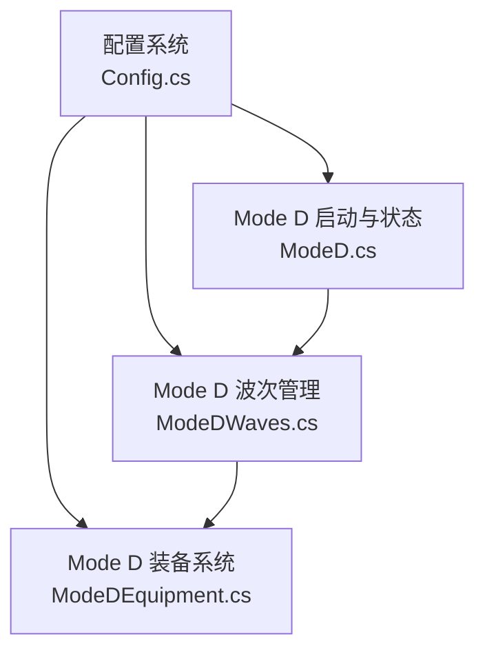
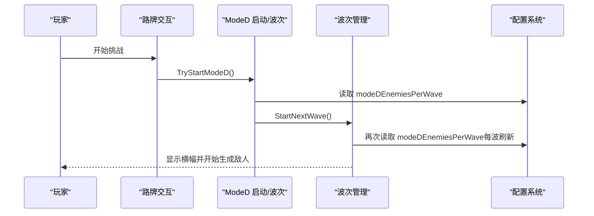
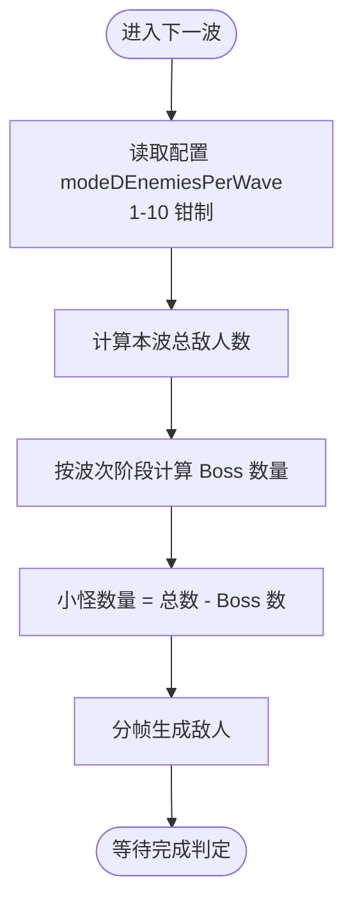
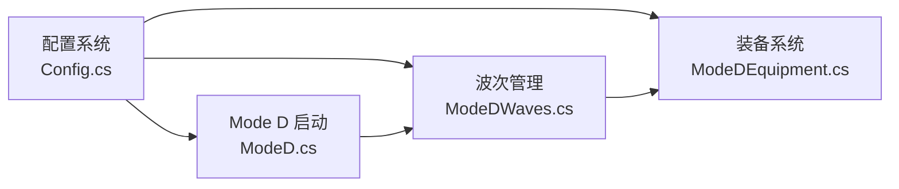

# 模式特定配置

<cite>
**本文引用的文件**
- [Config.cs](file://Config/Config.cs)
- [ModeD.cs](file://ModeD/ModeD.cs)
- [ModeDWaves.cs](file://ModeD/ModeDWaves.cs)
- [ModeDEquipment.cs](file://ModeD/ModeDEquipment.cs)
- [configuration.md](file://wiki-site/docs/en/systems/configuration.md)
</cite>

## 目录
1. [简介](#简介)
2. [项目结构](#项目结构)
3. [核心组件](#核心组件)
4. [架构总览](#架构总览)
5. [详细组件分析](#详细组件分析)
6. [依赖关系分析](#依赖关系分析)
7. [性能与体验调优建议](#性能与体验调优建议)
8. [故障排查指南](#故障排查指南)
9. [结论](#结论)
10. [附录：配置项速查表](#附录配置项速查表)

## 简介
本文件聚焦于“模式特定配置”，重点说明 Mode D（白手起家）的每波敌人数配置项 modeDEnemiesPerWave，并系统梳理各游戏模式的特殊配置选项、参数调优方法、作用机制与影响范围。同时提供针对每种模式的优化建议（性能与体验），以及配置冲突检测与兼容性说明。

## 项目结构
BossRush 的配置系统集中在 Config 模块，Mode D 相关逻辑在 ModeD 子目录中实现。配置加载支持本地 JSON 文件与 ModConfig UI 动态同步；运行时通过全局配置对象为各模式提供参数。

图表来源
- [Config.cs:31-81](file://Config/Config.cs#L31-L81)
- [ModeD.cs:109-114](file://ModeD/ModeD.cs#L109-L114)
- [ModeDWaves.cs:41-131](file://ModeD/ModeDWaves.cs#L41-L131)
- [ModeDEquipment.cs:1-18](file://ModeD/ModeDEquipment.cs#L1-L18)

章节来源
- [Config.cs:31-81](file://Config/Config.cs#L31-L81)
- [ModeD.cs:109-114](file://ModeD/ModeD.cs#L109-L114)

## 核心组件
- 配置数据模型与加载：定义 BossRushConfig 结构体，包含 modeDEnemiesPerWave、bossStatMultiplier、waveIntervalSeconds、infiniteHellBossesPerWave、milestoneRestBonusSeconds、enableMutators、mutatorCount 等关键配置项；支持从本地文件与 ModConfig UI 双向加载与保存。
- Mode D 启动与读取：StartModeD 中读取 config.modeDEnemiesPerWave，并在每波开始时再次刷新该值，确保配置变更即时生效。
- 波次生成与配比：根据 modeDEnemiesPerWave 计算本波总敌人数，再按波次阶段决定 Boss 与小怪数量比例。
- 装备与掉落：Mode D 的敌人配装与掉落质量受全局配置（如 useLegacyBossLootProbabilities）与波次影响。

章节来源
- [Config.cs:31-81](file://Config/Config.cs#L31-L81)
- [Config.cs:155-232](file://Config/Config.cs#L155-L232)
- [Config.cs:235-407](file://Config/Config.cs#L235-L407)
- [Config.cs:409-582](file://Config/Config.cs#L409-L582)
- [Config.cs:709-1041](file://Config/Config.cs#L709-L1041)
- [ModeD.cs:139-195](file://ModeD/ModeD.cs#L139-L195)
- [ModeDWaves.cs:41-131](file://ModeD/ModeDWaves.cs#L41-L131)
- [ModeDEquipment.cs:90-150](file://ModeD/ModeDEquipment.cs#L90-L150)

## 架构总览
配置系统作为单一事实源，被 Mode D 的启动、波次、装备子系统消费。Mode D 在每波开始前重新读取 modeDEnemiesPerWave，保证运行时调整立即生效。

图表来源
- [ModeD.cs:139-195](file://ModeD/ModeD.cs#L139-L195)
- [ModeDWaves.cs:41-131](file://ModeD/ModeDWaves.cs#L41-L131)
- [Config.cs:235-407](file://Config/Config.cs#L235-L407)

## 详细组件分析

### Mode D 每波敌人数配置（modeDEnemiesPerWave）
- 配置位置与默认值：在 BossRushConfig 中定义，默认值为 3，取值范围 1-10。
- 加载与校验：
  - 从本地 JSON 或 ModConfig UI 加载时进行边界钳制（1-10）。
  - 单键变更事件处理中同样对 modeDEnemiesPerWave 做 1-10 钳制。
- 运行时应用：
  - StartModeD 启动时读取并应用到当前实例字段。
  - 每波开始前（ModeDStartNextWave）再次读取并应用，确保配置热更新。
- 影响范围：
  - 直接决定每波总敌人数。
  - 间接影响 Boss 与小怪的比例（由波次阶段算法决定）。
  - 影响波次难度曲线与资源压力（帧生成、AI、渲染）。

图表来源
- [ModeDWaves.cs:41-131](file://ModeD/ModeDWaves.cs#L41-L131)
- [ModeDWaves.cs:140-177](file://ModeD/ModeDWaves.cs#L140-L177)
- [Config.cs:350-363](file://Config/Config.cs#L350-L363)
- [Config.cs:512-520](file://Config/Config.cs#L512-L520)
- [Config.cs:959-977](file://Config/Config.cs#L959-L977)

章节来源
- [Config.cs:31-81](file://Config/Config.cs#L31-L81)
- [Config.cs:350-363](file://Config/Config.cs#L350-L363)
- [Config.cs:512-520](file://Config/Config.cs#L512-L520)
- [Config.cs:959-977](file://Config/Config.cs#L959-L977)
- [ModeD.cs:161-166](file://ModeD/ModeD.cs#L161-L166)
- [ModeDWaves.cs:102-114](file://ModeD/ModeDWaves.cs#L102-L114)

### 其他模式相关配置项
- 无间炼狱（Infinite Hell）每波 Boss 数（infiniteHellBossesPerWave）：
  - 范围 1-10，默认 3。
  - 在 ConfigureBossRushMode 中若处于无间炼狱模式，优先使用配置值覆盖 bossesPerWave。
  - 运行时可通过 ModConfig 事件实时同步到当前运行状态。
- Boss 全局数值倍率（bossStatMultiplier）：
  - 范围 0.1-10，默认 1。
  - 用于整体放大 Boss 属性，影响战斗强度与节奏。
- 波次间休息时间（waveIntervalSeconds）：
  - 范围 2-60 秒，默认 15。
  - 控制波次间隔倒计时，影响整体节奏。
- 每 5 波额外休息时间（milestoneRestBonusSeconds）：
  - 范围 0-120 秒，默认 30。
  - 里程碑波次后追加休息，可调节长局疲劳度。
- 变异词条系统开关与数量（enableMutators、mutatorCount）：
  - 开关控制是否启用每局随机词条；数量范围 1-10，默认 3。
  - 关闭时会清理已应用的词条，避免残留。

章节来源
- [Config.cs:31-81](file://Config/Config.cs#L31-L81)
- [Config.cs:235-407](file://Config/Config.cs#L235-L407)
- [Config.cs:409-582](file://Config/Config.cs#L409-L582)
- [Config.cs:879-997](file://Config/Config.cs#L879-L997)
- [ModBehaviour.cs:252-282](file://ModBehaviour.cs#L252-L282)

### 配置项的作用机制与影响范围
- 配置加载优先级：
  - 首次运行自动生成 JSON 配置文件；后续可从 ModConfig UI 修改并写回本地文件。
  - 运行时监听配置变更事件，对支持的键进行增量更新并持久化。
- 热更新行为：
  - waveIntervalSeconds 在倒计时过程中修改会重算下一波倒计时。
  - infiniteHellBossesPerWave 在无间炼狱模式下会直接同步到当前 bossesPerWave。
  - modeDEnemiesPerWave 在每波开始前刷新，确保新波次立即生效。
- 影响范围：
  - 直接影响：波次节奏、敌人数、Boss 强度、休息时长。
  - 间接影响：性能（CPU/GPU 负载）、玩家体验（难度曲线、容错空间）。

章节来源
- [Config.cs:155-232](file://Config/Config.cs#L155-L232)
- [Config.cs:235-407](file://Config/Config.cs#L235-L407)
- [Config.cs:586-704](file://Config/Config.cs#L586-L704)
- [Config.cs:879-997](file://Config/Config.cs#L879-L997)

### 不同模式下的配置差异与注意事项
- Mode D（白手起家）：
  - 核心配置：modeDEnemiesPerWave（1-10）。
  - 波次规则：前若干波全小怪，随后逐步引入 Boss，后期全 Boss。
  - 装备发放：开局随机基础装备，敌人掉落质量随波次提升。
- 无间炼狱：
  - 核心配置：infiniteHellBossesPerWave（1-10）。
  - 行为：优先使用配置值覆盖 bossesPerWave，运行时可动态同步。
- 通用配置：
  - bossStatMultiplier、waveIntervalSeconds、milestoneRestBonusSeconds、enableMutators、mutatorCount 对所有模式均有影响。

章节来源
- [ModeD.cs:139-195](file://ModeD/ModeD.cs#L139-L195)
- [ModeDWaves.cs:140-177](file://ModeD/ModeDWaves.cs#L140-L177)
- [Config.cs:235-407](file://Config/Config.cs#L235-L407)
- [ModBehaviour.cs:252-282](file://ModBehaviour.cs#L252-L282)

## 依赖关系分析
- 配置系统（Config.cs）是中心枢纽，提供统一配置访问。
- Mode D 启动（ModeD.cs）依赖配置以初始化模式状态与参数。
- 波次管理（ModeDWaves.cs）依赖配置以计算每波敌人数与 Boss 配比。
- 装备系统（ModeDEquipment.cs）依赖配置以决定掉落质量与概率分布。

图表来源
- [Config.cs:31-81](file://Config/Config.cs#L31-L81)
- [ModeD.cs:139-195](file://ModeD/ModeD.cs#L139-L195)
- [ModeDWaves.cs:41-131](file://ModeD/ModeDWaves.cs#L41-L131)
- [ModeDEquipment.cs:90-150](file://ModeD/ModeDEquipment.cs#L90-L150)

章节来源
- [Config.cs:31-81](file://Config/Config.cs#L31-L81)
- [ModeD.cs:139-195](file://ModeD/ModeD.cs#L139-L195)
- [ModeDWaves.cs:41-131](file://ModeD/ModeDWaves.cs#L41-L131)
- [ModeDEquipment.cs:90-150](file://ModeD/ModeDEquipment.cs#L90-L150)

## 性能与体验调优建议
- 提升节奏（更快推进）：
  - 降低 waveIntervalSeconds（例如 5-8 秒），减少波次间等待。
- 提高难度（更强敌人）：
  - 提高 bossStatMultiplier（例如 1.5-2.0），增强 Boss 属性。
- 手动控制节奏：
  - 启用 useInteractBetweenWaves，通过交互点手动开启下一波。
- 白手起家难度调整：
  - 增加 modeDEnemiesPerWave（例如 5-8），提高每波敌人密度。
- 无间炼狱拥挤缓解：
  - 降低 infiniteHellBossesPerWave（例如 1-2），减少同屏压力。
- 取消里程碑额外休息：
  - 将 milestoneRestBonusSeconds 设为 0，保持连续挑战节奏。

章节来源
- [configuration.md:108-115](file://wiki-site/docs/en/systems/configuration.md#L108-L115)
- [Config.cs:879-997](file://Config/Config.cs#L879-L997)

## 故障排查指南
- 配置未生效：
  - 检查是否在 ModConfig UI 中正确注册并修改了对应键。
  - 确认本地 JSON 文件路径存在且可读写。
- 波次卡住：
  - 关注生成计数与结案计数是否一致（expected vs resolved）。
  - 查看日志中是否有“上一波生成未完成，禁止开新波”的警告。
- 配置冲突：
  - 注意 enableMutators 关闭时会清理已应用词条，避免残留。
  - infiniteHellBossesPerWave 仅在无间炼狱模式下覆盖 bossesPerWave。
- 兼容性问题：
  - 各配置项均具备范围钳制，超出范围会被自动修正。
  - 运行时事件处理对不支持的键会忽略，避免崩溃。

章节来源
- [Config.cs:586-704](file://Config/Config.cs#L586-L704)
- [ModeDWaves.cs:55-65](file://ModeD/ModeDWaves.cs#L55-L65)
- [Config.cs:235-407](file://Config/Config.cs#L235-L407)

## 结论
BossRush 的模式特定配置以 Config 为中心，Mode D 的 modeDEnemiesPerWave 是核心可调参数，直接影响每波敌人密度与难度曲线。通过合理设置 waveIntervalSeconds、bossStatMultiplier、infiniteHellBossesPerWave 等，可在不同模式中平衡性能与体验。配置系统支持热更新与范围校验，具备良好的鲁棒性与兼容性。

## 附录：配置项速查表
- modeDEnemiesPerWave（白手起家每波敌人数）
  - 类型：整数
  - 范围：1-10
  - 默认：3
  - 作用：决定 Mode D 每波总敌人数，影响 Boss/小怪配比与难度。
- infiniteHellBossesPerWave（无间炼狱每波 Boss 数）
  - 类型：整数
  - 范围：1-10
  - 默认：3
  - 作用：在无间炼狱模式下覆盖 bossesPerWave，影响同屏压力。
- bossStatMultiplier（Boss 全局数值倍率）
  - 类型：浮点数
  - 范围：0.1-10
  - 默认：1
  - 作用：放大 Boss 属性，提升整体难度。
- waveIntervalSeconds（波次间休息时间）
  - 类型：浮点数
  - 范围：2-60
  - 默认：15
  - 作用：控制波次间隔倒计时，影响节奏。
- milestoneRestBonusSeconds（每 5 波额外休息时间）
  - 类型：浮点数
  - 范围：0-120
  - 默认：30
  - 作用：里程碑波次后追加休息，调节长局疲劳。
- enableMutators（变异词条系统开关）
  - 类型：布尔
  - 默认：true
  - 作用：控制是否启用每局随机词条。
- mutatorCount（每局变异词条数量）
  - 类型：整数
  - 范围：1-10
  - 默认：3
  - 作用：决定每局随机词条数量，影响玩法多样性。

章节来源
- [Config.cs:31-81](file://Config/Config.cs#L31-L81)
- [Config.cs:879-997](file://Config/Config.cs#L879-L997)
- [configuration.md:108-115](file://wiki-site/docs/en/systems/configuration.md#L108-L115)