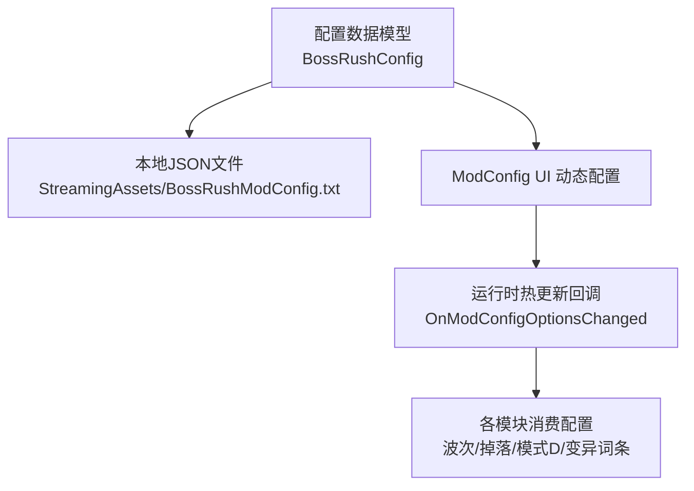
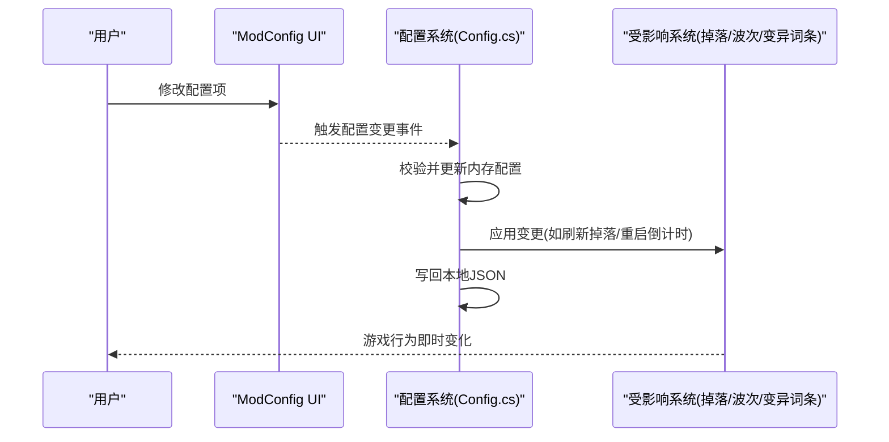
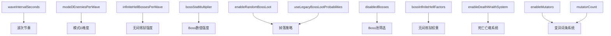

# 配置选项详解

<cite>
**本文引用的文件**
- [Config.cs](file://Config/Config.cs)
- [ModConfigApi.cs](file://ModConfigApi.cs)
- [ModeD.cs](file://ModeD/ModeD.cs)
- [LootAndRewardsRandomBossLoot.cs](file://LootAndRewards/LootAndRewardsRandomBossLoot.cs)
- [configuration.md（Wiki）](file://wiki-site/docs/en/systems/configuration.md)
- [mutators.md（Wiki）](file://wiki-site/docs/en/systems/mutators.md)
- [boss-filter.md（Wiki）](file://wiki-site/docs/en/systems/boss-filter.md)
</cite>

## 目录
1. [简介](#简介)
2. [项目结构](#项目结构)
3. [核心组件](#核心组件)
4. [架构总览](#架构总览)
5. [详细组件分析](#详细组件分析)
6. [依赖关系与冲突检测](#依赖关系与冲突检测)
7. [性能考量](#性能考量)
8. [故障排查指南](#故障排查指南)
9. [结论](#结论)
10. [附录：配置项参考表](#附录配置项参考表)

## 简介
本文件为 BossRush Mod 的完整配置选项参考，覆盖波次节奏、掉落概率、模式 D 难度、Boss 池筛选、特殊功能开关等。每个配置项均提供数据类型、默认值、有效范围、功能描述、影响的游戏行为，并给出示例、最佳实践与性能影响分析。文末提供配置项之间的依赖关系图与冲突检测规则，帮助快速定位问题与优化体验。

## 项目结构
BossRush 的配置系统由以下关键部分构成：
- 配置数据模型与加载保存：定义在 Config.cs 中，支持本地 JSON 配置文件与 ModConfig UI 动态配置。
- 运行时应用：各模式与子系统读取配置以改变行为（如 Mode D 每波敌人数、随机掉落逻辑、死亡亡魂系统等）。
- Wiki 文档：提供用户视角的配置说明与推荐调整建议。

图表来源
- [Config.cs:36-81](file://Config/Config.cs#L36-L81)
- [Config.cs:155-232](file://Config/Config.cs#L155-L232)
- [Config.cs:234-407](file://Config/Config.cs#L234-L407)
- [Config.cs:586-704](file://Config/Config.cs#L586-L704)

章节来源
- [Config.cs:36-81](file://Config/Config.cs#L36-L81)
- [Config.cs:155-232](file://Config/Config.cs#L155-L232)
- [Config.cs:234-407](file://Config/Config.cs#L234-L407)
- [Config.cs:586-704](file://Config/Config.cs#L586-L704)

## 核心组件
- 配置数据模型：BossRushConfig 集中声明所有可配置字段及默认值。
- 配置加载器：从本地 JSON 或 ModConfig 模组加载配置，并进行边界校验与回退。
- 配置注册器：向 ModConfig UI 注册滑条、下拉框、布尔开关等控件。
- 运行时桥接：监听配置变更事件，即时刷新相关系统（掉落、波次间隔、变异词条等）。

章节来源
- [Config.cs:36-81](file://Config/Config.cs#L36-L81)
- [Config.cs:155-232](file://Config/Config.cs#L155-L232)
- [Config.cs:706-1041](file://Config/Config.cs#L706-L1041)
- [ModConfigApi.cs:88-154](file://ModConfigApi.cs#L88-L154)

## 架构总览
配置系统通过“数据模型 + 双源加载 + 运行时热更新”的架构实现：
- 数据模型：统一的数据结构承载所有配置项。
- 双源加载：优先使用 ModConfig UI 的值，同时支持本地 JSON 持久化；缺失键时回退到默认值。
- 运行时热更新：当用户在 ModConfig UI 修改配置后，立即生效并写回本地文件，必要时触发特定系统的重算或清理。

图表来源
- [Config.cs:586-704](file://Config/Config.cs#L586-L704)
- [Config.cs:706-1041](file://Config/Config.cs#L706-L1041)

章节来源
- [Config.cs:586-704](file://Config/Config.cs#L586-L704)
- [Config.cs:706-1041](file://Config/Config.cs#L706-L1041)

## 详细组件分析

### 配置项总览与详细说明
以下为 BossRush Mod 的核心配置项，涵盖波次节奏、掉落策略、模式 D、Boss 池筛选、特殊功能开关等。

- waveIntervalSeconds（波次间隔）
  - 类型：浮点数
  - 默认值：15
  - 有效范围：2–60
  - 功能描述：设置波次之间的休息时间（秒）。
  - 影响的行为：控制波次推进节奏；若当前正在倒计时，修改后会静默重算下一波倒计时。
  - 示例：设置为 5–8 可加快节奏；设置为 30–60 可更从容。
  - 最佳实践：高难度下适当增大以获得更多反应时间；速通玩法可降低至 5–8。
  - 性能影响：对性能无直接影响，但过短可能增加战斗密度感知压力。

- enableRandomBossLoot（掉落随机化）
  - 类型：布尔
  - 默认值：true
  - 有效范围：true/false
  - 功能描述：启用 BossRush 随机 Boss 掉落逻辑；关闭则不再接管原版掉落流程。
  - 影响的行为：开启后根据击杀耗时与 Boss 血量计算高品质概率加成，生成独立掉落箱并填充物品。
  - 示例：关闭可回归原版掉落体验。
  - 最佳实践：希望挑战更高品质掉落时保持开启；追求稳定掉落时可关闭。
  - 性能影响：开启会增加掉落箱创建与物品分配开销，但总体可控。

- useLegacyBossLootProbabilities（原版概率）
  - 类型：布尔
  - 默认值：true
  - 有效范围：true/false
  - 功能描述：选择掉落品质分布算法。true 使用“原版概率模式”（按品质独立概率 + Q5+ 保底），false 使用“简化概率模式”（合并高品质概率，无保底）。
  - 影响的行为：影响标准 BossRush 的 Boss 掉落箱品质分布；也影响白手起家/阵营战/血猎中的常规掉落品质分布（不影响掉落数量、已装备武器/护甲/饰品、近战武器、当前子弹类型或血猎赏金/撤离奖励）。
  - 示例：偏好稳定高品质可用 true；偏好简单随机可用 false。
  - 最佳实践：高血量 Boss 配合 true 可获得更好的品质保障。
  - 性能影响：对性能无显著影响。

- infiniteHellBossesPerWave（无间炼狱每波 Boss 数）
  - 类型：整数
  - 默认值：3
  - 有效范围：1–10
  - 功能描述：设置无间炼狱模式下每波出现的 Boss 数量。
  - 影响的行为：直接决定每波 Boss 数量；运行时修改会同步更新当前模式的 bossesPerWave。
  - 示例：觉得拥挤可调低到 1–2；想挑战多 Boss 可同时提升到 5–10。
  - 最佳实践：根据硬件性能与操作水平调整；低端设备建议 1–2。
  - 性能影响：数值越大，同屏 Boss 越多，CPU/GPU 压力上升明显。

- bossStatMultiplier（Boss 数值倍率）
  - 类型：浮点数
  - 默认值：1.0
  - 有效范围：0.1–10
  - 功能描述：全局 Boss 数值倍率，影响生命值与伤害。
  - 影响的行为：提高难度曲线；与波次节奏共同决定整体挑战强度。
  - 示例：提升难度可设为 1.5–2.0；降低难度可降至 0.5–0.8。
  - 最佳实践：与 waveIntervalSeconds 联动调参；高倍率下建议延长波次间隔。
  - 性能影响：对性能无直接影响，但高倍率可能导致战斗时长增加。

- milestoneRestBonusSeconds（每5波额外休息）
  - 类型：浮点数
  - 默认值：30
  - 有效范围：0–120
  - 功能描述：每完成 5 波后增加的额外休息时间；设为 0 可禁用额外休息。
  - 影响的行为：影响长局中的节奏与恢复机会。
  - 示例：不想额外休息可设为 0；希望更长缓冲可提高到 60–120。
  - 最佳实践：高难度长局建议保留一定额外休息。
  - 性能影响：对性能无直接影响。

- modeDEnemiesPerWave（模式 D 每波敌人数）
  - 类型：整数
  - 默认值：3
  - 有效范围：1–10
  - 功能描述：白手起家模式中每波生成的敌人数。
  - 影响的行为：决定 Mode D 的难度曲线与资源获取速度。
  - 示例：太容易可提高到 5–8；太困难可降到 1–2。
  - 最佳实践：新手建议 3–5；老手可尝试 7–10。
  - 性能影响：数值越大，同屏敌人越多，性能压力上升。

- disabledBosses（Boss 池筛选）
  - 类型：字符串列表
  - 默认值：[]
  - 有效范围：Boss 名称列表
  - 功能描述：禁用指定 Boss，使其不出现在 Boss 池中；也可通过 Boss Filter UI 设置。
  - 影响的行为：影响标准 BossRush、白手起家、阵营战、血猎的 Boss 池；无间炼狱仍支持单独权重调整。
  - 示例：仅练习某 Boss 时可禁用其他所有 Boss。
  - 最佳实践：结合 Boss 难度与掉落需求进行筛选。
  - 性能影响：对性能无直接影响。

- bossInfiniteHellFactors（无间炼狱 Boss 权重）
  - 类型：字典（Boss名: 倍率）
  - 默认值：{}
  - 有效范围：Boss:multiplier
  - 功能描述：为无间炼狱中每个 Boss 设置出现权重倍率；默认 1.0，2.0 表示双倍概率，0 等价禁用。
  - 影响的行为：调整特定 Boss 的出现频率。
  - 示例：将喜欢的 Boss 权重设为 2.0 提高出现率。
  - 最佳实践：避免过多极端权重导致体验失衡。
  - 性能影响：对性能无直接影响。

- enableDeathWraithSystem（死亡亡魂系统）
  - 类型：布尔
  - 默认值：true
  - 有效范围：true/false
  - 功能描述：是否启用死亡亡魂系统；关闭后停止记录/生成亡魂并清理当前保存记录。
  - 影响的行为：影响死亡回放与亡魂生成；关闭可减少相关开销。
  - 示例：性能紧张时可关闭。
  - 最佳实践：一般保持开启；调试或性能敏感场景可关闭。
  - 性能影响：开启会增加记录与生成开销；关闭可减轻负担。

- enableMutators（变异词条系统）
  - 类型：布尔
  - 默认值：true
  - 有效范围：true/false
  - 功能描述：是否启用每局变异词条系统；关闭后开局不再抽取词条（僵尸模式不受此系统影响）。
  - 影响的行为：影响标准 BossRush、无间炼狱、白手起家、阵营战、血猎的开局词条抽取。
  - 示例：不喜欢随机词条可关闭。
  - 最佳实践：喜欢挑战与变数保持开启；追求稳定可关闭。
  - 性能影响：对性能无显著影响。

- mutatorCount（每局变异词条数量）
  - 类型：整数
  - 默认值：3
  - 有效范围：1–10
  - 功能描述：每局抽取的变异词条数量。
  - 影响的行为：影响开局难度与变数规模。
  - 示例：想增加变数可提高到 5–10；减少难度可降到 1–2。
  - 最佳实践：新手建议 1–3；老手可尝试 5–10。
  - 性能影响：对性能无显著影响。

- useInteractBetweenWaves（波次间交互点）
  - 类型：布尔
  - 默认值：false
  - 有效范围：true/false
  - 功能描述：是否切换为手动触发下一波（通过路牌交互）。
  - 影响的行为：允许玩家自主控制波次推进节奏。
  - 示例：需要精细控场时开启。
  - 最佳实践：高难度或学习新 Boss 时建议开启。
  - 性能影响：对性能无直接影响。

- lootBoxBlocksBullets（掉落箱掩体）
  - 类型：布尔
  - 默认值：false
  - 有效范围：true/false
  - 功能描述：掉落箱是否作为掩体阻挡子弹。
  - 影响的行为：开启后可临时利用掉落箱躲避敌方子弹，但也可能阻挡自身射击；长局中箱子堆积会显著改变战术。
  - 示例：想利用掩体可开启。
  - 最佳实践：谨慎使用，避免过度依赖箱子掩体。
  - 性能影响：对性能无直接影响。

- enableDragonDash（龙套装冲刺）
  - 类型：布尔
  - 默认值：true
  - 有效范围：true/false
  - 功能描述：是否启用龙套装双击冲刺能力。
  - 影响的行为：影响龙套装玩家的机动性。
  - 示例：不喜欢该能力可关闭。
  - 最佳实践：一般保持开启以提升体验。
  - 性能影响：对性能无显著影响。

- achievementHotkey（成就界面快捷键）
  - 类型：整数（KeyCode 索引）
  - 默认值：L
  - 有效范围：L/K/J/H/G/Y/U/O/P/F5/F6/F7/F8
  - 功能描述：成就面板快捷键。
  - 影响的行为：改变打开成就界面的按键。
  - 示例：自定义为 F5 便于快速访问。
  - 最佳实践：选择不与其他常用键冲突的按键。
  - 性能影响：对性能无影响。

- useWolfModelForWildHorn（荒野号角狼模型）
  - 类型：布尔
  - 默认值：true
  - 有效范围：true/false
  - 功能描述：荒野号角召唤的坐骑是否使用狼模型。
  - 影响的行为：改变坐骑外观。
  - 示例：偏好狼模型可开启。
  - 最佳实践：根据个人喜好调整。
  - 性能影响：对性能无显著影响。

章节来源
- [Config.cs:36-81](file://Config/Config.cs#L36-L81)
- [Config.cs:155-232](file://Config/Config.cs#L155-L232)
- [Config.cs:706-1041](file://Config/Config.cs#L706-L1041)
- [configuration.md（Wiki）:13-115](file://wiki-site/docs/en/systems/configuration.md#L13-L115)
- [mutators.md（Wiki）:1-34](file://wiki-site/docs/en/systems/mutators.md#L1-L34)
- [boss-filter.md（Wiki）:1-34](file://wiki-site/docs/en/systems/boss-filter.md#L1-L34)

### 模式 D 相关配置
- modeDEnemiesPerWave：控制白手起家每波敌人数，直接影响难度与资源获取速度。
- 启动流程：进入竞技场时检测裸体条件，满足则自动启动 Mode D；初始化物品池与敌人池，发放开局装备，并在首波前抽取变异词条。
- 性能影响：每波敌人数越高，同屏敌人越多，性能压力越大。

章节来源
- [ModeD.cs:109-166](file://ModeD/ModeD.cs#L109-L166)
- [ModeD.cs:197-227](file://ModeD/ModeD.cs#L197-L227)
- [ModeD.cs:264-421](file://ModeD/ModeD.cs#L264-L421)

### Boss 掉落与概率
- enableRandomBossLoot：开启后拦截 Boss 掉落事件，根据击杀耗时与 Boss 血量计算高品质概率加成，生成独立掉落箱并填充物品。
- useLegacyBossLootProbabilities：选择品质分布算法；true 使用原版概率模式（含 Q5+ 保底），false 使用简化概率模式。
- 性能影响：开启随机掉落会增加掉落箱创建与物品分配开销，但总体可控。

章节来源
- [LootAndRewardsRandomBossLoot.cs:196-451](file://LootAndRewards/LootAndRewardsRandomBossLoot.cs#L196-L451)
- [LootAndRewardsRandomBossLoot.cs:453-800](file://LootAndRewards/LootAndRewardsRandomBossLoot.cs#L453-L800)

### 特殊功能开关
- enableDeathWraithSystem：控制死亡亡魂系统的启用与清理。
- enableMutators：控制每局变异词条系统的启用与抽取。
- 性能影响：关闭这些系统可减轻相关开销，适合性能敏感场景。

章节来源
- [Config.cs:586-704](file://Config/Config.cs#L586-L704)
- [mutators.md（Wiki）:1-34](file://wiki-site/docs/en/systems/mutators.md#L1-L34)

## 依赖关系与冲突检测

### 配置项依赖关系图

图表来源
- [Config.cs:36-81](file://Config/Config.cs#L36-L81)
- [Config.cs:706-1041](file://Config/Config.cs#L706-L1041)

### 冲突检测规则
- 无间炼狱拥挤：当 infiniteHellBossesPerWave > 5 且 bossStatMultiplier > 1.5 时，可能出现同屏 Boss 过多与数值过高叠加，建议降低其中一个或两者。
- 高难度短间隔：当 waveIntervalSeconds < 5 且 bossStatMultiplier > 2.0 时，节奏过快且数值过高，可能导致体验极难，建议提高间隔或降低倍率。
- 掉落策略冲突：enableRandomBossLoot 关闭时，useLegacyBossLootProbabilities 不会生效（因为未接管掉落流程）。
- 变异词条与模式：enableMutators 关闭后，mutatorCount 无效；僵尸模式不受此系统影响。
- Boss 池筛选：disabledBosses 会影响标准 BossRush、白手起家、阵营战、血猎；无间炼狱仍可使用 bossInfiniteHellFactors 单独调整权重。

章节来源
- [Config.cs:696-704](file://Config/Config.cs#L696-L704)
- [boss-filter.md（Wiki）:1-34](file://wiki-site/docs/en/systems/boss-filter.md#L1-L34)

## 性能考量
- 高同屏单位：infiniteHellBossesPerWave 与 modeDEnemiesPerWave 越高，同屏单位越多，CPU/GPU 压力越大。
- 掉落系统：enableRandomBossLoot 开启会增加掉落箱创建与物品分配开销，但总体可控。
- 特殊系统：enableDeathWraithSystem 与 enableMutators 开启会增加记录与生成开销；性能敏感场景可考虑关闭。
- 建议：低端设备建议降低同屏单位数量，关闭非必要系统，合理设置波次间隔与 Boss 倍率。

## 故障排查指南
- 配置未生效：检查 ModConfig 是否安装并正确加载；确认配置键名与类型匹配。
- 掉落异常：确认 enableRandomBossLoot 是否开启；检查 useLegacyBossLootProbabilities 设置是否符合预期。
- 模式 D 未启动：确认玩家是否满足裸体条件；检查 modeDEnemiesPerWave 是否在有效范围。
- 变异词条未抽取：确认 enableMutators 是否开启；检查 mutatorCount 是否在 1–10。
- 日志定位：查看 DevLog 输出，关注配置加载与变更事件处理日志。

章节来源
- [Config.cs:155-232](file://Config/Config.cs#L155-L232)
- [Config.cs:586-704](file://Config/Config.cs#L586-L704)

## 结论
BossRush Mod 的配置系统提供了丰富的可调参数，覆盖波次节奏、掉落策略、模式难度、Boss 池筛选与特殊功能开关。通过合理的配置组合，玩家可以定制适合自己的挑战体验。建议根据硬件性能与个人偏好调整参数，并注意配置项之间的依赖与冲突，以获得最佳平衡。

## 附录：配置项参考表
| 配置项 | 类型 | 默认值 | 有效范围 | 功能描述 | 影响行为 | 示例 | 最佳实践 | 性能影响 |
|---|---|---|---|---|---|---|---|---|
| waveIntervalSeconds | 浮点数 | 15 | 2–60 | 波次间隔时间 | 控制波次节奏，修改后静默重算倒计时 | 5–8 加快节奏 | 高难度适当增大 | 无直接影响 |
| enableRandomBossLoot | 布尔 | true | true/false | Boss 掉落随机化 | 开启后接管掉落流程，生成独立掉落箱 | 关闭回归原版 | 挑战高品质保持开启 | 轻微开销 |
| useLegacyBossLootProbabilities | 布尔 | true | true/false | 原版概率模式 | 影响掉落品质分布算法 | 偏好稳定用 true | 高血量 Boss 配合 true | 无显著影响 |
| infiniteHellBossesPerWave | 整数 | 3 | 1–10 | 无间炼狱每波 Boss 数 | 决定每波 Boss 数量 | 拥挤调低到 1–2 | 低端设备建议 1–2 | 显著影响 |
| bossStatMultiplier | 浮点数 | 1.0 | 0.1–10 | Boss 数值倍率 | 影响生命与伤害 | 提升难度 1.5–2.0 | 与波次间隔联动 | 无直接影响 |
| milestoneRestBonusSeconds | 浮点数 | 30 | 0–120 | 每5波额外休息 | 提供长局缓冲 | 不想休息设为 0 | 长局保留一定休息 | 无直接影响 |
| modeDEnemiesPerWave | 整数 | 3 | 1–10 | 模式 D 每波敌人数 | 决定 Mode D 难度 | 太容易提高到 5–8 | 新手 3–5，老手 7–10 | 显著影响 |
| disabledBosses | 字符串列表 | [] | Boss 名称列表 | 禁用 Boss | 影响多个模式的 Boss 池 | 仅练习某 Boss | 结合难度与掉落 | 无直接影响 |
| bossInfiniteHellFactors | 字典 | {} | Boss:multiplier | 无间炼狱 Boss 权重 | 调整出现频率 | 喜欢的 Boss 设为 2.0 | 避免极端权重 | 无直接影响 |
| enableDeathWraithSystem | 布尔 | true | true/false | 死亡亡魂系统 | 控制记录与生成 | 性能紧张可关闭 | 一般保持开启 | 开启有开销 |
| enableMutators | 布尔 | true | true/false | 变异词条系统 | 控制开局词条抽取 | 不喜欢随机可关闭 | 喜欢挑战保持开启 | 无显著影响 |
| mutatorCount | 整数 | 3 | 1–10 | 每局变异词条数量 | 影响变数规模 | 增加变数到 5–10 | 新手 1–3，老手 5–10 | 无显著影响 |
| useInteractBetweenWaves | 布尔 | false | true/false | 波次间交互点 | 手动触发下一波 | 需要精细控场开启 | 高难度建议开启 | 无直接影响 |
| lootBoxBlocksBullets | 布尔 | false | true/false | 掉落箱掩体 | 箱子阻挡子弹 | 想利用掩体开启 | 谨慎使用 | 无直接影响 |
| enableDragonDash | 布尔 | true | true/false | 龙套装冲刺 | 控制冲刺能力 | 不喜欢可关闭 | 一般保持开启 | 无显著影响 |
| achievementHotkey | 整数 | L | L/K/J/H/G/Y/U/O/P/F5-F8 | 成就快捷键 | 自定义按键 | 选择不冲突按键 | 无影响 |
| useWolfModelForWildHorn | 布尔 | true | true/false | 荒野号角狼模型 | 改变坐骑外观 | 偏好狼模型开启 | 个人喜好 | 无显著影响 |