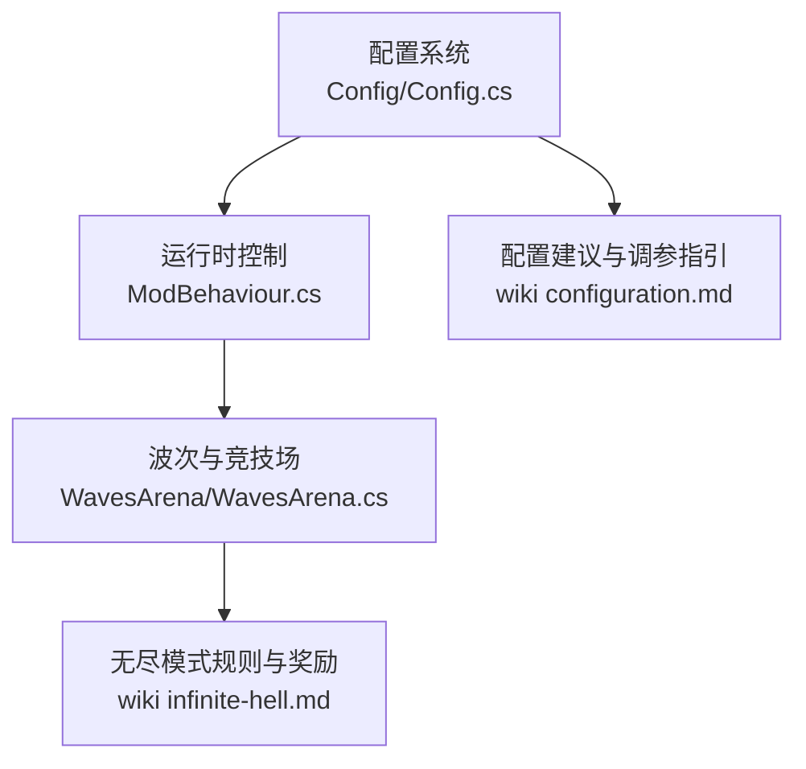
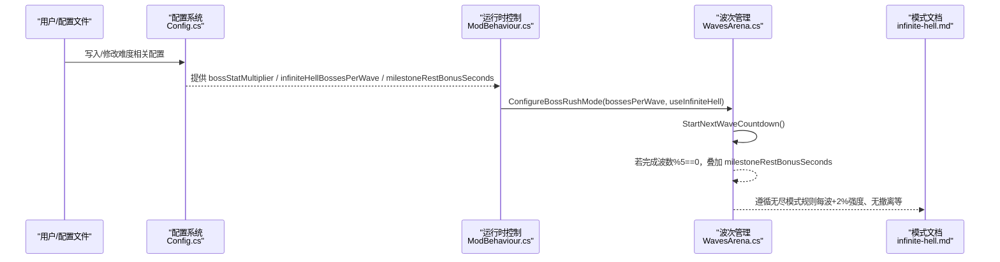
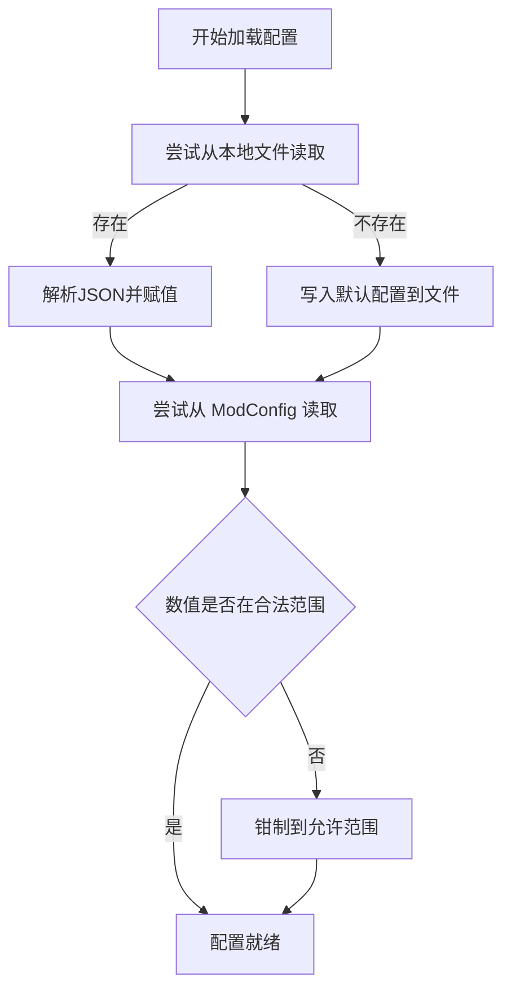
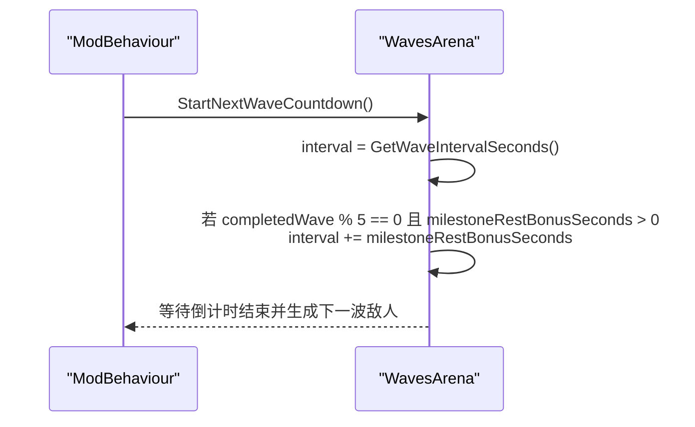
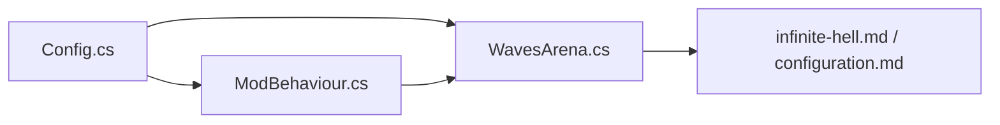

# 难度与平衡配置

<cite>
**本文引用的文件**
- [Config.cs](file://Config/Config.cs)
- [ModBehaviour.cs](file://ModBehaviour.cs)
- [WavesArena.cs](file://WavesArena/WavesArena.cs)
- [infinite-hell.md](file://wiki-site/docs/en/game-modes/infinite-hell.md)
- [configuration.md](file://wiki-site/docs/en/systems/configuration.md)
</cite>

## 目录
1. [简介](#简介)
2. [项目结构](#项目结构)
3. [核心组件](#核心组件)
4. [架构总览](#架构总览)
5. [详细组件分析](#详细组件分析)
6. [依赖关系分析](#依赖关系分析)
7. [性能考量](#性能考量)
8. [故障排查指南](#故障排查指南)
9. [结论](#结论)
10. [附录：推荐配置组合](#附录推荐配置组合)

## 简介
本文件聚焦 BossRush 模组的“难度与平衡”相关配置，重点说明以下关键项如何影响挑战性与平衡性：
- Boss 数值倍率（bossStatMultiplier）
- 无间炼狱每波 Boss 数量（infiniteHellBossesPerWave）
- 里程碑额外休息时间（milestoneRestBonusSeconds）
并给出不同难度级别的推荐配置组合，以及这些配置对游戏性能与内存使用的潜在影响。

## 项目结构
与难度与平衡直接相关的代码主要分布在：
- 配置定义与加载：Config/Config.cs
- 运行时模式切换与参数应用：ModBehaviour.cs
- 波次倒计时、里程碑休息与多 Boss 推进：WavesArena/WavesArena.cs
- 模式文档与官方建议：wiki-site/docs/en/...

图表来源
- [Config.cs:36-81](file://Config/Config.cs#L36-L81)
- [ModBehaviour.cs:252-282](file://ModBehaviour.cs#L252-L282)
- [WavesArena.cs:108-184](file://WavesArena/WavesArena.cs#L108-L184)
- [infinite-hell.md:1-59](file://wiki-site/docs/en/game-modes/infinite-hell.md#L1-L59)
- [configuration.md:108-115](file://wiki-site/docs/en/systems/configuration.md#L108-L115)

章节来源
- [Config.cs:36-81](file://Config/Config.cs#L36-L81)
- [ModBehaviour.cs:252-282](file://ModBehaviour.cs#L252-L282)
- [WavesArena.cs:108-184](file://WavesArena/WavesArena.cs#L108-L184)
- [infinite-hell.md:1-59](file://wiki-site/docs/en/game-modes/infinite-hell.md#L1-L59)
- [configuration.md:108-115](file://wiki-site/docs/en/systems/configuration.md#L108-L115)

## 核心组件
- 配置数据模型：BossRushConfig 集中声明所有可调参数，包括 bossStatMultiplier、infiniteHellBossesPerWave、milestoneRestBonusSeconds 等。
- 配置加载与校验：从本地文件或 ModConfig 动态读取，并对范围进行钳制（如 0.1–10、1–10、0–120）。
- 运行时应用：在 BossRush 模式切换或无间炼狱模式下，将配置应用到当前运行状态（例如 bossesPerWave）。
- 波次节奏控制：StartNextWaveCountdown 根据已完成波数判断是否叠加里程碑额外休息；多 Boss 波次按剩余 Boss 数推进。

章节来源
- [Config.cs:36-81](file://Config/Config.cs#L36-L81)
- [Config.cs:155-232](file://Config/Config.cs#L155-L232)
- [Config.cs:234-407](file://Config/Config.cs#L234-L407)
- [Config.cs:409-582](file://Config/Config.cs#L409-L582)
- [Config.cs:877-997](file://Config/Config.cs#L877-L997)
- [Config.cs:1052-1100](file://Config/Config.cs#L1052-L1100)
- [ModBehaviour.cs:252-282](file://ModBehaviour.cs#L252-L282)
- [WavesArena.cs:108-184](file://WavesArena/WavesArena.cs#L108-L184)

## 架构总览
下图展示配置到运行时再到波次控制的调用链，体现难度与平衡的关键路径。

图表来源
- [Config.cs:234-407](file://Config/Config.cs#L234-L407)
- [ModBehaviour.cs:252-282](file://ModBehaviour.cs#L252-L282)
- [WavesArena.cs:108-184](file://WavesArena/WavesArena.cs#L108-L184)
- [infinite-hell.md:1-59](file://wiki-site/docs/en/game-modes/infinite-hell.md#L1-L59)

## 详细组件分析

### 配置数据结构与取值范围
- bossStatMultiplier：Boss 全局数值倍率，默认 1，有效范围 0.1–10。用于整体提升或削弱 Boss 的生存与输出能力。
- infiniteHellBossesPerWave：无间炼狱每波 Boss 数量，默认 3，有效范围 1–10。直接影响单波压力与清场节奏。
- milestoneRestBonusSeconds：每 5 波额外休息时间（秒），默认 30，有效范围 0–120。用于缓解高强度连战带来的疲劳。
- waveIntervalSeconds：基础波次间隔（秒），默认 15，有效范围 2–60。配合里程碑休息共同决定节奏。
- modeDEnemiesPerWave：白手起家每波敌人数，默认 3，有效范围 1–10。影响前期过渡难度。

章节来源
- [Config.cs:36-81](file://Config/Config.cs#L36-L81)
- [Config.cs:877-997](file://Config/Config.cs#L877-L997)
- [Config.cs:1052-1100](file://Config/Config.cs#L1052-L1100)

### 配置加载与校验流程
- 支持从本地 JSON 文件与 ModConfig 模组两处加载。
- 加载时对数值型配置进行边界钳制，避免越界值导致异常。
- 支持热更新：当通过 ModConfig 修改配置后，会保存至本地文件并触发后续应用逻辑。

图表来源
- [Config.cs:155-232](file://Config/Config.cs#L155-L232)
- [Config.cs:234-407](file://Config/Config.cs#L234-L407)
- [Config.cs:409-582](file://Config/Config.cs#L409-L582)

章节来源
- [Config.cs:155-232](file://Config/Config.cs#L155-L232)
- [Config.cs:234-407](file://Config/Config.cs#L234-L407)
- [Config.cs:409-582](file://Config/Config.cs#L409-L582)

### 运行时应用与波次节奏
- 进入 BossRush 或切换无间炼狱时，ConfigureBossRushMode 会根据配置设置 bossesPerWave。
- 每波结束后，StartNextWaveCountdown 计算下一波倒计时：
  - 基础间隔来自 waveIntervalSeconds。
  - 若已完成波数是 5 的倍数且 milestoneRestBonusSeconds > 0，则叠加额外休息。
  - 非无间炼狱模式会显示下一波 Boss 预告；无间炼狱模式走专用结算流程。

图表来源
- [ModBehaviour.cs:252-282](file://ModBehaviour.cs#L252-L282)
- [WavesArena.cs:108-184](file://WavesArena/WavesArena.cs#L108-L184)

章节来源
- [ModBehaviour.cs:252-282](file://ModBehaviour.cs#L252-L282)
- [WavesArena.cs:108-184](file://WavesArena/WavesArena.cs#L108-L184)

### 无间炼狱模式的特殊规则
- 每波 Boss 数量由配置 infiniteHellBossesPerWave 决定。
- 每波 Boss 强度随波次累积增长（约 +2%/波），无撤离点，以现金池替代掉落箱。
- 里程碑奖励：每 5 波随机高品质物品；每 100 波发放皇冠与巨额现金。

章节来源
- [infinite-hell.md:1-59](file://wiki-site/docs/en/game-modes/infinite-hell.md#L1-L59)

### 配置对挑战性与平衡性的影响
- bossStatMultiplier：线性放大 Boss 的基础属性，直接改变战斗难度曲线。适合希望统一增强或削弱 Boss 强度的玩家。
- infiniteHellBossesPerWave：提高该值会增加单波同时存在的 Boss 数量，显著增加瞬时压力与操作复杂度；降低则更偏向“逐个击破”。
- milestoneRestBonusSeconds：为高难度连战提供喘息空间，有助于维持长期游玩体验；设为 0 可消除额外缓冲，追求极致紧凑节奏。
- waveIntervalSeconds：基础节奏控制器，与里程碑休息共同决定“战斗—恢复”循环。

章节来源
- [configuration.md:108-115](file://wiki-site/docs/en/systems/configuration.md#L108-L115)
- [Config.cs:877-997](file://Config/Config.cs#L877-L997)
- [WavesArena.cs:108-184](file://WavesArena/WavesArena.cs#L108-L184)

## 依赖关系分析
- Config.cs 提供统一的配置源，被 ModBehaviour.cs 与 WavesArena.cs 消费。
- ModBehaviour.cs 负责模式切换与参数注入，确保无间炼狱下 bossesPerWave 优先使用配置值。
- WavesArena.cs 依据配置与当前波次状态驱动倒计时与波次推进。
- wiki 文档提供官方规则与建议，辅助理解设计意图。

图表来源
- [Config.cs:234-407](file://Config/Config.cs#L234-L407)
- [ModBehaviour.cs:252-282](file://ModBehaviour.cs#L252-L282)
- [WavesArena.cs:108-184](file://WavesArena/WavesArena.cs#L108-L184)
- [infinite-hell.md:1-59](file://wiki-site/docs/en/game-modes/infinite-hell.md#L1-L59)
- [configuration.md:108-115](file://wiki-site/docs/en/systems/configuration.md#L108-L115)

章节来源
- [Config.cs:234-407](file://Config/Config.cs#L234-L407)
- [ModBehaviour.cs:252-282](file://ModBehaviour.cs#L252-L282)
- [WavesArena.cs:108-184](file://WavesArena/WavesArena.cs#L108-L184)
- [infinite-hell.md:1-59](file://wiki-site/docs/en/game-modes/infinite-hell.md#L1-L59)
- [configuration.md:108-115](file://wiki-site/docs/en/systems/configuration.md#L108-L115)

## 性能考量
- 多 Boss 波次（提高 infiniteHellBossesPerWave）会增加同屏单位数量，带来更高的 AI 计算、碰撞检测与渲染压力。建议在低配设备上保持较低值。
- 缩短 waveIntervalSeconds 与 milestoneRestBonusSeconds=0 会提升单位时间内的事件密度，可能导致帧率波动。
- 过高的 bossStatMultiplier 会放大伤害与特效规模，间接增加粒子与伤害数字的开销。
- 配置加载与热更新发生在启动或设置变更时，频率低，对运行时性能影响可忽略。

[本节为通用指导，不直接分析具体文件]

## 故障排查指南
- 配置未生效：检查是否通过 ModConfig 正确注册键名，确认数值在允许范围内；查看日志中是否有“配置已更新并保存到本地文件”的记录。
- 无间炼狱每波 Boss 数量未按预期：确认已进入无间炼狱模式，且 ConfigureBossRushMode 使用了配置值；检查 ApplyPostModConfigOptionChange 中的同步逻辑。
- 里程碑休息未叠加：确认已完成波数为 5 的倍数，且 milestoneRestBonusSeconds > 0；检查 StartNextWaveCountdown 中的条件分支。

章节来源
- [Config.cs:586-704](file://Config/Config.cs#L586-L704)
- [ModBehaviour.cs:252-282](file://ModBehaviour.cs#L252-L282)
- [WavesArena.cs:108-184](file://WavesArena/WavesArena.cs#L108-L184)

## 结论
- bossStatMultiplier 是最直接的“强度旋钮”，适合全局调难或调松。
- infiniteHellBossesPerWave 控制“瞬时压力”，对操作与策略要求更高。
- milestoneRestBonusSeconds 提供“节奏缓冲”，在高难度长局中尤为关键。
- 结合 waveIntervalSeconds 与上述三项，可以精细塑造不同难度下的体验曲线。

[本节为总结性内容，不直接分析具体文件]

## 附录：推荐配置组合
以下为基于仓库内文档与配置范围的实践建议，供不同难度参考：

- 新手模式
  - bossStatMultiplier：1.0（保持基准）
  - infiniteHellBossesPerWave：不适用（新手通常不在无尽模式）
  - milestoneRestBonusSeconds：30（默认，提供适度缓冲）
  - waveIntervalSeconds：15（默认）
  - 目标：平滑上手，熟悉机制

- 普通模式
  - bossStatMultiplier：1.2–1.5（小幅提升强度）
  - milestoneRestBonusSeconds：30–60（保持节奏）
  - waveIntervalSeconds：10–15（略加快节奏）
  - 目标：稳定挑战，兼顾成就感

- 困难模式
  - bossStatMultiplier：1.5–2.0（明显提升强度）
  - milestoneRestBonusSeconds：0–30（减少缓冲，提升连贯性）
  - waveIntervalSeconds：5–10（紧凑节奏）
  - 目标：高压对抗，考验操作与资源管理

- 无间炼狱模式
  - infiniteHellBossesPerWave：1–3（低配或偏重技巧的玩家可从 1 起步；高配与追求效率者可升至 2–3）
  - bossStatMultiplier：1.0–1.5（无尽本身有逐波成长，谨慎叠加全局倍率）
  - milestoneRestBonusSeconds：0–30（根据个人耐力调整；0 表示无额外休息）
  - waveIntervalSeconds：5–10（保持快节奏）
  - 目标：长期生存与收益最大化，注意同屏压力与帧率

章节来源
- [configuration.md:108-115](file://wiki-site/docs/en/systems/configuration.md#L108-L115)
- [infinite-hell.md:1-59](file://wiki-site/docs/en/game-modes/infinite-hell.md#L1-L59)
- [Config.cs:877-997](file://Config/Config.cs#L877-L997)
- [WavesArena.cs:108-184](file://WavesArena/WavesArena.cs#L108-L184)