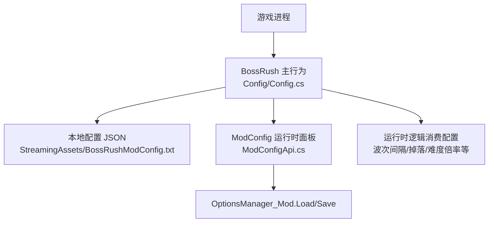
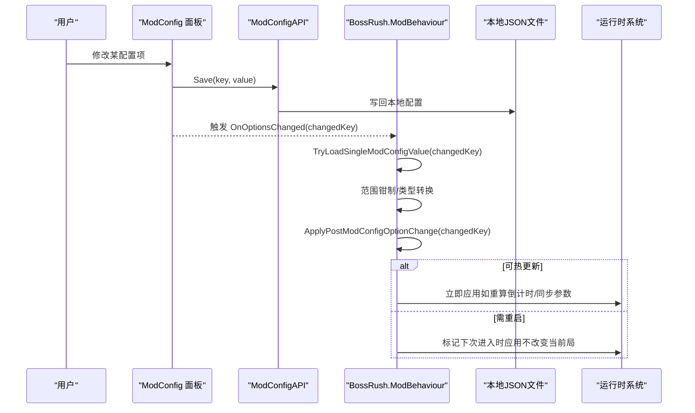
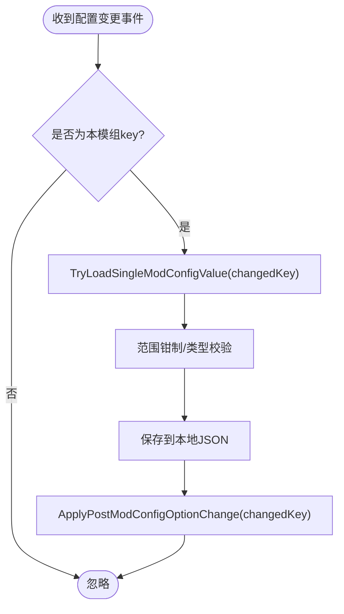
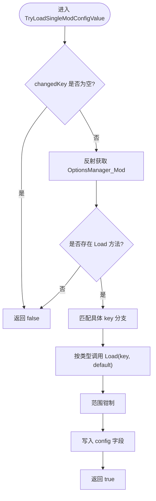
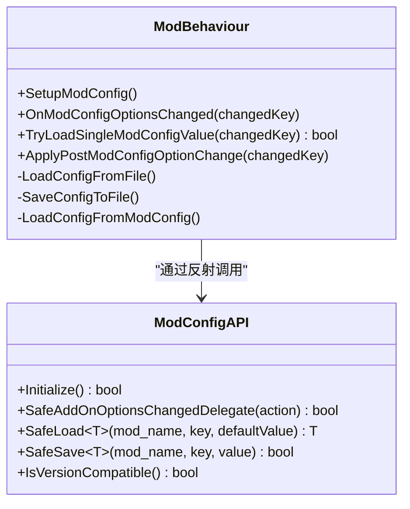

# 配置验证与热重载

<cite>
**本文引用的文件**
- [Config.cs](file://Config/Config.cs)
- [ModConfigApi.cs](file://ModConfigApi.cs)
- [F3DebugCheatMenu.cs](file://DebugAndTools/F3DebugCheatMenu.cs)
- [configuration.md](file://wiki-site/docs/en/systems/configuration.md)
</cite>

## 目录
1. [简介](#简介)
2. [项目结构](#项目结构)
3. [核心组件](#核心组件)
4. [架构总览](#架构总览)
5. [详细组件分析](#详细组件分析)
6. [依赖关系分析](#依赖关系分析)
7. [性能考量](#性能考量)
8. [故障排查指南](#故障排查指南)
9. [结论](#结论)
10. [附录](#附录)

## 简介
本文件面向 BossRush 模组的“配置验证与热重载”机制，系统性说明：
- 配置项的数值范围、类型与业务规则校验策略
- 通过 ModConfig 事件监听实现的热重载流程（含 TryLoadSingleModConfigValue）
- 不同配置项在运行时的生效策略（立即生效 vs 需要重启）
- 配置持久化、错误恢复与调试工具使用建议

该机制以本地 JSON 配置文件为基础，结合 ModConfig 运行时选项面板，提供可热更新的体验，同时保证关键系统稳定性。

## 项目结构
与配置验证和热重载直接相关的代码主要位于以下位置：
- Config/Config.cs：BossRush 配置数据模型、加载/保存、ModConfig 事件处理、单键值热更新、UI 注册
- ModConfigApi.cs：对 ModConfig 的安全反射封装（初始化、版本检查、事件委托、读写 API）
- DebugAndTools/F3DebugCheatMenu.cs：调试菜单入口（用于开发期定位问题）
- wiki-site/docs/en/systems/configuration.md：官方文档片段，描述 waveIntervalSeconds 等配置项

图表来源
- [Config.cs:155-232](file://Config/Config.cs#L155-L232)
- [Config.cs:234-407](file://Config/Config.cs#L234-L407)
- [Config.cs:409-582](file://Config/Config.cs#L409-L582)
- [ModConfigApi.cs:92-154](file://ModConfigApi.cs#L92-L154)

章节来源
- [Config.cs:155-232](file://Config/Config.cs#L155-L232)
- [Config.cs:234-407](file://Config/Config.cs#L234-L407)
- [Config.cs:409-582](file://Config/Config.cs#L409-L582)
- [ModConfigApi.cs:92-154](file://ModConfigApi.cs#L92-L154)

## 核心组件
- 配置数据模型：BossRushConfig 包含所有可配置项，如波次间隔、随机掉落开关、Boss 数值倍率、每波敌人数、禁用 Boss 列表等
- 本地文件 I/O：从 StreamingAssets 下的 JSON 文件读取/写入配置，缺失时自动生成默认配置
- ModConfig 集成：通过反射调用 OptionsManager_Mod 的 Load/Save，并注册 AddOnOptionsChangedDelegate 事件
- 单键热更新：TryLoadSingleModConfigValue 针对变更的 key 进行增量加载与范围钳制
- 应用层策略：ApplyPostModConfigOptionChange 根据 key 触发不同的运行时调整（如刷新掉落追踪、清理变异词条、同步无间炼狱每波 Boss 数）

章节来源
- [Config.cs:31-81](file://Config/Config.cs#L31-L81)
- [Config.cs:155-232](file://Config/Config.cs#L155-L232)
- [Config.cs:234-407](file://Config/Config.cs#L234-L407)
- [Config.cs:409-582](file://Config/Config.cs#L409-L582)
- [Config.cs:672-704](file://Config/Config.cs#L672-L704)

## 架构总览
下图展示了配置从 UI 到运行时的完整链路，包括验证、持久化与热更新分支。

图表来源
- [Config.cs:588-622](file://Config/Config.cs#L588-L622)
- [Config.cs:409-582](file://Config/Config.cs#L409-L582)
- [Config.cs:672-704](file://Config/Config.cs#L672-L704)
- [ModConfigApi.cs:356-442](file://ModConfigApi.cs#L356-L442)

## 详细组件分析

### 配置数据结构与默认值
- BossRushConfig 集中定义所有配置字段及默认值，便于统一序列化与反序列化
- 关键字段示例：
  - waveIntervalSeconds：浮点型，默认 15
  - enableRandomBossLoot：布尔型，默认 true
  - bossStatMultiplier：浮点型，默认 1
  - infiniteHellBossesPerWave：整型，默认 3
  - modeDEnemiesPerWave：整型，默认 3
  - disabledBosses：字符串列表
  - enableDeathWraithSystem、enableMutators、mutatorCount 等

章节来源
- [Config.cs:31-81](file://Config/Config.cs#L31-L81)

### 本地配置加载与保存
- 加载路径：StreamingAssets/BossRushModConfig.txt
- 若文件不存在则生成默认配置；若存在但缺少某些字段，采用兼容逻辑补全默认值
- 保存时使用 JsonUtility 序列化为 JSON，异常时记录警告日志

章节来源
- [Config.cs:155-232](file://Config/Config.cs#L155-L232)

### ModConfig 事件监听与热重载流程
- 启动时尝试查找 ModConfig 类型并注册 AddOnOptionsChangedDelegate
- 当用户在 ModConfig 面板修改配置后，回调 OnModConfigOptionsChanged
- 先过滤是否为本模组关心的 key，再调用 TryLoadSingleModConfigValue 进行增量加载与范围钳制
- 成功后保存到本地文件，并调用 ApplyPostModConfigOptionChange 执行运行时应用

图表来源
- [Config.cs:588-622](file://Config/Config.cs#L588-L622)
- [Config.cs:409-582](file://Config/Config.cs#L409-L582)
- [Config.cs:672-704](file://Config/Config.cs#L672-L704)

章节来源
- [Config.cs:588-622](file://Config/Config.cs#L588-L622)
- [Config.cs:409-582](file://Config/Config.cs#L409-L582)
- [Config.cs:672-704](file://Config/Config.cs#L672-L704)

### TryLoadSingleModConfigValue 的工作流程
- 通过反射获取 OptionsManager_Mod.Load<T> 方法
- 根据 changedKey 匹配对应配置项，按类型调用泛型 Load
- 对数值类配置进行范围钳制（例如 waveIntervalSeconds 限制为 2-60）
- 返回是否成功更新

图表来源
- [Config.cs:409-582](file://Config/Config.cs#L409-L582)

章节来源
- [Config.cs:409-582](file://Config/Config.cs#L409-L582)

### 配置验证规则
- 数值范围检查：
  - waveIntervalSeconds：2-60 秒（加载与 UI 注册均做钳制）
  - bossStatMultiplier：0.1-10
  - milestoneRestBonusSeconds：0-120
  - infiniteHellBossesPerWave：1-10
  - modeDEnemiesPerWave：1-10
  - mutatorCount：1-10
- 类型验证：
  - 通过泛型 Load<T> 确保类型一致，异常时回退默认值并记录日志
- 业务规则验证：
  - 对 legacy loot 概率等开关变更后，刷新掉落追踪
  - 关闭变异词条时清空当前局已应用的词条
  - 无间炼狱模式下，每波 Boss 数量变更会即时同步到运行时变量

章节来源
- [Config.cs:275-348](file://Config/Config.cs#L275-L348)
- [Config.cs:436-500](file://Config/Config.cs#L436-L500)
- [Config.cs:672-704](file://Config/Config.cs#L672-L704)
- [configuration.md:13-21](file://wiki-site/docs/en/systems/configuration.md#L13-L21)

### 热重载行为差异：立即生效 vs 需要重启
- 可立即生效的配置（无需重启）：
  - 波次间隔（waveIntervalSeconds）：若在等待下一波期间被修改，会静默重算倒计时
  - 每5波额外休息时间（milestoneRestBonusSeconds）：仅在下一次命中里程碑时生效，不影响当前已开始休息阶段
  - Boss 全局数值倍率（bossStatMultiplier）：后续计算使用新值
  - 无间炼狱每波 Boss 数量（infiniteHellBossesPerWave）：在无间炼狱模式且大于 0 时即时同步
  - 其他开关类（如掉落随机化、原版概率、交互点开启下一波、掉落箱掩体、死亡亡魂系统、变异词条开关等）：通过 ApplyPostModConfigOptionChange 触发相应运行时调整
- 需要重启或重新进入场景才生效的配置：
  - 涉及资源/静态缓存/全局状态重建的配置（例如禁用 Boss 池、影响出生点或资产绑定的配置），当前代码未提供热重载路径，建议在下次进入地图或重启游戏后生效

章节来源
- [Config.cs:610-616](file://Config/Config.cs#L610-L616)
- [Config.cs:672-704](file://Config/Config.cs#L672-L704)

### 配置持久化策略与备份机制
- 持久化：
  - 所有通过 ModConfig 面板修改的配置都会保存到本地 JSON 文件
  - 首次运行若无配置文件，将生成默认配置
- 备份机制：
  - 当前实现未包含自动备份与回滚逻辑
  - 建议在外部维护备份策略（如定期复制 JSON 文件）

章节来源
- [Config.cs:155-232](file://Config/Config.cs#L155-L232)
- [Config.cs:588-622](file://Config/Config.cs#L588-L622)

### 错误恢复流程
- 加载失败：
  - 本地文件解析异常时记录警告并保留上次有效配置
  - ModConfig 类型或方法缺失时，安全接口返回默认值并记录错误日志
- 版本兼容性：
  - ModConfigAPI 在初始化时检查版本字段，不兼容时记录错误并阻止进一步操作
- 运行时异常保护：
  - 所有反射调用包裹 try/catch，避免崩溃
  - 对非法输入进行钳制，防止越界值影响游戏平衡

章节来源
- [Config.cs:195-199](file://Config/Config.cs#L195-L199)
- [Config.cs:403-407](file://Config/Config.cs#L403-L407)
- [ModConfigApi.cs:43-86](file://ModConfigApi.cs#L43-L86)
- [ModConfigApi.cs:92-154](file://ModConfigApi.cs#L92-L154)

## 依赖关系分析
- BossRush.ModBehaviour 依赖：
  - Unity 的 JsonUtility 进行序列化
  - ModConfig 的 OptionsManager_Mod 进行运行时配置读写
  - 本地文件系统读写 JSON
- ModConfigAPI 作为安全封装层，屏蔽反射细节并提供稳定接口

图表来源
- [Config.cs:706-1041](file://Config/Config.cs#L706-L1041)
- [ModConfigApi.cs:92-154](file://ModConfigApi.cs#L92-L154)
- [ModConfigApi.cs:356-442](file://ModConfigApi.cs#L356-L442)

章节来源
- [Config.cs:706-1041](file://Config/Config.cs#L706-L1041)
- [ModConfigApi.cs:92-154](file://ModConfigApi.cs#L92-L154)
- [ModConfigApi.cs:356-442](file://ModConfigApi.cs#L356-L442)

## 性能考量
- 反射调用集中在初始化与配置变更时，频率较低，对性能影响有限
- 范围钳制与类型转换在热更新路径中执行，开销极小
- 建议：
  - 避免在高频循环中重复反射
  - 对频繁读取的配置项可在内存中缓存（当前已在 config 对象中缓存）

[本节为通用指导，不直接分析具体文件]

## 故障排查指南
- 常见问题与定位步骤：
  - 配置未生效：
    - 确认 ModConfig 面板是否安装并启用
    - 检查日志中是否有“类型未找到”“必要方法未找到”等错误
    - 确认 changedKey 是否在本模组支持列表中
  - 数值越界：
    - 检查 UI 滑条范围是否与代码钳制范围一致
    - 查看日志中的范围钳制提示
  - 热重载无效：
    - 对于需要重启的配置，确认是否在下次进入场景后生效
  - 调试工具：
    - 使用 F3 调试菜单（仅在 DevMode 下可用）辅助定位问题
    - 观察菜单状态与日志输出，确认配置变更事件是否触发

章节来源
- [Config.cs:588-622](file://Config/Config.cs#L588-L622)
- [Config.cs:624-641](file://Config/Config.cs#L624-L641)
- [F3DebugCheatMenu.cs:107-122](file://DebugAndTools/F3DebugCheatMenu.cs#L107-L122)

## 结论
BossRush 的配置系统通过本地 JSON 与 ModConfig 面板相结合，实现了安全的配置加载、严格的范围与类型校验、以及细粒度的热重载能力。对于可热更新的配置（如波次间隔、数值倍率、部分开关），能够在不重启的情况下即时应用；对于涉及静态缓存或资源重建的配置，则建议重启或重新进入场景以确保一致性。配合完善的错误恢复与日志记录，系统在可用性、稳定性与可维护性之间取得了良好平衡。

[本节为总结性内容，不直接分析具体文件]

## 附录
- 配置项参考（节选）：
  - waveIntervalSeconds：波次间休息时间（秒），默认 15，范围 2-60
  - enableRandomBossLoot：是否启用 Boss 掉落随机化（时间加成）
  - useLegacyBossLootProbabilities：是否使用标准 Boss 战利品原版概率
  - useInteractBetweenWaves：是否在波次间使用交互点开启下一波
  - lootBoxBlocksBullets：Boss 掉落箱是否作为掩体（挡子弹）
  - infiniteHellBossesPerWave：无间炼狱每波 Boss 数量（1-10）
  - bossStatMultiplier：Boss 全局数值倍率（0.1-10）
  - modeDEnemiesPerWave：白手起家每波敌人数（1-10）
  - enableDeathWraithSystem：死亡亡魂系统开关
  - enableMutators / mutatorCount：变异词条系统开关与数量

章节来源
- [configuration.md:13-21](file://wiki-site/docs/en/systems/configuration.md#L13-L21)
- [Config.cs:31-81](file://Config/Config.cs#L31-L81)