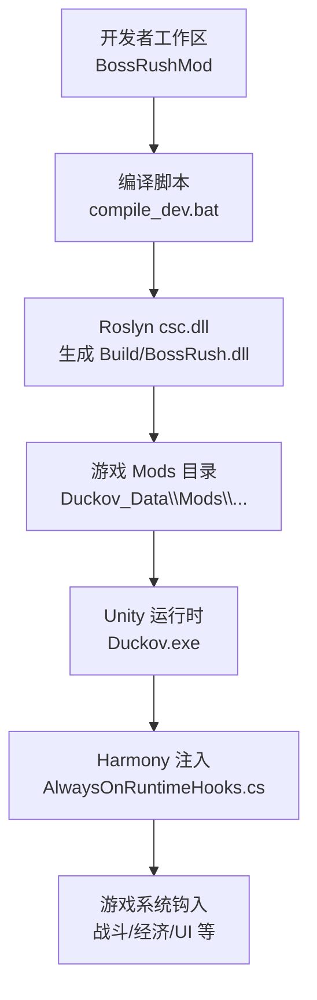
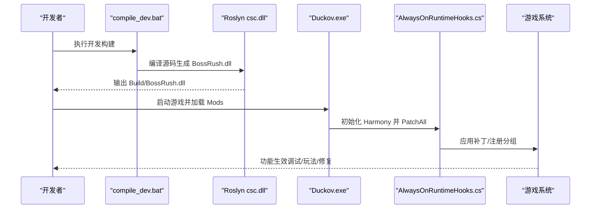
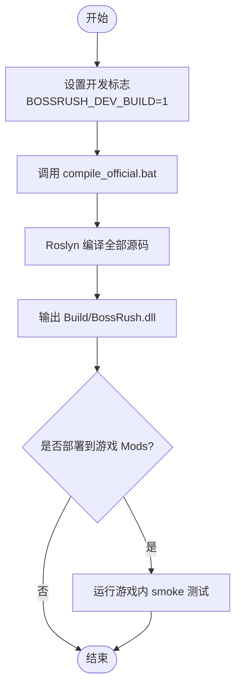
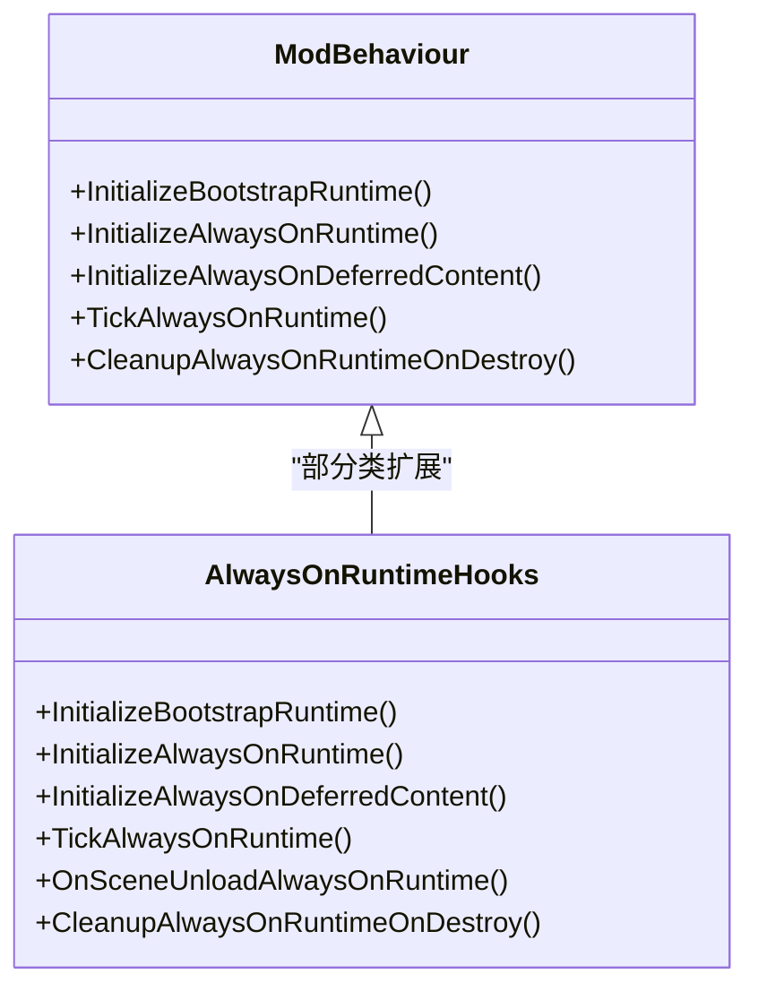
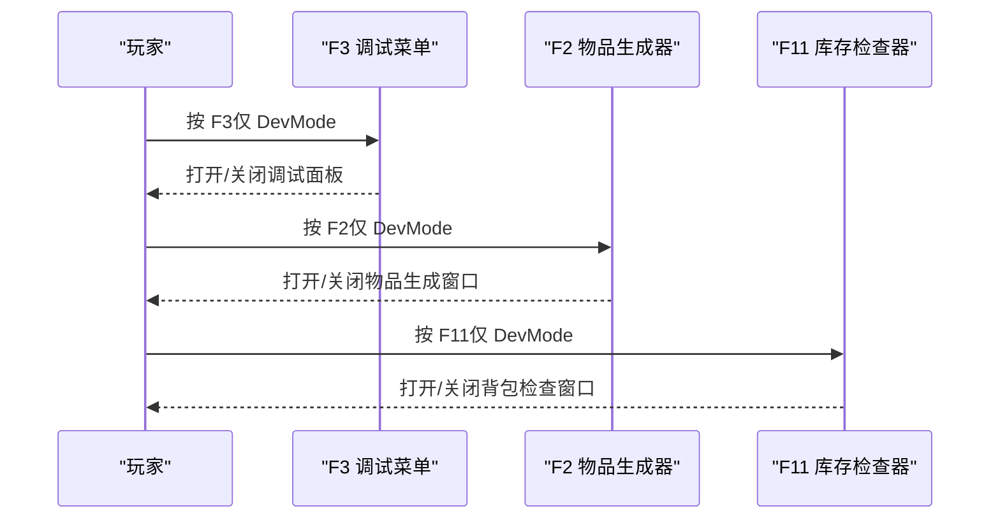
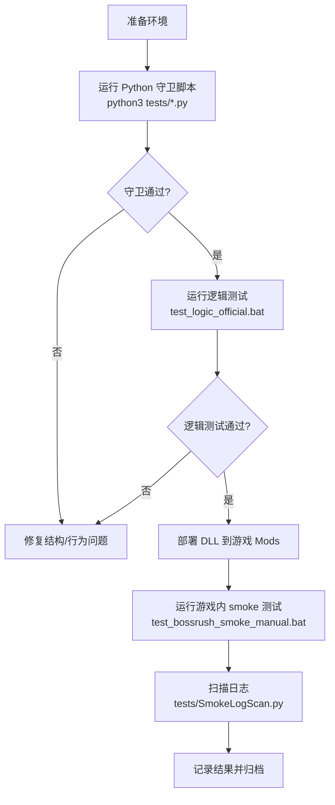
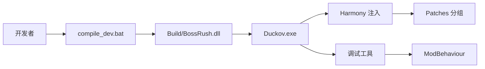

# 开发环境搭建

<cite>
**本文引用的文件**
- [README.md](file://README.md)
- [AGENTS.md](file://AGENTS.md)
- [compile_dev.bat](file://compile_dev.bat)
- [test_bossrush_smoke_manual.bat](file://test_bossrush_smoke_manual.bat)
- [test_logic_official.bat](file://test_logic_official.bat)
- [ModBehaviour.cs](file://ModBehaviour.cs)
- [AlwaysOnRuntimeHooks.cs](file://Utilities/AlwaysOnRuntimeHooks.cs)
- [F3DebugCheatMenu.cs](file://DebugAndTools/F3DebugCheatMenu.cs)
- [ItemSpawner.cs](file://DebugAndTools/ItemSpawner.cs)
- [InventoryInspector.cs](file://DebugAndTools/InventoryInspector.cs)
- [SteamHelper.cs](file://Utilities/SteamHelper.cs)
</cite>

## 目录
1. [简介](#简介)
2. [项目结构](#项目结构)
3. [核心组件](#核心组件)
4. [架构总览](#架构总览)
5. [详细组件分析](#详细组件分析)
6. [依赖关系分析](#依赖关系分析)
7. [性能注意事项](#性能注意事项)
8. [故障排除指南](#故障排除指南)
9. [结论](#结论)
10. [附录：上手流程与规范](#附录：上手流程与规范)

## 简介
本指南面向首次参与 BossRushMod 开发的工程师，目标是帮助你在 Windows 环境下快速完成本地开发、构建、调试与测试闭环。内容覆盖 .NET SDK 安装、Unity 运行环境要求、游戏与创意工坊路径配置、构建脚本执行流程、HarmonyLib 集成方式、内置调试工具使用、Python 守卫脚本与游戏内 smoke 测试流程，以及版本协作中的硬约束与最佳实践。

## 项目结构
BossRushMod 是一个以 Unity（Mono）为宿主、C# 7.3 编写的 Mod 工程。它没有标准 .csproj 工程文件，而是通过批处理脚本显式列出源码并调用 Roslyn 编译器生成 DLL，再部署到游戏 Mods 目录供运行时加载。

- 主入口与全局状态：ModBehaviour.cs
- Harmony 补丁注册与生命周期钩子：Utilities/AlwaysOnRuntimeHooks.cs
- 调试工具：DebugAndTools 下的 F3 菜单、F2 物品生成器、F11 背包检查器等
- 构建与测试脚本：根目录的 compile_dev.bat、test_bossrush_smoke_manual.bat、test_logic_official.bat
- 平台辅助：Utilities/SteamHelper.cs（反射访问 Steam 信息，避免强依赖）

图表来源
- [compile_dev.bat:1-6](file://compile_dev.bat#L1-L6)
- [AlwaysOnRuntimeHooks.cs:7-60](file://Utilities/AlwaysOnRuntimeHooks.cs#L7-L60)

章节来源
- [README.md:150-192](file://README.md#L150-L192)
- [AGENTS.md:47-67](file://AGENTS.md#L47-L67)

## 核心组件
- 构建系统
  - compile_dev.bat：设置开发标志后调用 compile_official.bat，用于在 Windows 下编译全部源码并输出 DLL。
  - test_logic_official.bat：运行若干 C# 单元测试项目（如 JSON 解析、数学计算、生命周期等），验证逻辑正确性。
  - README 指出 compile_official.bat 直接调用已安装 .NET SDK 的 Roslyn csc.dll，无 .csproj；新增 .cs 必须登记到编译清单。
- 运行时注入
  - AlwaysOnRuntimeHooks.cs：初始化 Harmony 实例并 PatchAll，注册补丁分组，确保动态物品关键补丁可用。
- 调试工具
  - F3 调试菜单：DevModeEnabled 时按 F3 打开统一作弊面板（传送、属性调参、资源、战斗、NPC 剧情、场景调试）。
  - F2 物品生成器：DevModeEnabled 时按 F2 打开窗口输入 ID 生成物品。
  - F11 库存检查器：DevModeEnabled 时按 F11 打开背包检查窗口，支持刷新、输出日志、关闭。
- 平台辅助
  - SteamHelper.cs：通过反射获取 Steam 人格名，兼容不同 Steamworks 接口，避免强依赖。

章节来源
- [compile_dev.bat:1-6](file://compile_dev.bat#L1-L6)
- [test_logic_official.bat:1-86](file://test_logic_official.bat#L1-L86)
- [README.md:150-192](file://README.md#L150-L192)
- [AlwaysOnRuntimeHooks.cs:7-60](file://Utilities/AlwaysOnRuntimeHooks.cs#L7-L60)
- [F3DebugCheatMenu.cs:107-122](file://DebugAndTools/F3DebugCheatMenu.cs#L107-L122)
- [ItemSpawner.cs:37-55](file://DebugAndTools/ItemSpawner.cs#L37-L55)
- [InventoryInspector.cs:49-74](file://DebugAndTools/InventoryInspector.cs#L49-L74)
- [SteamHelper.cs:24-105](file://Utilities/SteamHelper.cs#L24-L105)

## 架构总览
BossRushMod 的运行时架构围绕“构建产物 -> 游戏 Mods 目录 -> Unity 加载 -> Harmony 注入 -> 游戏系统扩展”展开。构建阶段由 Windows 下的 .NET SDK 驱动；运行阶段通过 Harmony 对游戏方法进行插桩，实现功能增强与修复。

图表来源
- [compile_dev.bat:1-6](file://compile_dev.bat#L1-L6)
- [AlwaysOnRuntimeHooks.cs:7-60](file://Utilities/AlwaysOnRuntimeHooks.cs#L7-L60)

章节来源
- [README.md:150-192](file://README.md#L150-L192)
- [AGENTS.md:47-67](file://AGENTS.md#L47-L67)

## 详细组件分析

### 构建系统与脚本执行流程
- compile_dev.bat
  - 设置 BOSSRUSH_DEV_BUILD=1 环境变量，然后调用 compile_official.bat。
  - 作用：开启开发模式构建，便于后续调试或差异对比。
- compile_official.bat（由 README 描述）
  - 显式列出所有 .cs 文件并调用 Roslyn csc.dll 编译，输出 Build/BossRush.dll。
  - 新增 .cs 必须登记到该脚本，否则不会参与编译。
- test_logic_official.bat
  - 清理 tests/bin 与 tests/obj，依次运行多个 .csproj 单元测试项目，任一失败即中止。
  - 用于在提交前验证纯逻辑代码的正确性。

图表来源
- [compile_dev.bat:1-6](file://compile_dev.bat#L1-L6)
- [README.md:170-192](file://README.md#L170-L192)
- [test_logic_official.bat:1-86](file://test_logic_official.bat#L1-L86)

章节来源
- [compile_dev.bat:1-6](file://compile_dev.bat#L1-L6)
- [README.md:170-192](file://README.md#L170-L192)
- [test_logic_official.bat:1-86](file://test_logic_official.bat#L1-L86)

### Harmony 集成与补丁注册
- AlwaysOnRuntimeHooks.cs
  - 创建 Harmony 实例并使用 PatchAll() 扫描并应用所有 [HarmonyPatch]。
  - 校验动态物品关键补丁可用性，必要时执行全量同步注册。
  - 注册补丁分组（BaseHub、Combat、Death），便于管理与日志记录。
- 依赖说明
  - 通过 Workshop 路径下的 0Harmony.dll 引用（README 描述），项目包含多处 Harmony 补丁。
  - 官方更新可能导致反射目标变化，需按契约文档复查。

图表来源
- [AlwaysOnRuntimeHooks.cs:7-189](file://Utilities/AlwaysOnRuntimeHooks.cs#L7-L189)
- [README.md:150-168](file://README.md#L150-L168)

章节来源
- [AlwaysOnRuntimeHooks.cs:7-189](file://Utilities/AlwaysOnRuntimeHooks.cs#L7-L189)
- [README.md:150-168](file://README.md#L150-L168)

### 调试工具启用与使用
- F3 调试菜单
  - 仅在 DevModeEnabled 时响应 F3 按键，打开统一作弊面板，支持多页签操作。
  - 显示/隐藏过程会捕获并恢复时间缩放、光标可见性与锁定状态，避免影响游戏表现。
- F2 物品生成器
  - 仅在 DevModeEnabled 时响应 F2 按键，弹出窗口输入物品 ID，调用游戏 API 生成并发送给玩家。
  - 提供错误提示与成功反馈，支持拖动窗口。
- F11 库存检查器
  - 仅在 DevModeEnabled 且可运行游戏运行时响应 F11 按键，打开背包检查窗口。
  - 支持刷新、输出到日志、关闭；内部读取多项字段并格式化展示。

图表来源
- [F3DebugCheatMenu.cs:107-122](file://DebugAndTools/F3DebugCheatMenu.cs#L107-L122)
- [ItemSpawner.cs:37-55](file://DebugAndTools/ItemSpawner.cs#L37-L55)
- [InventoryInspector.cs:49-74](file://DebugAndTools/InventoryInspector.cs#L49-L74)

章节来源
- [F3DebugCheatMenu.cs:107-122](file://DebugAndTools/F3DebugCheatMenu.cs#L107-L122)
- [ItemSpawner.cs:37-55](file://DebugAndTools/ItemSpawner.cs#L37-L55)
- [InventoryInspector.cs:49-74](file://DebugAndTools/InventoryInspector.cs#L49-L74)

### 依赖管理与 Steam 路径
- HarmonyLib
  - 通过 Workshop 路径下的 0Harmony.dll 引用（README 描述），项目通过 Harmony.PatchAll() 自动发现并应用补丁。
  - 官方更新可能破坏反射绑定，需按契约文档复查。
- Steam 辅助
  - SteamHelper.cs 通过反射尝试 SteamFriends.GetPersonaName 与 SteamManager.GetSteamDisplay，兼容不同实现，避免强依赖。
- 游戏与 Mods 路径
  - test_bossrush_smoke_manual.bat 会检测 GAME_PATH，默认查找常见 Steam 安装路径，并确认 Duckov_Data\Managed\Assembly-CSharp.dll 存在。
  - 构建产物部署到游戏 Mods 目录（例如 Duckov_Data\Mods\BossRush\BossRush.dll），由游戏运行时加载。

章节来源
- [README.md:150-192](file://README.md#L150-L192)
- [SteamHelper.cs:24-105](file://Utilities/SteamHelper.cs#L24-L105)
- [test_bossrush_smoke_manual.bat:1-153](file://test_bossrush_smoke_manual.bat#L1-L153)

### 测试验证流程
- Python 守卫脚本
  - README 指出 tests/ 下有大量 Python 静态断言脚本，用于检查结构不变式（常量一致性、生命周期契约、缓存复用等）。
  - 可通过 python3 tests/*.py 执行（Windows 上建议使用 cmd 或 PowerShell 调用）。
- 游戏内 smoke 测试
  - test_bossrush_smoke_manual.bat 打印检查清单，支持自动探测游戏路径并启动 Steam 游戏。
  - 完成后建议运行 tests/SmokeLogScan.py 扫描最新日志，记录结果到 docs/testing 下的记录文件。
- 逻辑测试
  - test_logic_official.bat 运行多个 .csproj 单元测试项目，验证纯逻辑代码正确性。

图表来源
- [README.md:160-168](file://README.md#L160-L168)
- [test_bossrush_smoke_manual.bat:1-153](file://test_bossrush_smoke_manual.bat#L1-L153)
- [test_logic_official.bat:1-86](file://test_logic_official.bat#L1-L86)

章节来源
- [README.md:160-168](file://README.md#L160-L168)
- [test_bossrush_smoke_manual.bat:1-153](file://test_bossrush_smoke_manual.bat#L1-L153)
- [test_logic_official.bat:1-86](file://test_logic_official.bat#L1-L86)

## 依赖关系分析
- 构建期依赖
  - Windows .NET SDK（用于 Roslyn csc.dll）
  - 游戏程序集引用（Duckov_Data\Managed\*.dll）
  - 编译清单（compile_official.bat 中显式列出的 .cs 文件）
- 运行期依赖
  - Unity/Mono（游戏宿主）
  - Harmony（通过 0Harmony.dll 注入补丁）
  - Steamworks（可选，通过反射访问）
- 模块耦合
  - ModBehaviour 作为主入口，聚合地图配置、运行时模块主机、调试工具等。
  - AlwaysOnRuntimeHooks 负责 Harmony 初始化与生命周期管理，与 Patches 分组紧密耦合。
  - 调试工具与 ModBehaviour 的部分类扩展交互，受 DevModeEnabled 控制。

图表来源
- [compile_dev.bat:1-6](file://compile_dev.bat#L1-L6)
- [AlwaysOnRuntimeHooks.cs:7-60](file://Utilities/AlwaysOnRuntimeHooks.cs#L7-L60)
- [ModBehaviour.cs:24-35](file://ModBehaviour.cs#L24-L35)

章节来源
- [AGENTS.md:47-67](file://AGENTS.md#L47-L67)
- [README.md:150-192](file://README.md#L150-L192)

## 性能注意事项
- 热路径避免噪声日志：README 与 AGENTS 强调不要对每帧热路径添加过多日志。
- 事件订阅幂等与退订：AGENTS 明确要求事件订阅必须有 owner 状态防重复，并在销毁路径退订。
- 防御式异常处理：项目广泛使用 try/catch 避免 Mod 异常拖崩宿主，不要成批清理空 catch。
- 预热与资源准备：装备相关预热应在实际使用时门控，并按帧分摊预算，避免阻塞主线程。

章节来源
- [AGENTS.md:88-127](file://AGENTS.md#L88-L127)
- [README.md:160-168](file://README.md#L160-L168)

## 故障排除指南
- 无法找到 dotnet
  - test_logic_official.bat 会在未找到 dotnet 时直接失败退出。请确保已安装 .NET SDK 并加入 PATH。
- 游戏路径未识别
  - test_bossrush_smoke_manual.bat 会尝试多个常见 Steam 安装路径，若均未找到 Assembly-CSharp.dll，则提示设置 GAME_PATH。
- 未部署 DLL
  - 若检测到未部署的 BossRush.dll，会提示先运行部署脚本后再进行 smoke 测试。
- Harmony 补丁不完整
  - AlwaysOnRuntimeHooks 会校验动态物品关键补丁，若不完整将执行全量同步注册并记录警告/错误日志。
- Steam 接口不可用
  - SteamHelper 会尝试多种反射路径，失败时记录一次性警告，不影响其他功能。

章节来源
- [test_logic_official.bat:1-86](file://test_logic_official.bat#L1-L86)
- [test_bossrush_smoke_manual.bat:1-153](file://test_bossrush_smoke_manual.bat#L1-L153)
- [AlwaysOnRuntimeHooks.cs:7-60](file://Utilities/AlwaysOnRuntimeHooks.cs#L7-L60)
- [SteamHelper.cs:24-105](file://Utilities/SteamHelper.cs#L24-L105)

## 结论
BossRushMod 的开发环境以 Windows + .NET SDK + Unity 为核心，通过脚本驱动的构建流程与 Harmony 注入机制实现功能扩展。新开发者应优先掌握构建脚本、调试工具与测试流程，并严格遵守 AGENTS 中的硬约束（TypeID 管理、本地化注入、刷怪安全网、事件订阅契约等）。建议在每次改动后执行 Python 守卫、逻辑测试与游戏内 smoke 测试，确保稳定性与兼容性。

## 附录：上手流程与规范
- 环境准备
  - 安装 Windows .NET SDK（用于 Roslyn 编译）。
  - 确认游戏安装路径与 Mods 目录结构（Duckov_Data\Managed\*.dll 存在）。
  - 确保 Workshop/Harmony 路径可用（README 描述）。
- 构建与部署
  - 执行 compile_dev.bat 进行开发构建。
  - 将生成的 Build/BossRush.dll 部署到游戏 Mods 目录。
- 调试工具
  - 启用 DevMode 后使用 F2/F3/F11 等快捷键进行调试。
  - 注意调试 UI 会暂停时间并调整光标状态，退出时会自动恢复。
- 测试验证
  - 运行 Python 守卫脚本与逻辑测试。
  - 使用 test_bossrush_smoke_manual.bat 启动游戏并完成检查清单。
  - 使用 tests/SmokeLogScan.py 扫描日志并记录结果。
- 版本协作与规范
  - 新增 .cs 必须登记到 compile_official.bat。
  - TypeID 严格递增不复用，本地化 key 必须注入。
  - 刷怪敌对性安全网不得移除，事件订阅必须幂等并退订。
  - 提交信息使用简短中文摘要，禁止英文 conventional-commit。

章节来源
- [README.md:150-192](file://README.md#L150-L192)
- [AGENTS.md:47-231](file://AGENTS.md#L47-L231)
- [compile_dev.bat:1-6](file://compile_dev.bat#L1-L6)
- [test_bossrush_smoke_manual.bat:1-153](file://test_bossrush_smoke_manual.bat#L1-L153)
- [test_logic_official.bat:1-86](file://test_logic_official.bat#L1-L86)