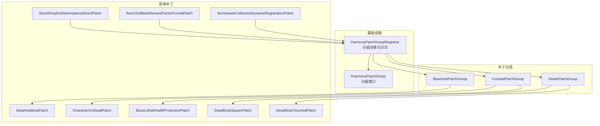
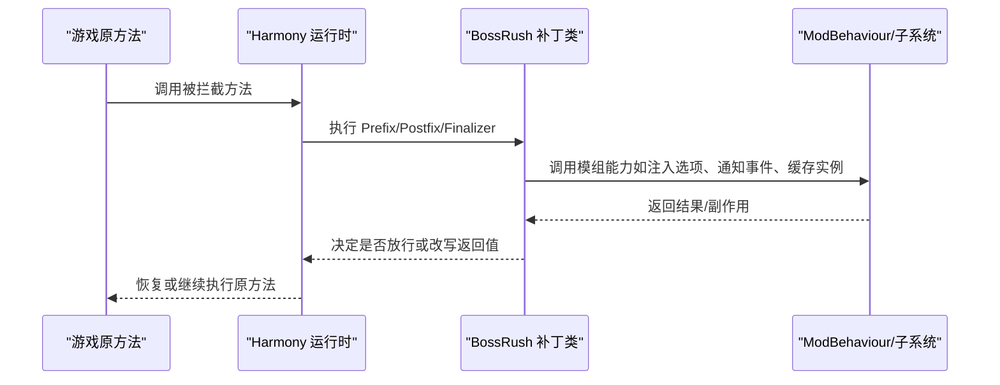
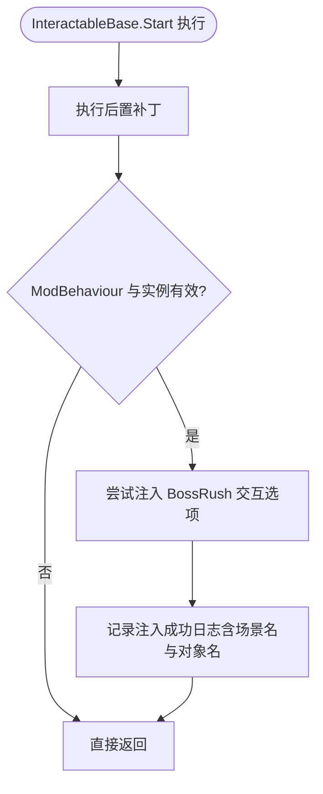
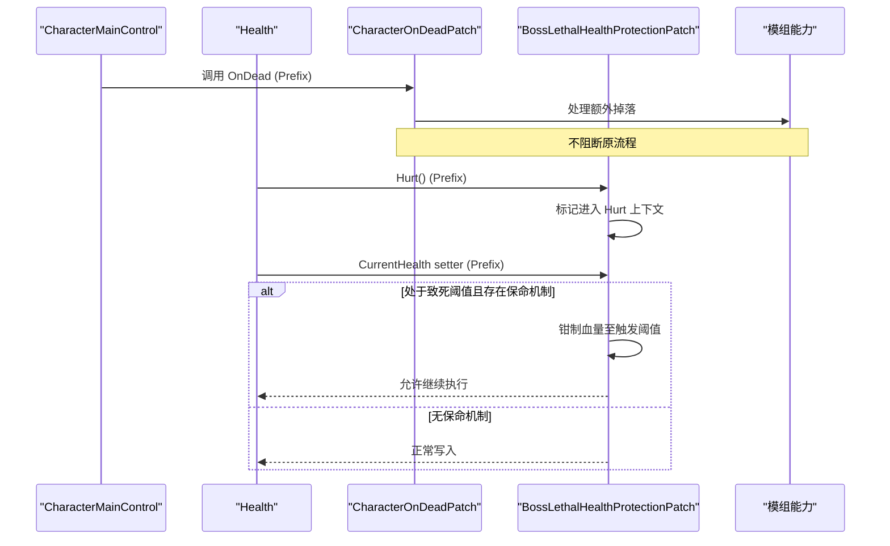
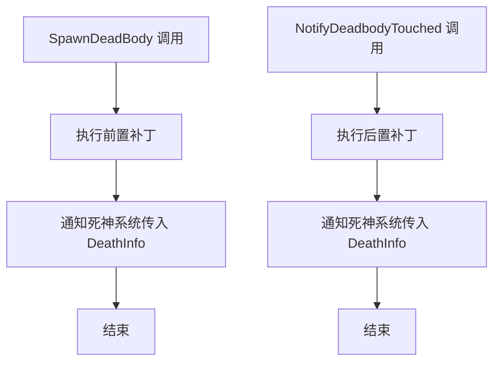
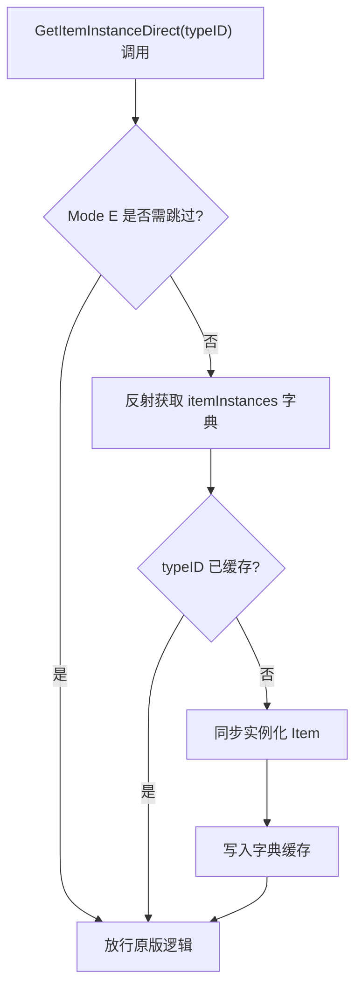
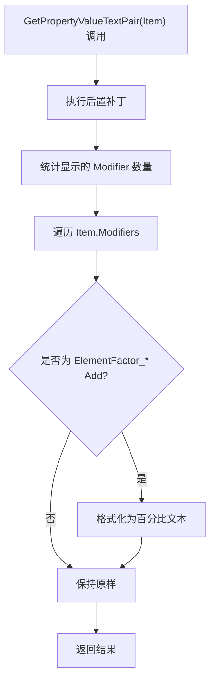
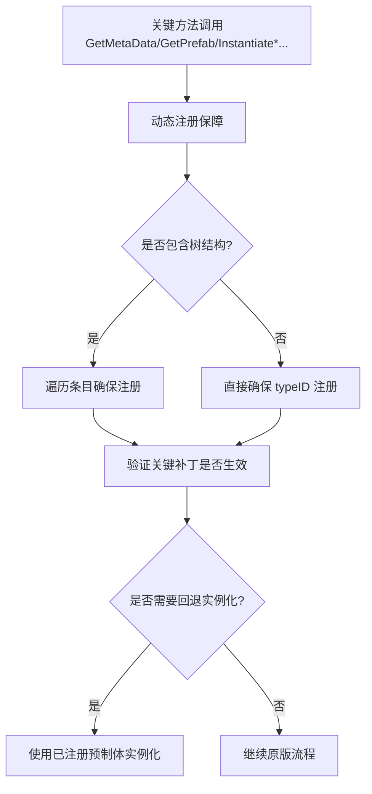
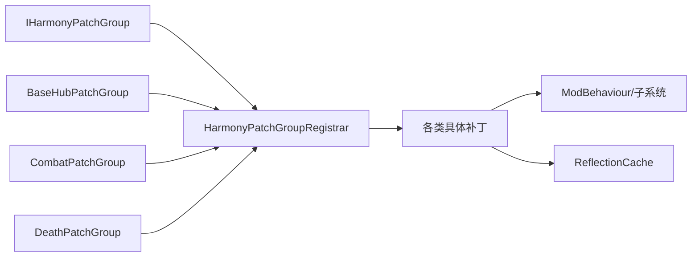

# Harmony 代码注入系统

<cite>
**本文引用的文件**
- [Injection.cs](file://Injection/Injection.cs)
- [HarmonyPatchGroupRegistrar.cs](file://Common/Infrastructure/HarmonyPatchGroupRegistrar.cs)
- [IHarmonyPatchGroup.cs](file://Common/Infrastructure/IHarmonyPatchGroup.cs)
- [BaseHubPatchGroup.cs](file://Patches/BaseHub/BaseHubPatchGroup.cs)
- [CombatPatchGroup.cs](file://Patches/Combat/CombatPatchGroup.cs)
- [DeathPatchGroup.cs](file://Patches/Death/DeathPatchGroup.cs)
- [BaseHubBoatPatch.cs](file://Patches/BaseHub/BaseHubBoatPatch.cs)
- [CharacterOnDeadPatch.cs](file://Patches/Combat/CharacterOnDeadPatch.cs)
- [BossLethalHealthProtectionPatch.cs](file://Patches/Combat/BossLethalHealthProtectionPatch.cs)
- [DeadBodySpawnPatch.cs](file://Patches/Death/DeadBodySpawnPatch.cs)
- [DeadBodyTouchedPatch.cs](file://Patches/Death/DeadBodyTouchedPatch.cs)
- [StockShopGetItemInstanceDirectPatch.cs](file://Patches/Economy/StockShopGetItemInstanceDirectPatch.cs)
- [ItemUIUtilitiesElementFactorFormatPatch.cs](file://Patches/UI/ItemUIUtilitiesElementFactorFormatPatch.cs)
- [ItemAssetsCollectionDynamicRegistrationPatch.cs](file://Patches/ItemStatsSystem/ItemAssetsCollectionDynamicRegistrationPatch.cs)
</cite>

## 目录
1. [简介](#简介)
2. [项目结构](#项目结构)
3. [核心组件](#核心组件)
4. [架构总览](#架构总览)
5. [详细组件分析](#详细组件分析)
6. [依赖关系分析](#依赖关系分析)
7. [性能考量](#性能考量)
8. [故障排查指南](#故障排查指南)
9. [结论](#结论)
10. [附录：补丁编写指南与最佳实践](#附录：补丁编写指南与最佳实践)

## 简介
本技术文档围绕 BossRushMod 的 Harmony 代码注入体系展开，聚焦于在 Unity 环境下使用 HarmonyLib 进行方法拦截、属性替换与字段修改的实践。文档重点说明 31 个补丁点的组织结构与分类管理（BaseHub、Combat、Death、Economy、UI、ItemStatsSystem），解释 PatchGroup 的概念与实现（批量注册、条件启用、版本兼容性预留），并深入剖析关键补丁的实现细节（如 BaseHub 场景集成、战斗系统增强、死亡处理优化、商店延迟注入修复、UI 显示修正、动态物品注册保障）。同时提供补丁冲突检测思路、与其他模组的兼容性建议、调试工具与方法，以及性能优化技巧。

## 项目结构
本项目将 Harmony 补丁按功能域组织到 Patches 目录下，并通过 Common/Infrastructure 提供分组注册与元数据能力；各具体补丁以类级 Harmony 注解声明目标类型与方法，配合 Prefix/Postfix/Finalizer 等钩子完成逻辑注入。

图表来源
- [HarmonyPatchGroupRegistrar.cs:1-64](file://Common/Infrastructure/HarmonyPatchGroupRegistrar.cs#L1-L64)
- [IHarmonyPatchGroup.cs:1-16](file://Common/Infrastructure/IHarmonyPatchGroup.cs#L1-L16)
- [BaseHubPatchGroup.cs:1-15](file://Patches/BaseHub/BaseHubPatchGroup.cs#L1-L15)
- [CombatPatchGroup.cs:1-15](file://Patches/Combat/CombatPatchGroup.cs#L1-L15)
- [DeathPatchGroup.cs:1-15](file://Patches/Death/DeathPatchGroup.cs#L1-L15)
- [BaseHubBoatPatch.cs:1-34](file://Patches/BaseHub/BaseHubBoatPatch.cs#L1-L34)
- [CharacterOnDeadPatch.cs:1-22](file://Patches/Combat/CharacterOnDeadPatch.cs#L1-L22)
- [BossLethalHealthProtectionPatch.cs:1-127](file://Patches/Combat/BossLethalHealthProtectionPatch.cs#L1-L127)
- [DeadBodySpawnPatch.cs:1-28](file://Patches/Death/DeadBodySpawnPatch.cs#L1-L28)
- [DeadBodyTouchedPatch.cs:1-28](file://Patches/Death/DeadBodyTouchedPatch.cs#L1-L28)
- [StockShopGetItemInstanceDirectPatch.cs:1-92](file://Patches/Economy/StockShopGetItemInstanceDirectPatch.cs#L1-L92)
- [ItemUIUtilitiesElementFactorFormatPatch.cs:1-112](file://Patches/UI/ItemUIUtilitiesElementFactorFormatPatch.cs#L1-L112)
- [ItemAssetsCollectionDynamicRegistrationPatch.cs:1-272](file://Patches/ItemStatsSystem/ItemAssetsCollectionDynamicRegistrationPatch.cs#L1-L272)

章节来源
- [HarmonyPatchGroupRegistrar.cs:1-64](file://Common/Infrastructure/HarmonyPatchGroupRegistrar.cs#L1-L64)
- [IHarmonyPatchGroup.cs:1-16](file://Common/Infrastructure/IHarmonyPatchGroup.cs#L1-L16)

## 核心组件
- 分组接口 IHarmonyPatchGroup：定义分组名称与启用状态，用于日志输出与未来按组开关控制。
- 分组注册器 HarmonyPatchGroupRegistrar：维护已注册分组列表，去重注册，支持清空与日志输出。当前仍委托 harmony.PatchAll(assembly) 应用补丁，但为后续“按组启用/禁用”预留扩展点。
- 占位注入模块 Injection.cs：保留原有目录结构，实际注入逻辑整合至主模块。

章节来源
- [IHarmonyPatchGroup.cs:1-16](file://Common/Infrastructure/IHarmonyPatchGroup.cs#L1-L16)
- [HarmonyPatchGroupRegistrar.cs:1-64](file://Common/Infrastructure/HarmonyPatchGroupRegistrar.cs#L1-L64)
- [Injection.cs:1-23](file://Injection/Injection.cs#L1-L23)

## 架构总览
整体采用“分组 + 补丁类”的组织方式：每个功能域（BaseHub、Combat、Death、Economy、UI、ItemStatsSystem）对应一个或多个 IHarmonyPatchGroup 实现，并在运行时由注册器统一管理。补丁类通过 Harmony 注解精确指向目标类型与方法，使用 Prefix/Postfix/Finalizer 完成前置检查、后置增强或异常兜底。

图表来源
- [BaseHubBoatPatch.cs:1-34](file://Patches/BaseHub/BaseHubBoatPatch.cs#L1-L34)
- [CharacterOnDeadPatch.cs:1-22](file://Patches/Combat/CharacterOnDeadPatch.cs#L1-L22)
- [BossLethalHealthProtectionPatch.cs:1-127](file://Patches/Combat/BossLethalHealthProtectionPatch.cs#L1-L127)
- [DeadBodySpawnPatch.cs:1-28](file://Patches/Death/DeadBodySpawnPatch.cs#L1-L28)
- [DeadBodyTouchedPatch.cs:1-28](file://Patches/Death/DeadBodyTouchedPatch.cs#L1-L28)
- [StockShopGetItemInstanceDirectPatch.cs:1-92](file://Patches/Economy/StockShopGetItemInstanceDirectPatch.cs#L1-L92)
- [ItemUIUtilitiesElementFactorFormatPatch.cs:1-112](file://Patches/UI/ItemUIUtilitiesElementFactorFormatPatch.cs#L1-L112)
- [ItemAssetsCollectionDynamicRegistrationPatch.cs:1-272](file://Patches/ItemStatsSystem/ItemAssetsCollectionDynamicRegistrationPatch.cs#L1-L272)

## 详细组件分析

### BaseHub 场景集成
- 目标：在基地设施交互对象初始化后，向船点实例注入 BossRush 交互选项。
- 机制：拦截 InteractableBase.Start 的后置钩子，确保原版初始化完成后安全注入。
- 关键点：空引用防护、场景名记录便于调试、注入成功日志。

图表来源
- [BaseHubBoatPatch.cs:1-34](file://Patches/BaseHub/BaseHubBoatPatch.cs#L1-L34)

章节来源
- [BaseHubBoatPatch.cs:1-34](file://Patches/BaseHub/BaseHubBoatPatch.cs#L1-L34)
- [BaseHubPatchGroup.cs:1-15](file://Patches/BaseHub/BaseHubPatchGroup.cs#L1-L15)

### 战斗系统增强
- 角色死亡前缀：在 CharacterMainControl.OnDead 前触发额外掉落处理（如特定 Boss 掉落逻辑）。
- 致死伤害保护：在 Health.Hurt 内部及 CurrentHealth 设置时，针对具备保命机制的目标（逆鳞、龙皇“孩儿护我”、龙裔遗族复活）钳制血量，确保 OnHurt/OnHurtEvent 窗口不被跳过。

图表来源
- [CharacterOnDeadPatch.cs:1-22](file://Patches/Combat/CharacterOnDeadPatch.cs#L1-L22)
- [BossLethalHealthProtectionPatch.cs:1-127](file://Patches/Combat/BossLethalHealthProtectionPatch.cs#L1-L127)

章节来源
- [CharacterOnDeadPatch.cs:1-22](file://Patches/Combat/CharacterOnDeadPatch.cs#L1-L22)
- [BossLethalHealthProtectionPatch.cs:1-127](file://Patches/Combat/BossLethalHealthProtectionPatch.cs#L1-L127)
- [CombatPatchGroup.cs:1-15](file://Patches/Combat/CombatPatchGroup.cs#L1-L15)

### 死亡处理优化
- 尸体生成通知：拦截 DeadBodyManager.SpawnDeadBody，通知死神系统处理相关逻辑。
- 尸体触碰通知：拦截 NotifyDeadbodyTouched，在触碰时触发后续处理。

图表来源
- [DeadBodySpawnPatch.cs:1-28](file://Patches/Death/DeadBodySpawnPatch.cs#L1-L28)
- [DeadBodyTouchedPatch.cs:1-28](file://Patches/Death/DeadBodyTouchedPatch.cs#L1-L28)

章节来源
- [DeadBodySpawnPatch.cs:1-28](file://Patches/Death/DeadBodySpawnPatch.cs#L1-L28)
- [DeadBodyTouchedPatch.cs:1-28](file://Patches/Death/DeadBodyTouchedPatch.cs#L1-L28)
- [DeathPatchGroup.cs:1-15](file://Patches/Death/DeathPatchGroup.cs#L1-L15)

### 经济系统与商店延迟注入修复
- 问题：延迟注入商店条目导致 StockShop.Start 的异步缓存未覆盖新条目，打开 UI 时 GetItemInstanceDirect 返回 null 引发崩溃。
- 方案：在 GetItemInstanceDirect 前置钩子中检查 itemInstances 字典，若缺失则同步实例化并缓存，保证始终返回有效实例。
- 兼容性：与 Mode E 贝壳价格任务隔离，避免写回官方 itemInstances；与 UI 显示补丁顺序兼容（先缓存后修改）。

图表来源
- [StockShopGetItemInstanceDirectPatch.cs:1-92](file://Patches/Economy/StockShopGetItemInstanceDirectPatch.cs#L1-L92)

章节来源
- [StockShopGetItemInstanceDirectPatch.cs:1-92](file://Patches/Economy/StockShopGetItemInstanceDirectPatch.cs#L1-L92)

### UI 显示修正
- 目标：修正悬浮提示中 ElementFactor_* 固定抗性条目的显示格式，从原始小数转为百分比文本。
- 机制：拦截 ItemUIUtilities.GetPropertyValueTextPair 的后置钩子，识别 Add 类型的 ElementFactor_* 词条并格式化显示值。

图表来源
- [ItemUIUtilitiesElementFactorFormatPatch.cs:1-112](file://Patches/UI/ItemUIUtilitiesElementFactorFormatPatch.cs#L1-L112)

章节来源
- [ItemUIUtilitiesElementFactorFormatPatch.cs:1-112](file://Patches/UI/ItemUIUtilitiesElementFactorFormatPatch.cs#L1-L112)

### 动态物品注册保障
- 目标：确保动态新增物品的元数据、预制体与实例化路径均能正确注册与访问。
- 机制：对 ItemAssetsCollection 与 InventoryData 的关键入口施加前置补丁，统一调用动态注册保障；必要时自动补装关键补丁。
- 价值：解决延迟注入导致的物品不可用、实例化失败等问题，提升稳定性。

图表来源
- [ItemAssetsCollectionDynamicRegistrationPatch.cs:1-272](file://Patches/ItemStatsSystem/ItemAssetsCollectionDynamicRegistrationPatch.cs#L1-L272)

章节来源
- [ItemAssetsCollectionDynamicRegistrationPatch.cs:1-272](file://Patches/ItemStatsSystem/ItemAssetsCollectionDynamicRegistrationPatch.cs#L1-L272)

## 依赖关系分析
- 分组与注册器：所有补丁组实现 IHarmonyPatchGroup，并由 HarmonyPatchGroupRegistrar 集中管理，便于日志与未来开关控制。
- 补丁与运行时：各补丁通过 Harmony 注解绑定到游戏原方法，依赖 ModBehaviour 提供的运行时能力（如 DevLog、模式判断、子系统桥接）。
- 外部依赖：部分补丁使用反射访问私有字段（如 itemInstances），需配合 ReflectionCache 降低开销并提高健壮性。

图表来源
- [HarmonyPatchGroupRegistrar.cs:1-64](file://Common/Infrastructure/HarmonyPatchGroupRegistrar.cs#L1-L64)
- [IHarmonyPatchGroup.cs:1-16](file://Common/Infrastructure/IHarmonyPatchGroup.cs#L1-L16)

章节来源
- [HarmonyPatchGroupRegistrar.cs:1-64](file://Common/Infrastructure/HarmonyPatchGroupRegistrar.cs#L1-L64)

## 性能考量
- 热路径最小化：在高频调用点（如 Hurt、UI 显示、物品实例化）尽量做快速分支与缓存命中，避免额外分配。
- 反射缓存：对反射访问的字段/方法使用缓存，减少重复查找成本。
- 延迟注入补偿：在商店等场景中，首次访问时同步实例化并缓存，后续访问零开销。
- 异常兜底：在可能失败的反射或实例化路径中加入 try/catch，防止影响主流程。

[本节为通用指导，无需特定文件来源]

## 故障排查指南
- 日志定位：利用 ModBehaviour.DevLog 输出关键路径信息（如注入成功、警告、错误），结合场景名与对象名快速定位问题。
- 分组日志：通过注册器输出已注册分组及其启用状态，确认补丁分组是否正确加载。
- 常见症状与对策：
  - 商店 UI 崩溃：检查延迟注入条目是否已被缓存，确认 GetItemInstanceDirect 前置补丁生效。
  - Boss 保命机制失效：确认 Health.Hurt 上下文标记与 CurrentHealth 设置拦截是否工作。
  - 动态物品不可用：检查关键补丁是否被正确应用，必要时触发自动补装。
- 调试建议：
  - 在关键方法前后添加日志，观察调用链与参数。
  - 使用单元测试或守护脚本（tests 目录中的 Guard 脚本）验证结构与行为一致性。

章节来源
- [HarmonyPatchGroupRegistrar.cs:47-58](file://Common/Infrastructure/HarmonyPatchGroupRegistrar.cs#L47-L58)
- [StockShopGetItemInstanceDirectPatch.cs:84-88](file://Patches/Economy/StockShopGetItemInstanceDirectPatch.cs#L84-L88)
- [BossLethalHealthProtectionPatch.cs:19-49](file://Patches/Combat/BossLethalHealthProtectionPatch.cs#L19-L49)
- [ItemAssetsCollectionDynamicRegistrationPatch.cs:60-105](file://Patches/ItemStatsSystem/ItemAssetsCollectionDynamicRegistrationPatch.cs#L60-L105)

## 结论
BossRushMod 的 Harmony 注入体系通过清晰的分组管理与精细化的补丁设计，实现了对 BaseHub、战斗、死亡、经济、UI 与物品系统等关键环节的稳健增强。借助分组注册器与接口抽象，未来可平滑扩展按组启用/禁用与版本兼容性管理。关键补丁在性能与稳定性方面做了充分考量，提供了可靠的运行时保障。建议在新增补丁时遵循本文档的最佳实践，确保与现有系统的兼容性与可维护性。

[本节为总结性内容，无需特定文件来源]

## 附录：补丁编写指南与最佳实践
- 前置条件检查：在进入补丁逻辑前，校验必要对象与上下文（如 ModBehaviour.Instance、目标实例有效性），避免空引用。
- 异常处理：对反射、网络、资源加载等易错路径包裹 try/catch，记录警告日志并放行原流程，确保鲁棒性。
- 性能优化：
  - 在热路径中使用缓存（如 ReflectionCache）减少反射开销。
  - 仅在必要时进行实例化或计算，命中缓存后直接返回。
  - 避免在高频回调中进行字符串拼接或大量分配。
- 补丁冲突检测与解决方案：
  - 使用分组名称与日志标识区分不同补丁来源。
  - 对关键方法进行“拥有者检查”，避免重复或冲突补丁。
  - 对第三方补丁采用有序组合（Prefix/Postfix/Finalizer）明确执行顺序。
- 与其他模组的兼容性：
  - 尊重原版与官方补丁的执行语义，避免破坏其契约。
  - 对特定模式（如 Mode E）进行隔离处理，避免全局污染。
  - 提供配置项或开关，便于用户按需启用/禁用功能。
- 调试工具与方法：
  - 使用 DevLog 输出结构化日志（包含上下文、参数、结果）。
  - 利用测试脚本与守护规则（tests 目录）持续验证结构与行为。
  - 在关键路径加入断点或条件日志，逐步缩小问题范围。

[本节为通用指导，无需特定文件来源]