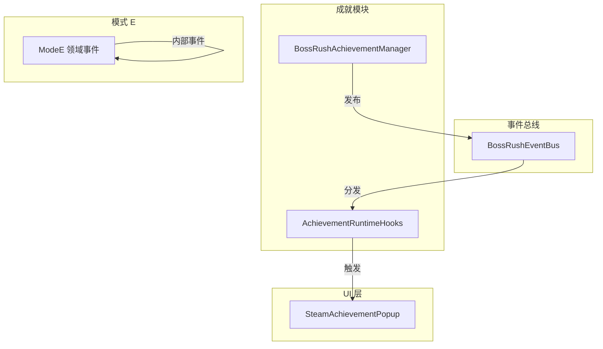
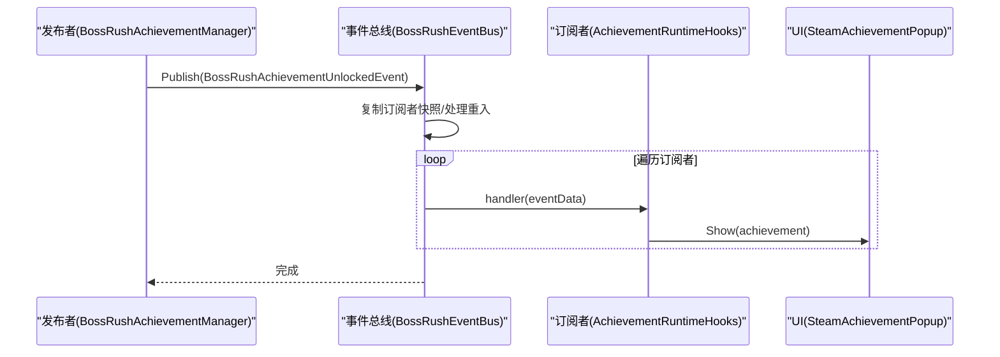
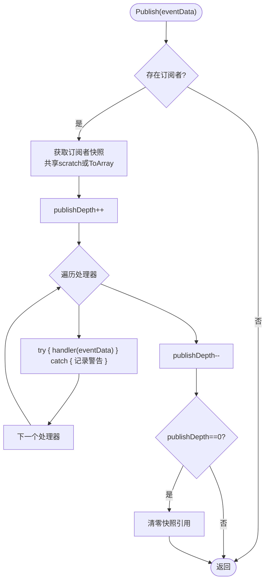
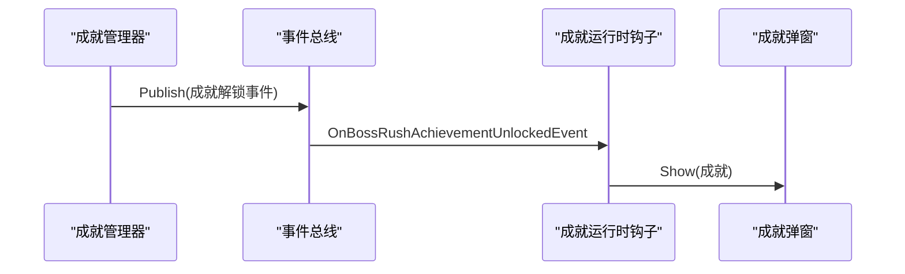
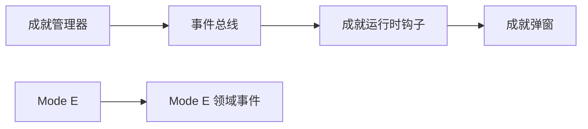

# 事件驱动系统

<cite>
**本文引用的文件**
- [BossRushEventBus.cs](file://Common/Events/BossRushEventBus.cs)
- [AchievementRuntimeHooks.cs](file://Achievement/AchievementRuntimeHooks.cs)
- [BossRushAchievementManager.cs](file://Achievement/BossRushAchievementManager.cs)
- [ModeE.cs](file://ModeE/ModeE.cs)
- [AlwaysOnRuntimeHooks.cs](file://Utilities/AlwaysOnRuntimeHooks.cs)
</cite>

## 目录
1. [简介](#简介)
2. [项目结构](#项目结构)
3. [核心组件](#核心组件)
4. [架构总览](#架构总览)
5. [详细组件分析](#详细组件分析)
6. [依赖关系分析](#依赖关系分析)
7. [性能考量](#性能考量)
8. [故障排查指南](#故障排查指南)
9. [结论](#结论)
10. [附录](#附录)

## 简介
本文件为 BossRushMod 的事件驱动系统提供全面技术文档，聚焦于 BossRushEventBus 的设计模式与实现原理，覆盖事件的发布订阅机制、事件类型定义、消息传递流程、生命周期管理、错误隔离与性能优化策略。同时给出在成就追踪、NPC 关系系统与 Boss 战斗等场景中的使用方式，并提供调试与监控建议，帮助开发者高效定位问题并保障运行稳定性。

## 项目结构
事件系统的核心位于 Common/Events 目录，当前已实现的通用事件总线为 BossRushEventBus；业务侧通过该总线进行跨模块通信。成就解锁事件作为首个具体事件类型，由 Achievement 模块发布，并由 UI 层订阅以展示弹窗。此外，Mode E 内部也定义了若干领域事件（如余额变更、价格缓存变更、交易门状态变更），用于模块内解耦。

图表来源
- [BossRushEventBus.cs:10-136](file://Common/Events/BossRushEventBus.cs#L10-L136)
- [BossRushAchievementManager.cs:250-260](file://Achievement/BossRushAchievementManager.cs#L250-L260)
- [AchievementRuntimeHooks.cs:13-52](file://Achievement/AchievementRuntimeHooks.cs#L13-L52)
- [ModeE.cs:39-63](file://ModeE/ModeE.cs#L39-L63)

章节来源
- [BossRushEventBus.cs:10-136](file://Common/Events/BossRushEventBus.cs#L10-L136)
- [AchievementRuntimeHooks.cs:13-52](file://Achievement/AchievementRuntimeHooks.cs#L13-L52)
- [BossRushAchievementManager.cs:250-260](file://Achievement/BossRushAchievementManager.cs#L250-L260)
- [ModeE.cs:39-63](file://ModeE/ModeE.cs#L39-L63)

## 核心组件
- 事件总线：BossRushEventBus，提供泛型 Subscribe/Publish/Unsubscribe，支持嵌套发布保护与异常隔离，内置静态缓存清理接口。
- 事件类型：当前包含 BossRushAchievementUnlockedEvent（成就解锁）；Mode E 中定义了 ModeEShellBalanceChangedEvent、ModeEShellPriceCacheChangedEvent、ModeEShellTransactionGateChangedEvent 等。
- 订阅方：AchievementRuntimeHooks 订阅成就解锁事件，触发 SteamAchievementPopup 显示。
- 发布者：BossRushAchievementManager 在成就解锁时发布事件。

章节来源
- [BossRushEventBus.cs:10-136](file://Common/Events/BossRushEventBus.cs#L10-L136)
- [BossRushEventBus.cs:139-147](file://Common/Events/BossRushEventBus.cs#L139-L147)
- [AchievementRuntimeHooks.cs:13-52](file://Achievement/AchievementRuntimeHooks.cs#L13-L52)
- [BossRushAchievementManager.cs:250-260](file://Achievement/BossRushAchievementManager.cs#L250-L260)
- [ModeE.cs:39-63](file://ModeE/ModeE.cs#L39-L63)

## 架构总览
BossRushEventBus 采用“轻量级运行时通知总线”设计，以字典维护每种事件类型的订阅者列表，发布时拷贝快照以避免迭代期间集合被修改；对每个处理器调用进行 try/catch 包裹，确保单个处理器异常不会中断其他处理器执行；通过 publishDepth 计数器防止重入导致的并发修改问题；提供 ClearRuntimeSubscribers/ResetStaticCaches 用于生命周期结束时的资源释放。

图表来源
- [BossRushAchievementManager.cs:250-260](file://Achievement/BossRushAchievementManager.cs#L250-L260)
- [BossRushEventBus.cs:60-113](file://Common/Events/BossRushEventBus.cs#L60-L113)
- [AchievementRuntimeHooks.cs:13-52](file://Achievement/AchievementRuntimeHooks.cs#L13-L52)

## 详细组件分析

### BossRushEventBus：发布订阅与消息传递
- 订阅与取消订阅：按事件类型维护 List<Delegate>，避免重复订阅；取消订阅后若列表为空则移除键以减少内存占用。
- 发布流程：
  - 无订阅者直接返回，零开销。
  - 首次发布或浅层发布时使用共享 scratch 数组减少分配；深层发布使用 ToArray 保证安全。
  - 对每个处理器调用进行异常捕获并记录日志，避免单点失败影响整体。
  - 使用 publishDepth 计数防止重入导致集合修改的竞态。
- 生命周期清理：ClearRuntimeSubscribers 清空所有订阅；ResetStaticCaches 重置订阅与 scratch 缓冲。

图表来源
- [BossRushEventBus.cs:60-113](file://Common/Events/BossRushEventBus.cs#L60-L113)
- [BossRushEventBus.cs:115-124](file://Common/Events/BossRushEventBus.cs#L115-L124)

章节来源
- [BossRushEventBus.cs:18-58](file://Common/Events/BossRushEventBus.cs#L18-L58)
- [BossRushEventBus.cs:60-136](file://Common/Events/BossRushEventBus.cs#L60-L136)

### 成就解锁事件：从发布到 UI 展示
- 发布者：BossRushAchievementManager 在解锁成就时发布 BossRushAchievementUnlockedEvent。
- 订阅者：AchievementRuntimeHooks 在初始化时订阅，并在收到事件时调用 SteamAchievementPopup.Show。
- 清理：在 CleanupAchievementRuntime 中取消订阅，避免内存泄漏。

图表来源
- [BossRushAchievementManager.cs:250-260](file://Achievement/BossRushAchievementManager.cs#L250-L260)
- [AchievementRuntimeHooks.cs:13-52](file://Achievement/AchievementRuntimeHooks.cs#L13-L52)

章节来源
- [BossRushAchievementManager.cs:250-260](file://Achievement/BossRushAchievementManager.cs#L250-L260)
- [AchievementRuntimeHooks.cs:13-52](file://Achievement/AchievementRuntimeHooks.cs#L13-L52)

### Mode E 领域事件：会话与交易一致性
- 事件类型：ModeEShellBalanceChangedEvent、ModeEShellPriceCacheChangedEvent、ModeEShellTransactionGateChangedEvent。
- 用途：在 Mode E 沙盒模式中，将余额变化、价格缓存更新、交易门状态变更等关键状态以事件形式广播，供 UI、缓存、审计等子系统消费，降低耦合度。
- 特点：事件携带 SessionToken/Generation 等标识，便于过滤过期异步回调与旧会话数据。

章节来源
- [ModeE.cs:39-63](file://ModeE/ModeE.cs#L39-L63)

### 事件生命周期与资源清理
- 订阅生命周期：
  - 初始化阶段：订阅所需事件（例如成就运行时初始化时订阅成就解锁事件）。
  - 运行阶段：事件驱动各子系统响应。
  - 清理阶段：取消订阅并重置静态缓存，避免残留引用导致内存泄漏。
- 全局清理：AlwaysOnRuntimeHooks 在卸载时调用 BossRushEventBus.ResetStaticCaches，确保事件总线状态归零。

章节来源
- [AchievementRuntimeHooks.cs:8-47](file://Achievement/AchievementRuntimeHooks.cs#L8-L47)
- [AlwaysOnRuntimeHooks.cs:180-189](file://Utilities/AlwaysOnRuntimeHooks.cs#L180-L189)

## 依赖关系分析
- 成就模块依赖事件总线进行跨层通信，UI 层仅依赖事件而不直接依赖成就逻辑。
- Mode E 内部事件用于模块内解耦，不依赖外部总线。
- 事件总线为静态类，无实例化成本，但需关注静态缓存的生命周期管理。

图表来源
- [BossRushAchievementManager.cs:250-260](file://Achievement/BossRushAchievementManager.cs#L250-L260)
- [AchievementRuntimeHooks.cs:13-52](file://Achievement/AchievementRuntimeHooks.cs#L13-L52)
- [ModeE.cs:39-63](file://ModeE/ModeE.cs#L39-L63)

章节来源
- [BossRushEventBus.cs:10-136](file://Common/Events/BossRushEventBus.cs#L10-L136)
- [AchievementRuntimeHooks.cs:13-52](file://Achievement/AchievementRuntimeHooks.cs#L13-L52)
- [BossRushAchievementManager.cs:250-260](file://Achievement/BossRushAchievementManager.cs#L250-L260)
- [ModeE.cs:39-63](file://ModeE/ModeE.cs#L39-L63)

## 性能考量
- 零订阅快速路径：无订阅者时直接返回，避免不必要的分配与循环。
- 共享 Scratch 数组：首次发布使用共享数组减少 GC 压力，后续按需扩容。
- 重入保护：publishDepth 计数避免嵌套发布期间的集合修改风险。
- 异常隔离：每个处理器独立 try/catch，避免单点失败影响整体分发。
- 清理策略：取消订阅后若列表为空则移除键，减少字典大小；提供 ResetStaticCaches 统一清理。

[本节为通用性能指导，无需特定文件来源]

## 故障排查指南
- 事件未触发：
  - 检查是否正确订阅对应事件类型。
  - 确认发布时机是否在订阅之后。
  - 查看日志中是否有处理器异常警告。
- 内存泄漏：
  - 确认在清理阶段是否调用了 Unsubscribe。
  - 在场景切换或模式结束时调用 ResetStaticCaches。
- 性能问题：
  - 评估订阅者数量与处理器复杂度，必要时拆分事件或引入节流。
  - 避免在处理器中进行昂贵操作，可改为异步或延迟任务。

章节来源
- [BossRushEventBus.cs:90-98](file://Common/Events/BossRushEventBus.cs#L90-L98)
- [AchievementRuntimeHooks.cs:41-47](file://Achievement/AchievementRuntimeHooks.cs#L41-L47)
- [AlwaysOnRuntimeHooks.cs:180-189](file://Utilities/AlwaysOnRuntimeHooks.cs#L180-L189)

## 结论
BossRushEventBus 提供了轻量、安全且高性能的事件分发能力，通过快照发布、异常隔离与重入保护，有效降低了模块间耦合度并提升了系统鲁棒性。结合成就解锁与 Mode E 领域事件的实际用例，展示了事件驱动在复杂游戏系统中的价值。建议在新增事件时遵循统一的命名与数据结构约定，并在生命周期结束时严格清理订阅与静态缓存，以确保长期运行的稳定性。

[本节为总结性内容，无需特定文件来源]

## 附录

### 事件类型与使用场景
- 成就解锁事件：用于在成就达成时通知 UI 层展示弹窗，也可扩展至统计、遥测等系统。
- Mode E 领域事件：用于会话内状态同步，如余额变化、价格缓存更新、交易门状态变更，支撑 UI、缓存与审计等子系统。

章节来源
- [BossRushEventBus.cs:139-147](file://Common/Events/BossRushEventBus.cs#L139-L147)
- [ModeE.cs:39-63](file://ModeE/ModeE.cs#L39-L63)

### 订阅与发布的典型流程
- 订阅：在模块初始化时调用 Subscribe<TEvent>，绑定处理器方法。
- 发布：在业务逻辑关键点调用 Publish<TEvent>，传入事件数据。
- 清理：在模块销毁或场景切换时调用 Unsubscribe<TEvent>，并在必要时调用 ResetStaticCaches。

章节来源
- [AchievementRuntimeHooks.cs:13-47](file://Achievement/AchievementRuntimeHooks.cs#L13-L47)
- [BossRushAchievementManager.cs:250-260](file://Achievement/BossRushAchievementManager.cs#L250-L260)
- [BossRushEventBus.cs:18-58](file://Common/Events/BossRushEventBus.cs#L18-L58)
- [BossRushEventBus.cs:126-136](file://Common/Events/BossRushEventBus.cs#L126-L136)