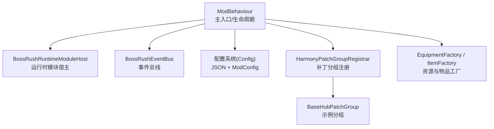
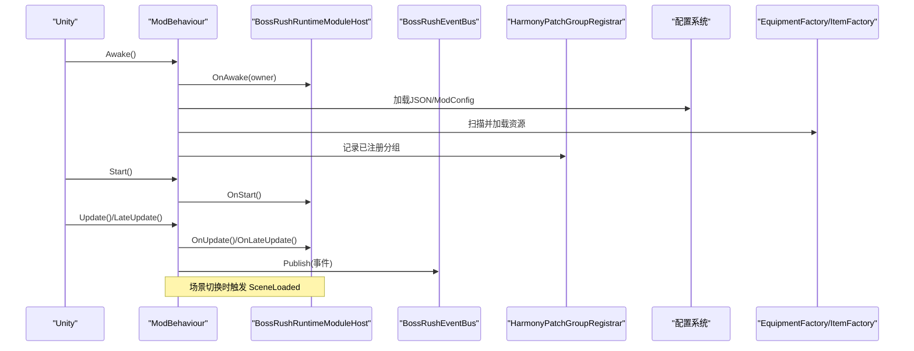
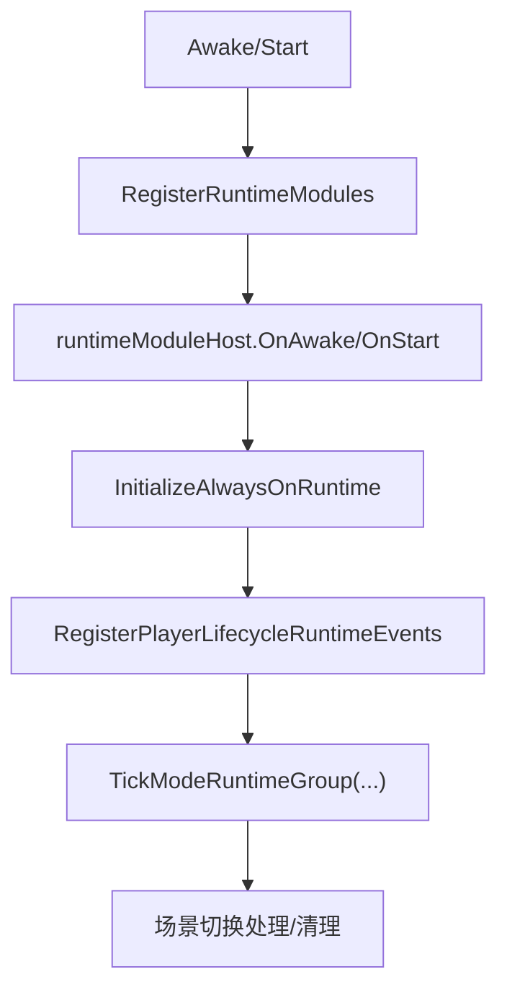
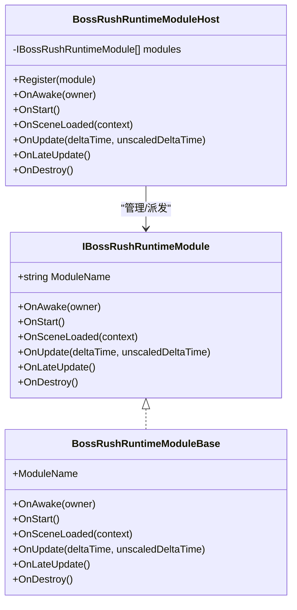
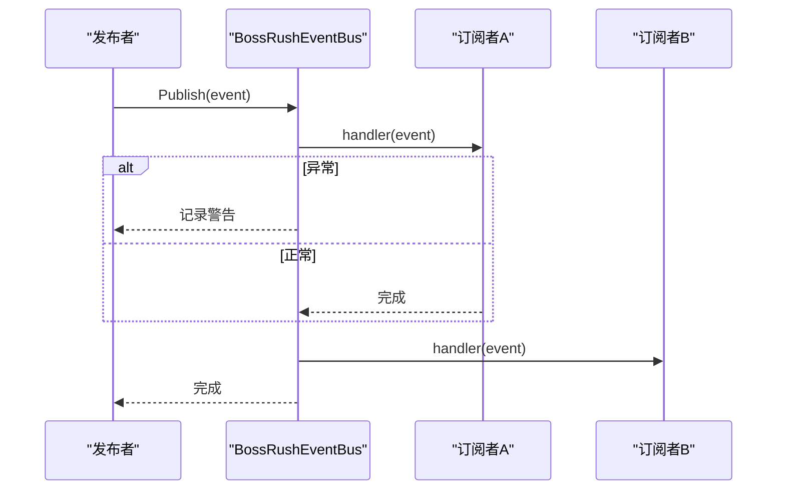
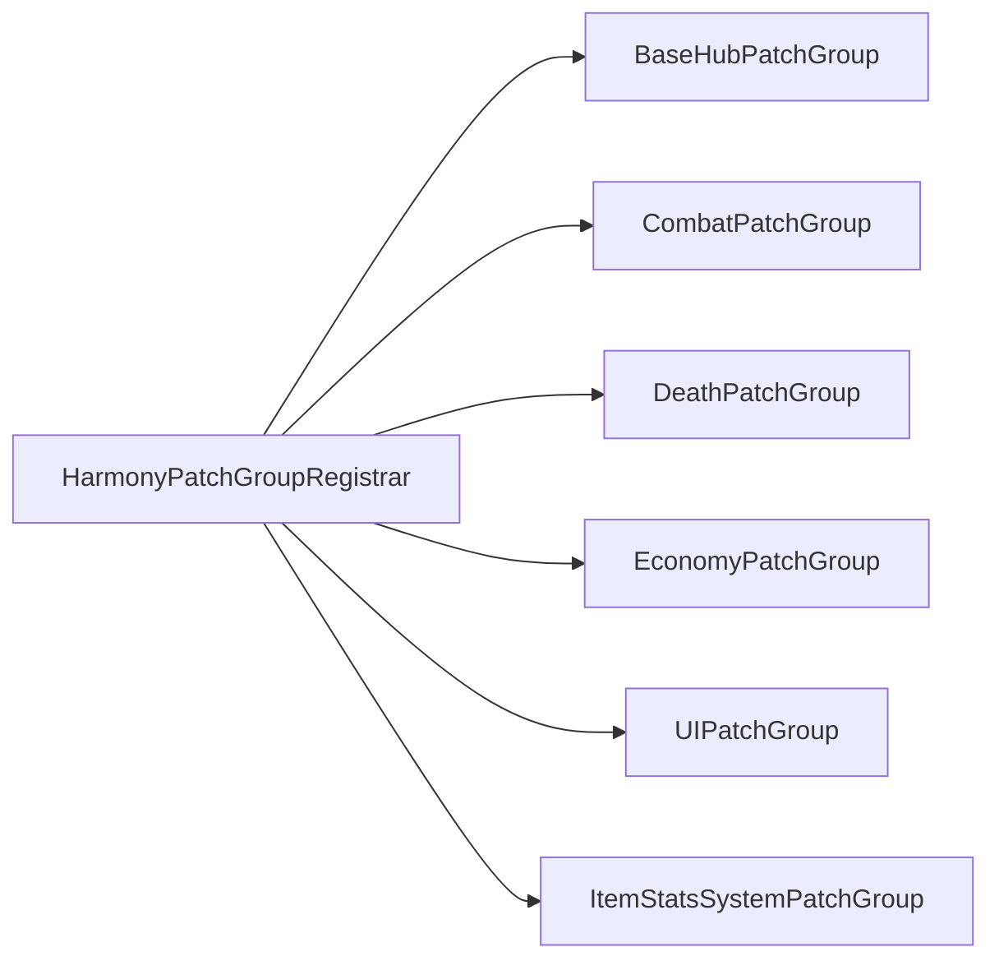
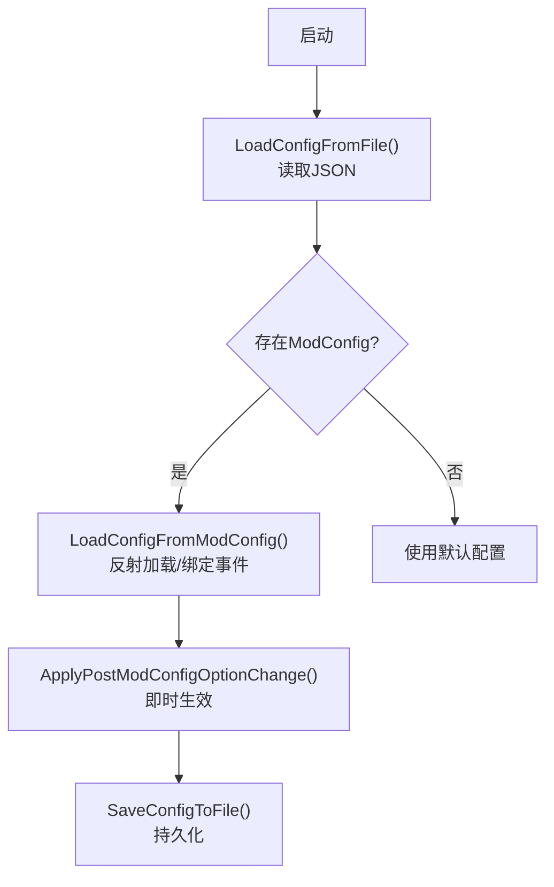
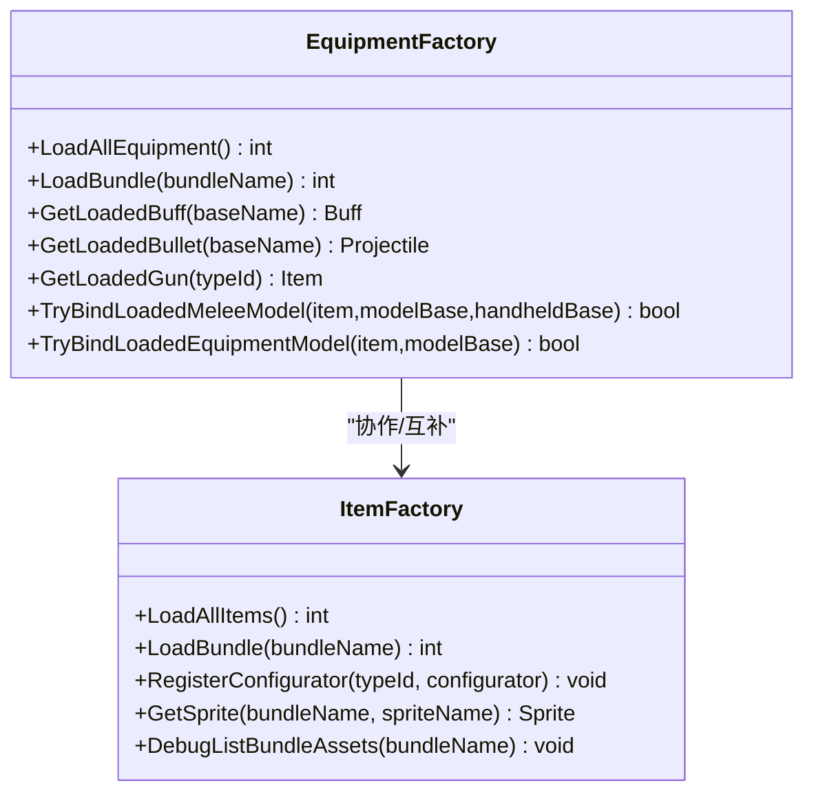
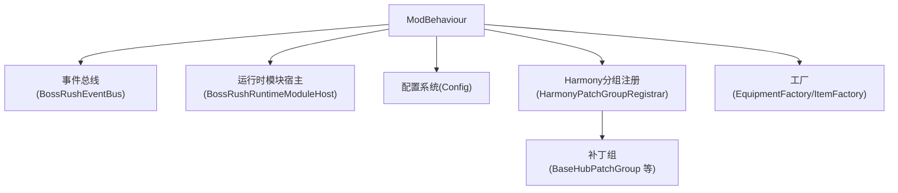

# 技术架构概览

<cite>
**本文引用的文件**
- [ModBehaviour.cs](file://ModBehaviour.cs)
- [BossRushRuntimeModuleBase.cs](file://Common/Lifecycle/BossRushRuntimeModuleBase.cs)
- [BossRushRuntimeModuleHost.cs](file://Common/Lifecycle/BossRushRuntimeModuleHost.cs)
- [IHarmonyPatchGroup.cs](file://Common/Infrastructure/IHarmonyPatchGroup.cs)
- [HarmonyPatchGroupRegistrar.cs](file://Common/Infrastructure/HarmonyPatchGroupRegistrar.cs)
- [BaseHubPatchGroup.cs](file://Patches/BaseHub/BaseHubPatchGroup.cs)
- [BossRushEventBus.cs](file://Common/Events/BossRushEventBus.cs)
- [Config.cs](file://Config/Config.cs)
- [EquipmentFactory.cs](file://Integration/EquipmentFactory.cs)
- [ItemFactory.cs](file://Integration/ItemFactory.cs)
- [Injection.cs](file://Injection/Injection.cs)
</cite>

## 目录
1. [简介](#简介)
2. [项目结构](#项目结构)
3. [核心组件](#核心组件)
4. [架构总览](#架构总览)
5. [详细组件分析](#详细组件分析)
6. [依赖关系分析](#依赖关系分析)
7. [性能与内存优化](#性能与内存优化)
8. [故障排查指南](#故障排查指南)
9. [结论](#结论)
10. [附录：构建与编译流程](#附录构建与编译流程)

## 简介
本概览面向 BossRushMod 的 Unity 模组开发者，系统性阐述其模块化架构、事件驱动、工厂模式、运行时模块系统、Harmony 补丁组织、配置系统与构建流程。文档以代码级事实为依据，配合图示帮助读者快速理解整体设计与关键路径。

## 项目结构
BossRushMod 采用“按功能域+基础设施”的分层组织方式：
- 根目录：主入口与全局生命周期（ModBehaviour）
- Common：运行时模块基类、宿主、事件总线、Harmony 分组注册等基础设施
- Integration：内容注入与工厂（装备/物品加载、集成桥接）
- Patches：Harmony 补丁按领域分组（基地、战斗、死亡、经济、UI、物品统计）
- Config：配置系统（本地 JSON + ModConfig 动态配置）
- 各 Mode（D/E/F/G）、WavesArena、ZombieMode、Achievement、Audio、LootAndRewards、MapSelection、UIAndSigns、Utilities 等：具体玩法与工具实现

图表来源
- [ModBehaviour.cs:598-756](file://ModBehaviour.cs#L598-L756)
- [BossRushRuntimeModuleHost.cs:6-128](file://Common/Lifecycle/BossRushRuntimeModuleHost.cs#L6-L128)
- [BossRushEventBus.cs:10-137](file://Common/Events/BossRushEventBus.cs#L10-L137)
- [Config.cs:158-704](file://Config/Config.cs#L158-L704)
- [HarmonyPatchGroupRegistrar.cs:10-61](file://Common/Infrastructure/HarmonyPatchGroupRegistrar.cs#L10-L61)
- [BaseHubPatchGroup.cs:9-13](file://Patches/BaseHub/BaseHubPatchGroup.cs#L9-L13)
- [EquipmentFactory.cs:176-749](file://Integration/EquipmentFactory.cs#L176-L749)
- [ItemFactory.cs:123-607](file://Integration/ItemFactory.cs#L123-L607)

章节来源
- [ModBehaviour.cs:598-756](file://ModBehaviour.cs#L598-L756)
- [BossRushRuntimeModuleHost.cs:6-128](file://Common/Lifecycle/BossRushRuntimeModuleHost.cs#L6-L128)
- [BossRushEventBus.cs:10-137](file://Common/Events/BossRushEventBus.cs#L10-L137)
- [Config.cs:158-704](file://Config/Config.cs#L158-L704)
- [HarmonyPatchGroupRegistrar.cs:10-61](file://Common/Infrastructure/HarmonyPatchGroupRegistrar.cs#L10-L61)
- [BaseHubPatchGroup.cs:9-13](file://Patches/BaseHub/BaseHubPatchGroup.cs#L9-L13)
- [EquipmentFactory.cs:176-749](file://Integration/EquipmentFactory.cs#L176-L749)
- [ItemFactory.cs:123-607](file://Integration/ItemFactory.cs#L123-L607)

## 核心组件
- 主入口与生命周期：ModBehaviour 作为 Unity ModBehaviour 派生类，负责单例、场景门控、模块宿主调度、调试与成就初始化、模式状态管理、波次与清理逻辑等。
- 运行时模块系统：通过 BossRushRuntimeModuleBase 抽象生命周期钩子，由 BossRushRuntimeModuleHost 统一注册与分发 Awake/Start/SceneLoaded/Update/LateUpdate/Destroy。
- 事件总线：BossRushEventBus 提供类型安全的发布/订阅，支持重入保护与异常隔离，用于跨模块低耦合通信。
- Harmony 补丁分组：IHarmonyPatchGroup 定义分组元数据，HarmonyPatchGroupRegistrar 维护分组列表并输出日志；示例 BaseHubPatchGroup 体现分组化组织。
- 配置系统：Config 模块支持从 StreamingAssets 的 JSON 文件加载与保存，并通过反射对接 ModConfig 模组的动态选项，支持热更新与范围校验。
- 工厂模式：EquipmentFactory 与 ItemFactory 分别负责装备/武器与消耗品等非装备类物品的 AssetBundle 扫描、解析、缓存与注册，提供统一的加载 API。

章节来源
- [ModBehaviour.cs:24-756](file://ModBehaviour.cs#L24-L756)
- [BossRushRuntimeModuleBase.cs:3-13](file://Common/Lifecycle/BossRushRuntimeModuleBase.cs#L3-L13)
- [BossRushRuntimeModuleHost.cs:6-128](file://Common/Lifecycle/BossRushRuntimeModuleHost.cs#L6-L128)
- [BossRushEventBus.cs:10-137](file://Common/Events/BossRushEventBus.cs#L10-L137)
- [IHarmonyPatchGroup.cs:7-14](file://Common/Infrastructure/IHarmonyPatchGroup.cs#L7-L14)
- [HarmonyPatchGroupRegistrar.cs:10-61](file://Common/Infrastructure/HarmonyPatchGroupRegistrar.cs#L10-L61)
- [BaseHubPatchGroup.cs:9-13](file://Patches/BaseHub/BaseHubPatchGroup.cs#L9-L13)
- [Config.cs:158-704](file://Config/Config.cs#L158-L704)
- [EquipmentFactory.cs:176-749](file://Integration/EquipmentFactory.cs#L176-L749)
- [ItemFactory.cs:123-607](file://Integration/ItemFactory.cs#L123-L607)

## 架构总览
BossRushMod 的核心运行流围绕“主入口 -> 模块宿主 -> 各运行时模块”展开，同时通过事件总线进行解耦通信，使用 Harmony 对游戏系统进行非侵入式扩展，借助工厂模式加载自定义内容，并以配置系统驱动行为开关与数值调优。

图表来源
- [ModBehaviour.cs:598-756](file://ModBehaviour.cs#L598-L756)
- [BossRushRuntimeModuleHost.cs:21-118](file://Common/Lifecycle/BossRushRuntimeModuleHost.cs#L21-L118)
- [BossRushEventBus.cs:60-113](file://Common/Events/BossRushEventBus.cs#L60-L113)
- [HarmonyPatchGroupRegistrar.cs:51-61](file://Common/Infrastructure/HarmonyPatchGroupRegistrar.cs#L51-L61)
- [Config.cs:158-704](file://Config/Config.cs#L158-L704)
- [EquipmentFactory.cs:176-749](file://Integration/EquipmentFactory.cs#L176-L749)
- [ItemFactory.cs:123-607](file://Integration/ItemFactory.cs#L123-L607)

## 详细组件分析

### 主入口与生命周期：ModBehaviour
- 职责：单例管理、场景门控、模块宿主调度、玩家生命周期事件、成就与调试工具初始化、模式状态机、波次与敌人清理、竞技场中心设置等。
- 关键点：
  - Awake/Start/LateUpdate 中调用 runtimeModuleHost 的生命周期方法，确保各模块在正确时机执行。
  - 场景加载回调中清理与准备运行时上下文，避免跨场景状态污染。
  - 提供地图配置查询与默认传送位置计算，支撑多地图刷新点与路牌定位。
  - 内置性能优化：角色缓存、销毁列表复用、竞技场半径限制等。

图表来源
- [ModBehaviour.cs:598-756](file://ModBehaviour.cs#L598-L756)

章节来源
- [ModBehaviour.cs:24-756](file://ModBehaviour.cs#L24-L756)

### 运行时模块系统：BossRushRuntimeModuleBase 与 Host
- 设计原则：
  - 基于接口 IBossRushRuntimeModule 抽象生命周期钩子，便于新增模块无需修改宿主。
  - BossRushRuntimeModuleBase 提供空实现，降低模块开发成本。
  - BossRushRuntimeModuleHost 集中管理模块集合，统一派发生命周期，并对每个模块异常进行捕获与日志记录，提升鲁棒性。
- 优势：高内聚、低耦合；易于测试与替换；支持按组启用/禁用（预留）。

图表来源
- [BossRushRuntimeModuleBase.cs:3-13](file://Common/Lifecycle/BossRushRuntimeModuleBase.cs#L3-L13)
- [BossRushRuntimeModuleHost.cs:6-128](file://Common/Lifecycle/BossRushRuntimeModuleHost.cs#L6-L128)

章节来源
- [BossRushRuntimeModuleBase.cs:3-13](file://Common/Lifecycle/BossRushRuntimeModuleBase.cs#L3-L13)
- [BossRushRuntimeModuleHost.cs:6-128](file://Common/Lifecycle/BossRushRuntimeModuleHost.cs#L6-L128)

### 事件总线：BossRushEventBus
- 设计要点：
  - 类型安全的事件分发，内部以字典维护订阅者列表。
  - 发布时使用共享缓冲数组减少分配，支持嵌套发布（publishDepth），并在发布后清理引用防止泄漏。
  - 异常隔离：单个处理器抛错不影响其他处理器，且记录警告日志。
- 适用场景：跨模块通知（如成就解锁、波次完成、配置变更等）。

图表来源
- [BossRushEventBus.cs:60-113](file://Common/Events/BossRushEventBus.cs#L60-L113)

章节来源
- [BossRushEventBus.cs:10-137](file://Common/Events/BossRushEventBus.cs#L10-L137)

### Harmony 补丁组织策略
- 分组接口 IHarmonyPatchGroup：提供 GroupName 与 IsEnabled 元数据，便于日志与未来按组开关。
- 注册器 HarmonyPatchGroupRegistrar：维护分组列表、去重、输出已注册分组日志，当前仍委托 harmony.PatchAll(assembly)。
- 示例 BaseHubPatchGroup：展示如何为特定领域（基地设施）划分补丁组。
- 实践建议：将补丁按领域分目录存放（BaseHub、Combat、Death、Economy、UI、ItemStatsSystem），保持职责单一、便于维护与测试。

图表来源
- [HarmonyPatchGroupRegistrar.cs:10-61](file://Common/Infrastructure/HarmonyPatchGroupRegistrar.cs#L10-L61)
- [BaseHubPatchGroup.cs:9-13](file://Patches/BaseHub/BaseHubPatchGroup.cs#L9-L13)

章节来源
- [IHarmonyPatchGroup.cs:7-14](file://Common/Infrastructure/IHarmonyPatchGroup.cs#L7-L14)
- [HarmonyPatchGroupRegistrar.cs:10-61](file://Common/Infrastructure/HarmonyPatchGroupRegistrar.cs#L10-L61)
- [BaseHubPatchGroup.cs:9-13](file://Patches/BaseHub/BaseHubPatchGroup.cs#L9-L13)

### 配置系统：运行时配置与 JSON 文件
- 双源配置：
  - 本地 JSON：位于 StreamingAssets/BossRushModConfig.txt，支持读取与写入，包含波次间隔、掉落随机化、掩体行为、无间炼狱参数、Boss 倍率、额外休息时间、每局变异词条数量等。
  - ModConfig 动态配置：通过反射查找 ModConfig.OptionsManager_Mod，动态加载/监听配置项变更，支持热更新与范围校验。
- 热更新机制：当检测到配置键变化时，仅重新加载对应值并持久化到本地文件，必要时立即生效（如波次间隔倒计时重算）。

图表来源
- [Config.cs:158-704](file://Config/Config.cs#L158-L704)

章节来源
- [Config.cs:158-704](file://Config/Config.cs#L158-L704)

### 工厂模式：EquipmentFactory 与 ItemFactory
- EquipmentFactory：
  - 自动扫描 Assets/Equipment 下的 AssetBundle，识别装备/武器/图腾/Buff/子弹等资源。
  - 根据命名约定解析类型，关联模型、Buff、子弹，并注册到游戏物品系统。
  - 提供 TryBindLoadedMeleeModel/TryBindLoadedEquipmentModel 等能力，支持运行时绑定与外观注入。
- ItemFactory：
  - 自动扫描 Assets/Items 下的 AssetBundle，加载消耗品等非装备类物品。
  - 提供 RegisterConfigurator 回调机制，允许在加载后对物品进行二次配置。
  - 支持 Sprite 缓存与从文件加载，提供 DebugListBundleAssets 调试能力。

图表来源
- [EquipmentFactory.cs:176-749](file://Integration/EquipmentFactory.cs#L176-L749)
- [ItemFactory.cs:123-607](file://Integration/ItemFactory.cs#L123-L607)

章节来源
- [EquipmentFactory.cs:176-749](file://Integration/EquipmentFactory.cs#L176-L749)
- [ItemFactory.cs:123-607](file://Integration/ItemFactory.cs#L123-L607)

### 注入占位与整合说明
- Injection.cs 为占位文件，原注入逻辑已整合至 ModBehaviour.cs，保留目录结构以便迁移与兼容。

章节来源
- [Injection.cs:1-23](file://Injection/Injection.cs#L1-L23)

## 依赖关系分析
- 松耦合：事件总线与运行时模块宿主将业务逻辑与系统注入解耦。
- 可插拔：Harmony 补丁分组化，便于按领域启用/禁用与调试。
- 可扩展：工厂模式支持新增资源包与物品类型，无需改动核心流程。
- 配置驱动：JSON 与 ModConfig 双源配置，支持运行时热更新与范围校验。

图表来源
- [ModBehaviour.cs:598-756](file://ModBehaviour.cs#L598-L756)
- [BossRushEventBus.cs:10-137](file://Common/Events/BossRushEventBus.cs#L10-L137)
- [BossRushRuntimeModuleHost.cs:6-128](file://Common/Lifecycle/BossRushRuntimeModuleHost.cs#L6-L128)
- [Config.cs:158-704](file://Config/Config.cs#L158-L704)
- [HarmonyPatchGroupRegistrar.cs:10-61](file://Common/Infrastructure/HarmonyPatchGroupRegistrar.cs#L10-L61)
- [BaseHubPatchGroup.cs:9-13](file://Patches/BaseHub/BaseHubPatchGroup.cs#L9-L13)
- [EquipmentFactory.cs:176-749](file://Integration/EquipmentFactory.cs#L176-L749)
- [ItemFactory.cs:123-607](file://Integration/ItemFactory.cs#L123-L607)

章节来源
- [ModBehaviour.cs:598-756](file://ModBehaviour.cs#L598-L756)
- [BossRushEventBus.cs:10-137](file://Common/Events/BossRushEventBus.cs#L10-L137)
- [BossRushRuntimeModuleHost.cs:6-128](file://Common/Lifecycle/BossRushRuntimeModuleHost.cs#L6-L128)
- [Config.cs:158-704](file://Config/Config.cs#L158-L704)
- [HarmonyPatchGroupRegistrar.cs:10-61](file://Common/Infrastructure/HarmonyPatchGroupRegistrar.cs#L10-L61)
- [BaseHubPatchGroup.cs:9-13](file://Patches/BaseHub/BaseHubPatchGroup.cs#L9-L13)
- [EquipmentFactory.cs:176-749](file://Integration/EquipmentFactory.cs#L176-L749)
- [ItemFactory.cs:123-607](file://Integration/ItemFactory.cs#L123-L607)

## 性能与内存优化
- 事件总线：
  - 使用共享缓冲数组与深度计数避免重复分配与重入问题。
  - 发布时对订阅快照进行 null 清理，防止持有引用导致 GC 压力。
- 运行时模块宿主：
  - 对每个模块生命周期调用进行 try/catch，避免单模块异常影响整体。
- 主入口：
  - 角色缓存与销毁列表复用，减少每帧 FindObjectsOfType 与 List 分配。
  - 竞技场半径限制与定时刷新策略，控制清理范围与频率。
- 工厂：
  - 资源与物品缓存（Dictionary/HashSet），避免重复加载与重复注册。
  - 按需加载与懒初始化，减少启动开销。
- 配置：
  - 范围校验与最小化热更新，仅在必要时重算或重启倒计时。

[本节为通用指导，不直接分析具体文件]

## 故障排查指南
- 事件总线异常：
  - 现象：某个处理器抛出异常但不中断后续处理器。
  - 排查：查看日志中的 WARNING 信息，定位事件类型与处理器。
- 运行时模块异常：
  - 现象：某模块在 Awake/Start/Update 阶段失败。
  - 排查：检查宿主日志中的模块名称与生命周期阶段，确认模块是否被正确注册。
- 配置加载失败：
  - 现象：配置未生效或回退到默认值。
  - 排查：确认 JSON 文件路径与格式，检查 ModConfig 反射调用是否成功，关注范围校验日志。
- 工厂加载失败：
  - 现象：资源未加载或物品未注册。
  - 排查：检查 Bundle 是否存在、命名是否符合约定，查看工厂日志中的错误堆栈。

章节来源
- [BossRushEventBus.cs:90-113](file://Common/Events/BossRushEventBus.cs#L90-L113)
- [BossRushRuntimeModuleHost.cs:120-127](file://Common/Lifecycle/BossRushRuntimeModuleHost.cs#L120-L127)
- [Config.cs:158-704](file://Config/Config.cs#L158-L704)
- [EquipmentFactory.cs:501-749](file://Integration/EquipmentFactory.cs#L501-L749)
- [ItemFactory.cs:531-607](file://Integration/ItemFactory.cs#L531-L607)

## 结论
BossRushMod 通过清晰的模块化架构、事件驱动通信、工厂模式与配置驱动，实现了高内聚、低耦合、易扩展的 Unity 模组体系。运行时模块宿主与 Harmony 补丁分组提升了系统的可维护性与可观测性；事件总线与工厂模式则有效降低了模块间耦合与资源管理复杂度。结合性能与内存优化策略，该架构能够在复杂玩法与大量自定义内容下保持稳定与高效。

[本节为总结性内容，不直接分析具体文件]

## 附录：构建与编译流程
- 脚本驱动的源码仓库结构：
  - 根目录包含多个批处理与 PowerShell 脚本（如 compile_dev.bat、test_logic_official.bat、gen_fate_echo_icon.ps1），用于开发环境构建、测试与资源生成。
  - 源码按功能域组织，便于增量编译与并行开发。
- 建议：
  - 使用 compile_dev.bat 开启开发模式常量，便于本地调试。
  - 遵循工厂命名规范与配置项键名约定，确保自动化流程稳定。
  - 在提交前运行相关测试脚本，验证补丁分组与配置加载的正确性。

[本节为通用指导，不直接分析具体文件]