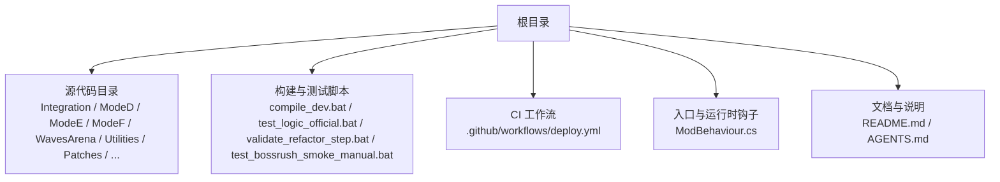
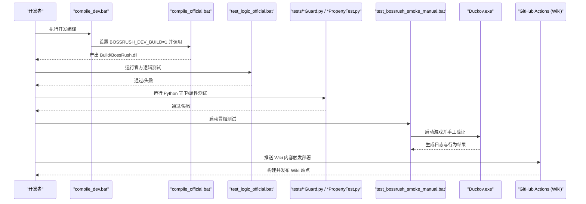
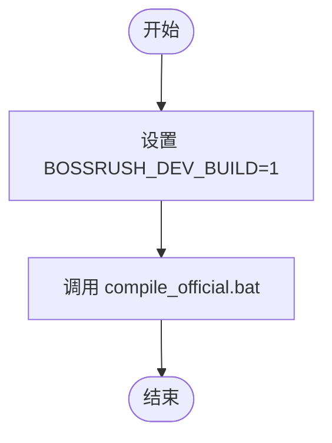
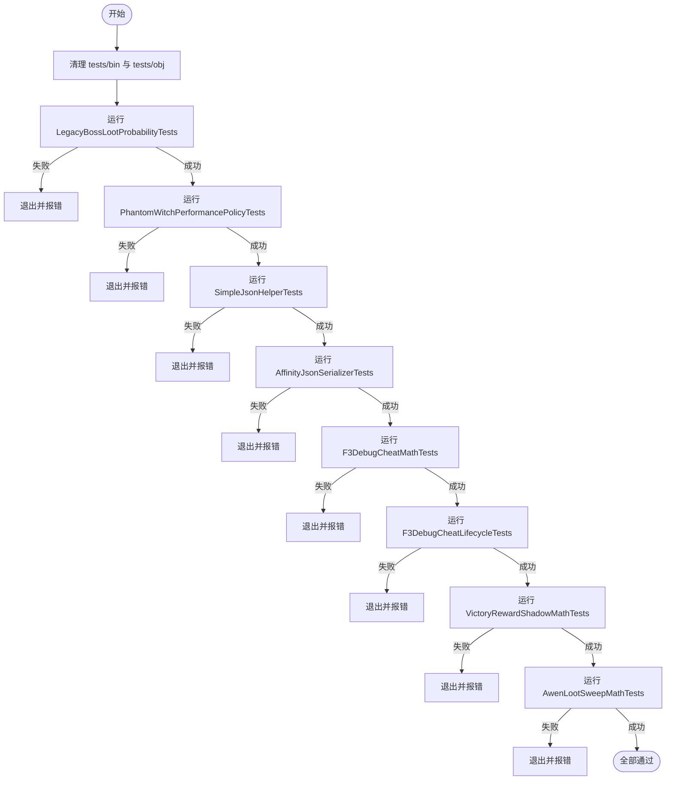
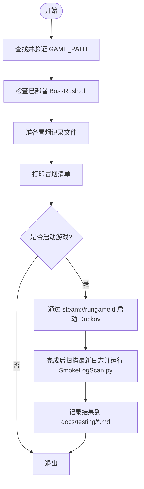
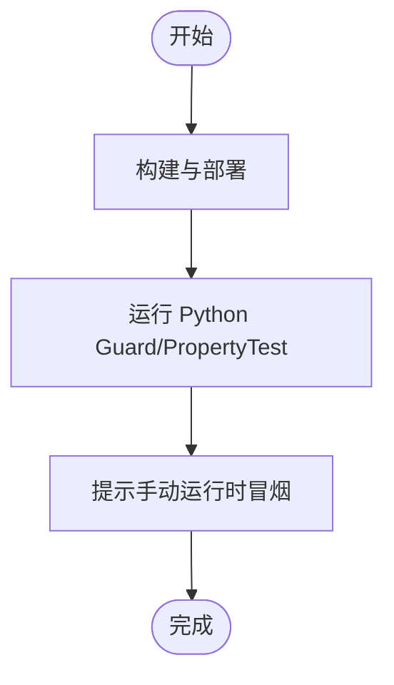
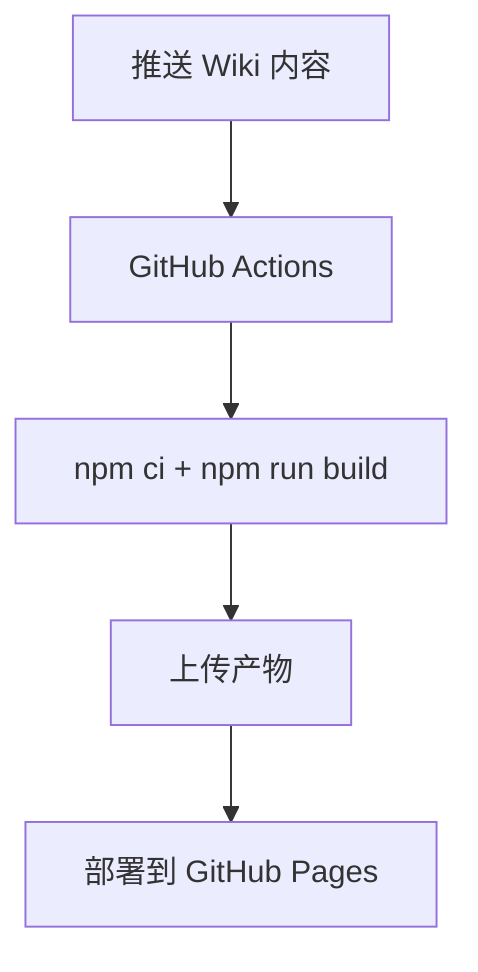
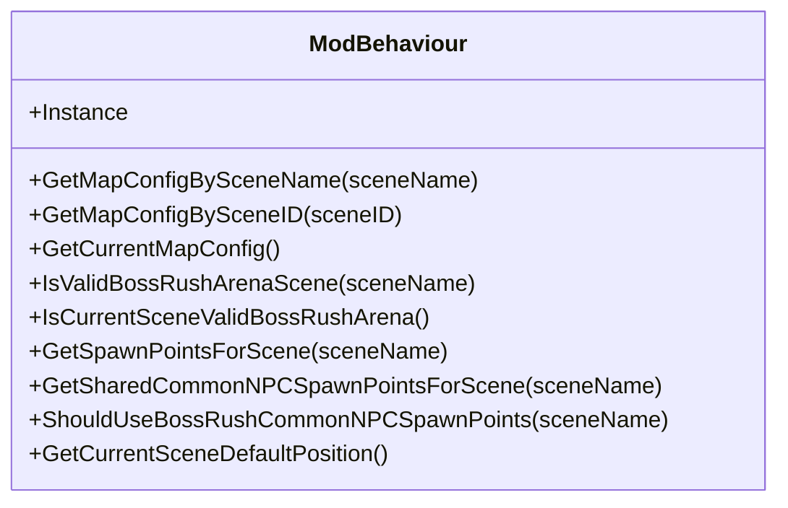
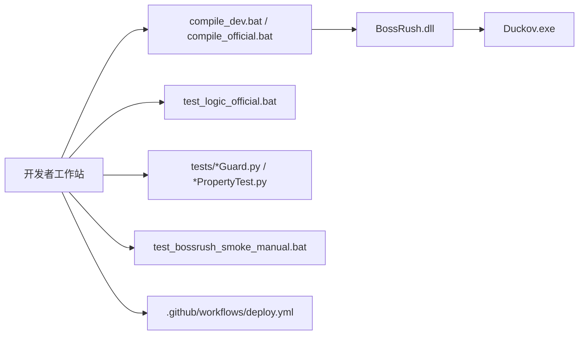

# 构建系统与编译流程

<cite>
**本文引用的文件**
- [compile_dev.bat](file://compile_dev.bat)
- [test_bossrush_smoke_manual.bat](file://test_bossrush_smoke_manual.bat)
- [test_logic_official.bat](file://test_logic_official.bat)
- [validate_refactor_step.bat](file://validate_refactor_step.bat)
- [README.md](file://README.md)
- [AGENTS.md](file://AGENTS.md)
- [deploy.yml](file://.github/workflows/deploy.yml)
- [ModBehaviour.cs](file://ModBehaviour.cs)
</cite>

## 目录
1. [简介](#简介)
2. [项目结构](#项目结构)
3. [核心组件](#核心组件)
4. [架构总览](#架构总览)
5. [详细组件分析](#详细组件分析)
6. [依赖关系分析](#依赖关系分析)
7. [性能与构建优化](#性能与构建优化)
8. [故障排除指南](#故障排除指南)
9. [结论](#结论)
10. [附录](#附录)

## 简介
本文件面向 BossRushMod 的构建系统与编译流程，聚焦脚本驱动的 C# 源码仓库组织方式、批处理脚本执行流程、依赖管理与代码生成/文件处理步骤、开发环境搭建、重构验证流程、构建优化技巧以及持续集成与自动化测试方案。目标是帮助开发者快速理解并稳定地构建、部署和验证该 Unity Mod。

## 项目结构
BossRushMod 不是标准 .csproj 工程，而是由批处理脚本显式列出源码并调用 Roslyn csc.dll 进行编译的脚本驱动仓库。根目录包含多个子系统目录（如 Integration、ModeD、ModeE、ModeF、WavesArena、Utilities、Patches 等），以及用于构建、测试与文档的脚本与配置。

图表来源
- [README.md:170-192](file://README.md#L170-L192)
- [AGENTS.md:11-13](file://AGENTS.md#L11-L13)
- [ModBehaviour.cs:22-28](file://ModBehaviour.cs#L22-L28)

章节来源
- [README.md:170-192](file://README.md#L170-L192)
- [AGENTS.md:11-13](file://AGENTS.md#L11-L13)

## 核心组件
- 编译入口：compile_dev.bat 设置开发标志并委托给 compile_official.bat（后者为实际编译与部署脚本）。
- 逻辑测试：test_logic_official.bat 清理测试输出并顺序运行多个 .NET 测试项目。
- 冒烟测试：test_bossrush_smoke_manual.bat 检查游戏路径、提示清单、启动游戏并引导记录结果。
- 重构验证：validate_refactor_step.bat 串联“构建/部署 → Python Guard/PropertyTest → 手动运行时冒烟提示”。
- 持续集成：.github/workflows/deploy.yml 仅负责 Wiki 站点构建与发布，不包含 C# 编译。
- 运行时入口：ModBehaviour.cs 作为主入口与全局状态中心，承载地图配置查询、场景门控等关键能力。

章节来源
- [compile_dev.bat:1-5](file://compile_dev.bat#L1-L5)
- [test_logic_official.bat:1-86](file://test_logic_official.bat#L1-L86)
- [test_bossrush_smoke_manual.bat:1-153](file://test_bossrush_smoke_manual.bat#L1-L153)
- [validate_refactor_step.bat:1-48](file://validate_refactor_step.bat#L1-L48)
- [deploy.yml:1-54](file://.github/workflows/deploy.yml#L1-L54)
- [ModBehaviour.cs:22-28](file://ModBehaviour.cs#L22-L28)

## 架构总览
下图展示了从开发到验证的整体流水线：开发编译、官方逻辑测试、Python 守卫/属性测试、手动运行时冒烟，以及 CI 对 Wiki 站点的构建与发布。

图表来源
- [compile_dev.bat:1-5](file://compile_dev.bat#L1-L5)
- [test_logic_official.bat:1-86](file://test_logic_official.bat#L1-L86)
- [test_bossrush_smoke_manual.bat:1-153](file://test_bossrush_smoke_manual.bat#L1-L153)
- [validate_refactor_step.bat:1-48](file://validate_refactor_step.bat#L1-L48)
- [deploy.yml:1-54](file://.github/workflows/deploy.yml#L1-L54)

## 详细组件分析

### 开发编译：compile_dev.bat
- 作用：设置开发构建标志 BOSSRUSH_DEV_BUILD=1，然后调用 compile_official.bat 完成编译与部署。
- 关键点：
  - 使用 chcp 65001 确保 UTF-8 输出。
  - 切换至脚本所在目录，避免相对路径问题。
  - 将开发模式标志传递给后续编译脚本，便于在运行时启用调试或额外行为。

图表来源
- [compile_dev.bat:1-5](file://compile_dev.bat#L1-L5)

章节来源
- [compile_dev.bat:1-5](file://compile_dev.bat#L1-L5)

### 官方逻辑测试：test_logic_official.bat
- 作用：清理测试输出目录，依次运行多个 .NET 测试项目（Release 模式，无日志头）。
- 测试套件：
  - LegacyBossLootProbabilityTests
  - PhantomWitchPerformancePolicyTests
  - SimpleJsonHelperTests
  - AffinityJsonSerializerTests
  - F3DebugCheatMathTests
  - F3DebugCheatLifecycleTests
  - VictoryRewardShadowMathTests
  - AwenLootSweepMathTests
- 错误处理：任一测试失败立即中止并返回非零退出码。

图表来源
- [test_logic_official.bat:1-86](file://test_logic_official.bat#L1-L86)

章节来源
- [test_logic_official.bat:1-86](file://test_logic_official.bat#L1-L86)

### 冒烟测试：test_bossrush_smoke_manual.bat
- 作用：不自动执行游戏内操作，打印冒烟清单，检测游戏安装路径与已部署 DLL，必要时启动 Steam 游戏，并引导记录测试结果。
- 关键流程：
  - 查找并校验 GAME_PATH（支持环境变量与常见默认路径）。
  - 准备 docs/testing 目录与记录文件。
  - 检查已部署的 BossRush.dll。
  - 打印完整清单（基础场景、商店、地图选择、标准 BossRush、死亡回城、Mode D/E/F、丧尸模式、交互 UI、近战特效等）。
  - 启动游戏后扫描最新日志并提示使用 SmokeLogScan.py 进行分析。

图表来源
- [test_bossrush_smoke_manual.bat:1-153](file://test_bossrush_smoke_manual.bat#L1-L153)

章节来源
- [test_bossrush_smoke_manual.bat:1-153](file://test_bossrush_smoke_manual.bat#L1-L153)

### 重构验证：validate_refactor_step.bat
- 作用：将“构建/部署 → Python 守卫/属性测试 → 手动运行时冒烟提示”串成一步流程，适合每次重构后快速回归。
- 流程：
  - 第一步：调用 test_bossrush_official.bat（构建并部署）。
  - 第二步：运行 tests 下所有 *Guard.py 与 *PropertyTest.py。
  - 第三步：提示开发者手动执行运行时冒烟，并在完成后扫描日志。

图表来源
- [validate_refactor_step.bat:1-48](file://validate_refactor_step.bat#L1-L48)

章节来源
- [validate_refactor_step.bat:1-48](file://validate_refactor_step.bat#L1-L48)

### 持续集成：.github/workflows/deploy.yml
- 作用：当 wiki-site 或 WikiContent 变更时，在 GitHub Actions 上构建 VitePress 站点并部署到 GitHub Pages。
- 注意：当前 CI 不包含 C# 编译与测试；C# 构建与测试需在本地 Windows 环境执行。

图表来源
- [deploy.yml:1-54](file://.github/workflows/deploy.yml#L1-L54)

章节来源
- [deploy.yml:1-54](file://.github/workflows/deploy.yml#L1-L54)

### 运行时入口与模块宿主：ModBehaviour.cs
- 作用：作为 Mod 的主入口与全局状态中心，提供地图配置查询、场景有效性判断、共享刷新点获取等能力，支撑多模式与竞技场逻辑。
- 相关能力：
  - 根据场景名/ID 获取地图配置。
  - 判断当前场景是否为有效 BossRush 竞技场。
  - 提供公共 NPC 共享刷新点池的选择策略。
  - 暴露当前场景默认传送位置等辅助方法。

图表来源
- [ModBehaviour.cs:22-28](file://ModBehaviour.cs#L22-L28)
- [ModBehaviour.cs:49-100](file://ModBehaviour.cs#L49-L100)
- [ModBehaviour.cs:110-184](file://ModBehaviour.cs#L110-L184)

章节来源
- [ModBehaviour.cs:22-28](file://ModBehaviour.cs#L22-L28)
- [ModBehaviour.cs:49-100](file://ModBehaviour.cs#L49-L100)
- [ModBehaviour.cs:110-184](file://ModBehaviour.cs#L110-L184)

## 依赖关系分析
- 构建依赖：
  - Windows 环境、已安装的 .NET SDK（用于调用 Roslyn csc.dll）。
  - 游戏程序集位于 Duckov_Data\Managed\（供编译引用）。
  - Workshop 目录与 HarmonyLoadMod（运行时注入所需）。
- 运行时依赖：
  - Harmony 补丁与反射绑定（约 31 个 Patch，注册于 AlwaysOnRuntimeHooks）。
  - JSON 数据源（Assets/Data/*.json）与地图刷新点 JSON（Assets/SpawnPoints/*.json）。
  - 本地化 key 与文本资源。
- 测试依赖：
  - dotnet CLI（逻辑测试）。
  - Python 3（Guard/PropertyTest 与 SmokeLogScan）。
- CI 依赖：
  - Node.js 20（VitePress 构建）。
  - GitHub Pages 权限与缓存。

图表来源
- [README.md:150-168](file://README.md#L150-L168)
- [AGENTS.md:59-67](file://AGENTS.md#L59-L67)
- [test_logic_official.bat:1-86](file://test_logic_official.bat#L1-L86)
- [test_bossrush_smoke_manual.bat:1-153](file://test_bossrush_smoke_manual.bat#L1-L153)
- [deploy.yml:1-54](file://.github/workflows/deploy.yml#L1-L54)

章节来源
- [README.md:150-168](file://README.md#L150-L168)
- [AGENTS.md:59-67](file://AGENTS.md#L59-L67)

## 性能与构建优化
- 增量编译：
  - 由于 compile_official.bat 显式列出源码，新增 .cs 必须同步登记，否则不会参与编译。建议仅在修改文件后重新构建，避免全量重建。
- 并行构建：
  - 当前脚本未实现并行编译；若需加速，可在后续版本中拆分编译任务或使用并行工具（需谨慎管理输出与锁）。
- 缓存策略：
  - 逻辑测试前会清理 tests/bin 与 tests/obj，可考虑保留 obj 以利用增量构建。
  - CI 使用 npm cache 缓存依赖，减少重复安装时间。
- 构建优化建议：
  - 将常用构建命令封装为别名或函数，减少重复输入。
  - 在大型改动前，先运行 test_logic_official.bat 与 Python Guard，再进入耗时的人工冒烟。
  - 使用独立工作区隔离不同分支的构建产物，避免交叉污染。

[本节为通用指导，无需特定文件来源]

## 故障排除指南
- 找不到 dotnet：
  - 现象：test_logic_official.bat 报告未找到 dotnet。
  - 解决：安装 .NET SDK 并确保 PATH 中包含 dotnet。
- 未找到游戏路径：
  - 现象：test_bossrush_smoke_manual.bat 无法定位 Duckov.exe。
  - 解决：设置环境变量 GAME_PATH 指向游戏根目录，或调整脚本中的默认路径。
- 未部署 DLL：
  - 现象：冒烟测试提示未找到 BossRush.dll。
  - 解决：先执行 test_bossrush_official.bat 或 compile_dev.bat 完成构建与部署。
- Python 未安装或未加入 PATH：
  - 现象：validate_refactor_step.bat 报 py -3 不可用。
  - 解决：安装 Python 3 并将 py 加入 PATH。
- CI 构建失败：
  - 现象：wiki-site 构建失败。
  - 解决：检查 Node.js 版本与依赖安装日志，确认 package-lock.json 与缓存一致。

章节来源
- [test_logic_official.bat:9-13](file://test_logic_official.bat#L9-L13)
- [test_bossrush_smoke_manual.bat:5-11](file://test_bossrush_smoke_manual.bat#L5-L11)
- [test_bossrush_smoke_manual.bat:62-71](file://test_bossrush_smoke_manual.bat#L62-L71)
- [validate_refactor_step.bat:17-21](file://validate_refactor_step.bat#L17-L21)
- [deploy.yml:20-38](file://.github/workflows/deploy.yml#L20-L38)

## 结论
BossRushMod 采用脚本驱动的 C# 源码组织方式，通过显式源码列表与 Roslyn 编译器实现灵活可控的构建流程。配合多层验证（逻辑测试、Python 守卫/属性测试、运行时冒烟）与 CI（Wiki 站点构建与发布），能够在保证质量的同时提升团队协作效率。建议在每次重构后遵循 validate_refactor_step.bat 的流程，并结合冒烟测试与日志扫描，确保变更的安全性与稳定性。

[本节为总结性内容，无需特定文件来源]

## 附录
- 开发环境搭建要点：
  - 操作系统：Windows。
  - 工具链：.NET SDK、Python 3、Node.js 20（仅 Wiki 构建需要）。
  - 游戏依赖：Duckov_Data\Managed 下的程序集、Workshop 目录与 HarmonyLoadMod。
  - 环境变量：GAME_PATH（可选，用于冒烟测试）。
- 推荐工作流：
  - 修改代码 → compile_dev.bat → test_logic_official.bat → Python Guard/PropertyTest → test_bossrush_smoke_manual.bat → 记录结果并扫描日志。
  - 提交前确认新增 .cs 已登记到 compile_official.bat，TypeID 与本地化键符合规范。

[本节为补充信息，无需特定文件来源]