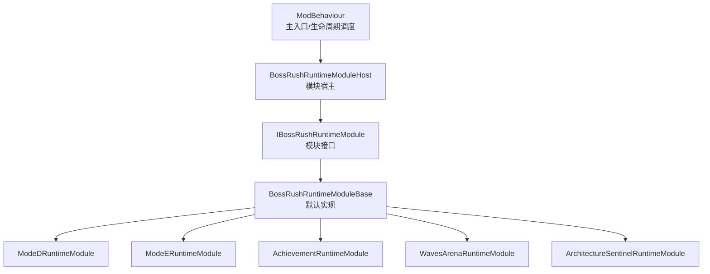
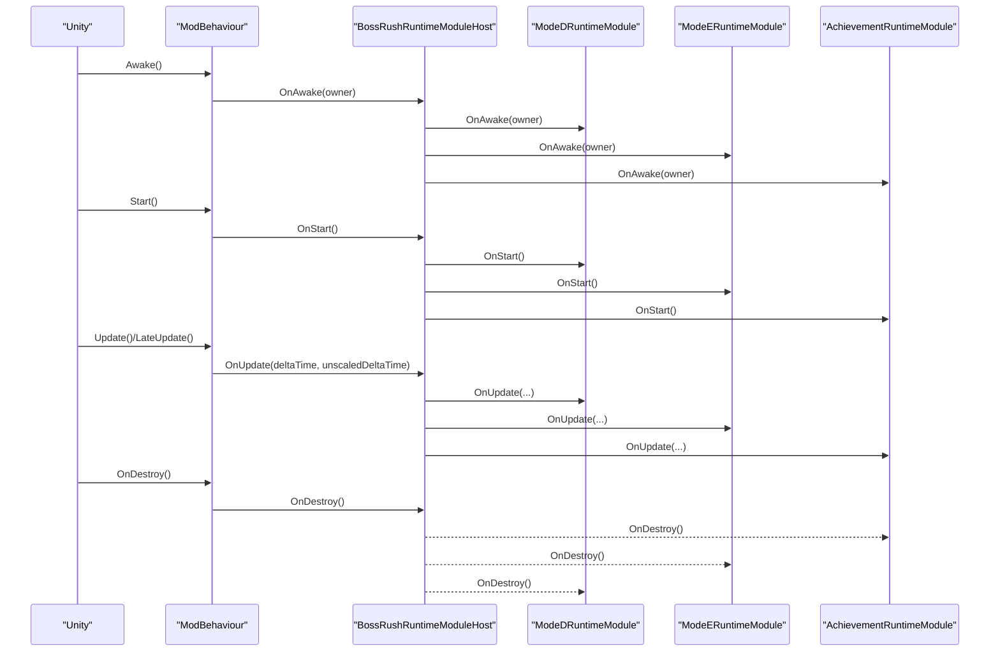
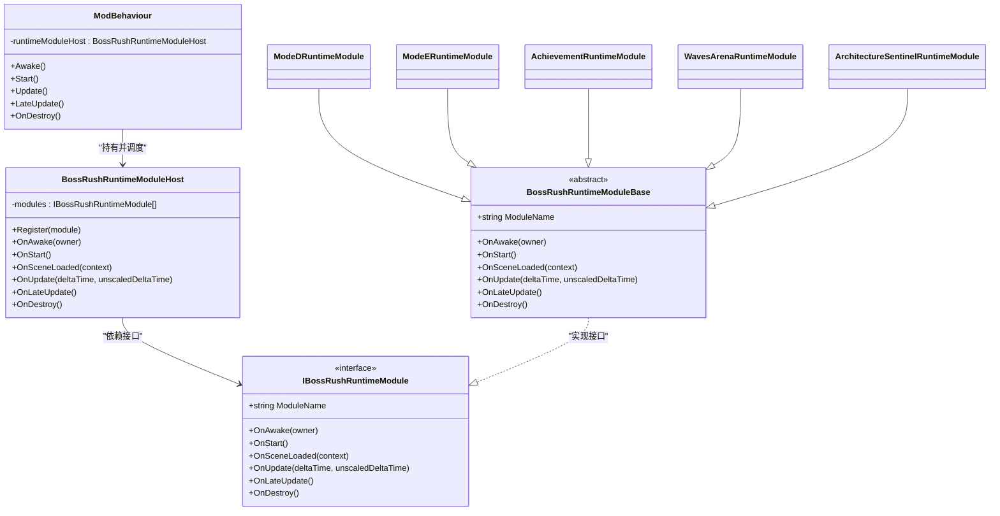
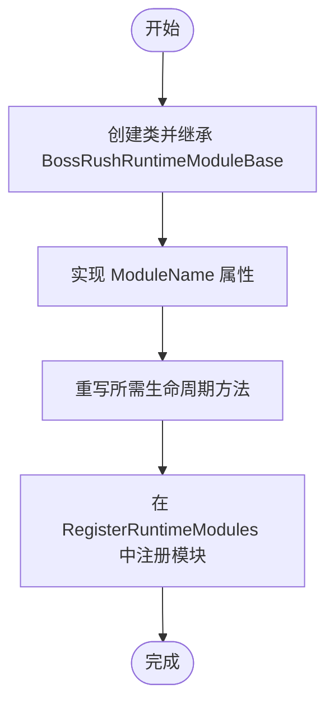

# 模块化架构设计

<cite>
**本文引用的文件**
- [ModBehaviour.cs](file://ModBehaviour.cs)
- [BossRushRuntimeModuleBase.cs](file://Common/Lifecycle/BossRushRuntimeModuleBase.cs)
- [IBossRushRuntimeModule.cs](file://Common/Lifecycle/IBossRushRuntimeModule.cs)
- [BossRushRuntimeModuleHost.cs](file://Common/Lifecycle/BossRushRuntimeModuleHost.cs)
- [SceneRuntimeContext.cs](file://Common/Lifecycle/SceneRuntimeContext.cs)
- [ArchitectureSentinelRuntimeModule.cs](file://Common/Lifecycle/ArchitectureSentinelRuntimeModule.cs)
- [BossRushRuntimeModuleRegistration.cs](file://Common/Lifecycle/BossRushRuntimeModuleRegistration.cs)
- [ModeDRuntimeModule.cs](file://ModeD/ModeDRuntimeModule.cs)
- [ModeERuntimeModule.cs](file://ModeE/ModeERuntimeModule.cs)
- [AchievementRuntimeModule.cs](file://Achievement/AchievementRuntimeModule.cs)
- [WavesArenaRuntimeModule.cs](file://WavesArena/WavesArenaRuntimeModule.cs)
</cite>

## 目录
1. [简介](#简介)
2. [项目结构](#项目结构)
3. [核心组件](#核心组件)
4. [架构总览](#架构总览)
5. [详细组件分析](#详细组件分析)
6. [依赖关系分析](#依赖关系分析)
7. [性能考虑](#性能考虑)
8. [故障排查指南](#故障排查指南)
9. [结论](#结论)
10. [附录：自定义运行时模块创建示例](#附录自定义运行时模块创建示例)

## 简介
本技术文档围绕 BossRushMod 的模块化架构展开，重点解释基于 Unity 模组的模块化设计理念与实现。文档聚焦以下目标：
- 以 ModBehaviour 作为主入口点的设计模式与生命周期管理
- BossRushRuntimeModuleBase 抽象基类与 IBossRushRuntimeModule 接口定义
- BossRushRuntimeModuleHost 模块宿主的管理机制（注册、初始化顺序、生命周期协调）
- 运行时模块的统一生命周期处理（Awake、Start、Update、LateUpdate、场景切换）
- 场景切换时的状态管理与资源清理
- 如何创建自定义运行时模块（继承基类、实现接口方法、注册到宿主）
- 性能优化建议（模块间依赖管理、内存使用优化）

## 项目结构
BossRushMod 将“运行时模块”从主逻辑中解耦，通过统一的宿主进行集中调度。关键目录与职责如下：
- Common/Lifecycle：定义模块接口、基类、宿主以及场景上下文
- 各 Mode 与子系统：各自提供独立的运行时模块，封装自身生命周期与更新逻辑
- ModBehaviour：作为 Unity 单例入口，负责统一调度宿主与各子系统的生命周期

图表来源
- [ModBehaviour.cs:598-756](file://ModBehaviour.cs#L598-L756)
- [BossRushRuntimeModuleHost.cs:1-130](file://Common/Lifecycle/BossRushRuntimeModuleHost.cs#L1-L130)
- [IBossRushRuntimeModule.cs:1-17](file://Common/Lifecycle/IBossRushRuntimeModule.cs#L1-L17)
- [BossRushRuntimeModuleBase.cs:1-15](file://Common/Lifecycle/BossRushRuntimeModuleBase.cs#L1-L15)
- [ModeDRuntimeModule.cs:1-33](file://ModeD/ModeDRuntimeModule.cs#L1-L33)
- [ModeERuntimeModule.cs:1-29](file://ModeE/ModeERuntimeModule.cs#L1-L29)
- [AchievementRuntimeModule.cs:1-33](file://Achievement/AchievementRuntimeModule.cs#L1-L33)
- [WavesArenaRuntimeModule.cs:1-23](file://WavesArena/WavesArenaRuntimeModule.cs#L1-L23)
- [ArchitectureSentinelRuntimeModule.cs:1-11](file://Common/Lifecycle/ArchitectureSentinelRuntimeModule.cs#L1-L11)

章节来源
- [ModBehaviour.cs:598-756](file://ModBehaviour.cs#L598-L756)
- [BossRushRuntimeModuleRegistration.cs:1-19](file://Common/Lifecycle/BossRushRuntimeModuleRegistration.cs#L1-L19)

## 核心组件
- ModBehaviour：Unity 主入口，持有并驱动模块宿主；在 Awake/Start/Update/LateUpdate/OnDestroy 等生命周期中调用宿主对应方法；同时负责场景加载回调中的模块通知。
- IBossRushRuntimeModule：定义模块必须实现的统一生命周期钩子（ModuleName、OnAwake、OnStart、OnSceneLoaded、OnUpdate、OnLateUpdate、OnDestroy）。
- BossRushRuntimeModuleBase：为模块提供默认空实现，简化自定义模块开发。
- BossRushRuntimeModuleHost：维护模块列表，按注册顺序分发生命周期事件，并对异常进行隔离与日志记录。
- SceneRuntimeContext：封装场景切换信息（Scene、LoadSceneMode、SceneName、BuildIndex），供模块在场景切换时读取。

章节来源
- [IBossRushRuntimeModule.cs:1-17](file://Common/Lifecycle/IBossRushRuntimeModule.cs#L1-L17)
- [BossRushRuntimeModuleBase.cs:1-15](file://Common/Lifecycle/BossRushRuntimeModuleBase.cs#L1-L15)
- [BossRushRuntimeModuleHost.cs:1-130](file://Common/Lifecycle/BossRushRuntimeModuleHost.cs#L1-L130)
- [SceneRuntimeContext.cs:1-21](file://Common/Lifecycle/SceneRuntimeContext.cs#L1-L21)
- [ModBehaviour.cs:598-756](file://ModBehaviour.cs#L598-L756)

## 架构总览
下图展示了主入口与模块宿主的协作关系，以及各运行时模块如何通过统一接口接入系统。

图表来源
- [ModBehaviour.cs:598-756](file://ModBehaviour.cs#L598-L756)
- [BossRushRuntimeModuleHost.cs:21-118](file://Common/Lifecycle/BossRushRuntimeModuleHost.cs#L21-L118)
- [ModeDRuntimeModule.cs:1-33](file://ModeD/ModeDRuntimeModule.cs#L1-L33)
- [ModeERuntimeModule.cs:1-29](file://ModeE/ModeERuntimeModule.cs#L1-L29)
- [AchievementRuntimeModule.cs:1-33](file://Achievement/AchievementRuntimeModule.cs#L1-L33)

## 详细组件分析

### ModBehaviour 主入口与生命周期调度
- 单例与不销毁：在 Awake 中设置 Instance 并 DontDestroyOnLoad，保证全局可访问性与跨场景持久化。
- 模块注册：在 Awake 中调用 RegisterRuntimeModules，集中注册所有运行时模块。
- 生命周期桥接：
  - Awake：初始化 Bootstrap/AlwaysOn/成就系统等，然后调用宿主 OnAwake。
  - Start：启动集成运行时后，调用宿主 OnStart。
  - Update/LateUpdate：在满足运行条件时，调用宿主 OnUpdate/OnLateUpdate，并执行模式相关 Tick。
  - OnDestroy：清理调试工具、玩家生命周期事件、成就追踪、集成与模式运行时，最后调用宿主 OnDestroy。
- 场景切换：监听场景加载事件，在 OnSceneLoaded 中调用宿主 OnSceneLoaded，并传递 SceneRuntimeContext。

章节来源
- [ModBehaviour.cs:598-756](file://ModBehaviour.cs#L598-L756)
- [BossRushRuntimeModuleRegistration.cs:1-19](file://Common/Lifecycle/BossRushRuntimeModuleRegistration.cs#L1-L19)

### IBossRushRuntimeModule 接口与 BossRushRuntimeModuleBase 基类
- 接口契约：
  - ModuleName：用于错误日志定位模块名
  - OnAwake/OnStart/OnSceneLoaded/OnUpdate/OnLateUpdate/OnDestroy：覆盖完整生命周期
- 基类默认实现：
  - 提供空实现，便于仅重写需要的生命周期方法
  - 降低样板代码，提升扩展性

章节来源
- [IBossRushRuntimeModule.cs:1-17](file://Common/Lifecycle/IBossRushRuntimeModule.cs#L1-L17)
- [BossRushRuntimeModuleBase.cs:1-15](file://Common/Lifecycle/BossRushRuntimeModuleBase.cs#L1-L15)

### BossRushRuntimeModuleHost 模块宿主
- 模块注册：Register 方法确保模块唯一且非空，内部以 List 维护顺序。
- 生命周期分发：
  - OnAwake/OnStart/OnSceneLoaded/OnUpdate/OnLateUpdate：按注册顺序逐个调用模块对应方法
  - OnDestroy：逆序调用，确保先创建的模块后销毁
- 异常隔离：每个生命周期调用包裹 try/catch，并通过 LogModuleError 输出警告日志，避免单个模块失败影响整体。

章节来源
- [BossRushRuntimeModuleHost.cs:1-130](file://Common/Lifecycle/BossRushRuntimeModuleHost.cs#L1-L130)

### 场景切换与上下文
- SceneRuntimeContext：封装场景对象、加载模式、名称与构建索引，供模块在场景切换时读取上下文。
- 场景回调：ModBehaviour 在场景加载完成后调用宿主 OnSceneLoaded，模块据此进行场景相关的初始化或清理。

章节来源
- [SceneRuntimeContext.cs:1-21](file://Common/Lifecycle/SceneRuntimeContext.cs#L1-L21)
- [ModBehaviour.cs:782-797](file://ModBehaviour.cs#L782-L797)

### 具体模块示例
- ModeDRuntimeModule：在 OnAwake 保存 owner 引用，在 OnUpdate 委托给宿主进行完整性检查。
- ModeERuntimeModule：在 OnDestroy 中清理 Mode E 运行时状态与静态缓存，避免残留引用导致内存泄漏。
- AchievementRuntimeModule：在 OnUpdate 中委托给宿主进行成就系统 Tick。
- WavesArenaRuntimeModule：在 OnAwake 保存 owner 引用，在 OnDestroy 释放引用。
- ArchitectureSentinelRuntimeModule：最小实现，仅声明模块名，用于占位或架构哨兵。

章节来源
- [ModeDRuntimeModule.cs:1-33](file://ModeD/ModeDRuntimeModule.cs#L1-L33)
- [ModeERuntimeModule.cs:1-29](file://ModeE/ModeERuntimeModule.cs#L1-L29)
- [AchievementRuntimeModule.cs:1-33](file://Achievement/AchievementRuntimeModule.cs#L1-L33)
- [WavesArenaRuntimeModule.cs:1-23](file://WavesArena/WavesArenaRuntimeModule.cs#L1-L23)
- [ArchitectureSentinelRuntimeModule.cs:1-11](file://Common/Lifecycle/ArchitectureSentinelRuntimeModule.cs#L1-L11)

## 依赖关系分析
- 耦合度：
  - ModBehaviour 与宿主强耦合，负责生命周期调度
  - 宿主与模块通过接口松耦合，模块之间无直接依赖
- 内聚性：
  - 每个模块只关注自身业务逻辑，生命周期由宿主统一编排
- 外部依赖：
  - Unity 场景系统与时间系统（deltaTime、unscaledDeltaTime）
  - Harmony 补丁组与游戏内系统（如成就、NPC、模式逻辑）

图表来源
- [ModBehaviour.cs:598-756](file://ModBehaviour.cs#L598-L756)
- [BossRushRuntimeModuleHost.cs:1-130](file://Common/Lifecycle/BossRushRuntimeModuleHost.cs#L1-L130)
- [IBossRushRuntimeModule.cs:1-17](file://Common/Lifecycle/IBossRushRuntimeModule.cs#L1-L17)
- [BossRushRuntimeModuleBase.cs:1-15](file://Common/Lifecycle/BossRushRuntimeModuleBase.cs#L1-L15)
- [ModeDRuntimeModule.cs:1-33](file://ModeD/ModeDRuntimeModule.cs#L1-L33)
- [ModeERuntimeModule.cs:1-29](file://ModeE/ModeERuntimeModule.cs#L1-L29)
- [AchievementRuntimeModule.cs:1-33](file://Achievement/AchievementRuntimeModule.cs#L1-L33)
- [WavesArenaRuntimeModule.cs:1-23](file://WavesArena/WavesArenaRuntimeModule.cs#L1-L23)
- [ArchitectureSentinelRuntimeModule.cs:1-11](file://Common/Lifecycle/ArchitectureSentinelRuntimeModule.cs#L1-L11)

章节来源
- [BossRushRuntimeModuleHost.cs:1-130](file://Common/Lifecycle/BossRushRuntimeModuleHost.cs#L1-L130)
- [ModBehaviour.cs:598-756](file://ModBehaviour.cs#L598-L756)

## 性能考虑
- 模块间依赖管理：
  - 当前宿主按注册顺序分发生命周期，未显式支持依赖图。若需引入依赖，可在宿主中增加依赖解析与排序，或在模块内部通过弱引用避免循环依赖。
- 内存使用优化：
  - 模块在 OnDestroy 中释放对 owner 的引用（如 ModeERuntimeModule），防止持有长生命周期对象导致内存泄漏
  - 避免在 Update 中频繁分配临时对象，复用缓存列表（参考 ModBehaviour 中对角色缓存与销毁列表的复用）
- 异常隔离：
  - 宿主在每个生命周期调用中捕获异常并记录警告，避免单个模块崩溃影响整体稳定性
- 场景切换开销：
  - 通过 SceneRuntimeContext 传递必要信息，减少模块内部重复查询场景信息的成本

[本节提供通用指导，无需特定文件分析]

## 故障排查指南
- 模块生命周期异常：
  - 宿主会在 OnAwake/OnStart/OnSceneLoaded/OnUpdate/OnLateUpdate/OnDestroy 中捕获异常并输出警告日志，包含模块名与方法名，便于快速定位问题
- 模块未生效：
  - 确认已在 RegisterRuntimeModules 中正确注册模块
  - 检查模块是否实现了必要的生命周期方法（如 OnUpdate）
- 场景切换后状态异常：
  - 在 OnSceneLoaded 中进行场景相关初始化，并在 OnDestroy 中清理资源
  - 使用 SceneRuntimeContext 获取场景信息，避免硬编码场景名

章节来源
- [BossRushRuntimeModuleHost.cs:21-118](file://Common/Lifecycle/BossRushRuntimeModuleHost.cs#L21-L118)
- [BossRushRuntimeModuleRegistration.cs:1-19](file://Common/Lifecycle/BossRushRuntimeModuleRegistration.cs#L1-L19)
- [SceneRuntimeContext.cs:1-21](file://Common/Lifecycle/SceneRuntimeContext.cs#L1-L21)

## 结论
BossRushMod 通过 ModBehaviour 作为主入口，结合 IBossRushRuntimeModule 接口与 BossRushRuntimeModuleBase 基类，构建了清晰、可扩展的模块化架构。BossRushRuntimeModuleHost 统一管理模块注册与生命周期，确保各模块独立、稳定地运行。该设计降低了模块间的耦合度，提升了可维护性与可测试性。通过合理的性能优化与异常隔离策略，系统在复杂场景中仍能保持良好表现。

[本节总结性内容，无需特定文件分析]

## 附录：自定义运行时模块创建示例
以下步骤展示如何创建一个自定义运行时模块：
1. 新建类并继承 BossRushRuntimeModuleBase
2. 实现 ModuleName 属性，用于日志标识
3. 根据需要重写生命周期方法（如 OnAwake、OnUpdate、OnDestroy）
4. 在 ModBehaviour.RegisterRuntimeModules 中注册新模块

[此图为概念流程图，不映射具体源码，故无图表来源]

章节来源
- [BossRushRuntimeModuleBase.cs:1-15](file://Common/Lifecycle/BossRushRuntimeModuleBase.cs#L1-L15)
- [BossRushRuntimeModuleRegistration.cs:1-19](file://Common/Lifecycle/BossRushRuntimeModuleRegistration.cs#L1-L19)