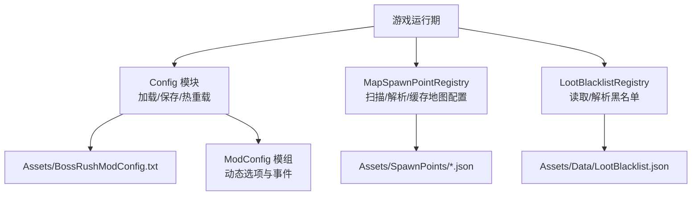
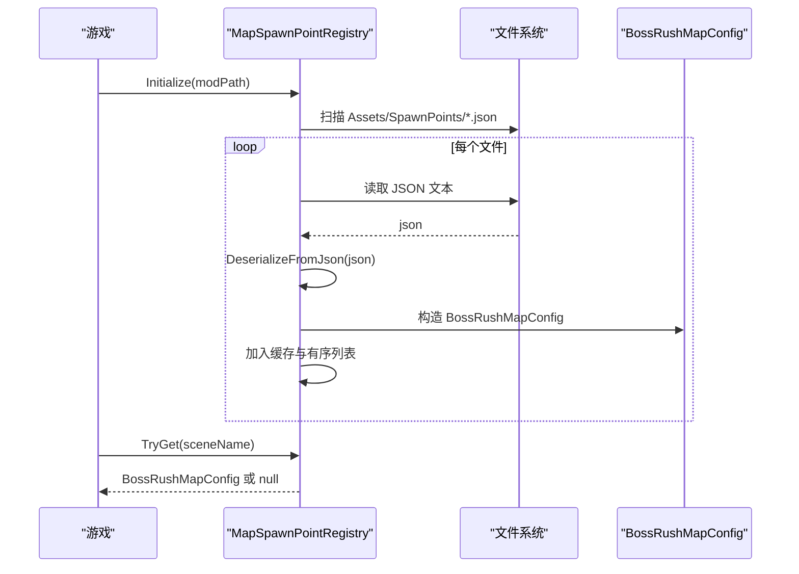
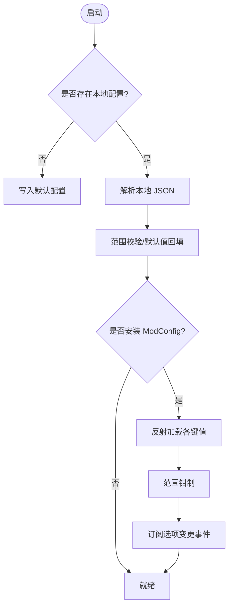
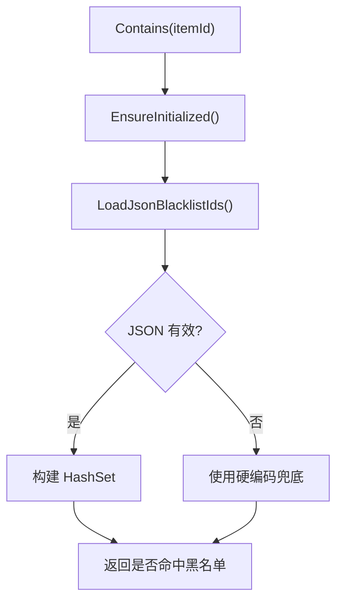
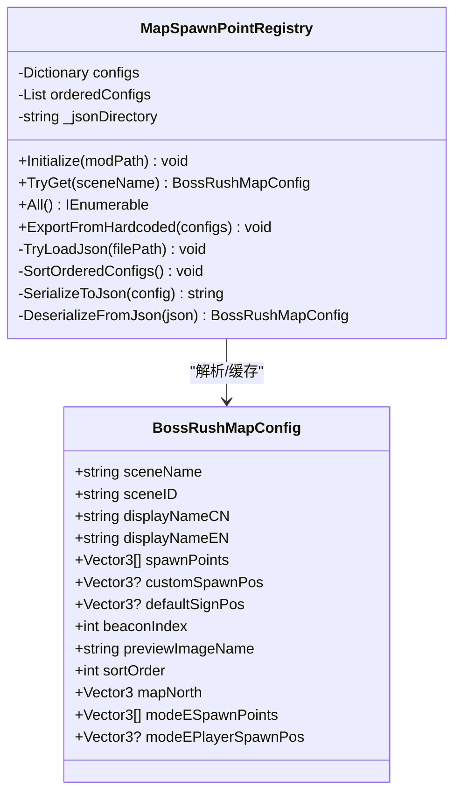
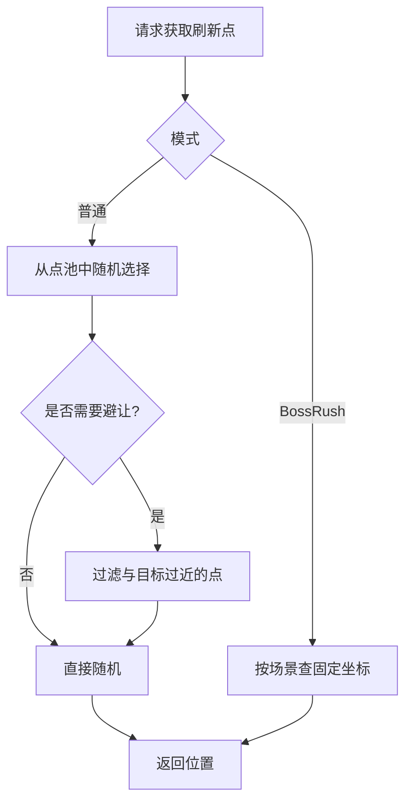
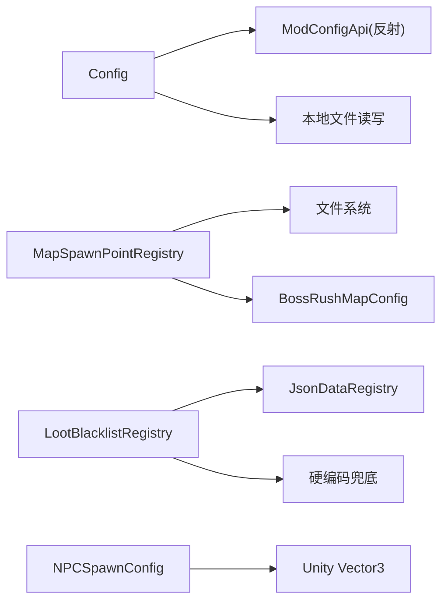

# 配置管理系统

<cite>
**本文引用的文件**
- [Config.cs](file://Config/Config.cs)
- [JsonDataRegistry.cs](file://Common/Data/JsonDataRegistry.cs)
- [LootBlacklistRegistry.cs](file://Config/LootBlacklistRegistry.cs)
- [NPCSpawnConfig.cs](file://Config/NPCSpawnConfig.cs)
- [BossRushMapConfig.cs](file://Common/MapConfig/BossRushMapConfig.cs)
- [MapSpawnPointRegistry.cs](file://Common/MapConfig/MapSpawnPointRegistry.cs)
- [LootBlacklist.json](file://Assets/Data/LootBlacklist.json)
- [Level_DemoChallenge_1.json](file://Assets/SpawnPoints/Level_DemoChallenge_1.json)
- [ModConfigApi.cs](file://ModConfigApi.cs)
</cite>

## 目录
1. [简介](#简介)
2. [项目结构](#项目结构)
3. [核心组件](#核心组件)
4. [架构总览](#架构总览)
5. [详细组件分析](#详细组件分析)
6. [依赖关系分析](#依赖关系分析)
7. [性能考量](#性能考量)
8. [故障排查指南](#故障排查指南)
9. [结论](#结论)
10. [附录：配置文件规范与最佳实践](#附录：配置文件规范与最佳实践)

## 简介
本技术文档围绕 BossRushMod 的配置管理系统，系统性阐述运行时配置加载、验证、热重载机制；JSON 数据文件（地图配置、掉落黑名单、NPC 生成配置等）的数据结构与解析流程；以及 JsonDataRegistry 数据注册表的实现原理（缓存、版本兼容、默认值处理）。同时提供配置项分类组织方式、编辑指南与调试技巧，并说明配置的校验策略与错误报告。最后介绍热更新能力与迁移兼容性，确保旧配置平滑升级。

## 项目结构
BossRushMod 将“运行时配置”和“数据配置”解耦：
- 运行时配置：通过本地 JSON 文件与 ModConfig 模组集成，支持运行时热更新。
- 数据配置：以 JSON 文件形式存放于 Assets/Data 与 Assets/SpawnPoints，由专用注册表在启动时扫描、解析并缓存。

图表来源
- [Config.cs:158-232](file://Config/Config.cs#L158-L232)
- [MapSpawnPointRegistry.cs:44-65](file://Common/MapConfig/MapSpawnPointRegistry.cs#L44-L65)
- [LootBlacklistRegistry.cs:21-63](file://Config/LootBlacklistRegistry.cs#L21-L63)
- [JsonDataRegistry.cs:13-46](file://Common/Data/JsonDataRegistry.cs#L13-L46)

章节来源
- [Config.cs:158-232](file://Config/Config.cs#L158-L232)
- [MapSpawnPointRegistry.cs:44-65](file://Common/MapConfig/MapSpawnPointRegistry.cs#L44-L65)
- [LootBlacklistRegistry.cs:21-63](file://Config/LootBlacklistRegistry.cs#L21-L63)
- [JsonDataRegistry.cs:13-46](file://Common/Data/JsonDataRegistry.cs#L13-L46)

## 核心组件
- Config（运行时配置）：负责从本地文件与 ModConfig 模组加载配置，执行范围校验与默认值回填，并提供热重载事件处理。
- MapSpawnPointRegistry（地图配置注册表）：启动时扫描 Assets/SpawnPoints/*.json，解析为 BossRushMapConfig 对象并缓存，提供按场景名查询与排序输出。
- LootBlacklistRegistry（掉落黑名单注册表）：读取 Assets/Data/LootBlacklist.json，解析 itemIds 列表，失败时回退到硬编码兜底集合。
- JsonDataRegistry（通用 JSON 数据读取器）：统一从 Assets/Data 下读取 JSON 文本，封装路径拼接、异常日志与空值处理。
- NPCSpawnConfig（NPC 刷新点配置）：集中管理多场景下的 NPC 刷新点数组与选择逻辑，支持避开已有 NPC 位置。
- BossRushMapConfig（地图配置模型）：承载单张地图的元信息与刷怪点、北方向、预览图等字段。

章节来源
- [Config.cs:31-95](file://Config/Config.cs#L31-L95)
- [MapSpawnPointRegistry.cs:30-88](file://Common/MapConfig/MapSpawnPointRegistry.cs#L30-L88)
- [LootBlacklistRegistry.cs:9-63](file://Config/LootBlacklistRegistry.cs#L9-L63)
- [JsonDataRegistry.cs:11-46](file://Common/Data/JsonDataRegistry.cs#L11-L46)
- [NPCSpawnConfig.cs:24-51](file://Config/NPCSpawnConfig.cs#L24-L51)
- [BossRushMapConfig.cs:9-46](file://Common/MapConfig/BossRushMapConfig.cs#L9-L46)

## 架构总览
系统采用“配置模型 + 注册表 + 数据文件”的分层设计：
- 配置模型：定义数据结构（如 BossRushMapConfig、BossRushConfig）。
- 注册表：负责加载、解析、缓存与查询（如 MapSpawnPointRegistry、LootBlacklistRegistry）。
- 数据文件：以 JSON 形式维护可编辑内容（地图刷怪点、黑名单等）。
- 运行时配置：通过本地文件与 ModConfig 双通道加载，支持热重载。

图表来源
- [MapSpawnPointRegistry.cs:44-65](file://Common/MapConfig/MapSpawnPointRegistry.cs#L44-L65)
- [MapSpawnPointRegistry.cs:136-164](file://Common/MapConfig/MapSpawnPointRegistry.cs#L136-L164)
- [MapSpawnPointRegistry.cs:270-331](file://Common/MapConfig/MapSpawnPointRegistry.cs#L270-L331)
- [BossRushMapConfig.cs:9-46](file://Common/MapConfig/BossRushMapConfig.cs#L9-L46)

## 详细组件分析

### 运行时配置系统（Config）
- 配置来源
  - 本地文件：StreamingAssets/BossRushModConfig.txt，使用 Unity JsonUtility 序列化/反序列化。
  - ModConfig 模组：通过反射调用 OptionsManager_Mod.Load<T>(key, default)，支持运行时变更事件。
- 加载流程
  - 首次启动优先尝试本地文件；若不存在则创建默认文件。
  - 若检测到 ModConfig 存在，则覆盖式加载各键值并进行范围校验（例如波次间隔 2-60 秒、每波 Boss 数 1-10、数值倍率 0.1-10 等）。
- 热重载
  - 订阅 ModConfig 的选项变更事件，仅对受影响的键进行增量更新，并持久化到本地文件。
  - 部分配置即时生效（如波次间隔影响当前倒计时），其他配置在下一次合适时机应用（如禁用变异词条时清理已生效词条）。
- 验证与默认值
  - 数值范围钳制（Mathf.Clamp）、缺失字段默认值填充（如 legacy loot 概率开关）。
  - 异常捕获与日志记录，避免崩溃。

图表来源
- [Config.cs:158-232](file://Config/Config.cs#L158-L232)
- [Config.cs:237-407](file://Config/Config.cs#L237-L407)
- [Config.cs:592-704](file://Config/Config.cs#L592-L704)

章节来源
- [Config.cs:158-232](file://Config/Config.cs#L158-L232)
- [Config.cs:237-407](file://Config/Config.cs#L237-L407)
- [Config.cs:592-704](file://Config/Config.cs#L592-L704)

### 掉落黑名单注册表（LootBlacklistRegistry）
- 数据来源：Assets/Data/LootBlacklist.json，包含 version 与 itemIds 数组。
- 解析策略：轻量级字符串解析，定位 key 与数组边界，逐项解析整数 ID；非法值直接返回空并触发回退。
- 回退机制：当 JSON 无效或缺失时，使用硬编码兜底集合，保证功能可用。
- 初始化：延迟至首次查询时 EnsureInitialized，避免启动开销。

图表来源
- [LootBlacklistRegistry.cs:21-63](file://Config/LootBlacklistRegistry.cs#L21-L63)
- [LootBlacklistRegistry.cs:65-112](file://Config/LootBlacklistRegistry.cs#L65-L112)
- [LootBlacklistRegistry.cs:114-171](file://Config/LootBlacklistRegistry.cs#L114-L171)

章节来源
- [LootBlacklistRegistry.cs:21-63](file://Config/LootBlacklistRegistry.cs#L21-L63)
- [LootBlacklistRegistry.cs:65-112](file://Config/LootBlacklistRegistry.cs#L65-L112)
- [LootBlacklistRegistry.cs:114-171](file://Config/LootBlacklistRegistry.cs#L114-L171)

### 地图配置注册表（MapSpawnPointRegistry）
- 启动扫描：OnAwake 阶段同步扫描 Assets/SpawnPoints/*.json，解析并缓存为字典（大小写不敏感）。
- 解析与校验：自定义轻量 JSON 解析器，提取 sceneName、sceneID、displayNameCN/EN、spawnPoints、mapNorth、modeESpawnPoints、modeEPlayerSpawnPos、sortOrder 等字段；必填字段缺失则跳过该地图。
- 排序与查询：按 sortOrder 升序、其次按 sceneName 排序；提供 TryGet 与 All 接口。
- 迁移导出：支持从硬编码表反向导出 JSON，便于初次迁移。

图表来源
- [MapSpawnPointRegistry.cs:30-88](file://Common/MapConfig/MapSpawnPointRegistry.cs#L30-L88)
- [MapSpawnPointRegistry.cs:136-164](file://Common/MapConfig/MapSpawnPointRegistry.cs#L136-L164)
- [MapSpawnPointRegistry.cs:186-331](file://Common/MapConfig/MapSpawnPointRegistry.cs#L186-L331)
- [BossRushMapConfig.cs:9-46](file://Common/MapConfig/BossRushMapConfig.cs#L9-L46)

章节来源
- [MapSpawnPointRegistry.cs:44-65](file://Common/MapConfig/MapSpawnPointRegistry.cs#L44-L65)
- [MapSpawnPointRegistry.cs:136-164](file://Common/MapConfig/MapSpawnPointRegistry.cs#L136-L164)
- [MapSpawnPointRegistry.cs:186-331](file://Common/MapConfig/MapSpawnPointRegistry.cs#L186-L331)
- [BossRushMapConfig.cs:9-46](file://Common/MapConfig/BossRushMapConfig.cs#L9-L46)

### NPC 刷新点配置（NPCSpawnConfig）
- 数据结构：以场景名为键，存储 Vector3[] 刷新点数组与随机选择标志。
- 复用与避让：快递员、哥布林、护士共享同一套点池；在选择时可按最小距离避开已有 NPC 位置。
- 查询接口：提供 BossRush 模式固定位置与普通模式随机位置的查询方法。

图表来源
- [NPCSpawnConfig.cs:24-51](file://Config/NPCSpawnConfig.cs#L24-L51)
- [NPCSpawnConfig.cs:267-300](file://Config/NPCSpawnConfig.cs#L267-L300)
- [NPCSpawnConfig.cs:385-445](file://Config/NPCSpawnConfig.cs#L385-L445)

章节来源
- [NPCSpawnConfig.cs:24-51](file://Config/NPCSpawnConfig.cs#L24-L51)
- [NPCSpawnConfig.cs:267-300](file://Config/NPCSpawnConfig.cs#L267-L300)
- [NPCSpawnConfig.cs:385-445](file://Config/NPCSpawnConfig.cs#L385-L445)

### 通用数据读取器（JsonDataRegistry）
- 职责：统一从 Assets/Data 目录下读取 JSON 文本，封装路径拼接、UTF-8 解码与异常日志。
- 使用场景：被 LootBlacklistRegistry 等模块复用，简化数据访问。

章节来源
- [JsonDataRegistry.cs:13-46](file://Common/Data/JsonDataRegistry.cs#L13-L46)

## 依赖关系分析
- Config 依赖 ModConfigApi（通过反射）与本地文件读写；热重载事件驱动运行时参数调整。
- MapSpawnPointRegistry 依赖文件系统与自定义 JSON 解析器；输出 BossRushMapConfig 供上层使用。
- LootBlacklistRegistry 依赖 JsonDataRegistry 与内置兜底集合；对外暴露 Contains 查询。
- NPCSpawnConfig 依赖 Unity Vector3 与随机选择逻辑；提供多 NPC 类型复用点池。

图表来源
- [Config.cs:127-153](file://Config/Config.cs#L127-L153)
- [Config.cs:237-407](file://Config/Config.cs#L237-L407)
- [MapSpawnPointRegistry.cs:44-65](file://Common/MapConfig/MapSpawnPointRegistry.cs#L44-L65)
- [LootBlacklistRegistry.cs:21-63](file://Config/LootBlacklistRegistry.cs#L21-L63)
- [JsonDataRegistry.cs:13-46](file://Common/Data/JsonDataRegistry.cs#L13-L46)

章节来源
- [Config.cs:127-153](file://Config/Config.cs#L127-L153)
- [Config.cs:237-407](file://Config/Config.cs#L237-L407)
- [MapSpawnPointRegistry.cs:44-65](file://Common/MapConfig/MapSpawnPointRegistry.cs#L44-L65)
- [LootBlacklistRegistry.cs:21-63](file://Config/LootBlacklistRegistry.cs#L21-L63)
- [JsonDataRegistry.cs:13-46](file://Common/Data/JsonDataRegistry.cs#L13-L46)

## 性能考量
- 启动阶段同步扫描 JSON 文件，避免异步带来的时序问题；解析失败仅记录警告，不影响其他地图加载。
- 黑名单使用 HashSet<int> 进行 O(1) 查找；仅在首次查询时初始化，减少启动开销。
- 地图配置按 sortOrder 排序后缓存，UI 展示无需重复排序。
- 运行时配置热重载仅对受影响键进行增量更新，避免全量重算。

[本节为通用性能建议，不直接分析具体文件]

## 故障排查指南
- 本地配置加载失败
  - 检查 StreamingAssets 路径与文件权限；查看日志中的 WARNING 信息。
  - 确认 JSON 格式正确，关键字段非空且类型匹配。
- ModConfig 集成失败
  - 确认 ModConfig 模组已安装且类型可反射找到；查看日志中关于 OptionsManager_Mod 的提示。
  - 关注 SafeAddOnOptionsChangedDelegate 与 SafeLoad/SafeSave 的错误日志。
- 地图配置解析失败
  - 检查 Assets/SpawnPoints/*.json 的必填字段（sceneName、sceneID、displayNameCN/EN、spawnPoints）；缺失将被跳过。
  - 注意浮点数精度与转义字符；建议使用工具校验 JSON。
- 黑名单解析失败
  - 检查 LootBlacklist.json 的 itemIds 数组是否为纯整数；非法值会导致回退到硬编码集合。
  - 若期望使用自定义黑名单，请确保 JSON 有效且包含 itemIds 键。

章节来源
- [Config.cs:158-232](file://Config/Config.cs#L158-L232)
- [Config.cs:592-704](file://Config/Config.cs#L592-L704)
- [MapSpawnPointRegistry.cs:136-164](file://Common/MapConfig/MapSpawnPointRegistry.cs#L136-L164)
- [LootBlacklistRegistry.cs:65-112](file://Config/LootBlacklistRegistry.cs#L65-L112)
- [ModConfigApi.cs:361-442](file://ModConfigApi.cs#L361-L442)

## 结论
BossRushMod 的配置管理系统通过分层设计与健壮的错误处理，实现了：
- 灵活的运行时配置加载与热重载，支持 ModConfig 模组集成。
- 可扩展的 JSON 数据配置体系，涵盖地图刷怪点、掉落黑名单与 NPC 生成配置。
- 高可用的回退机制与严格的必填字段校验，保障游戏稳定性。
- 清晰的配置分类与组织方式，便于维护与扩展。

[本节为总结性内容，不直接分析具体文件]

## 附录：配置文件规范与最佳实践

### 运行时配置（BossRushModConfig.txt）
- 位置：StreamingAssets/BossRushModConfig.txt
- 格式：JSON，字段对应 BossRushConfig 类属性（如 waveIntervalSeconds、enableRandomBossLoot、bossStatMultiplier 等）。
- 校验规则：
  - 数值范围钳制（例如波次间隔 2-60 秒、数值倍率 0.1-10）。
  - 缺失字段使用默认值（如 legacy loot 概率开关默认为 true）。
- 最佳实践：
  - 修改后重启或等待热重载生效；部分配置（如波次间隔）可在倒计时过程中立即重算。
  - 谨慎调整数值倍率与每波数量，避免破坏平衡性。

章节来源
- [Config.cs:158-232](file://Config/Config.cs#L158-L232)
- [Config.cs:237-407](file://Config/Config.cs#L237-L407)
- [Config.cs:592-704](file://Config/Config.cs#L592-L704)

### 掉落黑名单（LootBlacklist.json）
- 位置：Assets/Data/LootBlacklist.json
- 结构：
  - version：版本号（用于未来迁移）
  - itemIds：整数数组，表示禁止掉落的物品 ID
- 解析与回退：
  - 解析失败或无有效 itemIds 时，使用硬编码兜底集合。
- 最佳实践：
  - 仅添加必要 ID，避免误屏蔽关键道具。
  - 保持数组整洁，避免多余逗号或注释。

章节来源
- [LootBlacklistRegistry.cs:21-63](file://Config/LootBlacklistRegistry.cs#L21-L63)
- [LootBlacklistRegistry.cs:65-112](file://Config/LootBlacklistRegistry.cs#L65-L112)
- [LootBlacklistRegistry.cs:114-171](file://Config/LootBlacklistRegistry.cs#L114-L171)
- [LootBlacklist.json:1-23](file://Assets/Data/LootBlacklist.json#L1-L23)

### 地图配置（Assets/SpawnPoints/*.json）
- 位置：Assets/SpawnPoints/Level_*.json
- 结构（示例参考 Level_DemoChallenge_1.json）：
  - sceneName：运行时场景名称
  - sceneID：加载用场景 ID
  - displayNameCN/EN：显示名称
  - spawnPoints：二维数组，每个元素为 [x, y, z]
  - customSpawnPos：可选，玩家自定义传送位置
  - defaultSignPos：可选，默认路牌位置
  - beaconIndex：信标索引
  - previewImageName：可选，预览图文件名
  - mapNorth：北方向向量
  - modeESpawnPoints：Mode E 专用刷怪点
  - modeEPlayerSpawnPos：Mode E 独狼玩家落点
- 解析与校验：
  - 必填字段缺失将导致该地图配置被跳过。
  - 浮点数使用高精度格式以保证往返精度。
- 最佳实践：
  - 新增地图时，确保 spawnPoints 至少有一个有效坐标。
  - 合理设置 sortOrder 控制 UI 顺序。
  - 如需 Mode E 支持，补充 modeESpawnPoints 与 modeEPlayerSpawnPos。

章节来源
- [MapSpawnPointRegistry.cs:186-331](file://Common/MapConfig/MapSpawnPointRegistry.cs#L186-L331)
- [Level_DemoChallenge_1.json:1-71](file://Assets/SpawnPoints/Level_DemoChallenge_1.json#L1-L71)

### NPC 生成配置（NPCSpawnConfig）
- 位置：代码内嵌配置（Config/NPCSpawnConfig.cs）
- 结构：
  - 按场景名映射到 Vector3[] 刷新点数组与随机选择标志。
  - 支持 BossRush 模式固定位置与普通模式随机位置。
- 最佳实践：
  - 新增 NPC 类型时，复用现有点池并实现避让逻辑，避免重叠。
  - 调整最小距离阈值以平衡密度与可寻路性。

章节来源
- [NPCSpawnConfig.cs:24-51](file://Config/NPCSpawnConfig.cs#L24-L51)
- [NPCSpawnConfig.cs:267-300](file://Config/NPCSpawnConfig.cs#L267-L300)
- [NPCSpawnConfig.cs:385-445](file://Config/NPCSpawnConfig.cs#L385-L445)

### 热重载与版本兼容
- 热重载：
  - 通过 ModConfig 选项变更事件，仅更新受影响配置项并持久化到本地文件。
  - 部分配置即时生效（如波次间隔），其他配置在合适时机应用（如禁用变异词条时清理已生效词条）。
- 版本兼容：
  - 黑名单 JSON 包含 version 字段，便于未来迁移。
  - 地图配置解析对缺失字段提供默认值或跳过，确保向后兼容。
  - 黑名单解析失败时回退到硬编码集合，保证可用性。

章节来源
- [Config.cs:592-704](file://Config/Config.cs#L592-L704)
- [LootBlacklist.json:1-23](file://Assets/Data/LootBlacklist.json#L1-L23)
- [MapSpawnPointRegistry.cs:270-331](file://Common/MapConfig/MapSpawnPointRegistry.cs#L270-L331)
- [LootBlacklistRegistry.cs:114-171](file://Config/LootBlacklistRegistry.cs#L114-L171)