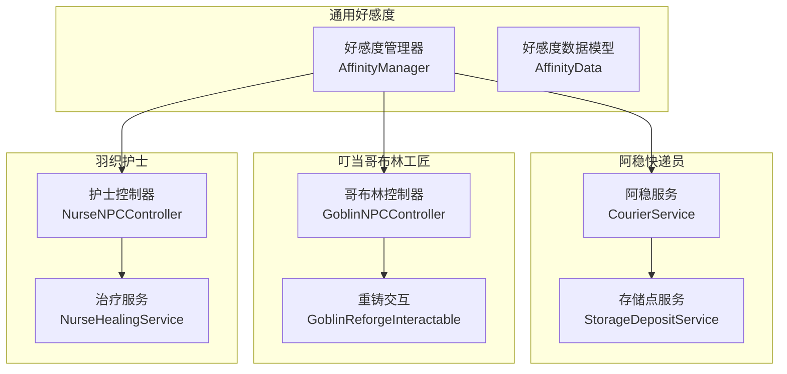
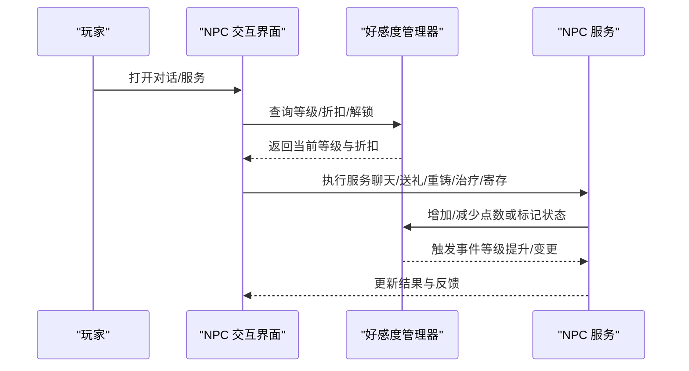
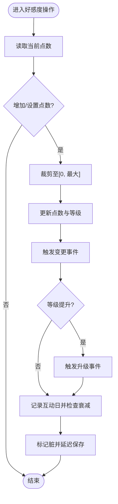
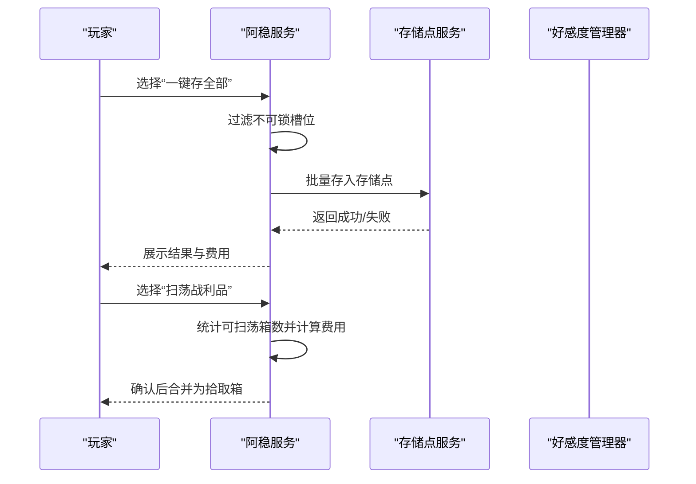
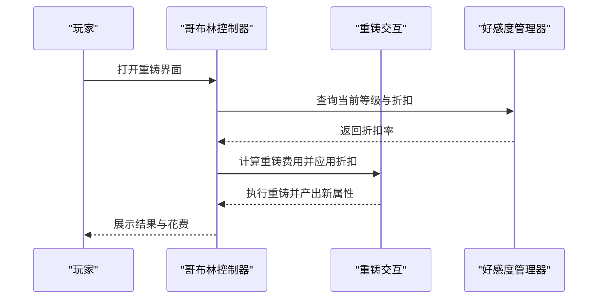
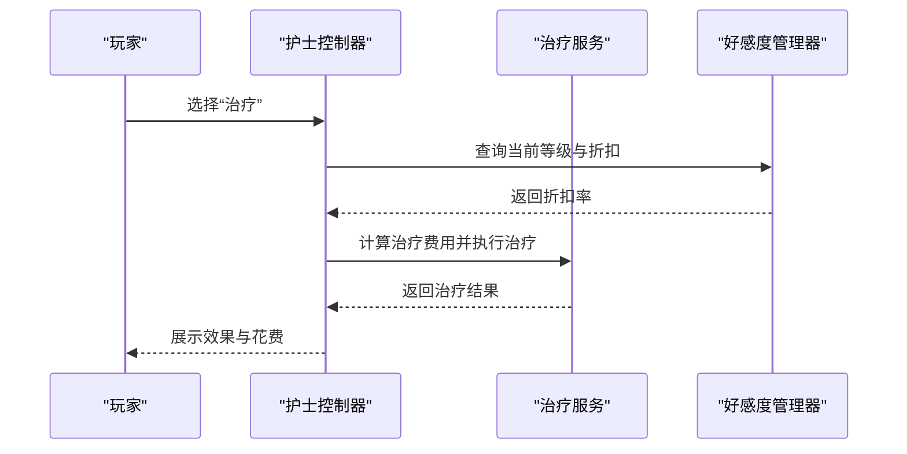
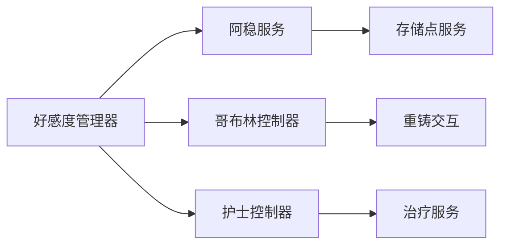

# NPC 关系系统

<cite>
**本文引用的文件**
- [AffinityManager.cs](file://Integration/Affinity/AffinityManager.cs)
- [AffinityData.cs](file://Integration/Affinity/AffinityData.cs)
- [courier.md](file://wiki-site/docs/en/npcs/courier.md)
- [goblin.md](file://wiki-site/docs/en/npcs/goblin.md)
- [nurse.md](file://wiki-site/docs/en/npcs/nurse.md)
- [affinity-marriage.md](file://wiki-site/docs/en/systems/affinity-marriage.md)
- [reforge.md](file://wiki-site/docs/en/systems/reforge.md)
- [CourierService.cs](file://Integration/NPCs/Courier/CourierService.cs)
- [StorageDepositService.cs](file://Integration/NPCs/Courier/StorageDepositService.cs)
- [GoblinNPCController.cs](file://Integration/NPCs/Goblin/GoblinNPCController.cs)
- [NurseNPCController.cs](file://Integration/NPCs/Nurse/NurseNPCController.cs)
- [NurseHealingService.cs](file://Integration/NPCs/Nurse/NurseHealingService.cs)
- [GoblinReforgeInteractable.cs](file://Integration/Reforge/GoblinReforgeInteractable.cs)
</cite>

## 目录
1. [简介](#简介)
2. [项目结构](#项目结构)
3. [核心组件](#核心组件)
4. [架构总览](#架构总览)
5. [详细组件分析](#详细组件分析)
6. [依赖分析](#依赖分析)
7. [性能考量](#性能考量)
8. [故障排查指南](#故障排查指南)
9. [结论](#结论)
10. [附录](#附录)

## 简介
本文件系统性梳理 BossRushMod 的 NPC 关系系统，覆盖好感度机制、三位常驻 NPC（阿稳、叮当、羽织）的服务与行为、对话树与礼物容器管理、生命周期与 AI 交互协议，以及玩家互动建议。目标是帮助开发者理解实现细节，同时为玩家提供清晰的关系发展与使用指南。

## 项目结构
BossRushMod 将 NPC 关系系统拆分为“通用好感度框架 + 各 NPC 专属服务”：
- 通用层：好感度管理器、数据模型、持久化与衰减逻辑、等级与折扣计算、事件总线。
- NPC 层：阿稳（快递员）、叮当（哥布林工匠）、羽织（护士）各自的服务、交互入口、UI 与行为控制。
- 集成层：重铸系统、婚礼系统、对话管理等跨模块能力。

图表来源
- [AffinityManager.cs:16-84](file://Integration/Affinity/AffinityManager.cs#L16-L84)
- [AffinityData.cs:5-24](file://Integration/Affinity/AffinityData.cs#L5-L24)
- [CourierService.cs](file://Integration/NPCs/Courier/CourierService.cs)
- [StorageDepositService.cs](file://Integration/NPCs/Courier/StorageDepositService.cs)
- [GoblinNPCController.cs](file://Integration/NPCs/Goblin/GoblinNPCController.cs)
- [GoblinReforgeInteractable.cs](file://Integration/Reforge/GoblinReforgeInteractable.cs)
- [NurseNPCController.cs](file://Integration/NPCs/Nurse/NurseNPCController.cs)
- [NurseHealingService.cs](file://Integration/NPCs/Nurse/NurseHealingService.cs)

章节来源
- [AffinityManager.cs:16-84](file://Integration/Affinity/AffinityManager.cs#L16-L84)
- [AffinityData.cs:5-24](file://Integration/Affinity/AffinityData.cs#L5-L24)

## 核心组件
- 好感度管理器：统一维护所有 NPC 的好感度点数、等级、折扣、故事触发状态、婚姻状态、每日衰减等；提供事件通知与延迟持久化。
- 好感度数据模型：序列化友好，记录每日互动历史、礼物反应、是否已婚、跟随状态等。
- NPC 控制器与服务：分别封装阿稳、叮当、羽织的交互入口、服务调用、UI 与行为控制。
- 重铸系统与婚礼系统：作为跨模块能力被 NPC 服务调用。

章节来源
- [AffinityManager.cs:16-84](file://Integration/Affinity/AffinityManager.cs#L16-L84)
- [AffinityData.cs:5-24](file://Integration/Affinity/AffinityData.cs#L5-L24)

## 架构总览
好感度系统采用“单例管理器 + 多 NPC 配置”的模式。每个 NPC 通过配置注册到管理器，管理器负责：
- 等级阈值与进度计算
- 增加/设置点数并触发事件
- 按等级查询解锁与折扣
- 记录每日互动历史以支持衰减
- 持久化到存档并在合适时机落盘

NPC 控制器在服务中读取管理器提供的等级/折扣信息，驱动 UI 显示与业务逻辑（如商店价格、重铸费用、治疗折扣）。

图表来源
- [AffinityManager.cs:248-422](file://Integration/Affinity/AffinityManager.cs#L248-L422)
- [AffinityManager.cs:471-497](file://Integration/Affinity/AffinityManager.cs#L471-L497)
- [CourierService.cs](file://Integration/NPCs/Courier/CourierService.cs)
- [GoblinNPCController.cs](file://Integration/NPCs/Goblin/GoblinNPCController.cs)
- [NurseNPCController.cs](file://Integration/NPCs/Nurse/NurseNPCController.cs)

## 详细组件分析

### 好感度系统：算法、等级体系与持久化
- 等级体系：统一 10 级，累计点数阈值固定（例如第 2 级需 50、第 10 级需 2300），等级由点数反查。
- 计算方式：从最高等级向下遍历阈值数组，找到满足条件的等级；进度条基于当前等级起点与下一级所需点数线性插值。
- 增减与约束：增加/设置点数时进行边界裁剪（不低于 0，不高于最大值），并触发 OnAffinityChanged 与可能的 OnLevelUp。
- 每日衰减：记录最近 30 天的互动日；若当天无聊天或送礼，次日结算 -15 点数。
- 持久化：订阅存档系统事件，在收集保存数据时立即保存并写入磁盘；支持延迟保存以减少 IO 频率。
- 解锁与折扣：根据 NPC 配置中的等级-折扣映射，取当前等级对应的最高折扣；解锁检查直接比较等级。

图表来源
- [AffinityManager.cs:271-317](file://Integration/Affinity/AffinityManager.cs#L271-L317)
- [AffinityManager.cs:348-422](file://Integration/Affinity/AffinityManager.cs#L348-L422)
- [AffinityManager.cs:591-694](file://Integration/Affinity/AffinityManager.cs#L591-L694)
- [AffinityManager.cs:168-184](file://Integration/Affinity/AffinityManager.cs#L168-L184)

章节来源
- [AffinityManager.cs:24-47](file://Integration/Affinity/AffinityManager.cs#L24-L47)
- [AffinityManager.cs:271-317](file://Integration/Affinity/AffinityManager.cs#L271-L317)
- [AffinityManager.cs:348-422](file://Integration/Affinity/AffinityManager.cs#L348-L422)
- [AffinityManager.cs:591-694](file://Integration/Affinity/AffinityManager.cs#L591-L694)
- [AffinityManager.cs:168-184](file://Integration/Affinity/AffinityManager.cs#L168-L184)

### 阿稳（快递员）：引导、商店与存储
- 服务概览：快递箱存取、一键存全部、存储点存取、扫荡战利品合并、物品提取。
- 存储点：跨场景、跨模式持久化；可在一模式存入另一模式取出。
- 扫荡规则：按当前可扫荡的战利品箱数量计费，合并为单一拾取箱。
- 引导与 UI：通过交互按钮与提示文案引导玩家完成“存/取/扫荡”流程。

图表来源
- [courier.md:7-37](file://wiki-site/docs/en/npcs/courier.md#L7-L37)
- [CourierService.cs](file://Integration/NPCs/Courier/CourierService.cs)
- [StorageDepositService.cs](file://Integration/NPCs/Courier/StorageDepositService.cs)

章节来源
- [courier.md:7-37](file://wiki-site/docs/en/npcs/courier.md#L7-L37)

### 叮当（哥布林工匠）：重铸、礼物与折扣
- 服务概览：日常聊天、送礼、商店购买、装备重铸。
- 礼物偏好：喜欢/中立/讨厌影响好感变化；钻石戒指为最爱。
- 重铸系统：基础费用与装备价值相关，受好感等级折扣影响（第 3 级 10%、第 6 级 15%、第 10 级 20%）。
- 商店折扣：随好感等级逐步提升，解锁更多商品与优惠。

图表来源
- [goblin.md:7-45](file://wiki-site/docs/en/npcs/goblin.md#L7-L45)
- [reforge.md:25-40](file://wiki-site/docs/en/systems/reforge.md#L25-L40)
- [GoblinNPCController.cs](file://Integration/NPCs/Goblin/GoblinNPCController.cs)
- [GoblinReforgeInteractable.cs](file://Integration/Reforge/GoblinReforgeInteractable.cs)

章节来源
- [goblin.md:7-45](file://wiki-site/docs/en/npcs/goblin.md#L7-L45)
- [reforge.md:25-40](file://wiki-site/docs/en/systems/reforge.md#L25-L40)

### 羽织（护士）：治疗、婚姻与互动
- 服务概览：日常聊天、送礼、治疗（恢复生命与移除负面状态）。
- 治疗折扣：随好感等级提升而降低费用（最高可达 40% 折扣）。
- 婚姻关系：达到满好感后，可在教堂求婚；婚后 NPC 迁居教堂并提供专属对话与福利（如赠送镇定剂）。
- 互动系统：包含跟随/回家、婚戒消费与背叛惩罚等。

图表来源
- [nurse.md:7-43](file://wiki-site/docs/en/npcs/nurse.md#L7-L43)
- [NurseNPCController.cs](file://Integration/NPCs/Nurse/NurseNPCController.cs)
- [NurseHealingService.cs](file://Integration/NPCs/Nurse/NurseHealingService.cs)

章节来源
- [nurse.md:7-43](file://wiki-site/docs/en/npcs/nurse.md#L7-L43)

### 对话树、礼物容器与 NPC 行为模式
- 对话树：通过交互入口触发不同分支（聊天、送礼、服务），并根据好感等级与剧情触发状态显示对应选项。
- 礼物容器：每日限制一次送礼；管理器记录上次送礼日期与反应类型，用于判定是否可再次送礼及好感变化。
- 行为模式：NPC 控制器负责移动、动画、交互组管理与 UI 更新；服务层处理具体业务（重铸、治疗、存储）。

章节来源
- [AffinityManager.cs:503-589](file://Integration/Affinity/AffinityManager.cs#L503-L589)
- [GoblinNPCController.cs](file://Integration/NPCs/Goblin/GoblinNPCController.cs)
- [NurseNPCController.cs](file://Integration/NPCs/Nurse/NurseNPCController.cs)

### 生命周期管理、AI 行为与交互协议
- 生命周期：初始化时订阅存档事件，加载数据；关闭时强制落盘；场景中按需唤醒与清理。
- AI 行为：移动与动画由各自控制器管理；交互协议通过可交互对象暴露统一接口（如“聊天/送礼/服务”）。
- 交互协议：UI 与后端解耦，UI 仅负责输入与展示，服务层执行业务并回调 UI。

章节来源
- [AffinityManager.cs:107-184](file://Integration/Affinity/AffinityManager.cs#L107-L184)
- [GoblinNPCController.cs](file://Integration/NPCs/Goblin/GoblinNPCController.cs)
- [NurseNPCController.cs](file://Integration/NPCs/Nurse/NurseNPCController.cs)

## 依赖分析
- 好感度管理器依赖存档系统事件进行加载/保存；NPC 控制器依赖管理器获取等级与折扣。
- 阿稳服务依赖存储点服务进行持久化存取；重铸交互依赖好感度折扣计算。
- 护士服务依赖好感度折扣计算治疗费用。

图表来源
- [AffinityManager.cs:16-84](file://Integration/Affinity/AffinityManager.cs#L16-L84)
- [CourierService.cs](file://Integration/NPCs/Courier/CourierService.cs)
- [StorageDepositService.cs](file://Integration/NPCs/Courier/StorageDepositService.cs)
- [GoblinNPCController.cs](file://Integration/NPCs/Goblin/GoblinNPCController.cs)
- [GoblinReforgeInteractable.cs](file://Integration/Reforge/GoblinReforgeInteractable.cs)
- [NurseNPCController.cs](file://Integration/NPCs/Nurse/NurseNPCController.cs)
- [NurseHealingService.cs](file://Integration/NPCs/Nurse/NurseHealingService.cs)

章节来源
- [AffinityManager.cs:16-84](file://Integration/Affinity/AffinityManager.cs#L16-L84)

## 性能考量
- 延迟保存：通过脏标记与时间间隔减少频繁 IO，避免每次数值变动都落盘。
- 历史压缩：互动历史保留最近 30 天，避免字符串过长影响序列化性能。
- 缓存与复用：NPC 控制器与服务中尽量复用查找结果，减少热点路径上的反射与对象分配。
- 事件最小化：仅在数值真正变化时触发事件，降低 UI 刷新压力。

## 故障排查指南
- 好感度未保存：确认是否在存档收集阶段触发保存；检查延迟保存是否超时；查看日志中的“强制写入磁盘”提示。
- 每日衰减异常：检查互动历史是否记录正确；确认当日是否有聊天或送礼；核对衰减结算时机。
- 折扣不生效：确认 NPC 配置中的等级-折扣映射是否正确；检查当前等级是否达到预期。
- 重铸费用错误：核对基础费用公式与好感折扣叠加顺序；检查是否使用了锁定道具影响结果。
- 治疗费用异常：核对等级折扣与货币支付路径（包括净化点支付兼容）。

章节来源
- [AffinityManager.cs:168-184](file://Integration/Affinity/AffinityManager.cs#L168-L184)
- [AffinityManager.cs:591-694](file://Integration/Affinity/AffinityManager.cs#L591-L694)
- [reforge.md:25-40](file://wiki-site/docs/en/systems/reforge.md#L25-L40)
- [nurse.md:7-43](file://wiki-site/docs/en/npcs/nurse.md#L7-L43)

## 结论
BossRushMod 的 NPC 关系系统以统一的好感度框架为核心，结合三位 NPC 的特色服务，形成完整的社交与成长循环。通过清晰的等级体系、折扣机制、持久化与衰减策略，既保证了玩法深度，也提供了良好的扩展性。玩家可通过日常互动、送礼与服务使用逐步解锁内容，最终达成婚姻关系并获得长期收益。

## 附录
- 关系发展建议
  - 每日与叮当/羽织聊天或送礼，避免断档导致衰减。
  - 优先提升叮当的重铸折扣与羽织的治疗折扣，提高资源效率。
  - 合理管理阿稳的存储点，利用一键存取与扫荡功能提高效率。
  - 达到满好感后再求婚，确保婚后福利稳定。
- 常用术语
  - 好感度：累积点数决定等级与解锁。
  - 折扣：基于等级的价格减免。
  - 存储点：跨场景/模式的持久化仓库。
  - 重铸：随机化装备属性的核心进阶手段。
  - 治疗：恢复生命与移除负面状态的医疗服务。