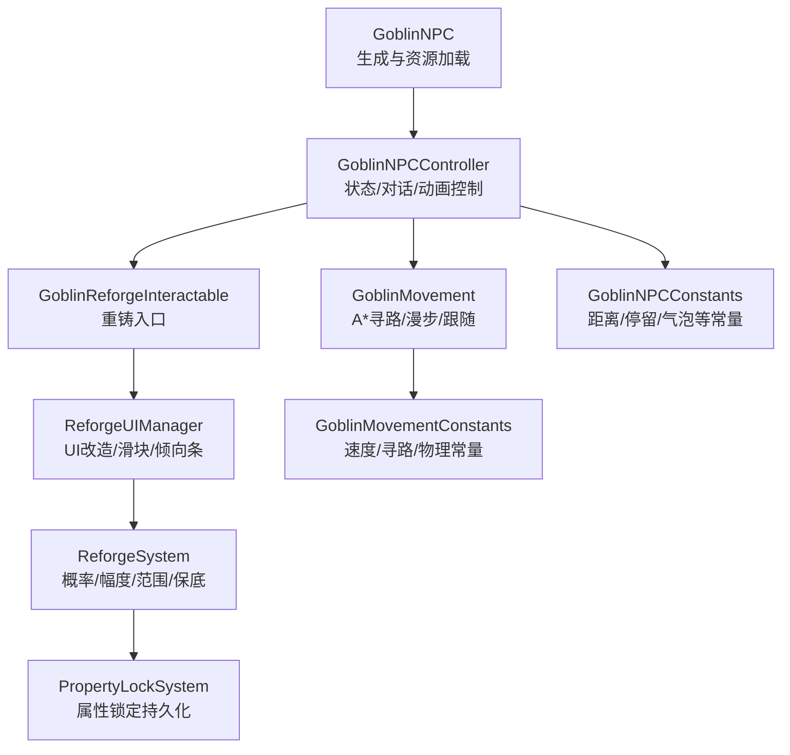
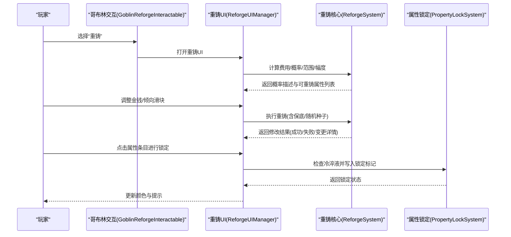
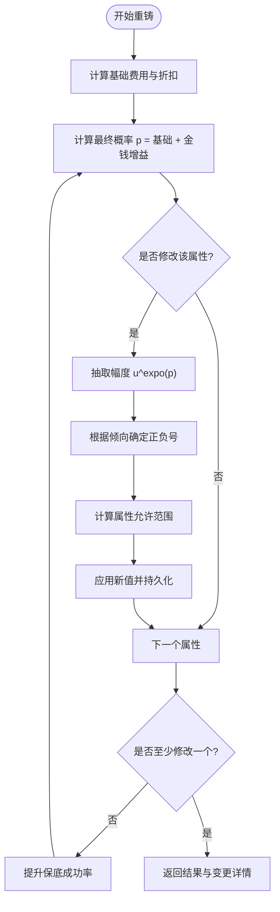
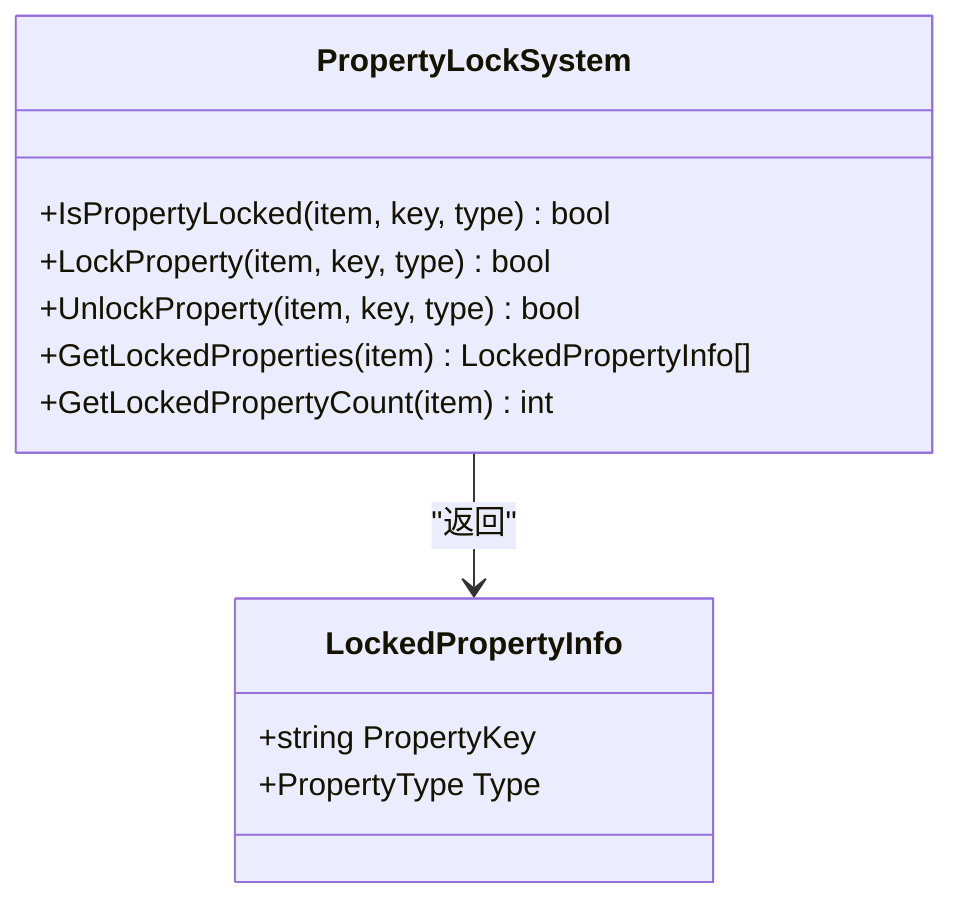
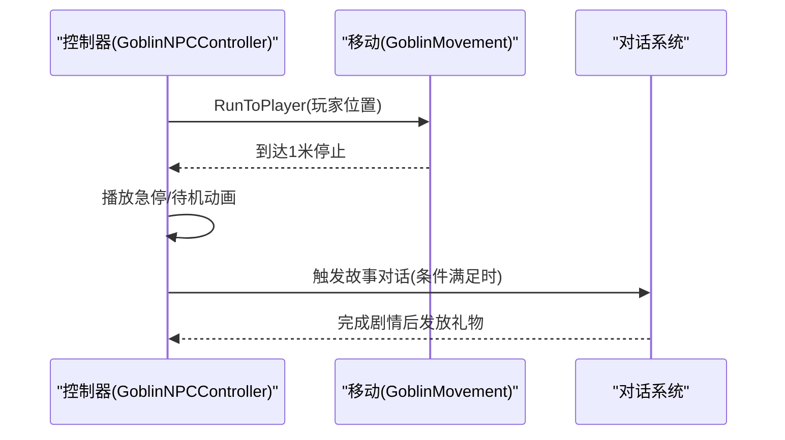
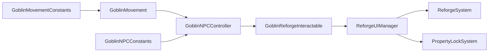

# 叮当（哥布林工匠）系统

<cite>
**本文引用的文件**
- [ReforgeSystem.cs](file://Integration/Reforge/ReforgeSystem.cs)
- [ReforgeSystem_ApplyAndResults.cs](file://Integration/Reforge/ReforgeSystem_ApplyAndResults.cs)
- [PropertyLockSystem.cs](file://Integration/Reforge/PropertyLockSystem.cs)
- [GoblinReforgeInteractable.cs](file://Integration/Reforge/GoblinReforgeInteractable.cs)
- [GoblinNPCController.cs](file://Integration/NPCs/Goblin/GoblinNPCController.cs)
- [GoblinMovement.cs](file://Integration/NPCs/Goblin/GoblinMovement.cs)
- [GoblinNPC.cs](file://Integration/NPCs/Goblin/GoblinNPC.cs)
- [GoblinNPCConstants.cs](file://Integration/Constants/GoblinNPCConstants.cs)
- [GoblinMovementConstants.cs](file://Integration/Constants/GoblinMovementConstants.cs)
- [ReforgeUIManager.cs](file://Integration/Reforge/ReforgeUIManager.cs)
</cite>

## 目录
1. [简介](#简介)
2. [项目结构](#项目结构)
3. [核心组件](#核心组件)
4. [架构总览](#架构总览)
5. [详细组件分析](#详细组件分析)
6. [依赖关系分析](#依赖关系分析)
7. [性能考量](#性能考量)
8. [故障排查指南](#故障排查指南)
9. [结论](#结论)
10. [附录：重铸策略与案例](#附录：重铸策略与案例)

## 简介
本文件系统性梳理“叮当（哥布林工匠）”NPC 的重铸系统、属性锁定、礼物与好感度折扣、AI 行为与移动模式、对话系统，并提供可操作的重铸策略与成本效益分析。内容基于仓库中的实际实现进行说明，帮助玩家与开发者理解机制并高效利用服务。

## 项目结构
围绕叮当的 NPC 与重铸功能，代码主要分布在以下模块：
- 重铸核心算法与结果处理：ReforgeSystem、ReforgeSystem_ApplyAndResults
- 属性锁定：PropertyLockSystem
- UI 交互与展示：ReforgeUIManager、GoblinReforgeInteractable
- NPC 生成与控制：GoblinNPC、GoblinNPCController、GoblinMovement
- 常量配置：GoblinNPCConstants、GoblinMovementConstants

图表来源
- [GoblinNPC.cs:114-230](file://Integration/NPCs/Goblin/GoblinNPC.cs#L114-L230)
- [GoblinNPCController.cs:100-159](file://Integration/NPCs/Goblin/GoblinNPCController.cs#L100-L159)
- [GoblinMovement.cs:181-254](file://Integration/NPCs/Goblin/GoblinMovement.cs#L181-L254)
- [GoblinReforgeInteractable.cs:56-79](file://Integration/Reforge/GoblinReforgeInteractable.cs#L56-L79)
- [ReforgeUIManager.cs:397-421](file://Integration/Reforge/ReforgeUIManager.cs#L397-L421)
- [ReforgeSystem.cs:298-526](file://Integration/Reforge/ReforgeSystem.cs#L298-L526)
- [PropertyLockSystem.cs:61-177](file://Integration/Reforge/PropertyLockSystem.cs#L61-L177)
- [GoblinNPCConstants.cs:15-87](file://Integration/Constants/GoblinNPCConstants.cs#L15-L87)
- [GoblinMovementConstants.cs:15-120](file://Integration/Constants/GoblinMovementConstants.cs#L15-L120)

章节来源
- [GoblinNPC.cs:114-230](file://Integration/NPCs/Goblin/GoblinNPC.cs#L114-L230)
- [GoblinNPCController.cs:100-159](file://Integration/NPCs/Goblin/GoblinNPCController.cs#L100-L159)
- [GoblinMovement.cs:181-254](file://Integration/NPCs/Goblin/GoblinMovement.cs#L181-L254)
- [GoblinReforgeInteractable.cs:56-79](file://Integration/Reforge/GoblinReforgeInteractable.cs#L56-L79)
- [ReforgeUIManager.cs:397-421](file://Integration/Reforge/ReforgeUIManager.cs#L397-L421)
- [ReforgeSystem.cs:298-526](file://Integration/Reforge/ReforgeSystem.cs#L298-L526)
- [PropertyLockSystem.cs:61-177](file://Integration/Reforge/PropertyLockSystem.cs#L61-L177)
- [GoblinNPCConstants.cs:15-87](file://Integration/Constants/GoblinNPCConstants.cs#L15-L87)
- [GoblinMovementConstants.cs:15-120](file://Integration/Constants/GoblinMovementConstants.cs#L15-L120)

## 核心组件
- 重铸系统（ReforgeSystem）：负责概率计算、金额增益、属性范围、幅度抽取、正负号倾向、保底计数与最终应用修改。
- 属性锁定（PropertyLockSystem）：通过物品 Variables 持久化锁定标记，支持锁定/解锁与查询。
- 重铸 UI（ReforgeUIManager）：复用原版分解界面，改造为金钱投入、倾向滑块、概率显示与锁定交互。
- 哥布林交互（GoblinReforgeInteractable）：提供“重铸”子选项，打开 UI 并驱动对话状态。
- 哥布林控制器（GoblinNPCController）：管理动画、对话触发、故事剧情与到达玩家后的交互反馈。
- 哥布林移动（GoblinMovement）：基于 A* 的寻路、跟随玩家、漫步与重力/碰撞处理。
- 常量配置（GoblinNPCConstants、GoblinMovementConstants）：集中管理距离、速度、时间等参数。

章节来源
- [ReforgeSystem.cs:298-526](file://Integration/Reforge/ReforgeSystem.cs#L298-L526)
- [ReforgeSystem_ApplyAndResults.cs:147-286](file://Integration/Reforge/ReforgeSystem_ApplyAndResults.cs#L147-L286)
- [PropertyLockSystem.cs:61-177](file://Integration/Reforge/PropertyLockSystem.cs#L61-L177)
- [ReforgeUIManager.cs:397-421](file://Integration/Reforge/ReforgeUIManager.cs#L397-L421)
- [GoblinReforgeInteractable.cs:56-79](file://Integration/Reforge/GoblinReforgeInteractable.cs#L56-L79)
- [GoblinNPCController.cs:166-212](file://Integration/NPCs/Goblin/GoblinNPCController.cs#L166-L212)
- [GoblinMovement.cs:130-175](file://Integration/NPCs/Goblin/GoblinMovement.cs#L130-L175)
- [GoblinNPCConstants.cs:15-87](file://Integration/Constants/GoblinNPCConstants.cs#L15-L87)
- [GoblinMovementConstants.cs:15-120](file://Integration/Constants/GoblinMovementConstants.cs#L15-L120)

## 架构总览
重铸流程从玩家与哥布林交互开始，进入 UI 选择物品与调整参数，随后调用重铸核心算法执行随机化与属性修改，并通过 UI 反馈结果；属性锁定在 UI 层直接消耗材料并写入持久化数据。

图表来源
- [GoblinReforgeInteractable.cs:56-79](file://Integration/Reforge/GoblinReforgeInteractable.cs#L56-L79)
- [ReforgeUIManager.cs:397-421](file://Integration/Reforge/ReforgeUIManager.cs#L397-L421)
- [ReforgeSystem.cs:372-526](file://Integration/Reforge/ReforgeSystem.cs#L372-L526)
- [PropertyLockSystem.cs:61-177](file://Integration/Reforge/PropertyLockSystem.cs#L61-L177)

## 详细组件分析

### 重铸系统（ReforgeSystem）
- 概率与费用
  - 基础概率由稀有度因子与物品价值因子共同决定，并叠加金钱增益。
  - 基础费用按物品价值的比例计算，并有最低费用限制。
  - 可通过好感度获得折扣。
- 属性范围与类型
  - 小数值属性使用绝对范围或百分比范围，整数属性保持整数。
  - 某些内部时序类 Stat 不参与重铸，避免武器行为失真。
- 幅度抽取与正负号
  - 幅度采用幂分布抽取，p 越大越容易抽到大数。
  - 正负号由倾向滑块完全控制（0=必定负，1=必定正，0.5=各半）。
- 保底机制
  - 连续失败后提升成功率，保证至少一个属性被修改。
- 应用与持久化
  - 修改完成后保存重铸数据到 Variables，确保场景切换后恢复。
  - 使用委托缓存优化反射调用，提升性能。

图表来源
- [ReforgeSystem.cs:301-526](file://Integration/Reforge/ReforgeSystem.cs#L301-L526)
- [ReforgeSystem_ApplyAndResults.cs:147-286](file://Integration/Reforge/ReforgeSystem_ApplyAndResults.cs#L147-L286)

章节来源
- [ReforgeSystem.cs:301-526](file://Integration/Reforge/ReforgeSystem.cs#L301-L526)
- [ReforgeSystem_ApplyAndResults.cs:147-286](file://Integration/Reforge/ReforgeSystem_ApplyAndResults.cs#L147-L286)

### 属性锁定系统（PropertyLockSystem）
- 锁定机制
  - 通过物品 Variables 写入带前缀的键（如 RF_LOCK_MOD_xxx），值为 1 表示已固定。
  - 锁定后隐藏该变量显示，避免干扰物品详情。
- 材料与成功率
  - UI 层在点击锁定时检查库存中的冷淬液数量，消耗 1 个后写入锁定标记。
  - 锁定本身无成功率概念，只要材料足够即可锁定。
- 查询与管理
  - 提供获取所有已锁定属性的接口，便于 UI 展示与逻辑判断。

图表来源
- [PropertyLockSystem.cs:61-177](file://Integration/Reforge/PropertyLockSystem.cs#L61-L177)
- [PropertyLockSystem.cs:179-251](file://Integration/Reforge/PropertyLockSystem.cs#L179-L251)

章节来源
- [PropertyLockSystem.cs:61-177](file://Integration/Reforge/PropertyLockSystem.cs#L61-L177)
- [PropertyLockSystem.cs:179-251](file://Integration/Reforge/PropertyLockSystem.cs#L179-L251)

### 礼物系统与好感度折扣
- 礼物偏好
  - 喜欢：钻石、生日蛋糕、配方/蓝图等（+80）
  - 喜爱：钻戒（+500）
  - 中性：其他物品（+20）
  - 厌恶：砖石（假钻）（-40）
- 好感度等级与奖励
  - 等级阈值与解锁服务（商店、折扣、剧情、礼物）见 wiki 文档。
- 折扣机制
  - 重铸费用受好感度折扣影响，等级越高折扣越大。
  - UI 与费用计算均读取当前折扣率。

章节来源
- [GoblinReforgeInteractable.cs:364-433](file://Integration/Reforge/GoblinReforgeInteractable.cs#L364-L433)
- [ReforgeSystem.cs:392-409](file://Integration/Reforge/ReforgeSystem.cs#L392-L409)

### 哥布林的 AI 行为、移动模式与对话系统
- AI 行为
  - 控制器管理待机、跑步、急停、面向玩家等状态。
  - 达到玩家附近时播放急停动画并在 1 米内真正停下。
- 移动模式
  - 使用 A* 寻路，支持跟随玩家、漫步与重力/碰撞。
  - 漫步间隔与半径、速度、转向等参数集中配置。
- 对话系统
  - 大对话系统用于日常问候与故事剧情（5级、10级）。
  - 故事触发有距离与冷却保护，避免重复触发。
  - 10级故事完成后赠送“叮当涂鸦”礼物。

图表来源
- [GoblinNPCController.cs:166-212](file://Integration/NPCs/Goblin/GoblinNPCController.cs#L166-L212)
- [GoblinMovement.cs:130-175](file://Integration/NPCs/Goblin/GoblinMovement.cs#L130-L175)
- [GoblinNPCController.cs:455-593](file://Integration/NPCs/Goblin/GoblinNPCController.cs#L455-L593)

章节来源
- [GoblinNPCController.cs:166-212](file://Integration/NPCs/Goblin/GoblinNPCController.cs#L166-L212)
- [GoblinMovement.cs:130-175](file://Integration/NPCs/Goblin/GoblinMovement.cs#L130-L175)
- [GoblinNPCController.cs:455-593](file://Integration/NPCs/Goblin/GoblinNPCController.cs#L455-L593)

## 依赖关系分析
- ReforgeSystem 依赖物品统计系统（Modifier/Stat/Variable）与自定义数据持久化。
- ReforgeUIManager 依赖原版分解 UI，通过反射注入重铸逻辑与 UI 元素。
- GoblinReforgeInteractable 依赖控制器与音频管理器，打开 UI 并驱动对话状态。
- 属性锁定依赖物品 Variables 存储，UI 层消费冷淬液。
- 移动与对话依赖常量配置，保证一致的行为与表现。

图表来源
- [ReforgeUIManager.cs:397-421](file://Integration/Reforge/ReforgeUIManager.cs#L397-L421)
- [ReforgeSystem.cs:372-526](file://Integration/Reforge/ReforgeSystem.cs#L372-L526)
- [PropertyLockSystem.cs:61-177](file://Integration/Reforge/PropertyLockSystem.cs#L61-L177)
- [GoblinReforgeInteractable.cs:56-79](file://Integration/Reforge/GoblinReforgeInteractable.cs#L56-L79)
- [GoblinNPCController.cs:166-212](file://Integration/NPCs/Goblin/GoblinNPCController.cs#L166-L212)
- [GoblinMovement.cs:130-175](file://Integration/NPCs/Goblin/GoblinMovement.cs#L130-L175)
- [GoblinNPCConstants.cs:15-87](file://Integration/Constants/GoblinNPCConstants.cs#L15-L87)
- [GoblinMovementConstants.cs:15-120](file://Integration/Constants/GoblinMovementConstants.cs#L15-L120)

章节来源
- [ReforgeUIManager.cs:397-421](file://Integration/Reforge/ReforgeUIManager.cs#L397-L421)
- [ReforgeSystem.cs:372-526](file://Integration/Reforge/ReforgeSystem.cs#L372-L526)
- [PropertyLockSystem.cs:61-177](file://Integration/Reforge/PropertyLockSystem.cs#L61-L177)
- [GoblinReforgeInteractable.cs:56-79](file://Integration/Reforge/GoblinReforgeInteractable.cs#L56-L79)
- [GoblinNPCController.cs:166-212](file://Integration/NPCs/Goblin/GoblinNPCController.cs#L166-L212)
- [GoblinMovement.cs:130-175](file://Integration/NPCs/Goblin/GoblinMovement.cs#L130-L175)
- [GoblinNPCConstants.cs:15-87](file://Integration/Constants/GoblinNPCConstants.cs#L15-L87)
- [GoblinMovementConstants.cs:15-120](file://Integration/Constants/GoblinMovementConstants.cs#L15-L120)

## 性能考量
- 委托缓存：对 ModifierDescription.value 与 Stat.baseValue 的 setter 使用表达式树编译的委托，显著降低反射开销。
- 预制体缓存：UI 层缓存常用物品预制体，减少重复实例化。
- 反射缓存：初始化一次后复用字段与属性信息，避免每帧查找。
- 协程合并：UI 构建与刷新使用延迟协程合并，避免频繁分配。
- 路径寻路：移动组件使用 A* Seeker，合理设置路点距离与停止距离，减少无效计算。

章节来源
- [ReforgeSystem.cs:48-98](file://Integration/Reforge/ReforgeSystem.cs#L48-L98)
- [ReforgeUIManager.cs:152-206](file://Integration/Reforge/ReforgeUIManager.cs#L152-L206)
- [ReforgeUIManager.cs:209-325](file://Integration/Reforge/ReforgeUIManager.cs#L209-L325)
- [GoblinMovement.cs:263-303](file://Integration/NPCs/Goblin/GoblinMovement.cs#L263-L303)

## 故障排查指南
- 无法重铸
  - 检查物品是否具备可显示的 Modifier/Stat/Variable（Display=true）。
  - 确认物品标签属于可重铸集合（Armor/Weapon/Totem 等）。
- 重铸失败或无变化
  - 查看概率描述与保底计数，确认是否处于保底阶段。
  - 检查属性范围与整数约束，避免目标值已达边界。
- 属性锁定失败
  - 确认库存中有足够的冷淬液。
  - 检查 Variables 写入是否成功，必要时重启 UI 刷新状态。
- NPC 不移动或不触发对话
  - 检查 A* Pathfinding 是否激活。
  - 确认故事对话触发距离与冷却，避免频繁检测导致阻塞。

章节来源
- [ReforgeSystem.cs:611-711](file://Integration/Reforge/ReforgeSystem.cs#L611-L711)
- [PropertyLockSystem.cs:61-177](file://Integration/Reforge/PropertyLockSystem.cs#L61-L177)
- [GoblinMovement.cs:263-303](file://Integration/NPCs/Goblin/GoblinMovement.cs#L263-L303)
- [GoblinNPCController.cs:218-256](file://Integration/NPCs/Goblin/GoblinNPCController.cs#L218-L256)

## 结论
叮当的 NPC 系统以重铸为核心，结合属性锁定与好感度折扣，形成完整的装备强化闭环。其算法兼顾公平性与可控性（倾向滑块），UI 层提供直观的概率与范围展示。AI 与移动系统稳定可靠，对话与剧情增强沉浸感。遵循本文的策略建议，可最大化装备价值并优化资源消耗。

## 附录：重铸策略与案例
- 策略要点
  - 优先锁定关键属性（高价值或难以获得的词缀），消耗冷淬液确保不再被覆盖。
  - 使用倾向滑块将正负方向控制在期望区间，提高命中效率。
  - 对高价值物品适度投入金钱以提升概率，但需评估边际收益。
  - 关注保底机制，在连续失败时继续尝试，直至触发修改。
- 成本效益分析
  - 基础费用随物品价值增长，折扣随好感度提升而增加。
  - 金钱增益呈分段函数，超过一定阈值后收益递减，需权衡投入产出比。
  - 属性范围与整数约束会影响有效改动空间，提前规划目标值。
- 具体案例（示例思路）
  - 低价值防具：小额投入 + 倾向正向，快速试错，锁定唯一可用属性。
  - 高价值武器：中等投入 + 倾向接近 0.5，追求多属性同时改善，逐步锁定最优组合。
  - 图腾类：关注 Stat 的可重铸性，避免内部时序类 Stat 参与重铸导致行为异常。
- 礼物赠送最佳时机
  - 日常聊天每日一次，稳定提升好感度。
  - 在解锁商店折扣前集中赠送喜欢/喜爱的礼物，尽快达到高等级折扣。
  - 结婚后每日聊天可获得冷凝液，持续支撑重铸与锁定需求。

章节来源
- [ReforgeSystem.cs:301-526](file://Integration/Reforge/ReforgeSystem.cs#L301-L526)
- [ReforgeSystem_ApplyAndResults.cs:147-286](file://Integration/Reforge/ReforgeSystem_ApplyAndResults.cs#L147-L286)
- [PropertyLockSystem.cs:61-177](file://Integration/Reforge/PropertyLockSystem.cs#L61-L177)
- [GoblinReforgeInteractable.cs:364-433](file://Integration/Reforge/GoblinReforgeInteractable.cs#L364-L433)