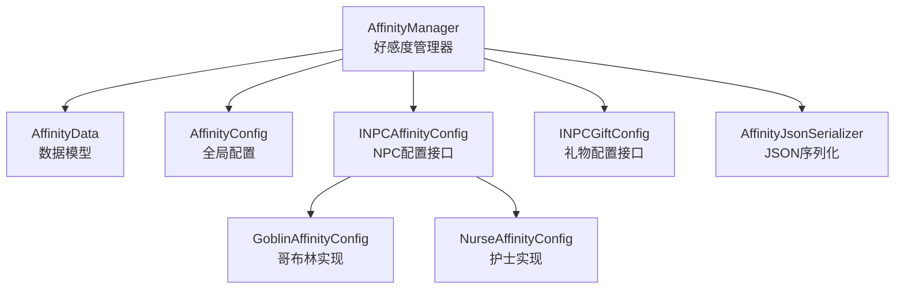
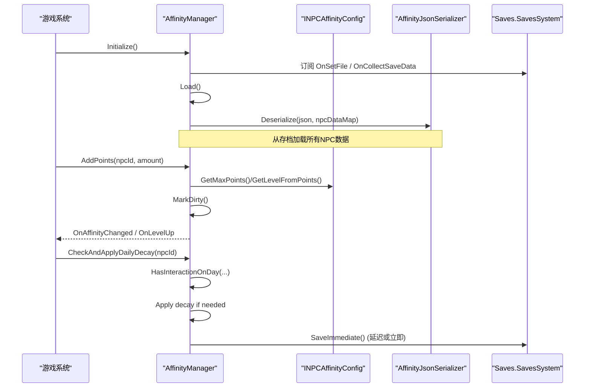
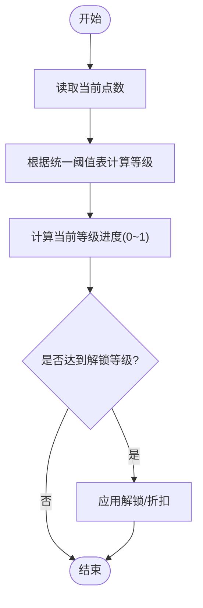
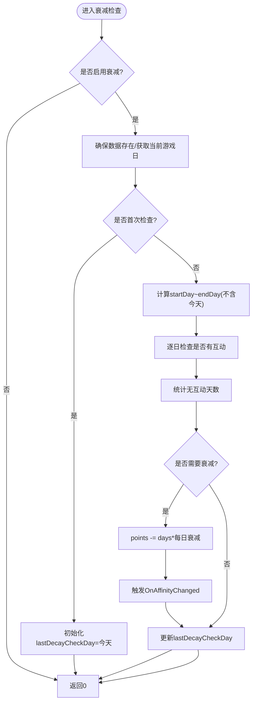
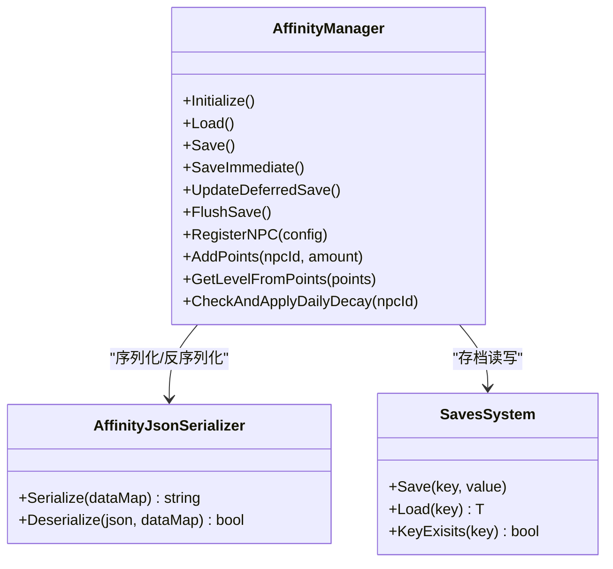
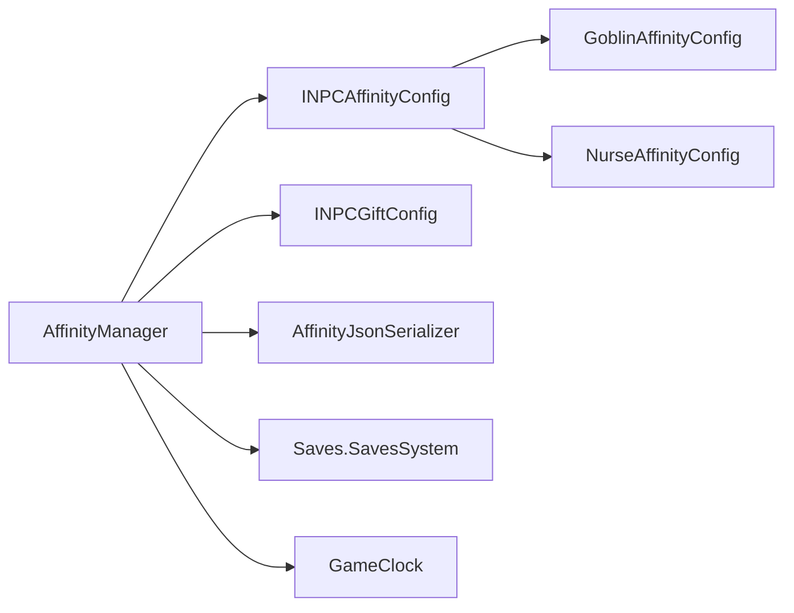

# 好感度系统核心机制

<cite>
**本文引用的文件**
- [AffinityManager.cs](file://Integration/Affinity/AffinityManager.cs)
- [AffinityManagerPersistenceAndDecay.cs](file://Integration/Affinity/AffinityManagerPersistenceAndDecay.cs)
- [AffinityData.cs](file://Integration/Affinity/AffinityData.cs)
- [AffinityConfig.cs](file://Integration/Affinity/AffinityConfig.cs)
- [INPCAffinityConfig.cs](file://Integration/Affinity/INPCAffinityConfig.cs)
- [INPCGiftConfig.cs](file://Integration/Affinity/Core/INPCGiftConfig.cs)
- [GoblinAffinityConfig.cs](file://Integration/Affinity/NPCs/GoblinAffinityConfig.cs)
- [NurseAffinityConfig.cs](file://Integration/Affinity/NPCs/NurseAffinityConfig.cs)
- [AffinityJsonSerializer.cs](file://Integration/Affinity/AffinityJsonSerializer.cs)
</cite>

## 目录
1. [简介](#简介)
2. [项目结构](#项目结构)
3. [核心组件](#核心组件)
4. [架构总览](#架构总览)
5. [详细组件分析](#详细组件分析)
6. [依赖关系分析](#依赖关系分析)
7. [性能考量](#性能考量)
8. [故障排查指南](#故障排查指南)
9. [结论](#结论)
10. [附录：扩展与集成指南](#附录：扩展与集成指南)

## 简介
本文件系统性阐述 BossRushMod 的好感度系统核心机制，覆盖以下主题：
- 好感度计算算法：基础值、增减规则、衰减机制、等级体系
- AffinityManager 的核心功能：好感度管理、数据持久化、缓存策略
- AffinityData 的数据结构与存储格式
- AffinityConfig 的配置选项
- INPCAffinityConfig 接口的设计模式与实现方式
- 扩展指南：如何添加新的 NPC 关系类型，并提供具体代码示例与使用模式

## 项目结构
好感度系统位于 Integration/Affinity 目录下，采用“管理器 + 数据模型 + 配置接口 + 具体NPC实现 + 序列化”的分层组织：
- 管理器：AffinityManager（含持久化与衰减）
- 数据模型：AffinityData
- 全局配置：AffinityConfig
- 接口定义：INPCAffinityConfig、INPCGiftConfig 等
- NPC 实现：GoblinAffinityConfig、NurseAffinityConfig
- 序列化：AffinityJsonSerializer

图表来源
- [AffinityManager.cs:1-120](file://Integration/Affinity/AffinityManager.cs#L1-L120)
- [AffinityManagerPersistenceAndDecay.cs:1-120](file://Integration/Affinity/AffinityManagerPersistenceAndDecay.cs#L1-L120)
- [AffinityData.cs:1-60](file://Integration/Affinity/AffinityData.cs#L1-L60)
- [AffinityConfig.cs:1-70](file://Integration/Affinity/AffinityConfig.cs#L1-L70)
- [INPCAffinityConfig.cs:1-77](file://Integration/Affinity/INPCAffinityConfig.cs#L1-L77)
- [INPCGiftConfig.cs:1-99](file://Integration/Affinity/Core/INPCGiftConfig.cs#L1-L99)
- [GoblinAffinityConfig.cs:1-120](file://Integration/Affinity/NPCs/GoblinAffinityConfig.cs#L1-L120)
- [NurseAffinityConfig.cs:1-120](file://Integration/Affinity/NPCs/NurseAffinityConfig.cs#L1-L120)
- [AffinityJsonSerializer.cs:1-90](file://Integration/Affinity/AffinityJsonSerializer.cs#L1-L90)

章节来源
- [AffinityManager.cs:1-120](file://Integration/Affinity/AffinityManager.cs#L1-L120)
- [AffinityManagerPersistenceAndDecay.cs:1-120](file://Integration/Affinity/AffinityManagerPersistenceAndDecay.cs#L1-L120)

## 核心组件
- AffinityManager：统一好感度计算、事件广播、延迟保存、存档加载/保存、每日衰减检查、解锁与折扣查询、故事触发标记、婚姻状态等。
- AffinityData：每个 NPC 的持久化数据结构，包含点数、互动历史、故事触发、婚姻、衰减检查日等字段。
- AffinityConfig：全局常量与默认配置（如最大点数、每日衰减开关与数值、存档键名）。
- INPCAffinityConfig / INPCGiftConfig：NPC 个性化配置接口，定义最大等级、每级点数、礼物偏好、等级解锁内容、折扣、对话气泡等。
- 具体 NPC 实现：GoblinAffinityConfig、NurseAffinityConfig，展示完整配置与行为。
- AffinityJsonSerializer：将内存中的字典序列化为 JSON 字符串并反序列化回内存，用于存档读写。

章节来源
- [AffinityManager.cs:1-120](file://Integration/Affinity/AffinityManager.cs#L1-L120)
- [AffinityData.cs:1-60](file://Integration/Affinity/AffinityData.cs#L1-L60)
- [AffinityConfig.cs:1-70](file://Integration/Affinity/AffinityConfig.cs#L1-L70)
- [INPCAffinityConfig.cs:1-77](file://Integration/Affinity/INPCAffinityConfig.cs#L1-L77)
- [INPCGiftConfig.cs:1-99](file://Integration/Affinity/Core/INPCGiftConfig.cs#L1-L99)
- [GoblinAffinityConfig.cs:1-120](file://Integration/Affinity/NPCs/GoblinAffinityConfig.cs#L1-L120)
- [NurseAffinityConfig.cs:1-120](file://Integration/Affinity/NPCs/NurseAffinityConfig.cs#L1-L120)
- [AffinityJsonSerializer.cs:1-90](file://Integration/Affinity/AffinityJsonSerializer.cs#L1-L90)

## 架构总览
好感度系统以 AffinityManager 为中心，对外暴露统一的 API；内部通过 INPCAffinityConfig 获取各 NPC 的个性化配置；数据以 AffinityData 为单元保存在游戏存档中；每日衰减在特定时机触发；UI 与业务逻辑通过事件解耦。

图表来源
- [AffinityManager.cs:100-180](file://Integration/Affinity/AffinityManager.cs#L100-L180)
- [AffinityManagerPersistenceAndDecay.cs:18-140](file://Integration/Affinity/AffinityManagerPersistenceAndDecay.cs#L18-L140)
- [AffinityJsonSerializer.cs:25-40](file://Integration/Affinity/AffinityJsonSerializer.cs#L25-L40)

## 详细组件分析

### 好感度计算算法
- 等级体系：统一递增式等级配置，最高 10 级，满级所需累计点数为固定上限。等级由当前点数按阈值表判定。
- 等级进度：提供当前等级内进度百分比及明细（当前等级已获点数、下一级所需点数）。
- 增减规则：AddPoints/SetPoints 会约束到最大值范围，并在变化时触发事件；若等级提升则额外触发升级事件。
- 解锁与折扣：根据当前等级查询对应解锁内容与折扣率（来自 NPC 配置）。
- 故事触发：支持 5 级与 10 级故事触发标记，持久化且不受每日衰减影响。
- 婚姻相关：记录是否已婚、是否跟随玩家、欺骗事件计数与待处理谴责等。

图表来源
- [AffinityManager.cs:25-47](file://Integration/Affinity/AffinityManager.cs#L25-L47)
- [AffinityManager.cs:265-343](file://Integration/Affinity/AffinityManager.cs#L265-L343)
- [AffinityManager.cs:428-497](file://Integration/Affinity/AffinityManager.cs#L428-L497)

章节来源
- [AffinityManager.cs:25-47](file://Integration/Affinity/AffinityManager.cs#L25-L47)
- [AffinityManager.cs:265-343](file://Integration/Affinity/AffinityManager.cs#L265-L343)
- [AffinityManager.cs:345-422](file://Integration/Affinity/AffinityManager.cs#L345-L422)
- [AffinityManager.cs:428-497](file://Integration/Affinity/AffinityManager.cs#L428-L497)
- [AffinityManager.cs:727-799](file://Integration/Affinity/AffinityManager.cs#L727-L799)

### 衰减机制
- 触发时机：在游戏加载或新的一天开始时调用 CheckAndApplyDailyDecay。
- 累积衰减：统计自上次检查日到昨天之间未互动的天数，乘以每日衰减量得到总衰减。
- 保护逻辑：首次检查不衰减；当天有聊天机会不计入衰减；限制最大衰减天数为 30 天。
- 事件与保存：衰减后触发 OnAffinityChanged，并标记脏数据以便延迟保存。
- 批量衰减：提供 CheckAndApplyAllDailyDecay 遍历所有已注册 NPC。

图表来源
- [AffinityManagerPersistenceAndDecay.cs:18-140](file://Integration/Affinity/AffinityManagerPersistenceAndDecay.cs#L18-L140)
- [AffinityManagerPersistenceAndDecay.cs:169-183](file://Integration/Affinity/AffinityManagerPersistenceAndDecay.cs#L169-L183)

章节来源
- [AffinityManagerPersistenceAndDecay.cs:18-140](file://Integration/Affinity/AffinityManagerPersistenceAndDecay.cs#L18-L140)
- [AffinityManagerPersistenceAndDecay.cs:169-183](file://Integration/Affinity/AffinityManagerPersistenceAndDecay.cs#L169-L183)

### 数据持久化与缓存策略
- 延迟保存：维护 isDirty 与 lastSaveTime，UpdateDeferredSave 在间隔后自动保存，减少频繁 IO。
- 强制保存：FlushSave/SaveImmediate 在场景切换或退出时写入磁盘，避免数据丢失。
- 存档键：使用 Saves.SavesSystem.Save<string>(SAVE_KEY, json) 进行持久化。
- 序列化：AffinityJsonSerializer 将 Dictionary<string, AffinityData> 序列化为 JSON，并支持反序列化回填。
- 事件绑定：Initialize 订阅存档系统事件，LoadFromSave 可被外部调用。

图表来源
- [AffinityManager.cs:100-217](file://Integration/Affinity/AffinityManager.cs#L100-L217)
- [AffinityManagerPersistenceAndDecay.cs:214-298](file://Integration/Affinity/AffinityManagerPersistenceAndDecay.cs#L214-L298)
- [AffinityJsonSerializer.cs:8-40](file://Integration/Affinity/AffinityJsonSerializer.cs#L8-L40)

章节来源
- [AffinityManager.cs:100-217](file://Integration/Affinity/AffinityManager.cs#L100-L217)
- [AffinityManagerPersistenceAndDecay.cs:214-298](file://Integration/Affinity/AffinityManagerPersistenceAndDecay.cs#L214-L298)
- [AffinityJsonSerializer.cs:8-40](file://Integration/Affinity/AffinityJsonSerializer.cs#L8-L40)

### 数据结构与存储格式
- AffinityData 字段说明：
  - npcId：NPC 唯一标识
  - points：当前好感度点数
  - lastGiftDay / lastChatDay：最近送礼/聊天日期
  - interactionHistoryDays：互动历史日期串（逗号分隔），用于衰减判断
  - hasMet / hasTriggeredStory5 / hasTriggeredStory10：遇见与故事触发标记
  - triggeredEventKeys / claimedRewardKeys：事件与奖励领取键集合
  - isMarriedToPlayer / isFollowingPlayer / marriageDateText：婚姻与跟随状态
  - cheatingIncidentCount / hasPendingCheatingRebuke：欺骗事件与待处理谴责
  - lastDecayCheckDay：上次衰减检查日
- 存储格式：JSON 数组对象列表，字段映射见序列化器。

章节来源
- [AffinityData.cs:1-60](file://Integration/Affinity/AffinityData.cs#L1-L60)
- [AffinityJsonSerializer.cs:42-87](file://Integration/Affinity/AffinityJsonSerializer.cs#L42-L87)

### 配置选项与接口设计
- AffinityConfig：
  - DEFAULT_MAX_POINTS、DEFAULT_POINTS_PER_LEVEL、DEFAULT_MAX_LEVEL：默认全局配置
  - DAILY_DECAY_AMOUNT、ENABLE_DAILY_DECAY：每日衰减配置
  - MOD_NAME、SAVE_KEY：存档键名
- INPCAffinityConfig：
  - NpcId、DisplayName：标识与显示名称
  - MaxPoints、PointsPerLevel、MaxLevel：等级与点数配置（实际使用统一配置）
  - GiftValues：礼物类型到好感度的映射
  - UnlocksByLevel、DiscountsByLevel：等级解锁内容与折扣
- INPCGiftConfig：
  - DailyChatAffinity：每日对话好感度增加值
  - PositiveItems / NegativeItems / PositiveTags：物品偏好与标签
  - PositiveBubbles / NegativeBubbles / NormalBubbles：反应对话气泡
  - GetAlreadyGiftedDialogues：今日已赠送后的对话
  - ShowLoveHeartOnPositive / ShowBrokenHeartOnNegative：动画反馈

章节来源
- [AffinityConfig.cs:1-70](file://Integration/Affinity/AffinityConfig.cs#L1-L70)
- [INPCAffinityConfig.cs:1-77](file://Integration/Affinity/INPCAffinityConfig.cs#L1-L77)
- [INPCGiftConfig.cs:1-99](file://Integration/Affinity/Core/INPCGiftConfig.cs#L1-L99)

### 具体 NPC 实现示例
- GoblinAffinityConfig：
  - 实现全部接口，定义礼物偏好、等级解锁内容、折扣、商店、对话气泡、特殊事件（钻石/砖石）、婚姻对话等。
  - 使用统一等级配置，委托给 AffinityManager.GetPointsRequiredForLevel。
- NurseAffinityConfig：
  - 实现全部接口，定义治疗折扣、等级解锁内容、礼物偏好、对话气泡、特殊事件（治疗成功/满血/没钱/仅负面状态）、婚姻对话等。
  - 同样使用统一等级配置。

章节来源
- [GoblinAffinityConfig.cs:1-120](file://Integration/Affinity/NPCs/GoblinAffinityConfig.cs#L1-L120)
- [NurseAffinityConfig.cs:1-120](file://Integration/Affinity/NPCs/NurseAffinityConfig.cs#L1-L120)

## 依赖关系分析
- AffinityManager 依赖：
  - INPCAffinityConfig：获取各 NPC 的个性化配置（最大点数、解锁、折扣等）
  - INPCGiftConfig：获取礼物偏好与对话气泡
  - AffinityJsonSerializer：JSON 序列化/反序列化
  - Saves.SavesSystem：存档读写
  - GameClock：获取当前游戏日（用于衰减）
- 耦合与内聚：
  - 管理器集中处理业务逻辑，内聚性强；通过接口降低与具体 NPC 实现的耦合
  - 数据模型与序列化分离，便于扩展与调试

图表来源
- [AffinityManager.cs:100-217](file://Integration/Affinity/AffinityManager.cs#L100-L217)
- [AffinityManagerPersistenceAndDecay.cs:169-183](file://Integration/Affinity/AffinityManagerPersistenceAndDecay.cs#L169-L183)
- [AffinityJsonSerializer.cs:8-40](file://Integration/Affinity/AffinityJsonSerializer.cs#L8-L40)

章节来源
- [AffinityManager.cs:100-217](file://Integration/Affinity/AffinityManager.cs#L100-L217)
- [AffinityManagerPersistenceAndDecay.cs:169-183](file://Integration/Affinity/AffinityManagerPersistenceAndDecay.cs#L169-L183)

## 性能考量
- 延迟保存：通过 isDirty 与时间间隔减少频繁 IO，避免卡顿。
- 衰减优化：限制最大衰减天数为 30 天，防止异常情况下大量循环。
- 数据访问：使用字典快速查找 NPC 数据与配置，O(1) 平均复杂度。
- 事件解耦：OnAffinityChanged / OnLevelUp 仅在值变化时触发，减少 UI 刷新开销。
- 序列化效率：自定义轻量 JSON 序列化，避免反射开销。

[本节为通用性能建议，不直接分析具体文件]

## 故障排查指南
- 数据未保存：
  - 确认 Initialize 已调用并订阅了存档事件
  - 检查 UpdateDeferredSave 是否在 ModBehaviour.Update 中调用
  - 场景切换时调用 FlushSave 或 SaveImmediate
- 衰减异常：
  - 检查 ENABLE_DAILY_DECAY 是否开启
  - 确认 lastDecayCheckDay 是否正确初始化
  - 查看 interactionHistoryDays 是否记录了有效日期
- 事件未触发：
  - 确认 AddPoints/SetPoints 的值确实发生变化
  - 检查 OnAffinityChanged / OnLevelUp 是否被订阅
- 序列化错误：
  - 检查 JSON 格式是否符合预期
  - 确认字段映射与解析逻辑一致

章节来源
- [AffinityManager.cs:100-217](file://Integration/Affinity/AffinityManager.cs#L100-L217)
- [AffinityManagerPersistenceAndDecay.cs:18-140](file://Integration/Affinity/AffinityManagerPersistenceAndDecay.cs#L18-L140)
- [AffinityJsonSerializer.cs:25-40](file://Integration/Affinity/AffinityJsonSerializer.cs#L25-L40)

## 结论
BossRushMod 的好感度系统以 AffinityManager 为核心，结合统一等级配置、灵活的 NPC 接口、完善的持久化与衰减机制，提供了可扩展、高性能、易集成的好感度框架。开发者可通过实现 INPCAffinityConfig 与 INPCGiftConfig 快速添加新的 NPC 关系类型，并利用事件系统与 UI 解耦，获得良好的用户体验。

[本节为总结性内容，不直接分析具体文件]

## 附录：扩展与集成指南

### 添加新 NPC 的步骤
1. 创建配置类实现 INPCAffinityConfig 与 INPCGiftConfig：
   - 定义 NpcId、DisplayName
   - 设置 MaxPoints、PointsPerLevel、MaxLevel（可使用统一配置）
   - 配置 GiftValues、PositiveItems、NegativeItems、PositiveTags
   - 提供 UnlocksByLevel、DiscountsByLevel
   - 实现 PositiveBubbles、NegativeBubbles、NormalBubbles、GetAlreadyGiftedDialogues
2. 注册 NPC：
   - 在合适时机调用 AffinityManager.RegisterNPC(new YourNpcConfig())
3. 使用 API：
   - 增加/设置好感度：AffinityManager.AddPoints(npcId, amount)、SetPoints(npcId, points)
   - 查询等级与进度：AffinityManager.GetLevel(npcId)、GetLevelProgress(npcId)
   - 解锁与折扣：AffinityManager.IsUnlocked(npcId, level)、AffinityManager.GetDiscount(npcId)
   - 故事触发：AffinityManager.MarkStory5Triggered(npcId)、MarkStory10Triggered(npcId)
   - 婚姻状态：AffinityManager.IsMarriedToPlayer(npcId)
4. 订阅事件：
   - OnAffinityChanged：监听好感度变化
   - OnLevelUp：监听等级提升
5. 每日衰减：
   - 在新的一天开始时调用 AffinityManager.CheckAndApplyDailyDecay(npcId)
6. 持久化：
   - 确保 Initialize 已调用，UpdateDeferredSave 在 Update 中调用，场景切换时 FlushSave

### 代码示例路径
- 参考现有实现：
  - [GoblinAffinityConfig.cs:1-120](file://Integration/Affinity/NPCs/GoblinAffinityConfig.cs#L1-L120)
  - [NurseAffinityConfig.cs:1-120](file://Integration/Affinity/NPCs/NurseAffinityConfig.cs#L1-L120)
- 管理器 API：
  - [AffinityManager.cs:220-422](file://Integration/Affinity/AffinityManager.cs#L220-L422)
  - [AffinityManagerPersistenceAndDecay.cs:18-140](file://Integration/Affinity/AffinityManagerPersistenceAndDecay.cs#L18-L140)

### 使用模式
- 初始化：
  - 在 Mod 启动时调用 AffinityManager.Initialize()
- 运行时：
  - 在玩家与 NPC 交互时调用 AddPoints/SetPoints
  - 在新的一天开始时调用 CheckAndApplyDailyDecay
  - 在 Update 中调用 UpdateDeferredSave
  - 在场景切换或退出时调用 FlushSave
- UI 集成：
  - 订阅 OnAffinityChanged / OnLevelUp 更新界面显示

章节来源
- [AffinityManager.cs:220-422](file://Integration/Affinity/AffinityManager.cs#L220-L422)
- [AffinityManagerPersistenceAndDecay.cs:18-140](file://Integration/Affinity/AffinityManagerPersistenceAndDecay.cs#L18-L140)
- [GoblinAffinityConfig.cs:1-120](file://Integration/Affinity/NPCs/GoblinAffinityConfig.cs#L1-L120)
- [NurseAffinityConfig.cs:1-120](file://Integration/Affinity/NPCs/NurseAffinityConfig.cs#L1-L120)