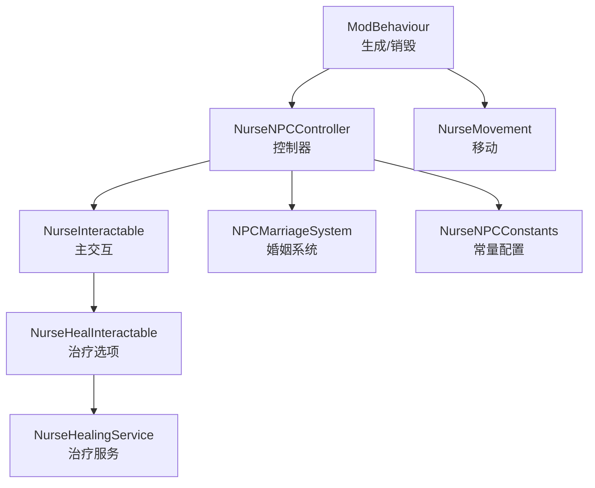
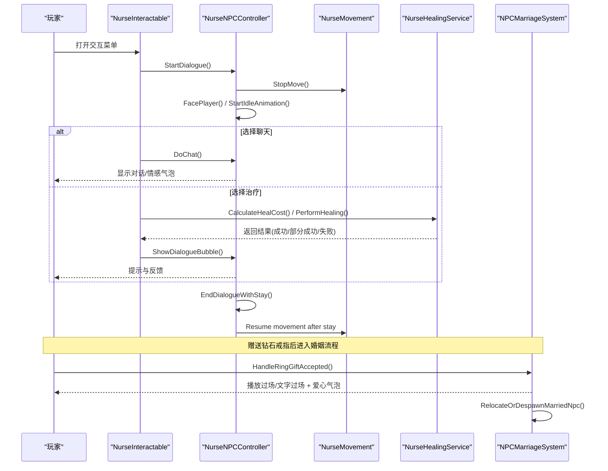
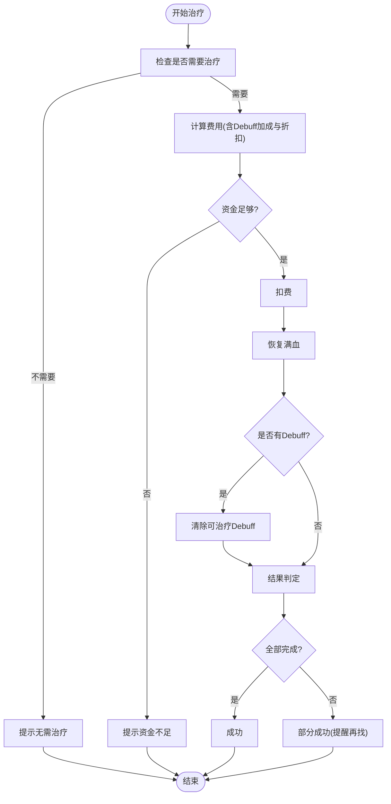
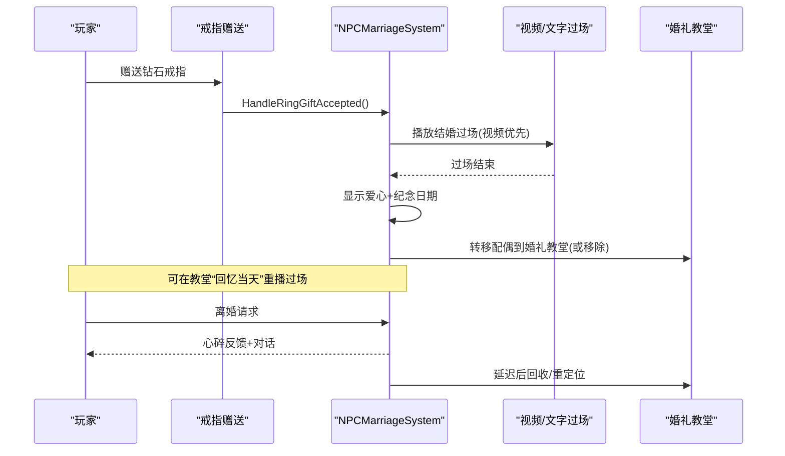
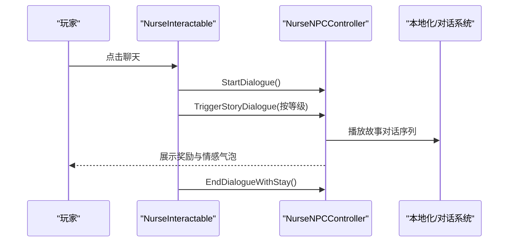
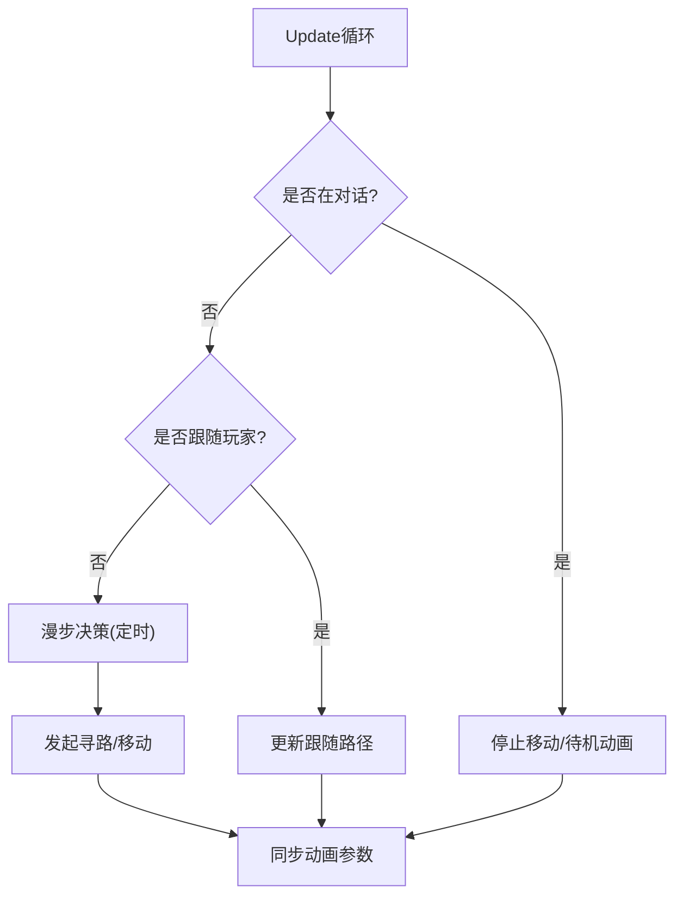
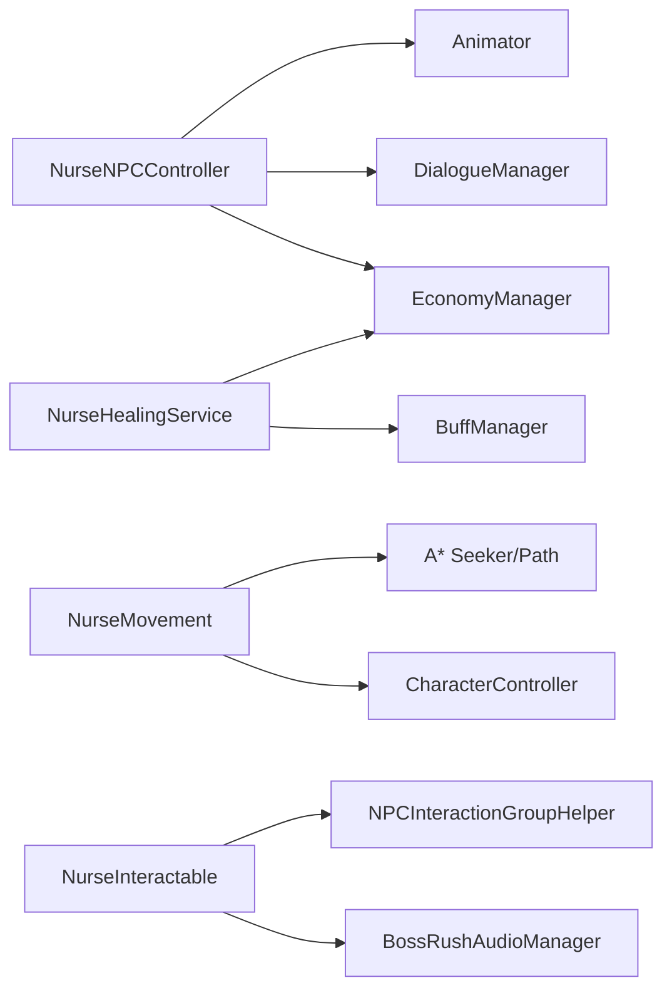

# 羽织（护士）系统

<cite>
**本文引用的文件**
- [NurseNPC.cs](file://Integration/NPCs/Nurse/NurseNPC.cs)
- [NurseNPCController.cs](file://Integration/NPCs/Nurse/NurseNPCController.cs)
- [NurseMovement.cs](file://Integration/NPCs/Nurse/NurseMovement.cs)
- [NurseInteractable.cs](file://Integration/NPCs/Nurse/NurseInteractable.cs)
- [NurseHealInteractable.cs](file://Integration/NPCs/Nurse/NurseHealInteractable.cs)
- [NurseHealingService.cs](file://Integration/NPCs/Nurse/NurseHealingService.cs)
- [NPCMarriageSystem.cs](file://Integration/Wedding/NPCMarriageSystem.cs)
- [NurseNPCConstants.cs](file://Integration/Constants/NurseNPCConstants.cs)
</cite>

## 目录
1. [简介](#简介)
2. [项目结构](#项目结构)
3. [核心组件](#核心组件)
4. [架构总览](#架构总览)
5. [详细组件分析](#详细组件分析)
6. [依赖关系分析](#依赖关系分析)
7. [性能与稳定性](#性能与稳定性)
8. [故障排查指南](#故障排查指南)
9. [结论](#结论)
10. [附录：玩家攻略与常见问题](#附录玩家攻略与常见问题)

## 简介
本模块为“羽织（护士）”NPC提供完整的服务能力，包括：
- 治疗服务：回血、清除可治疗负面状态、费用计算与折扣、资金校验与退款。
- 婚姻关系系统：求婚流程、婚姻状态管理、婚礼教堂转移、离婚处理与反馈。
- 互动系统：日常对话、故事对话触发、情感气泡表达、特殊事件奖励。
- 移动与AI：漫步寻路、跟随玩家、面向玩家、名字标签与动画控制。
- 玩家策略：好感度提升方法、婚姻触发条件、互动示例与问题解决方案。

## 项目结构
羽织（护士）系统由多个职责清晰的脚本组成，围绕生成、控制器、交互、治疗服务、移动与常量配置展开：
- 生成与生命周期：负责加载资源、选择刷新点、实例化与销毁。
- 控制器：管理动画、面向玩家、对话、故事对话、奖励发放。
- 交互：聊天、治疗选项、婚姻相关子选项的可见性与执行。
- 治疗服务：费用计算、Debuff识别、执行治疗与退款。
- 移动：A*寻路、漫步、跟随、重力与动画同步。
- 常量：距离阈值、停留时间、气泡间隔等可调参数。

**图表来源**
- [NurseNPC.cs:123-241](file://Integration/NPCs/Nurse/NurseNPC.cs#L123-L241)
- [NurseNPCController.cs:120-197](file://Integration/NPCs/Nurse/NurseNPCController.cs#L120-L197)
- [NurseMovement.cs:85-126](file://Integration/NPCs/Nurse/NurseMovement.cs#L85-L126)
- [NurseInteractable.cs:20-99](file://Integration/NPCs/Nurse/NurseInteractable.cs#L20-L99)
- [NurseHealInteractable.cs:27-72](file://Integration/NPCs/Nurse/NurseHealInteractable.cs#L27-L72)
- [NurseHealingService.cs:27-43](file://Integration/NPCs/Nurse/NurseHealingService.cs#L27-L43)
- [NPCMarriageSystem.cs:27-53](file://Integration/Wedding/NPCMarriageSystem.cs#L27-L53)
- [NurseNPCConstants.cs:14-80](file://Integration/Constants/NurseNPCConstants.cs#L14-L80)

**章节来源**
- [NurseNPC.cs:123-241](file://Integration/NPCs/Nurse/NurseNPC.cs#L123-L241)
- [NurseNPCController.cs:120-197](file://Integration/NPCs/Nurse/NurseNPCController.cs#L120-L197)
- [NurseMovement.cs:85-126](file://Integration/NPCs/Nurse/NurseMovement.cs#L85-L126)
- [NurseInteractable.cs:20-99](file://Integration/NPCs/Nurse/NurseInteractable.cs#L20-L99)
- [NurseHealInteractable.cs:27-72](file://Integration/NPCs/Nurse/NurseHealInteractable.cs#L27-L72)
- [NurseHealingService.cs:27-43](file://Integration/NPCs/Nurse/NurseHealingService.cs#L27-L43)
- [NPCMarriageSystem.cs:27-53](file://Integration/Wedding/NPCMarriageSystem.cs#L27-L53)
- [NurseNPCConstants.cs:14-80](file://Integration/Constants/NurseNPCConstants.cs#L14-L80)

## 核心组件
- 生成器（ModBehaviour 中的护士部分）：负责从资源包加载模型、选择刷新点、实例化并挂载控制器与移动组件，支持站桩模式（婚礼教堂）。
- 控制器（NurseNPCController）：管理动画参数、面向玩家、名字标签、对话Actor、故事对话触发、奖励发放与对话结束后的停留恢复。
- 交互（NurseInteractable / NurseHealInteractable）：组织聊天、治疗、婚姻子选项；动态更新治疗选项名称与可用性；处理对话开始/结束。
- 治疗服务（NurseHealingService）：计算费用、检查需求、执行治疗、清除Debuff、资金扣费与退款。
- 移动（NurseMovement）：基于A*寻路的漫步与跟随，重力模拟，动画速度同步。
- 常量（NurseNPCConstants）：集中管理距离阈值、停留时间、气泡间隔等关键数值。

**章节来源**
- [NurseNPC.cs:123-241](file://Integration/NPCs/Nurse/NurseNPC.cs#L123-L241)
- [NurseNPCController.cs:120-197](file://Integration/NPCs/Nurse/NurseNPCController.cs#L120-L197)
- [NurseInteractable.cs:20-99](file://Integration/NPCs/Nurse/NurseInteractable.cs#L20-L99)
- [NurseHealInteractable.cs:27-72](file://Integration/NPCs/Nurse/NurseHealInteractable.cs#L27-L72)
- [NurseHealingService.cs:27-43](file://Integration/NPCs/Nurse/NurseHealingService.cs#L27-L43)
- [NurseMovement.cs:85-126](file://Integration/NPCs/Nurse/NurseMovement.cs#L85-L126)
- [NurseNPCConstants.cs:14-80](file://Integration/Constants/NurseNPCConstants.cs#L14-L80)

## 架构总览
下图展示了羽织系统的整体交互流：玩家通过交互菜单与聊天或治疗选项互动；控制器协调动画与对话；治疗服务完成费用计算与治疗效果；移动组件负责行为表现；婚姻系统处理求婚与后续场景转移。

**图表来源**
- [NurseInteractable.cs:211-332](file://Integration/NPCs/Nurse/NurseInteractable.cs#L211-L332)
- [NurseNPCController.cs:758-800](file://Integration/NPCs/Nurse/NurseNPCController.cs#L758-L800)
- [NurseHealInteractable.cs:194-321](file://Integration/NPCs/Nurse/NurseHealInteractable.cs#L194-L321)
- [NurseHealingService.cs:504-628](file://Integration/NPCs/Nurse/NurseHealingService.cs#L504-L628)
- [NPCMarriageSystem.cs:40-53](file://Integration/Wedding/NPCMarriageSystem.cs#L40-L53)
- [NPCMarriageSystem.cs:182-224](file://Integration/Wedding/NPCMarriageSystem.cs#L182-L224)

## 详细组件分析

### 治疗服务实现机制
- 费用计算：
  - 基础费用 = 缺失血量 × 玩家等级 × 10。
  - 若存在可治疗Debuff，额外增加 玩家等级 × 50。
  - 最终费用应用当前好感度折扣，最低不低于1。
- 资源消耗：
  - 使用经济系统统一扣费，支持账户余额与现金合计。
  - 在特定模式下支持净化点数支付与退款。
- 治疗效果：
  - 将玩家生命值恢复到上限。
  - 清除明确允许治疗的负面状态（按ID白名单），避免误删增益。
- 冷却与状态：
  - Debuff检测有短时缓存（约0.2秒），减少频繁扫描开销。
  - UI端每2秒刷新一次治疗选项名称与可用性。
- 异常与退款：
  - 若扣费后玩家上下文变化、回血未生效或Debuff未清除干净，自动尝试退款。
  - 提供“部分成功”状态用于UI提示尚未完全治愈。

**图表来源**
- [NurseHealingService.cs:361-425](file://Integration/NPCs/Nurse/NurseHealingService.cs#L361-L425)
- [NurseHealingService.cs:504-628](file://Integration/NPCs/Nurse/NurseHealingService.cs#L504-L628)
- [NurseHealInteractable.cs:152-192](file://Integration/NPCs/Nurse/NurseHealInteractable.cs#L152-L192)

**章节来源**
- [NurseHealingService.cs:361-425](file://Integration/NPCs/Nurse/NurseHealingService.cs#L361-L425)
- [NurseHealingService.cs:504-628](file://Integration/NPCs/Nurse/NurseHealingService.cs#L504-L628)
- [NurseHealInteractable.cs:152-192](file://Integration/NPCs/Nurse/NurseHealInteractable.cs#L152-L192)

### 婚姻关系系统（NPCMarriageSystem）
- 求婚流程：
  - 赠送钻石戒指成功后，记录配偶状态并播放结婚过场（视频优先，缺失则回退双语文字过场）。
  - 过场结束后显示爱心气泡与纪念日期，延迟后将配偶转移到婚礼教堂；若无教堂则移除该NPC。
- 婚姻状态管理：
  - 已婚状态下普通地图不再刷新该NPC（仅婚礼教堂强制生成）。
  - 可在婚礼教堂进行“回忆当天”重播过场。
- 离婚处理：
  - 解除关系、重置好感度、心碎反馈与对话，延迟后执行NPC回收/重定位。
- 相关奖励：
  - 每日聊天时已婚可获得安神滴剂（掉落或入背包）。

**图表来源**
- [NPCMarriageSystem.cs:40-53](file://Integration/Wedding/NPCMarriageSystem.cs#L40-L53)
- [NPCMarriageSystem.cs:182-224](file://Integration/Wedding/NPCMarriageSystem.cs#L182-L224)
- [NPCMarriageSystem.cs:530-565](file://Integration/Wedding/NPCMarriageSystem.cs#L530-L565)
- [NPCMarriageSystem.cs:607-655](file://Integration/Wedding/NPCMarriageSystem.cs#L607-L655)

**章节来源**
- [NPCMarriageSystem.cs:40-53](file://Integration/Wedding/NPCMarriageSystem.cs#L40-L53)
- [NPCMarriageSystem.cs:182-224](file://Integration/Wedding/NPCMarriageSystem.cs#L182-L224)
- [NPCMarriageSystem.cs:530-565](file://Integration/Wedding/NPCMarriageSystem.cs#L530-L565)
- [NPCMarriageSystem.cs:607-655](file://Integration/Wedding/NPCMarriageSystem.cs#L607-L655)

### 羽织的互动系统
- 日常对话：
  - 聊天选项会尝试触发故事对话（等级3/5/8/10），完成后给予物品奖励（如安神滴剂、平安护身符）。
  - 每日聊天可提升好感度，已婚时额外获得安神滴剂。
- 情感表达：
  - 控制器支持爱心气泡、心碎气泡、闲置气泡等，配合动画与名字标签增强表现。
- 特殊事件：
  - 故事对话解锁剧情与奖励；结婚过场提供沉浸式体验；离婚提供情感反馈。

**图表来源**
- [NurseInteractable.cs:246-332](file://Integration/NPCs/Nurse/NurseInteractable.cs#L246-L332)
- [NurseNPCController.cs:397-581](file://Integration/NPCs/Nurse/NurseNPCController.cs#L397-L581)

**章节来源**
- [NurseInteractable.cs:246-332](file://Integration/NPCs/Nurse/NurseInteractable.cs#L246-L332)
- [NurseNPCController.cs:397-581](file://Integration/NPCs/Nurse/NurseNPCController.cs#L397-L581)

### 移动行为、AI逻辑与场景交互
- 移动与寻路：
  - 使用A* Pathfinding Seeker进行路径计算，支持漫步与跟随玩家。
  - 目标点来自共享刷新点配置，随机选择并修正高度。
- AI逻辑：
  - 当玩家靠近时面向玩家；对话期间停止移动并播放待机动画。
  - 闲置时周期性选择新目标点进行漫步。
- 场景交互：
  - 名字标签注册原版健康条名称；动画参数缓存以提升性能。
  - 支持站桩模式（婚礼教堂中已婚NPC不移动）。

**图表来源**
- [NurseMovement.cs:97-126](file://Integration/NPCs/Nurse/NurseMovement.cs#L97-L126)
- [NurseMovement.cs:168-186](file://Integration/NPCs/Nurse/NurseMovement.cs#L168-L186)
- [NurseMovement.cs:189-283](file://Integration/NPCs/Nurse/NurseMovement.cs#L189-L283)
- [NurseMovement.cs:427-455](file://Integration/NPCs/Nurse/NurseMovement.cs#L427-L455)

**章节来源**
- [NurseMovement.cs:97-126](file://Integration/NPCs/Nurse/NurseMovement.cs#L97-L126)
- [NurseMovement.cs:168-186](file://Integration/NPCs/Nurse/NurseMovement.cs#L168-L186)
- [NurseMovement.cs:189-283](file://Integration/NPCs/Nurse/NurseMovement.cs#L189-L283)
- [NurseMovement.cs:427-455](file://Integration/NPCs/Nurse/NurseMovement.cs#L427-L455)

## 依赖关系分析
- 控制器依赖：
  - 动画系统（Animator）、对话系统（DialogueActorFactory/DialogueManager）、经济系统（EconomyManager）、本地化（L10n）。
- 治疗服务依赖：
  - 玩家健康与Buff系统（CharacterMainControl/BuffManager）、经济系统、亲和度管理（AffinityManager）。
- 移动依赖：
  - A* Pathfinding（Seeker/Path）、物理组件（CharacterController）、路径辅助工具（NPCPathingHelper）。
- 交互依赖：
  - 交互组工具（NPCInteractionGroupHelper）、音频管理器（BossRushAudioManager）、本地化注入（LocalizationHelper）。

**图表来源**
- [NurseNPCController.cs:120-197](file://Integration/NPCs/Nurse/NurseNPCController.cs#L120-L197)
- [NurseHealingService.cs:173-184](file://Integration/NPCs/Nurse/NurseHealingService.cs#L173-L184)
- [NurseMovement.cs:128-166](file://Integration/NPCs/Nurse/NurseMovement.cs#L128-L166)
- [NurseInteractable.cs:20-99](file://Integration/NPCs/Nurse/NurseInteractable.cs#L20-L99)

**章节来源**
- [NurseNPCController.cs:120-197](file://Integration/NPCs/Nurse/NurseNPCController.cs#L120-L197)
- [NurseHealingService.cs:173-184](file://Integration/NPCs/Nurse/NurseHealingService.cs#L173-L184)
- [NurseMovement.cs:128-166](file://Integration/NPCs/Nurse/NurseMovement.cs#L128-L166)
- [NurseInteractable.cs:20-99](file://Integration/NPCs/Nurse/NurseInteractable.cs#L20-L99)

## 性能与稳定性
- 动画参数缓存：控制器与移动组件在启动时缓存Animator参数，避免每帧反射查找。
- 玩家引用节流：控制器定期刷新玩家Transform，降低每帧查找成本。
- Debuff缓存：治疗服务对Debuff检测进行短时缓存，减少高频扫描。
- 路径计算优化：移动组件在对话或等待路径时停止移动，避免无效计算。
- 异常保护：多处使用异常捕获与日志记录，确保错误不影响主流程。

[本节为通用性能建议，不直接分析具体文件]

## 故障排查指南
- 无法生成护士：
  - 检查资源包加载是否成功、场景是否配置刷新点、其他NPC位置避让是否导致无有效位置。
- 治疗选项不可用或名称不更新：
  - 确认EXP变化与Buff事件已正确订阅；检查经济系统与玩家上下文是否可用。
- 故事对话未触发：
  - 检查玩家距离、UI状态、等级阈值与故事标记；查看重试间隔与日志。
- 婚姻过场异常：
  - 确认视频文件是否存在；若缺失则回退文字过场；检查输入锁定与资源释放。
- 移动卡住或悬空：
  - 检查CharacterController尺寸与重力；确认A*寻路是否激活与路径是否有效。

**章节来源**
- [NurseNPC.cs:144-180](file://Integration/NPCs/Nurse/NurseNPC.cs#L144-L180)
- [NurseHealInteractable.cs:91-150](file://Integration/NPCs/Nurse/NurseHealInteractable.cs#L91-L150)
- [NurseNPCController.cs:397-449](file://Integration/NPCs/Nurse/NurseNPCController.cs#L397-L449)
- [NPCMarriageSystem.cs:234-418](file://Integration/Wedding/NPCMarriageSystem.cs#L234-L418)
- [NurseMovement.cs:128-166](file://Integration/NPCs/Nurse/NurseMovement.cs#L128-L166)

## 结论
羽织（护士）系统以清晰的分层与模块化设计，提供了稳定的治疗服务、丰富的互动体验与完整的婚姻关系流程。通过常量配置与缓存优化，系统在易用性与性能之间取得平衡。玩家可通过日常聊天、送礼与婚姻建立深度关系，享受专属服务与奖励。

[本节为总结性内容，不直接分析具体文件]

## 附录：玩家攻略与常见问题
- 好感度提升方法：
  - 每日聊天（+30）、赠送喜欢的礼物（+80）、中性礼物（+20）、钻石戒指（+500）、生日蛋糕（+150）。
  - 注意每日衰减：跳过一天未聊天或未送礼将减少好感度。
- 婚姻触发条件：
  - 达到最高等级、建造并放置婚礼教堂、手持钻石戒指进行赠送。
- 互动示例：
  - 聊天触发故事对话，获得物品奖励；治疗选项根据状态动态显示费用；婚后每日聊天获得安神滴剂。
- 常见问题：
  - 治疗费用过高：提升好感度以获得折扣；先清除Debuff可降低费用。
  - 背包已满：奖励会掉落在羽织脚边，拾取即可。
  - 故事对话未出现：确保在3米内且无UI遮挡，达到对应等级。

[本节为概念性指导，不直接分析具体文件]