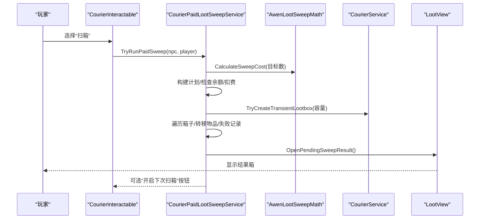
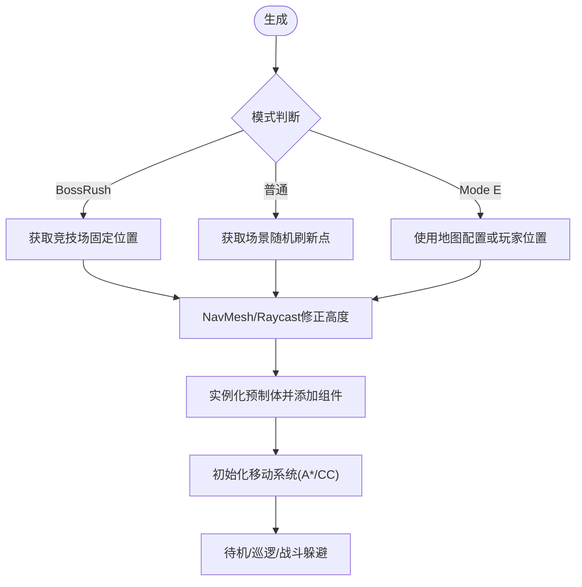
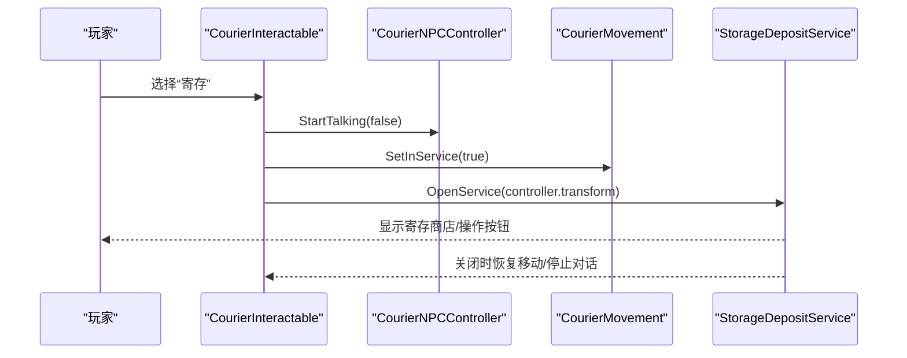
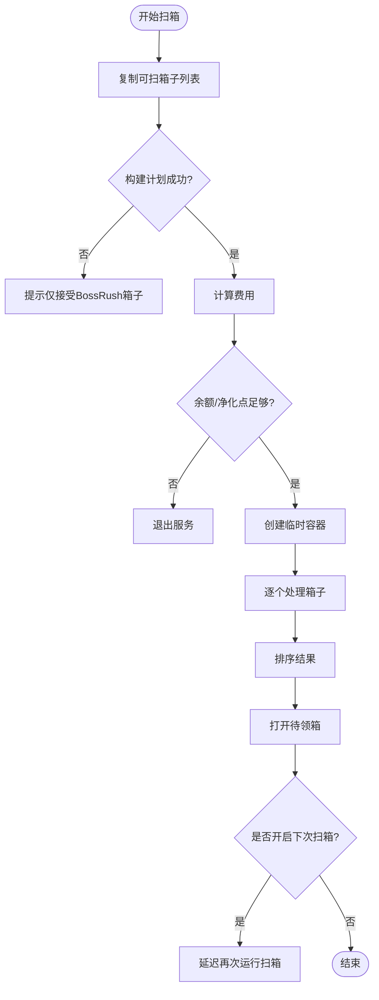
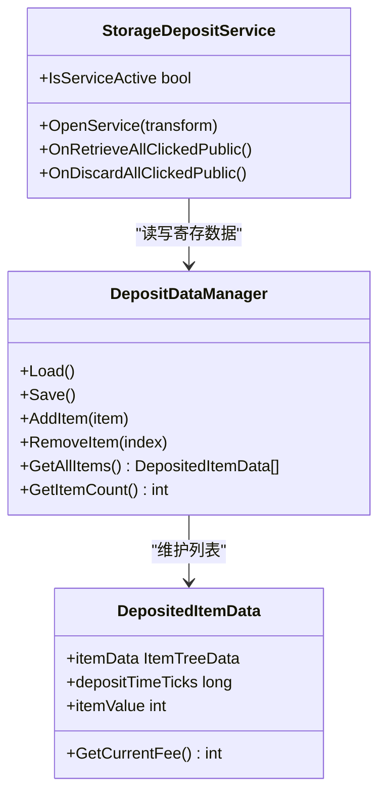
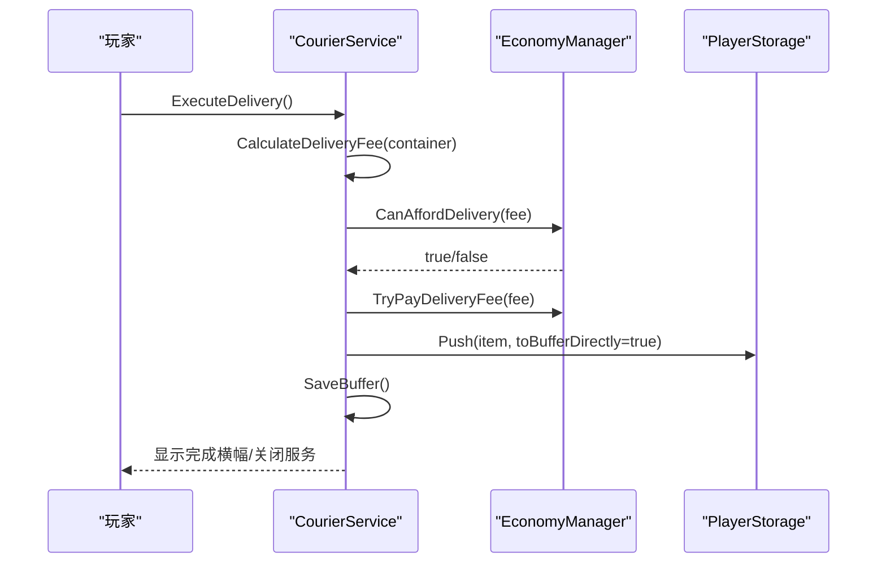
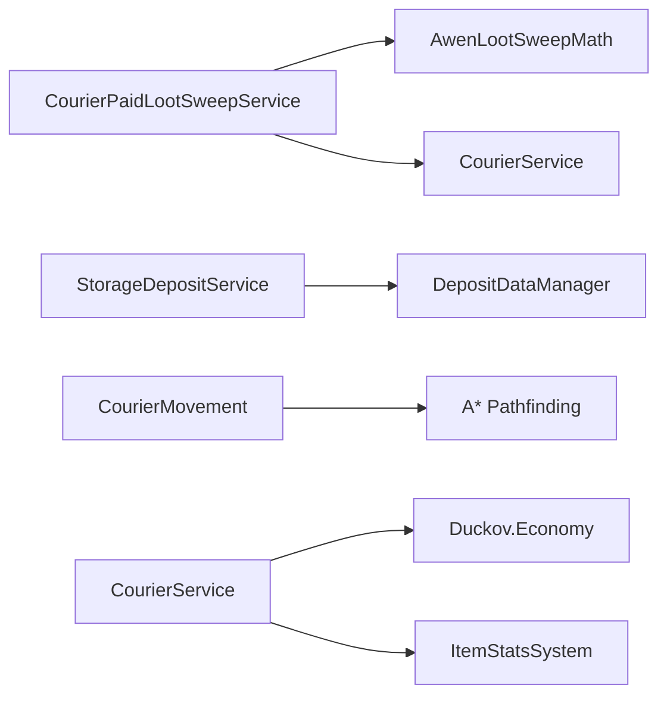

# 阿稳（快递员）系统

<cite>
**本文引用的文件**
- [CourierNPC.cs](file://Integration/NPCs/Courier/CourierNPC.cs)
- [CourierMovement.cs](file://Integration/NPCs/Courier/CourierMovement.cs)
- [CourierInteractables.cs](file://Integration/NPCs/Courier/CourierInteractables.cs)
- [CourierPaidLootSweepService.cs](file://Integration/NPCs/Courier/CourierPaidLootSweepService.cs)
- [AwenLootSweepMath.cs](file://Utilities/AwenLootSweepMath.cs)
- [StorageDepositService.cs](file://Integration/NPCs/Courier/StorageDepositService.cs)
- [DepositDataManager.cs](file://Integration/NPCs/Courier/DepositDataManager.cs)
- [CourierService.cs](file://Integration/NPCs/Courier/CourierService.cs)
- [AwenLootSweepTokenConfig.cs](file://Integration/Items/AwenLootSweepTokenConfig.cs)
- [AwenDepositTokenConfig.cs](file://Integration/Items/AwenDepositTokenConfig.cs)
</cite>

## 目录
1. [简介](#简介)
2. [项目结构](#项目结构)
3. [核心组件](#核心组件)
4. [架构总览](#架构总览)
5. [详细组件分析](#详细组件分析)
6. [依赖关系分析](#依赖关系分析)
7. [性能考量](#性能考量)
8. [故障排除指南](#故障排除指南)
9. [结论](#结论)
10. [附录：使用示例与最佳实践](#附录使用示例与最佳实践)

## 简介
本文件为“阿稳（快递员）NPC”系统的完整技术文档，覆盖以下主题：
- 引导与交互：阿稳的生成、移动行为、对话与交互协议。
- 付费扫箱服务（CourierPaidLootSweepService）：扫描逻辑、费用计算、物品处理与结果暂存。
- 存储寄存系统（StorageDepositService）：寄存、提取、批量操作与数据持久化。
- 快递服务（CourierService）：容器UI、费用计算、发送仓库与UI集成。
- 令牌与商店集成：扫箱令与快递牌的配置与注入。
- 最佳实践与排错：如何高效利用阿稳的服务，以及常见问题定位方法。

## 项目结构
阿稳系统围绕“NPC实例 + 交互入口 + 服务模块 + 数据管理”组织：
- NPC 实例与生命周期：负责加载资源、生成位置、状态通知与销毁。
- 交互入口：主交互与子选项（扫箱、寄存、快递服务）。
- 服务模块：付费扫箱、寄存、快递三大服务。
- 数据管理：寄存数据的持久化与恢复。
- 令牌与商店：扫箱令与快递牌作为快捷道具，支持商店注入。

```mermaid
graph TB
A["ModBehaviour<br/>生成/销毁/状态通知"] --> B["CourierNPCController<br/>对话/状态"]
A --> C["CourierMovement<br/>寻路/待机/战斗行为"]
D["CourierInteractable<br/>主交互"] --> E["CourierPaidLootSweepService<br/>付费扫箱"]
D --> F["StorageDepositService<br/>寄存服务"]
D --> G["CourierServiceOptionInteractable<br/>快递服务入口"]
H["DepositDataManager<br/>寄存数据持久化"] < --> F
I["AwenLootSweepMath<br/>扫箱费用/容量计算"] --> E
J["AwenLootSweepTokenConfig<br/>扫箱令配置"] --> E
K["AwenDepositTokenConfig<br/>快递牌配置"] --> G
```

图表来源
- [CourierNPC.cs:117-275](file://Integration/NPCs/Courier/CourierNPC.cs#L117-L275)
- [CourierMovement.cs:232-337](file://Integration/NPCs/Courier/CourierMovement.cs#L232-L337)
- [CourierInteractables.cs:22-95](file://Integration/NPCs/Courier/CourierInteractables.cs#L22-L95)
- [CourierPaidLootSweepService.cs:119-183](file://Integration/NPCs/Courier/CourierPaidLootSweepService.cs#L119-L183)
- [StorageDepositService.cs:84-158](file://Integration/NPCs/Courier/StorageDepositService.cs#L84-L158)
- [DepositDataManager.cs:64-117](file://Integration/NPCs/Courier/DepositDataManager.cs#L64-L117)
- [AwenLootSweepMath.cs:5-32](file://Utilities/AwenLootSweepMath.cs#L5-L32)
- [AwenLootSweepTokenConfig.cs:14-27](file://Integration/Items/AwenLootSweepTokenConfig.cs#L14-L27)
- [AwenDepositTokenConfig.cs:14-33](file://Integration/Items/AwenDepositTokenConfig.cs#L14-L33)

章节来源
- [CourierNPC.cs:117-275](file://Integration/NPCs/Courier/CourierNPC.cs#L117-L275)
- [CourierMovement.cs:232-337](file://Integration/NPCs/Courier/CourierMovement.cs#L232-L337)
- [CourierInteractables.cs:22-95](file://Integration/NPCs/Courier/CourierInteractables.cs#L22-L95)

## 核心组件
- 阿稳NPC实例与控制器：负责资源加载、生成位置修正、模式判断（BossRush/普通/Mode E）、状态广播（Boss战开始/结束/通关/无Boss）。
- 移动系统：基于A* Seeker与CharacterController实现寻路、待机、战斗躲避、固定模式（Mode E原地不动）。
- 交互系统：主交互“扫箱”，子选项“寄存”和“快递服务”。
- 付费扫箱服务：收集可扫箱子、计算费用、创建临时容器、逐个处理箱子、排序并打开结果箱，支持“开启下次扫箱”。
- 寄存服务：动态商店条目、一键存入、全部取出/丢弃、批量操作、费用计算与支付。
- 快递服务：临时容器+官方LootView、费用计算（物品价值10%）、发送到玩家仓库缓冲、告别气泡。
- 令牌与商店：扫箱令与快递牌配置与本地化，基地商店注入。

章节来源
- [CourierNPC.cs:117-275](file://Integration/NPCs/Courier/CourierNPC.cs#L117-L275)
- [CourierMovement.cs:459-655](file://Integration/NPCs/Courier/CourierMovement.cs#L459-L655)
- [CourierInteractables.cs:97-230](file://Integration/NPCs/Courier/CourierInteractables.cs#L97-L230)
- [CourierPaidLootSweepService.cs:119-183](file://Integration/NPCs/Courier/CourierPaidLootSweepService.cs#L119-L183)
- [StorageDepositService.cs:84-158](file://Integration/NPCs/Courier/StorageDepositService.cs#L84-L158)
- [CourierService.cs:242-339](file://Integration/NPCs/Courier/CourierService.cs#L242-L339)
- [AwenLootSweepTokenConfig.cs:14-27](file://Integration/Items/AwenLootSweepTokenConfig.cs#L14-L27)
- [AwenDepositTokenConfig.cs:14-33](file://Integration/Items/AwenDepositTokenConfig.cs#L14-L33)

## 架构总览
阿稳系统以“交互驱动服务”的方式工作：玩家与阿稳交互后，进入对应服务流程；服务过程中可能创建临时容器或打开官方LootView；完成后进行结算、返还或持久化。



图表来源
- [CourierInteractables.cs:173-221](file://Integration/NPCs/Courier/CourierInteractables.cs#L173-L221)
- [CourierPaidLootSweepService.cs:119-183](file://Integration/NPCs/Courier/CourierPaidLootSweepService.cs#L119-L183)
- [AwenLootSweepMath.cs:11-19](file://Utilities/AwenLootSweepMath.cs#L11-L19)
- [CourierService.cs:137-211](file://Integration/NPCs/Courier/CourierService.cs#L137-L211)

## 详细组件分析

### 阿稳NPC与移动行为
- 生成与位置修正：根据模式（BossRush/普通/Mode E）选择刷新点，优先NavMesh采样，回退Raycast修正高度。
- 移动控制：使用Seeker与CharacterController，支持行走/奔跑、待机动画、Boss战躲避、固定模式（Mode E不移动）。
- 状态通知：Boss战开始/结束、通关、无Boss等事件会同步到控制器与移动组件。



图表来源
- [CourierNPC.cs:117-275](file://Integration/NPCs/Courier/CourierNPC.cs#L117-L275)
- [CourierMovement.cs:232-337](file://Integration/NPCs/Courier/CourierMovement.cs#L232-L337)
- [CourierMovement.cs:459-655](file://Integration/NPCs/Courier/CourierMovement.cs#L459-L655)

章节来源
- [CourierNPC.cs:117-275](file://Integration/NPCs/Courier/CourierNPC.cs#L117-L275)
- [CourierMovement.cs:232-337](file://Integration/NPCs/Courier/CourierMovement.cs#L232-L337)
- [CourierMovement.cs:459-655](file://Integration/NPCs/Courier/CourierMovement.cs#L459-L655)

### 交互协议与对话系统
- 主交互：“扫箱”直接触发付费扫箱流程。
- 子选项：
  - “寄存”：打开寄存服务，使用StockShop动态条目展示寄存物品。
  - “快递服务”：打开快递容器UI，支持一键存入/取回/发送。
- 对话与动画：通过CourierNPCController控制对话状态，移动组件在服务期间停止移动。



图表来源
- [CourierInteractables.cs:72-95](file://Integration/NPCs/Courier/CourierInteractables.cs#L72-L95)
- [StorageDepositService.cs:84-158](file://Integration/NPCs/Courier/StorageDepositService.cs#L84-L158)

章节来源
- [CourierInteractables.cs:22-95](file://Integration/NPCs/Courier/CourierInteractables.cs#L22-L95)
- [CourierInteractables.cs:97-230](file://Integration/NPCs/Courier/CourierInteractables.cs#L97-L230)

### 付费扫箱服务（CourierPaidLootSweepService）
- 目标收集：从Mod行为中复制当前局快照的可扫箱子列表。
- 费用计算：按箱子数量×单价（AwenLootSweepMath.CalculateSweepCost）。
- 执行流程：
  - 创建临时容器（容量由可转移根物品数决定）。
  - 逐个处理箱子，成功计数与失败标记。
  - 排序结果并打开待领箱，提供“开启下次扫箱”按钮。
- 异常与退款：若失败且未处理任何箱子则尝试退款；部分失败提示查看结果箱。



图表来源
- [CourierPaidLootSweepService.cs:119-183](file://Integration/NPCs/Courier/CourierPaidLootSweepService.cs#L119-L183)
- [CourierPaidLootSweepService.cs:185-312](file://Integration/NPCs/Courier/CourierPaidLootSweepService.cs#L185-L312)
- [AwenLootSweepMath.cs:11-19](file://Utilities/AwenLootSweepMath.cs#L11-L19)

章节来源
- [CourierPaidLootSweepService.cs:119-183](file://Integration/NPCs/Courier/CourierPaidLootSweepService.cs#L119-L183)
- [CourierPaidLootSweepService.cs:185-312](file://Integration/NPCs/Courier/CourierPaidLootSweepService.cs#L185-L312)
- [CourierPaidLootSweepService.cs:314-449](file://Integration/NPCs/Courier/CourierPaidLootSweepService.cs#L314-L449)
- [AwenLootSweepMath.cs:11-19](file://Utilities/AwenLootSweepMath.cs#L11-L19)

### 存储寄存系统（StorageDepositService）
- 商店集成：使用StockShop动态条目展示寄存物品，支持“全部取出”“全部丢弃”链接点击。
- 快速寄存：在玩家背包侧提供一键寄存按钮。
- 费用计算：基于物品原始价值与存放时长（每分钟递增费率），支持批量操作。
- 数据持久化：通过DepositDataManager将物品、时间、价值三列表原子提交，含备份槽与旧格式兼容。



图表来源
- [StorageDepositService.cs:84-158](file://Integration/NPCs/Courier/StorageDepositService.cs#L84-L158)
- [DepositDataManager.cs:28-58](file://Integration/NPCs/Courier/DepositDataManager.cs#L28-L58)
- [DepositDataManager.cs:135-226](file://Integration/NPCs/Courier/DepositDataManager.cs#L135-L226)

章节来源
- [StorageDepositService.cs:84-158](file://Integration/NPCs/Courier/StorageDepositService.cs#L84-L158)
- [DepositDataManager.cs:64-117](file://Integration/NPCs/Courier/DepositDataManager.cs#L64-L117)
- [DepositDataManager.cs:135-226](file://Integration/NPCs/Courier/DepositDataManager.cs#L135-L226)
- [DepositDataManager.cs:232-324](file://Integration/NPCs/Courier/DepositDataManager.cs#L232-L324)

### 快递服务（CourierService）
- 容器与UI：创建临时Inventory与InteractableLootbox，绑定到官方LootView。
- 费用计算：物品总价值的10%，向上取整。
- 发送流程：校验余额/净化点→扣费→逐件Detach并Push到玩家仓库缓冲→保存Buffer→显示横幅→关闭服务并播放告别气泡。
- 一键清包：QuickDeliverItems用于非UI场景的快速寄送。



图表来源
- [CourierService.cs:312-339](file://Integration/NPCs/Courier/CourierService.cs#L312-L339)
- [CourierService.cs:424-494](file://Integration/NPCs/Courier/CourierService.cs#L424-L494)
- [CourierService.cs:593-646](file://Integration/NPCs/Courier/CourierService.cs#L593-L646)

章节来源
- [CourierService.cs:242-339](file://Integration/NPCs/Courier/CourierService.cs#L242-L339)
- [CourierService.cs:424-494](file://Integration/NPCs/Courier/CourierService.cs#L424-L494)
- [CourierService.cs:593-646](file://Integration/NPCs/Courier/CourierService.cs#L593-L646)

### 令牌与商店集成
- 扫箱令（AwenLootSweepTokenConfig）：描述与使用说明，注册配置器与本地化，运行时回退机制确保可用。
- 快递牌（AwenDepositTokenConfig）：基地免费、其他地方按快递费收费；支持商店注入与本地化。

章节来源
- [AwenLootSweepTokenConfig.cs:14-27](file://Integration/Items/AwenLootSweepTokenConfig.cs#L14-L27)
- [AwenLootSweepTokenConfig.cs:79-136](file://Integration/Items/AwenLootSweepTokenConfig.cs#L79-L136)
- [AwenDepositTokenConfig.cs:14-33](file://Integration/Items/AwenDepositTokenConfig.cs#L14-L33)
- [AwenDepositTokenConfig.cs:187-266](file://Integration/Items/AwenDepositTokenConfig.cs#L187-L266)

## 依赖关系分析
- 低耦合高内聚：各服务通过静态类暴露接口，避免强引用；通过ModBehaviour与全局管理器协调。
- 外部依赖：
  - A* Pathfinding（Seeker）用于寻路。
  - Duckov.Economy用于货币/净化点支付。
  - ItemStatsSystem用于物品序列化与价值计算。
  - UI系统（LootView、InventoryDisplay）用于交互反馈。
- 潜在循环依赖：服务之间通过ModBehaviour与全局事件解耦，未发现直接循环引用。



图表来源
- [CourierPaidLootSweepService.cs:119-183](file://Integration/NPCs/Courier/CourierPaidLootSweepService.cs#L119-L183)
- [CourierMovement.cs:232-337](file://Integration/NPCs/Courier/CourierMovement.cs#L232-L337)
- [CourierService.cs:312-339](file://Integration/NPCs/Courier/CourierService.cs#L312-L339)
- [DepositDataManager.cs:135-226](file://Integration/NPCs/Courier/DepositDataManager.cs#L135-L226)

章节来源
- [CourierPaidLootSweepService.cs:119-183](file://Integration/NPCs/Courier/CourierPaidLootSweepService.cs#L119-L183)
- [CourierMovement.cs:232-337](file://Integration/NPCs/Courier/CourierMovement.cs#L232-L337)
- [CourierService.cs:312-339](file://Integration/NPCs/Courier/CourierService.cs#L312-L339)
- [DepositDataManager.cs:135-226](file://Integration/NPCs/Courier/DepositDataManager.cs#L135-L226)

## 性能考量
- 寻路优化：减少路点距离阈值，避免过早跳过；到达终点时设置Arrived并进入待机，减少重复决策。
- 反射缓存：对UI字段与方法的反射结果缓存，避免每帧查找。
- 日志频率：移动中每5秒输出一次位置，降低日志开销。
- 批量操作：寄存与扫箱采用批量处理，减少UI与存档写入次数。
- 内存管理：临时容器与服务结束后及时清理，避免对象泄漏。

[本节为通用指导，无需特定文件来源]

## 故障排除指南
- 扫箱不可用：
  - 检查当前模式是否允许扫箱（CanUseAwenLootSweepInCurrentMode）。
  - 确认存在可扫箱子（CopyFreshAwenLootSweepTargets返回数量>0）。
  - 余额/净化点不足会导致提示并退出服务。
- 寄存服务异常：
  - 检查StockShop条目是否正确注入。
  - 数据加载失败时会尝试从备份槽恢复；若仍失败则初始化空列表。
- 快递服务无法发送：
  - 费用计算正确性（物品价值10%）。
  - 资金检查与支付失败时提示并中止。
  - LootView打开失败时检查反射字段与事件绑定。
- 移动问题：
  - A*图未激活会导致无法寻路；检查AstarPath.active。
  - CharacterController缺失或禁用会影响物理移动。

章节来源
- [CourierInteractables.cs:173-221](file://Integration/NPCs/Courier/CourierInteractables.cs#L173-L221)
- [CourierPaidLootSweepService.cs:119-183](file://Integration/NPCs/Courier/CourierPaidLootSweepService.cs#L119-L183)
- [DepositDataManager.cs:135-183](file://Integration/NPCs/Courier/DepositDataManager.cs#L135-L183)
- [CourierService.cs:312-339](file://Integration/NPCs/Courier/CourierService.cs#L312-L339)
- [CourierMovement.cs:294-312](file://Integration/NPCs/Courier/CourierMovement.cs#L294-L312)

## 结论
阿稳系统通过清晰的职责划分与模块化设计，提供了稳定的扫箱、寄存与快递服务。其交互协议简洁直观，费用计算透明合理，数据持久化可靠。结合令牌与商店集成，玩家可灵活选择快捷方式提升效率。建议在实际使用中关注余额/净化点、模式限制与UI反馈，以获得最佳体验。

[本节为总结，无需特定文件来源]

## 附录：使用示例与最佳实践
- 新手引导流程：
  - 首次进入BossRush或相关模式时，阿稳会在固定或随机位置生成。
  - 与阿稳交互，选择“扫箱”了解付费扫箱功能；选择“寄存”了解寄存与提取。
- 任务提示：
  - Boss战期间阿稳会保持安全距离并偶尔发出鼓励气泡。
  - 通关后阿稳会停止移动并周期性显示胜利气泡。
- 商店集成：
  - 在基地商店可购买“快递牌”，一键将携带物品寄回家（基地免费）。
  - 在其他场景使用快递牌将按正常快递费收费。
- 优化建议：
  - 集中扫箱：一次性选择多个箱子，减少多次交互成本。
  - 批量寄存：使用“全部取出/丢弃”快速管理寄存物品。
  - 注意费用：扫箱按箱子数量计费，快递按物品价值10%计费。
- 常见错误与修复：
  - 扫箱按钮不出现：确认当前模式允许扫箱且有可扫箱子。
  - 寄存数据丢失：检查Global.json备份槽是否恢复成功。
  - 快递发送失败：检查余额/净化点与PlayerStorage缓冲状态。

[本节为通用指导，无需特定文件来源]