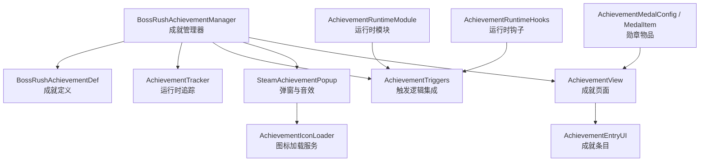
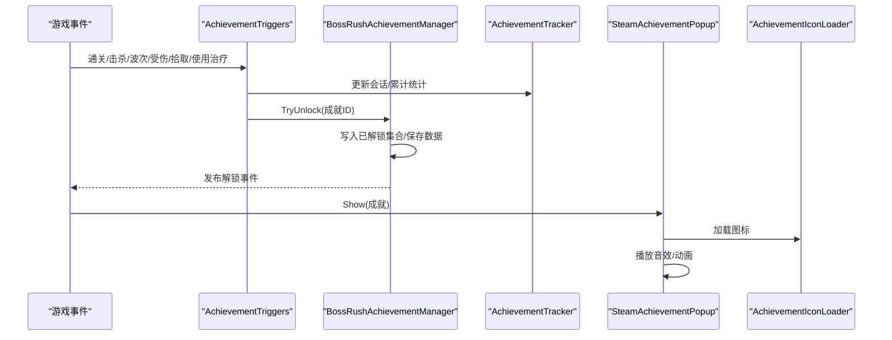
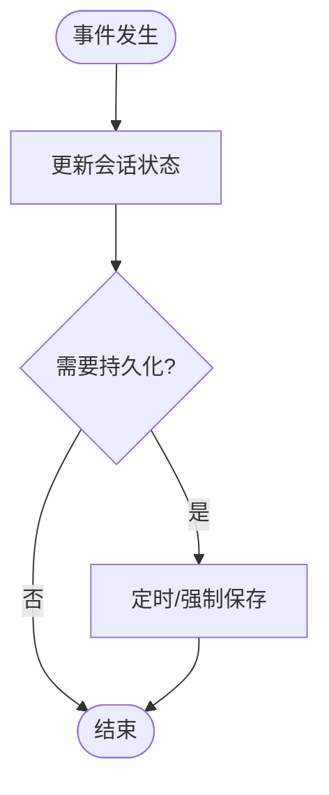
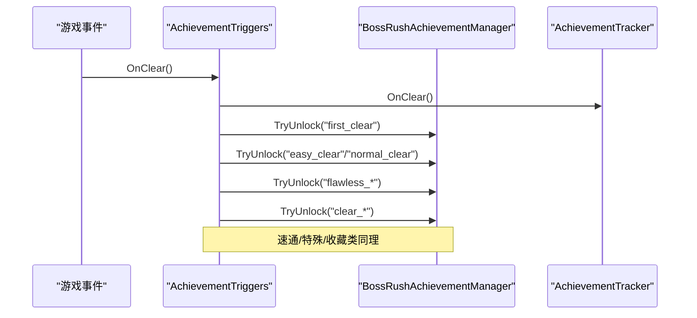
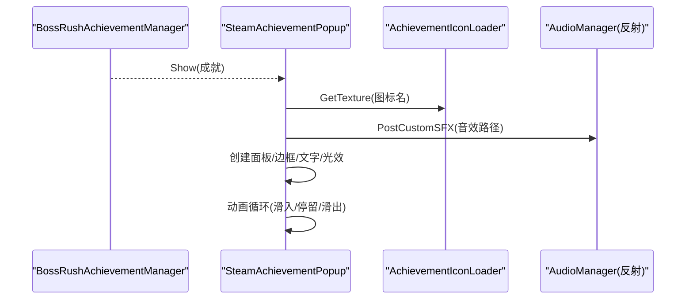
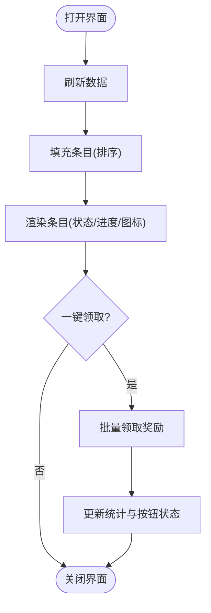
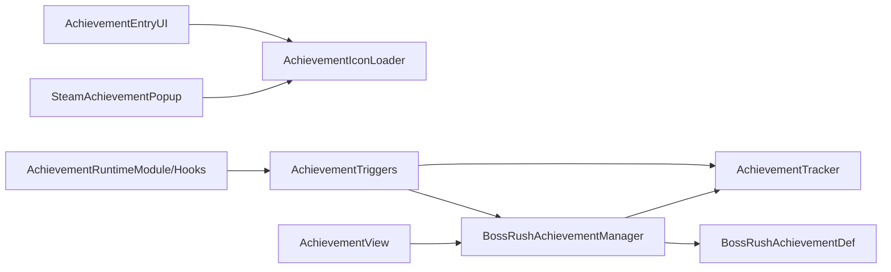

# 成就系统

<cite>
**本文引用的文件**
- [BossRushAchievementManager.cs](file://Achievement/BossRushAchievementManager.cs)
- [BossRushAchievementDef.cs](file://Achievement/BossRushAchievementDef.cs)
- [AchievementTracker.cs](file://Achievement/AchievementTracker.cs)
- [AchievementTriggers.cs](file://Achievement/AchievementTriggers.cs)
- [SteamAchievementPopup.cs](file://Achievement/SteamAchievementPopup.cs)
- [AchievementIconLoader.cs](file://Achievement/AchievementIconLoader.cs)
- [AchievementView.cs](file://Achievement/AchievementView.cs)
- [AchievementEntryUI.cs](file://Achievement/AchievementEntryUI.cs)
- [AchievementRuntimeModule.cs](file://Achievement/AchievementRuntimeModule.cs)
- [AchievementMedalConfig.cs](file://Achievement/AchievementMedalConfig.cs)
- [AchievementMedalItem.cs](file://Achievement/AchievementMedalItem.cs)
- [AchievementRuntimeHooks.cs](file://Achievement/AchievementRuntimeHooks.cs)
- [AchievementUIStrings.cs](file://Achievement/AchievementUIStrings.cs)
</cite>

## 目录
1. [简介](#简介)
2. [项目结构](#项目结构)
3. [核心组件](#核心组件)
4. [架构总览](#架构总览)
5. [详细组件分析](#详细组件分析)
6. [依赖关系分析](#依赖关系分析)
7. [性能与稳定性](#性能与稳定性)
8. [故障排查指南](#故障排查指南)
9. [结论](#结论)
10. [附录：成就解锁指南与隐藏成就提示](#附录：成就解锁指南与隐藏成就提示)

## 简介
本模块为 BossRushMod 的成就系统，提供完整的成就定义、进度追踪、持久化存储、触发器集成、图标加载管理、Steam 风格弹窗与音效反馈，以及玩家可交互的成就界面。系统支持基础完成类、累计统计类、特殊挑战类等成就分类，并通过事件总线与运行时钩子将游戏内行为（通关、击杀、波次、无伤、速通等）映射到成就解锁条件。

## 项目结构
成就系统位于 Achievement 目录下，按职责划分为以下层次：
- 数据与定义：成就定义、奖励、分类
- 运行时状态：会话级与跨会话统计追踪
- 触发与集成：与游戏事件绑定，判定并尝试解锁
- UI 与展示：成就列表、条目、弹窗、本地化
- 资源与音频：图标加载、音效播放
- 入口与生命周期：模块注册、初始化、清理

图表来源
- [BossRushAchievementManager.cs:13-447](file://Achievement/BossRushAchievementManager.cs#L13-L447)
- [BossRushAchievementDef.cs:9-89](file://Achievement/BossRushAchievementDef.cs#L9-L89)
- [AchievementTracker.cs:11-389](file://Achievement/AchievementTracker.cs#L11-L389)
- [AchievementTriggers.cs:11-577](file://Achievement/AchievementTriggers.cs#L11-L577)
- [SteamAchievementPopup.cs:16-622](file://Achievement/SteamAchievementPopup.cs#L16-L622)
- [AchievementIconLoader.cs:14-285](file://Achievement/AchievementIconLoader.cs#L14-L285)
- [AchievementView.cs:19-887](file://Achievement/AchievementView.cs#L19-L887)
- [AchievementEntryUI.cs:18-534](file://Achievement/AchievementEntryUI.cs#L18-L534)
- [AchievementRuntimeModule.cs:1-33](file://Achievement/AchievementRuntimeModule.cs#L1-L33)
- [AchievementRuntimeHooks.cs:6-55](file://Achievement/AchievementRuntimeHooks.cs#L6-L55)
- [AchievementMedalConfig.cs:17-279](file://Achievement/AchievementMedalConfig.cs#L17-L279)
- [AchievementMedalItem.cs:19-206](file://Achievement/AchievementMedalItem.cs#L19-L206)

章节来源
- [BossRushAchievementManager.cs:13-447](file://Achievement/BossRushAchievementManager.cs#L13-L447)
- [AchievementView.cs:19-887](file://Achievement/AchievementView.cs#L19-L887)

## 核心组件
- 成就管理器：集中注册成就定义、维护已解锁与已领取集合、发放奖励、保存/加载数据、查询统计。
- 成就定义：描述成就 ID、名称、描述、分类、难度星级、是否隐藏、奖励内容。
- 运行时追踪：记录本局状态（是否受伤、拾取、使用治疗、击杀特定 Boss、进入时间），持久化累计统计（总击杀、总通关、最高波次、收藏掉落、首次使用图腾/触发逆鳞）。
- 触发器集成：在 BossRush 流程中订阅事件，检查并尝试解锁对应成就（通关、无伤、速通、无间炼狱波次、Boss 击杀、收集类、特殊挑战）。
- Steam 风格弹窗：创建面板、边框、图标、文字、稀有光效动画、多弹窗堆叠、自动滑入滑出、播放解锁音效。
- 图标加载服务：单例 AssetBundle 加载与缓存，Sprite/Texture 获取，统一供弹窗与 UI 使用。
- 成就界面：主视图容器、滚动列表、统计栏、一键领取、本地化文本、排序与显示状态。
- 成就条目：单个成就项的视觉状态（未解锁/隐藏/已解锁未领取/已解锁已领取）、进度显示、按钮交互。
- 运行时模块与钩子：模块生命周期回调、快捷键打开界面、事件订阅与清理。
- 勋章物品：商店注入、库存持久化、右键打开成就界面。

章节来源
- [BossRushAchievementManager.cs:13-447](file://Achievement/BossRushAchievementManager.cs#L13-L447)
- [BossRushAchievementDef.cs:9-89](file://Achievement/BossRushAchievementDef.cs#L9-L89)
- [AchievementTracker.cs:11-389](file://Achievement/AchievementTracker.cs#L11-L389)
- [AchievementTriggers.cs:11-577](file://Achievement/AchievementTriggers.cs#L11-L577)
- [SteamAchievementPopup.cs:16-622](file://Achievement/SteamAchievementPopup.cs#L16-L622)
- [AchievementIconLoader.cs:14-285](file://Achievement/AchievementIconLoader.cs#L14-L285)
- [AchievementView.cs:19-887](file://Achievement/AchievementView.cs#L19-L887)
- [AchievementEntryUI.cs:18-534](file://Achievement/AchievementEntryUI.cs#L18-L534)
- [AchievementRuntimeModule.cs:1-33](file://Achievement/AchievementRuntimeModule.cs#L1-L33)
- [AchievementRuntimeHooks.cs:6-55](file://Achievement/AchievementRuntimeHooks.cs#L6-L55)
- [AchievementMedalConfig.cs:17-279](file://Achievement/AchievementMedalConfig.cs#L17-L279)
- [AchievementMedalItem.cs:19-206](file://Achievement/AchievementMedalItem.cs#L19-L206)

## 架构总览
成就系统采用“定义 + 追踪 + 触发 + 展示”的分层设计：
- 定义层：成就定义与奖励配置，集中注册。
- 追踪层：会话级与跨会话统计，自动存档。
- 触发层：通过事件与运行时钩子捕获游戏行为，计算条件并调用解锁。
- 展示层：Steam 风格弹窗与成就界面，提供可视化反馈与操作。

图表来源
- [AchievementTriggers.cs:150-368](file://Achievement/AchievementTriggers.cs#L150-L368)
- [BossRushAchievementManager.cs:241-349](file://Achievement/BossRushAchievementManager.cs#L241-L349)
- [AchievementTracker.cs:95-164](file://Achievement/AchievementTracker.cs#L95-L164)
- [SteamAchievementPopup.cs:121-150](file://Achievement/SteamAchievementPopup.cs#L121-L150)
- [AchievementIconLoader.cs:37-96](file://Achievement/AchievementIconLoader.cs#L37-L96)

## 详细组件分析

### 成就定义与分类体系
- 分类枚举：基础通关、无伤通关、速通、Boss 击杀、累计击杀、特殊挑战、终极成就。
- 成就定义包含：唯一 ID、中英文名称、描述、图标文件名、分类、奖励（现金/物品）、难度星级、是否隐藏。
- 注册机制：管理器集中注册所有成就，避免分散定义导致遗漏或重复。

```mermaid
classDiagram
class AchievementCategory {
<<enum>>
Basic
Flawless
Speedrun
BossKill
Cumulative
Special
Ultimate
}
class AchievementReward {
+long cashReward
+int[] itemIds
+int[] itemCounts
}
class BossRushAchievementDef {
+string id
+string nameCN
+string nameEN
+string descCN
+string descEN
+string iconFile
+AchievementCategory category
+AchievementReward reward
+bool isHidden
+int difficultyRating
}
AchievementReward <.. BossRushAchievementDef : "拥有"
```

图表来源
- [BossRushAchievementDef.cs:9-89](file://Achievement/BossRushAchievementDef.cs#L9-L89)

章节来源
- [BossRushAchievementDef.cs:9-89](file://Achievement/BossRushAchievementDef.cs#L9-L89)
- [BossRushAchievementManager.cs:65-235](file://Achievement/BossRushAchievementManager.cs#L65-L235)

### 进度追踪与持久化
- 会话级状态：是否受伤、进入时间、是否拾取、是否使用治疗、是否击杀特定 Boss。
- 跨会话统计：累计击杀、累计通关、累计龙王击杀、最高无间炼狱波次、收藏掉落集合、首次使用图腾/触发逆鳞。
- 自动存档：定期保存，避免频繁 IO；强制保存用于退出场景。
- 数据键：使用全局存档键分别保存解锁集合、已领取集合、统计数据与收藏集合。

图表来源
- [AchievementTracker.cs:65-188](file://Achievement/AchievementTracker.cs#L65-L188)
- [AchievementTracker.cs:276-389](file://Achievement/AchievementTracker.cs#L276-L389)

章节来源
- [AchievementTracker.cs:11-389](file://Achievement/AchievementTracker.cs#L11-L389)

### 成就触发器与事件集成
- 通关成就：根据难度与无伤状态解锁基础通关与无伤通关；累计通关达到阈值解锁。
- 速通成就：基于会话耗时判断并解锁不同档位。
- 无间炼狱：记录最高波次，并在达到阈值时解锁相应成就；同时检测无治疗与无伤条件。
- Boss 击杀：识别 Boss 类型，记录累计击杀与特定 Boss 击杀；支持去重避免重复计数。
- 特殊挑战：如不使用治疗物品完成若干波、极短时间通关等。
- 收藏类：记录龙裔/龙王专属掉落物类型，集齐后解锁。
- 装备能力：首次使用腾云驾雾图腾、首次触发逆鳞效果。

图表来源
- [AchievementTriggers.cs:150-368](file://Achievement/AchievementTriggers.cs#L150-L368)
- [BossRushAchievementManager.cs:241-349](file://Achievement/BossRushAchievementManager.cs#L241-L349)

章节来源
- [AchievementTriggers.cs:150-368](file://Achievement/AchievementTriggers.cs#L150-L368)

### Steam 风格弹窗与音效
- 弹窗样式：方形边框、图标区域、标题与描述文字、背景色与字体颜色。
- 动画：从下方滑入、停留后滑出、多弹窗堆叠移动、稀有成就光效脉冲。
- 资源：共享 Canvas、纹理加载、图标回退策略。
- 音效：反射调用音频管理器播放默认解锁音效，路径从 Assets/Sounds/Achievement 读取。

图表来源
- [SteamAchievementPopup.cs:121-150](file://Achievement/SteamAchievementPopup.cs#L121-L150)
- [SteamAchievementPopup.cs:188-255](file://Achievement/SteamAchievementPopup.cs#L188-L255)
- [SteamAchievementPopup.cs:390-490](file://Achievement/SteamAchievementPopup.cs#L390-L490)
- [SteamAchievementPopup.cs:553-597](file://Achievement/SteamAchievementPopup.cs#L553-L597)
- [AchievementIconLoader.cs:37-96](file://Achievement/AchievementIconLoader.cs#L37-L96)

章节来源
- [SteamAchievementPopup.cs:16-622](file://Achievement/SteamAchievementPopup.cs#L16-L622)

### 图标加载与管理
- 单例服务：统一管理 AssetBundle 加载与缓存，避免重复加载冲突。
- 缓存策略：Sprite 与 Texture 两级缓存，优先从 Sprite 获取 Texture。
- 资源路径：约定相对路径与命名规范，失败时回退到默认图标。
- 清理接口：提供清除缓存与卸载 Bundle 的方法，便于模块卸载或重置。

章节来源
- [AchievementIconLoader.cs:14-285](file://Achievement/AchievementIconLoader.cs#L14-L285)

### 成就界面与条目
- 主视图：居中面板、头部标题、统计栏（进度条）、滚动区域、底部一键领取。
- 条目状态：未解锁、隐藏未解锁、已解锁未领取、已解锁已领取；支持进度显示与按钮交互。
- 本地化：标题、按钮文案、隐藏提示、统计文案均支持中英文切换。
- 排序规则：已完成在前、隐藏在后，同状态按分类与难度排序。

图表来源
- [AchievementView.cs:607-727](file://Achievement/AchievementView.cs#L607-L727)
- [AchievementEntryUI.cs:307-479](file://Achievement/AchievementEntryUI.cs#L307-L479)

章节来源
- [AchievementView.cs:19-887](file://Achievement/AchievementView.cs#L19-L887)
- [AchievementEntryUI.cs:18-534](file://Achievement/AchievementEntryUI.cs#L18-L534)
- [AchievementUIStrings.cs:18-89](file://Achievement/AchievementUIStrings.cs#L18-L89)

### 运行时模块与钩子
- 模块：在每帧 Tick 中委托给宿主进行成就相关处理（如快捷键监听）。
- 钩子：初始化成就系统、确保弹窗实例、订阅事件、健康伤害监听、清理资源。
- 快捷键：默认 L 键打开成就界面，可通过配置修改。

章节来源
- [AchievementRuntimeModule.cs:1-33](file://Achievement/AchievementRuntimeModule.cs#L1-L33)
- [AchievementRuntimeHooks.cs:6-55](file://Achievement/AchievementRuntimeHooks.cs#L6-L55)

### 成就勋章物品
- 配置：物品 TypeID、本地化名称与描述、耐久度设置、UsageUtilities 行为注入。
- 商店注入：在基地主场景扫描商店并插入成就勋章条目，支持库存持久化。
- 使用行为：右键使用打开成就界面，不消耗物品。

章节来源
- [AchievementMedalConfig.cs:17-279](file://Achievement/AchievementMedalConfig.cs#L17-L279)
- [AchievementMedalItem.cs:19-206](file://Achievement/AchievementMedalItem.cs#L19-L206)

## 依赖关系分析
- 管理器依赖定义与追踪：注册成就、读取/写入解锁与领取状态、发放奖励。
- 触发器依赖追踪与管理器：更新统计、检查条件、调用解锁。
- 弹窗依赖图标加载与音频：加载图标、播放音效、执行动画。
- 界面依赖管理器与本地化：读取成就数据、显示本地化文案。
- 模块与钩子依赖宿主：在正确生命周期初始化与清理。

图表来源
- [BossRushAchievementManager.cs:13-447](file://Achievement/BossRushAchievementManager.cs#L13-L447)
- [AchievementTriggers.cs:11-577](file://Achievement/AchievementTriggers.cs#L11-L577)
- [SteamAchievementPopup.cs:16-622](file://Achievement/SteamAchievementPopup.cs#L16-L622)
- [AchievementView.cs:19-887](file://Achievement/AchievementView.cs#L19-L887)
- [AchievementEntryUI.cs:18-534](file://Achievement/AchievementEntryUI.cs#L18-L534)
- [AchievementRuntimeModule.cs:1-33](file://Achievement/AchievementRuntimeModule.cs#L1-L33)
- [AchievementRuntimeHooks.cs:6-55](file://Achievement/AchievementRuntimeHooks.cs#L6-L55)

章节来源
- [BossRushAchievementManager.cs:13-447](file://Achievement/BossRushAchievementManager.cs#L13-L447)
- [AchievementTriggers.cs:11-577](file://Achievement/AchievementTriggers.cs#L11-L577)

## 性能与稳定性
- 图标加载：AssetBundle 单例与缓存减少重复 IO；失败回退保证 UI 可用。
- 弹窗动画：复用缓冲区避免每帧分配；仅稀有成就启用光效动画。
- 统计存档：自动间隔保存，降低频繁写盘开销；强制保存保障数据安全。
- 事件订阅：仅在 BossRush 激活时追踪，避免无关场景的性能损耗。
- 异常保护：关键路径包裹 try/catch，防止个别错误影响整体运行。

[本节为通用指导，无需具体文件引用]

## 故障排查指南
- 成就未解锁：
  - 检查触发器是否正确调用 TryUnlock，确认条件满足（通关、无伤、速通、波次、击杀等）。
  - 查看日志输出，确认成就 ID 与状态变化。
- 弹窗不显示：
  - 确认弹窗实例已创建（EnsureInstance），Canvas 层级与排序正常。
  - 检查图标加载路径与 AssetBundle 是否存在。
- 音效不播放：
  - 确认音频反射方法可用，音效文件路径存在。
- 界面无法打开：
  - 检查快捷键配置与输入拦截，确保无其他视图遮挡。
- 数据丢失：
  - 检查存档键是否被覆盖或损坏，必要时重置静态缓存并重新加载。

章节来源
- [AchievementTriggers.cs:150-368](file://Achievement/AchievementTriggers.cs#L150-L368)
- [SteamAchievementPopup.cs:188-255](file://Achievement/SteamAchievementPopup.cs#L188-L255)
- [AchievementIconLoader.cs:133-188](file://Achievement/AchievementIconLoader.cs#L133-L188)
- [AchievementRuntimeHooks.cs:17-47](file://Achievement/AchievementRuntimeHooks.cs#L17-L47)

## 结论
BossRushMod 的成就系统以清晰的模块化设计实现了完整的成就生命周期：定义、追踪、触发、展示与持久化。通过事件驱动与运行时钩子，系统将游戏行为准确映射到成就条件；Steam 风格弹窗与音效增强了解锁体验；成就界面提供直观的进度与操作。系统在性能与稳定性方面做了多项优化，适合大规模内容与扩展。

[本节为总结性内容，无需具体文件引用]

## 附录：成就解锁指南与隐藏成就提示
- 基础完成类：
  - 首次进入并完成 BossRush 撤离。
  - 在弹指可灭/有点意思难度成功撤离。
  - 白手起家模式完成指定波数。
- 累计统计类：
  - 累计通关次数达到 10/50/100。
  - 累计击杀 Boss 数量达到 50/100/500/1000。
  - 累计击杀龙王达到 10 次。
- 特殊挑战类（部分隐藏）：
  - 无间炼狱不使用治疗物品完成 10 波。
  - 极短时间（1/2/3/5 分钟）达成任意模式通关条件。
  - 收集龙裔/龙王全部专属掉落物。
  - 首次使用腾云驾雾图腾、首次触发逆鳞效果。
- 终极成就：
  - 解锁所有成就后自动解锁“成就收集者”。

提示：
- 隐藏成就会显示为“???”，完成特定条件后才会揭示名称与描述。
- 累计类成会在界面描述中显示实时进度（如击杀数/目标数）。
- 速通与无伤成就需要关注会话计时与是否受伤标记。

章节来源
- [BossRushAchievementManager.cs:65-235](file://Achievement/BossRushAchievementManager.cs#L65-L235)
- [AchievementEntryUI.cs:370-479](file://Achievement/AchievementEntryUI.cs#L370-L479)
- [AchievementUIStrings.cs:18-89](file://Achievement/AchievementUIStrings.cs#L18-L89)