# 核心功能特性

<cite>
**本文引用的文件**
- [README.md](file://README.md)
- [WavesArena.cs](file://WavesArena/WavesArena.cs)
- [ModeD.cs](file://ModeD/ModeD.cs)
- [ModeE.cs](file://ModeE/ModeE.cs)
- [ModeFEntry.cs](file://ModeF/ModeFEntry.cs)
- [ZombieModeEntry.cs](file://ZombieMode/ZombieModeEntry.cs)
- [BossRushAchievementManager.cs](file://Achievement/BossRushAchievementManager.cs)
- [ReforgeSystem.cs](file://Integration/Reforge/ReforgeSystem.cs)
- [WishFountainService.cs](file://Integration/WishFountain/WishFountainService.cs)
</cite>

## 目录
1. [简介](#简介)
2. [项目结构](#项目结构)
3. [核心组件](#核心组件)
4. [架构总览](#架构总览)
5. [详细组件分析](#详细组件分析)
6. [依赖关系分析](#依赖关系分析)
7. [性能考量](#性能考量)
8. [故障排查指南](#故障排查指南)
9. [结论](#结论)
10. [附录：使用示例与配置选项](#附录使用示例与配置选项)

## 简介
本文件面向 BossRushMod 的核心玩法与系统，聚焦六大模式、自定义 Boss、装备与物品、NPC 关系线、成就、重铸、许愿台与死亡亡魂等高级功能。内容以源码为依据，提供机制说明、流程图示、使用方式与配置项，帮助不同技术背景的玩家与开发者快速理解并上手。

## 项目结构
BossRushMod 采用按“模式 + 系统”分层的组织方式：
- 模式层：标准 BossRush（含无间炼狱）、Mode D、Mode E、Mode F、僵尸模式
- 系统层：成就、重铸、愿望台、死亡亡魂、装备能力、物品注册、地图与波次管理、音频与本地化
- 支撑层：Harmony 补丁、运行时模块、缓存与工具、调试工具

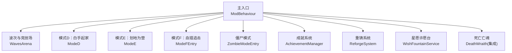

图示来源
- [WavesArena.cs:1-120](file://WavesArena/WavesArena.cs#L1-L120)
- [ModeD.cs:1-120](file://ModeD/ModeD.cs#L1-L120)
- [ModeE.cs:1-120](file://ModeE/ModeE.cs#L1-L120)
- [ModeFEntry.cs:1-120](file://ModeF/ModeFEntry.cs#L1-L120)
- [ZombieModeEntry.cs:1-120](file://ZombieMode/ZombieModeEntry.cs#L1-L120)
- [BossRushAchievementManager.cs:1-120](file://Achievement/BossRushAchievementManager.cs#L1-L120)
- [ReforgeSystem.cs:1-120](file://Integration/Reforge/ReforgeSystem.cs#L1-L120)
- [WishFountainService.cs:1-120](file://Integration/WishFountain/WishFountainService.cs#L1-L120)

章节来源
- [README.md:15-121](file://README.md#L15-L121)

## 核心组件
- 波次与竞技场：负责标准 BossRush 的波次推进、倒计时、多 Boss 判定、掉落处理与无间炼狱现金池。
- 模式入口：Mode D/E/F/僵尸模式各自维护入场条件、状态机、刷怪与经济。
- 成就系统：定义成就、解锁与奖励发放，支持分类与隐藏成就。
- 重铸系统：基于稀有度、价值与投入金钱的概率模型，支持属性范围、保底与倾向滑块。
- 星愿许愿台：文本清洗与校验、飞书鉴权写入、心愿奖励池抽取与冷却。
- 死亡亡魂：记录死亡快照，回图后生成对应强度的亡魂副本。

章节来源
- [WavesArena.cs:108-207](file://WavesArena/WavesArena.cs#L108-L207)
- [BossRushAchievementManager.cs:46-120](file://Achievement/BossRushAchievementManager.cs#L46-L120)
- [ReforgeSystem.cs:195-420](file://Integration/Reforge/ReforgeSystem.cs#L195-L420)
- [WishFountainService.cs:37-120](file://Integration/WishFountain/WishFountainService.cs#L37-L120)

## 架构总览
下图展示各模式与通用系统的交互关系：模式入口统一由主行为体协调，波次与掉落由通用逻辑处理；成就、重铸、愿望台、亡魂作为横切服务被各模式调用。

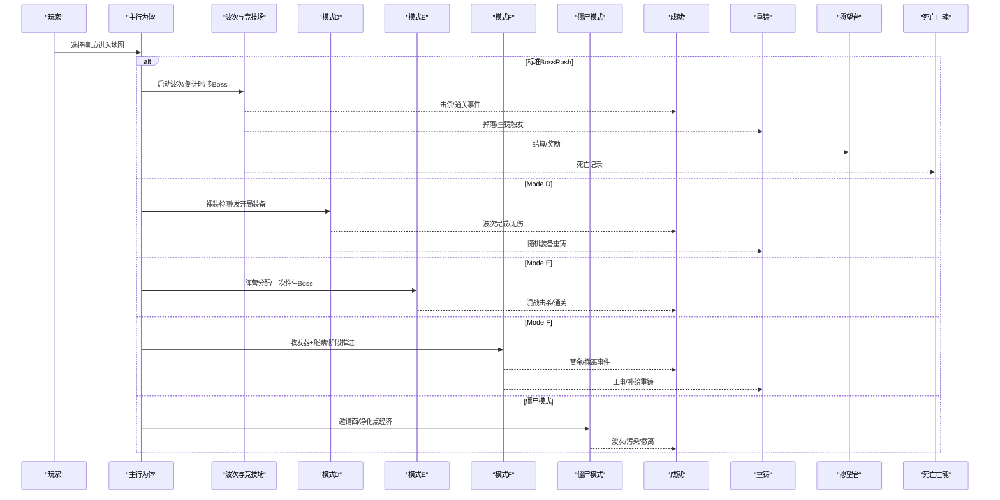

图示来源
- [WavesArena.cs:108-207](file://WavesArena/WavesArena.cs#L108-L207)
- [ModeD.cs:128-227](file://ModeD/ModeD.cs#L128-L227)
- [ModeE.cs:65-120](file://ModeE/ModeE.cs#L65-L120)
- [ModeFEntry.cs:65-164](file://ModeF/ModeFEntry.cs#L65-L164)
- [ZombieModeEntry.cs:81-177](file://ZombieMode/ZombieModeEntry.cs#L81-L177)
- [BossRushAchievementManager.cs:244-349](file://Achievement/BossRushAchievementManager.cs#L244-L349)
- [ReforgeSystem.cs:788-800](file://Integration/Reforge/ReforgeSystem.cs#L788-L800)
- [WishFountainService.cs:161-198](file://Integration/WishFountain/WishFountainService.cs#L161-L198)

## 详细组件分析

### 标准 BossRush（弹指可灭、有点意思、无间炼狱）
- 波次推进：每波结束后根据配置进入倒计时或手动交互开启下一波；每 5 波可获得额外休息时间。
- 多 Boss 模式：当前波内多个 Boss 全部击败才推进；单 Boss 则直接推进。
- 无间炼狱：无限波次，按权重从 Boss 池抽取；击杀 Boss 累计现金池，用于自动吸附与奖励。
- 前期保护：前 20 波排除部分强力 Boss，降低入门难度。

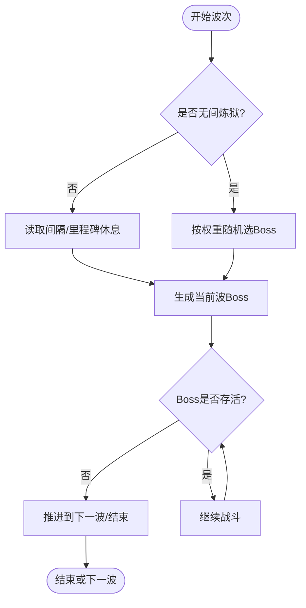

图示来源
- [WavesArena.cs:108-207](file://WavesArena/WavesArena.cs#L108-L207)
- [WavesArena.cs:348-506](file://WavesArena/WavesArena.cs#L348-L506)
- [WavesArena.cs:648-742](file://WavesArena/WavesArena.cs#L648-L742)

章节来源
- [WavesArena.cs:108-207](file://WavesArena/WavesArena.cs#L108-L207)
- [WavesArena.cs:348-506](file://WavesArena/WavesArena.cs#L348-L506)
- [WavesArena.cs:648-742](file://WavesArena/WavesArena.cs#L648-L742)

### Mode D：白手起家
- 入场条件：裸装仅允许携带 BossRush 船票；系统检测通过后启动。
- 开局装备：初始化武器、护甲、头盔、弹药、医疗品、近战、图腾、面具、背包等池，并发放初始套装。
- 敌人池：小怪池与 Boss 池分离，复用全局 Boss 池；每波敌人数可配置。
- 变异词条：首波前抽取并应用，影响后续节奏。

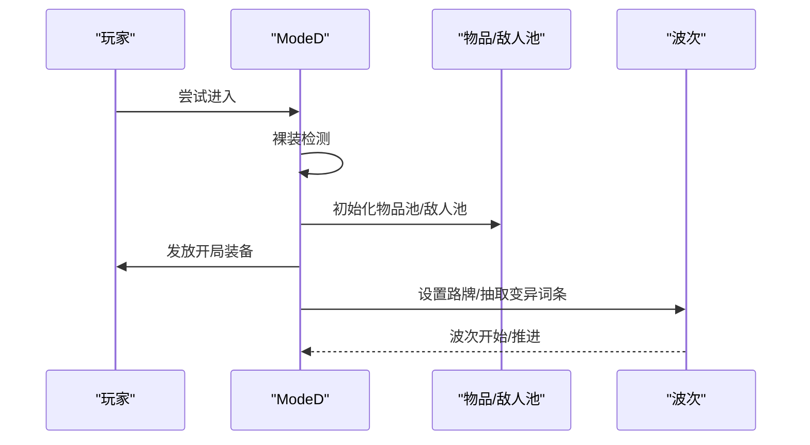

图示来源
- [ModeD.cs:128-227](file://ModeD/ModeD.cs#L128-L227)
- [ModeD.cs:267-421](file://ModeD/ModeD.cs#L267-L421)
- [ModeD.cs:580-800](file://ModeD/ModeD.cs#L580-L800)

章节来源
- [ModeD.cs:128-227](file://ModeD/ModeD.cs#L128-L227)
- [ModeD.cs:267-421](file://ModeD/ModeD.cs#L267-L421)
- [ModeD.cs:580-800](file://ModeD/ModeD.cs#L580-L800)

### Mode E：划地为营
- 入场条件：裸装 + 营旗（随机或指定阵营），独狼模式可用“爷的营旗”。
- 阵营混战：同阵营互不伤害，不同阵营自动敌对；Boss 一次性生成于各自领地。
- 动态缩放：按个人层数（出生基线死亡计数）提升生命与伤害。
- 商人经济：会话令牌与价格缓存保证交易一致性。

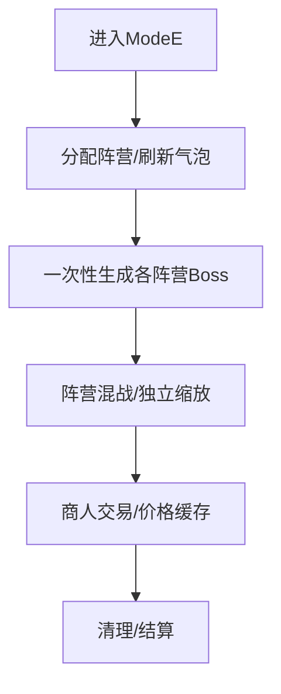

图示来源
- [ModeE.cs:65-120](file://ModeE/ModeE.cs#L65-L120)
- [ModeE.cs:285-328](file://ModeE/ModeE.cs#L285-L328)

章节来源
- [ModeE.cs:65-120](file://ModeE/ModeE.cs#L65-L120)
- [ModeE.cs:285-328](file://ModeE/ModeE.cs#L285-L328)

### Mode F：血猎追击
- 入场条件：裸装 + BossRush 船票 + 血猎收发器；检测到营旗将拒绝进入。
- 四阶段流程：准备→赏金→猎杀风暴→撤离；持续失血，击杀回血。
- 工事系统：折叠掩体包等工事辅助生存；UI 显示赏金雷达与健康条。
- 资源消耗：原子性扣费，失败返还入场道具。

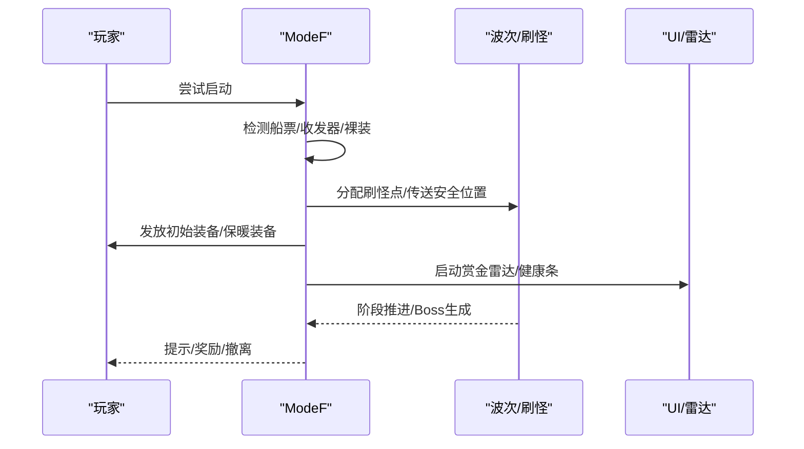

图示来源
- [ModeFEntry.cs:65-164](file://ModeF/ModeFEntry.cs#L65-L164)
- [ModeFEntry.cs:265-396](file://ModeF/ModeFEntry.cs#L265-L396)

章节来源
- [ModeFEntry.cs:65-164](file://ModeF/ModeFEntry.cs#L65-L164)
- [ModeFEntry.cs:265-396](file://ModeF/ModeFEntry.cs#L265-L396)

### 僵尸模式
- 入场条件：使用尸潮邀请函；预检其他模式互斥与费用充足。
- 净化点经济：现金投资按比例转换为净化点数；地图加载完成后进入选择流派阶段。
- 波次控制：独立 HUD、临时 NPC 保护、污染区域与净化点控制器。
- 退出与退款：失败时退还邀请函与现金。

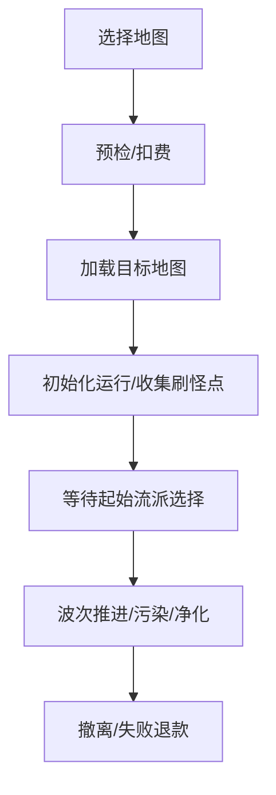

图示来源
- [ZombieModeEntry.cs:81-177](file://ZombieMode/ZombieModeEntry.cs#L81-L177)
- [ZombieModeEntry.cs:312-424](file://ZombieMode/ZombieModeEntry.cs#L312-L424)
- [ZombieModeEntry.cs:589-636](file://ZombieMode/ZombieModeEntry.cs#L589-L636)

章节来源
- [ZombieModeEntry.cs:81-177](file://ZombieMode/ZombieModeEntry.cs#L81-L177)
- [ZombieModeEntry.cs:312-424](file://ZombieMode/ZombieModeEntry.cs#L312-L424)
- [ZombieModeEntry.cs:589-636](file://ZombieMode/ZombieModeEntry.cs#L589-L636)

### 自定义 Boss 系统（龙裔遗族、焚天龙皇）
- 龙裔遗族：两阶段战斗，首次致命一击后复活至半血并进入狂暴阶段；具备火免疫与火焰回复机制。
- 焚天龙皇：高阶核心 Boss，拥有复杂技能组与专属武器掉落；在 Boss 池注册与波次筛选中参与。
- 波次保护：前 20 波排除强力 Boss，确保新手体验。

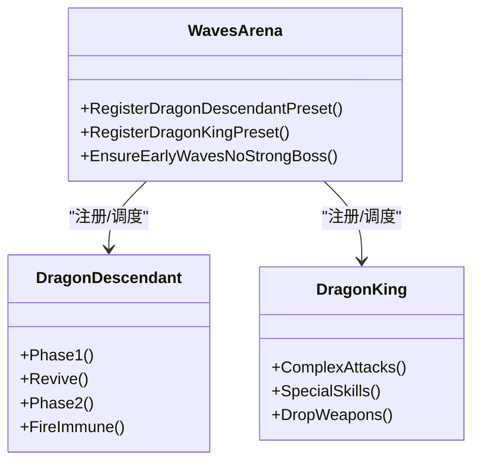

图示来源
- [WavesArena.cs:42-104](file://WavesArena/WavesArena.cs#L42-L104)
- [WavesArena.cs:555-600](file://WavesArena/WavesArena.cs#L555-L600)

章节来源
- [WavesArena.cs:42-104](file://WavesArena/WavesArena.cs#L42-L104)
- [WavesArena.cs:555-600](file://WavesArena/WavesArena.cs#L555-L600)

### 装备与物品系统
- 自定义武器：霜之哀伤（冰系近战，带召唤亡灵与冰焰特效）、毒蛇匕首、召唤法杖、能量盾、冰霜长矛、雷电戒指等。
- 套装效果：龙套装、龙王套装（全面升级，保留火转治疗，强化冲刺与链闪，移除负面）、冰霜套与雷霆套（防御反击）。
- 掉落与获取：Boss 掉落、商店、成就奖励、愿望台等渠道；部分为开发者预览暂不可通过常规途径获取。

章节来源
- [README.md:56-121](file://README.md#L56-L121)

### NPC 关系线（阿稳、叮当、羽织）
- 阿稳：快递员与基础引导，关联存储、Wiki 书、扫箱令等流程。
- 叮当：哥布林铁匠，提供重铸服务、折扣与礼物互动；好感度等级解锁商店、冷淬液、婚戒等。
- 羽织：护士，提供治疗、去 debuff、和平护身符；好感度等级解锁免费滴剂与婚姻线。
- 婚姻：达到 Lv.10 并在教堂求婚成功，婚后 NPC 迁居教堂，日常对话获得专属福利。

章节来源
- [README.md:63-121](file://README.md#L63-L121)

### 成就系统
- 成就分类：基础通关、累计通关、无间炼狱、无伤、速通、Boss 击杀、收藏类、终极成就等。
- 解锁与奖励：解锁后保存状态，领取奖励包含现金与物品；支持隐藏成就与收集者补发。
- 事件总线：解锁与领取事件发布，供 UI 与其他系统订阅。

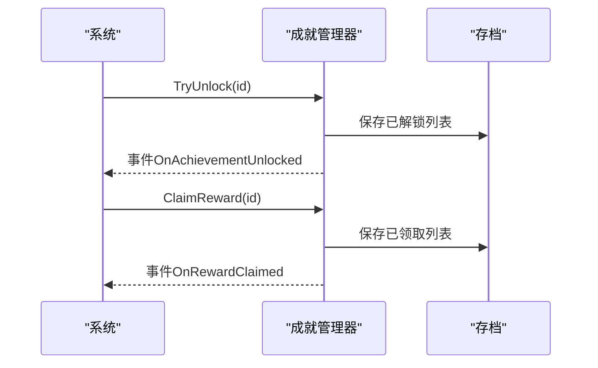

图示来源
- [BossRushAchievementManager.cs:244-349](file://Achievement/BossRushAchievementManager.cs#L244-L349)
- [BossRushAchievementManager.cs:377-419](file://Achievement/BossRushAchievementManager.cs#L377-L419)

章节来源
- [BossRushAchievementManager.cs:46-120](file://Achievement/BossRushAchievementManager.cs#L46-L120)
- [BossRushAchievementManager.cs:244-349](file://Achievement/BossRushAchievementManager.cs#L244-L349)
- [BossRushAchievementManager.cs:377-419](file://Achievement/BossRushAchievementManager.cs#L377-L419)

### 重铸系统
- 概率模型：基础概率受稀有度与物品价值影响；投入金钱提供分段增益；最终概率 p = clamp(p_item + money_bonus)。
- 幅度与范围：幅度 u^expo（p越大幅度越大）；属性范围按预制体值决定绝对或百分比范围；整数属性保持整数。
- 保底与倾向：每次重铸至少修改一个属性；倾向滑块控制正负号；连续失败提升成功率。
- 费用计算：基础费用为物品价值的 1/100（最低 100），受好感度折扣影响。

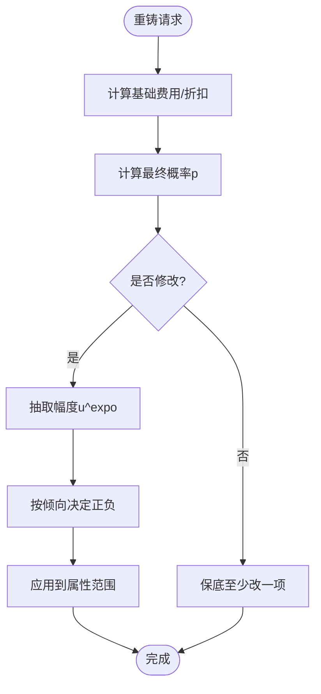

图示来源
- [ReforgeSystem.cs:195-420](file://Integration/Reforge/ReforgeSystem.cs#L195-L420)
- [ReforgeSystem.cs:788-800](file://Integration/Reforge/ReforgeSystem.cs#L788-L800)

章节来源
- [ReforgeSystem.cs:195-420](file://Integration/Reforge/ReforgeSystem.cs#L195-L420)
- [ReforgeSystem.cs:788-800](file://Integration/Reforge/ReforgeSystem.cs#L788-L800)

### 星愿许愿台
- 文本清洗与校验：标准化输入、长度限制、有效字符、重复、链接与敏感词过滤。
- 网络服务：AES 加密配置读取、飞书鉴权与多维表格写入；缓存 tenant token 并自动重试。
- 心愿奖励：类别与品质权重、冷却时间、奖励池构建与抽取；支持动画与 UI 反馈。

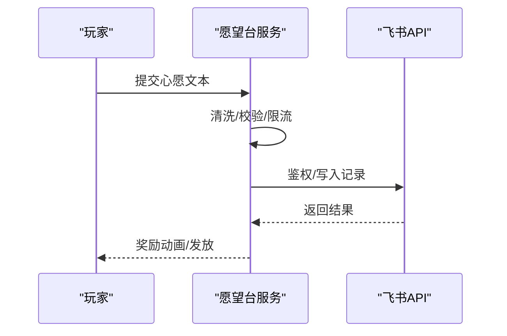

图示来源
- [WishFountainService.cs:37-120](file://Integration/WishFountain/WishFountainService.cs#L37-L120)
- [WishFountainService.cs:161-198](file://Integration/WishFountain/WishFountainService.cs#L161-L198)
- [WishFountainService.cs:541-646](file://Integration/WishFountain/WishFountainService.cs#L541-L646)

章节来源
- [WishFountainService.cs:37-120](file://Integration/WishFountain/WishFountainService.cs#L37-L120)
- [WishFountainService.cs:161-198](file://Integration/WishFountain/WishFountainService.cs#L161-L198)
- [WishFountainService.cs:541-646](file://Integration/WishFountain/WishFountainService.cs#L541-L646)

### 死亡亡魂
- 触发条件：正常游戏场景中死亡；仅在相同地图与子场景出现。
- 强度分级：根据携带物品价值占总财富比例分为强/平衡/弱三档，分别调整生命、伤害与速度。
- 继承与清理：复制外观、装备、语音与步态；仅保留一条记录，击杀后清除。

章节来源
- [README.md:111-121](file://README.md#L111-L121)

## 依赖关系分析
- 模式与波次：所有模式均依赖波次与掉落系统；Mode D/E/F 共享部分池与工具。
- 系统与横切：成就、重铸、愿望台、亡魂在各模式中作为服务被调用。
- 外部集成：飞书 API（愿望台）、Steam 风格弹窗（成就）、Harmony 补丁（运行时注入）。

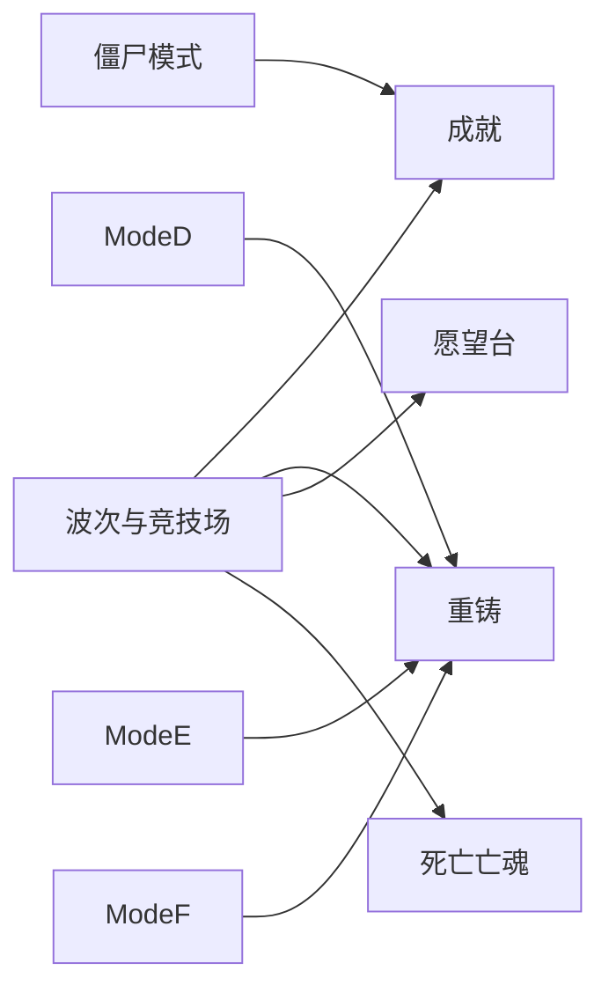

图示来源
- [WavesArena.cs:108-207](file://WavesArena/WavesArena.cs#L108-L207)
- [ModeD.cs:128-227](file://ModeD/ModeD.cs#L128-L227)
- [ModeE.cs:65-120](file://ModeE/ModeE.cs#L65-L120)
- [ModeFEntry.cs:65-164](file://ModeF/ModeFEntry.cs#L65-L164)
- [ZombieModeEntry.cs:81-177](file://ZombieMode/ZombieModeEntry.cs#L81-L177)

章节来源
- [WavesArena.cs:108-207](file://WavesArena/WavesArena.cs#L108-L207)
- [ModeD.cs:128-227](file://ModeD/ModeD.cs#L128-L227)
- [ModeE.cs:65-120](file://ModeE/ModeE.cs#L65-L120)
- [ModeFEntry.cs:65-164](file://ModeF/ModeFEntry.cs#L65-L164)
- [ZombieModeEntry.cs:81-177](file://ZombieMode/ZombieModeEntry.cs#L81-L177)

## 性能考量
- 波次与刷怪：启用缓存与对象复用，避免重复扫描与 GC；Boss 池初始化一次后复用。
- 重铸系统：委托缓存替代反射，减少热路径开销；属性范围与边界计算优化。
- 愿望台：网络请求限流与缓存，避免频繁鉴权与拉表；后台预热奖励池。
- 模式状态：会话令牌与场景校验防止异步对象污染；错误路径快速清理。

章节来源
- [WavesArena.cs:555-641](file://WavesArena/WavesArena.cs#L555-L641)
- [ReforgeSystem.cs:48-98](file://Integration/Reforge/ReforgeSystem.cs#L48-L98)
- [WishFountainService.cs:98-112](file://Integration/WishFountain/WishFountainService.cs#L98-L112)

## 故障排查指南
- 模式启动失败：检查入场道具与裸装条件；查看日志中的失败原因与返还逻辑。
- 波次卡住：确认倒计时与交互标志；检查 Boss 生成失败处理与推进逻辑。
- 重铸异常：核对属性键是否支持、范围计算与保底机制；检查费用与折扣。
- 愿望台发送失败：确认配置解密与鉴权；检查文本校验与限流；查看缓存与重试。
- 成就未解锁：确认触发事件与保存键；检查隐藏成就与收集者补发。

章节来源
- [ModeFEntry.cs:113-164](file://ModeF/ModeFEntry.cs#L113-L164)
- [WavesArena.cs:508-549](file://WavesArena/WavesArena.cs#L508-L549)
- [ReforgeSystem.cs:788-800](file://Integration/Reforge/ReforgeSystem.cs#L788-L800)
- [WishFountainService.cs:161-198](file://Integration/WishFountain/WishFountainService.cs#L161-L198)
- [BossRushAchievementManager.cs:377-419](file://Achievement/BossRushAchievementManager.cs#L377-L419)

## 结论
BossRushMod 通过模块化设计将六大模式与多项系统有机整合，既保证了核心玩法的稳定性，又提供了丰富的扩展空间。玩家在标准 BossRush、Mode D/E/F 与僵尸模式中体验差异化挑战；自定义 Boss、装备与 NPC 关系线增强了沉浸感；成就、重铸、愿望台与死亡亡魂完善了成长与反馈闭环。建议结合配置与调试工具进行个性化调优与问题定位。

## 附录：使用示例与配置选项

### 使用示例
- 标准 BossRush：携带 BossRush 船票进入地图，选择难度；每波结束后根据配置自动或手动开启下一波。
- Mode D：裸装携带船票进入，系统发放开局装备；通过击杀获取更好装备，逐步成长。
- Mode E：裸装携带营旗进入，分配阵营；Boss 一次性生成，展开阵营混战。
- Mode F：裸装携带船票与血猎收发器进入；经历四阶段，利用工事与补给生存并撤离。
- 僵尸模式：使用邀请函进入；选择流派后推进波次，管理污染与净化点。

### 配置选项（节选）
- waveIntervalSeconds：波次间休息时间（秒）
- enableRandomBossLoot：启用 Boss 随机掉落加成
- useLegacyBossLootProbabilities：标准 Boss 战利品箱使用原版概率区间
- useInteractBetweenWaves：波次间改为手动交互开下一波
- lootBoxBlocksBullets：掉落箱是否可作为掩体挡子弹
- infiniteHellBossesPerWave：无间炼狱每波 Boss 数
- bossStatMultiplier：Boss 全局数值倍率
- modeDEnemiesPerWave：白手起家每波敌人数
- disabledBosses：被禁用的 Boss 列表
- bossInfiniteHellFactors：无间炼狱 Boss 刷新权重因子
- enableDragonDash：是否启用龙冲刺相关能力
- achievementHotkey：成就面板热键
- useWolfModelForWildHorn：荒野号角是否使用狼模型
- enableDeathWraithSystem：死亡亡魂系统开关
- milestoneRestBonusSeconds：每 5 波额外休息时间（秒）

章节来源
- [README.md:123-149](file://README.md#L123-L149)