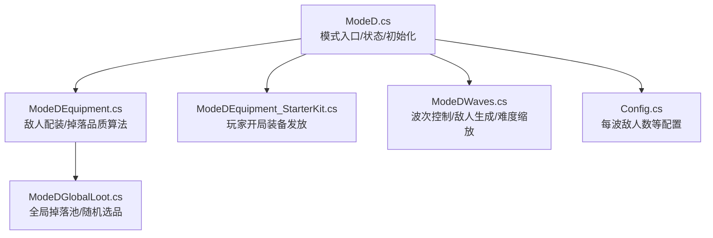
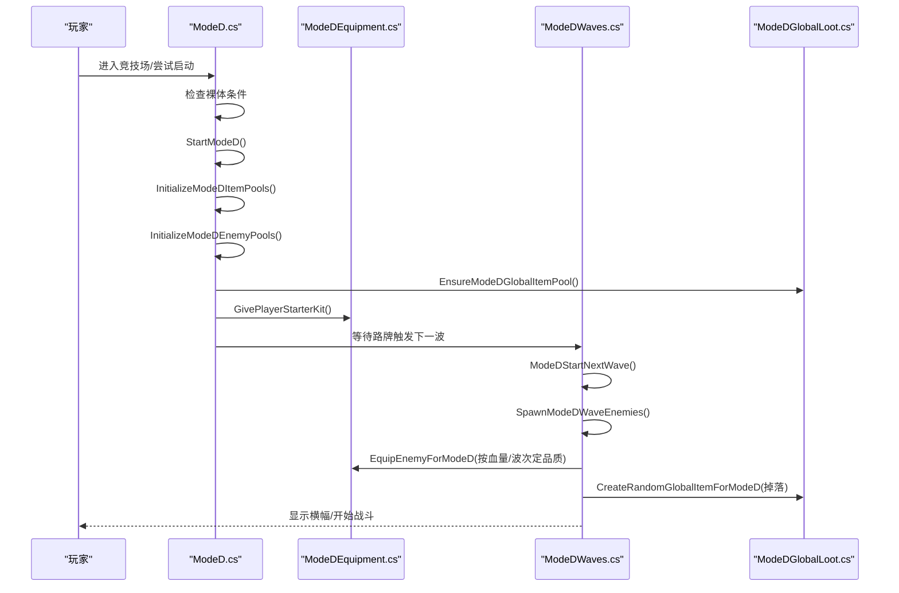
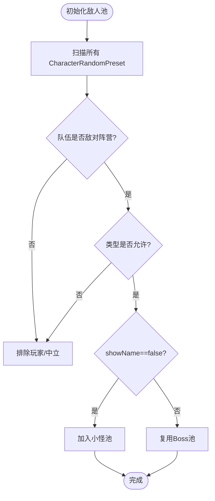
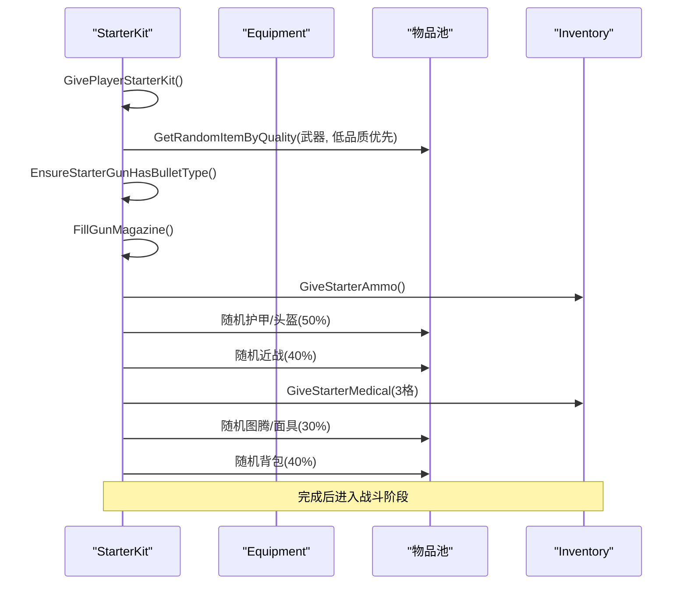
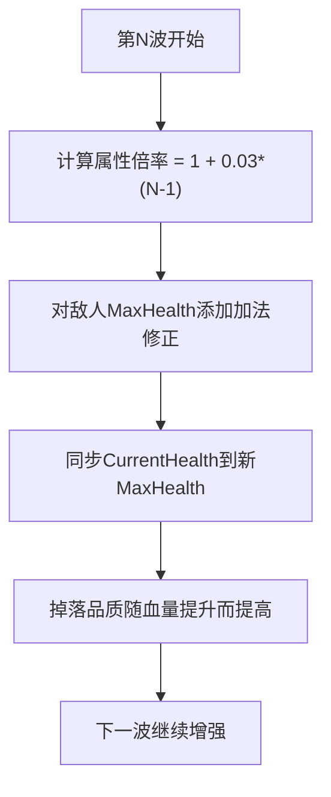
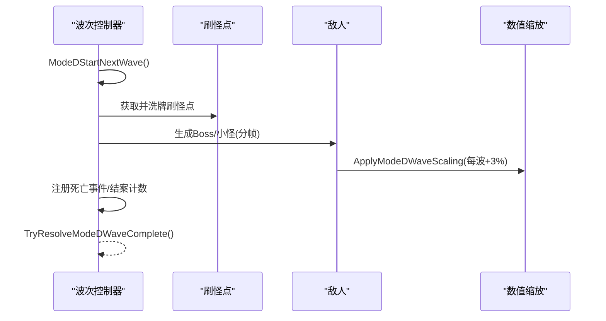
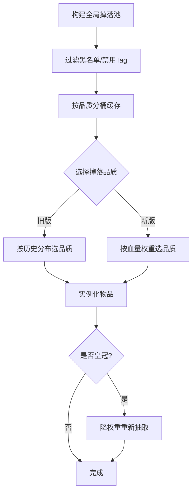
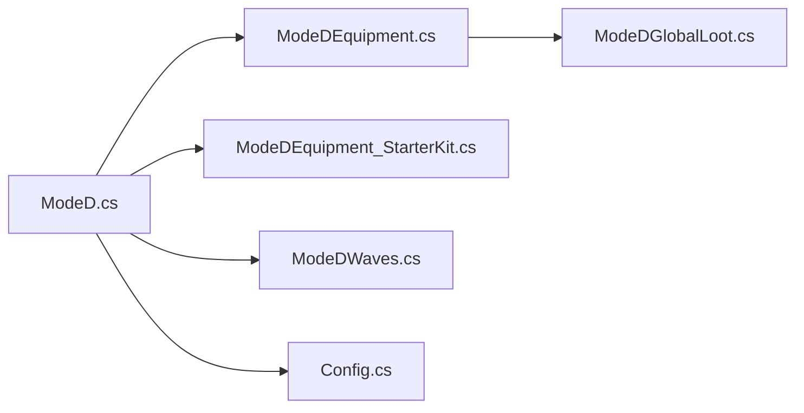

# Mode D：白手起家

<cite>
**本文引用的文件**
- [ModeD.cs](file://ModeD/ModeD.cs)
- [ModeDEquipment.cs](file://ModeD/ModeDEquipment.cs)
- [ModeDEquipment_StarterKit.cs](file://ModeD/ModeDEquipment_StarterKit.cs)
- [ModeDWaves.cs](file://ModeD/ModeDWaves.cs)
- [ModeDGlobalLoot.cs](file://ModeD/ModeDGlobalLoot.cs)
- [Config.cs](file://Config/Config.cs)
</cite>

## 目录
1. [简介](#简介)
2. [项目结构](#项目结构)
3. [核心组件](#核心组件)
4. [架构总览](#架构总览)
5. [详细组件分析](#详细组件分析)
6. [依赖关系分析](#依赖关系分析)
7. [性能考量](#性能考量)
8. [故障排查指南](#故障排查指南)
9. [结论](#结论)
10. [附录](#附录)

## 简介
Mode D（白手起家）是 BossRush 的一个特殊玩法模式。玩家以“裸体”状态进入竞技场，系统随机发放开局装备，并通过击杀敌人获取更好的装备。该模式采用独立敌池、专属掉落规则与波次管理，提供从弱到强的成长曲线和无限挑战体验。

## 项目结构
Mode D 的核心逻辑分布在以下文件中：
- 模式启动与状态管理：ModeD.cs
- 装备系统与掉落：ModeDEquipment.cs、ModeDEquipment_StarterKit.cs
- 波次管理与难度曲线：ModeDWaves.cs
- 全局物品池与随机掉落：ModeDGlobalLoot.cs
- 配置项：Config.cs

图表来源
- [ModeD.cs:139-189](file://ModeD/ModeD.cs#L139-L189)
- [ModeDEquipment.cs:469-623](file://ModeD/ModeDEquipment.cs#L469-L623)
- [ModeDEquipment_StarterKit.cs:44-116](file://ModeD/ModeDEquipment_StarterKit.cs#L44-L116)
- [ModeDWaves.cs:45-131](file://ModeD/ModeDWaves.cs#L45-L131)
- [ModeDGlobalLoot.cs:64-208](file://ModeD/ModeDGlobalLoot.cs#L64-L208)
- [Config.cs:55-56](file://Config/Config.cs#L55-L56)

章节来源
- [ModeD.cs:139-189](file://ModeD/ModeD.cs#L139-L189)
- [Config.cs:55-56](file://Config/Config.cs#L55-L56)

## 核心组件
- 模式生命周期：检测裸体条件、启动/结束模式、清理状态、设置路牌、应用变异词条。
- 装备系统：按 Tag 预建各类物品池（武器、护甲、头盔、弹药、医疗品、近战、图腾、面具、背包），支持按品质桶快速抽取；为敌人配装并生成合理掉落。
- 波次系统：按波次决定 Boss/小怪配比，分帧生成敌人，应用数值强化，处理死亡与完成判定。
- 全局掉落池：构建全游戏可掉落物品集合，按品质分层缓存，支持基于敌人血量的品质权重选择。
- 配置：每波敌人数、是否使用旧版掉落概率等。

章节来源
- [ModeD.cs:139-189](file://ModeD/ModeD.cs#L139-L189)
- [ModeDEquipment.cs:267-421](file://ModeD/ModeDEquipment.cs#L267-L421)
- [ModeDWaves.cs:45-131](file://ModeD/ModeDWaves.cs#L45-L131)
- [ModeDGlobalLoot.cs:64-208](file://ModeD/ModeDGlobalLoot.cs#L64-L208)
- [Config.cs:55-56](file://Config/Config.cs#L55-L56)

## 架构总览
Mode D 的运行时由“模式核心 + 装备系统 + 波次系统 + 掉落池 + 配置”构成。启动时校验裸体条件并初始化各池；随后通过路牌触发波次；每波结束后结算并自动推进下一波。

图表来源
- [ModeD.cs:139-189](file://ModeD/ModeD.cs#L139-L189)
- [ModeDEquipment.cs:469-623](file://ModeD/ModeDEquipment.cs#L469-L623)
- [ModeDWaves.cs:45-131](file://ModeD/ModeDWaves.cs#L45-L131)
- [ModeDGlobalLoot.cs:284-395](file://ModeD/ModeDGlobalLoot.cs#L284-L395)

## 详细组件分析

### 独立敌池设计与隔离机制
- 小怪池：扫描所有 CharacterRandomPreset，仅收集非玩家/中立阵营且 showName==false 的预设，排除雇佣兵、炮台、商人、宠物、载具等。
- Boss池：复用现有 enemyPresets，并在前期波次过滤掉强力 Boss，避免早期过难。
- 隔离策略：通过独立的 modeDMinionPool 与 modeDBossPool，以及严格的筛选逻辑，确保 Mode D 的敌人生成不受其他模式干扰。

图表来源
- [ModeD.cs:580-799](file://ModeD/ModeD.cs#L580-L799)

章节来源
- [ModeD.cs:580-799](file://ModeD/ModeD.cs#L580-L799)

### 随机装备系统工作流程
- 开局装备：必给武器与弹药，护甲/头盔各50%概率，近战武器40%，医疗品固定3格，图腾/面具各30%，背包40%。
- 配件填充：每个槽位独立判断是否安装配件，有限次数抽样以避免性能问题。
- 敌人配装：根据波次与敌人血量计算品质等级，清空或保留部分原始装备后，赋予武器、近战、额外掉落物，并按需填满背包。

图表来源
- [ModeDEquipment_StarterKit.cs:44-116](file://ModeD/ModeDEquipment_StarterKit.cs#L44-L116)
- [ModeDEquipment_StarterKit.cs:121-161](file://ModeD/ModeDEquipment_StarterKit.cs#L121-L161)
- [ModeDEquipment_StarterKit.cs:459-505](file://ModeD/ModeDEquipment_StarterKit.cs#L459-L505)
- [ModeDEquipment_StarterKit.cs:673-773](file://ModeD/ModeDEquipment_StarterKit.cs#L673-L773)

章节来源
- [ModeDEquipment_StarterKit.cs:44-116](file://ModeD/ModeDEquipment_StarterKit.cs#L44-L116)
- [ModeDEquipment.cs:53-88](file://ModeD/ModeDEquipment.cs#L53-L88)
- [ModeDEquipment.cs:469-623](file://ModeD/ModeDEquipment.cs#L469-L623)

### 成长节奏控制算法（经验值、等级提升、属性增长）
- 当前实现中未直接实现“经验值/等级提升”的系统；成长主要通过“波次推进”驱动：每波敌人属性按 3% 递增，从而自然提升挑战强度与掉落品质预期。
- 掉落品质受敌人血量影响：血量越高，越可能获得更高品质的掉落；同时支持旧版/新版两种品质分布模型。

图表来源
- [ModeDWaves.cs:736-781](file://ModeD/ModeDWaves.cs#L736-L781)
- [ModeDEquipment.cs:97-114](file://ModeD/ModeDEquipment.cs#L97-L114)

章节来源
- [ModeDWaves.cs:736-781](file://ModeD/ModeDWaves.cs#L736-L781)
- [ModeDEquipment.cs:97-114](file://ModeD/ModeDEquipment.cs#L97-L114)

### 波次管理、敌人生成策略与难度曲线
- 波次规则：
  - 第1-5波：全小怪
  - 第6-10波：1个Boss + 小怪
  - 第11-15波：2个Boss + 小怪
  - 第16+波：全Boss
- 生成策略：
  - 分帧生成，避免低端机帧尖刺
  - 安全刷怪点洗牌，保证空间分布
  - 前期小怪限制最低血量，避免过早出现高威胁单位
  - 前期Boss过滤强力单位，降低早期难度
- 难度曲线：
  - 每波敌人属性按 3% 递增
  - 统一伤害倍率为1，避免不同Boss原生倍率差异过大

图表来源
- [ModeDWaves.cs:45-131](file://ModeD/ModeDWaves.cs#L45-L131)
- [ModeDWaves.cs:185-334](file://ModeD/ModeDWaves.cs#L185-L334)
- [ModeDWaves.cs:352-512](file://ModeD/ModeDWaves.cs#L352-L512)
- [ModeDWaves.cs:736-781](file://ModeD/ModeDWaves.cs#L736-L781)

章节来源
- [ModeDWaves.cs:45-131](file://ModeD/ModeDWaves.cs#L45-L131)
- [ModeDWaves.cs:185-334](file://ModeD/ModeDWaves.cs#L185-L334)
- [ModeDWaves.cs:352-512](file://ModeD/ModeDWaves.cs#L352-L512)
- [ModeDWaves.cs:736-781](file://ModeD/ModeDWaves.cs#L736-L781)

### 掉落规则与全局物品池
- 全局池构建：遍历所有 Tag，排除黑名单与不应掉落标签，按品质建立桶缓存，支持后续快速抽取。
- 掉落品质选择：
  - 支持旧版概率模型（LegacyBossLootProbabilityModel）
  - 支持新版权重模型（基于敌人血量计算 bonusFactor）
- 特殊规则：皇冠类物品权重降低，避免频繁掉落。

图表来源
- [ModeDGlobalLoot.cs:64-208](file://ModeD/ModeDGlobalLoot.cs#L64-L208)
- [ModeDGlobalLoot.cs:284-395](file://ModeD/ModeDGlobalLoot.cs#L284-L395)
- [ModeDEquipment.cs:202-267](file://ModeD/ModeDEquipment.cs#L202-L267)

章节来源
- [ModeDGlobalLoot.cs:64-208](file://ModeD/ModeDGlobalLoot.cs#L64-L208)
- [ModeDGlobalLoot.cs:284-395](file://ModeD/ModeDGlobalLoot.cs#L284-L395)
- [ModeDEquipment.cs:202-267](file://ModeD/ModeDEquipment.cs#L202-L267)

### 游戏流程示例（从进入模式到后期发展）
- 入场：玩家以裸体状态进入，系统检测到条件后自动启动 Mode D。
- 开局：发放随机武器与弹药，随机护甲/头盔，少量医疗品，可选近战/图腾/面具/背包。
- 第一波：全小怪，难度较低，熟悉操作与掉落。
- 中期（6-15波）：引入 Boss，逐步增加 Boss 数量，敌人属性逐波提升，掉落品质随血量提升。
- 后期（16+波）：全 Boss，高难度挑战，考验装备搭配与走位。
- 结束：退出模式或完成目标后，清理状态并统计完成波数。

章节来源
- [ModeD.cs:139-189](file://ModeD/ModeD.cs#L139-L189)
- [ModeDEquipment_StarterKit.cs:44-116](file://ModeD/ModeDEquipment_StarterKit.cs#L44-L116)
- [ModeDWaves.cs:141-177](file://ModeD/ModeDWaves.cs#L141-L177)

## 依赖关系分析
- ModeD.cs 依赖：
  - 装备系统（ModeDEquipment.cs、ModeDEquipment_StarterKit.cs）用于开局与敌人配装
  - 波次系统（ModeDWaves.cs）用于敌人生成与难度控制
  - 全局掉落池（ModeDGlobalLoot.cs）用于掉落品质与随机选品
  - 配置（Config.cs）用于每波敌人数等参数
- 耦合与内聚：
  - 各模块职责清晰，通过接口与方法调用协作
  - 波次与掉落解耦，掉落池独立于具体波次逻辑
  - 配置集中管理，便于调参与扩展

图表来源
- [ModeD.cs:139-189](file://ModeD/ModeD.cs#L139-L189)
- [ModeDEquipment.cs:469-623](file://ModeD/ModeDEquipment.cs#L469-L623)
- [ModeDEquipment_StarterKit.cs:44-116](file://ModeD/ModeDEquipment_StarterKit.cs#L44-L116)
- [ModeDWaves.cs:45-131](file://ModeD/ModeDWaves.cs#L45-L131)
- [ModeDGlobalLoot.cs:64-208](file://ModeD/ModeDGlobalLoot.cs#L64-L208)
- [Config.cs:55-56](file://Config/Config.cs#L55-L56)

章节来源
- [ModeD.cs:139-189](file://ModeD/ModeD.cs#L139-L189)
- [Config.cs:55-56](file://Config/Config.cs#L55-L56)

## 性能考量
- 分帧生成：每波敌人生成分帧执行，避免低端机帧尖刺。
- 列表复用：复用向量与队列缓存，减少分配与 GC。
- 有限随机抽样：配件槽位与品质选择采用有限尝试次数，避免全池洗牌。
- 预热全局池：在 TagsData 就绪时提前构建掉落池，避免首次卡顿。

章节来源
- [ModeDWaves.cs:185-334](file://ModeD/ModeDWaves.cs#L185-L334)
- [ModeDEquipment.cs:412-459](file://ModeD/ModeDEquipment.cs#L412-L459)
- [ModeDGlobalLoot.cs:37-58](file://ModeD/ModeDGlobalLoot.cs#L37-L58)

## 故障排查指南
- 无法开新波：检查上一波生成是否全部结案（成功或失败均计入），防止“迟到的怪”导致卡波。
- 无敌人可生成：若池为空或过滤后无可用预设，将直接完成本波并提示。
- 掉落异常：确认全局掉落池已构建且非空；皇冠类物品会降权重复抽取。
- 开局装备缺失：检查武器口径匹配、弹药类型设置、配件槽位是否可插。

章节来源
- [ModeDWaves.cs:548-650](file://ModeD/ModeDWaves.cs#L548-L650)
- [ModeDGlobalLoot.cs:64-208](file://ModeD/ModeDGlobalLoot.cs#L64-L208)
- [ModeDEquipment_StarterKit.cs:673-773](file://ModeD/ModeDEquipment_StarterKit.cs#L673-L773)

## 结论
Mode D 通过独立敌池、专属掉落规则与波次管理，构建了从零开始的成长体验。其设计兼顾了难度曲线与性能优化，适合喜欢挑战与随机性的玩家。配置项提供了灵活的调参空间，便于定制体验。

## 附录
- 配置选项说明：
  - modeDEnemiesPerWave：每波敌人数（1-10，默认3）
  - useLegacyBossLootProbabilities：是否使用旧版掉落概率模型
- 自定义扩展方法：
  - 扩展物品池：在 InitializeModeDItemPools 中添加新的 Tag 筛选逻辑
  - 调整难度曲线：修改 ApplyModeDWaveScaling 中的倍率公式
  - 自定义掉落规则：在 ModeDGlobalLoot.cs 中扩展特殊物品权重与过滤

章节来源
- [Config.cs:55-56](file://Config/Config.cs#L55-L56)
- [ModeD.cs:267-421](file://ModeD/ModeD.cs#L267-L421)
- [ModeDGlobalLoot.cs:252-276](file://ModeD/ModeDGlobalLoot.cs#L252-L276)