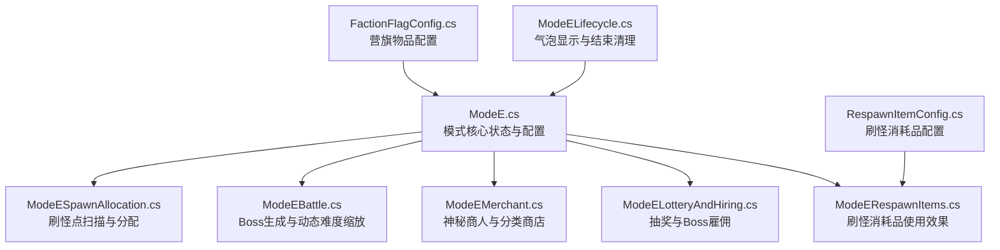
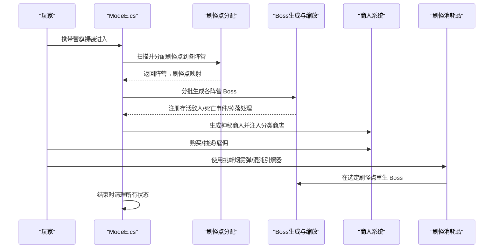
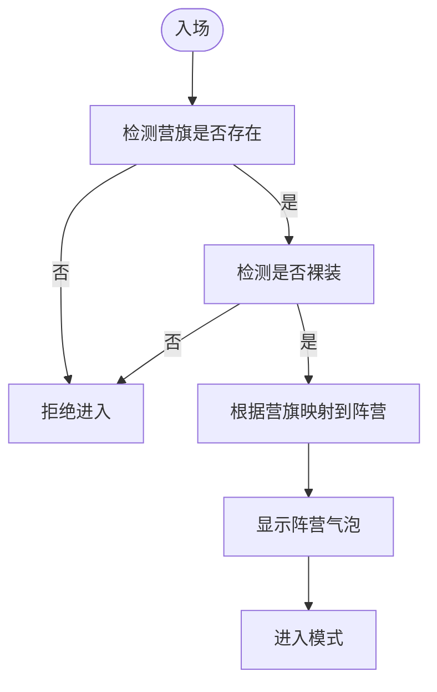
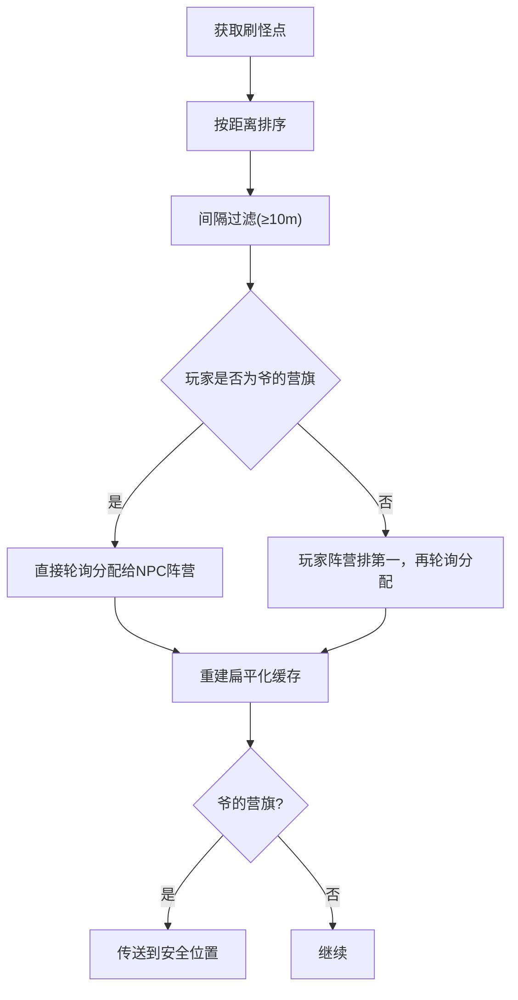
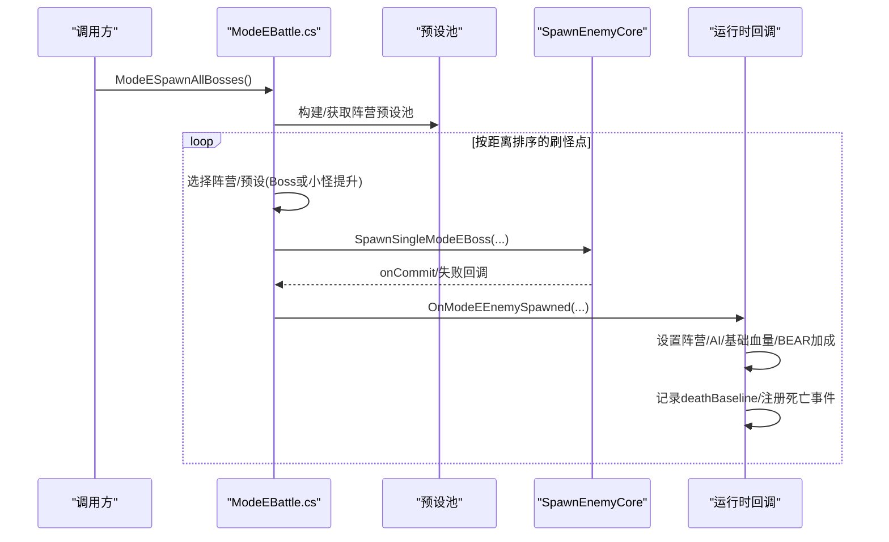
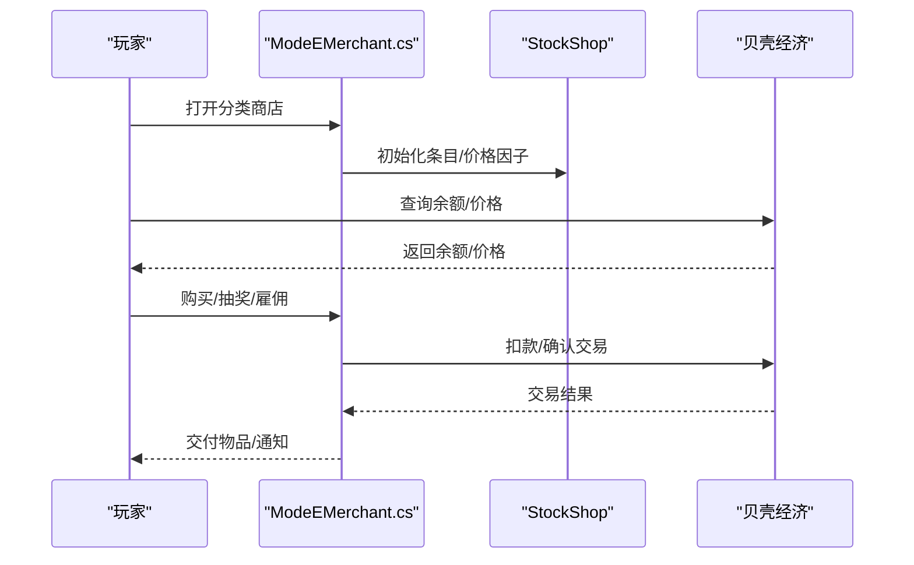
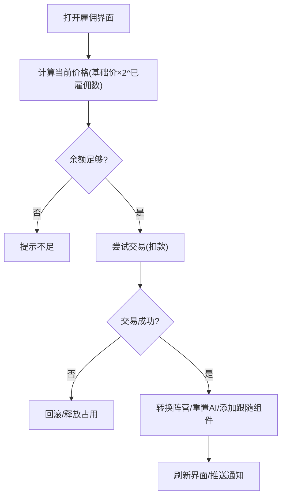
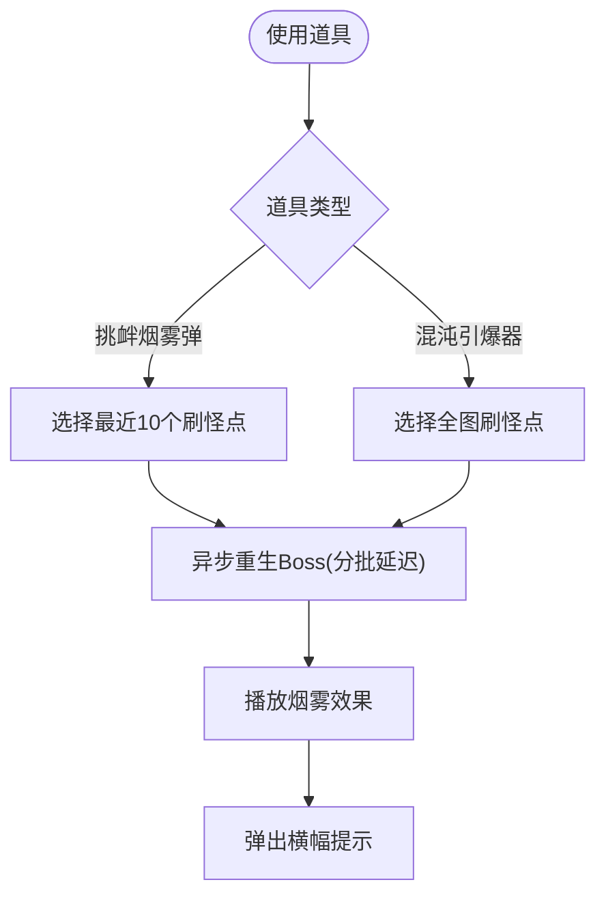
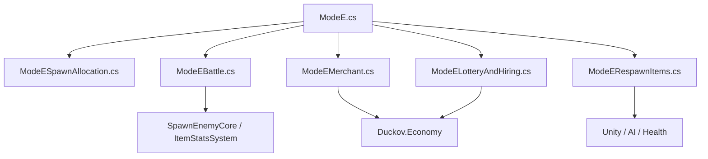

# Mode E：划地为营

<cite>
**本文引用的文件**
- [ModeE.cs](file://ModeE/ModeE.cs)
- [ModeEBattle.cs](file://ModeE/ModeEBattle.cs)
- [ModeEMerchant.cs](file://ModeE/ModeEMerchant.cs)
- [ModeELotteryAndHiring.cs](file://ModeE/ModeELotteryAndHiring.cs)
- [ModeERespawnItems.cs](file://ModeE/ModeERespawnItems.cs)
- [RespawnItemConfig.cs](file://ModeE/RespawnItemConfig.cs)
- [FactionFlagConfig.cs](file://ModeE/FactionFlagConfig.cs)
- [ModeESpawnAllocation.cs](file://ModeE/ModeESpawnAllocation.cs)
- [ModeELifecycle.cs](file://ModeE/ModeELifecycle.cs)
</cite>

## 目录
1. [简介](#简介)
2. [项目结构](#项目结构)
3. [核心组件](#核心组件)
4. [架构总览](#架构总览)
5. [详细组件分析](#详细组件分析)
6. [依赖关系分析](#依赖关系分析)
7. [性能考量](#性能考量)
8. [故障排查指南](#故障排查指南)
9. [结论](#结论)
10. [附录](#附录)

## 简介
Mode E（划地为营）是 BossRush 的多阵营沙盒混战模式。玩家携带“营旗”裸装进入竞技场，系统根据营旗类型分配阵营；地图刷怪点按阵营平均分配，每个阵营在各自领地一次性生成 Boss。同阵营实体互不伤害，不同阵营自动敌对交战。敌人按“出生时死亡基线”计算个人层数：每层生命/伤害 +5%（各阵营独立累计）。本模式提供神秘商人、道具刷新、雇佣兵与战场消耗品等子系统，形成“探索地图—建立据点—对抗其他阵营—收集资源”的核心循环。

## 项目结构
Mode E 的代码集中在 ModeE 目录下，围绕“入场与状态”“战斗与缩放”“商人经济”“抽奖与雇佣”“刷怪道具”“刷怪点分配”“生命周期清理”等职责划分清晰。

图表来源
- [ModeE.cs:65-328](file://ModeE/ModeE.cs#L65-L328)
- [ModeESpawnAllocation.cs:182-362](file://ModeE/ModeESpawnAllocation.cs#L182-L362)
- [ModeEBattle.cs:244-355](file://ModeE/ModeEBattle.cs#L244-L355)
- [ModeEMerchant.cs:73-191](file://ModeE/ModeEMerchant.cs#L73-L191)
- [ModeELotteryAndHiring.cs:288-407](file://ModeE/ModeELotteryAndHiring.cs#L288-L407)
- [ModeERespawnItems.cs:338-436](file://ModeE/ModeERespawnItems.cs#L338-L436)
- [FactionFlagConfig.cs:22-63](file://ModeE/FactionFlagConfig.cs#L22-L63)
- [RespawnItemConfig.cs:21-46](file://ModeE/RespawnItemConfig.cs#L21-L46)
- [ModeELifecycle.cs:47-183](file://ModeE/ModeELifecycle.cs#L47-L183)

章节来源
- [ModeE.cs:65-328](file://ModeE/ModeE.cs#L65-L328)
- [ModeESpawnAllocation.cs:182-362](file://ModeE/ModeESpawnAllocation.cs#L182-L362)

## 核心组件
- 阵营系统与入场凭证：通过营旗 TypeID 映射到具体阵营，支持随机与指定阵营，以及“爷的营旗”独狼玩法。
- 刷怪点分配：优先读取地图配置的 Mode E 专用刷怪点，否则回退到原地图 spawner 位置或基于玩家位置的备用点；按距离排序、间隔过滤后轮询分配给各阵营。
- Boss 生成与动态难度：按阵营从预设池选择 Boss/小怪提升为 Boss；记录出生基线并按阵营死亡计数实现个人层数缩放。
- 商人系统：生成神秘商人 NPC，注入分类商店（枪、近战、配件、子弹、头盔、护甲、背包、图腾、面具/耳机、医疗、其他），除子弹外价格×10，提供抽奖与售卖。
- 抽奖与雇佣：按品质权重与时间衰减进行抽奖；Boss 可被雇佣成为跟随者，价格随已雇佣数量指数增长。
- 刷怪消耗品：挑衅烟雾弹在最近 10 个刷怪点重生 Boss；混沌引爆器在全图所有刷怪点重生 Boss；另有猎王响哨与血狩烽火用于强制仇恨。
- 生命周期管理：显示阵营气泡、结束模式时清理敌人、商人、队列、变异词条等。

章节来源
- [FactionFlagConfig.cs:22-63](file://ModeE/FactionFlagConfig.cs#L22-L63)
- [ModeESpawnAllocation.cs:182-362](file://ModeE/ModeESpawnAllocation.cs#L182-L362)
- [ModeEBattle.cs:244-355](file://ModeE/ModeEBattle.cs#L244-L355)
- [ModeEMerchant.cs:73-191](file://ModeE/ModeEMerchant.cs#L73-L191)
- [ModeELotteryAndHiring.cs:288-407](file://ModeE/ModeELotteryAndHiring.cs#L288-L407)
- [ModeERespawnItems.cs:338-436](file://ModeE/ModeERespawnItems.cs#L338-L436)
- [ModeELifecycle.cs:47-183](file://ModeE/ModeELifecycle.cs#L47-L183)

## 架构总览
Mode E 以 ModBehaviour 为核心协调器，串联入场校验、阵营分配、Boss 生成、商人经济、道具使用与生命周期清理。关键流程如下：

图表来源
- [ModeE.cs:65-328](file://ModeE/ModeE.cs#L65-L328)
- [ModeESpawnAllocation.cs:182-362](file://ModeE/ModeESpawnAllocation.cs#L182-L362)
- [ModeEBattle.cs:244-355](file://ModeE/ModeEBattle.cs#L244-L355)
- [ModeEMerchant.cs:73-191](file://ModeE/ModeEMerchant.cs#L73-L191)
- [ModeERespawnItems.cs:338-436](file://ModeE/ModeERespawnItems.cs#L338-L436)

## 详细组件分析

### 阵营系统与入场凭证
- 营旗 TypeID 定义与本地化：包含随机、拾荒者、USEC、BEAR、实验室、狼群、爷的营旗，并提供商店注入与本地化键。
- 阵营映射：将营旗 TypeID 映射到 Teams，支持随机与指定；“爷的营旗”使玩家独立阵营，敌对所有 Boss。
- 入场检测：检查是否持有营旗且裸装，成功后设置 modeEPlayerFaction 并启动模式。

图表来源
- [FactionFlagConfig.cs:22-63](file://ModeE/FactionFlagConfig.cs#L22-L63)
- [ModeE.cs:285-307](file://ModeE/ModeE.cs#L285-L307)
- [ModeELifecycle.cs:20-45](file://ModeE/ModeELifecycle.cs#L20-L45)

章节来源
- [FactionFlagConfig.cs:22-63](file://ModeE/FactionFlagConfig.cs#L22-L63)
- [ModeE.cs:285-307](file://ModeE/ModeE.cs#L285-L307)
- [ModeELifecycle.cs:20-45](file://ModeE/ModeELifecycle.cs#L20-L45)

### 刷怪点分配算法
- 刷怪点来源优先级：自定义 Mode E 刷怪点 → 原地图 CharacterSpawnerRoot.Points → 基于玩家位置备用点。
- 分配策略：按距离玩家由近到远排序，间隔过滤（≥10m），轮询分配给各阵营；若玩家非“爷的营旗”，则玩家阵营优先获得最近刷怪点。
- 安全传送：“爷的营旗”模式下，玩家传送到安全位置（优先地图配置，否则选离所有 Boss 最远的出生点）。

图表来源
- [ModeESpawnAllocation.cs:182-362](file://ModeE/ModeESpawnAllocation.cs#L182-L362)
- [ModeESpawnAllocation.cs:366-461](file://ModeE/ModeESpawnAllocation.cs#L366-L461)

章节来源
- [ModeESpawnAllocation.cs:182-362](file://ModeE/ModeESpawnAllocation.cs#L182-L362)
- [ModeESpawnAllocation.cs:366-461](file://ModeE/ModeESpawnAllocation.cs#L366-L461)

### Boss 生成与动态难度缩放
- 预设池构建：按阵营分桶 Boss 与小怪，预计算加权血量用于小怪提升时的偏好选择。
- 生成流程：按距离玩家由近到远分批生成，避免低端机卡顿；狼阵营先刷完所有 Wolf Boss，剩余才出小怪（提升为 Boss）。
- 动态缩放：记录每个敌人的 deathBaseline（出生时该阵营死亡计数），当前层数 = 当前死亡计数 - deathBaseline；每层生命/伤害 +5%。
- 特殊处理：BEAR 阵营无原版预设时从全阵营小怪池兜底并提升属性；龙裔遗族全局最多一个；完全排除龙王。

图表来源
- [ModeEBattle.cs:244-355](file://ModeE/ModeEBattle.cs#L244-L355)
- [ModeEBattle.cs:442-623](file://ModeE/ModeEBattle.cs#L442-L623)
- [ModeEBattle.cs:641-797](file://ModeE/ModeEBattle.cs#L641-L797)

章节来源
- [ModeEBattle.cs:244-355](file://ModeE/ModeEBattle.cs#L244-L355)
- [ModeEBattle.cs:442-623](file://ModeE/ModeEBattle.cs#L442-L623)
- [ModeEBattle.cs:641-797](file://ModeE/ModeEBattle.cs#L641-L797)

### 商人系统与交易流程
- 商人生成：异步创建神秘商人 NPC，设置高生命值，注入分类商店交互选项。
- 分类商店：按 Tag 搜索商品，除子弹外价格×10；医疗品排除黑名单；“其他”类别包含特定 ID 与 Mode E 专属消耗品。
- 交易门控：贝壳经济会话令牌、商人代次、UI 绑定 ID 确保交易原子性与一致性；支持购买、出售、批量出售。
- 价格缓存：按商店+物品ID+商人代次缓存价格，避免重复计算。

图表来源
- [ModeEMerchant.cs:73-191](file://ModeE/ModeEMerchant.cs#L73-L191)
- [ModeEMerchant.cs:307-609](file://ModeE/ModeEMerchant.cs#L307-L609)
- [ModeE.cs:39-165](file://ModeE/ModeE.cs#L39-L165)

章节来源
- [ModeEMerchant.cs:73-191](file://ModeE/ModeEMerchant.cs#L73-L191)
- [ModeEMerchant.cs:307-609](file://ModeE/ModeEMerchant.cs#L307-L609)
- [ModeE.cs:39-165](file://ModeE/ModeE.cs#L39-L165)

### 抽奖与雇佣机制
- 抽奖：按品质权重与游戏时长衰减进行抽取；每次抽奖价格线性递增（第 N 次=基础价×N）。
- 雇佣：Boss 可被雇佣为跟随者，价格随已雇佣数量指数增长；雇佣后转换阵营、重置 AI 目标、保留缩放状态。
- UI 与通知：提供可见的雇佣按钮与价格提示，成功雇佣后推送通知。

图表来源
- [ModeELotteryAndHiring.cs:288-407](file://ModeE/ModeELotteryAndHiring.cs#L288-L407)
- [ModeELotteryAndHiring.cs:644-736](file://ModeE/ModeELotteryAndHiring.cs#L644-L736)
- [ModeELotteryAndHiring.cs:517-567](file://ModeE/ModeELotteryAndHiring.cs#L517-L567)

章节来源
- [ModeELotteryAndHiring.cs:288-407](file://ModeE/ModeELotteryAndHiring.cs#L288-L407)
- [ModeELotteryAndHiring.cs:644-736](file://ModeE/ModeELotteryAndHiring.cs#L644-L736)
- [ModeELotteryAndHiring.cs:517-567](file://ModeE/ModeELotteryAndHiring.cs#L517-L567)

### 战场道具系统
- 挑衅烟雾弹：在最近 10 个刷怪点重生随机阵营 Boss，播放烟雾 VFX，弹出横幅提示。
- 混沌引爆器：在全图所有刷怪点重生随机阵营 Boss，同样播放 VFX 与提示。
- 猎王响哨/血狩烽火：分别在小范围/全图范围内强制非同阵营 Boss 将玩家视为主目标。
- 自动发放：每击杀 10 个 Boss 自动发放一个挑衅烟雾弹。

图表来源
- [ModeERespawnItems.cs:338-436](file://ModeE/ModeERespawnItems.cs#L338-L436)
- [ModeERespawnItems.cs:442-546](file://ModeE/ModeERespawnItems.cs#L442-L546)
- [RespawnItemConfig.cs:21-46](file://ModeE/RespawnItemConfig.cs#L21-L46)

章节来源
- [ModeERespawnItems.cs:338-436](file://ModeE/ModeERespawnItems.cs#L338-L436)
- [ModeERespawnItems.cs:442-546](file://ModeE/ModeERespawnItems.cs#L442-L546)
- [RespawnItemConfig.cs:21-46](file://ModeE/RespawnItemConfig.cs#L21-L46)

### 核心循环与战术建议
- 核心循环：携带营旗入场 → 分配阵营与刷怪点 → 生成 Boss → 探索地图、建立据点（商人/道具） → 与其他阵营对抗 → 收集资源（贝壳/掉落） → 雇佣/抽奖增强战力 → 持续刷新 Boss 推进。
- 战术策略：
  - 开局优先占领靠近玩家的刷怪点，快速清剿弱 Boss 积累资源。
  - 合理使用挑衅烟雾弹集中仇恨，配合范围伤害技能高效清场。
  - 利用血狩烽火在遭遇战中强制敌方 Boss 集火，保护队友或制造输出窗口。
  - 控制雇佣数量以避免价格指数增长过快；优先雇佣高血量/高威胁 Boss。
  - 注意 BEAR 阵营的特殊属性提升，优先规避或集中火力。
- 资源配置建议：
  - 优先投资医疗与护甲，保证生存；子弹类因原价较低可适量囤积。
  - 抽奖预算控制在当前会话中位数价格附近，避免过度消费。
  - 合理分配贝壳于雇佣与道具之间，保持机动性与持续作战能力。

[本节为概念性内容，不直接分析具体文件]

## 依赖关系分析
Mode E 内部模块高度内聚，外部依赖主要包括：
- 游戏原生系统：CharacterMainControl、AICharacterController、Health、StockShop、DialogueBubblesManager、ObjectCache、ItemAssetsCollection。
- 通用工具：HarmonyLib、Cysharp.Threading.Tasks、Duckov.Economy、Duckov.UI、ItemStatsSystem。
- 其他模式复用：SpawnEnemyCore、ModeDMinionPool、MutatorManager。

图表来源
- [ModeE.cs:65-328](file://ModeE/ModeE.cs#L65-L328)
- [ModeEBattle.cs:244-355](file://ModeE/ModeEBattle.cs#L244-L355)
- [ModeEMerchant.cs:73-191](file://ModeE/ModeEMerchant.cs#L73-L191)
- [ModeELotteryAndHiring.cs:288-407](file://ModeE/ModeELotteryAndHiring.cs#L288-L407)
- [ModeERespawnItems.cs:338-436](file://ModeE/ModeERespawnItems.cs#L338-L436)

章节来源
- [ModeE.cs:65-328](file://ModeE/ModeE.cs#L65-L328)
- [ModeEBattle.cs:244-355](file://ModeE/ModeEBattle.cs#L244-L355)
- [ModeEMerchant.cs:73-191](file://ModeE/ModeEMerchant.cs#L73-L191)
- [ModeELotteryAndHiring.cs:288-407](file://ModeE/ModeELotteryAndHiring.cs#L288-L407)
- [ModeERespawnItems.cs:338-436](file://ModeE/ModeERespawnItems.cs#L338-L436)

## 性能考量
- 分批生成：Boss 生成按距离排序分批执行，前几个 Boss 使用更长间隔，减少帧率尖刺。
- 缓存优化：刷怪点扁平化缓存、预设池缓存、价格缓存、健康条名称缓存，避免热路径重复计算。
- 内存与对象复用：使用 Scratch 列表与 HashSet 去重，避免频繁分配；结束清理时阻止掉落箱子。
- 异步与协程：大量使用 UniTask 异步任务，避免阻塞主线程；VFX 与物品实例化异步处理。
- 日志与监控：关键路径输出 DevLog，便于定位问题与性能分析。

[本节为一般性指导，不直接分析具体文件]

## 故障排查指南
- 商人生成失败：检查 merchant preset 是否存在、玩家实例是否可用、场景是否切换；失败时会销毁 NPC 并标记经济不可用。
- 交易异常：核对会话令牌、商人代次、UI 绑定 ID；若交易提交后发生异常，会触发回滚与退款。
- Boss 生成失败：检查预设池是否就绪、刷怪点是否有效、Session 是否仍有效；失败时会结案并记录日志。
- 道具使用失败：确认是否在 Mode E 中、是否有刷怪点数据、任务是否正在运行；失败时给出用户提示。
- 模式结束清理：确保清理所有存活敌人、商人、队列、变异词条；必要时手动触发 EndModeE。

章节来源
- [ModeEMerchant.cs:73-191](file://ModeE/ModeEMerchant.cs#L73-L191)
- [ModeE.cs:39-165](file://ModeE/ModeE.cs#L39-L165)
- [ModeEBattle.cs:244-355](file://ModeE/ModeEBattle.cs#L244-L355)
- [ModeERespawnItems.cs:302-336](file://ModeE/ModeERespawnItems.cs#L302-L336)
- [ModeELifecycle.cs:47-183](file://ModeE/ModeELifecycle.cs#L47-L183)

## 结论
Mode E 通过清晰的模块划分与严谨的状态管理，实现了多阵营沙盒混战的完整体验。阵营系统、刷怪点分配、Boss 生成与动态缩放、商人经济、抽奖与雇佣、刷怪消耗品共同构成丰富的战术维度。建议在实战中结合地图特性与资源状况灵活调整策略，充分利用道具与雇佣机制提升胜率。同时，关注性能优化与故障排查，确保稳定流畅的游戏体验。

[本节为总结性内容，不直接分析具体文件]

## 附录
- 配置参数调优建议：
  - 调整刷怪点最小间隔与批次延迟以平衡性能与挑战性。
  - 调节 BOSS 基础血量提升与 BEAR 阵营属性提升以匹配难度曲线。
  - 设定抽奖基础价格与递增系数以控制经济通胀。
  - 调整雇佣价格指数增长斜率以限制后期过强。
- 自定义内容扩展指南：
  - 新增营旗：在 FactionFlagConfig 中添加 TypeID、本地化键与商店注入逻辑。
  - 新增刷怪消耗品：在 RespawnItemConfig 中定义 TypeID、描述、品质与价值，并在 ModeERespawnItems 中实现使用效果。
  - 扩展预设池：在 ModeEBattle 中维护阵营预设映射，支持新 Boss/小怪加入。
  - 自定义刷怪点：在地图配置中提供 Mode E 专用刷怪点数组，替代默认扫描逻辑。

[本节为扩展性指导，不直接分析具体文件]