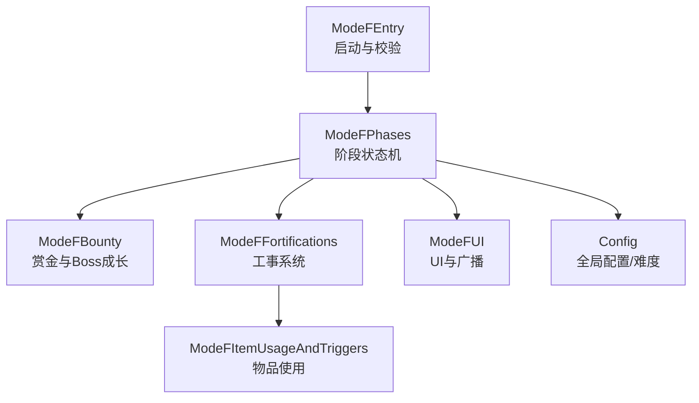
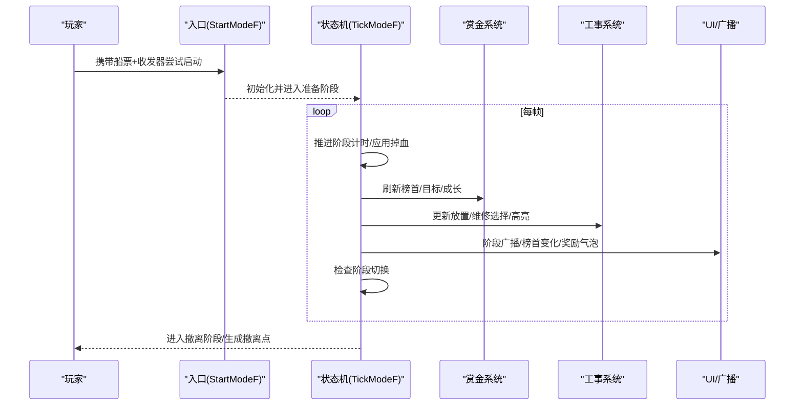
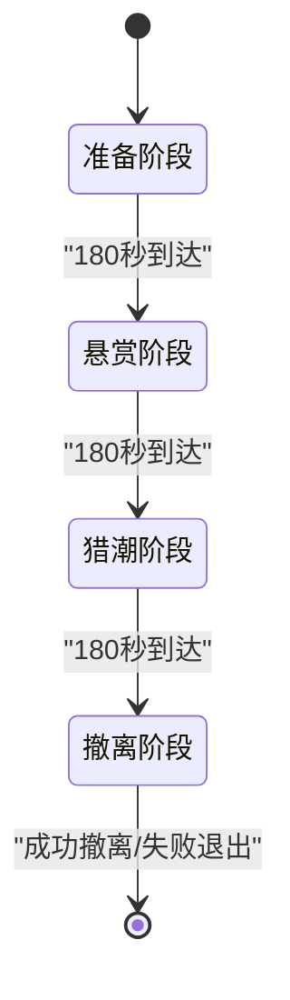
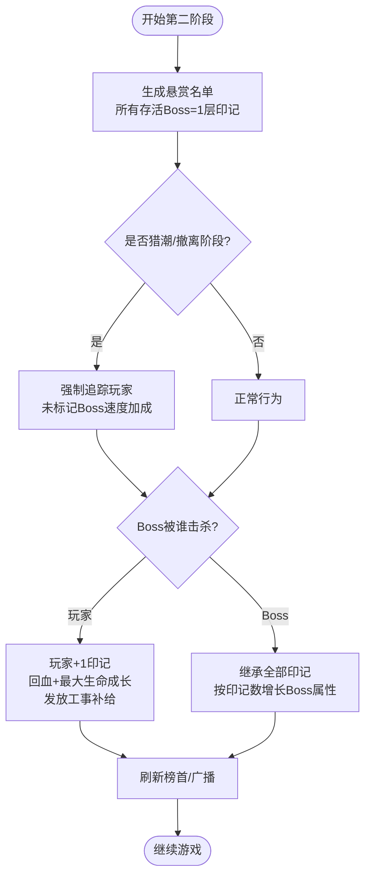
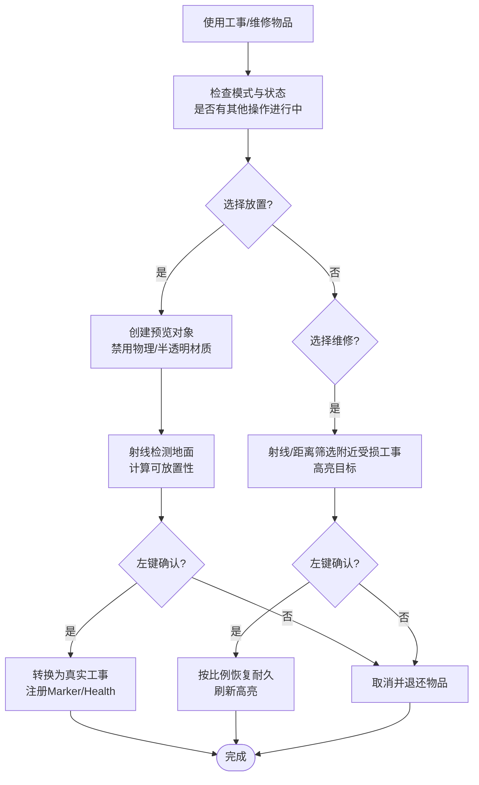
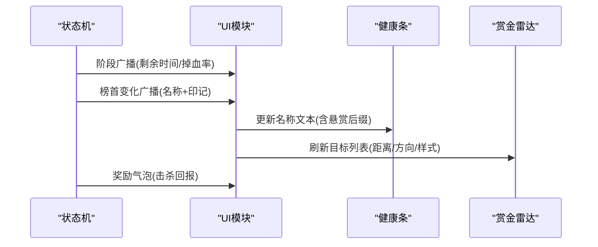
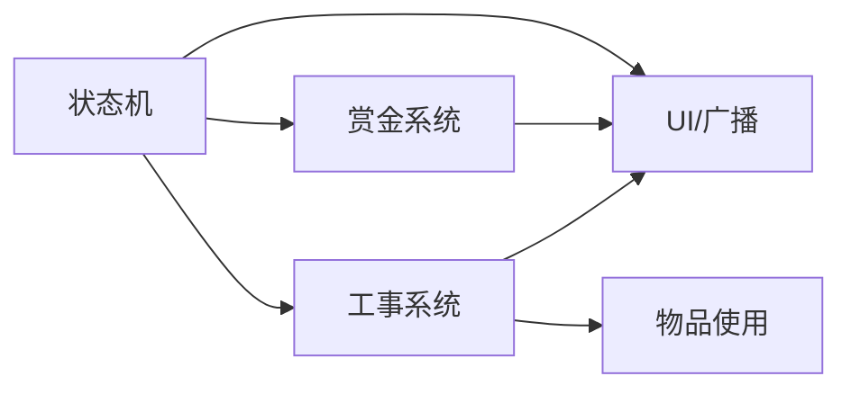

# Mode F：血猎追击

<cite>
**本文引用的文件**
- [ModeFEntry.cs](file://ModeF/ModeFEntry.cs)
- [ModeFPhases.cs](file://ModeF/ModeFPhases.cs)
- [ModeFBounty.cs](file://ModeF/ModeFBounty.cs)
- [ModeFFortifications.cs](file://ModeF/ModeFFortifications.cs)
- [ModeFModels.cs](file://ModeF/ModeFModels.cs)
- [ModeFUI.cs](file://ModeF/ModeFUI.cs)
- [ModeFItemUsageAndTriggers.cs](file://ModeF/ModeFItemUsageAndTriggers.cs)
- [Config.cs](file://Config/Config.cs)
</cite>

## 目录
1. [简介](#简介)
2. [项目结构](#项目结构)
3. [核心组件](#核心组件)
4. [架构总览](#架构总览)
5. [详细组件分析](#详细组件分析)
6. [依赖关系分析](#依赖关系分析)
7. [性能与优化](#性能与优化)
8. [故障排查指南](#故障排查指南)
9. [结论](#结论)
10. [附录](#附录)

## 简介
Mode F“血猎追击”是一个以“持续掉血 + 悬赏追踪 + 工事防守 + 最终撤离”为核心的四阶段高压力玩法。玩家需裸装入场，携带特定道具进入模式；在准备阶段布置防线、熟悉地图；随后进入悬赏阶段，Boss 被标记并逐步强化；猎潮阶段所有 Boss 全面追杀；最后生成撤离点，进行最终决战与撤离。

该模式通过状态机驱动阶段推进，结合赏金系统（印记继承与榜首广播）、工事系统（放置、维修、耐久）和 UI/音效提示，形成“准备装备—躲避追捕—建立防线—最终决战”的循环体验。

## 项目结构
Mode F 的核心代码集中在 ModeF 目录下，按职责拆分：
- 入口与启动流程：ModeFEntry.cs
- 阶段状态机与掉血/回血/成长：ModeFPhases.cs
- 赏金系统与 Boss 成长/掠夺：ModeFBounty.cs
- 工事放置/维修/耐久：ModeFFortifications.cs
- 数据模型与枚举：ModeFModels.cs
- UI 反馈与雷达：ModeFUI.cs
- 物品使用与触发：ModeFItemUsageAndTriggers.cs
- 全局配置与难度调节：Config.cs

**图表来源**
- [ModeFEntry.cs:65-164](file://ModeF/ModeFEntry.cs#L65-L164)
- [ModeFPhases.cs:56-245](file://ModeF/ModeFPhases.cs#L56-L245)
- [ModeFBounty.cs:65-114](file://ModeF/ModeFBounty.cs#L65-L114)
- [ModeFFortifications.cs:202-261](file://ModeF/ModeFFortifications.cs#L202-L261)
- [ModeFItemUsageAndTriggers.cs:43-97](file://ModeF/ModeFItemUsageAndTriggers.cs#L43-L97)
- [Config.cs:38-81](file://Config/Config.cs#L38-L81)

**章节来源**
- [ModeFEntry.cs:65-164](file://ModeF/ModeFEntry.cs#L65-L164)
- [ModeFPhases.cs:56-245](file://ModeF/ModeFPhases.cs#L56-L245)
- [ModeFBounty.cs:65-114](file://ModeF/ModeFBounty.cs#L65-L114)
- [ModeFFortifications.cs:202-261](file://ModeF/ModeFFortifications.cs#L202-L261)
- [ModeFItemUsageAndTriggers.cs:43-97](file://ModeF/ModeFItemUsageAndTriggers.cs#L43-L97)
- [Config.cs:38-81](file://Config/Config.cs#L38-L81)

## 核心组件
- 阶段状态机：负责四阶段切换、掉血速率、回血与最大生命成长、Boss 目标强制与速度加成。
- 赏金系统：生成悬赏名单、Boss 间印记继承、玩家击杀奖励、榜首广播与名称后缀。
- 工事系统：三种工事类型、放置预览、碰撞检测、维修选择、耐久度与高亮。
- UI 与提示：阶段广播、榜首变化、奖励气泡、健康条名称覆盖、赏金雷达。
- 物品使用：折叠掩体包、加固路障包、阻滞铁丝网、紧急修复喷雾的使用绑定与退款逻辑。
- 配置与难度：全局开关与数值（如变异词条数量、掉落随机化等），影响模式体验。

**章节来源**
- [ModeFPhases.cs:56-245](file://ModeF/ModeFPhases.cs#L56-L245)
- [ModeFBounty.cs:65-114](file://ModeF/ModeFBounty.cs#L65-L114)
- [ModeFFortifications.cs:138-261](file://ModeF/ModeFFortifications.cs#L138-L261)
- [ModeFUI.cs:286-350](file://ModeF/ModeFUI.cs#L286-L350)
- [ModeFItemUsageAndTriggers.cs:43-97](file://ModeF/ModeFItemUsageAndTriggers.cs#L43-L97)
- [Config.cs:38-81](file://Config/Config.cs#L38-L81)

## 架构总览
Mode F 的运行由“入口校验 → 初始化 → 状态机 Tick → 子系统联动（赏金/工事/UI）→ 退出清理”构成。每帧 Tick 中推进阶段计时、应用掉血、刷新 Boss 目标与工事高亮、检查阶段切换。

**图表来源**
- [ModeFEntry.cs:262-396](file://ModeF/ModeFEntry.cs#L262-L396)
- [ModeFPhases.cs:96-245](file://ModeF/ModeFPhases.cs#L96-L245)
- [ModeFBounty.cs:65-114](file://ModeF/ModeFBounty.cs#L65-L114)
- [ModeFFortifications.cs:334-452](file://ModeF/ModeFFortifications.cs#L334-L452)
- [ModeFUI.cs:286-350](file://ModeF/ModeFUI.cs#L286-L350)

## 详细组件分析

### 四阶段状态机与转换条件
- 准备阶段（180秒，掉血率约1%/s）：允许部署工事、熟悉环境。
- 悬赏阶段（180秒，掉血率约1.5%/s）：生成悬赏名单，所有存活 Boss 初始获得1层印记；Boss 间可继承印记并成长。
- 猎潮阶段（180秒，掉血率约2%/s）：未标记 Boss 获得额外速度加成，强制追踪玩家。
- 撤离阶段（无限，掉血率约3%/s）：生成撤离点，速撤。
- 持续补位：Boss 死亡或被完整性检查判定失效后立即补 1 只，从准备阶段起覆盖全局；两条路径移除活跃引用后都由 `finally` 结算补位债务，奖励、掉落或清理异常不会让缺口永久丢失。补位逐只异步执行，同一时间最多 1 个生成任务，不会无上限增加场上总量。

阶段切换由阶段计时达到持续时间触发；每15秒广播当前阶段剩余时间或撤离提示。

**图表来源**
- [ModeFPhases.cs:14-33](file://ModeF/ModeFPhases.cs#L14-L33)
- [ModeFPhases.cs:167-245](file://ModeF/ModeFPhases.cs#L167-L245)
- [ModeFPhases.cs:247-334](file://ModeF/ModeFPhases.cs#L247-L334)

**章节来源**
- [ModeFPhases.cs:14-33](file://ModeF/ModeFPhases.cs#L14-L33)
- [ModeFPhases.cs:167-245](file://ModeF/ModeFPhases.cs#L167-L245)
- [ModeFPhases.cs:247-334](file://ModeF/ModeFPhases.cs#L247-L334)

### 赏金系统：目标选择、追踪机制与奖励发放
- 目标选择：第二阶段开始时为所有存活 Boss 分配1层印记，并在健康条上显示“悬赏X”。
- 追踪机制：猎潮与撤离阶段对未标记 Boss 施加速度加成并强制追踪玩家；榜首变化会广播。
- 奖励发放：玩家击杀带印记 Boss 获得+1玩家印记；Boss 被 Boss 击杀时继承全部印记并按印记数增长最大生命与伤害；玩家击杀后回血与最大生命成长，同时发放工事补给。

**图表来源**
- [ModeFBounty.cs:65-114](file://ModeF/ModeFBounty.cs#L65-L114)
- [ModeFBounty.cs:116-208](file://ModeF/ModeFBounty.cs#L116-L208)
- [ModeFBounty.cs:210-311](file://ModeF/ModeFBounty.cs#L210-L311)
- [ModeFPhases.cs:725-794](file://ModeF/ModeFPhases.cs#L725-L794)

**章节来源**
- [ModeFBounty.cs:65-114](file://ModeF/ModeFBounty.cs#L65-L114)
- [ModeFBounty.cs:116-208](file://ModeF/ModeFBounty.cs#L116-L208)
- [ModeFBounty.cs:210-311](file://ModeF/ModeFBounty.cs#L210-L311)
- [ModeFPhases.cs:725-794](file://ModeF/ModeFPhases.cs#L725-L794)

### 工事系统：构建与维护
- 工事类型：折叠掩体、加固路障、阻滞铁丝网，各有不同耐久与碰撞体积。
- 放置流程：进入放置模式，鼠标射线检测地面，颜色反馈可放置性，左键确认放置，右键取消；低端机优化限制 Raycast 层与活动工事上限。
- 维修流程：进入维修选择模式，靠近鼠标的受损工事高亮，左键确认维修，右键取消；每次维修按比例恢复耐久。
- 耐久管理：每个工事有独立 Health 与监听器，损坏日志间隔输出；销毁时清理高亮与引用。

**图表来源**
- [ModeFFortifications.cs:202-261](file://ModeF/ModeFFortifications.cs#L202-L261)
- [ModeFFortifications.cs:269-408](file://ModeF/ModeFFortifications.cs#L269-L408)
- [ModeFFortifications.cs:410-500](file://ModeF/ModeFFortifications.cs#L410-L500)
- [ModeFFortifications.cs:502-544](file://ModeF/ModeFFortifications.cs#L502-L544)

**章节来源**
- [ModeFFortifications.cs:202-261](file://ModeF/ModeFFortifications.cs#L202-L261)
- [ModeFFortifications.cs:269-408](file://ModeF/ModeFFortifications.cs#L269-L408)
- [ModeFFortifications.cs:410-500](file://ModeF/ModeFFortifications.cs#L410-L500)
- [ModeFFortifications.cs:502-544](file://ModeF/ModeFFortifications.cs#L502-L544)

### 视觉提示、UI反馈与音效设计
- 阶段广播：每15秒显示当前阶段剩余时间或撤离提示，包含掉血率信息。
- 榜首变化：当榜首变更时广播新榜首名称与印记数；玩家为榜首时特殊处理。
- 健康条名称：动态覆盖 Boss 与玩家的健康条名称，附加“悬赏X”后缀。
- 奖励气泡：击杀回报以气泡形式展示回血量与最大生命成长。
- 赏金雷达：屏幕边缘显示最近 Boss 方向与距离，区分普通与榜首样式。

**图表来源**
- [ModeFUI.cs:286-350](file://ModeF/ModeFUI.cs#L286-L350)
- [ModeFUI.cs:375-388](file://ModeF/ModeFUI.cs#L375-L388)
- [ModeFUI.cs:422-536](file://ModeF/ModeFUI.cs#L422-L536)
- [ModeFUI.cs:555-582](file://ModeF/ModeFUI.cs#L555-L582)

**章节来源**
- [ModeFUI.cs:286-350](file://ModeF/ModeFUI.cs#L286-L350)
- [ModeFUI.cs:375-388](file://ModeF/ModeFUI.cs#L375-L388)
- [ModeFUI.cs:422-536](file://ModeF/ModeFUI.cs#L422-L536)
- [ModeFUI.cs:555-582](file://ModeF/ModeFUI.cs#L555-L582)

### 通关策略与资源管理技巧
- 准备阶段：优先部署阻滞铁丝网与加固路障组合，利用地形卡位；预留折叠掩体用于移动掩护。
- 悬赏阶段：集中火力优先击杀带印记 Boss，获取回血与最大生命成长；避免无谓消耗。
- 猎潮阶段：利用工事拖延未标记 Boss，保持移动；注意维修喷雾的使用时机。
- 撤离阶段：快速向撤离点移动，沿途保留至少一个工事作为临时掩体；合理分配弹药与回复。

[本节为通用策略建议，不直接分析具体文件]

### 难度调节与自定义配置
- 全局配置项：包括变异词条数量、掉落随机化、Boss 数值倍率等，可通过本地文件或 ModConfig 模组动态调整。
- 模式内影响：变异词条可影响流血速率、敌人强度等；掉落随机化影响战利品质量与数量。
- 自定义方法：编辑配置文件或使用 ModConfig 界面实时修改，部分选项即时生效（如波次间隔），部分需重启或下一局生效。

**章节来源**
- [Config.cs:38-81](file://Config/Config.cs#L38-L81)
- [Config.cs:155-232](file://Config/Config.cs#L155-L232)
- [Config.cs:234-407](file://Config/Config.cs#L234-L407)
- [Config.cs:588-704](file://Config/Config.cs#L588-L704)

## 依赖关系分析
Mode F 各组件之间存在明确依赖：
- 状态机依赖赏金系统（刷新榜首/目标）、工事系统（高亮/维修选择）、UI（广播/名称）。
- 赏金系统依赖状态机（阶段压力/目标强制）与 UI（广播/名称后缀）。
- 工事系统依赖状态机（活动工事列表/高亮）与物品使用（放置/维修）。
- UI 依赖状态机（阶段/榜首）与赏金系统（名称后缀）。

**图表来源**
- [ModeFPhases.cs:96-245](file://ModeF/ModeFPhases.cs#L96-L245)
- [ModeFBounty.cs:65-114](file://ModeF/ModeFBounty.cs#L65-L114)
- [ModeFFortifications.cs:334-452](file://ModeF/ModeFFortifications.cs#L334-L452)
- [ModeFUI.cs:286-350](file://ModeF/ModeFUI.cs#L286-L350)
- [ModeFItemUsageAndTriggers.cs:43-97](file://ModeF/ModeFItemUsageAndTriggers.cs#L43-L97)

**章节来源**
- [ModeFPhases.cs:96-245](file://ModeF/ModeFPhases.cs#L96-L245)
- [ModeFBounty.cs:65-114](file://ModeF/ModeFBounty.cs#L65-L114)
- [ModeFFortifications.cs:334-452](file://ModeF/ModeFFortifications.cs#L334-L452)
- [ModeFUI.cs:286-350](file://ModeF/ModeFUI.cs#L286-L350)
- [ModeFItemUsageAndTriggers.cs:43-97](file://ModeF/ModeFItemUsageAndTriggers.cs#L43-L97)

## 性能与优化
- 低端机防御：工事放置 Raycast 收敛到有限层，避免全层扫描；活动工事硬上限防止拖垮渲染/物理。
- 缓存与复用：健康条查找间隔、相机缓存、高亮 Outline 延迟销毁减少频繁创建销毁。
- 事件节流：阶段广播每15秒一次，Boss 目标刷新每1.5秒一次，降低每帧压力。
- 内存与对象池：使用 Scratch 列表与字典缓存减少分配；工事故障日志间隔输出。

[本节提供一般性指导，不直接分析具体文件]

## 故障排查指南
- 启动失败：检查是否满足裸装条件、是否持有船票与血猎收发器、是否检测到营旗；失败时会返还已消耗道具。
- 阶段卡住：检查阶段计时与持续时间常量是否正确；查看日志中的阶段广播与切换调用。
- 工事无法放置：确认是否达到活动工事上限；检查 Raycast 命中与可放置性判断；查看错误日志。
- 维修无效：确认是否在维修选择模式且附近有受损工事；检查高亮目标与距离判定。
- UI 异常：检查健康条名称缓存版本与语言切换；赏金雷达刷新间隔与目标列表。

**章节来源**
- [ModeFEntry.cs:65-164](file://ModeF/ModeFEntry.cs#L65-L164)
- [ModeFPhases.cs:167-245](file://ModeF/ModeFPhases.cs#L167-L245)
- [ModeFFortifications.cs:202-261](file://ModeF/ModeFFortifications.cs#L202-L261)
- [ModeFFortifications.cs:410-500](file://ModeF/ModeFFortifications.cs#L410-L500)
- [ModeFUI.cs:286-350](file://ModeF/ModeFUI.cs#L286-L350)

## 结论
Mode F“血猎追击”通过严谨的状态机与多子系统协作，构建了高压力、高策略性的玩法循环。赏金系统驱动 Boss 行为与成长，工事系统提供战术纵深，UI 反馈确保信息透明。配合配置系统可实现难度调节与个性化体验。建议在实战中注重资源管理与工事布局，合理利用阶段特性达成撤离目标。

[本节为总结性内容，不直接分析具体文件]

## 附录
- 关键常量参考：阶段时长、掉血率、回血比例、最大生命成长、强制追踪距离等。
- 数据结构参考：ModeFState、ModeFFortificationMarker、ModeFBossDisplayNameMarker。
- 物品类型参考：折叠掩体包、加固路障包、阻滞铁丝网、紧急修复喷雾。

**章节来源**
- [ModeFPhases.cs:14-33](file://ModeF/ModeFPhases.cs#L14-L33)
- [ModeFModels.cs:23-98](file://ModeF/ModeFModels.cs#L23-L98)
- [ModeFItemUsageAndTriggers.cs:43-97](file://ModeF/ModeFItemUsageAndTriggers.cs#L43-L97)
