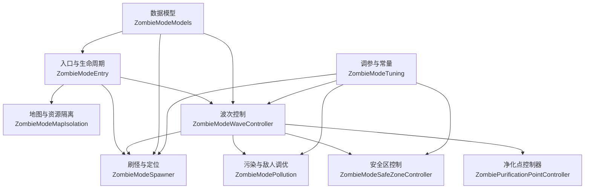
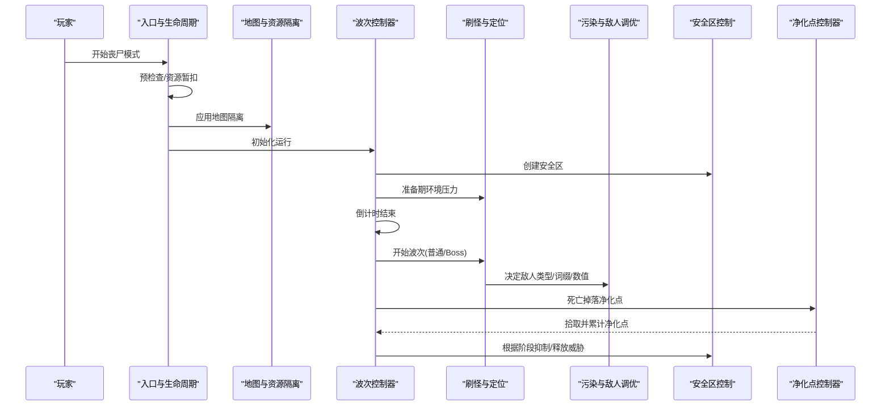
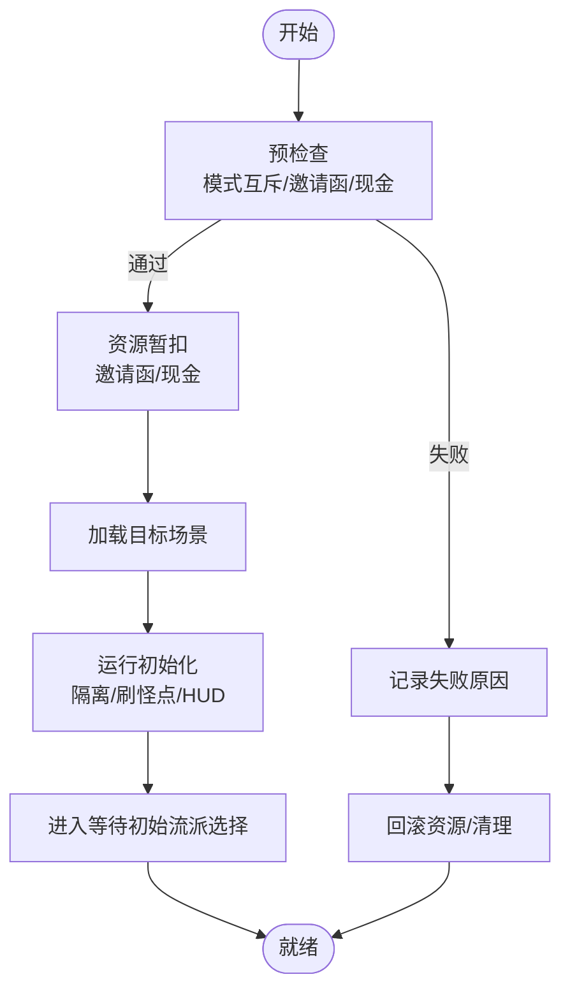
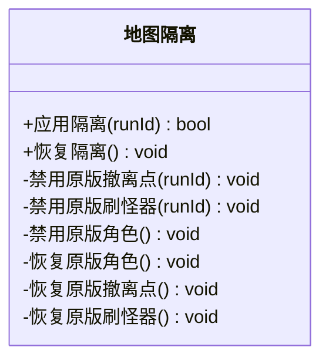
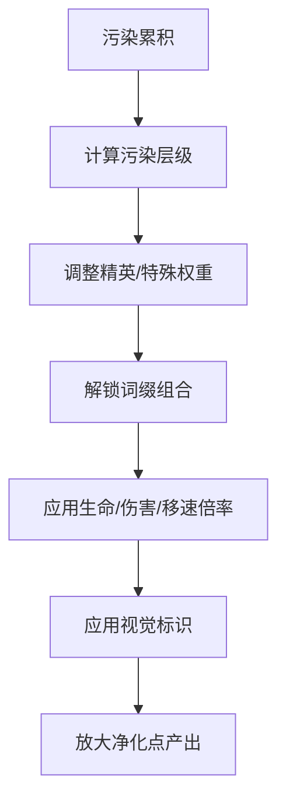
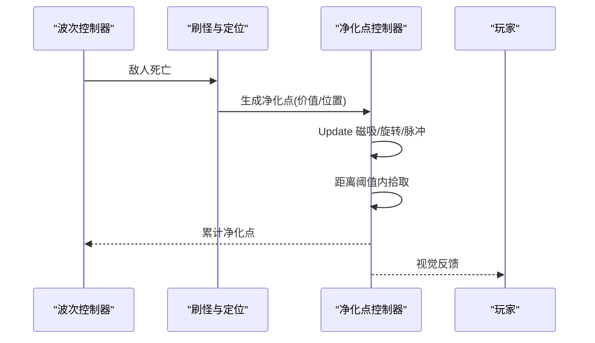
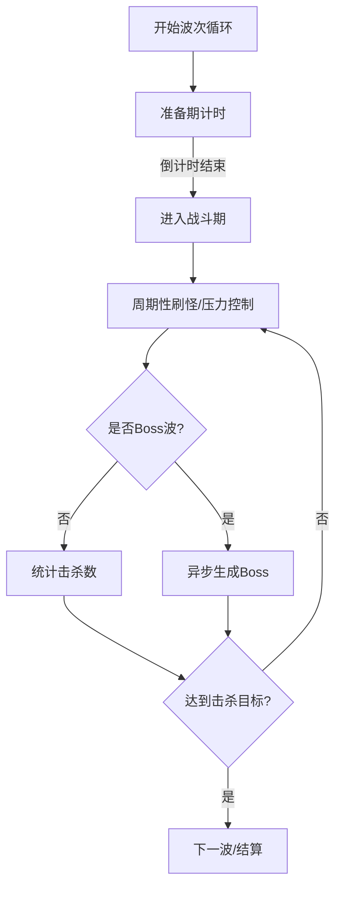
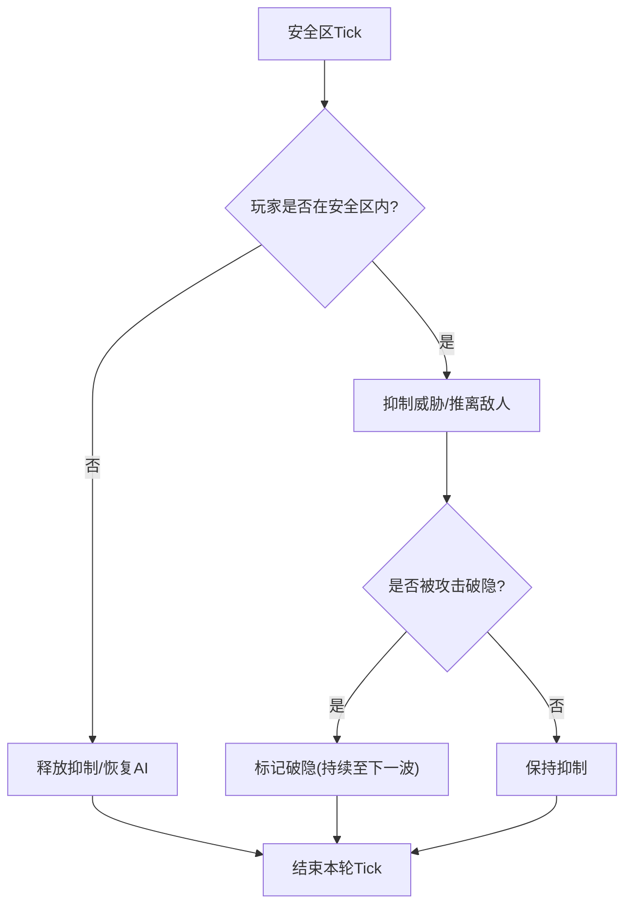
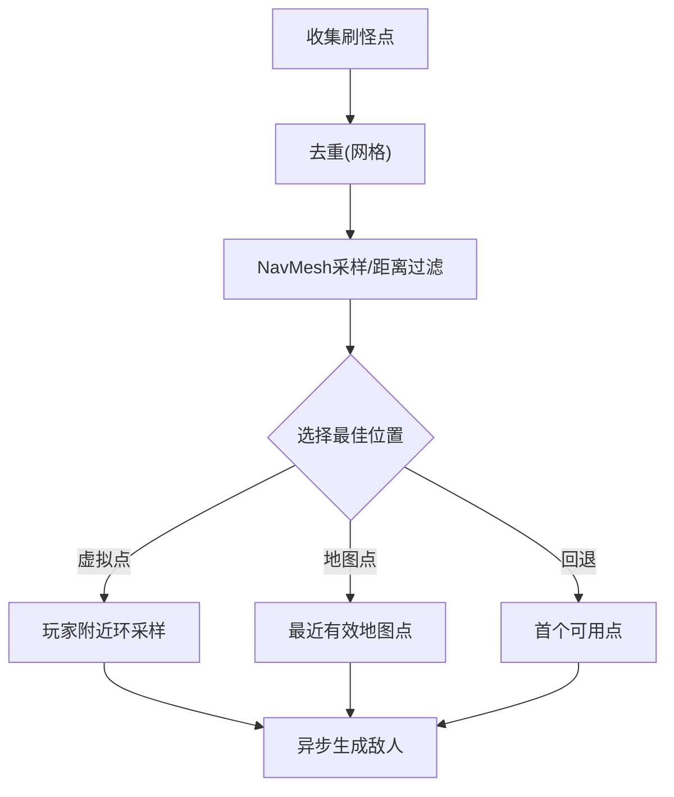
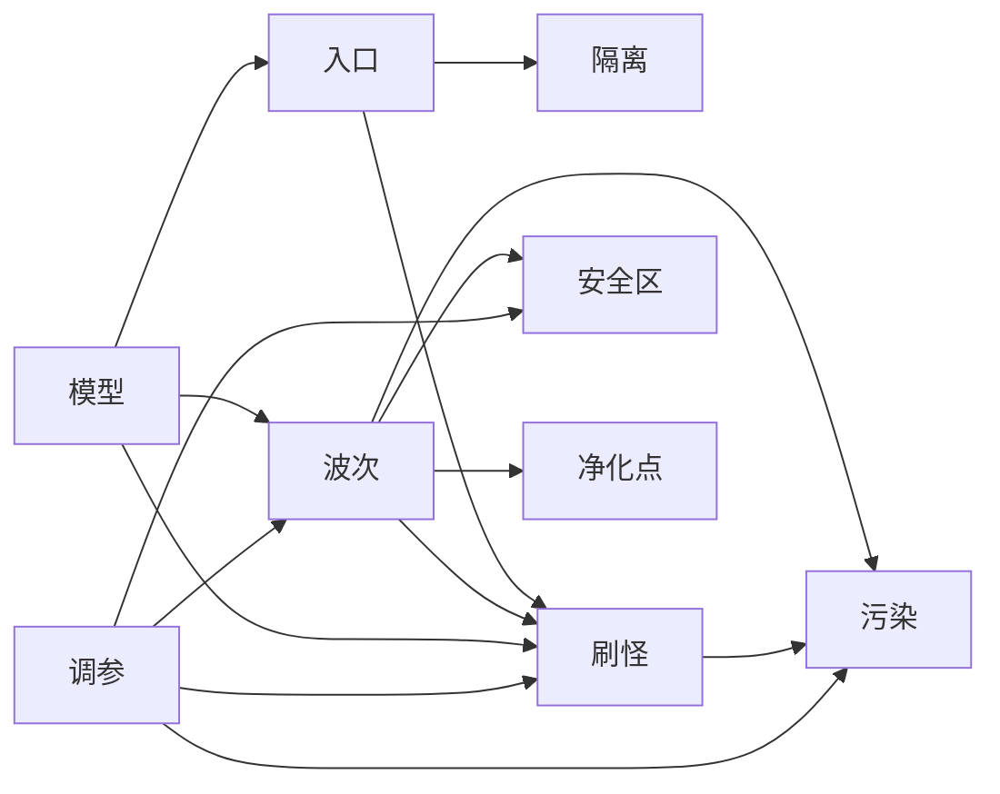

# 僵尸模式

<cite>
**本文引用的文件**
- [ZombieModeEntry.cs](file://ZombieMode/ZombieModeEntry.cs)
- [ZombieModeMapIsolation.cs](file://ZombieMode/ZombieModeMapIsolation.cs)
- [ZombieModePollution.cs](file://ZombieMode/ZombieModePollution.cs)
- [ZombiePurificationPointController.cs](file://ZombieMode/ZombiePurificationPointController.cs)
- [ZombieModeWaveController.cs](file://ZombieMode/ZombieModeWaveController.cs)
- [ZombieModeSafeZoneController.cs](file://ZombieMode/ZombieModeSafeZoneController.cs)
- [ZombieModeSpawner.cs](file://ZombieMode/ZombieModeSpawner.cs)
- [ZombieModeModels.cs](file://ZombieMode/ZombieModeModels.cs)
- [ZombieModeTuning.cs](file://ZombieMode/ZombieModeTuning.cs)
</cite>

## 目录
1. [简介](#简介)
2. [项目结构](#项目结构)
3. [核心组件](#核心组件)
4. [架构总览](#架构总览)
5. [详细组件分析](#详细组件分析)
6. [依赖关系分析](#依赖关系分析)
7. [性能考量](#性能考量)
8. [故障排除指南](#故障排除指南)
9. [结论](#结论)
10. [附录：生存策略与调参建议](#附录生存策略与调参建议)

## 简介
本文件为“僵尸模式”独立生存玩法的完整技术文档。该模式通过运行时隔离、独立资源管理与状态保存，构建与主游戏解耦的波次对抗体验。核心机制包括污染系统（累积、叠加、净化）、净化点经济（生成、消耗、奖励）、波次控制器（敌人生成、难度递增、特殊事件）、安全区系统（庇护所设置、保护范围、限制规则），以及完整的生存流程与优化建议。

## 项目结构
僵尸模式以 ModBehaviour 为核心协调者，按职责拆分为多个子系统：
- 入场与生命周期：ZombieModeEntry、ZombieModeRuntimeModule
- 地图与资源隔离：ZombieModeMapIsolation
- 污染与敌人调优：ZombieModePollution
- 净化点拾取：ZombiePurificationPointController
- 波次控制：ZombieModeWaveController
- 安全区：ZombieModeSafeZoneController
- 刷怪与位置选择：ZombieModeSpawner
- 数据模型与常量：ZombieModeModels、ZombieModeTuning

**图表来源**
- [ZombieModeEntry.cs:15-119](file://ZombieMode/ZombieModeEntry.cs#L15-L119)
- [ZombieModeMapIsolation.cs:21-33](file://ZombieMode/ZombieModeMapIsolation.cs#L21-L33)
- [ZombieModeSpawner.cs:18-44](file://ZombieMode/ZombieModeSpawner.cs#L18-L44)
- [ZombieModeWaveController.cs:312-376](file://ZombieMode/ZombieModeWaveController.cs#L312-L376)
- [ZombieModePollution.cs:362-415](file://ZombieMode/ZombieModePollution.cs#L362-L415)
- [ZombieModeSafeZoneController.cs:9-39](file://ZombieMode/ZombieModeSafeZoneController.cs#L9-L39)
- [ZombiePurificationPointController.cs:50-114](file://ZombieMode/ZombiePurificationPointController.cs#L50-L114)
- [ZombieModeModels.cs:8-32](file://ZombieMode/ZombieModeModels.cs#L8-L32)
- [ZombieModeTuning.cs:44-128](file://ZombieMode/ZombieModeTuning.cs#L44-L128)

**章节来源**
- [ZombieModeEntry.cs:15-119](file://ZombieMode/ZombieModeEntry.cs#L15-L119)
- [ZombieModeModels.cs:8-32](file://ZombieMode/ZombieModeModels.cs#L8-L32)
- [ZombieModeTuning.cs:44-128](file://ZombieMode/ZombieModeTuning.cs#L44-L128)

## 核心组件
- 入场与生命周期管理：负责预检查、资源暂扣、场景加载、初始化运行、暂停/恢复、失败回滚等。
- 地图与资源隔离：禁用原版刷怪器、撤离点、角色，保留必要中立实体，确保模式内生态独立。
- 污染系统：根据波次与污染值动态调整精英/特殊敌人权重、词缀组合、数值倍率，并影响净化点产出。
- 净化点经济：击杀掉落星形净化点，自动磁吸与拾取，累计为净化点数；可用于兑换奖励或提升难度。
- 波次控制器：维护准备期/战斗期/结算期，周期性刷怪、Boss 波、压力目标、批量生成与间隔控制。
- 安全区系统：在准备期提供庇护所，推离进入的敌人，抑制仇恨，玩家攻击破隐后持续至下一波。
- 刷怪与定位：收集地图静态刷怪点与虚拟点，去重、NavMesh 采样、距离约束，异步生成普通与 Boss 单位。
- 数据模型与调参：集中定义阶段枚举、运行态、刷新成本、压力曲线、Boss 基础数值等。

**章节来源**
- [ZombieModeEntry.cs:147-240](file://ZombieMode/ZombieModeEntry.cs#L147-L240)
- [ZombieModeMapIsolation.cs:21-33](file://ZombieMode/ZombieModeMapIsolation.cs#L21-L33)
- [ZombieModePollution.cs:578-645](file://ZombieMode/ZombieModePollution.cs#L578-L645)
- [ZombiePurificationPointController.cs:214-297](file://ZombieMode/ZombiePurificationPointController.cs#L214-L297)
- [ZombieModeWaveController.cs:278-376](file://ZombieMode/ZombieModeWaveController.cs#L278-L376)
- [ZombieModeSafeZoneController.cs:9-39](file://ZombieMode/ZombieModeSafeZoneController.cs#L9-L39)
- [ZombieModeSpawner.cs:150-191](file://ZombieMode/ZombieModeSpawner.cs#L150-L191)
- [ZombieModeModels.cs:672-747](file://ZombieMode/ZombieModeModels.cs#L672-L747)
- [ZombieModeTuning.cs:390-460](file://ZombieMode/ZombieModeTuning.cs#L390-L460)

## 架构总览
僵尸模式采用“中心协调 + 子系统协作”的架构：
- 入口模块负责状态机推进与资源事务，保证失败可回滚。
- 波次控制器驱动节奏，协调刷怪、安全区、净化点、事件触发。
- 污染系统贯穿敌人类型、词缀、数值与视觉标识。
- 安全区在准备期提供缓冲，限制敌人行为，增强策略性。
- 刷怪器基于地图配置与运行时采样，保证稳定落点与性能。

**图表来源**
- [ZombieModeEntry.cs:103-133](file://ZombieMode/ZombieModeEntry.cs#L103-L133)
- [ZombieModeMapIsolation.cs:21-33](file://ZombieMode/ZombieModeMapIsolation.cs#L21-L33)
- [ZombieModeWaveController.cs:278-376](file://ZombieMode/ZombieModeWaveController.cs#L278-L376)
- [ZombieModeSpawner.cs:305-405](file://ZombieMode/ZombieModeSpawner.cs#L305-L405)
- [ZombieModePollution.cs:362-415](file://ZombieMode/ZombieModePollution.cs#L362-L415)
- [ZombieModeSafeZoneController.cs:9-39](file://ZombieMode/ZombieModeSafeZoneController.cs#L9-L39)
- [ZombiePurificationPointController.cs:50-114](file://ZombieMode/ZombiePurificationPointController.cs#L50-L114)

## 详细组件分析

### 入场与生命周期（隔离机制与资源管理）
- 预检查：校验其他模式互斥、邀请函与现金是否足够，失败则返回原因。
- 资源暂扣：扣除邀请函与现金，记录暂扣标记；若后续失败，自动退还。
- 场景加载：等待目标子场景激活并完成初始化，再转入运行初始化。
- 运行初始化：转移物品、收集刷怪点、应用地图隔离、发放信标、注册事件、创建 HUD。
- 失败回滚：根据阶段决定是否退回基地，清理临时对象与事件监听。

**图表来源**
- [ZombieModeEntry.cs:147-240](file://ZombieMode/ZombieModeEntry.cs#L147-L240)
- [ZombieModeEntry.cs:312-424](file://ZombieMode/ZombieModeEntry.cs#L312-L424)
- [ZombieModeEntry.cs:589-636](file://ZombieMode/ZombieModeEntry.cs#L589-L636)
- [ZombieModeEntry.cs:664-722](file://ZombieMode/ZombieModeEntry.cs#L664-L722)

**章节来源**
- [ZombieModeEntry.cs:147-240](file://ZombieMode/ZombieModeEntry.cs#L147-L240)
- [ZombieModeEntry.cs:312-424](file://ZombieMode/ZombieModeEntry.cs#L312-L424)
- [ZombieModeEntry.cs:589-636](file://ZombieMode/ZombieModeEntry.cs#L589-L636)
- [ZombieModeEntry.cs:664-722](file://ZombieMode/ZombieModeEntry.cs#L664-L722)

### 地图与资源隔离
- 禁用原版刷怪器：复用 BossRush 进图逻辑，避免两套软隔离分支不一致。
- 禁用原版撤离点：记录原状态，支持恢复；跳过当前活动撤离区域。
- 隔离原版角色：排除玩家与友方，保留中立 NPC、商店、对话 actor 等白名单实体。
- 恢复流程：按顺序恢复角色、刷怪器、撤离点，清理运行时记录。

**图表来源**
- [ZombieModeMapIsolation.cs:21-33](file://ZombieMode/ZombieModeMapIsolation.cs#L21-L33)
- [ZombieModeMapIsolation.cs:42-113](file://ZombieMode/ZombieModeMapIsolation.cs#L42-L113)
- [ZombieModeMapIsolation.cs:115-134](file://ZombieMode/ZombieModeMapIsolation.cs#L115-L134)

**章节来源**
- [ZombieModeMapIsolation.cs:21-33](file://ZombieMode/ZombieModeMapIsolation.cs#L21-L33)
- [ZombieModeMapIsolation.cs:42-113](file://ZombieMode/ZombieModeMapIsolation.cs#L42-L113)
- [ZombieModeMapIsolation.cs:115-134](file://ZombieMode/ZombieModeMapIsolation.cs#L115-L134)

### 污染系统与敌人调优
- 污染累积：自然增长与契约引入两类污染，合计影响难度与收益。
- 效果叠加：随污染值提高精英/特殊敌人权重、词缀解锁层级、数值倍率（生命/伤害/移速）。
- 视觉标识：不同特殊/精英类型赋予缩放与着色，便于识别威胁等级。
- 净化点产出：根据敌人类型与污染步长放大基础值，上限受调参限制。

**图表来源**
- [ZombieModePollution.cs:362-415](file://ZombieMode/ZombieModePollution.cs#L362-L415)
- [ZombieModePollution.cs:417-435](file://ZombieMode/ZombieModePollution.cs#L417-L435)
- [ZombieModePollution.cs:472-521](file://ZombieMode/ZombieModePollution.cs#L472-L521)
- [ZombieModePollution.cs:578-645](file://ZombieMode/ZombieModePollution.cs#L578-L645)
- [ZombieModePollution.cs:647-795](file://ZombieMode/ZombieModePollution.cs#L647-L795)

**章节来源**
- [ZombieModePollution.cs:362-415](file://ZombieMode/ZombieModePollution.cs#L362-L415)
- [ZombieModePollution.cs:417-435](file://ZombieMode/ZombieModePollution.cs#L417-L435)
- [ZombieModePollution.cs:472-521](file://ZombieMode/ZombieModePollution.cs#L472-L521)
- [ZombieModePollution.cs:578-645](file://ZombieMode/ZombieModePollution.cs#L578-L645)
- [ZombieModePollution.cs:647-795](file://ZombieMode/ZombieModePollution.cs#L647-L795)

### 净化点经济系统
- 生成：敌人死亡时按类型与污染产出星形净化点，加入待处理队列。
- 拾取：每帧检测玩家距离，磁吸靠近并在阈值内自动拾取；超时自动回收。
- 累计：拾取后从队列移除并增加净化点数，供后续兑换或难度提升使用。
- 视觉：优先复用原版 SoulCube prefab，不可用时回退发光球体。

**图表来源**
- [ZombiePurificationPointController.cs:50-114](file://ZombieMode/ZombiePurificationPointController.cs#L50-L114)
- [ZombiePurificationPointController.cs:214-297](file://ZombieMode/ZombiePurificationPointController.cs#L214-L297)
- [ZombiePurificationPointController.cs:350-375](file://ZombieMode/ZombiePurificationPointController.cs#L350-L375)

**章节来源**
- [ZombiePurificationPointController.cs:50-114](file://ZombieMode/ZombiePurificationPointController.cs#L50-L114)
- [ZombiePurificationPointController.cs:214-297](file://ZombieMode/ZombiePurificationPointController.cs#L214-L297)
- [ZombiePurificationPointController.cs:350-375](file://ZombieMode/ZombiePurificationPointController.cs#L350-L375)

### 波次控制器工作流程
- 阶段管理：准备期（含初始准备与常规准备）、战斗期、结算期、撤离机会。
- 周期刷怪：按压力目标与批次大小周期性生成普通敌人，维持环境压力。
- Boss 波：每五波触发 Boss 波，按轮次递增数量与强度，异步生成。
- 完成判定：普通波达到击杀目标或 Boss 波全部击败即完成当前波。
- 事件触发：准备期可出现高价值空投或精英小队等地图事件。

**图表来源**
- [ZombieModeWaveController.cs:278-376](file://ZombieMode/ZombieModeWaveController.cs#L278-L376)
- [ZombieModeWaveController.cs:388-441](file://ZombieMode/ZombieModeWaveController.cs#L388-L441)
- [ZombieModeWaveController.cs:443-507](file://ZombieMode/ZombieModeWaveController.cs#L443-L507)
- [ZombieModeWaveController.cs:726-772](file://ZombieMode/ZombieModeWaveController.cs#L726-L772)

**章节来源**
- [ZombieModeWaveController.cs:278-376](file://ZombieMode/ZombieModeWaveController.cs#L278-L376)
- [ZombieModeWaveController.cs:388-441](file://ZombieMode/ZombieModeWaveController.cs#L388-L441)
- [ZombieModeWaveController.cs:443-507](file://ZombieMode/ZombieModeWaveController.cs#L443-L507)
- [ZombieModeWaveController.cs:726-772](file://ZombieMode/ZombieModeWaveController.cs#L726-L772)

### 安全区系统
- 庇护所设置：准备期创建安全区，半径与中心由调参与玩家位置决定。
- 保护范围：将进入安全区的敌人推离到边界外，抑制仇恨与追踪。
- 限制规则：玩家在安全区内使用枪械或近战攻击会“破隐”，破隐后持续至下一波；出区射击不破坏安全区。
- 可视化：更新安全区视觉与地图兴趣点，提示玩家当前状态。

**图表来源**
- [ZombieModeSafeZoneController.cs:9-39](file://ZombieMode/ZombieModeSafeZoneController.cs#L9-L39)
- [ZombieModeSafeZoneController.cs:41-75](file://ZombieMode/ZombieModeSafeZoneController.cs#L41-L75)
- [ZombieModeSafeZoneController.cs:77-161](file://ZombieMode/ZombieModeSafeZoneController.cs#L77-L161)
- [ZombieModeSafeZoneController.cs:163-266](file://ZombieMode/ZombieModeSafeZoneController.cs#L163-L266)

**章节来源**
- [ZombieModeSafeZoneController.cs:9-39](file://ZombieMode/ZombieModeSafeZoneController.cs#L9-L39)
- [ZombieModeSafeZoneController.cs:41-75](file://ZombieMode/ZombieModeSafeZoneController.cs#L41-L75)
- [ZombieModeSafeZoneController.cs:77-161](file://ZombieMode/ZombieModeSafeZoneController.cs#L77-L161)
- [ZombieModeSafeZoneController.cs:163-266](file://ZombieMode/ZombieModeSafeZoneController.cs#L163-L266)

### 刷怪与定位
- 刷怪点收集：优先读取地图配置的静态点，若无则回退到缓存的原版刷怪器位置。
- 去重与采样：网格去重、NavMesh 采样、最小玩家距离约束，避免重叠与贴脸。
- 异步生成：普通与 Boss 均通过异步任务生成，支持暂停中断与失败降级。
- 位置选择：优先虚拟点（玩家附近环），其次最近有效地图点，最后回退到首个可用点。

**图表来源**
- [ZombieModeSpawner.cs:18-44](file://ZombieMode/ZombieModeSpawner.cs#L18-L44)
- [ZombieModeSpawner.cs:81-148](file://ZombieMode/ZombieModeSpawner.cs#L81-L148)
- [ZombieModeSpawner.cs:150-191](file://ZombieMode/ZombieModeSpawner.cs#L150-L191)
- [ZombieModeSpawner.cs:255-303](file://ZombieMode/ZombieModeSpawner.cs#L255-L303)
- [ZombieModeSpawner.cs:305-405](file://ZombieMode/ZombieModeSpawner.cs#L305-L405)

**章节来源**
- [ZombieModeSpawner.cs:18-44](file://ZombieMode/ZombieModeSpawner.cs#L18-L44)
- [ZombieModeSpawner.cs:81-148](file://ZombieMode/ZombieModeSpawner.cs#L81-L148)
- [ZombieModeSpawner.cs:150-191](file://ZombieMode/ZombieModeSpawner.cs#L150-L191)
- [ZombieModeSpawner.cs:255-303](file://ZombieMode/ZombieModeSpawner.cs#L255-L303)
- [ZombieModeSpawner.cs:305-405](file://ZombieMode/ZombieModeSpawner.cs#L305-L405)

## 依赖关系分析
- 入口模块依赖地图隔离与刷怪器，确保进入后可用性与稳定性。
- 波次控制器依赖安全区、刷怪器、污染系统，形成节奏与难度闭环。
- 净化点控制器依赖入口回调，统一累计净化点。
- 数据模型与调参贯穿所有子系统，提供一致的状态与常量。

**图表来源**
- [ZombieModeEntry.cs:103-133](file://ZombieMode/ZombieModeEntry.cs#L103-L133)
- [ZombieModeWaveController.cs:312-376](file://ZombieMode/ZombieModeWaveController.cs#L312-L376)
- [ZombieModeSpawner.cs:305-405](file://ZombieMode/ZombieModeSpawner.cs#L305-L405)
- [ZombieModePollution.cs:362-415](file://ZombieMode/ZombieModePollution.cs#L362-L415)
- [ZombieModeSafeZoneController.cs:9-39](file://ZombieMode/ZombieModeSafeZoneController.cs#L9-L39)
- [ZombieModeModels.cs:672-747](file://ZombieMode/ZombieModeModels.cs#L672-L747)
- [ZombieModeTuning.cs:390-460](file://ZombieMode/ZombieModeTuning.cs#L390-L460)

**章节来源**
- [ZombieModeEntry.cs:103-133](file://ZombieMode/ZombieModeEntry.cs#L103-L133)
- [ZombieModeWaveController.cs:312-376](file://ZombieMode/ZombieModeWaveController.cs#L312-L376)
- [ZombieModeSpawner.cs:305-405](file://ZombieMode/ZombieModeSpawner.cs#L305-L405)
- [ZombieModePollution.cs:362-415](file://ZombieMode/ZombieModePollution.cs#L362-L415)
- [ZombieModeSafeZoneController.cs:9-39](file://ZombieMode/ZombieModeSafeZoneController.cs#L9-L39)
- [ZombieModeModels.cs:672-747](file://ZombieMode/ZombieModeModels.cs#L672-L747)
- [ZombieModeTuning.cs:390-460](file://ZombieMode/ZombieModeTuning.cs#L390-L460)

## 性能考量
- 热路径早返：全局事件处理器在非丧尸模式或无效 runId 时直接返回，避免 marker 查询开销。
- 对象池与缓存：共享平面区域 mesh/material、SoulCube prefab 缓存、玩家 Transform 帧级缓存。
- 异步生成：刷怪与 Boss 生成使用异步任务，支持暂停中断与失败降级，减少卡顿。
- 去重与采样：刷怪点网格去重、NavMesh 采样与距离约束，降低重复与碰撞问题。
- 视觉优化：仅对安全渲染树进行缩放与着色，避免修改根节点导致物理/导航异常。

**章节来源**
- [ZombieModeWaveController.cs:51-71](file://ZombieMode/ZombieModeWaveController.cs#L51-L71)
- [ZombieModePollution.cs:61-121](file://ZombieMode/ZombieModePollution.cs#L61-L121)
- [ZombiePurificationPointController.cs:127-137](file://ZombieMode/ZombiePurificationPointController.cs#L127-L137)
- [ZombieModeSpawner.cs:81-148](file://ZombieMode/ZombieModeSpawner.cs#L81-L148)
- [ZombieModeSpawner.cs:305-405](file://ZombieMode/ZombieModeSpawner.cs#L305-L405)
- [ZombieModePollution.cs:647-795](file://ZombieMode/ZombieModePollution.cs#L647-L795)

## 故障排除指南
- 入场失败：检查预检查失败原因（邀请函缺失、现金不足、其他模式活跃），确认资源已退还。
- 场景加载失败：确认目标子场景激活与加载器完成，必要时回退到基地。
- 刷怪点为空：检查地图配置与缓存刷怪器位置，确保至少一个有效点。
- 安全区异常：验证玩家位置判断、威胁抑制与恢复逻辑，确认破隐状态正确重置。
- 净化点未拾取：检查磁吸半径与距离阈值，确认 prefab 回退路径正常。

**章节来源**
- [ZombieModeEntry.cs:147-240](file://ZombieMode/ZombieModeEntry.cs#L147-L240)
- [ZombieModeEntry.cs:312-424](file://ZombieMode/ZombieModeEntry.cs#L312-L424)
- [ZombieModeEntry.cs:664-722](file://ZombieMode/ZombieModeEntry.cs#L664-L722)
- [ZombieModeSpawner.cs:18-44](file://ZombieMode/ZombieModeSpawner.cs#L18-L44)
- [ZombieModeSafeZoneController.cs:9-39](file://ZombieMode/ZombieModeSafeZoneController.cs#L9-L39)
- [ZombiePurificationPointController.cs:214-297](file://ZombieMode/ZombiePurificationPointController.cs#L214-L297)

## 结论
僵尸模式通过严格的入场事务、地图隔离、污染驱动的难度曲线、净化点经济与波次控制，构建了稳定且富有策略性的独立生存体验。安全区与刷怪定位保障了可玩性与性能，数据模型与调参集中化提升了可维护性。建议在后续迭代中继续优化热路径、扩展事件系统与丰富奖励选项。

## 附录：生存策略与调参建议
- 初期发展：利用安全区缓冲，优先清理普通敌人积累净化点，谨慎选择污染契约以避免过早难度飙升。
- 中期建设：合理分配净化点用于属性强化或装备补给，关注精英与特殊敌人的词缀组合，针对性准备应对策略。
- 后期建设：在 Boss 波前最大化净化点储备，选择高价值奖励节点；利用安全区破隐规则规避高风险遭遇。
- 调参建议：根据玩家反馈调整压力曲线、刷怪间隔与净化点产出比例；平衡 Boss 波数量与强度，确保挑战与回报匹配。

[本节为概念性内容，不直接分析具体文件]