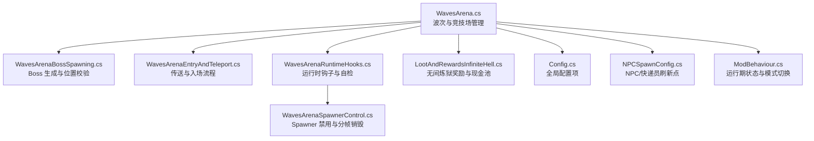
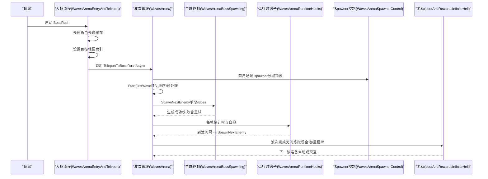
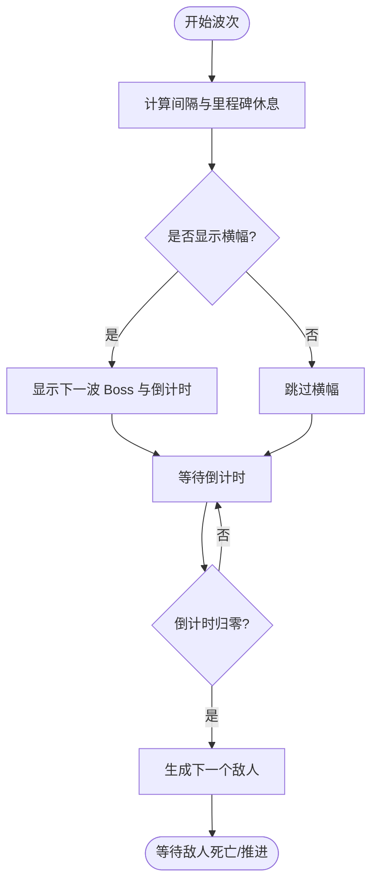
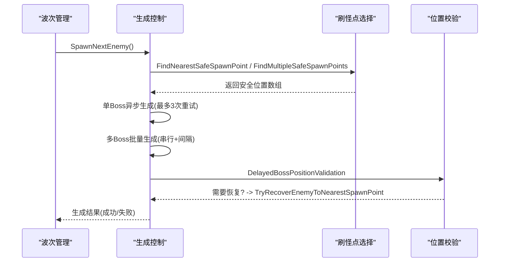
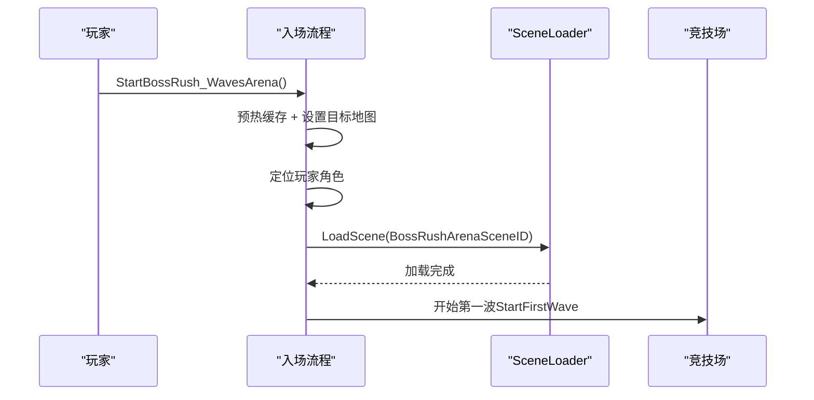
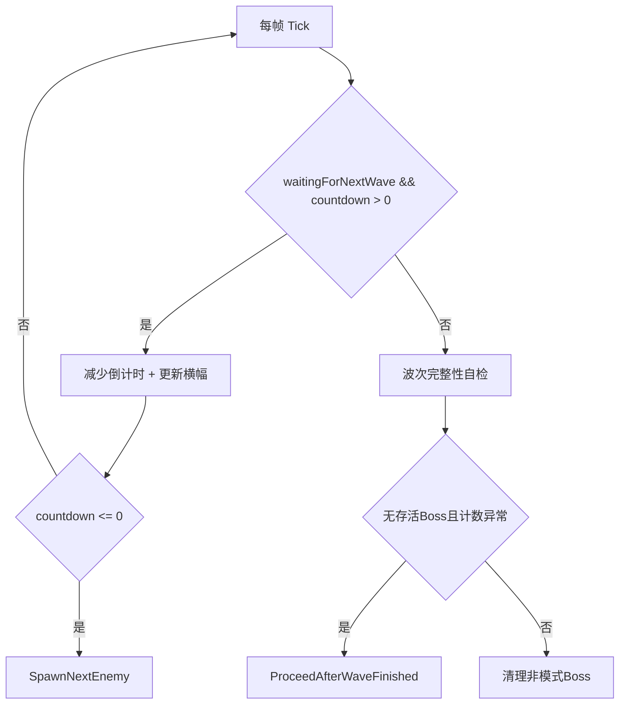
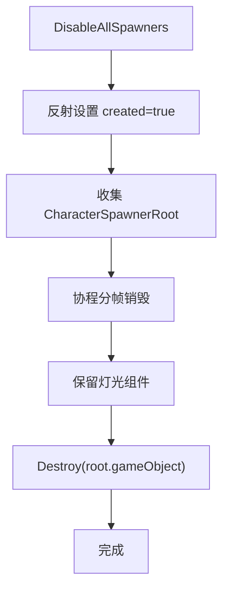
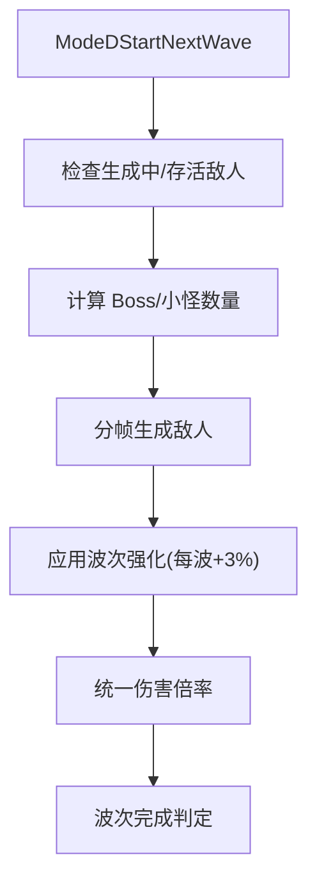
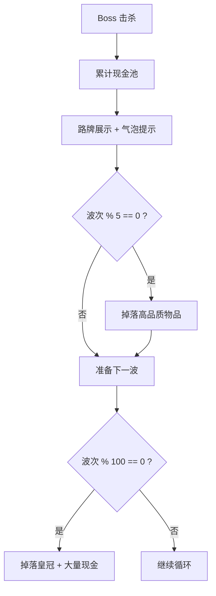
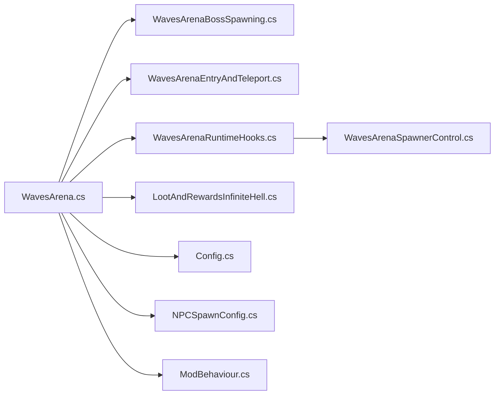

# 标准 BossRush 模式

<cite>
**本文引用的文件**
- [WavesArena.cs](file://WavesArena/WavesArena.cs)
- [WavesArenaBossSpawning.cs](file://WavesArena/WavesArenaBossSpawning.cs)
- [WavesArenaEntryAndTeleport.cs](file://WavesArena/WavesArenaEntryAndTeleport.cs)
- [WavesArenaRuntimeHooks.cs](file://WavesArena/WavesArenaRuntimeHooks.cs)
- [WavesArenaSpawnerControl.cs](file://WavesArena/WavesArenaSpawnerControl.cs)
- [ModeDWaves.cs](file://ModeD/ModeDWaves.cs)
- [LootAndRewardsInfiniteHell.cs](file://LootAndRewards/LootAndRewardsInfiniteHell.cs)
- [Config.cs](file://Config/Config.cs)
- [NPCSpawnConfig.cs](file://Config/NPCSpawnConfig.cs)
- [ModBehaviour.cs](file://ModBehaviour.cs)
</cite>

## 目录
1. [简介](#简介)
2. [项目结构](#项目结构)
3. [核心组件](#核心组件)
4. [架构总览](#架构总览)
5. [详细组件分析](#详细组件分析)
6. [依赖关系分析](#依赖关系分析)
7. [性能考量](#性能考量)
8. [故障排查指南](#故障排查指南)
9. [结论](#结论)
10. [附录：配置与使用示例](#附录配置与使用示例)

## 简介
本文件为“标准 BossRush 模式”的权威技术文档，聚焦三种难度级别（弹指可灭、有点意思、无间炼狱）的波次管理机制。内容涵盖敌人预设初始化、波次间隔倒计时、多 Boss 支持、前期强力 Boss 排除机制、无间炼狱权重随机算法、现金池系统与难度调节、玩家传送到官方挑战场景的流程、竞技场逻辑与波次推进机制，并提供配置选项说明、使用示例、性能优化措施与常见问题解决方案。

## 项目结构
BossRush 模式的波次与竞技场逻辑主要分布在 WavesArena 模块中，配合 ModeD 的波次系统、LootAndRewards 的奖励流程以及 Config 的配置系统共同工作。关键职责划分如下：
- 波次与竞技场管理：WavesArena.cs
- Boss 生成与位置校验：WavesArenaBossSpawning.cs
- 传送与入场流程：WavesArenaEntryAndTeleport.cs
- 运行时钩子与自检：WavesArenaRuntimeHooks.cs
- Spawner 禁用与分帧销毁：WavesArenaSpawnerControl.cs
- 白手起家（Mode D）波次：ModeDWaves.cs
- 无间炼狱奖励与现金池：LootAndRewardsInfiniteHell.cs
- 全局配置项：Config.cs
- NPC/快递员刷新点：NPCSpawnConfig.cs
- 运行期状态与模式切换：ModBehaviour.cs

图表来源
- [WavesArena.cs:1-120](file://WavesArena/WavesArena.cs#L1-L120)
- [WavesArenaBossSpawning.cs:1-120](file://WavesArena/WavesArenaBossSpawning.cs#L1-L120)
- [WavesArenaEntryAndTeleport.cs:1-120](file://WavesArena/WavesArenaEntryAndTeleport.cs#L1-L120)
- [WavesArenaRuntimeHooks.cs:1-89](file://WavesArena/WavesArenaRuntimeHooks.cs#L1-L89)
- [WavesArenaSpawnerControl.cs:1-140](file://WavesArena/WavesArenaSpawnerControl.cs#L1-L140)
- [LootAndRewardsInfiniteHell.cs:1-120](file://LootAndRewards/LootAndRewardsInfiniteHell.cs#L1-L120)
- [Config.cs:1-120](file://Config/Config.cs#L1-L120)
- [NPCSpawnConfig.cs:1-120](file://Config/NPCSpawnConfig.cs#L1-L120)
- [ModBehaviour.cs:252-528](file://ModBehaviour.cs#L252-L528)

章节来源
- [WavesArena.cs:1-120](file://WavesArena/WavesArena.cs#L1-L120)
- [WavesArenaBossSpawning.cs:1-120](file://WavesArena/WavesArenaBossSpawning.cs#L1-L120)
- [WavesArenaEntryAndTeleport.cs:1-120](file://WavesArena/WavesArenaEntryAndTeleport.cs#L1-L120)
- [WavesArenaRuntimeHooks.cs:1-89](file://WavesArena/WavesArenaRuntimeHooks.cs#L1-L89)
- [WavesArenaSpawnerControl.cs:1-140](file://WavesArena/WavesArenaSpawnerControl.cs#L1-L140)
- [LootAndRewardsInfiniteHell.cs:1-120](file://LootAndRewards/LootAndRewardsInfiniteHell.cs#L1-L120)
- [Config.cs:1-120](file://Config/Config.cs#L1-L120)
- [NPCSpawnConfig.cs:1-120](file://Config/NPCSpawnConfig.cs#L1-L120)
- [ModBehaviour.cs:252-528](file://ModBehaviour.cs#L252-L528)

## 核心组件
- 波次与竞技场管理：负责开始 BossRush、倒计时、敌人死亡处理、波次推进、多 Boss 计数、成就触发、现金池累加等。
- Boss 生成与位置校验：负责选取刷怪点、安全距离过滤、批量生成、重试机制、位置修复与验证。
- 传送与入场流程：负责启动 BossRush、预热缓存、设置目标地图、调用 SceneLoader 加载竞技场场景。
- 运行时钩子与自检：每帧更新倒计时、显示横幅、周期性自检卡波并修正。
- Spawner 控制：禁用场景内所有 CharacterSpawnerRoot，保留灯光后分帧销毁，避免过图帧卡顿。
- 白手起家（Mode D）波次：按波次规则生成小怪与 Boss，渐进式数值强化，分帧生成避免低端机尖刺。
- 无间炼狱奖励与现金池：击杀 Boss 累计现金池，每 5/100 波发放高品质物品与里程碑奖励。
- 配置系统：提供波次间隔、额外休息、掉落策略、每波 Boss 数量、数值倍率等可调参数。
- NPC/快递员刷新点：为不同场景提供固定或随机刷新点，保证竞技场交互体验。

章节来源
- [WavesArena.cs:108-207](file://WavesArena/WavesArena.cs#L108-L207)
- [WavesArenaBossSpawning.cs:346-473](file://WavesArena/WavesArenaBossSpawning.cs#L346-L473)
- [WavesArenaEntryAndTeleport.cs:16-226](file://WavesArena/WavesArenaEntryAndTeleport.cs#L16-L226)
- [WavesArenaRuntimeHooks.cs:7-67](file://WavesArena/WavesArenaRuntimeHooks.cs#L7-L67)
- [WavesArenaSpawnerControl.cs:21-139](file://WavesArena/WavesArenaSpawnerControl.cs#L21-L139)
- [ModeDWaves.cs:45-138](file://ModeD/ModeDWaves.cs#L45-L138)
- [LootAndRewardsInfiniteHell.cs:30-120](file://LootAndRewards/LootAndRewardsInfiniteHell.cs#L30-L120)
- [Config.cs:42-81](file://Config/Config.cs#L42-L81)
- [NPCSpawnConfig.cs:63-74](file://Config/NPCSpawnConfig.cs#L63-L74)
- [ModBehaviour.cs:252-528](file://ModBehaviour.cs#L252-L528)

## 架构总览
BossRush 模式以“竞技场”为核心，通过传送进入官方挑战场景，随后由波次管理器驱动敌人生成与推进。普通模式（弹指可灭/有点意思）按顺序或预处理后的列表推进；无间炼狱模式采用权重随机选择 Boss，结合现金池与里程碑奖励形成无限循环挑战。

图表来源
- [WavesArenaEntryAndTeleport.cs:16-226](file://WavesArena/WavesArenaEntryAndTeleport.cs#L16-L226)
- [WavesArena.cs:108-207](file://WavesArena/WavesArena.cs#L108-L207)
- [WavesArenaBossSpawning.cs:346-473](file://WavesArena/WavesArenaBossSpawning.cs#L346-L473)
- [WavesArenaRuntimeHooks.cs:7-67](file://WavesArena/WavesArenaRuntimeHooks.cs#L7-L67)
- [WavesArenaSpawnerControl.cs:21-139](file://WavesArena/WavesArenaSpawnerControl.cs#L21-L139)
- [LootAndRewardsInfiniteHell.cs:30-120](file://LootAndRewards/LootAndRewardsInfiniteHell.cs#L30-L120)

## 详细组件分析

### 波次与竞技场管理（WavesArena.cs）
- 前期强力 Boss 排除：在挑战开始时对前 20 波进行预处理，将强力 Boss（如口口口口/四骑士、龙裔遗族、焚天龙皇）与后续普通 Boss 交换，确保新手友好。
- 波次间隔倒计时：根据配置计算基础间隔与每 5 波额外休息时间，显示大横幅提示下一波 Boss 名称与倒计时。
- 敌人死亡处理：区分单 Boss 与多 Boss 模式，维护当前波 Boss 列表与剩余计数，统一推进到下一波或结束挑战。
- 多 Boss 支持：同一波生成多个相同 Boss，逐个记录存活状态，全部击败后推进。
- 无间炼狱现金池：Boss 击杀时按最大生命值折算现金加入池，并在路牌处展示与气泡提示。

图表来源
- [WavesArena.cs:108-207](file://WavesArena/WavesArena.cs#L108-L207)
- [WavesArena.cs:213-441](file://WavesArena/WavesArena.cs#L213-L441)

章节来源
- [WavesArena.cs:42-104](file://WavesArena/WavesArena.cs#L42-L104)
- [WavesArena.cs:108-207](file://WavesArena/WavesArena.cs#L108-L207)
- [WavesArena.cs:213-441](file://WavesArena/WavesArena.cs#L213-L441)

### Boss 生成与位置校验（WavesArenaBossSpawning.cs）
- 起始流程：记录玩家出生点、打乱敌人顺序、清理场景敌人、订阅死亡事件、抽取变异词条、初始化计数。
- 安全刷怪点：优先选择距玩家安全距离外的点，若全部太近则回退到最远点；Y 轴高度通过地面贴合修正。
- 单/多 Boss 生成：单 Boss 异步生成带重试；多 Boss 批量分配不重复的安全位置，串行生成并间隔短暂等待，失败重试多次。
- 位置修复：生成后延迟校验，若发现 Boss 卡在地下或虚空，尝试恢复到最近刷怪点。

图表来源
- [WavesArenaBossSpawning.cs:19-108](file://WavesArena/WavesArenaBossSpawning.cs#L19-L108)
- [WavesArenaBossSpawning.cs:117-251](file://WavesArena/WavesArenaBossSpawning.cs#L117-L251)
- [WavesArenaBossSpawning.cs:346-473](file://WavesArena/WavesArenaBossSpawning.cs#L346-L473)
- [WavesArenaBossSpawning.cs:478-661](file://WavesArena/WavesArenaBossSpawning.cs#L478-L661)

章节来源
- [WavesArenaBossSpawning.cs:19-108](file://WavesArena/WavesArenaBossSpawning.cs#L19-L108)
- [WavesArenaBossSpawning.cs:117-251](file://WavesArena/WavesArenaBossSpawning.cs#L117-L251)
- [WavesArenaBossSpawning.cs:346-473](file://WavesArena/WavesArenaBossSpawning.cs#L346-L473)
- [WavesArenaBossSpawning.cs:478-661](file://WavesArena/WavesArenaBossSpawning.cs#L478-L661)

### 传送与入场流程（WavesArenaEntryAndTeleport.cs）
- 启动入口：标记直接进入流程、预热角色预设缓存、设置待进入地图索引（DEMO 挑战）。
- 玩家定位：多重方式查找主角色（静态 Main、FindObjectOfType、Tag=Player），确保稳定获取。
- 场景加载：通过 SceneLoader.LoadScene 加载 BossRush 场景，失败时提示查看日志。
- 返回交互：创建返回出生点的绿色方块交互物，便于退出竞技场。

图表来源
- [WavesArenaEntryAndTeleport.cs:16-226](file://WavesArena/WavesArenaEntryAndTeleport.cs#L16-L226)
- [WavesArenaEntryAndTeleport.cs:228-272](file://WavesArena/WavesArenaEntryAndTeleport.cs#L228-L272)
- [WavesArenaEntryAndTeleport.cs:277-335](file://WavesArena/WavesArenaEntryAndTeleport.cs#L277-L335)

章节来源
- [WavesArenaEntryAndTeleport.cs:16-226](file://WavesArena/WavesArenaEntryAndTeleport.cs#L16-L226)
- [WavesArenaEntryAndTeleport.cs:228-272](file://WavesArena/WavesArenaEntryAndTeleport.cs#L228-L272)
- [WavesArenaEntryAndTeleport.cs:277-335](file://WavesArena/WavesArenaEntryAndTeleport.cs#L277-L335)

### 运行时钩子与自检（WavesArenaRuntimeHooks.cs）
- 倒计时更新：每帧减少 waveCountdown，每秒更新大横幅（间隔大于 5 秒时按 5 秒倍数显示）。
- 卡波修复：定期检测当前波是否存在“无存活 Boss 但计数未清零”的情况，自动推进下一波。
- 非模式 Boss 清理：在 BossRush/丧尸模式期间定时清理残留的“大兴兴”Boss，防止干扰。

图表来源
- [WavesArenaRuntimeHooks.cs:7-67](file://WavesArena/WavesArenaRuntimeHooks.cs#L7-L67)
- [WavesArenaSpawnerControl.cs:141-251](file://WavesArena/WavesArenaSpawnerControl.cs#L141-L251)

章节来源
- [WavesArenaRuntimeHooks.cs:7-67](file://WavesArena/WavesArenaRuntimeHooks.cs#L7-L67)
- [WavesArenaSpawnerControl.cs:141-251](file://WavesArena/WavesArenaSpawnerControl.cs#L141-L251)

### Spawner 控制（WavesArenaSpawnerControl.cs）
- 禁用所有 Spawner：反射设置 created=true 立即阻止刷怪，收集待销毁 root。
- 分帧销毁：每帧处理少量 root，先保留灯光再 Destroy，避免过图帧尖刺。
- 自检修正：当当前波计数大于 0 但场上无存活 Boss 时，强制推进下一波。

图表来源
- [WavesArenaSpawnerControl.cs:21-139](file://WavesArena/WavesArenaSpawnerControl.cs#L21-L139)
- [WavesArenaSpawnerControl.cs:141-251](file://WavesArena/WavesArenaSpawnerControl.cs#L141-L251)

章节来源
- [WavesArenaSpawnerControl.cs:21-139](file://WavesArena/WavesArenaSpawnerControl.cs#L21-L139)
- [WavesArenaSpawnerControl.cs:141-251](file://WavesArena/WavesArenaSpawnerControl.cs#L141-L251)

### 白手起家（Mode D）波次（ModeDWaves.cs）
- 波次规则：第 1-5 波全小怪，第 6-10 波 1 Boss + 小怪，第 11-15 波 2 Boss + 小怪，第 16+ 波全 Boss。
- 生成流程：动态刷新敌人数、计算 Boss/小怪配比、分帧生成避免低端机尖刺。
- 数值强化：每波提升 3% 属性（通过 Stat Modifier 增加 MaxHealth 并同步 CurrentHealth）。
- 伤害归一化：统一枪械/近战伤害倍率为 1，保持平衡。

图表来源
- [ModeDWaves.cs:45-138](file://ModeD/ModeDWaves.cs#L45-L138)
- [ModeDWaves.cs:185-334](file://ModeD/ModeDWaves.cs#L185-L334)
- [ModeDWaves.cs:736-781](file://ModeD/ModeDWaves.cs#L736-L781)

章节来源
- [ModeDWaves.cs:45-138](file://ModeD/ModeDWaves.cs#L45-L138)
- [ModeDWaves.cs:185-334](file://ModeD/ModeDWaves.cs#L185-L334)
- [ModeDWaves.cs:736-781](file://ModeD/ModeDWaves.cs#L736-L781)

### 无间炼狱奖励与现金池（LootAndRewardsInfiniteHell.cs）
- 现金池累积：Boss 击杀时按最大生命值折算现金加入池，路牌展示与气泡提示。
- 每 5 波奖励：从共享高品质奖励池中随机取一个 Q5+ 且价格≥10000 的物品。
- 每 100 波里程碑：皇冠数量与现金总额按 2^(tier-1) 指数增长，大量掉落。
- 下一波准备：根据配置决定是否使用交互点或自动倒计时。

图表来源
- [LootAndRewardsInfiniteHell.cs:30-120](file://LootAndRewards/LootAndRewardsInfiniteHell.cs#L30-L120)
- [LootAndRewardsInfiniteHell.cs:149-279](file://LootAndRewards/LootAndRewardsInfiniteHell.cs#L149-L279)
- [LootAndRewardsInfiniteHell.cs:310-408](file://LootAndRewards/LootAndRewardsInfiniteHell.cs#L310-L408)

章节来源
- [LootAndRewardsInfiniteHell.cs:30-120](file://LootAndRewards/LootAndRewardsInfiniteHell.cs#L30-L120)
- [LootAndRewardsInfiniteHell.cs:149-279](file://LootAndRewards/LootAndRewardsInfiniteHell.cs#L149-L279)
- [LootAndRewardsInfiniteHell.cs:310-408](file://LootAndRewards/LootAndRewardsInfiniteHell.cs#L310-L408)

### 配置系统（Config.cs）
- 波次间隔：2-60 秒，默认 15 秒，支持运行时修改并静重算倒计时。
- 额外休息：每 5 波额外休息时间（0-120 秒），仅影响下一次命中里程碑波次。
- 掉落策略：Boss 掉落随机化、原版概率掉落、掉落箱掩体开关。
- 无间炼狱：每波 Boss 数量（1-10）、Boss 数值倍率（0.1-10）。
- 白手起家：每波敌人数（1-10）。
- 其他：龙套装冲刺、成就快捷键、荒野号角狼模型、死亡亡魂系统、变异词条开关与数量。

章节来源
- [Config.cs:42-81](file://Config/Config.cs#L42-L81)
- [Config.cs:158-232](file://Config/Config.cs#L158-L232)
- [Config.cs:237-407](file://Config/Config.cs#L237-L407)
- [Config.cs:592-704](file://Config/Config.cs#L592-L704)
- [Config.cs:709-800](file://Config/Config.cs#L709-L800)

### NPC/快递员刷新点（NPCSpawnConfig.cs）
- BossRush 固定位置：为各场景定义快递员固定刷新坐标，保证竞技场交互一致性。
- 普通模式随机：为各场景定义随机刷新点数组，支持避开其他 NPC。
- 通用查询：提供 TryGetCourierNormalModePosition、TryGetGoblinSpawnPosition、TryGetNurseSpawnPosition 等方法。

章节来源
- [NPCSpawnConfig.cs:63-74](file://Config/NPCSpawnConfig.cs#L63-L74)
- [NPCSpawnConfig.cs:267-338](file://Config/NPCSpawnConfig.cs#L267-L338)
- [NPCSpawnConfig.cs:385-445](file://Config/NPCSpawnConfig.cs#L385-L445)
- [NPCSpawnConfig.cs:451-549](file://Config/NPCSpawnConfig.cs#L451-L549)

## 依赖关系分析
- 低耦合高内聚：波次管理、生成控制、入场流程、运行时钩子、奖励系统各司其职，通过明确接口与回调协作。
- 外部依赖：SceneLoader（场景加载）、ItemAssetsCollection（物品实例化）、EconomyManager（现金物品 ID）、CharacterMainControl（玩家角色）。
- 内部依赖：WavesArena 依赖 Boss 生成、运行时钩子、奖励系统；ModeD 独立波次逻辑；Config 提供全局参数。

图表来源
- [WavesArena.cs:1-120](file://WavesArena/WavesArena.cs#L1-L120)
- [WavesArenaBossSpawning.cs:1-120](file://WavesArena/WavesArenaBossSpawning.cs#L1-L120)
- [WavesArenaEntryAndTeleport.cs:1-120](file://WavesArena/WavesArenaEntryAndTeleport.cs#L1-L120)
- [WavesArenaRuntimeHooks.cs:1-89](file://WavesArena/WavesArenaRuntimeHooks.cs#L1-L89)
- [WavesArenaSpawnerControl.cs:1-140](file://WavesArena/WavesArenaSpawnerControl.cs#L1-L140)
- [LootAndRewardsInfiniteHell.cs:1-120](file://LootAndRewards/LootAndRewardsInfiniteHell.cs#L1-L120)
- [Config.cs:1-120](file://Config/Config.cs#L1-L120)
- [NPCSpawnConfig.cs:1-120](file://Config/NPCSpawnConfig.cs#L1-L120)
- [ModBehaviour.cs:252-528](file://ModBehaviour.cs#L252-L528)

章节来源
- [WavesArena.cs:1-120](file://WavesArena/WavesArena.cs#L1-L120)
- [WavesArenaBossSpawning.cs:1-120](file://WavesArena/WavesArenaBossSpawning.cs#L1-L120)
- [WavesArenaEntryAndTeleport.cs:1-120](file://WavesArena/WavesArenaEntryAndTeleport.cs#L1-L120)
- [WavesArenaRuntimeHooks.cs:1-89](file://WavesArena/WavesArenaRuntimeHooks.cs#L1-L89)
- [WavesArenaSpawnerControl.cs:1-140](file://WavesArena/WavesArenaSpawnerControl.cs#L1-L140)
- [LootAndRewardsInfiniteHell.cs:1-120](file://LootAndRewards/LootAndRewardsInfiniteHell.cs#L1-L120)
- [Config.cs:1-120](file://Config/Config.cs#L1-L120)
- [NPCSpawnConfig.cs:1-120](file://Config/NPCSpawnConfig.cs#L1-L120)
- [ModBehaviour.cs:252-528](file://ModBehaviour.cs#L252-L528)

## 性能考量
- 预热点与缓存：入场时预热角色预设缓存，避免进图帧扫描；敌人预设初始化完成后标记，跳过重复扫描。
- Spawner 分帧销毁：将「阻止生成」与「批量销毁」拆分，首帧立即阻止刷怪，后续跨帧销毁 GameObject，避免尖刺。
- 多 Boss 串行生成：批量生成时串行执行并短暂等待，降低并发冲突风险。
- 低端机友好：ModeD 分帧生成敌人，每生成一个等待一帧；Boss 位置校验延迟执行，给地形加载留时间。
- 自检与修复：定期检测卡波并自动推进，减少异常导致的性能浪费。

[本节为通用性能指导，无需特定文件引用]

## 故障排查指南
- 无法找到玩家角色：检查 CharacterMainControl.Main、FindObjectOfType、Tag=Player 的多重定位逻辑，确认游戏内存在主角色。
- 进入场景失败：查看 SceneLoader.LoadScene 调用日志，确认 BossRushArenaSceneID 有效。
- Boss 生成失败：检查刷怪点是否为空、安全距离过滤是否过于严格；查看重试次数与最终失败计数。
- 卡波问题：运行时钩子会定期自检，若无存活 Boss 但计数未清零，将自动推进；可检查 currentWaveBosses 与 bossesInCurrentWaveRemaining 状态。
- 现金池显示异常：确认 bossRushSignInteract 是否存在，检查 OnInfiniteHellWaveCompleted_LootAndRewards 中的路径与掉落逻辑。

章节来源
- [WavesArenaEntryAndTeleport.cs:160-184](file://WavesArena/WavesArenaEntryAndTeleport.cs#L160-L184)
- [WavesArenaEntryAndTeleport.cs:228-272](file://WavesArena/WavesArenaEntryAndTeleport.cs#L228-L272)
- [WavesArenaBossSpawning.cs:346-473](file://WavesArena/WavesArenaBossSpawning.cs#L346-L473)
- [WavesArenaRuntimeHooks.cs:48-67](file://WavesArena/WavesArenaRuntimeHooks.cs#L48-L67)
- [WavesArenaSpawnerControl.cs:141-251](file://WavesArena/WavesArenaSpawnerControl.cs#L141-L251)
- [LootAndRewardsInfiniteHell.cs:30-120](file://LootAndRewards/LootAndRewardsInfiniteHell.cs#L30-L120)

## 结论
标准 BossRush 模式通过模块化设计实现了弹指可灭、有点意思、无间炼狱三种难度的差异化体验。前期强力 Boss 排除保障新手友好，多 Boss 支持与位置校验提升稳定性，无间炼狱的权重随机与现金池系统提供无限挑战与丰厚回报。配置系统灵活可调，性能优化贯穿始终，故障排查机制完善，适合不同水平玩家探索与策略构建。

[本节为总结性内容，无需特定文件引用]

## 附录：配置与使用示例
- 波次间隔：设置为 10 秒可减少等待，设置为 30 秒增加战术调整时间。
- 额外休息：每 5 波额外休息 30 秒，适合高强度连战；设为 0 取消休息。
- 掉落策略：开启 Boss 掉落随机化可获得时间加成；启用原版概率掉落更贴近经典体验。
- 无间炼狱：每波 Boss 数量设为 5 提升压力；Boss 数值倍率设为 1.5 增强挑战。
- 白手起家：每波敌人数设为 5，逐步积累资源；注意前期小怪筛选避免幽灵与未知敌人。
- 使用示例：
  - 快速通关：波次间隔 5 秒、额外休息 0、每波 Boss 1、数值倍率 1。
  - 极限挑战：波次间隔 2 秒、额外休息 0、无间炼狱每波 Boss 5、数值倍率 2。
  - 休闲体验：波次间隔 30 秒、额外休息 60 秒、每波 Boss 1、掉落随机化关闭。

章节来源
- [Config.cs:42-81](file://Config/Config.cs#L42-L81)
- [Config.cs:158-232](file://Config/Config.cs#L158-L232)
- [Config.cs:237-407](file://Config/Config.cs#L237-L407)
- [Config.cs:592-704](file://Config/Config.cs#L592-L704)
- [Config.cs:709-800](file://Config/Config.cs#L709-L800)