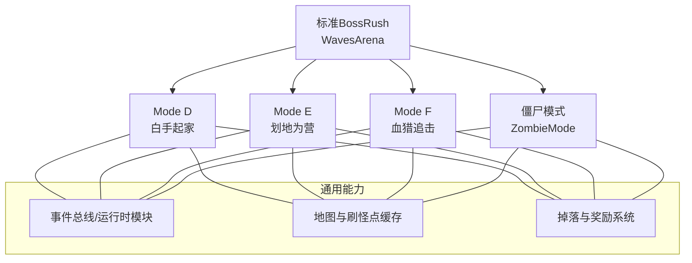
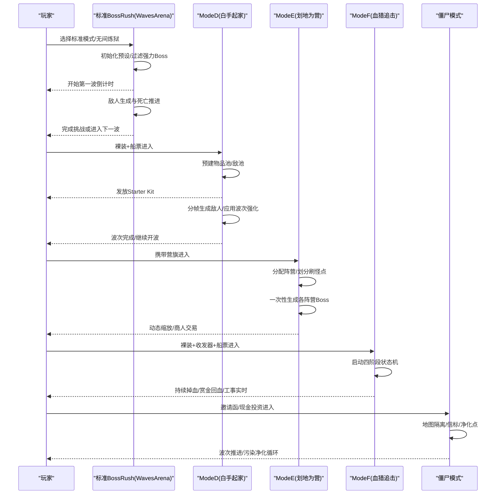
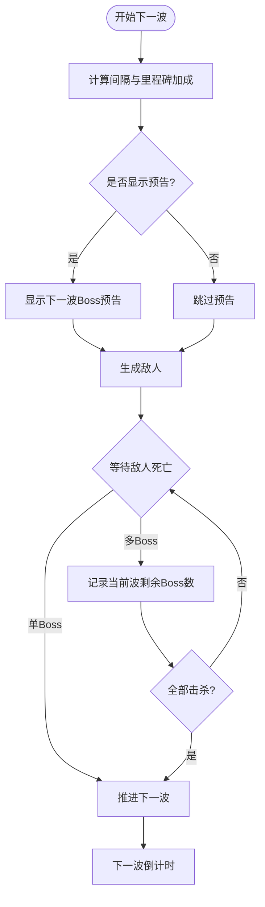
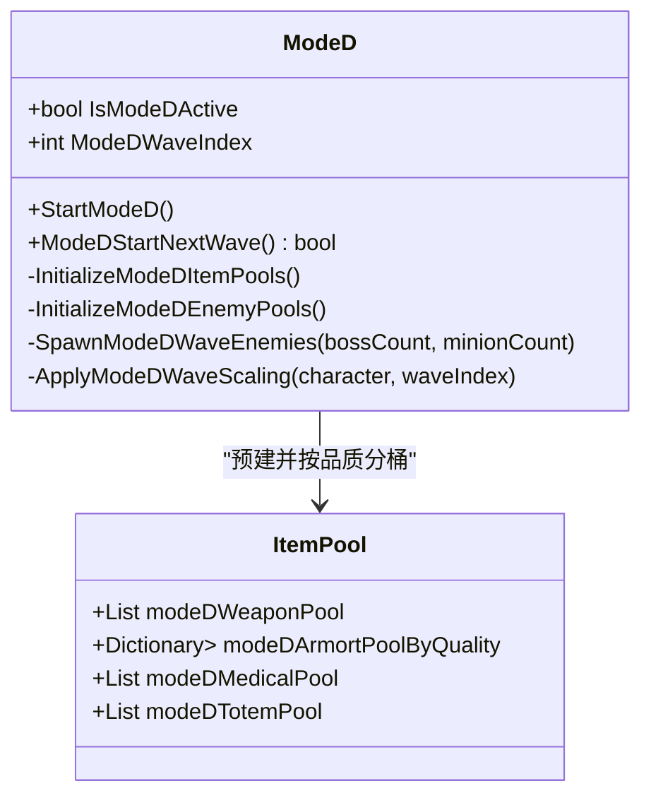
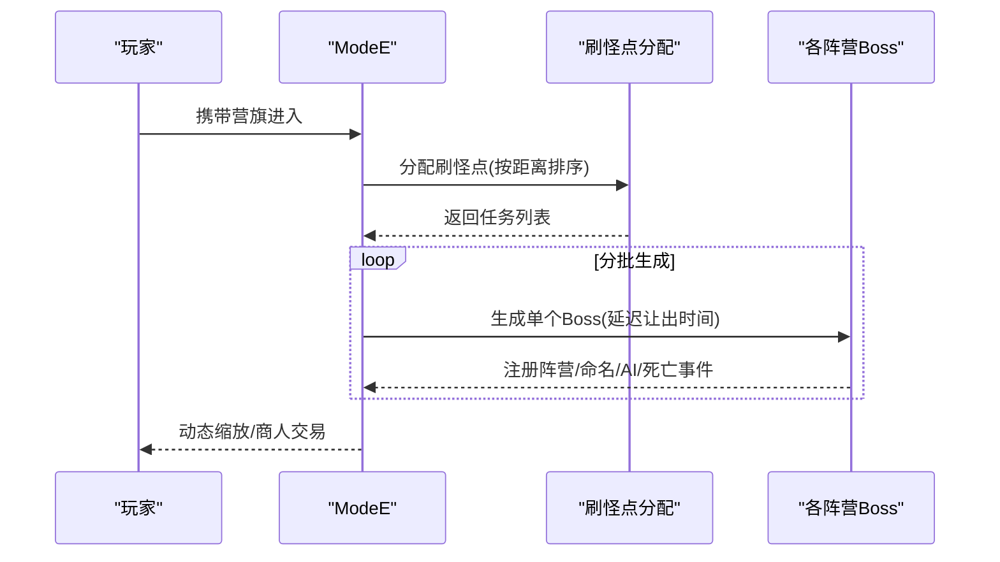
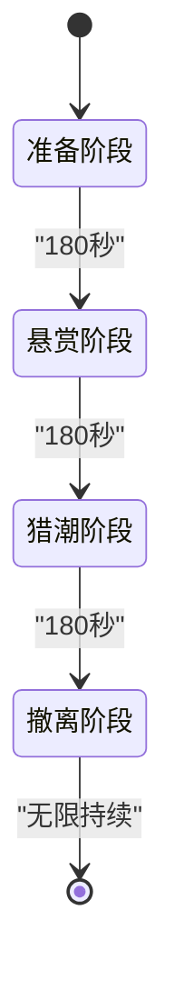
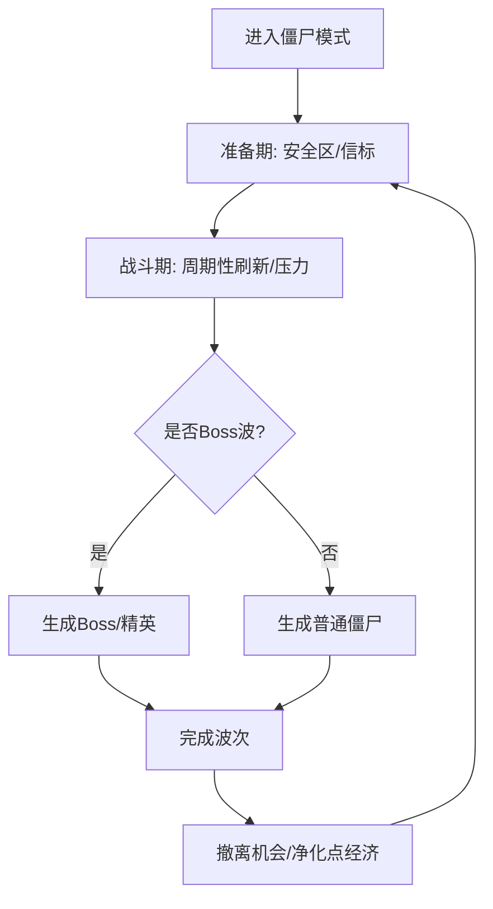
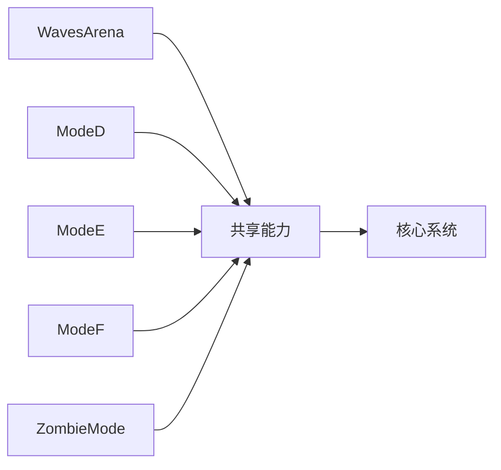

# 游戏模式系统

<cite>
**本文引用的文件**
- [WavesArena.cs](file://WavesArena/WavesArena.cs)
- [WavesArenaEntryAndTeleport.cs](file://WavesArena/WavesArenaEntryAndTeleport.cs)
- [ModeD.cs](file://ModeD/ModeD.cs)
- [ModeDWaves.cs](file://ModeD/ModeDWaves.cs)
- [ModeE.cs](file://ModeE/ModeE.cs)
- [ModeEBattle.cs](file://ModeE/ModeEBattle.cs)
- [ModeFEntry.cs](file://ModeF/ModeFEntry.cs)
- [ModeFPhases.cs](file://ModeF/ModeFPhases.cs)
- [ZombieModeEntry.cs](file://ZombieMode/ZombieModeEntry.cs)
- [ZombieModeWaveController.cs](file://ZombieMode/ZombieModeWaveController.cs)
</cite>

## 目录
1. [简介](#简介)
2. [项目结构](#项目结构)
3. [核心组件](#核心组件)
4. [架构总览](#架构总览)
5. [详细组件分析](#详细组件分析)
6. [依赖关系分析](#依赖关系分析)
7. [性能考量](#性能考量)
8. [故障排查指南](#故障排查指南)
9. [结论](#结论)
10. [附录：使用示例与配置选项](#附录使用示例与配置选项)

## 简介
本模块为 BossRushMod 的游戏模式系统，提供六大玩法模式的统一入口、规则与运行机制。涵盖标准 BossRush（弹指可灭、有点意思、无间炼狱）的波次管理；Mode D 白手起家的独立敌池与随机装备成长；Mode E 划地为营的多阵营沙盒混战与商人经济；Mode F 血猎追击的四阶段状态机、赏金系统与工事系统；以及僵尸模式的独立生存机制、污染系统与净化点经济。文档从进入方式、核心规则、难度调节与特色功能四个维度展开，并给出可视化流程图与时序图，帮助玩家理解不同模式的策略选择与配置项。

## 项目结构
BossRush 模式系统按“模式域”组织代码：
- WavesArena：标准 BossRush 的波次与竞技场管理、传送与倒计时。
- ModeD：白手起家模式，独立敌池、随机装备发放、波次配比与数值强化。
- ModeE：划地为营，多阵营分配、一次性生成 Boss、动态缩放与商人经济。
- ModeF：血猎追击，四阶段状态机、持续掉血、赏金与工事系统。
- ZombieMode：丧尸模式，独立生存循环、污染与净化点经济、安全区与波次控制。

图表来源
- [WavesArena.cs:1-120](file://WavesArena/WavesArena.cs#L1-L120)
- [ModeD.cs:1-120](file://ModeD/ModeD.cs#L1-L120)
- [ModeE.cs:1-120](file://ModeE/ModeE.cs#L1-L120)
- [ModeFEntry.cs:1-120](file://ModeF/ModeFEntry.cs#L1-L120)
- [ZombieModeEntry.cs:1-120](file://ZombieMode/ZombieModeEntry.cs#L1-L120)

章节来源
- [WavesArena.cs:1-120](file://WavesArena/WavesArena.cs#L1-L120)
- [WavesArenaEntryAndTeleport.cs:16-226](file://WavesArena/WavesArenaEntryAndTeleport.cs#L16-L226)

## 核心组件
- 标准 BossRush（弹指可灭/有点意思/无间炼狱）
  - 波次管理与倒计时：每波结束后计算间隔，支持里程碑休息加成；非无间炼狱显示下一波预告。
  - 敌人死亡推进：单 Boss 或多 Boss 计数，全部击杀后推进到下一波或结束挑战。
  - 无间炼狱：按权重随机选取敌人，随波次提升高血量 Boss 权重，并累计现金池。
- Mode D（白手起家）
  - 入场条件：裸装+船票；自动清理其他模式残留状态。
  - 独立敌池：小怪池与 Boss 池分离，前期过滤强力 Boss，逐步引入。
  - 随机装备：按 Tag 预建武器/护甲/头盔/弹药/医疗/近战/图腾/面具/背包池，开局发放 Starter Kit。
  - 波次配比：1-5 全小怪，6-10 含 Boss，11-15 双 Boss，16+ 全 Boss；每波 +3% 属性。
- Mode E（划地为营）
  - 多阵营沙盒：根据营旗分配阵营，地图刷怪点平均分配，各阵营领地一次性生成 Boss。
  - 动态缩放：以阵营死亡基线计算个人层数，每层生命/伤害 +5%，独立累计。
  - 商人经济：会话令牌、价格缓存、交易门控，保障跨场景/异步一致性。
- Mode F（血猎追击）
  - 四阶段状态机：准备→悬赏→猎潮→撤离，逐阶段提高掉血率与压力。
  - 赏金系统：击杀回血与最大生命成长，标记 Boss 额外收益。
  - 工事系统：折叠掩体包等战场道具，配合 UI 放置与修复。
- 僵尸模式
  - 独立生存：邀请函/现金投资，地图隔离，信标与补给。
  - 污染与净化点：击杀产出净化点数，用于购买增益或推进。
  - 波次控制：准备期/战斗期/撤离机会，周期性刷新与环境压力。

章节来源
- [WavesArena.cs:108-184](file://WavesArena/WavesArena.cs#L108-L184)
- [WavesArena.cs:348-506](file://WavesArena/WavesArena.cs#L348-L506)
- [WavesArena.cs:648-742](file://WavesArena/WavesArena.cs#L648-L742)
- [ModeD.cs:128-227](file://ModeD/ModeD.cs#L128-L227)
- [ModeD.cs:267-421](file://ModeD/ModeD.cs#L267-L421)
- [ModeDWaves.cs:45-137](file://ModeD/ModeDWaves.cs#L45-L137)
- [ModeDWaves.cs:155-177](file://ModeD/ModeDWaves.cs#L155-L177)
- [ModeE.cs:65-120](file://ModeE/ModeE.cs#L65-L120)
- [ModeEBattle.cs:244-355](file://ModeE/ModeEBattle.cs#L244-L355)
- [ModeFEntry.cs:65-164](file://ModeF/ModeFEntry.cs#L65-L164)
- [ModeFPhases.cs:53-245](file://ModeF/ModeFPhases.cs#L53-L245)
- [ZombieModeEntry.cs:81-177](file://ZombieMode/ZombieModeEntry.cs#L81-L177)
- [ZombieModeWaveController.cs:278-376](file://ZombieMode/ZombieModeWaveController.cs#L278-L376)

## 架构总览
下图展示各模式在运行时的交互关系与数据流：

图表来源
- [WavesArenaEntryAndTeleport.cs:16-226](file://WavesArena/WavesArenaEntryAndTeleport.cs#L16-L226)
- [ModeD.cs:128-227](file://ModeD/ModeD.cs#L128-L227)
- [ModeEBattle.cs:244-355](file://ModeE/ModeEBattle.cs#L244-L355)
- [ModeFEntry.cs:65-164](file://ModeF/ModeFEntry.cs#L65-L164)
- [ZombieModeEntry.cs:81-177](file://ZombieMode/ZombieModeEntry.cs#L81-L177)

## 详细组件分析

### 标准 BossRush（弹指可灭/有点意思/无间炼狱）
- 波次管理
  - 倒计时与里程碑休息：每 5 波额外休息时间，显示下一波 Boss 预告。
  - 敌人死亡推进：单 Boss 或多 Boss 计数，全部击杀后推进到下一波或结束。
  - 生成失败处理：统一递增击败计数，避免卡波。
- 难度调节
  - 前期强力 Boss 排除：前 20 波排除口口口口/四骑士/龙裔遗族/焚天龙皇。
  - 无间炼狱权重：按基础血量与波次线性放大权重，用户因子乘数可调。
- 使用示例
  - 通过路牌或快捷入口进入，默认每波 1 个 Boss；开启互动路牌可在波间进行资源调整。

图表来源
- [WavesArena.cs:108-184](file://WavesArena/WavesArena.cs#L108-L184)
- [WavesArena.cs:348-506](file://WavesArena/WavesArena.cs#L348-L506)

章节来源
- [WavesArena.cs:108-184](file://WavesArena/WavesArena.cs#L108-L184)
- [WavesArena.cs:348-506](file://WavesArena/WavesArena.cs#L348-L506)
- [WavesArena.cs:648-742](file://WavesArena/WavesArena.cs#L648-L742)

### Mode D（白手起家）
- 独立敌池设计
  - 小怪池：扫描 showName==false 的敌人，排除雇佣兵/炮台/商人/宠物/载具。
  - Boss 池：复用全局 enemyPresets，前期过滤强力 Boss。
- 随机装备系统
  - 按 Tag 构建武器/护甲/头盔/弹药/医疗/近战/图腾/面具/背包池，按品质分桶。
  - 开局发放 Starter Kit，首波抽取变异词条。
- 成长节奏控制
  - 波次配比：1-5 全小怪，6-10 含 Boss，11-15 双 Boss，16+ 全 Boss。
  - 数值强化：每波 +3% 属性，统一伤害倍率为 1 保持平衡。
- 使用示例
  - 裸装+船票进入，路牌切换加油状态，连点可快速结束波次。

图表来源
- [ModeD.cs:128-227](file://ModeD/ModeD.cs#L128-L227)
- [ModeD.cs:267-421](file://ModeD/ModeD.cs#L267-L421)
- [ModeDWaves.cs:45-137](file://ModeD/ModeDWaves.cs#L45-L137)

章节来源
- [ModeD.cs:128-227](file://ModeD/ModeD.cs#L128-L227)
- [ModeD.cs:267-421](file://ModeD/ModeD.cs#L267-L421)
- [ModeDWaves.cs:45-137](file://ModeD/ModeDWaves.cs#L45-L137)
- [ModeDWaves.cs:155-177](file://ModeD/ModeDWaves.cs#L155-L177)

### Mode E（划地为营）
- 多阵营沙盒混战
  - 阵营分配：随机或指定营旗，玩家独立阵营敌对所有 Boss。
  - 刷怪点分配：按距离由近到远分批生成，避免低端机卡顿。
- 动态难度缩放
  - 个人层数 = 当前阵营死亡计数 - 出生基线，每层生命/枪伤/近战伤害 +5%。
  - BEAR 阵营兜底：无 bear 预设时从全阵营小怪池补充并提升属性。
- 商人系统
  - 会话令牌/价格缓存/交易门控，确保跨场景/异步一致性。
- 使用示例
  - 携带营旗进入，系统分配阵营，一次性生成各阵营 Boss，战斗中可交易补给。

图表来源
- [ModeE.cs:65-120](file://ModeE/ModeE.cs#L65-L120)
- [ModeEBattle.cs:244-355](file://ModeE/ModeEBattle.cs#L244-L355)

章节来源
- [ModeE.cs:65-120](file://ModeE/ModeE.cs#L65-L120)
- [ModeEBattle.cs:244-355](file://ModeE/ModeEBattle.cs#L244-L355)

### Mode F（血猎追击）
- 四阶段状态机
  - 准备→悬赏→猎潮→撤离，逐阶段提高掉血率与压力。
  - 阶段广播：定时播报当前阶段状态。
- 赏金系统
  - 击杀回血与最大生命成长，标记 Boss 额外收益。
  - 猎潮/撤离阶段对未标记 Boss 施加速度加成并强制追踪玩家。
- 工事系统
  - 折叠掩体包等战场道具，配合 UI 放置与修复，退出时清理。
- 使用示例
  - 裸装+收发器+船票进入，持续掉血需击杀 Boss 回血续命，利用工事防守与赏金策略。

图表来源
- [ModeFPhases.cs:53-245](file://ModeF/ModeFPhases.cs#L53-L245)

章节来源
- [ModeFEntry.cs:65-164](file://ModeF/ModeFEntry.cs#L65-L164)
- [ModeFPhases.cs:53-245](file://ModeF/ModeFPhases.cs#L53-L245)

### 僵尸模式
- 独立生存机制
  - 邀请函/现金投资，地图隔离，信标与补给。
  - 安全区：准备期维持威胁抑制；区内直接伤害丧尸会取消安全区，便携安全区可延续到下一波开始。
- 污染系统与净化点经济
  - 击杀产出净化点数，用于购买增益或推进。
  - 污染影响环境，净化点可恢复区域安全。
- 波次控制
  - 准备期/战斗期/撤离机会，周期性刷新与环境压力。
- 使用示例
  - 通过邀请函进入，选择初始流派，利用安全区与净化点推进波次。

图表来源
- [ZombieModeEntry.cs:81-177](file://ZombieMode/ZombieModeEntry.cs#L81-L177)
- [ZombieModeWaveController.cs:278-376](file://ZombieMode/ZombieModeWaveController.cs#L278-L376)

章节来源
- [ZombieModeEntry.cs:81-177](file://ZombieMode/ZombieModeEntry.cs#L81-L177)
- [ZombieModeWaveController.cs:278-376](file://ZombieMode/ZombieModeWaveController.cs#L278-L376)

## 依赖关系分析
- 模式间互斥：Mode D/E/F 与僵尸模式相互排斥，避免状态污染。
- 共享能力：事件总线、地图刷怪点缓存、掉落与奖励系统被各模式复用。
- 外部依赖：SceneLoader、CharacterMainControl、ItemStatsSystem、Harmony 补丁等。

图表来源
- [WavesArena.cs:1-120](file://WavesArena/WavesArena.cs#L1-L120)
- [ModeD.cs:1-120](file://ModeD/ModeD.cs#L1-L120)
- [ModeE.cs:1-120](file://ModeE/ModeE.cs#L1-L120)
- [ModeFEntry.cs:1-120](file://ModeF/ModeFEntry.cs#L1-L120)
- [ZombieModeEntry.cs:1-120](file://ZombieMode/ZombieModeEntry.cs#L1-L120)

章节来源
- [WavesArena.cs:1-120](file://WavesArena/WavesArena.cs#L1-L120)
- [ModeD.cs:1-120](file://ModeD/ModeD.cs#L1-L120)
- [ModeE.cs:1-120](file://ModeE/ModeE.cs#L1-L120)
- [ModeFEntry.cs:1-120](file://ModeF/ModeFEntry.cs#L1-L120)
- [ZombieModeEntry.cs:1-120](file://ZombieMode/ZombieModeEntry.cs#L1-L120)

## 性能考量
- 分帧生成：Mode D/E/F 均采用分帧或延迟生成，避免低端机帧尖刺。
- 缓存优化：角色预设缓存、刷怪点洗牌复用、存活敌人集合去重。
- 早返路径：僵尸模式事件热路径中大量早返，减少不必要的查询。
- 内存管理：List/数组复用，避免每波频繁分配。

[本节提供通用指导，无需特定文件分析]

## 故障排查指南
- 标准 BossRush
  - 波次卡住：检查 OnBossSpawnFailed 与 ProceedAfterWaveFinished 日志。
  - 无间炼狱权重异常：确认 GetBossInfiniteHellFactor 与权重计算。
- Mode D
  - 物品池为空：检查 TagsData 与黑名单过滤。
  - 波次不推进：确认 modeDExpectedEnemiesInCurrentWave 与 resolved 计数。
- Mode E
  - 阵营混乱：检查预设 team 与 SetTeam 调用。
  - 商人交易异常：核对会话令牌与价格缓存键。
- Mode F
  - 状态机停滞：检查 TickModeF 与阶段切换条件。
  - 掉血致死：确认 ApplyModeFBleedDamage 与 OnModeFPlayerDeath。
- 僵尸模式
  - 波次不完成：查看 HandleZombieModeHealthDead 与 CompleteZombieModeWave。
  - 安全区失效：检查 TryProcessZombieModeSafeZoneStealthBreak。

章节来源
- [WavesArena.cs:508-549](file://WavesArena/WavesArena.cs#L508-L549)
- [WavesArena.cs:648-742](file://WavesArena/WavesArena.cs#L648-L742)
- [ModeD.cs:267-421](file://ModeD/ModeD.cs#L267-L421)
- [ModeDWaves.cs:659-681](file://ModeD/ModeDWaves.cs#L659-L681)
- [ModeEBattle.cs:442-623](file://ModeE/ModeEBattle.cs#L442-L623)
- [ModeFPhases.cs:96-245](file://ModeF/ModeFPhases.cs#L96-L245)
- [ZombieModeWaveController.cs:51-166](file://ZombieMode/ZombieModeWaveController.cs#L51-L166)

## 结论
BossRushMod 的模式系统通过清晰的职责划分与共享能力，实现了标准 BossRush、Mode D/E/F 与僵尸模式的差异化体验。各模式在波次管理、敌池设计、经济系统与状态机方面各有特色，同时兼顾性能与稳定性。玩家可根据自身偏好选择合适模式，并通过配置项与策略组合获得最佳体验。

[本节总结性内容，无需特定文件分析]

## 附录：使用示例与配置选项
- 标准 BossRush
  - 进入方式：路牌或快捷入口，默认每波 1 个 Boss。
  - 配置项：useInteractBetweenWaves（波间互动）、里程碑休息加成。
- Mode D
  - 进入方式：裸装+船票。
  - 配置项：modeDEnemiesPerWave（每波敌人数，1-10）。
- Mode E
  - 进入方式：携带营旗进入。
  - 配置项：可用阵营池、随机/指定营旗 TypeID。
- Mode F
  - 进入方式：裸装+收发器+船票。
  - 配置项：阶段时长、掉血率、回血比例、最大生命成长。
- 僵尸模式
  - 进入方式：邀请函+现金投资。
  - 配置项：净化点兑换比率、波次压力目标、安全区阈值。

章节来源
- [WavesArenaEntryAndTeleport.cs:16-226](file://WavesArena/WavesArenaEntryAndTeleport.cs#L16-L226)
- [ModeD.cs:111-166](file://ModeD/ModeD.cs#L111-L166)
- [ModeE.cs:285-307](file://ModeE/ModeE.cs#L285-L307)
- [ModeFPhases.cs:14-33](file://ModeF/ModeFPhases.cs#L14-L33)
- [ZombieModeEntry.cs:408-414](file://ZombieMode/ZombieModeEntry.cs#L408-L414)
