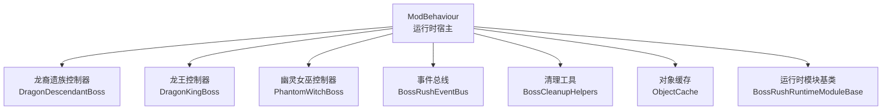
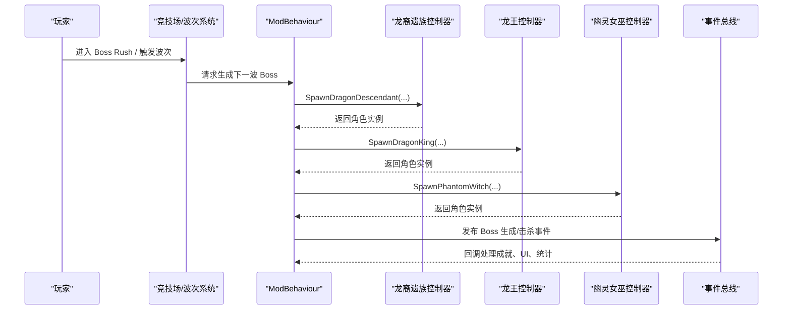
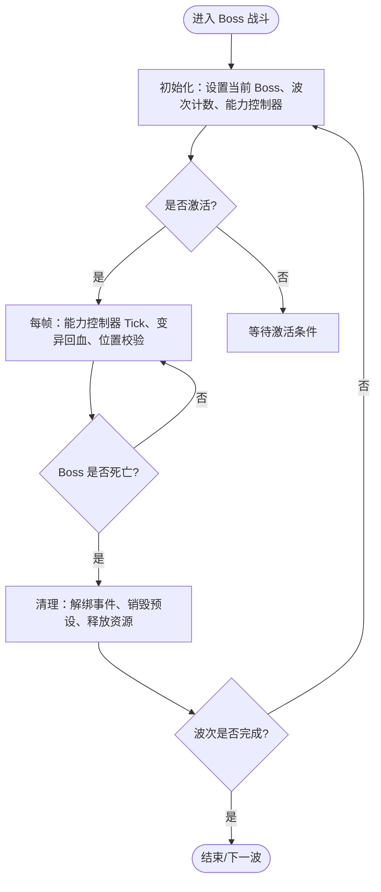
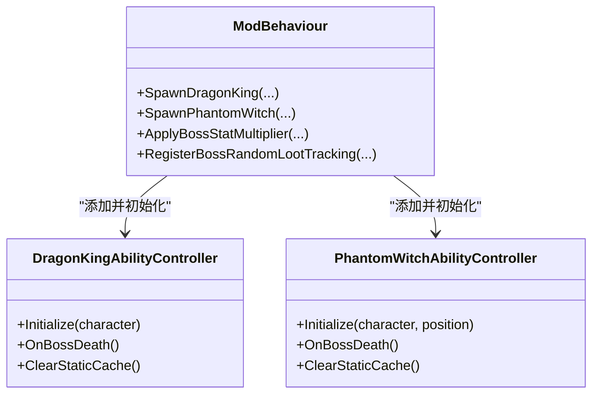
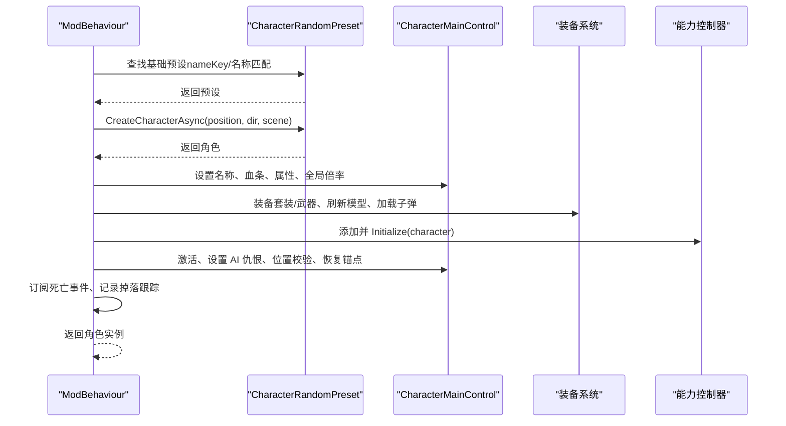
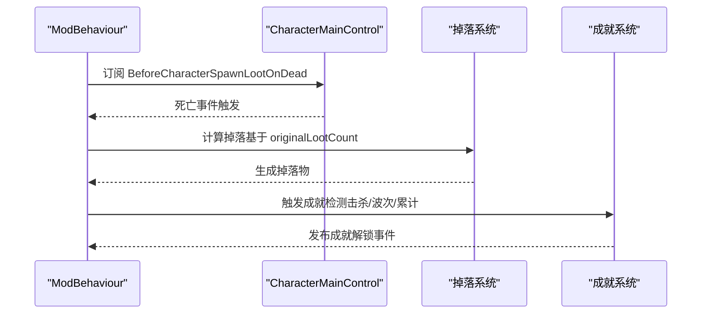
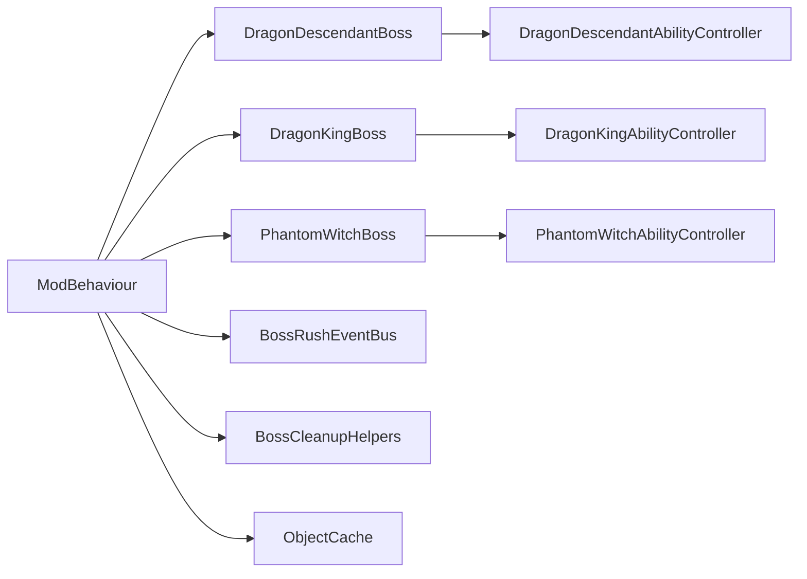

# Boss 框架设计

<cite>
**本文引用的文件**
- [ModBehaviour.cs](file://ModBehaviour.cs)
- [DragonDescendantBoss.cs](file://Integration/DragonDescendant/DragonDescendantBoss.cs)
- [DragonKingBoss.cs](file://Integration/DragonKing/DragonKingBoss.cs)
- [PhantomWitchBoss.cs](file://Integration/PhantomWitch/PhantomWitchBoss.cs)
- [BossRushEventBus.cs](file://Common/Events/BossRushEventBus.cs)
- [BossCleanupHelpers.cs](file://Utilities/BossCleanupHelpers.cs)
- [ObjectCache.cs](file://Common/Infrastructure/ObjectCache.cs)
- [BossRushRuntimeModuleBase.cs](file://Common/Lifecycle/BossRushRuntimeModuleBase.cs)
</cite>

## 目录
1. [简介](#简介)
2. [项目结构](#项目结构)
3. [核心组件](#核心组件)
4. [架构总览](#架构总览)
5. [详细组件分析](#详细组件分析)
6. [依赖关系分析](#依赖关系分析)
7. [性能考量](#性能考量)
8. [故障排查指南](#故障排查指南)
9. [结论](#结论)
10. [附录：为新 Boss 添加指南](#附录为新-boss-添加指南)

## 简介
本文件面向 BossRushMod 的 Boss 框架，系统性说明基类与接口设计、生命周期管理、能力系统、阶段转换机制、生成流程、装备集成、属性设置、性能优化策略，以及与波次追踪、掉落系统和成就系统的集成方式。文档同时提供为开发者新增 Boss 的可操作指导，包括继承关系、配置方法与最佳实践。

## 项目结构
Boss 框架围绕 ModBehaviour 这一运行时宿主展开，具体 Boss（龙裔遗族、龙王、幽灵女巫）以 partial class 形式扩展其生成、装配、能力与清理逻辑；通用事件总线、运行时模块基类、对象缓存与清理工具被各 Boss 复用，形成“统一入口 + 专用控制器”的分层架构。

**图示来源**
- [ModBehaviour.cs:329-716](file://ModBehaviour.cs#L329-L716)
- [DragonDescendantBoss.cs:20-235](file://Integration/DragonDescendant/DragonDescendantBoss.cs#L20-L235)
- [DragonKingBoss.cs:20-371](file://Integration/DragonKing/DragonKingBoss.cs#L20-L371)
- [PhantomWitchBoss.cs:19-340](file://Integration/PhantomWitch/PhantomWitchBoss.cs#L19-L340)
- [BossRushEventBus.cs:10-137](file://Common/Events/BossRushEventBus.cs#L10-L137)
- [BossCleanupHelpers.cs:16-122](file://Utilities/BossCleanupHelpers.cs#L16-L122)
- [ObjectCache.cs:11-204](file://Common/Infrastructure/ObjectCache.cs#L11-L204)
- [BossRushRuntimeModuleBase.cs:1-15](file://Common/Lifecycle/BossRushRuntimeModuleBase.cs#L1-L15)

**章节来源**
- [ModBehaviour.cs:329-716](file://ModBehaviour.cs#L329-L716)
- [DragonDescendantBoss.cs:20-235](file://Integration/DragonDescendant/DragonDescendantBoss.cs#L20-L235)
- [DragonKingBoss.cs:20-371](file://Integration/DragonKing/DragonKingBoss.cs#L20-L371)
- [PhantomWitchBoss.cs:19-340](file://Integration/PhantomWitch/PhantomWitchBoss.cs#L19-L340)

## 核心组件
- 运行时宿主与入口：ModBehaviour 负责全局初始化、更新循环、模式切换、波次状态、当前 Boss 引用、多 Boss 列表、变异词条回血 Tick 等。
- 专用 Boss 控制器：每个 Boss 以 partial class 扩展 ModBehaviour，实现 SpawnXxx、SetupAttributes、EquipXxx、订阅死亡事件、注册预设、清理资源等。
- 能力控制器：各 Boss 通过独立的能力控制器（如 DragonKingAbilityController、PhantomWitchAbilityController）管理技能、阶段、特效与性能策略。
- 事件总线：BossRushEventBus 提供类型安全、可重入、低分配的事件发布/订阅，用于成就解锁等跨模块通知。
- 清理工具：BossCleanupHelpers 集中销毁运行时预设副本、清理 tracked 角色、释放资产引用，避免内存泄漏。
- 对象缓存：ObjectCache 缓存场景对象与 CharacterRandomPreset，减少 FindObjectsOfTypeAll 开销。
- 运行时模块：BossRushRuntimeModuleBase 定义 OnAwake/OnStart/OnSceneLoaded/OnUpdate/OnLateUpdate/OnDestroy 钩子，供各子系统按生命周期接入。

**章节来源**
- [ModBehaviour.cs:598-716](file://ModBehaviour.cs#L598-L716)
- [BossRushEventBus.cs:10-137](file://Common/Events/BossRushEventBus.cs#L10-L137)
- [BossCleanupHelpers.cs:16-122](file://Utilities/BossCleanupHelpers.cs#L16-L122)
- [ObjectCache.cs:11-204](file://Common/Infrastructure/ObjectCache.cs#L11-L204)
- [BossRushRuntimeModuleBase.cs:1-15](file://Common/Lifecycle/BossRushRuntimeModuleBase.cs#L1-L15)

## 架构总览
Boss 框架采用“统一入口 + 专用控制器”的分层设计：
- 统一入口：ModBehaviour 暴露统一的生成与生命周期管理方法，屏蔽不同 Boss 的差异。
- 专用控制器：每个 Boss 拥有独立的 SpawnXxx、能力控制器、装备流程、属性设置、事件订阅与清理逻辑。
- 横切关注点：事件总线、对象缓存、清理工具、运行时模块基类贯穿所有 Boss。

**图示来源**
- [ModBehaviour.cs:998-1197](file://ModBehaviour.cs#L998-L1197)
- [DragonDescendantBoss.cs:56-235](file://Integration/DragonDescendant/DragonDescendantBoss.cs#L56-L235)
- [DragonKingBoss.cs:206-371](file://Integration/DragonKing/DragonKingBoss.cs#L206-L371)
- [PhantomWitchBoss.cs:137-340](file://Integration/PhantomWitch/PhantomWitchBoss.cs#L137-L340)
- [BossRushEventBus.cs:60-113](file://Common/Events/BossRushEventBus.cs#L60-L113)

## 详细组件分析

### 生命周期管理与阶段转换
- 启动与激活：ModBehaviour.Awake 中完成运行时模块注册、Always-On 初始化、成就系统初始化；Update 中驱动运行时模块 OnUpdate，并执行 Boss 回血 Tick。
- 波次推进：每波维护 bossesPerWave、currentWaveBosses、bossesInCurrentWaveRemaining 等状态；当所有 Boss 死亡时推进到下一波。
- 阶段转换：各 Boss 内部通过能力控制器管理阶段（如龙王三阶段、女巫隐身/显身），并在阶段切换时调整行为、特效、AI 与伤害模型。
- 退出与清理：离开竞技场或场景切换时，调用各 Boss 的清理方法，解绑事件、销毁运行时预设、释放资产引用。

**图示来源**
- [ModBehaviour.cs:642-716](file://ModBehaviour.cs#L642-L716)
- [DragonKingBoss.cs:554-634](file://Integration/DragonKing/DragonKingBoss.cs#L554-L634)
- [PhantomWitchBoss.cs:625-662](file://Integration/PhantomWitch/PhantomWitchBoss.cs#L625-L662)
- [BossCleanupHelpers.cs:69-122](file://Utilities/BossCleanupHelpers.cs#L69-L122)

**章节来源**
- [ModBehaviour.cs:598-716](file://ModBehaviour.cs#L598-L716)
- [DragonKingBoss.cs:554-634](file://Integration/DragonKing/DragonKingBoss.cs#L554-L634)
- [PhantomWitchBoss.cs:625-662](file://Integration/PhantomWitch/PhantomWitchBoss.cs#L625-L662)
- [BossCleanupHelpers.cs:69-122](file://Utilities/BossCleanupHelpers.cs#L69-L122)

### 能力系统架构
- 能力控制器分离：每个 Boss 的能力逻辑集中在独立控制器中（如 DragonKingAbilityController、PhantomWitchAbilityController），便于分帧初始化、性能策略与阶段控制。
- 初始化顺序：生成角色后，先设置属性与装备，再添加能力控制器并 Initialize；必要时延迟激活至下一帧以降低出场尖峰。
- 阶段切换：能力控制器在阶段切换时调整 AI、武器、特效与伤害；例如龙王收枪/放枪、女巫隐身/显身。
- 性能策略：使用静态缓存、共享 FX、分帧加载、对象池化（由能力控制器或资源管理器负责）。

**图示来源**
- [DragonKingBoss.cs:288-330](file://Integration/DragonKing/DragonKingBoss.cs#L288-L330)
- [PhantomWitchBoss.cs:254-266](file://Integration/PhantomWitch/PhantomWitchBoss.cs#L254-L266)
- [ModBehaviour.cs:998-1197](file://ModBehaviour.cs#L998-L1197)

**章节来源**
- [DragonKingBoss.cs:288-330](file://Integration/DragonKing/DragonKingBoss.cs#L288-L330)
- [PhantomWitchBoss.cs:254-266](file://Integration/PhantomWitch/PhantomWitchBoss.cs#L254-L266)
- [ModBehaviour.cs:998-1197](file://ModBehaviour.cs#L998-L1197)

### 生成流程与装备系统集成
- 生成流程：查找基础预设（优先精确匹配 nameKey，其次名称模糊匹配），异步创建角色，设置名称、血条、属性、装备、AI 仇恨、位置校验、恢复锚点、订阅死亡事件、记录掉落跟踪。
- 装备集成：通过 ItemAssetsCollection 获取/实例化装备，替换原有武器，刷新模型显示，加载高级子弹；对 Boss 专属武器进行配置（如龙息武器火焰特效）。
- 属性设置：修改 MaxHealth、GunDamageMultiplier、MeleeDamageMultiplier，并调用 Health.SetHealth 恢复满血；应用全局 Boss 数值倍率。
- 失败处理：若生成失败，调用 NotifyBossSpawnFailed 并上报；异常路径确保资源释放与状态回滚。

**图示来源**
- [DragonDescendantBoss.cs:56-235](file://Integration/DragonDescendant/DragonDescendantBoss.cs#L56-L235)
- [DragonKingBoss.cs:206-371](file://Integration/DragonKing/DragonKingBoss.cs#L206-L371)
- [PhantomWitchBoss.cs:137-340](file://Integration/PhantomWitch/PhantomWitchBoss.cs#L137-L340)
- [ModBehaviour.cs:998-1197](file://ModBehaviour.cs#L998-L1197)

**章节来源**
- [DragonDescendantBoss.cs:56-235](file://Integration/DragonDescendant/DragonDescendantBoss.cs#L56-L235)
- [DragonKingBoss.cs:206-371](file://Integration/DragonKing/DragonKingBoss.cs#L206-L371)
- [PhantomWitchBoss.cs:137-340](file://Integration/PhantomWitch/PhantomWitchBoss.cs#L137-L340)
- [ModBehaviour.cs:998-1197](file://ModBehaviour.cs#L998-L1197)

### 波次追踪、掉落系统与成就追踪
- 波次追踪：currentBoss 指向当前 Boss；多 Boss 模式下 currentWaveBosses 维护波内存活 Boss；当全部死亡时推进波次。
- 掉落系统：生成时记录原始掉落数量（originalLootCount），订阅 BeforeCharacterSpawnLootOnDead 事件，结合随机掉落策略计算最终掉落。
- 成就追踪：通过事件总线发布成就解锁事件，或由 Boss 死亡回调直接触发成就检测；支持 Steam 风格弹窗与 UI 展示。

**图示来源**
- [DragonKingBoss.cs:317-352](file://Integration/DragonKing/DragonKingBoss.cs#L317-L352)
- [PhantomWitchBoss.cs:298-312](file://Integration/PhantomWitch/PhantomWitchBoss.cs#L298-L312)
- [BossRushEventBus.cs:60-113](file://Common/Events/BossRushEventBus.cs#L60-L113)
- [ModBehaviour.cs:1155-1174](file://ModBehaviour.cs#L1155-L1174)

**章节来源**
- [DragonKingBoss.cs:317-352](file://Integration/DragonKing/DragonKingBoss.cs#L317-L352)
- [PhantomWitchBoss.cs:298-312](file://Integration/PhantomWitch/PhantomWitchBoss.cs#L298-L312)
- [BossRushEventBus.cs:60-113](file://Common/Events/BossRushEventBus.cs#L60-L113)
- [ModBehaviour.cs:1155-1174](file://ModBehaviour.cs#L1155-L1174)

### 性能优化策略
- 预设与对象缓存：ObjectCache 缓存 CharacterRandomPreset、BoxCollider、StockShop 等；Boss 控制器缓存基础预设与资源引用，避免重复查找。
- 分帧初始化：能力控制器与复杂装备配置分帧加载，降低出场尖峰。
- 事件与委托：使用命名委托与字典映射，确保正确取消订阅，避免内存泄漏。
- 批量处理：变异词条回血使用静态临时列表，避免每帧分配；多 Boss 模式统一喂入。
- 资源释放：离开竞技场或场景切换时集中清理运行时预设、能力控制器缓存与资产引用。

**章节来源**
- [ObjectCache.cs:11-204](file://Common/Infrastructure/ObjectCache.cs#L11-L204)
- [DragonKingBoss.cs:77-110](file://Integration/DragonKing/DragonKingBoss.cs#L77-L110)
- [PhantomWitchBoss.cs:51-75](file://Integration/PhantomWitch/PhantomWitchBoss.cs#L51-L75)
- [ModBehaviour.cs:666-716](file://ModBehaviour.cs#L666-L716)

## 依赖关系分析
- 松耦合：Boss 控制器通过 ModBehaviour 提供的公共接口进行交互，能力控制器与资源管理器通过静态缓存与引用计数管理生命周期。
- 内聚性：每个 Boss 的生成、装备、能力、清理逻辑集中在对应 partial class 与控制器中，职责清晰。
- 外部依赖：游戏引擎（Unity）、ItemStatsSystem、Pathfinding、Cysharp.Threading.Tasks 等；通过 ObjectCache 与 BossCleanupHelpers 抽象底层细节。

**图示来源**
- [ModBehaviour.cs:998-1197](file://ModBehaviour.cs#L998-L1197)
- [DragonDescendantBoss.cs:160-165](file://Integration/DragonDescendant/DragonDescendantBoss.cs#L160-L165)
- [DragonKingBoss.cs:288-294](file://Integration/DragonKing/DragonKingBoss.cs#L288-L294)
- [PhantomWitchBoss.cs:254-266](file://Integration/PhantomWitch/PhantomWitchBoss.cs#L254-L266)
- [BossRushEventBus.cs:10-137](file://Common/Events/BossRushEventBus.cs#L10-L137)
- [BossCleanupHelpers.cs:16-122](file://Utilities/BossCleanupHelpers.cs#L16-L122)
- [ObjectCache.cs:11-204](file://Common/Infrastructure/ObjectCache.cs#L11-L204)

**章节来源**
- [ModBehaviour.cs:998-1197](file://ModBehaviour.cs#L998-L1197)
- [DragonDescendantBoss.cs:160-165](file://Integration/DragonDescendant/DragonDescendantBoss.cs#L160-L165)
- [DragonKingBoss.cs:288-294](file://Integration/DragonKing/DragonKingBoss.cs#L288-L294)
- [PhantomWitchBoss.cs:254-266](file://Integration/PhantomWitch/PhantomWitchBoss.cs#L254-L266)

## 性能考量
- 避免频繁 FindObjectsOfTypeAll：使用 ObjectCache 缓存预设与场景对象，仅在场景变化时失效。
- 分帧与延迟激活：复杂 Boss 在生成后延迟激活，能力控制器分帧初始化，降低卡顿。
- 事件订阅管理：使用命名委托与字典映射，确保正确取消订阅，避免内存泄漏。
- 批量与复用：变异回血使用静态临时列表；多 Boss 模式统一处理，减少分配。
- 资源释放：离开竞技场或场景切换时集中清理运行时预设、能力控制器缓存与资产引用。

[本节为通用性能建议，不直接分析具体文件]

## 故障排查指南
- 生成失败：检查基础预设是否存在（nameKey/名称匹配），确认异步创建是否成功；查看 DevLog 中的错误信息。
- 非敌对 Boss：若生成的 Boss 对玩家非敌对，强制设置为 Teams.wolf，确保 AI 追踪与伤害生效。
- 掉落未记录：确认已订阅 BeforeCharacterSpawnLootOnDead 事件，并记录 originalLootCount。
- 内存泄漏：检查事件订阅是否正确取消，能力控制器缓存是否在场景切换时清理。
- 性能问题：启用分帧初始化，减少出场尖峰；使用 ObjectCache 减少查找开销。

**章节来源**
- [ModBehaviour.cs:1098-1113](file://ModBehaviour.cs#L1098-L1113)
- [DragonKingBoss.cs:317-352](file://Integration/DragonKing/DragonKingBoss.cs#L317-L352)
- [PhantomWitchBoss.cs:298-312](file://Integration/PhantomWitch/PhantomWitchBoss.cs#L298-L312)
- [BossCleanupHelpers.cs:69-122](file://Utilities/BossCleanupHelpers.cs#L69-L122)

## 结论
Boss 框架通过 ModBehaviour 统一入口与各 Boss 专用控制器协作，实现了清晰的职责划分与高内聚低耦合的设计。生命周期管理、能力系统、阶段转换、生成流程、装备集成、波次追踪、掉落系统与成就追踪均得到系统化实现。性能优化策略确保在高负载下稳定运行。新增 Boss 时可遵循本文档的指导，快速集成到现有框架中。

[本节为总结性内容，不直接分析具体文件]

## 附录：为新 Boss 添加指南
- 继承关系：以 partial class 扩展 ModBehaviour，实现 SpawnXxx、SetupAttributes、EquipXxx、订阅死亡事件、注册预设、清理资源等方法。
- 配置方法：在 Boss 配置类中定义 BaseHealth、DamageMultiplier、BossNameKey、BasePresetNameKey 等常量；在生成流程中使用这些常量进行匹配与设置。
- 最佳实践：
  - 使用 ObjectCache 缓存基础预设与资源引用。
  - 分帧初始化能力控制器与复杂装备配置。
  - 使用命名委托与字典映射管理事件订阅，确保正确取消。
  - 在离开竞技场或场景切换时集中清理运行时预设与资源引用。
  - 记录 originalLootCount 并订阅掉落事件，确保掉落系统正常工作。
  - 若 Boss 对玩家非敌对，强制设置为 Teams.wolf，确保 AI 追踪与伤害生效。

**章节来源**
- [DragonDescendantBoss.cs:56-235](file://Integration/DragonDescendant/DragonDescendantBoss.cs#L56-L235)
- [DragonKingBoss.cs:206-371](file://Integration/DragonKing/DragonKingBoss.cs#L206-L371)
- [PhantomWitchBoss.cs:137-340](file://Integration/PhantomWitch/PhantomWitchBoss.cs#L137-L340)
- [ModBehaviour.cs:998-1197](file://ModBehaviour.cs#L998-L1197)
- [ObjectCache.cs:11-204](file://Common/Infrastructure/ObjectCache.cs#L11-L204)
- [BossCleanupHelpers.cs:16-122](file://Utilities/BossCleanupHelpers.cs#L16-L122)