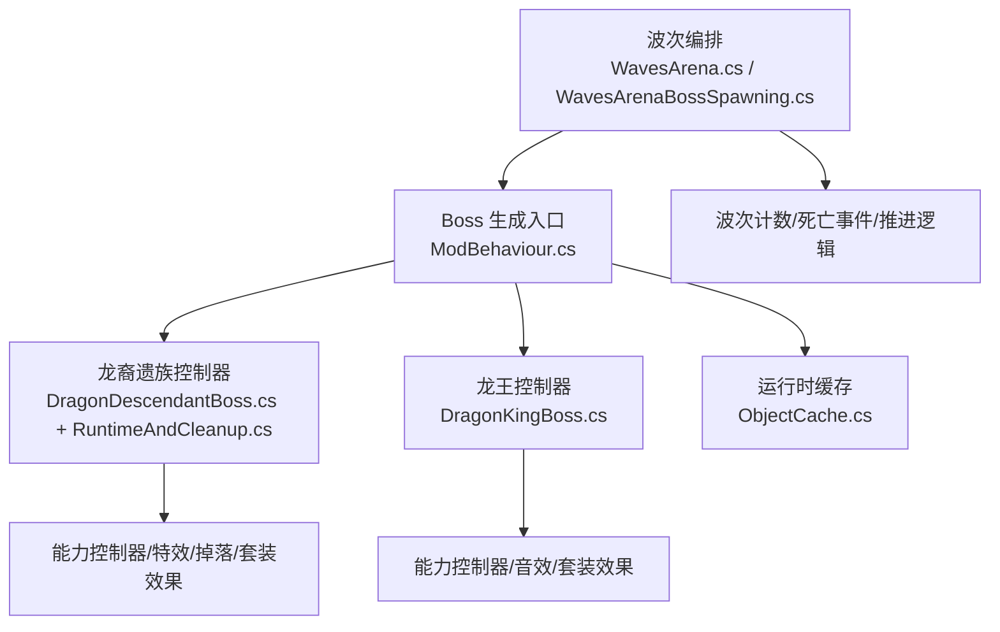
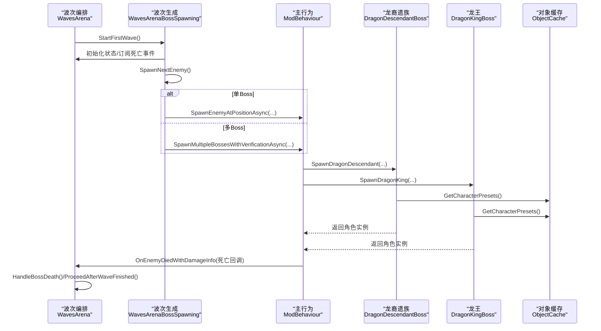
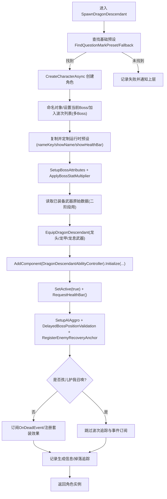
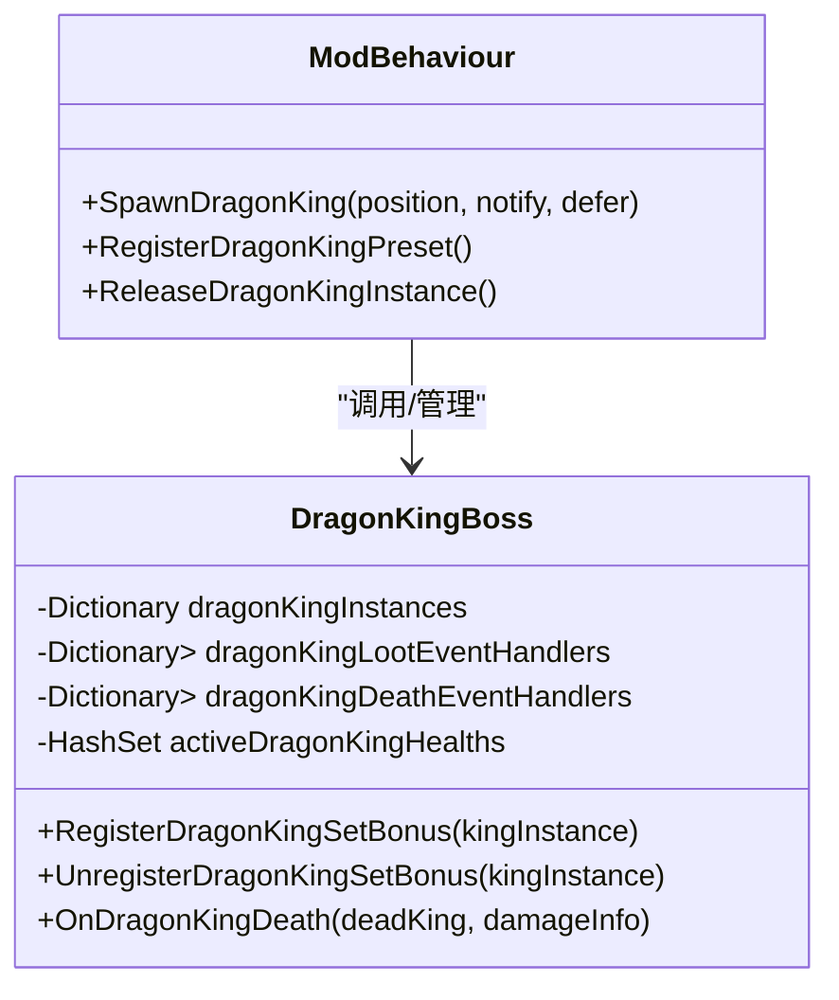
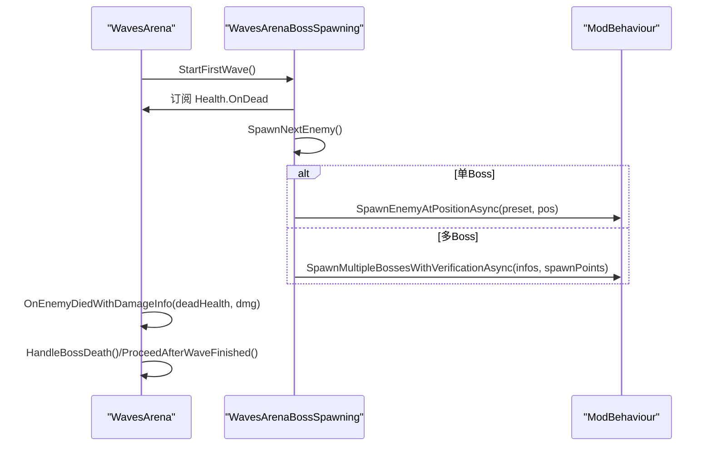
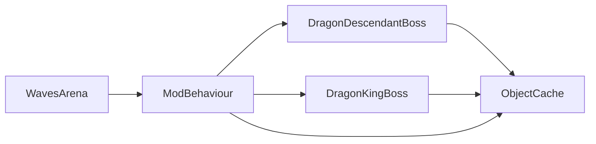

# Boss 生命周期管理

<cite>
**本文引用的文件**
- [ModBehaviour.cs](file://ModBehaviour.cs)
- [WavesArena.cs](file://WavesArena/WavesArena.cs)
- [WavesArenaBossSpawning.cs](file://WavesArena/WavesArenaBossSpawning.cs)
- [DragonDescendantBoss.cs](file://Integration/DragonDescendant/DragonDescendantBoss.cs)
- [DragonDescendantBoss_RuntimeAndCleanup.cs](file://Integration/DragonDescendant/DragonDescendantBoss_RuntimeAndCleanup.cs)
- [DragonKingBoss.cs](file://Integration/DragonKing/DragonKingBoss.cs)
- [ObjectCache.cs](file://Common/Infrastructure/ObjectCache.cs)
- [BossRushRuntimeModuleBase.cs](file://Common/Lifecycle/BossRushRuntimeModuleBase.cs)
</cite>

## 目录
1. [简介](#简介)
2. [项目结构](#项目结构)
3. [核心组件](#核心组件)
4. [架构总览](#架构总览)
5. [详细组件分析](#详细组件分析)
6. [依赖关系分析](#依赖关系分析)
7. [性能考量](#性能考量)
8. [故障排查指南](#故障排查指南)
9. [结论](#结论)
10. [附录](#附录)

## 简介
本文件面向 BossRush 模组中的“Boss 生命周期管理”，聚焦以下目标：
- 完整说明 Boss 的生成、初始化、激活与销毁清理流程。
- 深入解析 SpawnDragonDescendant 的实现原理，包括预设查找、角色创建、属性设置与装备集成。
- 解释 Boss 与波次追踪系统的集成方式，包括多 Boss 模式支持与死亡事件处理。
- 总结性能优化策略（预设缓存、静态缓存管理与内存优化）。
- 提供新增 Boss 时的生命周期最佳实践与常见陷阱规避建议。

## 项目结构
Boss 生命周期由“波次编排”“Boss 具体实现”“运行时基础设施”三部分协作完成：
- 波次编排：负责开始挑战、选择下一波敌人、分配刷怪点、重试机制、波次推进与失败回退。
- Boss 具体实现：以龙裔遗族与龙王为例，封装各自生成、属性配置、装备注入、能力控制器装配、事件订阅与清理。
- 运行时基础设施：提供对象缓存、场景切换失效、通用清理辅助等。

图表来源
- [WavesArena.cs:108-184](file://WavesArena/WavesArena.cs#L108-L184)
- [WavesArenaBossSpawning.cs:346-473](file://WavesArena/WavesArenaBossSpawning.cs#L346-L473)
- [ModBehaviour.cs:1176-1198](file://ModBehaviour.cs#L1176-L1198)
- [DragonDescendantBoss.cs:61-235](file://Integration/DragonDescendant/DragonDescendantBoss.cs#L61-L235)
- [DragonKingBoss.cs:209-371](file://Integration/DragonKing/DragonKingBoss.cs#L209-L371)
- [ObjectCache.cs:150-159](file://Common/Infrastructure/ObjectCache.cs#L150-L159)

章节来源
- [WavesArena.cs:108-184](file://WavesArena/WavesArena.cs#L108-L184)
- [WavesArenaBossSpawning.cs:346-473](file://WavesArena/WavesArenaBossSpawning.cs#L346-L473)
- [ModBehaviour.cs:1176-1198](file://ModBehaviour.cs#L1176-L1198)
- [ObjectCache.cs:150-159](file://Common/Infrastructure/ObjectCache.cs#L150-L159)

## 核心组件
- 波次编排器
  - 负责启动挑战、随机化/过滤 Boss 池、计算并显示倒计时、按单/多 Boss 模式生成敌人、处理生成失败与重试、推进到下一波或结束挑战。
- Boss 控制器（以龙裔遗族与龙王为代表）
  - 负责查找基础预设、异步创建角色、复制并定制运行时预设、设置血条与属性、应用全局倍率、装备武器与护甲、附加能力控制器、订阅死亡/掉落事件、注册套装效果、延迟位置校验与恢复锚点注册。
- 运行时基础设施
  - 提供场景对象缓存（如 CharacterRandomPreset）、按场景自动失效、强制刷新与重置静态缓存；提供通用清理辅助方法。

章节来源
- [WavesArena.cs:555-641](file://WavesArena/WavesArena.cs#L555-L641)
- [WavesArenaBossSpawning.cs:117-201](file://WavesArena/WavesArenaBossSpawning.cs#L117-L201)
- [DragonDescendantBoss.cs:61-235](file://Integration/DragonDescendant/DragonDescendantBoss.cs#L61-L235)
- [DragonKingBoss.cs:209-371](file://Integration/DragonKing/DragonKingBoss.cs#L209-L371)
- [ObjectCache.cs:150-159](file://Common/Infrastructure/ObjectCache.cs#L150-L159)

## 架构总览
下图展示从“开始第一波”到“Boss 生成与激活”的关键调用链，以及“死亡事件→波次推进”的回流路径。

图表来源
- [WavesArena.cs:108-184](file://WavesArena/WavesArena.cs#L108-L184)
- [WavesArenaBossSpawning.cs:346-473](file://WavesArena/WavesArenaBossSpawning.cs#L346-L473)
- [DragonDescendantBoss.cs:61-235](file://Integration/DragonDescendant/DragonDescendantBoss.cs#L61-L235)
- [DragonKingBoss.cs:209-371](file://Integration/DragonKing/DragonKingBoss.cs#L209-L371)
- [ObjectCache.cs:150-159](file://Common/Infrastructure/ObjectCache.cs#L150-L159)

## 详细组件分析

### 龙裔遗族 SpawnDragonDescendant 流程
该方法是龙裔遗族 Boss 的核心生成入口，覆盖预设查找、角色创建、属性设置、装备集成、能力控制器装配、事件订阅与激活。

图表来源
- [DragonDescendantBoss.cs:61-235](file://Integration/DragonDescendant/DragonDescendantBoss.cs#L61-L235)
- [DragonDescendantBoss.cs:262-426](file://Integration/DragonDescendant/DragonDescendantBoss.cs#L262-L426)
- [DragonDescendantBoss.cs:568-676](file://Integration/DragonDescendant/DragonDescendantBoss.cs#L568-L676)
- [DragonDescendantBoss.cs:678-771](file://Integration/DragonDescendant/DragonDescendantBoss.cs#L678-L771)

章节来源
- [DragonDescendantBoss.cs:61-235](file://Integration/DragonDescendant/DragonDescendantBoss.cs#L61-L235)
- [DragonDescendantBoss.cs:262-426](file://Integration/DragonDescendant/DragonDescendantBoss.cs#L262-L426)
- [DragonDescendantBoss.cs:568-676](file://Integration/DragonDescendant/DragonDescendantBoss.cs#L568-L676)
- [DragonDescendantBoss.cs:678-771](file://Integration/DragonDescendant/DragonDescendantBoss.cs#L678-L771)

### 龙王生成与多实例生命周期
龙王支持多实例并行存在，使用字典维护实例与能力控制器映射，并为每个实例独立订阅掉落与死亡事件，避免泄漏与误触发。

图表来源
- [DragonKingBoss.cs:25-95](file://Integration/DragonKing/DragonKingBoss.cs#L25-L95)
- [DragonKingBoss.cs:209-371](file://Integration/DragonKing/DragonKingBoss.cs#L209-L371)
- [DragonKingBoss.cs:559-634](file://Integration/DragonKing/DragonKingBoss.cs#L559-L634)

章节来源
- [DragonKingBoss.cs:25-95](file://Integration/DragonKing/DragonKingBoss.cs#L25-L95)
- [DragonKingBoss.cs:209-371](file://Integration/DragonKing/DragonKingBoss.cs#L209-L371)
- [DragonKingBoss.cs:559-634](file://Integration/DragonKing/DragonKingBoss.cs#L559-L634)

### 波次系统与多 Boss 模式集成
- 开始第一波：打乱/过滤 Boss 池、清空场景敌人、订阅死亡事件、立即生成首波。
- 生成下一波：根据 bossesPerWave 决定单/多 Boss 生成；多 Boss 时通过 FindMultipleSafeSpawnPoints 为每个 Boss 分配不重复的安全刷怪点；具备最多三次重试与失败修正。
- 死亡事件：统一在 Health.OnDead 中识别当前波 Boss 并处理掉落、成就、计数与推进。
- 推进逻辑：当当前波剩余 Boss 数为 0 或全部生成失败时，推进到下一波或结束挑战。

图表来源
- [WavesArena.cs:108-184](file://WavesArena/WavesArena.cs#L108-L184)
- [WavesArena.cs:213-346](file://WavesArena/WavesArena.cs#L213-L346)
- [WavesArena.cs:348-506](file://WavesArena/WavesArena.cs#L348-L506)
- [WavesArenaBossSpawning.cs:346-473](file://WavesArena/WavesArenaBossSpawning.cs#L346-L473)

章节来源
- [WavesArena.cs:108-184](file://WavesArena/WavesArena.cs#L108-L184)
- [WavesArena.cs:213-346](file://WavesArena/WavesArena.cs#L213-L346)
- [WavesArena.cs:348-506](file://WavesArena/WavesArena.cs#L348-L506)
- [WavesArenaBossSpawning.cs:346-473](file://WavesArena/WavesArenaBossSpawning.cs#L346-L473)

### 预设查找与装备集成细节
- 预设查找：优先通过 nameKey 精确匹配（如 Cname_Boss_Red），其次名称模糊匹配，最终回退到 ??? 预设；结果被缓存以避免重复扫描。
- 装备集成：先读取已装备武器的完整属性（用于二阶段射击），再移除旧武器、实例化并配置龙息武器、添加到库存并装备至主槽位，最后为 Boss 武器添加火焰特效。
- 属性设置：设置 MaxHealth、GunDamageMultiplier、MeleeDamageMultiplier，并恢复满血；随后应用全局 Boss 数值倍率。

章节来源
- [DragonDescendantBoss.cs:262-426](file://Integration/DragonDescendant/DragonDescendantBoss.cs#L262-L426)
- [DragonDescendantBoss.cs:568-676](file://Integration/DragonDescendant/DragonDescendantBoss.cs#L568-L676)
- [DragonDescendantBoss.cs:678-771](file://Integration/DragonDescendant/DragonDescendantBoss.cs#L678-L771)

### 死亡事件与套装效果
- 龙裔遗族：在 OnDead 中取消注册套装效果、移除监听、销毁运行时预设、清理引用；同时触发 BossRush 标准死亡处理。
- 龙王：每个实例独立订阅 BeforeCharacterSpawnLootOnDead 与 Health.OnDead；死亡时释放能力控制器、注销事件、销毁运行时预设、释放资源（引用计数）。
- 套装效果：龙裔遗族将火焰伤害免疫并转化为治疗；龙王对火焰伤害免疫并转化为治疗，且支持多实例共享全局事件但仅注册一次。

章节来源
- [DragonDescendantBoss_RuntimeAndCleanup.cs:181-256](file://Integration/DragonDescendant/DragonDescendantBoss_RuntimeAndCleanup.cs#L181-L256)
- [DragonDescendantBoss_RuntimeAndCleanup.cs:326-468](file://Integration/DragonDescendant/DragonDescendantBoss_RuntimeAndCleanup.cs#L326-L468)
- [DragonKingBoss.cs:559-634](file://Integration/DragonKing/DragonKingBoss.cs#L559-L634)
- [DragonKingBoss.cs:700-800](file://Integration/DragonKing/DragonKingBoss.cs#L700-L800)

## 依赖关系分析
- 波次编排依赖 ModBehaviour 提供的通用生成与 AI 仇恨设置；Boss 控制器依赖 ObjectCache 获取预设；Boss 控制器之间无直接耦合，均通过 ModBehaviour 协调。
- 事件订阅集中在 Health.OnDead 与 Boss 专属事件（BeforeCharacterSpawnLootOnDead），确保掉落与波次推进解耦。
- 静态缓存与场景切换：ObjectCache 按场景名自动失效；Boss 控制器在场景切换时提供 ClearStaticCache 方法清理静态引用，防止悬垂指针。

图表来源
- [WavesArena.cs:555-641](file://WavesArena/WavesArena.cs#L555-L641)
- [DragonDescendantBoss.cs:262-426](file://Integration/DragonDescendant/DragonDescendantBoss.cs#L262-L426)
- [DragonKingBoss.cs:209-371](file://Integration/DragonKing/DragonKingBoss.cs#L209-L371)
- [ObjectCache.cs:150-159](file://Common/Infrastructure/ObjectCache.cs#L150-L159)

章节来源
- [WavesArena.cs:555-641](file://WavesArena/WavesArena.cs#L555-L641)
- [DragonDescendantBoss.cs:262-426](file://Integration/DragonDescendant/DragonDescendantBoss.cs#L262-L426)
- [DragonKingBoss.cs:209-371](file://Integration/DragonKing/DragonKingBoss.cs#L209-L371)
- [ObjectCache.cs:150-159](file://Common/Infrastructure/ObjectCache.cs#L150-L159)

## 性能考量
- 预设缓存
  - 使用 ObjectCache.GetCharacterPresets() 缓存 CharacterRandomPreset 数组，避免每次生成都调用 Resources.FindObjectsOfTypeAll。
  - Boss 控制器内部对基础预设进行本地缓存（如 cachedQuestionMarkPreset、cachedFallbackPreset），首次搜索后直接命中。
- 静态缓存管理
  - 龙裔遗族提供 ClearDragonDescendantStaticCache，清理预设、物品、武器配置、Buff 处理器与能力控制器缓存。
  - 龙王提供 ClearDragonKingStaticCache，清理预设、资产管理器、能力控制器与场景级缓存，并重置 BGM 状态。
- 内存优化
  - 龙王使用引用计数释放共享缓存，仅在最后一个实例退出时清理，避免影响仍在场的其它实例。
  - 事件订阅采用命名委托/局部捕获变量，便于正确 RemoveListener，避免闭包导致的内存泄漏。
- 运行时开销控制
  - 多 Boss 批量生成串行执行并间隔短暂等待，降低瞬时压力；失败重试限制次数并重新分配安全刷怪点。
  - 延迟位置校验与恢复锚点注册，减少地形加载慢导致的卡位问题。

章节来源
- [ObjectCache.cs:150-159](file://Common/Infrastructure/ObjectCache.cs#L150-L159)
- [DragonDescendantBoss.cs:262-426](file://Integration/DragonDescendant/DragonDescendantBoss.cs#L262-L426)
- [DragonDescendantBoss.cs:357-380](file://Integration/DragonDescendant/DragonDescendantBoss.cs#L357-L380)
- [DragonKingBoss.cs:77-110](file://Integration/DragonKing/DragonKingBoss.cs#L77-L110)
- [WavesArenaBossSpawning.cs:525-661](file://WavesArena/WavesArenaBossSpawning.cs#L525-L661)

## 故障排查指南
- 生成失败
  - 检查预设查找是否命中（nameKey/名称匹配/回退预设），查看日志输出与缓存标记。
  - 若 CreateCharacterAsync 返回 null，确认 NotifyBossSpawnFailed 是否被调用并推进波次。
- 位置异常
  - 使用 DelayedBossPositionValidation 与 ValidateAndFixBossPosition 检查是否卡在地下或虚空；必要时通过 TryRecoverEnemyToNearestSpawnPoint 恢复。
- 事件泄漏
  - 确认 OnDead 与 BeforeCharacterSpawnLootOnDead 的 RemoveListener/-= 操作是否执行；龙王需确保每个实例的委托都被注销。
- 多 Boss 卡波
  - 检查 currentWaveBosses 列表是否正确更新；若批量生成部分失败，应修正 bossesInCurrentWaveRemaining 并推进。
- 静态缓存残留
  - 场景切换时调用对应 ClearStaticCache，避免持有已销毁对象引用。

章节来源
- [WavesArena.cs:509-549](file://WavesArena/WavesArena.cs#L509-L549)
- [WavesArenaBossSpawning.cs:253-341](file://WavesArena/WavesArenaBossSpawning.cs#L253-L341)
- [DragonKingBoss.cs:559-634](file://Integration/DragonKing/DragonKingBoss.cs#L559-L634)
- [DragonDescendantBoss.cs:357-380](file://Integration/DragonDescendant/DragonDescendantBoss.cs#L357-L380)

## 结论
BossRush 的生命周期管理通过“波次编排—Boss 控制器—运行时基础设施”三层协作，实现了稳定的生成、激活与清理闭环。SpawnDragonDescendant 提供了清晰的预设查找、角色创建、属性与装备集成路径；波次系统对多 Boss 模式与失败重试有完善支持；缓存与静态清理策略有效降低了运行时开销与内存风险。遵循本文的最佳实践，可安全扩展新 Boss 并避免常见陷阱。

## 附录
- 新增 Boss 生命周期最佳实践
  - 在 InitializeEnemyPresets 中注册新 Boss 的 EnemyPresetInfo，并确保 name/displayName/team/baseHealth/damageMultiplier 合理。
  - 提供独立的 SpawnXxx 方法，复用 ModBehaviour 的通用流程：查找预设、创建角色、复制运行时预设、设置血条与属性、应用全局倍率、装备、附加能力控制器、订阅事件、激活与位置校验。
  - 为每个实例维护事件委托映射，确保 OnDead 与掉落事件能正确注销；必要时提供 ReleaseXxxInstance 引用计数清理。
  - 接入 ObjectCache 与 ClearStaticCache，保证场景切换时缓存失效与静态引用清理。
  - 在多 Boss 模式下，确保加入 currentWaveBosses 并参与波次计数；若为子体/非主线（如孩儿护我召唤），应跳过波次追踪但保留掉落。
- 常见陷阱
  - 直接修改原版预设导致污染；应复制运行时预设并仅作用于当前实例。
  - 忘记订阅/注销事件导致内存泄漏或重复触发。
  - 忽略位置校验导致 Boss 卡在地下或虚空。
  - 批量生成未做重试与失败修正，造成波次卡死。
  - 静态缓存未清理，跨场景持有已销毁对象引用。