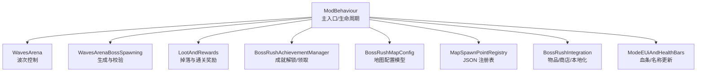
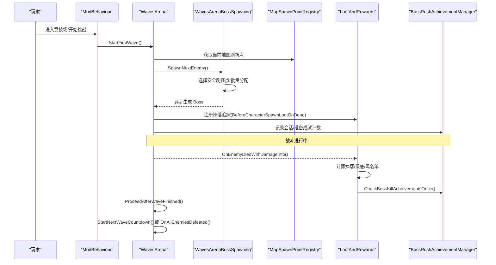
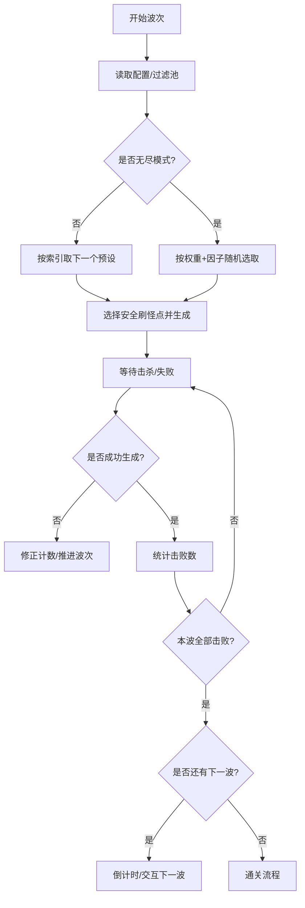
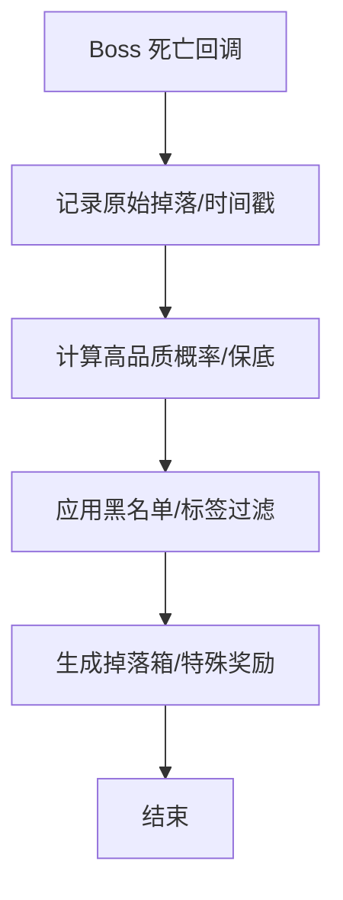
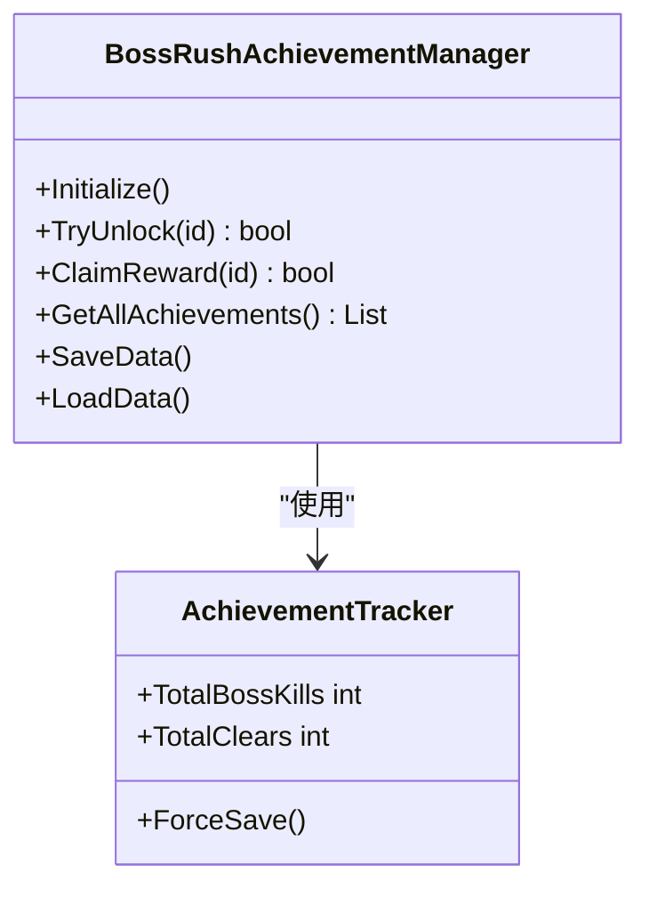
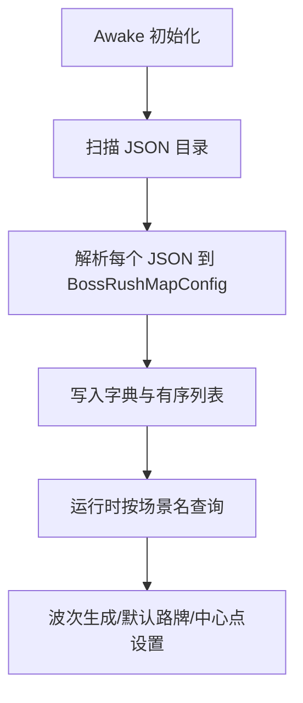
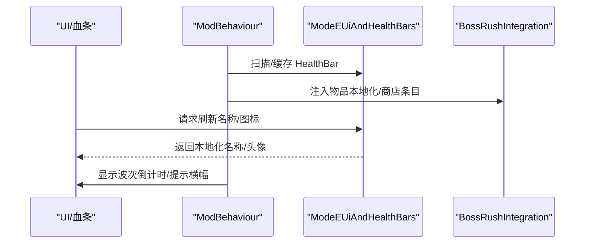
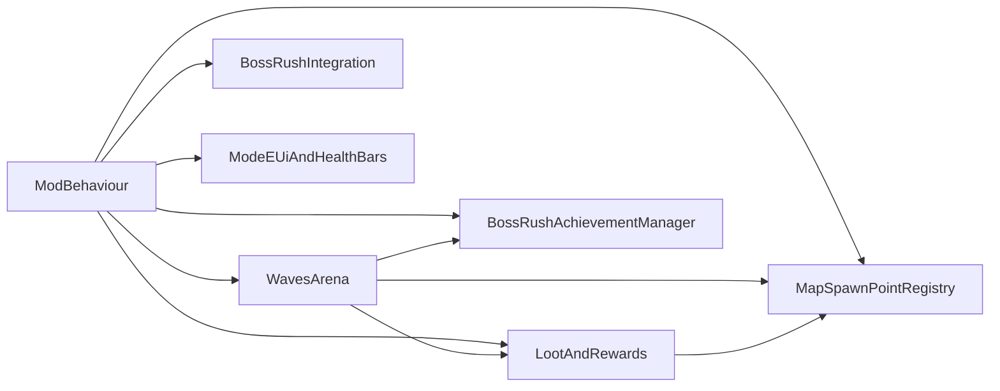

# Boss 系统集成

<cite>
**本文引用的文件**
- [ModBehaviour.cs](file://ModBehaviour.cs)
- [BossRushIntegration.cs](file://Integration/BossRushIntegration.cs)
- [WavesArena.cs](file://WavesArena/WavesArena.cs)
- [WavesArenaBossSpawning.cs](file://WavesArena/WavesArenaBossSpawning.cs)
- [LootAndRewards.cs](file://LootAndRewards/LootAndRewards.cs)
- [BossRushAchievementManager.cs](file://Achievement/BossRushAchievementManager.cs)
- [BossRushMapConfig.cs](file://Common/MapConfig/BossRushMapConfig.cs)
- [MapSpawnPointRegistry.cs](file://Common/MapConfig/MapSpawnPointRegistry.cs)
- [ModeEUiAndHealthBars.cs](file://ModeE/ModeEUiAndHealthBars.cs)
</cite>

## 目录
1. [简介](#简介)
2. [项目结构](#项目结构)
3. [核心组件](#核心组件)
4. [架构总览](#架构总览)
5. [详细组件分析](#详细组件分析)
6. [依赖关系分析](#依赖关系分析)
7. [性能考虑](#性能考虑)
8. [故障排查指南](#故障排查指南)
9. [结论](#结论)
10. [附录](#附录)

## 简介
本文件面向 Boss 系统与游戏核心系统的集成，覆盖波次管理、掉落与奖励、成就追踪、地图配置与刷新点、NPC 交互、UI 血条与提示等关键路径。文档以代码级事实为依据，提供流程图与时序图，帮助开发者快速理解并安全扩展 Boss 集成。

## 项目结构
BossRush 模组围绕 ModBehaviour 主入口组织，按职责拆分为多个子系统：
- 波次与竞技场：WavesArena、WavesArenaBossSpawning
- 掉落与奖励：LootAndRewards
- 成就系统：Achievement 目录（管理器、触发器、UI）
- 地图配置：Common/MapConfig（数据模型与 JSON 注册表）
- 系统集成：Integration（动态物品、商店注入、本地化）
- UI 与血条：ModeE/ModeF 中的血条与名称更新逻辑
- 运行时宿主：BossRushRuntimeModuleHost 与各 RuntimeModule

图表来源
- [ModBehaviour.cs:598-797](file://ModBehaviour.cs#L598-L797)
- [WavesArena.cs:108-506](file://WavesArena/WavesArena.cs#L108-L506)
- [WavesArenaBossSpawning.cs:17-693](file://WavesArena/WavesArenaBossSpawning.cs#L17-L693)
- [LootAndRewards.cs:322-432](file://LootAndRewards/LootAndRewards.cs#L322-L432)
- [BossRushAchievementManager.cs:46-235](file://Achievement/BossRushAchievementManager.cs#L46-L235)
- [BossRushMapConfig.cs:9-46](file://Common/MapConfig/BossRushMapConfig.cs#L9-L46)
- [MapSpawnPointRegistry.cs:44-88](file://Common/MapConfig/MapSpawnPointRegistry.cs#L44-L88)
- [BossRushIntegration.cs:439-491](file://Integration/BossRushIntegration.cs#L439-L491)
- [ModeEUiAndHealthBars.cs:22-411](file://ModeE/ModeEUiAndHealthBars.cs#L22-L411)

章节来源
- [ModBehaviour.cs:598-797](file://ModBehaviour.cs#L598-L797)

## 核心组件
- 波次与竞技场：负责开始挑战、倒计时、多 Boss 同波、失败重试、波次推进与完成处理。
- 掉落与奖励：拦截 Boss 死亡掉落、随机品质加成、通关奖励箱、无间炼狱现金池与里程碑奖励。
- 成就追踪：定义成就、解锁判定、奖励发放、存档持久化与事件广播。
- 地图配置：从 JSON 加载地图的刷新点、默认路牌位置、北方向、排序等；提供查询接口。
- 系统集成：动态物品初始化、商店注入、本地化注入、场景加载钩子。
- UI 与血条：玩家与目标名称、血条显示刷新、语言切换同步。

章节来源
- [WavesArena.cs:108-506](file://WavesArena/WavesArena.cs#L108-L506)
- [LootAndRewards.cs:322-432](file://LootAndRewards/LootAndRewards.cs#L322-L432)
- [BossRushAchievementManager.cs:46-235](file://Achievement/BossRushAchievementManager.cs#L46-L235)
- [MapSpawnPointRegistry.cs:44-88](file://Common/MapConfig/MapSpawnPointRegistry.cs#L44-L88)
- [BossRushIntegration.cs:439-491](file://Integration/BossRushIntegration.cs#L439-L491)
- [ModeEUiAndHealthBars.cs:22-411](file://ModeE/ModeEUiAndHealthBars.cs#L22-L411)

## 架构总览
Boss 集成的关键时序如下：玩家进入竞技场 → 初始化敌人预设与过滤 → 开始第一波 → 选择刷怪点 → 生成 Boss → 死亡回调 → 掉落/成就/进度推进 → 下一波或通关。

图表来源
- [WavesArena.cs:108-506](file://WavesArena/WavesArena.cs#L108-L506)
- [WavesArenaBossSpawning.cs:346-693](file://WavesArena/WavesArenaBossSpawning.cs#L346-L693)
- [LootAndRewards.cs:322-432](file://LootAndRewards/LootAndRewards.cs#L322-L432)
- [MapSpawnPointRegistry.cs:44-88](file://Common/MapConfig/MapSpawnPointRegistry.cs#L44-L88)

## 详细组件分析

### 波次管理系统
- 开始挑战：打乱敌人顺序、清理场景敌人、订阅死亡事件、立即生成首敌。
- 波次推进：单 Boss 或多 Boss 同波计数，全部击败后通知 NPC、推进索引或进入无尽模式。
- 失败恢复：生成失败时修正计数并推进，避免卡波。
- 难度调节：普通模式顺序推进；无尽模式按血量权重与用户因子随机选取。

图表来源
- [WavesArena.cs:108-506](file://WavesArena/WavesArena.cs#L108-L506)
- [WavesArenaBossSpawning.cs:346-693](file://WavesArena/WavesArenaBossSpawning.cs#L346-L693)

章节来源
- [WavesArena.cs:108-506](file://WavesArena/WavesArena.cs#L108-L506)
- [WavesArenaBossSpawning.cs:17-693](file://WavesArena/WavesArenaBossSpawning.cs#L17-L693)

### 掉落系统与通关奖励
- 掉落拦截：在 Boss 死亡前挂接 BeforeCharacterSpawnLootOnDead，统一收集原始掉落数量与时间戳。
- 随机品质：根据血量范围与击杀速度提升高品质概率；支持原版 Q5+ 保底策略。
- 黑名单：通过标签与黑名单排除特定物品进入通用掉落池。
- 通关奖励：所有敌人击败后生成难度奖励箱；无尽模式累计现金池并按里程碑发放奖励。

图表来源
- [LootAndRewards.cs:322-432](file://LootAndRewards/LootAndRewards.cs#L322-L432)
- [LootAndRewards.cs:493-586](file://LootAndRewards/LootAndRewards.cs#L493-L586)

章节来源
- [LootAndRewards.cs:322-432](file://LootAndRewards/LootAndRewards.cs#L322-L432)
- [LootAndRewards.cs:493-586](file://LootAndRewards/LootAndRewards.cs#L493-L586)

### 成就追踪系统
- 成就定义：基础通关、累计通关、无尽波次、无伤、速通、Boss 击杀、收藏类、终极成就。
- 解锁与领取：TryUnlock 解锁并持久化；ClaimReward 发放现金/物品奖励并标记已领取。
- 自动补发：当其他成就全部解锁后，自动解锁“成就收集者”。
- 事件总线：发布解锁与领取事件，供 UI 与弹窗消费。

图表来源
- [BossRushAchievementManager.cs:46-235](file://Achievement/BossRushAchievementManager.cs#L46-L235)
- [BossRushAchievementManager.cs:244-349](file://Achievement/BossRushAchievementManager.cs#L244-L349)
- [BossRushAchievementManager.cs:377-419](file://Achievement/BossRushAchievementManager.cs#L377-L419)

章节来源
- [BossRushAchievementManager.cs:46-235](file://Achievement/BossRushAchievementManager.cs#L46-L235)
- [BossRushAchievementManager.cs:244-349](file://Achievement/BossRushAchievementManager.cs#L244-L349)
- [BossRushAchievementManager.cs:377-419](file://Achievement/BossRushAchievementManager.cs#L377-L419)

### 地图配置与刷新点
- 数据模型：包含场景名、场景ID、显示名、刷新点数组、自定义传送位置、默认路牌位置、北方向、排序、Mode E 专用刷怪点等。
- 注册表：Awake 阶段扫描 Assets/SpawnPoints/*.json，解析为字典缓存；提供 TryGet/All 查询。
- 运行时查询：ModBehaviour 提供 GetMapConfigBySceneName/GetCurrentMapConfig 等方法；WavesArena 通过 GetCurrentSpawnPoints 获取刷新点。

图表来源
- [MapSpawnPointRegistry.cs:44-88](file://Common/MapConfig/MapSpawnPointRegistry.cs#L44-L88)
- [MapSpawnPointRegistry.cs:136-164](file://Common/MapConfig/MapSpawnPointRegistry.cs#L136-L164)
- [BossRushMapConfig.cs:9-46](file://Common/MapConfig/BossRushMapConfig.cs#L9-L46)
- [ModBehaviour.cs:52-92](file://ModBehaviour.cs#L52-L92)

章节来源
- [MapSpawnPointRegistry.cs:44-88](file://Common/MapConfig/MapSpawnPointRegistry.cs#L44-L88)
- [BossRushMapConfig.cs:9-46](file://Common/MapConfig/BossRushMapConfig.cs#L9-L46)
- [ModBehaviour.cs:52-92](file://ModBehaviour.cs#L52-L92)

### 与 NPC 系统的交互
- 战斗开始/结束：SpawnNextEnemy 与 ProceedAfterWaveFinished 中调用 NotifyCourierBossFightStart/End 与 NotifyCourierNoBoss，用于快递员对话与状态提示。
- 共享刷新点：在非 Arena 支援放置模式下，公共 NPC 可复用 BossRush 地图刷怪点池，保证行为一致性。

章节来源
- [WavesArenaBossSpawning.cs:346-356](file://WavesArena/WavesArenaBossSpawning.cs#L346-L356)
- [WavesArena.cs:446-506](file://WavesArena/WavesArena.cs#L446-L506)
- [ModBehaviour.cs:120-161](file://ModBehaviour.cs#L120-L161)

### 与 UI 系统的集成（血条、提示、界面更新）
- 血条与名称：ModeE 模块维护 HealthBar 缓存、语言切换同步、Steam 名称回退与强制刷新。
- 提示信息：波次倒计时横幅、下一波 Boss 预告、错误与警告日志限频输出。
- 商店与本地化：动态物品初始化、商店条目注入、多语言文本注入。

图表来源
- [ModeEUiAndHealthBars.cs:22-411](file://ModeE/ModeEUiAndHealthBars.cs#L22-L411)
- [BossRushIntegration.cs:439-491](file://Integration/BossRushIntegration.cs#L439-L491)
- [WavesArena.cs:186-207](file://WavesArena/WavesArena.cs#L186-L207)

章节来源
- [ModeEUiAndHealthBars.cs:22-411](file://ModeE/ModeEUiAndHealthBars.cs#L22-L411)
- [BossRushIntegration.cs:439-491](file://Integration/BossRushIntegration.cs#L439-L491)
- [WavesArena.cs:186-207](file://WavesArena/WavesArena.cs#L186-L207)

## 依赖关系分析
- ModBehaviour 作为中枢，协调波次、掉落、成就、地图配置、系统集成与 UI。
- WavesArena 依赖 MapSpawnPointRegistry 获取刷新点；依赖 LootAndRewards 进行掉落处理；依赖成就管理器进行成就计数。
- LootAndRewards 依赖物品资产集合与标签系统，构建候选池与价值缓存。
- 成就管理器依赖存档系统与事件总线，对外暴露解锁与领取 API。

图表来源
- [ModBehaviour.cs:598-797](file://ModBehaviour.cs#L598-L797)
- [WavesArena.cs:108-506](file://WavesArena/WavesArena.cs#L108-L506)
- [LootAndRewards.cs:322-432](file://LootAndRewards/LootAndRewards.cs#L322-L432)
- [BossRushAchievementManager.cs:46-235](file://Achievement/BossRushAchievementManager.cs#L46-L235)
- [MapSpawnPointRegistry.cs:44-88](file://Common/MapConfig/MapSpawnPointRegistry.cs#L44-L88)
- [BossRushIntegration.cs:439-491](file://Integration/BossRushIntegration.cs#L439-L491)
- [ModeEUiAndHealthBars.cs:22-411](file://ModeE/ModeEUiAndHealthBars.cs#L22-L411)

章节来源
- [ModBehaviour.cs:598-797](file://ModBehaviour.cs#L598-L797)

## 性能考虑
- 刷怪点选择：优先安全距离外的最近点，批量生成时去重分配，避免重叠与卡顿。
- 掉落价值缓存：分帧初始化物品价值与品质桶，避免 Boss 死亡时同步实例化大量物品导致掉帧。
- 角色缓存与清理：定期刷新 CharacterMainControl 缓存，减少 FindObjectsOfType 开销；复用销毁列表。
- 日志限频：对集成与掉落警告日志进行时间间隔限制，降低 I/O 压力。
- 竞技场范围：基于地图配置设置中心点与半径，限制清理与禁用范围，提高大规模战斗稳定性。

章节来源
- [WavesArenaBossSpawning.cs:117-251](file://WavesArena/WavesArenaBossSpawning.cs#L117-L251)
- [LootAndRewards.cs:493-586](file://LootAndRewards/LootAndRewards.cs#L493-L586)
- [ModBehaviour.cs:530-552](file://ModBehaviour.cs#L530-L552)
- [BossRushIntegration.cs:65-81](file://Integration/BossRushIntegration.cs#L65-L81)
- [LootAndRewards.cs:246-262](file://LootAndRewards/LootAndRewards.cs#L246-L262)

## 故障排查指南
- 生成失败：检查当前地图刷新点是否为空；查看 SpawnNextEnemy 日志；确认安全刷怪点选择逻辑；必要时启用重试机制。
- 掉落异常：确认 Boss 掉落追踪是否注册成功；检查黑名单与标签过滤；查看物品价值缓存初始化结果。
- 成就未解锁：确认会话开始与 Boss 击杀计数；检查成就定义是否存在；验证存档读写是否成功。
- UI 不更新：检查 HealthBar 缓存是否失效；确认语言切换后是否标记脏并刷新；核对 Steam 名称回退逻辑。
- 商店注入失败：确认 BaseHub 场景与 MerchantID；检查动态物品 TypeID 是否初始化；查看注入日志与库存持久化。

章节来源
- [WavesArenaBossSpawning.cs:346-693](file://WavesArena/WavesArenaBossSpawning.cs#L346-L693)
- [LootAndRewards.cs:322-432](file://LootAndRewards/LootAndRewards.cs#L322-L432)
- [BossRushAchievementManager.cs:244-349](file://Achievement/BossRushAchievementManager.cs#L244-L349)
- [ModeEUiAndHealthBars.cs:22-411](file://ModeE/ModeEUiAndHealthBars.cs#L22-L411)
- [BossRushIntegration.cs:631-774](file://Integration/BossRushIntegration.cs#L631-L774)

## 结论
Boss 系统集成以 ModBehaviour 为核心，串联波次、掉落、成就、地图配置与 UI。通过 JSON 驱动的地图配置与安全的刷怪点选择，确保稳定生成；通过掉落价值缓存与日志限频保障性能；通过成就事件与 UI 刷新提供良好反馈。建议新增内容遵循现有模块边界，优先使用注册表与配置驱动，保持可扩展性与兼容性。

## 附录
- 最佳实践
  - 新增地图：在 Assets/SpawnPoints 下添加 JSON，确保 spawnPoints 非空且坐标合理；设置 sortOrder 与 mapNorth。
  - 新增 Boss：注册到敌人预设发现流程；如需专属掉落，加入黑名单或专属池；在成就系统中补充对应成就。
  - 性能优化：避免每帧分配大对象；使用缓存与复用容器；对高频操作加限频与条件判断。
  - 错误处理：所有外部调用包裹 try/catch；记录上下文信息；提供降级与回退逻辑。
  - 兼容性：尊重官方版本变更；通过反射与类型检查容错；避免硬编码路径与场景名。