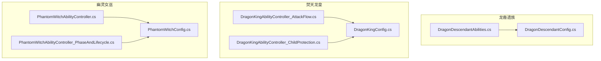
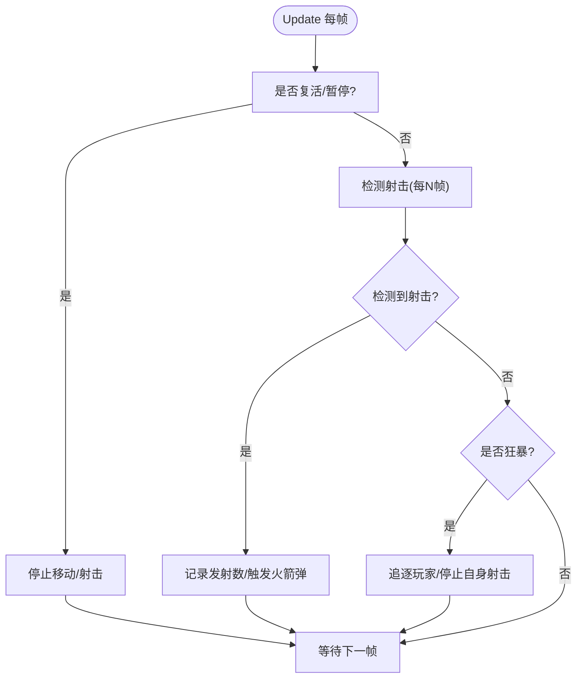
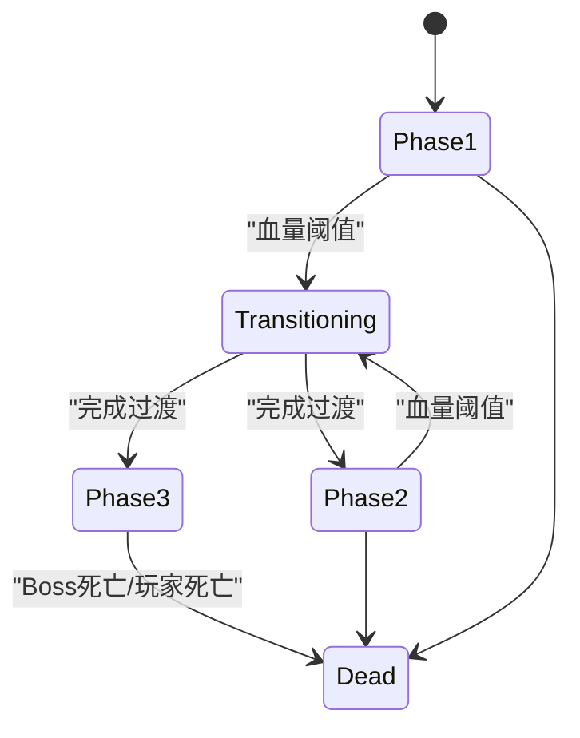
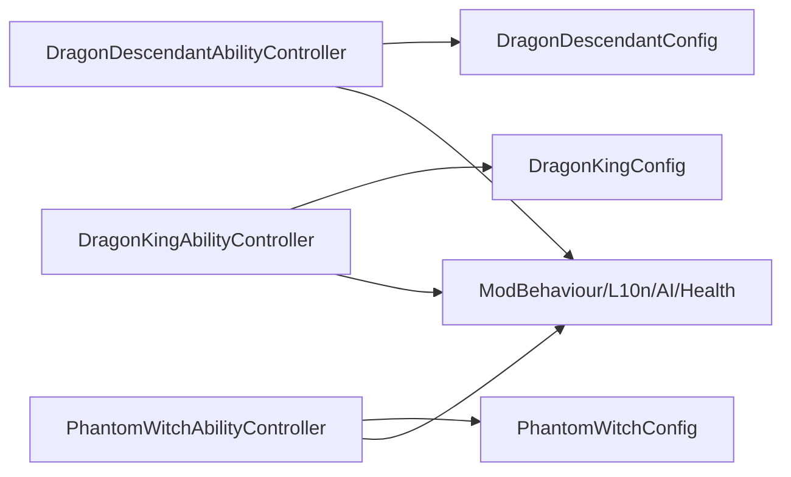

# Boss 能力系统架构

<cite>
**本文引用的文件**
- [DragonDescendantAbilities.cs](file://Integration/DragonDescendant/DragonDescendantAbilities.cs)
- [DragonDescendantConfig.cs](file://Integration/DragonDescendant/DragonDescendantConfig.cs)
- [DragonKingAbilityController_AttackFlow.cs](file://Integration/DragonKing/DragonKingAbilityController_AttackFlow.cs)
- [DragonKingAbilityController_ChildProtection.cs](file://Integration/DragonKing/DragonKingAbilityController_ChildProtection.cs)
- [DragonKingConfig.cs](file://Integration/DragonKing/DragonKingConfig.cs)
- [PhantomWitchAbilityController.cs](file://Integration/PhantomWitch/PhantomWitchAbilityController.cs)
- [PhantomWitchAbilityController_PhaseAndLifecycle.cs](file://Integration/PhantomWitch/PhantomWitchAbilityController_PhaseAndLifecycle.cs)
- [PhantomWitchConfig.cs](file://Integration/PhantomWitch/PhantomWitchConfig.cs)
</cite>

## 目录
1. [简介](#简介)
2. [项目结构](#项目结构)
3. [核心组件](#核心组件)
4. [架构总览](#架构总览)
5. [详细组件分析](#详细组件分析)
6. [依赖关系分析](#依赖关系分析)
7. [性能与稳定性](#性能与稳定性)
8. [故障排查指南](#故障排查指南)
9. [结论](#结论)
10. [附录：自定义 Boss 能力开发指南](#附录自定义-boss-能力开发指南)

## 简介
本文件面向 BossRushMod 的 Boss 能力系统，围绕三大 Boss 的能力控制器展开：龙裔遗族（DragonDescendant）、焚天龙皇（DragonKing）、幽灵女巫（PhantomWitch）。文档从设计模式、组件化架构、能力注册与执行流程、状态管理、阶段转换与技能组合、攻击流控制（目标选择、伤害计算、特效播放）等维度进行系统化说明，并提供自定义 Boss 能力的接口约定、配置方法与调试技巧。

## 项目结构
Boss 能力系统以“按 Boss 分目录”的方式组织代码，每个 Boss 拥有独立的 AbilityController 与 Config，并通过共享的基础设施（如 ModBehaviour、L10n、AssetManager、AI 封装等）协作。



图表来源
- [DragonDescendantAbilities.cs:1-522](file://Integration/DragonDescendant/DragonDescendantAbilities.cs#L1-L522)
- [DragonDescendantConfig.cs:1-234](file://Integration/DragonDescendant/DragonDescendantConfig.cs#L1-L234)
- [DragonKingAbilityController_AttackFlow.cs:1-746](file://Integration/DragonKing/DragonKingAbilityController_AttackFlow.cs#L1-L746)
- [DragonKingAbilityController_ChildProtection.cs:1-696](file://Integration/DragonKing/DragonKingAbilityController_ChildProtection.cs#L1-L696)
- [DragonKingConfig.cs:1-736](file://Integration/DragonKing/DragonKingConfig.cs#L1-L736)
- [PhantomWitchAbilityController.cs:1-368](file://Integration/PhantomWitch/PhantomWitchAbilityController.cs#L1-L368)
- [PhantomWitchAbilityController_PhaseAndLifecycle.cs:1-318](file://Integration/PhantomWitch/PhantomWitchAbilityController_PhaseAndLifecycle.cs#L1-L318)
- [PhantomWitchConfig.cs:1-318](file://Integration/PhantomWitch/PhantomWitchConfig.cs#L1-L318)

章节来源
- [DragonDescendantAbilities.cs:1-522](file://Integration/DragonDescendant/DragonDescendantAbilities.cs#L1-L522)
- [DragonKingAbilityController_AttackFlow.cs:1-746](file://Integration/DragonKing/DragonKingAbilityController_AttackFlow.cs#L1-L746)
- [PhantomWitchAbilityController.cs:1-368](file://Integration/PhantomWitch/PhantomWitchAbilityController.cs#L1-L368)

## 核心组件
- DragonDescendantAbilityController：负责龙裔遗族的射击检测、火箭弹/燃烧弹释放、复活与狂暴状态、冰属性减速、Mode E 阵营感知与脱战距离控制。
- DragonKingAbilityController：实现龙王的多阶段攻击循环、阶段转换、孩儿护我联动死亡、自定义射击系统、多种弹幕与位移技能。
- PhantomWitchAbilityController：基于“战术包轮播 + 三阶段”的 AI 状态机，管理传送、诅咒领域、镰刀重斩、召唤小怪与隐身/半隐身态切换。

章节来源
- [DragonDescendantAbilities.cs:23-199](file://Integration/DragonDescendant/DragonDescendantAbilities.cs#L23-L199)
- [DragonKingAbilityController_AttackFlow.cs:13-132](file://Integration/DragonKing/DragonKingAbilityController_AttackFlow.cs#L13-L132)
- [PhantomWitchAbilityController.cs:24-118](file://Integration/PhantomWitch/PhantomWitchAbilityController.cs#L24-L118)

## 架构总览
三个 Boss 控制器采用统一的设计模式：
- 初始化时绑定角色、健康组件、玩家引用与 AI 控制器；订阅关键事件（受伤、死亡）。
- 通过协程驱动主循环（AttackLoop），在每帧或固定间隔内更新目标、检查阶段转换、调度当前攻击序列。
- 使用配置类集中管理数值、序列、资源路径与音效。
- 阶段转换中暂停 AI、停止当前攻击、清理特效、播放过渡动画与消息，再恢复 AI 并重启攻击循环。
- 提供 Mode E/F 兼容的目标选择逻辑，避免准备期或无仇恨目标时的异常行为。

```mermaid
sequenceDiagram
participant Boss as "Boss 控制器"
participant Loop as "AttackLoop 协程"
participant Seq as "攻击序列/战术包"
participant Skill as "具体技能实现"
participant FX as "特效/音效"
participant AI as "AI 控制器"
Boss->>Loop : 启动 AttackLoop
loop 每回合
Loop->>Loop : 更新玩家引用/目标校验
Loop->>Seq : 读取当前攻击类型/战术包
Loop->>Skill : ExecuteAttack(...)
Skill->>FX : 生成特效/播放音效
Skill->>AI : 必要时暂停/恢复移动与射击
Skill-->>Loop : 完成
Loop->>Loop : 等待攻击间隔
end
```

图表来源
- [DragonKingAbilityController_AttackFlow.cs:17-132](file://Integration/DragonKing/DragonKingAbilityController_AttackFlow.cs#L17-L132)
- [PhantomWitchAbilityController_PhaseAndLifecycle.cs:19-103](file://Integration/PhantomWitch/PhantomWitchAbilityController_PhaseAndLifecycle.cs#L19-L103)

## 详细组件分析

### 龙裔遗族能力控制器（DragonDescendantAbilityController）
- 状态管理：子弹计数、是否已复活、狂暴状态、无敌状态、复活序列进行中、冰冻减速状态。
- 初始化：绑定 Boss 与 Health，订阅 OnHurtEvent，获取玩家引用，订阅射击事件（通过 Update 轮询弹药变化），预缓存预制体。
- 攻击流控制：Update 中检测射击（每 N 帧采样一次），非狂暴状态下触发火箭弹；狂暴状态下持续追逐并停止自身射击，改为直接生成子弹。
- 阶段/状态协调：血量低于阈值时投掷燃烧弹（可投向自己），首次濒死触发复活与对话气泡，复活后进入狂暴追逐与碰撞伤害。
- 性能优化：WaitForSeconds 静态缓存、预制体一次性查找、反射方法缓存、冷却时间常量。



图表来源
- [DragonDescendantAbilities.cs:438-518](file://Integration/DragonDescendant/DragonDescendantAbilities.cs#L438-L518)

章节来源
- [DragonDescendantAbilities.cs:23-199](file://Integration/DragonDescendant/DragonDescendantAbilities.cs#L23-L199)
- [DragonDescendantAbilities.cs:231-279](file://Integration/DragonDescendant/DragonDescendantAbilities.cs#L231-L279)
- [DragonDescendantAbilities.cs:438-518](file://Integration/DragonDescendant/DragonDescendantAbilities.cs#L438-L518)
- [DragonDescendantConfig.cs:15-158](file://Integration/DragonDescendant/DragonDescendantConfig.cs#L15-L158)

### 焚天龙皇能力控制器（DragonKingAbilityController）
- 攻击主循环：AttackLoop 持续运行，根据阶段与序列选择攻击类型，执行对应技能协程，并在结束后等待攻击间隔。
- 阶段转换：当血量降至阈值时触发二阶段转换，期间禁用 Boss、停止所有攻击与射击、清理特效、播放传送与阶段转换特效、冲击波效果，然后恢复 AI 并重启攻击循环。
- 孩儿护我：血量降至极低时触发保护机制，锁血+无敌，飞升高度，召唤龙裔遗族守护，龙裔死亡后联动龙王死亡。
- 自定义射击：移除 Boss 武器槽位，启动独立射击循环，按阶段发射不同数量与偏移范围的子弹，复用原武器子弹速度与速度参数。
- 目标选择与伤害：优先使用原版 AI 搜索到的敌人（Mode E/F 兼容），否则回退到主玩家；伤害由 ProjectileContext 配置，支持穿透、暴击、半伤距离等。

```mermaid
sequenceDiagram
participant DK as "DragonKingAbilityController"
participant Loop as "AttackLoop"
participant Exec as "ExecuteAttack"
participant Skill as "具体技能"
participant FX as "特效/音效"
participant AI as "AI/射击"
DK->>Loop : 启动
loop 每回合
Loop->>DK : 更新玩家引用/目标校验
Loop->>Exec : 选择攻击类型
Exec->>Skill : 执行技能协程
Skill->>FX : 生成特效/播放音效
Skill->>AI : 必要时暂停/恢复移动与射击
Skill-->>Exec : 完成
Exec-->>Loop : 推进序列/等待间隔
end
```

图表来源
- [DragonKingAbilityController_AttackFlow.cs:17-132](file://Integration/DragonKing/DragonKingAbilityController_AttackFlow.cs#L17-L132)
- [DragonKingAbilityController_AttackFlow.cs:483-526](file://Integration/DragonKing/DragonKingAbilityController_AttackFlow.cs#L483-L526)
- [DragonKingAbilityController_AttackFlow.cs:592-681](file://Integration/DragonKing/DragonKingAbilityController_AttackFlow.cs#L592-L681)

章节来源
- [DragonKingAbilityController_AttackFlow.cs:17-132](file://Integration/DragonKing/DragonKingAbilityController_AttackFlow.cs#L17-L132)
- [DragonKingAbilityController_AttackFlow.cs:136-287](file://Integration/DragonKing/DragonKingAbilityController_AttackFlow.cs#L136-L287)
- [DragonKingAbilityController_AttackFlow.cs:419-460](file://Integration/DragonKing/DragonKingAbilityController_AttackFlow.cs#L419-L460)
- [DragonKingAbilityController_AttackFlow.cs:592-741](file://Integration/DragonKing/DragonKingAbilityController_AttackFlow.cs#L592-L741)
- [DragonKingAbilityController_ChildProtection.cs:25-134](file://Integration/DragonKing/DragonKingAbilityController_ChildProtection.cs#L25-L134)
- [DragonKingAbilityController_ChildProtection.cs:443-510](file://Integration/DragonKing/DragonKingAbilityController_ChildProtection.cs#L443-L510)
- [DragonKingConfig.cs:13-25](file://Integration/DragonKing/DragonKingConfig.cs#L13-L25)
- [DragonKingConfig.cs:71-91](file://Integration/DragonKing/DragonKingConfig.cs#L71-L91)
- [DragonKingConfig.cs:564-597](file://Integration/DragonKing/DragonKingConfig.cs#L564-L597)
- [DragonKingConfig.cs:673-733](file://Integration/DragonKing/DragonKingConfig.cs#L673-L733)

### 幽灵女巫能力控制器（PhantomWitchAbilityController）
- 状态机：Phase1/Phase2/Phase3/Transitioning/Dead，配合“战术包序列”轮播，每阶段有不同的包序列与间隔。
- 阶段转换：BeginPhaseTransition -> RunPhaseTransition，暂停 AI、清理领域、传送至目标附近、播放阶段转换特效与消息，设置新阶段并重启攻击循环。
- 诅咒领域：可预告半径与持续时间，确认后创建领域 Runtime，对范围内目标施加伤害与减速 Buff，支持阶段缩放与强制清除。
- 隐身/半隐身：TrueStealthTransition、SemiStealthWindup、Visible 三种形态，配合淡入淡出与材质属性块缓存，降低性能开销。
- 小怪协同：维护活体小怪列表与职责（Sustain/Harass），定期统计与压力调节，支持残局双幽灵职责。



图表来源
- [PhantomWitchAbilityController_PhaseAndLifecycle.cs:19-103](file://Integration/PhantomWitch/PhantomWitchAbilityController_PhaseAndLifecycle.cs#L19-L103)
- [PhantomWitchConfig.cs:14-21](file://Integration/PhantomWitch/PhantomWitchConfig.cs#L14-L21)

章节来源
- [PhantomWitchAbilityController.cs:24-118](file://Integration/PhantomWitch/PhantomWitchAbilityController.cs#L24-L118)
- [PhantomWitchAbilityController.cs:221-251](file://Integration/PhantomWitch/PhantomWitchAbilityController.cs#L221-L251)
- [PhantomWitchAbilityController_PhaseAndLifecycle.cs:19-103](file://Integration/PhantomWitch/PhantomWitchAbilityController_PhaseAndLifecycle.cs#L19-L103)
- [PhantomWitchAbilityController_PhaseAndLifecycle.cs:105-171](file://Integration/PhantomWitch/PhantomWitchAbilityController_PhaseAndLifecycle.cs#L105-L171)
- [PhantomWitchConfig.cs:81-149](file://Integration/PhantomWitch/PhantomWitchConfig.cs#L81-L149)
- [PhantomWitchConfig.cs:280-303](file://Integration/PhantomWitch/PhantomWitchConfig.cs#L280-L303)

## 依赖关系分析
- 控制器与配置：各 Boss 控制器强依赖对应 Config，用于定义阶段阈值、攻击序列、资源路径与音效。
- 控制器与基础设施：依赖 ModBehaviour（日志、消息、场景工具）、L10n（本地化文本）、AICharacterController/BossAIController（AI 封装）、LevelManager（子弹池）、Health（伤害与无敌）。
- 控制器之间无直接耦合，但通过共享的 BossRush 基础模块（如资产管理器、效果系统、事件总线）间接协作。



图表来源
- [DragonKingAbilityController_AttackFlow.cs:1-10](file://Integration/DragonKing/DragonKingAbilityController_AttackFlow.cs#L1-L10)
- [PhantomWitchAbilityController.cs:12-21](file://Integration/PhantomWitch/PhantomWitchAbilityController.cs#L12-L21)
- [DragonDescendantAbilities.cs:12-20](file://Integration/DragonDescendant/DragonDescendantAbilities.cs#L12-L20)

章节来源
- [DragonKingConfig.cs:447-557](file://Integration/DragonKing/DragonKingConfig.cs#L447-L557)
- [PhantomWitchConfig.cs:180-279](file://Integration/PhantomWitch/PhantomWitchConfig.cs#L180-L279)
- [DragonDescendantConfig.cs:160-234](file://Integration/DragonDescendant/DragonDescendantConfig.cs#L160-L234)

## 性能与稳定性
- 协程与对象池：大量使用 WaitForSeconds 静态缓存与对象池（如 BulletPool），减少 GC 与分配。
- 帧率友好：射击检测与 AI 更新采用间隔采样（如每 5 帧），避免每帧高开销。
- 反射缓存：AudioManager 等方法通过反射缓存 MethodInfo，降低运行时反射成本。
- 状态一致性：阶段转换中严格暂停 AI、停止当前攻击、清理特效，防止协程残留导致的状态不一致。
- 看门狗：PhantomWitch 引入 AttackLoop 看门狗，检测“AI 被暂停且攻击协程不再推进”的异常，自动恢复。

章节来源
- [DragonDescendantAbilities.cs:137-186](file://Integration/DragonDescendant/DragonDescendantAbilities.cs#L137-L186)
- [DragonKingAbilityController_AttackFlow.cs:122-132](file://Integration/DragonKing/DragonKingAbilityController_AttackFlow.cs#L122-L132)
- [PhantomWitchAbilityController.cs:102-112](file://Integration/PhantomWitch/PhantomWitchAbilityController.cs#L102-L112)

## 故障排查指南
- 目标丢失：确认 Mode E/F 下的目标选择逻辑，确保 HasValidTargetForModeE 与 TryResolveCombatTarget 正确返回有效目标。
- 阶段卡死：检查阶段转换是否成功重启 AttackLoop，以及是否清除了 activeBossCurseRealm 与当前攻击协程。
- 射击异常：验证 RemoveDragonKingWeapon 与 StartCustomShooting 的调用时机，确保武器槽位销毁与自定义射击循环同步。
- 特效泄漏：确认 CleanupAllEffects 与 TrackEffect/ReleaseEffectAfter 的配对，避免残留 GameObject。
- 日志定位：利用 ModBehaviour.DevLog 输出关键节点（如阶段转换、技能执行、伤害回调），结合配置值快速定位问题。

章节来源
- [DragonKingAbilityController_AttackFlow.cs:136-287](file://Integration/DragonKing/DragonKingAbilityController_AttackFlow.cs#L136-L287)
- [PhantomWitchAbilityController_PhaseAndLifecycle.cs:105-171](file://Integration/PhantomWitch/PhantomWitchAbilityController_PhaseAndLifecycle.cs#L105-L171)
- [DragonKingAbilityController_AttackFlow.cs:544-587](file://Integration/DragonKing/DragonKingAbilityController_AttackFlow.cs#L544-L587)

## 结论
Boss 能力系统通过统一的控制器模式与配置驱动，实现了可扩展、可维护的 Boss 行为框架。三个阶段（龙裔遗族、焚天龙皇、幽灵女巫）分别体现了不同的设计侧重点：龙裔遗族强调状态与节奏控制，焚天龙皇强调多阶段与复杂弹幕编排，幽灵女巫强调战术包轮播与小怪协同。整体架构在保证战斗体验的同时，兼顾了性能与稳定性。

## 附录：自定义 Boss 能力开发指南
- 能力接口约定
  - 控制器基类：建议实现 Initialize(character, anchorPosition)，订阅 Health.OnHurtEvent/OnDeadEvent，管理 AttackLoop 与 currentAttackCoroutine。
  - 阶段枚举：定义 Phase1/Phase2/Phase3/Transitioning/Dead，并在阶段转换中暂停 AI、清理特效、重启循环。
  - 攻击序列：在 Config 中定义攻击类型数组（如 Phase1Sequence/Phase2Packages），在 AttackLoop 中按索引轮播。
- 配置方法
  - 数值集中：将血量、伤害、间隔、半径、速度等放入 Config 常量或静态字段，便于调参与热更。
  - 资源路径：在 Config 中声明预制体名称与音效路径，通过 AssetManager 加载与释放。
  - 本地化：使用 L10n.T 提供多语言文本，便于 UI 与对话气泡显示。
- 调试技巧
  - 启用 DebugMode：在 DragonKingConfig 中开启调试模式，仅重复指定技能，便于单测。
  - 日志埋点：在关键节点（阶段转换、技能开始/结束、伤害回调、目标选择）输出 DevLog，包含上下文信息（位置、阶段、目标状态）。
  - 看门狗与快照：参考 PhantomWitch 的看门狗机制，检测协程停滞并自动恢复；在阶段转换前后输出状态快照，便于对比。
- 最佳实践
  - 避免每帧高开销：使用帧计数器与间隔采样，缓存 WaitForSeconds 与反射方法。
  - 严格生命周期管理：在 OnDestroy/OnBossDeath/OnPlayerDeath 中停止协程、清理特效、解除事件订阅。
  - 兼容性考虑：支持 Mode E/F 的目标选择与脱战距离，避免准备期或无仇恨目标时的异常行为。

章节来源
- [DragonKingConfig.cs:32-43](file://Integration/DragonKing/DragonKingConfig.cs#L32-L43)
- [DragonKingConfig.cs:564-597](file://Integration/DragonKing/DragonKingConfig.cs#L564-L597)
- [PhantomWitchConfig.cs:280-303](file://Integration/PhantomWitch/PhantomWitchConfig.cs#L280-L303)
- [PhantomWitchAbilityController.cs:102-112](file://Integration/PhantomWitch/PhantomWitchAbilityController.cs#L102-L112)