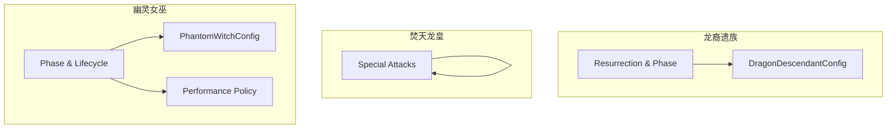
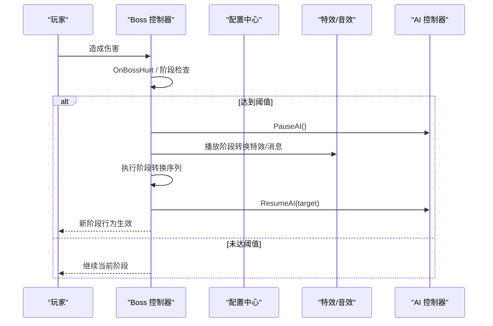
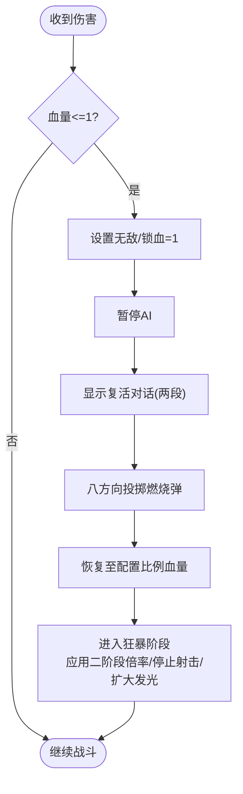
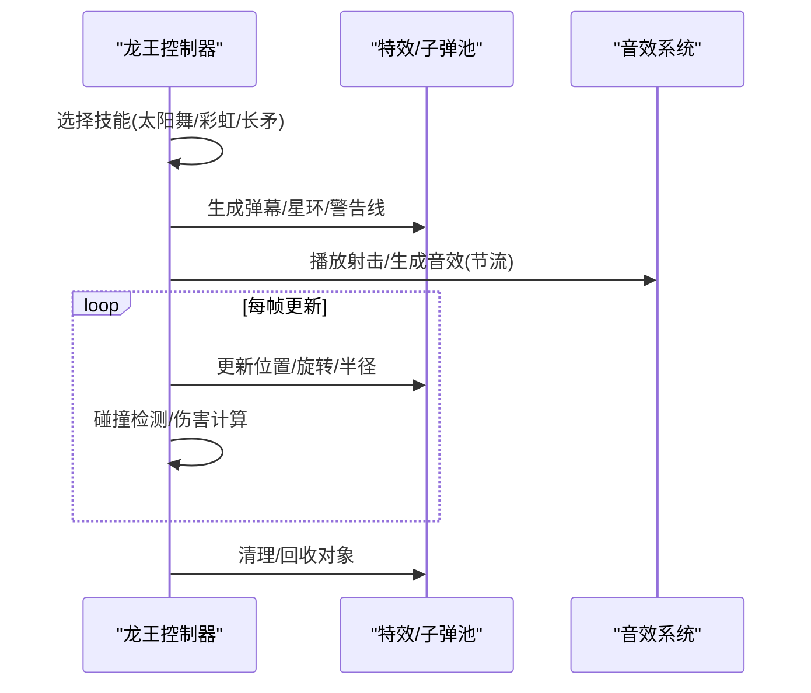
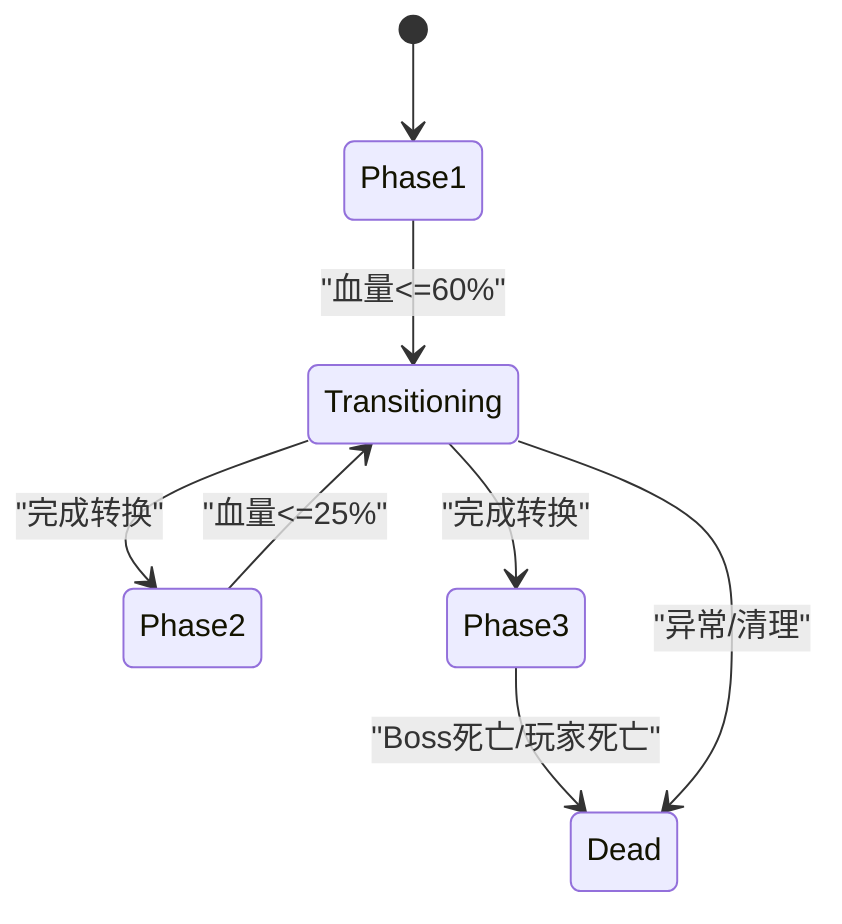
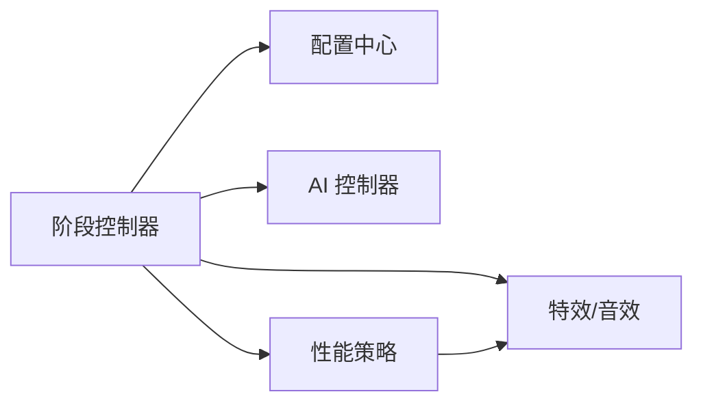

# Boss 阶段转换机制

<cite>
**本文引用的文件**
- [DragonDescendantAbilities_ResurrectionAndPhase.cs](file://Integration/DragonDescendant/DragonDescendantAbilities_ResurrectionAndPhase.cs)
- [DragonDescendantConfig.cs](file://Integration/DragonDescendant/DragonDescendantConfig.cs)
- [PhantomWitchAbilityController_PhaseAndLifecycle.cs](file://Integration/PhantomWitch/PhantomWitchAbilityController_PhaseAndLifecycle.cs)
- [PhantomWitchConfig.cs](file://Integration/PhantomWitch/PhantomWitchConfig.cs)
- [PhantomWitchPerformancePolicy.cs](file://Integration/PhantomWitch/PhantomWitchPerformancePolicy.cs)
- [DragonKingAbilityController_SpecialAttacks.cs](file://Integration/DragonKing/DragonKingAbilityController_SpecialAttacks.cs)
</cite>

## 目录
1. [简介](#简介)
2. [项目结构](#项目结构)
3. [核心组件](#核心组件)
4. [架构总览](#架构总览)
5. [详细组件分析](#详细组件分析)
6. [依赖关系分析](#依赖关系分析)
7. [性能考量](#性能考量)
8. [故障排查指南](#故障排查指南)
9. [结论](#结论)
10. [附录：自定义 Boss 阶段开发指南](#附录自定义-boss-阶段开发指南)

## 简介
本文件系统性梳理 BossRushMod 中“Boss 阶段转换机制”的设计与实现，覆盖以下要点：
- 阶段系统的设计原理：阶段定义、转换条件、状态管理。
- 三大 Boss 的专属阶段行为：龙裔遗族的复活阶段、焚天龙皇的特殊攻击阶段、幽灵女巫的隐身阶段。
- 阶段转换触发条件：血量阈值、时间控制、玩家行为响应。
- 阶段间资源管理与性能优化策略。
- 自定义 Boss 阶段的完整开发指南：配置、转换逻辑、视觉效果落地。

## 项目结构
与阶段系统直接相关的代码主要分布在三个 Boss 模块中：
- 龙裔遗族（Dragon Descendant）：复活与狂暴阶段切换。
- 焚天龙皇（Dragon King）：特殊攻击与阶段升级（以技能循环和特效为主）。
- 幽灵女巫（Phantom Witch）：三阶段战斗、隐身循环、诅咒领域与召唤。

**图表来源**
- [DragonDescendantAbilities_ResurrectionAndPhase.cs:1-463](file://Integration/DragonDescendant/DragonDescendantAbilities_ResurrectionAndPhase.cs#L1-L463)
- [DragonDescendantConfig.cs:1-234](file://Integration/DragonDescendant/DragonDescendantConfig.cs#L1-L234)
- [PhantomWitchAbilityController_PhaseAndLifecycle.cs:1-318](file://Integration/PhantomWitch/PhantomWitchAbilityController_PhaseAndLifecycle.cs#L1-L318)
- [PhantomWitchConfig.cs:1-318](file://Integration/PhantomWitch/PhantomWitchConfig.cs#L1-L318)
- [PhantomWitchPerformancePolicy.cs:1-163](file://Integration/PhantomWitch/PhantomWitchPerformancePolicy.cs#L1-L163)
- [DragonKingAbilityController_SpecialAttacks.cs:1-800](file://Integration/DragonKing/DragonKingAbilityController_SpecialAttacks.cs#L1-L800)

**章节来源**
- [DragonDescendantAbilities_ResurrectionAndPhase.cs:1-463](file://Integration/DragonDescendant/DragonDescendantAbilities_ResurrectionAndPhase.cs#L1-L463)
- [PhantomWitchAbilityController_PhaseAndLifecycle.cs:1-318](file://Integration/PhantomWitch/PhantomWitchAbilityController_PhaseAndLifecycle.cs#L1-L318)
- [DragonKingAbilityController_SpecialAttacks.cs:1-800](file://Integration/DragonKing/DragonKingAbilityController_SpecialAttacks.cs#L1-L800)

## 核心组件
- 阶段控制器：负责阶段状态机、转换流程、AI 暂停/恢复、效果播放、消息提示等。
- 配置中心：集中管理各 Boss 的阶段阈值、技能参数、视觉与音效常量。
- 性能策略：根据运行时负载动态降级特效细节，保证稳定帧率。
- 伤害与事件钩子：在受伤回调中检测阈值并触发阶段转换或特殊机制。

**章节来源**
- [PhantomWitchAbilityController_PhaseAndLifecycle.cs:19-103](file://Integration/PhantomWitch/PhantomWitchAbilityController_PhaseAndLifecycle.cs#L19-L103)
- [DragonDescendantAbilities_ResurrectionAndPhase.cs:23-181](file://Integration/DragonDescendant/DragonDescendantAbilities_ResurrectionAndPhase.cs#L23-L181)
- [PhantomWitchPerformancePolicy.cs:28-70](file://Integration/PhantomWitch/PhantomWitchPerformancePolicy.cs#L28-L70)

## 架构总览
阶段系统采用“事件驱动 + 协程编排”的模式：
- 事件驱动：通过受伤回调、时间轮询、玩家行为变化等事件触发阶段检查。
- 协程编排：阶段转换过程使用协程进行时序控制（对话、特效、传送、AI 暂停/恢复）。
- 配置驱动：所有阈值、持续时间、倍率等由配置类集中管理，便于调参与扩展。

**图表来源**
- [DragonDescendantAbilities_ResurrectionAndPhase.cs:23-181](file://Integration/DragonDescendant/DragonDescendantAbilities_ResurrectionAndPhase.cs#L23-L181)
- [PhantomWitchAbilityController_PhaseAndLifecycle.cs:19-103](file://Integration/PhantomWitch/PhantomWitchAbilityController_PhaseAndLifecycle.cs#L19-L103)

## 详细组件分析

### 龙裔遗族：复活阶段与狂暴阶段
- 触发条件：首次致命伤害时血量锁定为 1，进入一次性复活流程。
- 复活流程：
  - 设置无敌并暂停 AI。
  - 显示两段对话气泡（悬念式）。
  - 向八个方向投掷燃烧弹。
  - 恢复至最大血量的固定比例，关闭无敌。
  - 进入狂暴阶段：提升伤害倍率、禁用原射击行为、扩大发光范围、启动追逐协程。
- 冰属性减速：狂暴状态下累计冰属性伤害达到阈值时触发减速。

**图表来源**
- [DragonDescendantAbilities_ResurrectionAndPhase.cs:23-181](file://Integration/DragonDescendant/DragonDescendantAbilities_ResurrectionAndPhase.cs#L23-L181)
- [DragonDescendantConfig.cs:86-129](file://Integration/DragonDescendant/DragonDescendantConfig.cs#L86-L129)

**章节来源**
- [DragonDescendantAbilities_ResurrectionAndPhase.cs:23-181](file://Integration/DragonDescendant/DragonDescendantAbilities_ResurrectionAndPhase.cs#L23-L181)
- [DragonDescendantConfig.cs:15-129](file://Integration/DragonDescendant/DragonDescendantConfig.cs#L15-L129)

### 焚天龙皇：特殊攻击阶段
- 特殊攻击包括太阳舞弹幕、永恒彩虹、以太长矛等，均通过协程按节拍发射与更新。
- 阶段升级表现为攻击间隔缩短、弹幕数量/覆盖范围增大、预警时间调整。
- 视觉与音效：
  - 使用共享材质与渐变，减少每帧分配。
  - 音效播放带节流与缓存反射调用，避免频繁开销。

**图表来源**
- [DragonKingAbilityController_SpecialAttacks.cs:19-142](file://Integration/DragonKing/DragonKingAbilityController_SpecialAttacks.cs#L19-L142)
- [DragonKingAbilityController_SpecialAttacks.cs:268-370](file://Integration/DragonKing/DragonKingAbilityController_SpecialAttacks.cs#L268-L370)
- [DragonKingAbilityController_SpecialAttacks.cs:379-452](file://Integration/DragonKing/DragonKingAbilityController_SpecialAttacks.cs#L379-L452)

**章节来源**
- [DragonKingAbilityController_SpecialAttacks.cs:19-142](file://Integration/DragonKing/DragonKingAbilityController_SpecialAttacks.cs#L19-L142)
- [DragonKingAbilityController_SpecialAttacks.cs:268-452](file://Integration/DragonKing/DragonKingAbilityController_SpecialAttacks.cs#L268-L452)

### 幽灵女巫：隐身阶段与三阶段战斗
- 阶段划分：
  - 阶段1：100%~60% HP，攻击间隔较长，隐身占比约38%。
  - 阶段2：60%~25% HP，攻击更密集，隐身占比约32%。
  - 阶段3：<25% HP，残局召唤与压力维持，隐身占比约18%。
- 阶段转换：
  - 进入 Transitioning 状态，停止当前包协程，暂停 AI。
  - 传送至目标点，播放阶段转换特效，显示本地化消息。
  - 恢复 AI，重启攻击循环，更新环境氛围与计时器。
- 隐身系统：
  - 三种形态：真隐身过渡、半隐身前摇、可见。
  - 通过配置的目标隐身比例与容忍度调节实际隐身时长。
- 诅咒领域：
  - 先显示收缩预警圈，再创建持续伤害区域，支持阶段缩放。
  - 阶段转换时可强制清除活跃领域，避免状态残留。

**图表来源**
- [PhantomWitchAbilityController_PhaseAndLifecycle.cs:19-103](file://Integration/PhantomWitch/PhantomWitchAbilityController_PhaseAndLifecycle.cs#L19-L103)
- [PhantomWitchConfig.cs:12-21](file://Integration/PhantomWitch/PhantomWitchConfig.cs#L12-L21)

**章节来源**
- [PhantomWitchAbilityController_PhaseAndLifecycle.cs:19-103](file://Integration/PhantomWitch/PhantomWitchAbilityController_PhaseAndLifecycle.cs#L19-L103)
- [PhantomWitchConfig.cs:81-149](file://Integration/PhantomWitch/PhantomWitchConfig.cs#L81-L149)

## 依赖关系分析
- 阶段控制器依赖配置中心提供阈值与参数。
- 阶段转换过程中对 AI 控制器进行暂停/恢复，确保时序正确。
- 特效与音效通过资源管理器与音频系统进行异步播放与回收。
- 性能策略根据运行时根对象数量动态决定特效细节级别。

**图表来源**
- [PhantomWitchAbilityController_PhaseAndLifecycle.cs:19-103](file://Integration/PhantomWitch/PhantomWitchAbilityController_PhaseAndLifecycle.cs#L19-L103)
- [PhantomWitchPerformancePolicy.cs:28-70](file://Integration/PhantomWitch/PhantomWitchPerformancePolicy.cs#L28-L70)

**章节来源**
- [PhantomWitchAbilityController_PhaseAndLifecycle.cs:19-103](file://Integration/PhantomWitch/PhantomWitchAbilityController_PhaseAndLifecycle.cs#L19-L103)
- [PhantomWitchPerformancePolicy.cs:28-70](file://Integration/PhantomWitch/PhantomWitchPerformancePolicy.cs#L28-L70)

## 性能考量
- 对象池与复用：
  - 子弹、星环、警告线等通过池化获取与回收，减少 GC 压力。
  - 共享材质与渐变预分配，避免每帧创建。
- 音效节流与反射缓存：
  - 音效播放加入最小间隔限制，避免重复触发。
  - 反射方法仅查找一次并缓存委托，降低调用开销。
- 动态特效降级：
  - 基于活跃根对象数量与阈值，自动选择 Full/Reduced/Minimal 特效等级。
  - 关键特效不降级，可选特效在低性能时跳过。
- 协程与时间采样：
  - 使用协程进行阶段转换与技能循环，避免阻塞主线程。
  - 统一时间采样与冷却时间管理，防止高频更新导致抖动。

**章节来源**
- [DragonKingAbilityController_SpecialAttacks.cs:147-215](file://Integration/DragonKing/DragonKingAbilityController_SpecialAttacks.cs#L147-L215)
- [PhantomWitchPerformancePolicy.cs:28-70](file://Integration/PhantomWitch/PhantomWitchPerformancePolicy.cs#L28-L70)

## 故障排查指南
- 阶段转换卡死：
  - 检查是否成功暂停/恢复 AI，确认协程已正确停止与重启。
  - 查看阶段转换日志，确认目标阶段与传送位置解析正常。
- 复活阶段异常：
  - 确认无敌状态与锁血逻辑生效，避免被额外伤害打断。
  - 检查八方向燃烧弹生成与销毁路径，避免内存泄漏。
- 隐身阶段不稳定：
  - 验证隐身比例目标与容忍度配置，确保统计快照正常。
  - 检查诅咒领域创建与清除时机，避免残留影响后续阶段。
- 性能问题：
  - 观察特效等级是否自动降级，必要时提高阈值。
  - 检查音效节流是否生效，避免重复播放造成卡顿。

**章节来源**
- [PhantomWitchAbilityController_PhaseAndLifecycle.cs:19-103](file://Integration/PhantomWitch/PhantomWitchAbilityController_PhaseAndLifecycle.cs#L19-L103)
- [DragonDescendantAbilities_ResurrectionAndPhase.cs:132-181](file://Integration/DragonDescendant/DragonDescendantAbilities_ResurrectionAndPhase.cs#L132-L181)
- [PhantomWitchPerformancePolicy.cs:28-70](file://Integration/PhantomWitch/PhantomWitchPerformancePolicy.cs#L28-L70)

## 结论
Boss 阶段转换机制通过事件驱动与协程编排实现了高内聚、低耦合的状态管理。三大 Boss 分别以血量阈值、时间节奏与玩家行为作为转换触发条件，配合配置中心与性能策略，既保证了玩法多样性，又兼顾了运行稳定性。遵循本文档的开发指南，可快速扩展新的 Boss 阶段与视觉效果。

## 附录：自定义 Boss 阶段开发指南
- 阶段配置：
  - 在配置类中定义阶段枚举、血量阈值、攻击间隔、隐身比例等参数。
  - 提供本地化消息键，用于阶段转换时的 UI 提示。
- 转换逻辑：
  - 在受伤回调或时间轮询中检查阈值，调用 BeginPhaseTransition。
  - 协程中处理 AI 暂停、传送、特效播放、消息显示、AI 恢复。
  - 更新阶段相关计时器与环境氛围。
- 视觉效果：
  - 使用共享材质与渐变，减少分配。
  - 通过特效管理器创建阶段转换特效，支持动态颜色与尺寸。
  - 音效播放加入节流与缓存，避免性能抖动。
- 性能优化：
  - 启用性能策略，根据负载自动降级特效。
  - 使用对象池管理临时对象，及时回收。
  - 合理拆分协程，避免长时间阻塞。

**章节来源**
- [PhantomWitchConfig.cs:12-21](file://Integration/PhantomWitch/PhantomWitchConfig.cs#L12-L21)
- [PhantomWitchAbilityController_PhaseAndLifecycle.cs:19-103](file://Integration/PhantomWitch/PhantomWitchAbilityController_PhaseAndLifecycle.cs#L19-L103)
- [PhantomWitchPerformancePolicy.cs:28-70](file://Integration/PhantomWitch/PhantomWitchPerformancePolicy.cs#L28-L70)