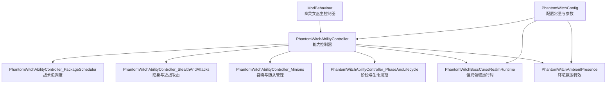
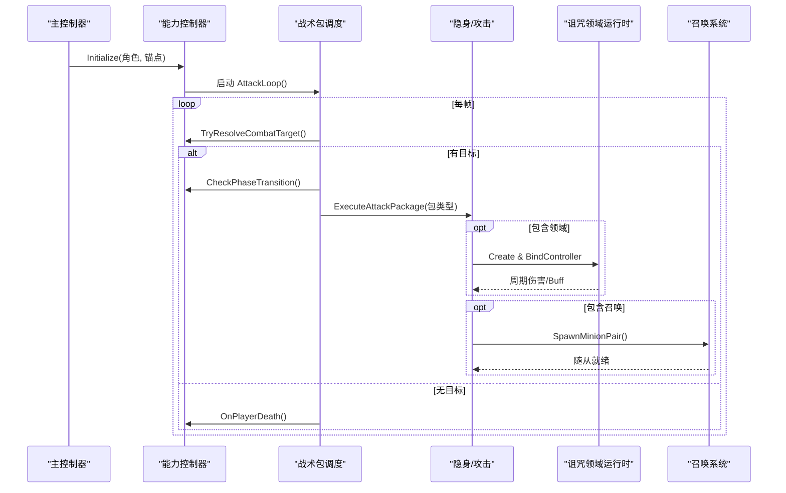
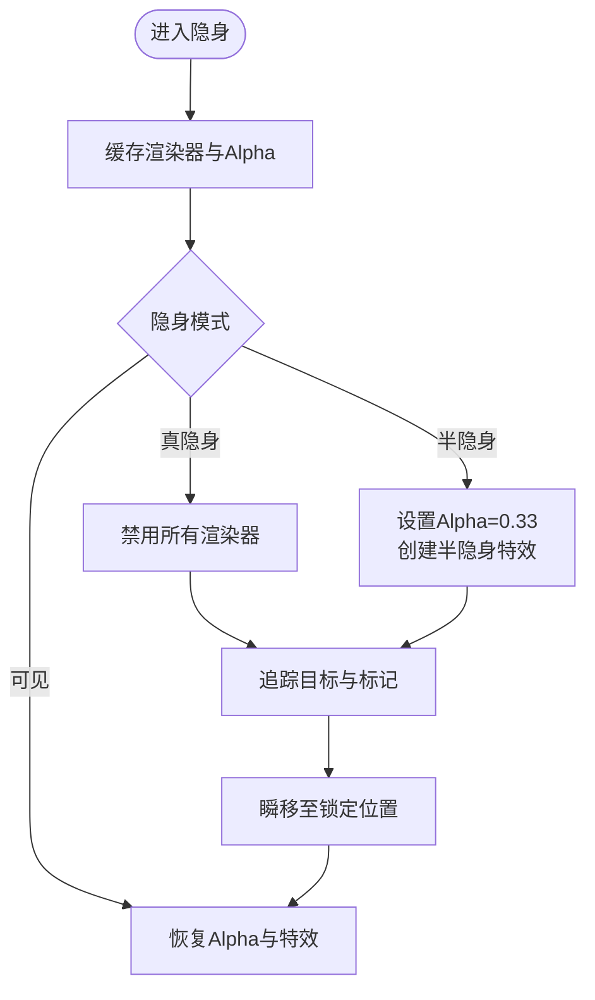
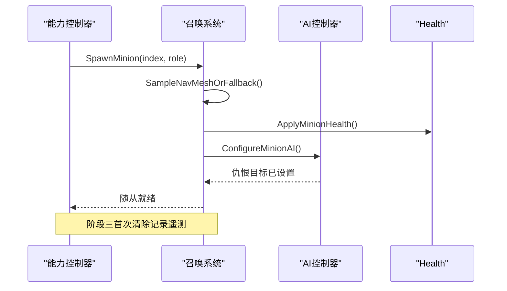
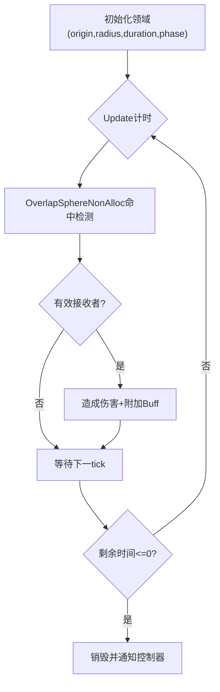
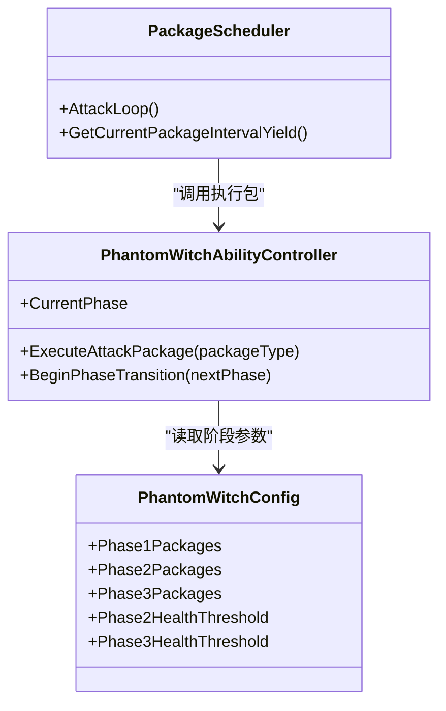
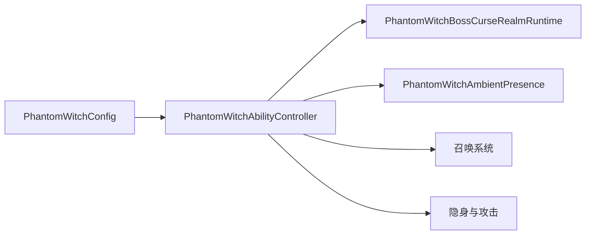

# 幽灵女巫

<cite>
**本文引用的文件**
- [PhantomWitchBoss.cs](file://Integration/PhantomWitch/PhantomWitchBoss.cs)
- [PhantomWitchAbilityController.cs](file://Integration/PhantomWitch/PhantomWitchAbilityController.cs)
- [PhantomWitchAbilityController_StealthAndAttacks.cs](file://Integration/PhantomWitch/PhantomWitchAbilityController_StealthAndAttacks.cs)
- [PhantomWitchAbilityController_Minions.cs](file://Integration/PhantomWitch/PhantomWitchAbilityController_Minions.cs)
- [PhantomWitchAbilityController_PhaseAndLifecycle.cs](file://Integration/PhantomWitch/PhantomWitchAbilityController_PhaseAndLifecycle.cs)
- [PhantomWitchAbilityController_PackageScheduler.cs](file://Integration/PhantomWitch/PhantomWitchAbilityController_PackageScheduler.cs)
- [PhantomWitchBossCurseRealmRuntime.cs](file://Integration/PhantomWitch/PhantomWitchBossCurseRealmRuntime.cs)
- [PhantomWitchAmbientPresence.cs](file://Integration/PhantomWitch/PhantomWitchAmbientPresence.cs)
- [PhantomWitchConfig.cs](file://Integration/PhantomWitch/PhantomWitchConfig.cs)
</cite>

## 目录
1. [简介](#简介)
2. [项目结构](#项目结构)
3. [核心组件](#核心组件)
4. [架构总览](#架构总览)
5. [详细组件分析](#详细组件分析)
6. [依赖关系分析](#依赖关系分析)
7. [性能考量](#性能考量)
8. [故障排查指南](#故障排查指南)
9. [结论](#结论)
10. [附录：扩展与优化建议](#附录：扩展与优化建议)

## 简介
本文件面向“幽灵女巫”Boss 的内容与实现，围绕以下目标展开：
- 隐身机制：可见性控制、位置追踪与玩家感知系统。
- 召唤系统：小怪生成、AI 行为与战斗协调。
- 诅咒领域：范围判定、持续伤害与视觉特效。
- 战斗策略：隐身识别技巧、召唤物处理优先级与输出窗口把握。
- 开发者扩展：新技能添加与性能优化建议。

## 项目结构
幽灵女巫的实现集中在 Integration/PhantomWitch 目录下，采用“主控制器 + 能力控制器 + 运行时子系统”的分层组织方式：
- 主控制器负责生成、属性设置、生命周期与资源管理。
- 能力控制器负责 AI 状态机、战术包轮播、阶段切换、隐身与攻击执行。
- 运行时子系统包括诅咒领域、环境氛围等独立模块。

图表来源
- [PhantomWitchBoss.cs:137-340](file://Integration/PhantomWitch/PhantomWitchBoss.cs#L137-L340)
- [PhantomWitchAbilityController.cs:221-250](file://Integration/PhantomWitch/PhantomWitchAbilityController.cs#L221-L250)
- [PhantomWitchAbilityController_PackageScheduler.cs:19-106](file://Integration/PhantomWitch/PhantomWitchAbilityController_PackageScheduler.cs#L19-L106)
- [PhantomWitchAbilityController_StealthAndAttacks.cs:19-88](file://Integration/PhantomWitch/PhantomWitchAbilityController_StealthAndAttacks.cs#L19-L88)
- [PhantomWitchAbilityController_Minions.cs:19-83](file://Integration/PhantomWitch/PhantomWitchAbilityController_Minions.cs#L19-L83)
- [PhantomWitchAbilityController_PhaseAndLifecycle.cs:19-103](file://Integration/PhantomWitch/PhantomWitchAbilityController_PhaseAndLifecycle.cs#L19-L103)
- [PhantomWitchBossCurseRealmRuntime.cs:28-87](file://Integration/PhantomWitch/PhantomWitchBossCurseRealmRuntime.cs#L28-L87)
- [PhantomWitchAmbientPresence.cs:50-114](file://Integration/PhantomWitch/PhantomWitchAmbientPresence.cs#L50-L114)
- [PhantomWitchConfig.cs:60-316](file://Integration/PhantomWitch/PhantomWitchConfig.cs#L60-L316)

章节来源
- [PhantomWitchBoss.cs:137-340](file://Integration/PhantomWitch/PhantomWitchBoss.cs#L137-L340)
- [PhantomWitchAbilityController.cs:221-250](file://Integration/PhantomWitch/PhantomWitchAbilityController.cs#L221-L250)
- [PhantomWitchConfig.cs:60-316](file://Integration/PhantomWitch/PhantomWitchConfig.cs#L60-L316)

## 核心组件
- 幽灵女巫主控制器（ModBehaviour partial）：负责生成 Boss、装备武器、设置属性、注册预设、订阅死亡事件、清理资源。
- 能力控制器（PhantomWitchAbilityController）：维护当前阶段、玩家目标引用、AI 控制器、隐身模式、效果列表、统计指标；启动攻击循环。
- 战术包调度器：按阶段选择战术包序列，依次执行对应协程，记录时长与命中情况。
- 隐身与近战攻击：实现半隐身/真隐身的渲染切换、传送标记、镰刀横扫与重斩的动画与伤害。
- 召唤系统：异步生成随从、分配职责（治疗/骚扰）、配置 AI、跟踪存活数量。
- 阶段与生命周期：阶段转换、诅咒领域创建与清理、Boss/玩家死亡清理。
- 诅咒领域运行时：圆形区域伤害、Buff 附加、视觉标记、超时销毁。
- 环境氛围：粒子雾、冷光环、心跳闪烁、符文闪光，随阶段与距离变化。

章节来源
- [PhantomWitchBoss.cs:137-340](file://Integration/PhantomWitch/PhantomWitchBoss.cs#L137-L340)
- [PhantomWitchAbilityController.cs:221-250](file://Integration/PhantomWitch/PhantomWitchAbilityController.cs#L221-L250)
- [PhantomWitchAbilityController_PackageScheduler.cs:19-106](file://Integration/PhantomWitch/PhantomWitchAbilityController_PackageScheduler.cs#L19-L106)
- [PhantomWitchAbilityController_StealthAndAttacks.cs:19-88](file://Integration/PhantomWitch/PhantomWitchAbilityController_StealthAndAttacks.cs#L19-L88)
- [PhantomWitchAbilityController_Minions.cs:19-83](file://Integration/PhantomWitch/PhantomWitchAbilityController_Minions.cs#L19-L83)
- [PhantomWitchAbilityController_PhaseAndLifecycle.cs:19-103](file://Integration/PhantomWitch/PhantomWitchAbilityController_PhaseAndLifecycle.cs#L19-L103)
- [PhantomWitchBossCurseRealmRuntime.cs:28-87](file://Integration/PhantomWitch/PhantomWitchBossCurseRealmRuntime.cs#L28-L87)
- [PhantomWitchAmbientPresence.cs:50-114](file://Integration/PhantomWitch/PhantomWitchAmbientPresence.cs#L50-L114)

## 架构总览
幽灵女巫的战斗由“战术包”驱动，每个包包含若干动作（传送、隐身、攻击、召唤、领域）。阶段切换会重置包索引并刷新环境氛围。诅咒领域作为独立运行时对象，在 Update 中周期性造成伤害与 Buff。

图表来源
- [PhantomWitchAbilityController.cs:221-250](file://Integration/PhantomWitch/PhantomWitchAbilityController.cs#L221-L250)
- [PhantomWitchAbilityController_PackageScheduler.cs:19-106](file://Integration/PhantomWitch/PhantomWitchAbilityController_PackageScheduler.cs#L19-L106)
- [PhantomWitchAbilityController_StealthAndAttacks.cs:203-343](file://Integration/PhantomWitch/PhantomWitchAbilityController_StealthAndAttacks.cs#L203-L343)
- [PhantomWitchAbilityController_Minions.cs:19-83](file://Integration/PhantomWitch/PhantomWitchAbilityController_Minions.cs#L19-L83)
- [PhantomWitchAbilityController_PhaseAndLifecycle.cs:105-171](file://Integration/PhantomWitch/PhantomWitchAbilityController_PhaseAndLifecycle.cs#L105-L171)
- [PhantomWitchBossCurseRealmRuntime.cs:69-87](file://Integration/PhantomWitch/PhantomWitchBossCurseRealmRuntime.cs#L69-L87)

## 详细组件分析

### 隐身机制：可见性控制、位置追踪与玩家感知
- 可见性控制：
  - 三种隐身模式：真隐身过渡、半隐身读条、可见。通过缓存渲染器与材质属性块，切换时禁用或调整透明度，避免频繁查找开销。
  - 支持检测平台是否可修改 Alpha，不可用时降级为可见。
- 位置追踪：
  - 追踪传送落点：在半隐身读条期间显示标记，跟随目标移动更新落点，最终瞬移至锁定位置。
  - 使用导航网格采样与回退半径保证落地合法性。
- 玩家感知：
  - 定期从 AI 控制器获取搜索到的敌人，过滤无效目标，确保在多模式（E/F）下正确解析主玩家。
  - 若目标丢失，触发玩家死亡清理流程，防止 Boss 卡死。

图表来源
- [PhantomWitchAbilityController_StealthAndAttacks.cs:19-88](file://Integration/PhantomWitch/PhantomWitchAbilityController_StealthAndAttacks.cs#L19-L88)
- [PhantomWitchAbilityController_StealthAndAttacks.cs:271-343](file://Integration/PhantomWitch/PhantomWitchAbilityController_StealthAndAttacks.cs#L271-L343)
- [PhantomWitchAbilityController.cs:275-339](file://Integration/PhantomWitch/PhantomWitchAbilityController.cs#L275-L339)

章节来源
- [PhantomWitchAbilityController_StealthAndAttacks.cs:19-88](file://Integration/PhantomWitch/PhantomWitchAbilityController_StealthAndAttacks.cs#L19-L88)
- [PhantomWitchAbilityController_StealthAndAttacks.cs:271-343](file://Integration/PhantomWitch/PhantomWitchAbilityController_StealthAndAttacks.cs#L271-L343)
- [PhantomWitchAbilityController.cs:275-339](file://Integration/PhantomWitch/PhantomWitchAbilityController.cs#L275-L339)

### 召唤系统：小怪生成、AI 行为与战斗协调
- 生成流程：
  - 计算生成偏移（左右两侧），采样导航网格或回退到安全位置。
  - 异步创建随从实例，应用健康值、显示血条、设置队伍与掉落行为。
  - 配置 AI：强制追踪距离、设定仇恨目标、标记已注意。
- 职责分配：
  - 治疗型随从靠近 Boss 提供回复加成。
  - 骚扰型随从对玩家施加压力。
- 战斗协调：
  - 跟踪存活随从，监听死亡事件清理列表。
  - 阶段三首次清除随从时记录遥测数据。

图表来源
- [PhantomWitchAbilityController_Minions.cs:19-83](file://Integration/PhantomWitch/PhantomWitchAbilityController_Minions.cs#L19-L83)
- [PhantomWitchAbilityController_Minions.cs:85-141](file://Integration/PhantomWitch/PhantomWitchAbilityController_Minions.cs#L85-L141)
- [PhantomWitchAbilityController_Minions.cs:143-174](file://Integration/PhantomWitch/PhantomWitchAbilityController_Minions.cs#L143-L174)

章节来源
- [PhantomWitchAbilityController_Minions.cs:19-83](file://Integration/PhantomWitch/PhantomWitchAbilityController_Minions.cs#L19-L83)
- [PhantomWitchAbilityController_Minions.cs:85-141](file://Integration/PhantomWitch/PhantomWitchAbilityController_Minions.cs#L85-L141)
- [PhantomWitchAbilityController_Minions.cs:143-174](file://Integration/PhantomWitch/PhantomWitchAbilityController_Minions.cs#L143-L174)

### 诅咒领域：范围判定、持续伤害与视觉特效
- 范围判定：
  - 以地面点为原点，半径根据阶段缩放，使用球体重叠检测命中。
  - 过滤非敌对、已死亡、自身等无效接收者。
- 持续伤害：
  - 每固定间隔对范围内敌人造成一次伤害，附带元素因子与武器 ID。
  - 同时附加诅咒 Buff，降低移速并叠加层数。
- 视觉特效：
  - 创建警告圆环与领域可视化标记，超时后销毁并通知控制器。

图表来源
- [PhantomWitchAbilityController_PhaseAndLifecycle.cs:105-171](file://Integration/PhantomWitch/PhantomWitchAbilityController_PhaseAndLifecycle.cs#L105-L171)
- [PhantomWitchBossCurseRealmRuntime.cs:28-87](file://Integration/PhantomWitch/PhantomWitchBossCurseRealmRuntime.cs#L28-L87)
- [PhantomWitchBossCurseRealmRuntime.cs:89-162](file://Integration/PhantomWitch/PhantomWitchBossCurseRealmRuntime.cs#L89-L162)

章节来源
- [PhantomWitchAbilityController_PhaseAndLifecycle.cs:105-171](file://Integration/PhantomWitch/PhantomWitchAbilityController_PhaseAndLifecycle.cs#L105-L171)
- [PhantomWitchBossCurseRealmRuntime.cs:28-87](file://Integration/PhantomWitch/PhantomWitchBossCurseRealmRuntime.cs#L28-L87)
- [PhantomWitchBossCurseRealmRuntime.cs:89-162](file://Integration/PhantomWitch/PhantomWitchBossCurseRealmRuntime.cs#L89-L162)

### 战术包与阶段切换
- 阶段一：侧翼压力、中距挽歌、幽灵轨迹观察。
- 阶段二：侧翼压力、中距双发、诅咒陷阱、侧翼压力。
- 阶段三：短漂移压力、残喘召唤、诅咒陷阱、随从撤退。
- 阶段切换：暂停 AI、清空活动领域、传送至安全位置、播放阶段特效、重置包索引并重启攻击循环。

图表来源
- [PhantomWitchConfig.cs:282-303](file://Integration/PhantomWitch/PhantomWitchConfig.cs#L282-L303)
- [PhantomWitchAbilityController.cs:205-219](file://Integration/PhantomWitch/PhantomWitchAbilityController.cs#L205-L219)
- [PhantomWitchAbilityController_PackageScheduler.cs:19-106](file://Integration/PhantomWitch/PhantomWitchAbilityController_PackageScheduler.cs#L19-L106)
- [PhantomWitchAbilityController_PhaseAndLifecycle.cs:19-103](file://Integration/PhantomWitch/PhantomWitchAbilityController_PhaseAndLifecycle.cs#L19-L103)

章节来源
- [PhantomWitchConfig.cs:282-303](file://Integration/PhantomWitch/PhantomWitchConfig.cs#L282-L303)
- [PhantomWitchAbilityController.cs:205-219](file://Integration/PhantomWitch/PhantomWitchAbilityController.cs#L205-L219)
- [PhantomWitchAbilityController_PackageScheduler.cs:19-106](file://Integration/PhantomWitch/PhantomWitchAbilityController_PackageScheduler.cs#L19-L106)
- [PhantomWitchAbilityController_PhaseAndLifecycle.cs:19-103](file://Integration/PhantomWitch/PhantomWitchAbilityController_PhaseAndLifecycle.cs#L19-L103)

### 环境氛围与视觉提示
- 面纱粒子与地面雾气：随细节等级与暂停状态启停。
- 冷光环：面向相机旋转，强度随阶段与距离变化。
- 心跳闪烁：低血量时频率加快，提供紧张感提示。
- 符文闪光：随机生成临时线条特效，增强神秘氛围。

章节来源
- [PhantomWitchAmbientPresence.cs:50-114](file://Integration/PhantomWitch/PhantomWitchAmbientPresence.cs#L50-L114)
- [PhantomWitchAmbientPresence.cs:512-693](file://Integration/PhantomWitch/PhantomWitchAmbientPresence.cs#L512-L693)

## 依赖关系分析
- 主控制器依赖能力控制器进行战斗逻辑编排。
- 能力控制器依赖配置常量决定行为参数。
- 诅咒领域运行时依赖伤害接收层掩码与 Buff 系统。
- 环境氛围依赖渲染工具与细节等级系统。

图表来源
- [PhantomWitchConfig.cs:60-316](file://Integration/PhantomWitch/PhantomWitchConfig.cs#L60-L316)
- [PhantomWitchAbilityController.cs:221-250](file://Integration/PhantomWitch/PhantomWitchAbilityController.cs#L221-L250)
- [PhantomWitchBossCurseRealmRuntime.cs:28-87](file://Integration/PhantomWitch/PhantomWitchBossCurseRealmRuntime.cs#L28-L87)
- [PhantomWitchAmbientPresence.cs:50-114](file://Integration/PhantomWitch/PhantomWitchAmbientPresence.cs#L50-L114)

章节来源
- [PhantomWitchConfig.cs:60-316](file://Integration/PhantomWitch/PhantomWitchConfig.cs#L60-L316)
- [PhantomWitchAbilityController.cs:221-250](file://Integration/PhantomWitch/PhantomWitchAbilityController.cs#L221-L250)

## 性能考量
- 渲染缓存：隐身时缓存渲染器与材质属性块，避免每帧查找。
- 碰撞检测：使用非分配球体重叠减少 GC 压力。
- 细节等级：环境氛围根据当前细节等级动态调整粒子发射率与可见性。
- 分帧初始化：生成 Boss 与武器实例化时分帧，降低出场顿挫。
- 看门狗：检测 AI 被暂停且攻击协程不再推进的异常状态，自动恢复。

章节来源
- [PhantomWitchAbilityController_StealthAndAttacks.cs:90-120](file://Integration/PhantomWitch/PhantomWitchAbilityController_StealthAndAttacks.cs#L90-L120)
- [PhantomWitchBossCurseRealmRuntime.cs:96-105](file://Integration/PhantomWitch/PhantomWitchBossCurseRealmRuntime.cs#L96-L105)
- [PhantomWitchAmbientPresence.cs:438-510](file://Integration/PhantomWitch/PhantomWitchAmbientPresence.cs#L438-L510)
- [PhantomWitchBoss.cs:183-258](file://Integration/PhantomWitch/PhantomWitchBoss.cs#L183-L258)
- [PhantomWitchAbilityController.cs:102-112](file://Integration/PhantomWitch/PhantomWitchAbilityController.cs#L102-L112)

## 故障排查指南
- 生成失败：检查基础预设是否存在、武器实例化是否成功、资源引用是否正确释放。
- 目标丢失：确认多模式下玩家解析逻辑，必要时触发玩家死亡清理。
- 领域未生效：检查警告圆环创建、领域绑定控制器、伤害接收层掩码。
- 随从未出现：验证随从预设、导航网格采样、AI 配置与队伍设置。
- 卡顿或卡死：关注看门狗日志，确保 AI 暂停/恢复成对出现。

章节来源
- [PhantomWitchBoss.cs:137-340](file://Integration/PhantomWitch/PhantomWitchBoss.cs#L137-L340)
- [PhantomWitchAbilityController.cs:275-339](file://Integration/PhantomWitch/PhantomWitchAbilityController.cs#L275-L339)
- [PhantomWitchAbilityController_PhaseAndLifecycle.cs:105-171](file://Integration/PhantomWitch/PhantomWitchAbilityController_PhaseAndLifecycle.cs#L105-L171)
- [PhantomWitchAbilityController_Minions.cs:19-83](file://Integration/PhantomWitch/PhantomWitchAbilityController_Minions.cs#L19-L83)
- [PhantomWitchAbilityController.cs:102-112](file://Integration/PhantomWitch/PhantomWitchAbilityController.cs#L102-L112)

## 结论
幽灵女巫通过“战术包 + 阶段切换”的架构实现了高节奏、多变量的战斗体验。隐身机制结合位置追踪提供了强压迫感；召唤系统与诅咒领域增强了战场复杂度；环境氛围提升了沉浸感。整体实现注重性能与稳定性，具备良好扩展性。

## 附录：扩展与优化建议
- 新技能添加：
  - 在配置中添加新的战术包类型与阶段序列。
  - 在能力控制器中新增对应的 ExecuteXxxPackage 协程，复用隐身、传送、伤害与特效工具。
  - 在阶段切换逻辑中考虑新技能的兼容性与资源释放。
- 性能优化：
  - 继续使用渲染器缓存与材质属性块减少开销。
  - 合理设置细节等级阈值，降低低端设备上的粒子与光照成本。
  - 对高频操作（如 OverlapSphere）使用非分配缓冲与对象池。
- 调试与遥测：
  - 利用现有遥测点（包开始/结束、领域警告/提交/清除、随从死亡等）定位问题。
  - 增加关键路径日志（如 AI 暂停/恢复、目标解析失败）便于快速排障。

章节来源
- [PhantomWitchConfig.cs:282-303](file://Integration/PhantomWitch/PhantomWitchConfig.cs#L282-L303)
- [PhantomWitchAbilityController_PackageScheduler.cs:121-153](file://Integration/PhantomWitch/PhantomWitchAbilityController_PackageScheduler.cs#L121-L153)
- [PhantomWitchAbilityController_PhaseAndLifecycle.cs:19-103](file://Integration/PhantomWitch/PhantomWitchAbilityController_PhaseAndLifecycle.cs#L19-L103)
- [PhantomWitchAbilityController_Minions.cs:143-174](file://Integration/PhantomWitch/PhantomWitchAbilityController_Minions.cs#L143-L174)