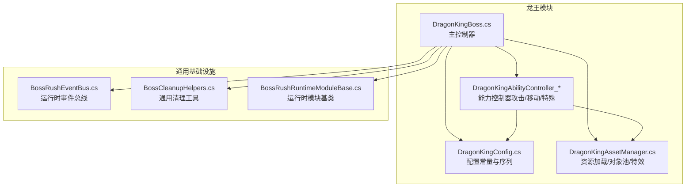
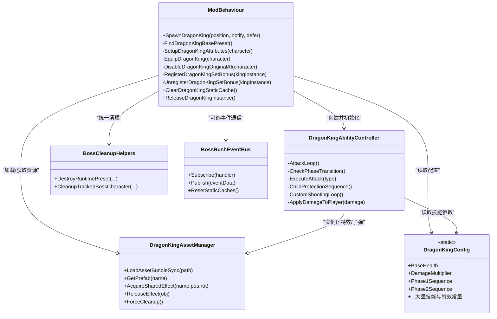
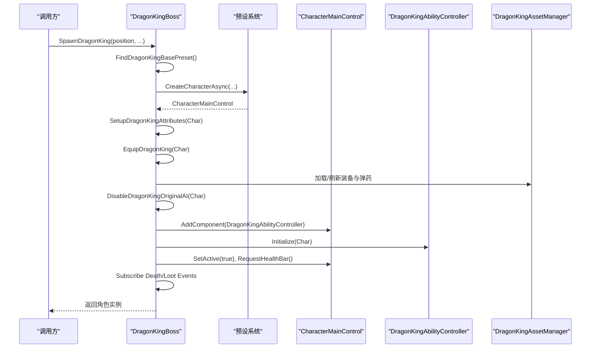
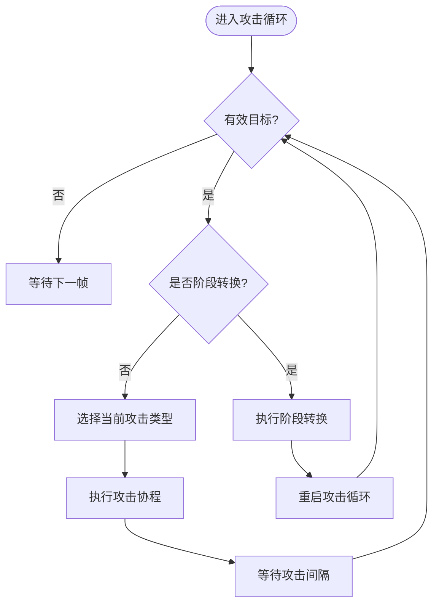
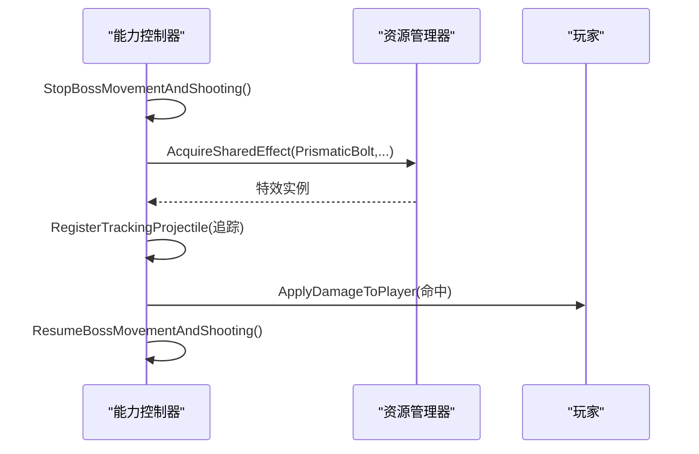
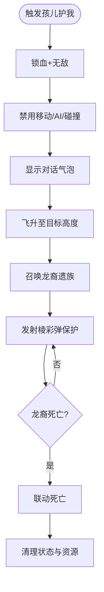
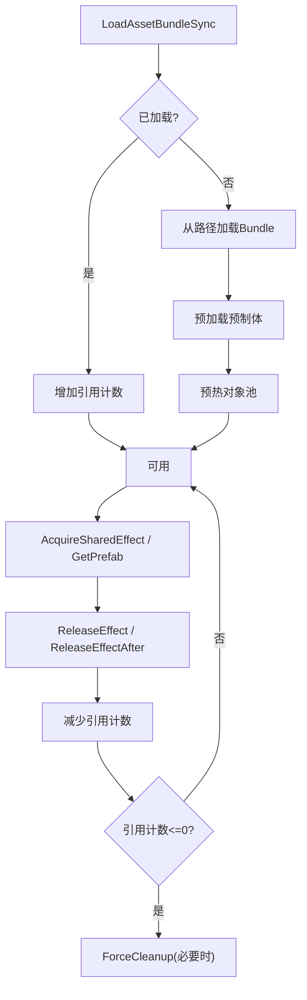
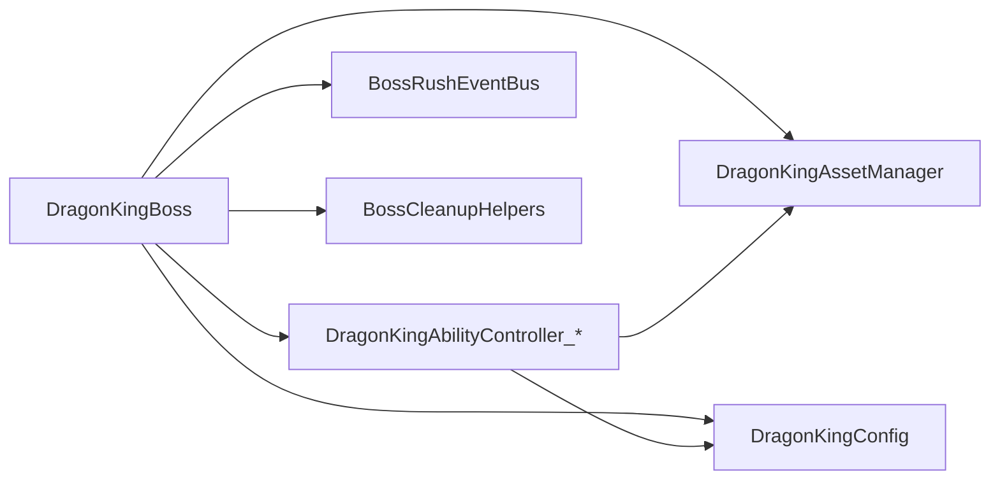

# Boss框架与生命周期管理

<cite>
**本文引用的文件**
- [DragonKingBoss.cs](file://Integration/DragonKing/DragonKingBoss.cs)
- [DragonKingConfig.cs](file://Integration/DragonKing/DragonKingConfig.cs)
- [DragonKingAssetManager.cs](file://Integration/DragonKing/DragonKingAssetManager.cs)
- [DragonKingAbilityController_AttackFlow.cs](file://Integration/DragonKing/DragonKingAbilityController_AttackFlow.cs)
- [DragonKingAbilityController_ChildProtection.cs](file://Integration/DragonKing/DragonKingAbilityController_ChildProtection.cs)
- [DragonKingAbilityController_ProjectileAndMovement.cs](file://Integration/DragonKing/DragonKingAbilityController_ProjectileAndMovement.cs)
- [BossRushEventBus.cs](file://Common/Events/BossRushEventBus.cs)
- [BossCleanupHelpers.cs](file://Utilities/BossCleanupHelpers.cs)
- [BossRushRuntimeModuleBase.cs](file://Common/Lifecycle/BossRushRuntimeModuleBase.cs)
</cite>

## 目录
1. [简介](#简介)
2. [项目结构](#项目结构)
3. [核心组件](#核心组件)
4. [架构总览](#架构总览)
5. [详细组件分析](#详细组件分析)
6. [依赖关系分析](#依赖关系分析)
7. [性能考量](#性能考量)
8. [故障排查指南](#故障排查指南)
9. [结论](#结论)
10. [附录：开发者扩展指南](#附录开发者扩展指南)

## 简介
本文件围绕“焚天龙皇”Boss框架与生命周期管理，系统性说明主控制器设计、多实例支持、预设查找与缓存、属性设置与装备流程、生成过程（从 SpawnDragonKing 开始）、生命周期事件与资源清理、场景切换处理，以及扩展新Boss类型和自定义生命周期的实践建议。目标是让不同技术背景的读者都能理解并安全地扩展该框架。

## 项目结构
BossRushMod 将龙王相关逻辑集中在 Integration/DragonKing 目录下，按职责拆分为主控制器、能力控制器（分文件实现攻击流、特殊机制、弹幕与移动等）、配置与资源管理器；通用生命周期与事件总线位于 Common 与 Utilities 中。

图表来源
- [DragonKingBoss.cs:20-110](file://Integration/DragonKing/DragonKingBoss.cs#L20-L110)
- [DragonKingAbilityController_AttackFlow.cs:15-120](file://Integration/DragonKing/DragonKingAbilityController_AttackFlow.cs#L15-L120)
- [DragonKingConfig.cs:30-736](file://Integration/DragonKing/DragonKingConfig.cs#L30-L736)
- [DragonKingAssetManager.cs:20-150](file://Integration/DragonKing/DragonKingAssetManager.cs#L20-L150)
- [BossRushEventBus.cs:10-149](file://Common/Events/BossRushEventBus.cs#L10-L149)
- [BossCleanupHelpers.cs:16-122](file://Utilities/BossCleanupHelpers.cs#L16-L122)
- [BossRushRuntimeModuleBase.cs:1-15](file://Common/Lifecycle/BossRushRuntimeModuleBase.cs#L1-L15)

章节来源
- [DragonKingBoss.cs:20-110](file://Integration/DragonKing/DragonKingBoss.cs#L20-L110)
- [DragonKingConfig.cs:30-736](file://Integration/DragonKing/DragonKingConfig.cs#L30-L736)
- [DragonKingAssetManager.cs:20-150](file://Integration/DragonKing/DragonKingAssetManager.cs#L20-L150)
- [BossRushEventBus.cs:10-149](file://Common/Events/BossRushEventBus.cs#L10-L149)
- [BossCleanupHelpers.cs:16-122](file://Utilities/BossCleanupHelpers.cs#L16-L122)
- [BossRushRuntimeModuleBase.cs:1-15](file://Common/Lifecycle/BossRushRuntimeModuleBase.cs#L1-L15)

## 核心组件
- 主控制器（DragonKingBoss）：负责生成、多实例跟踪、事件订阅、属性设置、装备配置、AI控制、生命周期清理。
- 能力控制器（DragonKingAbilityController*）：实现攻击循环、阶段转换、特殊机制（孩儿护我）、弹幕与移动、伤害判定与音效。
- 配置（DragonKingConfig）：集中所有可调参数（血量、倍率、技能序列、特效名称、掉落概率等）。
- 资源管理器（DragonKingAssetManager）：AssetBundle 加载、预制体缓存、共享对象池、动态材质清理。
- 事件总线（BossRushEventBus）：低开销的运行时事件发布/订阅。
- 清理工具（BossCleanupHelpers）：统一的运行时预设销毁与实例清理骨架。
- 运行时模块基类（BossRushRuntimeModuleBase）：定义 Awake/Start/Update/LateUpdate/OnDestroy 等生命周期钩子。

章节来源
- [DragonKingBoss.cs:20-110](file://Integration/DragonKing/DragonKingBoss.cs#L20-L110)
- [DragonKingAbilityController_AttackFlow.cs:15-120](file://Integration/DragonKing/DragonKingAbilityController_AttackFlow.cs#L15-L120)
- [DragonKingConfig.cs:30-736](file://Integration/DragonKing/DragonKingConfig.cs#L30-L736)
- [DragonKingAssetManager.cs:20-150](file://Integration/DragonKing/DragonKingAssetManager.cs#L20-L150)
- [BossRushEventBus.cs:10-149](file://Common/Events/BossRushEventBus.cs#L10-L149)
- [BossCleanupHelpers.cs:16-122](file://Utilities/BossCleanupHelpers.cs#L16-L122)
- [BossRushRuntimeModuleBase.cs:1-15](file://Common/Lifecycle/BossRushRuntimeModuleBase.cs#L1-L15)

## 架构总览
龙王框架采用“主控制器 + 能力控制器”的分层设计：主控制器负责生成与生命周期，能力控制器专注战斗行为与状态机。资源通过资源管理器统一管理与复用，配置集中化便于调参与扩展。

图表来源
- [DragonKingBoss.cs:20-110](file://Integration/DragonKing/DragonKingBoss.cs#L20-L110)
- [DragonKingAbilityController_AttackFlow.cs:15-120](file://Integration/DragonKing/DragonKingAbilityController_AttackFlow.cs#L15-L120)
- [DragonKingConfig.cs:30-736](file://Integration/DragonKing/DragonKingConfig.cs#L30-L736)
- [DragonKingAssetManager.cs:20-150](file://Integration/DragonKing/DragonKingAssetManager.cs#L20-L150)
- [BossCleanupHelpers.cs:16-122](file://Utilities/BossCleanupHelpers.cs#L16-L122)
- [BossRushEventBus.cs:10-149](file://Common/Events/BossRushEventBus.cs#L10-L149)

## 详细组件分析

### 主控制器：DragonKingBoss
- 多实例支持
  - 使用字典维护每个 CharacterMainControl 到对应能力控制器的映射，确保多Boss并存时互不干扰。
  - 为每个实例独立注册掉落与死亡事件委托，避免闭包捕获导致的错误绑定。
- 预设查找与缓存
  - 首次查找基础预设后缓存结果，失败时回退到备用预设；场景切换时清空静态缓存。
- 属性设置与装备流程
  - 设置最大血量、恢复满血、调整枪械/近战伤害倍率。
  - 根据配置查找并装备“龙王之冕”“龙王鳞铠”，刷新模型并加载高级弹药。
- AI与能力控制器
  - 保留原版AI的行走与开枪逻辑，在释放技能时收枪；添加 DragonKingAbilityController 并初始化。
- 事件订阅与清理
  - 订阅 Health.OnDeadEvent 与 BeforeCharacterSpawnLootOnDead，使用命名委托以便正确移除监听。
  - 提供 ClearDragonKingStaticCache 与 ReleaseDragonKingInstance，配合引用计数管理资源。

图表来源
- [DragonKingBoss.cs:206-371](file://Integration/DragonKing/DragonKingBoss.cs#L206-L371)
- [DragonKingBoss.cs:373-454](file://Integration/DragonKing/DragonKingBoss.cs#L373-L454)
- [DragonKingBoss.cs:456-551](file://Integration/DragonKing/DragonKingBoss.cs#L456-L551)
- [DragonKingAssetManager.cs:228-273](file://Integration/DragonKing/DragonKingAssetManager.cs#L228-L273)

章节来源
- [DragonKingBoss.cs:20-110](file://Integration/DragonKing/DragonKingBoss.cs#L20-L110)
- [DragonKingBoss.cs:206-371](file://Integration/DragonKing/DragonKingBoss.cs#L206-L371)
- [DragonKingBoss.cs:373-454](file://Integration/DragonKing/DragonKingBoss.cs#L373-L454)
- [DragonKingBoss.cs:456-551](file://Integration/DragonKing/DragonKingBoss.cs#L456-L551)
- [DragonKingBoss.cs:554-634](file://Integration/DragonKing/DragonKingBoss.cs#L554-L634)

### 能力控制器：攻击循环与阶段转换
- 攻击主循环
  - 等待初始化与启动延迟，检查阶段转换与目标有效性，按当前序列执行攻击，并在阶段间推进索引。
- 阶段转换
  - 半血触发：禁用角色、停止协程与射击、隐藏模型、播放传送与阶段特效、计算地面位置并传送、播放冲击波、恢复AI并重启攻击循环。
- 孩儿护我（第三阶段）
  - 锁血+无敌、彻底禁用移动与AI、显示对话气泡、飞升高度、召唤龙裔遗族、发射棱彩弹、联动死亡。
- 自定义射击
  - 在技能期间停止原版武器，改为每秒发射若干子弹，偏移范围随阶段变化，命中后播放音效与伤害。

图表来源
- [DragonKingAbilityController_AttackFlow.cs:17-132](file://Integration/DragonKing/DragonKingAbilityController_AttackFlow.cs#L17-L132)
- [DragonKingAbilityController_AttackFlow.cs:136-287](file://Integration/DragonKing/DragonKingAbilityController_AttackFlow.cs#L136-L287)
- [DragonKingAbilityController_AttackFlow.cs:462-741](file://Integration/DragonKing/DragonKingAbilityController_AttackFlow.cs#L462-L741)

章节来源
- [DragonKingAbilityController_AttackFlow.cs:17-132](file://Integration/DragonKing/DragonKingAbilityController_AttackFlow.cs#L17-L132)
- [DragonKingAbilityController_AttackFlow.cs:136-287](file://Integration/DragonKing/DragonKingAbilityController_AttackFlow.cs#L136-L287)
- [DragonKingAbilityController_AttackFlow.cs:462-741](file://Integration/DragonKing/DragonKingAbilityController_AttackFlow.cs#L462-L741)

### 能力控制器：弹幕与移动
- 棱彩弹（一阶段）
  - 在Boss周围环形生成多个弹幕，延迟后追踪玩家，命中检测使用平方距离优化。
- 棱彩弹2（二阶段螺旋）
  - 持续旋转发射，追踪时间较短，播放专属音效。
- 冲刺
  - 蓄力阶段显示聚拢粒子与倒计时光圈，锁定目标位置，第一段直接移动到目标，第二段在二阶段追加短冲刺；残影附带岩浆伤害区域。
- 太阳舞
  - 传送到玩家附近有效位置，收枪并停止AI，发射旋转弹幕。

图表来源
- [DragonKingAbilityController_ProjectileAndMovement.cs:17-95](file://Integration/DragonKing/DragonKingAbilityController_ProjectileAndMovement.cs#L17-L95)
- [DragonKingAbilityController_ProjectileAndMovement.cs:229-297](file://Integration/DragonKing/DragonKingAbilityController_ProjectileAndMovement.cs#L229-L297)
- [DragonKingAbilityController_ProjectileAndMovement.cs:300-579](file://Integration/DragonKing/DragonKingAbilityController_ProjectileAndMovement.cs#L300-L579)
- [DragonKingAbilityController_ProjectileAndMovement.cs:670-800](file://Integration/DragonKing/DragonKingAbilityController_ProjectileAndMovement.cs#L670-L800)

章节来源
- [DragonKingAbilityController_ProjectileAndMovement.cs:17-95](file://Integration/DragonKing/DragonKingAbilityController_ProjectileAndMovement.cs#L17-L95)
- [DragonKingAbilityController_ProjectileAndMovement.cs:229-297](file://Integration/DragonKing/DragonKingAbilityController_ProjectileAndMovement.cs#L229-L297)
- [DragonKingAbilityController_ProjectileAndMovement.cs:300-579](file://Integration/DragonKing/DragonKingAbilityController_ProjectileAndMovement.cs#L300-L579)
- [DragonKingAbilityController_ProjectileAndMovement.cs:670-800](file://Integration/DragonKing/DragonKingAbilityController_ProjectileAndMovement.cs#L670-L800)

### 能力控制器：孩儿护我（第三阶段）
- 触发条件：血量降至阈值。
- 行为：锁血+无敌、禁用移动与AI、显示对话、飞升至指定高度、召唤龙裔遗族、周期性发射棱彩弹、联动死亡。
- 清理：取消订阅、停止协程、销毁平台与云雾、恢复移动系统、重置状态。

图表来源
- [DragonKingAbilityController_ChildProtection.cs:23-134](file://Integration/DragonKing/DragonKingAbilityController_ChildProtection.cs#L23-L134)
- [DragonKingAbilityController_ChildProtection.cs:136-168](file://Integration/DragonKing/DragonKingAbilityController_ChildProtection.cs#L136-L168)
- [DragonKingAbilityController_ChildProtection.cs:170-236](file://Integration/DragonKing/DragonKingAbilityController_ChildProtection.cs#L170-L236)
- [DragonKingAbilityController_ChildProtection.cs:338-390](file://Integration/DragonKing/DragonKingAbilityController_ChildProtection.cs#L338-L390)
- [DragonKingAbilityController_ChildProtection.cs:597-693](file://Integration/DragonKing/DragonKingAbilityController_ChildProtection.cs#L597-L693)

章节来源
- [DragonKingAbilityController_ChildProtection.cs:23-134](file://Integration/DragonKing/DragonKingAbilityController_ChildProtection.cs#L23-L134)
- [DragonKingAbilityController_ChildProtection.cs:136-168](file://Integration/DragonKing/DragonKingAbilityController_ChildProtection.cs#L136-L168)
- [DragonKingAbilityController_ChildProtection.cs:170-236](file://Integration/DragonKing/DragonKingAbilityController_ChildProtection.cs#L170-L236)
- [DragonKingAbilityController_ChildProtection.cs:338-390](file://Integration/DragonKing/DragonKingAbilityController_ChildProtection.cs#L338-L390)
- [DragonKingAbilityController_ChildProtection.cs:597-693](file://Integration/DragonKing/DragonKingAbilityController_ChildProtection.cs#L597-L693)

### 资源管理器：DragonKingAssetManager
- AssetBundle 加载与引用计数：首次加载后缓存，多实例共享；卸载仅在引用计数归零或强制清理时进行。
- 预制体缓存与缺失记录：避免重复加载与无效请求。
- 共享对象池：对高频特效预分配初始池大小与上限，降低运行时分配与GC压力。
- 后备视觉效果：当预制体不可用时创建简单几何体与光源，保证视觉反馈。
- 动态材质清理：防止内存泄漏。

图表来源
- [DragonKingAssetManager.cs:101-154](file://Integration/DragonKing/DragonKingAssetManager.cs#L101-L154)
- [DragonKingAssetManager.cs:156-273](file://Integration/DragonKing/DragonKingAssetManager.cs#L156-L273)
- [DragonKingAssetManager.cs:322-440](file://Integration/DragonKing/DragonKingAssetManager.cs#L322-L440)
- [DragonKingAssetManager.cs:634-718](file://Integration/DragonKing/DragonKingAssetManager.cs#L634-L718)
- [DragonKingAssetManager.cs:720-791](file://Integration/DragonKing/DragonKingAssetManager.cs#L720-L791)

章节来源
- [DragonKingAssetManager.cs:101-154](file://Integration/DragonKing/DragonKingAssetManager.cs#L101-L154)
- [DragonKingAssetManager.cs:156-273](file://Integration/DragonKing/DragonKingAssetManager.cs#L156-L273)
- [DragonKingAssetManager.cs:322-440](file://Integration/DragonKing/DragonKingAssetManager.cs#L322-L440)
- [DragonKingAssetManager.cs:634-718](file://Integration/DragonKing/DragonKingAssetManager.cs#L634-L718)
- [DragonKingAssetManager.cs:720-791](file://Integration/DragonKing/DragonKingAssetManager.cs#L720-L791)

### 配置：DragonKingConfig
- 集中所有可调参数：基础血量、伤害倍率、阶段阈值、各技能参数、特效名称、掉落概率、对话内容等。
- 攻击序列：一阶段与二阶段分别定义技能顺序，便于平衡与扩展。
- 资源路径：AssetBundle 与音效路径，便于替换与本地化。

章节来源
- [DragonKingConfig.cs:30-736](file://Integration/DragonKing/DragonKingConfig.cs#L30-L736)

### 事件与清理：BossRushEventBus 与 BossCleanupHelpers
- 事件总线：提供轻量级的事件订阅/发布，支持嵌套发布深度计数与异常隔离，适合运行时通知。
- 清理工具：统一销毁运行时预设副本、去重、销毁GameObject、回调释放资源引用，避免重复代码与遗漏。

章节来源
- [BossRushEventBus.cs:10-149](file://Common/Events/BossRushEventBus.cs#L10-L149)
- [BossCleanupHelpers.cs:16-122](file://Utilities/BossCleanupHelpers.cs#L16-L122)

### 生命周期管理：事件订阅、资源清理、内存管理与场景切换
- 事件订阅
  - 死亡事件：使用命名委托并按实例解绑，避免内存泄漏。
  - 掉落事件：BeforeCharacterSpawnLootOnDead 用于统计与奖励处理。
  - 套装效果：全局事件仅注册一次，按活跃Health集合快速过滤。
- 资源清理
  - 每只Boss销毁时调用 ReleaseDragonKingInstance，使用引用计数决定是否真正清理共享缓存。
  - 场景切换时调用 ClearDragonKingStaticCache，强制清理资源管理器与能力控制器缓存，重置音频状态。
- 内存管理
  - 对象池与预热减少分配；动态材质集中清理；失效预制体记录避免重复尝试。
- 场景切换处理
  - 静态缓存清零、资源管理器强制清理、事件总线重置静态缓存，确保跨场景一致性。

章节来源
- [DragonKingBoss.cs:76-110](file://Integration/DragonKing/DragonKingBoss.cs#L76-L110)
- [DragonKingBoss.cs:112-202](file://Integration/DragonKing/DragonKingBoss.cs#L112-L202)
- [DragonKingBoss.cs:317-359](file://Integration/DragonKing/DragonKingBoss.cs#L317-L359)
- [DragonKingBoss.cs:554-634](file://Integration/DragonKing/DragonKingBoss.cs#L554-L634)
- [DragonKingAssetManager.cs:634-718](file://Integration/DragonKing/DragonKingAssetManager.cs#L634-L718)
- [BossRushEventBus.cs:126-136](file://Common/Events/BossRushEventBus.cs#L126-L136)

## 依赖关系分析
- 主控制器依赖能力控制器完成战斗逻辑，依赖配置获取参数，依赖资源管理器加载与复用特效。
- 能力控制器依赖资源管理器与配置，同时与游戏内系统（LevelManager、BulletPool、DialogueBubblesManager）交互。
- 清理工具与事件总线作为横切关注点被多处复用，降低耦合度。

图表来源
- [DragonKingBoss.cs:20-110](file://Integration/DragonKing/DragonKingBoss.cs#L20-L110)
- [DragonKingAbilityController_AttackFlow.cs:15-120](file://Integration/DragonKing/DragonKingAbilityController_AttackFlow.cs#L15-L120)
- [DragonKingConfig.cs:30-736](file://Integration/DragonKing/DragonKingConfig.cs#L30-L736)
- [DragonKingAssetManager.cs:20-150](file://Integration/DragonKing/DragonKingAssetManager.cs#L20-L150)
- [BossRushEventBus.cs:10-149](file://Common/Events/BossRushEventBus.cs#L10-L149)
- [BossCleanupHelpers.cs:16-122](file://Utilities/BossCleanupHelpers.cs#L16-L122)

章节来源
- [DragonKingBoss.cs:20-110](file://Integration/DragonKing/DragonKingBoss.cs#L20-L110)
- [DragonKingAbilityController_AttackFlow.cs:15-120](file://Integration/DragonKing/DragonKingAbilityController_AttackFlow.cs#L15-L120)
- [DragonKingConfig.cs:30-736](file://Integration/DragonKing/DragonKingConfig.cs#L30-L736)
- [DragonKingAssetManager.cs:20-150](file://Integration/DragonKing/DragonKingAssetManager.cs#L20-L150)
- [BossRushEventBus.cs:10-149](file://Common/Events/BossRushEventBus.cs#L10-L149)
- [BossCleanupHelpers.cs:16-122](file://Utilities/BossCleanupHelpers.cs#L16-L122)

## 性能考量
- 使用平方距离替代开方运算进行命中与碰撞检测，降低CPU开销。
- 对象池与预热：高频特效（棱彩弹、彩虹星、以太长矛、冲刺残影等）预分配初始池大小与上限，减少运行时分配。
- 引用计数管理AssetBundle与共享缓存，避免过早卸载影响仍在场的其他实例。
- 动态材质集中清理，防止内存泄漏。
- 暂停/恢复AI与射击只在必要时机（阶段转换、特定技能）进行，减少频繁状态切换。

[本节为通用性能指导，无需具体文件来源]

## 故障排查指南
- 生成失败
  - 检查基础预设查找是否成功，若失败会调用 NotifyBossSpawnFailed 上报。
  - 确认 AssetBundle 是否存在且加载成功，查看日志中的路径与错误信息。
- 事件未触发或内存泄漏
  - 确认死亡与掉落事件使用命名委托并按实例移除监听。
  - 检查套装效果的全局事件是否在最后一个龙皇死亡后取消注册。
- 资源泄漏
  - 场景切换时确保调用 ClearDragonKingStaticCache 与 ForceCleanup。
  - 检查动态材质列表是否被清理。
- 阶段转换异常
  - 确认阶段转换期间正确禁用角色、停止协程与射击，并在完成后恢复AI与可见性。
- 孩儿护我异常
  - 检查飞升高度锁定、龙裔遗族异步生成与死亡订阅是否正确。
  - 联动死亡后确保清理飞行平台、云雾与移动系统。

章节来源
- [DragonKingBoss.cs:206-371](file://Integration/DragonKing/DragonKingBoss.cs#L206-L371)
- [DragonKingBoss.cs:554-634](file://Integration/DragonKing/DragonKingBoss.cs#L554-L634)
- [DragonKingAssetManager.cs:101-154](file://Integration/DragonKing/DragonKingAssetManager.cs#L101-L154)
- [DragonKingAssetManager.cs:634-718](file://Integration/DragonKing/DragonKingAssetManager.cs#L634-L718)
- [DragonKingAbilityController_AttackFlow.cs:136-287](file://Integration/DragonKing/DragonKingAbilityController_AttackFlow.cs#L136-L287)
- [DragonKingAbilityController_ChildProtection.cs:597-693](file://Integration/DragonKing/DragonKingAbilityController_ChildProtection.cs#L597-L693)

## 结论
龙王框架通过清晰的分层与模块化设计，实现了稳定的生成、战斗与生命周期管理。主控制器负责实例化与资源协调，能力控制器专注战斗行为，配置与资源管理器提供可维护性与性能保障。借助事件总线与通用清理工具，系统具备良好的可扩展性与健壮性。

[本节为总结，无需具体文件来源]

## 附录：开发者扩展指南
- 添加新的Boss类型
  - 新建能力控制器文件，实现攻击循环、阶段转换与特殊机制，参考 DragonKingAbilityController_* 的结构。
  - 在主控制器中添加生成入口，复用 SpawnDragonKing 的流程（预设查找、属性设置、装备、AI控制、能力控制器初始化）。
  - 在 DragonKingConfig 中新增配置项（血量、倍率、技能序列、特效名称等），保持集中管理。
  - 如需新特效，先在 DragonKingAssetManager 中注册预制体名称与对象池参数，并进行预热。
- 自定义生命周期行为
  - 使用 BossRushRuntimeModuleBase 定义新的运行时模块，实现 OnAwake/OnStart/OnUpdate/LateUpdate/OnDestroy 钩子。
  - 通过 BossRushEventBus 发布/订阅事件，实现模块间松耦合通信。
  - 在清理阶段调用 BossCleanupHelpers 的统一方法，确保运行时预设与GameObject的正确销毁。
- 最佳实践
  - 所有外部资源访问加异常保护，记录DevLog便于定位问题。
  - 使用命名委托与显式移除监听，避免内存泄漏。
  - 尽量使用对象池与缓存，减少运行时分配。
  - 在阶段转换与特殊机制中，确保先禁用行为再执行特效与状态变更，避免竞态条件。

章节来源
- [DragonKingAbilityController_AttackFlow.cs:15-120](file://Integration/DragonKing/DragonKingAbilityController_AttackFlow.cs#L15-L120)
- [DragonKingConfig.cs:30-736](file://Integration/DragonKing/DragonKingConfig.cs#L30-L736)
- [DragonKingAssetManager.cs:156-273](file://Integration/DragonKing/DragonKingAssetManager.cs#L156-L273)
- [BossRushRuntimeModuleBase.cs:1-15](file://Common/Lifecycle/BossRushRuntimeModuleBase.cs#L1-L15)
- [BossRushEventBus.cs:10-149](file://Common/Events/BossRushEventBus.cs#L10-L149)
- [BossCleanupHelpers.cs:16-122](file://Utilities/BossCleanupHelpers.cs#L16-L122)