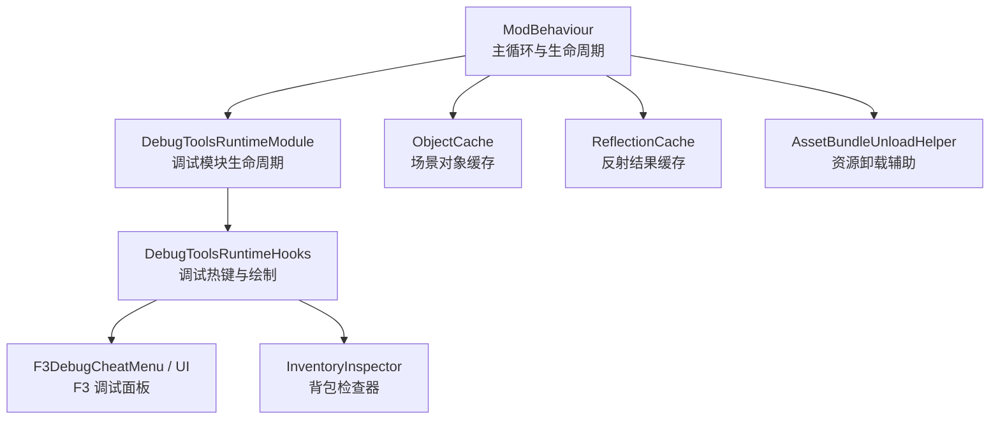
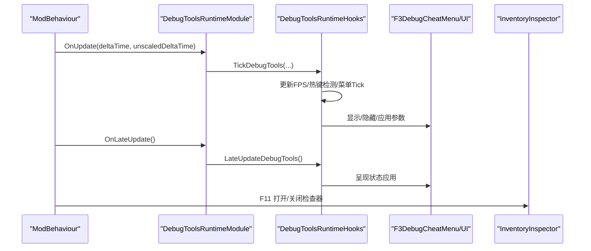
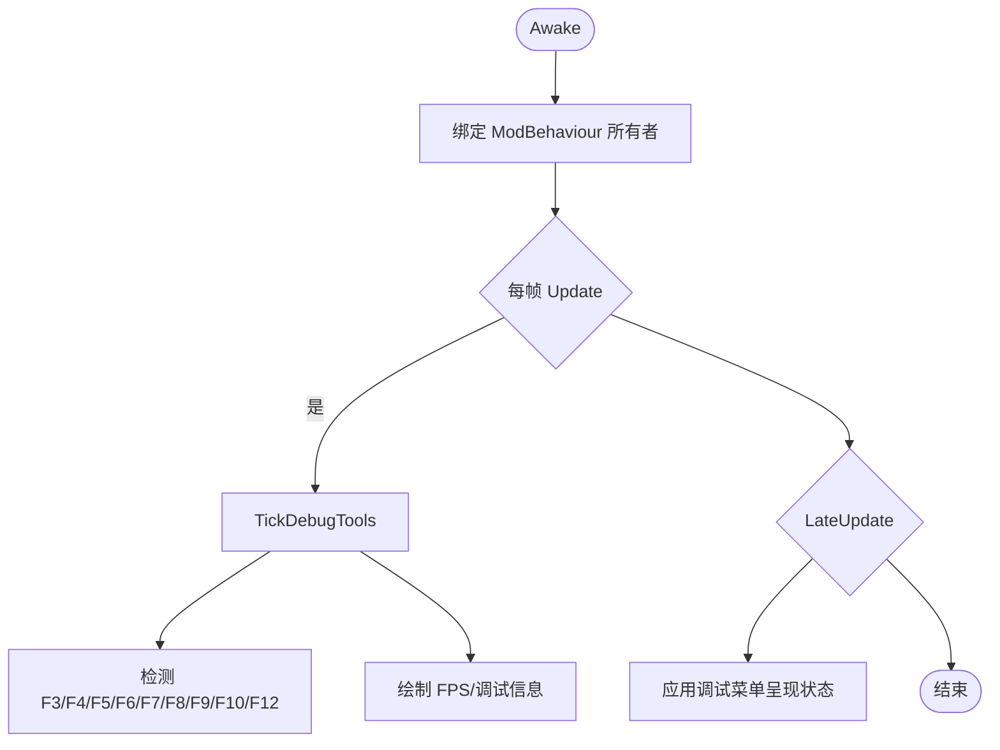
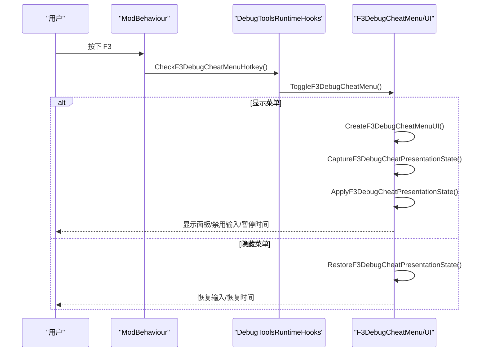
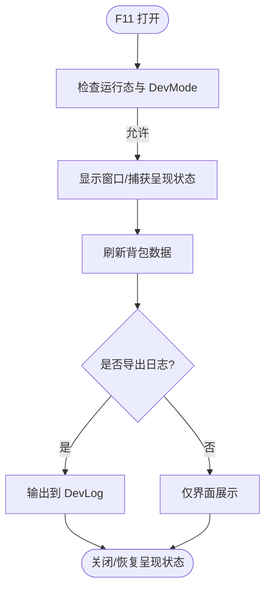
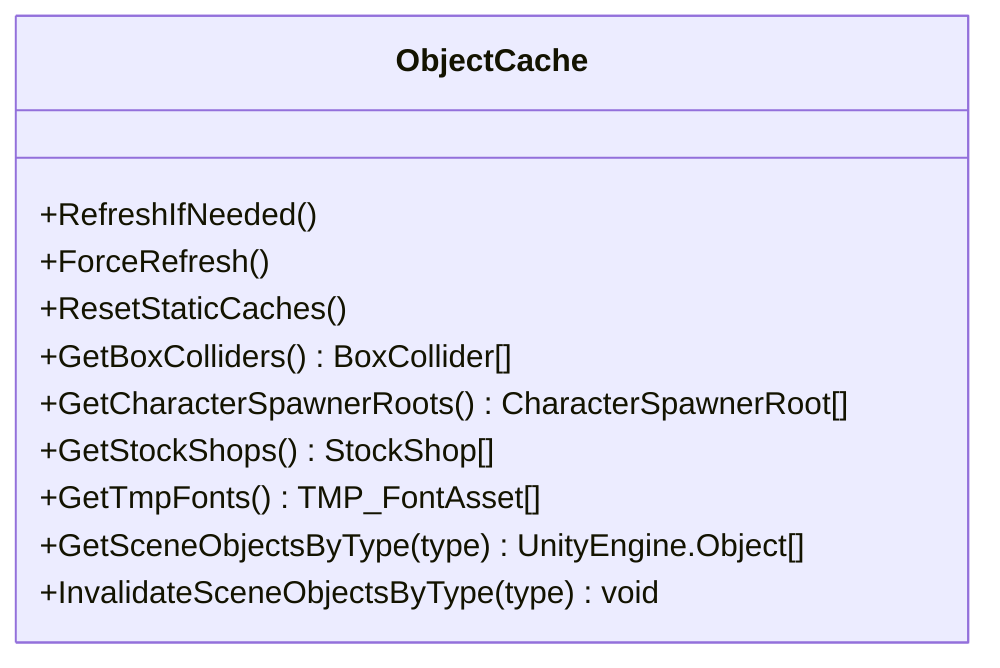
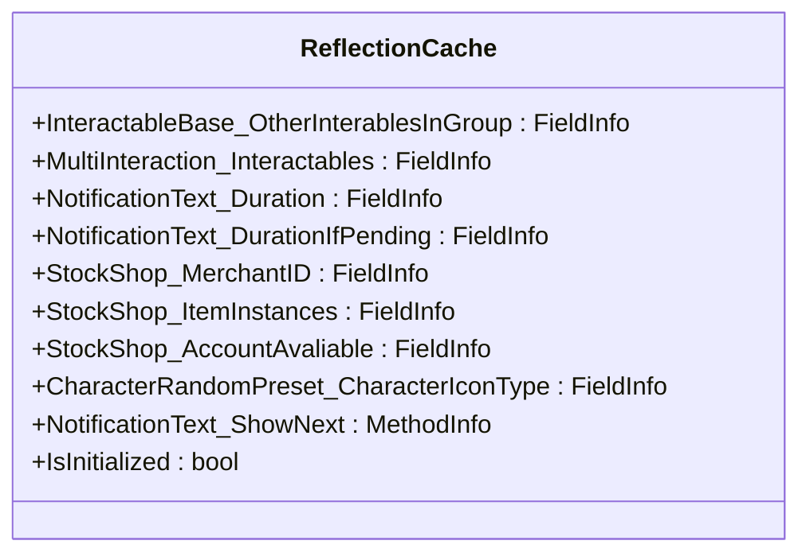
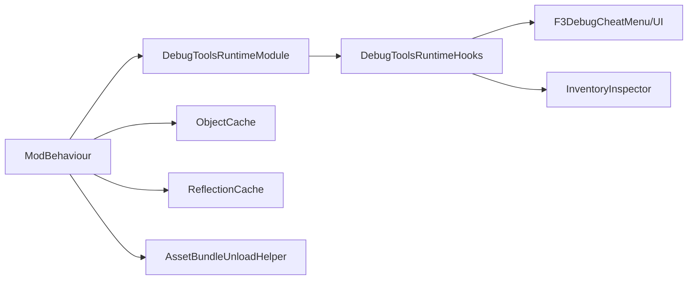

# 性能优化与调试

<cite>
**本文引用的文件**
- [ModBehaviour.cs](file://ModBehaviour.cs)
- [DebugToolsRuntimeModule.cs](file://DebugAndTools/DebugToolsRuntimeModule.cs)
- [DebugToolsRuntimeHooks.cs](file://DebugAndTools/DebugToolsRuntimeHooks.cs)
- [F3DebugCheatMenu.cs](file://DebugAndTools/F3DebugCheatMenu.cs)
- [F3DebugCheatMenuUi.cs](file://DebugAndTools/F3DebugCheatMenuUi.cs)
- [InventoryInspector.cs](file://DebugAndTools/InventoryInspector.cs)
- [ObjectCache.cs](file://Common/Infrastructure/ObjectCache.cs)
- [ReflectionCache.cs](file://Common/Infrastructure/ReflectionCache.cs)
- [AssetBundleUnloadHelper.cs](file://Utilities/AssetBundleUnloadHelper.cs)
</cite>

## 目录
1. [简介](#简介)
2. [项目结构](#项目结构)
3. [核心组件](#核心组件)
4. [架构总览](#架构总览)
5. [详细组件分析](#详细组件分析)
6. [依赖关系分析](#依赖关系分析)
7. [性能注意事项](#性能注意事项)
8. [故障排查指南](#故障排查指南)
9. [结论](#结论)
10. [附录](#附录)

## 简介
本技术文档聚焦于“焚天龙皇”相关模块的性能优化与调试工具，覆盖对象池与缓存、内存管理、渲染与计算密集型路径优化、资源加载与卸载策略、以及调试与日志系统。文档同时提供性能调优指南、常见问题诊断与解决方案，帮助在大规模战斗场景中保持帧率稳定、内存可控和AI行为可观测。

## 项目结构
本项目将性能与调试能力拆分为多个职责清晰的子系统：
- 运行时入口与生命周期钩子：统一调度调试工具更新与清理。
- 调试菜单与检查器：提供可视化调试、状态查看、快捷操作。
- 基础设施缓存：场景对象缓存、反射结果缓存，降低热路径开销。
- 资源卸载辅助：统一安全释放 AssetBundle，避免异常导致泄漏。

**图示来源**
- [ModBehaviour.cs:719-767](file://ModBehaviour.cs#L719-L767)
- [DebugToolsRuntimeModule.cs:1-43](file://DebugAndTools/DebugToolsRuntimeModule.cs#L1-L43)
- [DebugToolsRuntimeHooks.cs:10-38](file://DebugAndTools/DebugToolsRuntimeHooks.cs#L10-L38)
- [F3DebugCheatMenu.cs:107-152](file://DebugAndTools/F3DebugCheatMenu.cs#L107-L152)
- [F3DebugCheatMenuUi.cs:22-199](file://DebugAndTools/F3DebugCheatMenuUi.cs#L22-L199)
- [InventoryInspector.cs:49-89](file://DebugAndTools/InventoryInspector.cs#L49-L89)
- [ObjectCache.cs:17-72](file://Common/Infrastructure/ObjectCache.cs#L17-L72)
- [ReflectionCache.cs:15-84](file://Common/Infrastructure/ReflectionCache.cs#L15-L84)
- [AssetBundleUnloadHelper.cs:17-38](file://Utilities/AssetBundleUnloadHelper.cs#L17-L38)

**章节来源**
- [ModBehaviour.cs:719-767](file://ModBehaviour.cs#L719-L767)
- [DebugToolsRuntimeModule.cs:1-43](file://DebugAndTools/DebugToolsRuntimeModule.cs#L1-L43)
- [DebugToolsRuntimeHooks.cs:10-38](file://DebugAndTools/DebugToolsRuntimeHooks.cs#L10-L38)
- [F3DebugCheatMenu.cs:107-152](file://DebugAndTools/F3DebugCheatMenu.cs#L107-L152)
- [F3DebugCheatMenuUi.cs:22-199](file://DebugAndTools/F3DebugCheatMenuUi.cs#L22-L199)
- [InventoryInspector.cs:49-89](file://DebugAndTools/InventoryInspector.cs#L49-L89)
- [ObjectCache.cs:17-72](file://Common/Infrastructure/ObjectCache.cs#L17-L72)
- [ReflectionCache.cs:15-84](file://Common/Infrastructure/ReflectionCache.cs#L15-L84)
- [AssetBundleUnloadHelper.cs:17-38](file://Utilities/AssetBundleUnloadHelper.cs#L17-L38)

## 核心组件
- 调试运行时模块：封装调试工具的 Awake/Update/LateUpdate/OnDestroy 生命周期，委托到主行为体执行具体逻辑。
- 调试钩子：集中处理调试快捷键（如 F3/F4/F5/F6/F7/F8/F9/F10/F12）、绘制 FPS、场景扫描与日志输出。
- F3 调试菜单：动态构建 UI，支持传送、玩家属性调参、资源发放、战斗流程控制、NPC/剧情测试、场景调试等。
- 背包检查器：DevMode 下按 F11 打开窗口，读取并展示背包物品关键字段，支持导出到日志。
- 场景对象缓存：缓存 FindObjectsOfType 结果，按场景自动失效，减少热路径查找成本。
- 反射缓存：缓存常用 FieldInfo/MethodInfo，避免重复反射调用。
- 资源卸载辅助：统一安全释放 AssetBundle，捕获异常并记录日志。

**章节来源**
- [DebugToolsRuntimeModule.cs:1-43](file://DebugAndTools/DebugToolsRuntimeModule.cs#L1-L43)
- [DebugToolsRuntimeHooks.cs:10-38](file://DebugAndTools/DebugToolsRuntimeHooks.cs#L10-L38)
- [F3DebugCheatMenu.cs:107-152](file://DebugAndTools/F3DebugCheatMenu.cs#L107-L152)
- [F3DebugCheatMenuUi.cs:22-199](file://DebugAndTools/F3DebugCheatMenuUi.cs#L22-L199)
- [InventoryInspector.cs:49-89](file://DebugAndTools/InventoryInspector.cs#L49-L89)
- [ObjectCache.cs:17-72](file://Common/Infrastructure/ObjectCache.cs#L17-L72)
- [ReflectionCache.cs:15-84](file://Common/Infrastructure/ReflectionCache.cs#L15-L84)
- [AssetBundleUnloadHelper.cs:17-38](file://Utilities/AssetBundleUnloadHelper.cs#L17-L38)

## 架构总览
调试与性能子系统通过主行为体的生命周期进行编排：
- Update/LateUpdate 中统一调用调试工具更新与绘制。
- 场景切换时刷新缓存、恢复或重置调试状态。
- 销毁阶段统一清理调试 UI、事件监听与静态缓存。

**图示来源**
- [ModBehaviour.cs:719-767](file://ModBehaviour.cs#L719-L767)
- [DebugToolsRuntimeModule.cs:17-35](file://DebugAndTools/DebugToolsRuntimeModule.cs#L17-L35)
- [DebugToolsRuntimeHooks.cs:23-38](file://DebugAndTools/DebugToolsRuntimeHooks.cs#L23-L38)
- [F3DebugCheatMenu.cs:107-152](file://DebugAndTools/F3DebugCheatMenu.cs#L107-L152)
- [F3DebugCheatMenuUi.cs:22-199](file://DebugAndTools/F3DebugCheatMenuUi.cs#L22-L199)
- [InventoryInspector.cs:49-89](file://DebugAndTools/InventoryInspector.cs#L49-L89)

## 详细组件分析

### 调试运行时模块与钩子
- 职责：将调试工具的生命周期从主行为体解耦，便于独立启停与清理。
- 关键流程：Awake 绑定所有者；Update 委托 Tick；LateUpdate 委托 LateUpdate；OnDestroy 清空引用。
- 钩子扩展：集中处理调试快捷键、绘制 FPS、场景扫描、日志输出与清理。

**图示来源**
- [DebugToolsRuntimeModule.cs:12-35](file://DebugAndTools/DebugToolsRuntimeModule.cs#L12-L35)
- [DebugToolsRuntimeHooks.cs:23-38](file://DebugAndTools/DebugToolsRuntimeHooks.cs#L23-L38)

**章节来源**
- [DebugToolsRuntimeModule.cs:1-43](file://DebugAndTools/DebugToolsRuntimeModule.cs#L1-L43)
- [DebugToolsRuntimeHooks.cs:10-38](file://DebugAndTools/DebugToolsRuntimeHooks.cs#L10-L38)

### F3 调试菜单
- 功能：传送、玩家属性调参、资源发放、战斗流程控制、NPC/剧情测试、场景调试。
- 交互：F3 开关菜单；ESC 关闭；暂停时间缩放以冻结游戏逻辑；输入禁用防止误操作。
- 呈现：动态创建 Canvas/Panel/ScrollView/按钮/文本；错误时回滚呈现状态并记录日志。

**图示来源**
- [F3DebugCheatMenu.cs:107-152](file://DebugAndTools/F3DebugCheatMenu.cs#L107-L152)
- [F3DebugCheatMenuUi.cs:22-199](file://DebugAndTools/F3DebugCheatMenuUi.cs#L22-L199)
- [DebugToolsRuntimeHooks.cs:23-38](file://DebugAndTools/DebugToolsRuntimeHooks.cs#L23-L38)

**章节来源**
- [F3DebugCheatMenu.cs:107-152](file://DebugAndTools/F3DebugCheatMenu.cs#L107-L152)
- [F3DebugCheatMenuUi.cs:22-199](file://DebugAndTools/F3DebugCheatMenuUi.cs#L22-L199)

### 背包检查器
- 触发：DevMode 下按 F11 打开/关闭。
- 数据：读取玩家背包，提取关键字段（名称、标签、品质、价值、耐久、口径、路线提示等）。
- 输出：窗口展示与 DevLog 导出；异常安全读取与降级显示。

**图示来源**
- [InventoryInspector.cs:49-89](file://DebugAndTools/InventoryInspector.cs#L49-L89)
- [InventoryInspector.cs:142-212](file://DebugAndTools/InventoryInspector.cs#L142-L212)
- [InventoryInspector.cs:214-338](file://DebugAndTools/InventoryInspector.cs#L214-L338)

**章节来源**
- [InventoryInspector.cs:49-89](file://DebugAndTools/InventoryInspector.cs#L49-L89)
- [InventoryInspector.cs:142-212](file://DebugAndTools/InventoryInspector.cs#L142-L212)
- [InventoryInspector.cs:214-338](file://DebugAndTools/InventoryInspector.cs#L214-L338)

### 场景对象缓存
- 目标：避免每帧调用 FindObjectsOfType 造成 GC 与 CPU 峰值。
- 机制：按场景名变更自动失效；提供强制刷新与类型级缓存；数组存活校验。
- 使用：BoxCollider、CharacterSpawnerRoot、StockShop、TMP_FontAsset、NotificationText 等。

**图示来源**
- [ObjectCache.cs:17-72](file://Common/Infrastructure/ObjectCache.cs#L17-L72)
- [ObjectCache.cs:92-201](file://Common/Infrastructure/ObjectCache.cs#L92-L201)

**章节来源**
- [ObjectCache.cs:17-72](file://Common/Infrastructure/ObjectCache.cs#L17-L72)
- [ObjectCache.cs:92-201](file://Common/Infrastructure/ObjectCache.cs#L92-L201)

### 反射缓存
- 目标：缓存常用私有字段与方法，避免重复反射带来的性能损耗。
- 内容：InteractableBase、MultiInteraction、NotificationText、StockShop、CharacterRandomPreset 的字段与方法。
- 初始化：静态构造函数中完成一次反射并标记 IsInitialized。

**图示来源**
- [ReflectionCache.cs:15-84](file://Common/Infrastructure/ReflectionCache.cs#L15-L84)

**章节来源**
- [ReflectionCache.cs:15-84](file://Common/Infrastructure/ReflectionCache.cs#L15-L84)

### 资源卸载辅助
- 目标：统一安全释放 AssetBundle，避免各模块重复 try/catch。
- 行为：若 bundle 非空则尝试 Unload(false)，捕获异常并记录日志前缀。

**章节来源**
- [AssetBundleUnloadHelper.cs:17-38](file://Utilities/AssetBundleUnloadHelper.cs#L17-L38)

## 依赖关系分析
- 主行为体作为中心协调者，负责生命周期与调试工具调度。
- 调试模块依赖钩子实现具体功能；钩子依赖 F3 菜单与检查器。
- 性能基础设施（缓存）被多处复用，降低热路径开销。
- 资源卸载辅助被各系统调用，保证资源释放一致性。

**图示来源**
- [ModBehaviour.cs:719-767](file://ModBehaviour.cs#L719-L767)
- [DebugToolsRuntimeModule.cs:1-43](file://DebugAndTools/DebugToolsRuntimeModule.cs#L1-L43)
- [DebugToolsRuntimeHooks.cs:10-38](file://DebugAndTools/DebugToolsRuntimeHooks.cs#L10-L38)
- [F3DebugCheatMenu.cs:107-152](file://DebugAndTools/F3DebugCheatMenu.cs#L107-L152)
- [F3DebugCheatMenuUi.cs:22-199](file://DebugAndTools/F3DebugCheatMenuUi.cs#L22-L199)
- [InventoryInspector.cs:49-89](file://DebugAndTools/InventoryInspector.cs#L49-L89)
- [ObjectCache.cs:17-72](file://Common/Infrastructure/ObjectCache.cs#L17-L72)
- [ReflectionCache.cs:15-84](file://Common/Infrastructure/ReflectionCache.cs#L15-L84)
- [AssetBundleUnloadHelper.cs:17-38](file://Utilities/AssetBundleUnloadHelper.cs#L17-L38)

**章节来源**
- [ModBehaviour.cs:719-767](file://ModBehaviour.cs#L719-L767)
- [DebugToolsRuntimeModule.cs:1-43](file://DebugAndTools/DebugToolsRuntimeModule.cs#L1-L43)
- [DebugToolsRuntimeHooks.cs:10-38](file://DebugAndTools/DebugToolsRuntimeHooks.cs#L10-L38)
- [F3DebugCheatMenu.cs:107-152](file://DebugAndTools/F3DebugCheatMenu.cs#L107-L152)
- [F3DebugCheatMenuUi.cs:22-199](file://DebugAndTools/F3DebugCheatMenuUi.cs#L22-L199)
- [InventoryInspector.cs:49-89](file://DebugAndTools/InventoryInspector.cs#L49-L89)
- [ObjectCache.cs:17-72](file://Common/Infrastructure/ObjectCache.cs#L17-L72)
- [ReflectionCache.cs:15-84](file://Common/Infrastructure/ReflectionCache.cs#L15-L84)
- [AssetBundleUnloadHelper.cs:17-38](file://Utilities/AssetBundleUnloadHelper.cs#L17-L38)

## 性能注意事项
- 帧率优化
  - 使用场景对象缓存避免每帧 FindObjectsOfType。
  - 使用反射缓存避免重复反射。
  - 调试菜单打开时暂停时间缩放，避免高频 UI 更新影响战斗。
- 内存管理
  - 资源卸载统一入口，捕获异常并记录日志，避免泄漏。
  - 场景切换时刷新/清空缓存，避免持有已销毁对象引用。
  - 调试 UI 销毁时清理所有引用与输入禁用令牌。
- 计算密集型操作
  - 将耗时操作延迟到 LateUpdate 或异步任务（如菜单刷新摘要）。
  - 批量收集与遍历采用索引倒序，避免额外分配。
- 渲染优化
  - UI 布局使用 ContentSizeFitter 与 LayoutGroup，减少重排。
  - Mask 与 Image alpha 配置确保正确裁剪与可见性。

[本节为通用指导，不直接分析具体文件]

## 故障排查指南
- 卡顿问题
  - 检查是否频繁调用 FindObjectsOfType；优先使用 ObjectCache。
  - 确认调试菜单未常驻开启；必要时关闭 F3 面板。
  - 观察 FPS 显示，定位帧下降时段对应的调试操作。
- 内存溢出
  - 检查 AssetBundle 是否正确卸载；使用 AssetBundleUnloadHelper。
  - 场景切换后确认缓存已刷新；避免跨场景引用。
  - 调试 UI 销毁时确保清理所有 GameObject 引用。
- AI 性能瓶颈
  - 使用场景角色扫描输出最近角色信息，定位异常实体。
  - 通过 F8 输出除玩家外所有角色信息，分析数量与距离。
  - 结合 F7 输出最近交互点，排查入口或触发器导致的异常生成。

**章节来源**
- [DebugToolsRuntimeHooks.cs:151-193](file://DebugAndTools/DebugToolsRuntimeHooks.cs#L151-L193)
- [DebugToolsRuntimeHooks.cs:236-356](file://DebugAndTools/DebugToolsRuntimeHooks.cs#L236-L356)
- [ObjectCache.cs:17-72](file://Common/Infrastructure/ObjectCache.cs#L17-L72)
- [AssetBundleUnloadHelper.cs:17-38](file://Utilities/AssetBundleUnloadHelper.cs#L17-L38)

## 结论
本项目通过模块化设计将调试与性能优化解耦，借助缓存与统一资源卸载提升稳定性与可维护性。F3 调试菜单与背包检查器提供了强大的运行时诊断能力，配合场景扫描与日志输出，能够快速定位卡顿、内存与 AI 相关问题。建议在大规模战斗场景中优先启用缓存、谨慎开启调试功能，并结合日志与 FPS 监控持续优化。

[本节为总结，不直接分析具体文件]

## 附录
- 快捷键速查
  - F3：打开/关闭调试菜单。
  - F4：清空成就数据（DevMode）。
  - F5：输出附近建筑/对象信息（DevMode）。
  - F6：切换放置模式（DevMode）。
  - F7：输出最近交互点（DevMode）。
  - F8：输出场景角色信息（DevMode）。
  - F9：打开传送地图并发送船票（DevMode）。
  - F10：清场并触发通关（DevMode）。
  - F11：打开背包检查器（DevMode）。
  - F12：打开 NPC 传送 UI（DevMode）。

**章节来源**
- [DebugToolsRuntimeHooks.cs:40-234](file://DebugAndTools/DebugToolsRuntimeHooks.cs#L40-L234)
