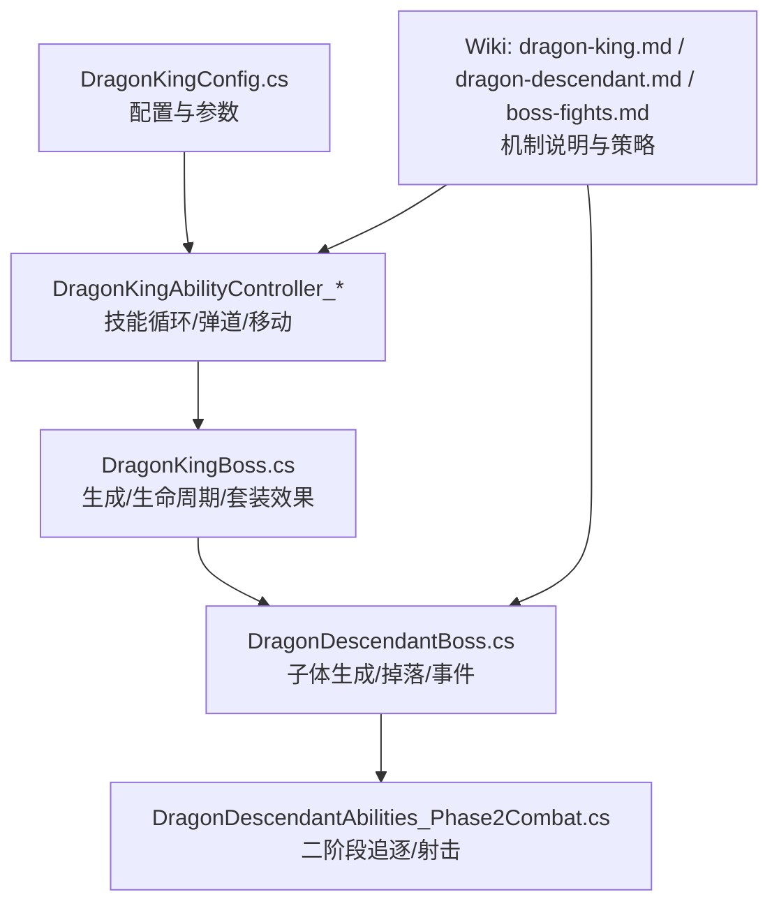
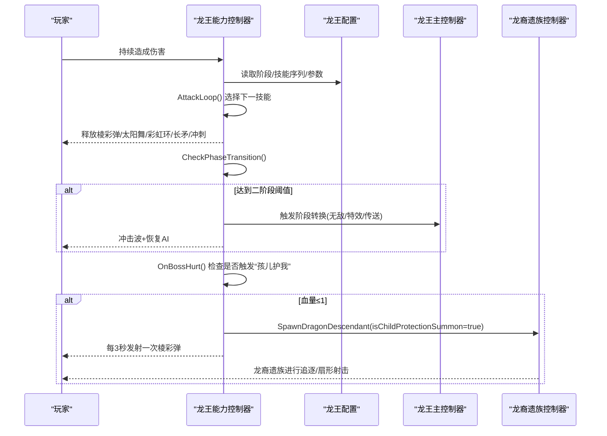
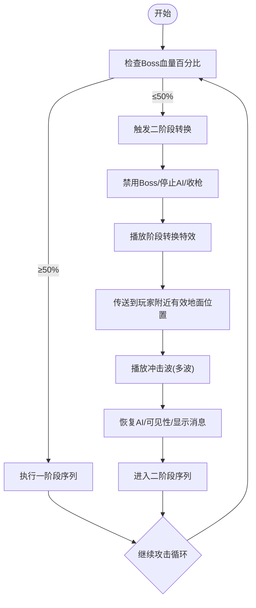
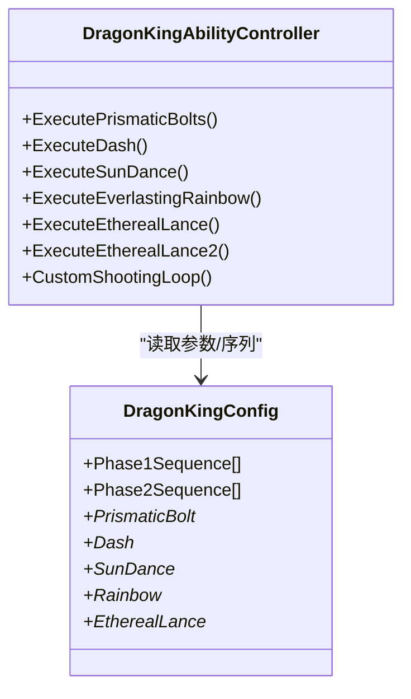
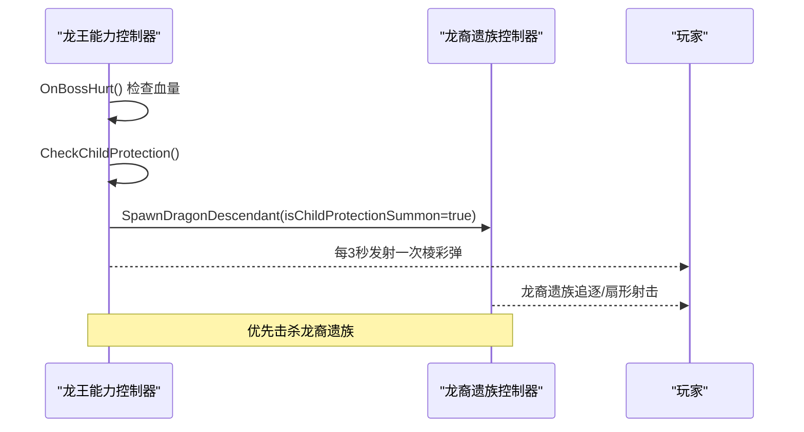
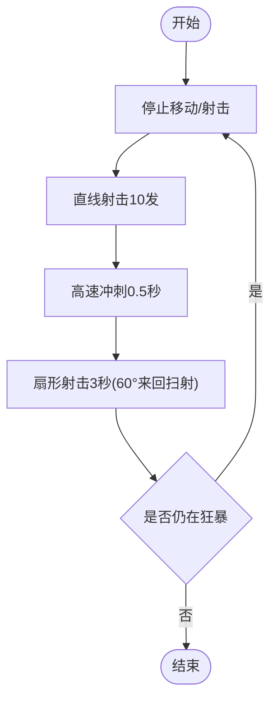
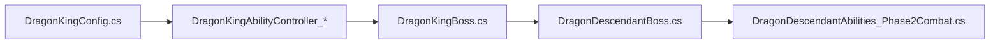

# 战斗机制与策略

<cite>
**本文引用的文件**
- [DragonKingConfig.cs](file://Integration/DragonKing/DragonKingConfig.cs)
- [DragonKingAbilityController_AttackFlow.cs](file://Integration/DragonKing/DragonKingAbilityController_AttackFlow.cs)
- [DragonKingAbilityController_ProjectileAndMovement.cs](file://Integration/DragonKing/DragonKingAbilityController_ProjectileAndMovement.cs)
- [DragonKingAbilityController_SpecialAttacks.cs](file://Integration/DragonKing/DragonKingAbilityController_SpecialAttacks.cs)
- [DragonKingBoss.cs](file://Integration/DragonKing/DragonKingBoss.cs)
- [DragonDescendantBoss.cs](file://Integration/DragonDescendant/DragonDescendantBoss.cs)
- [DragonDescendantAbilities_Phase2Combat.cs](file://Integration/DragonDescendant/DragonDescendantAbilities_Phase2Combat.cs)
- [dragon-king.md](file://wiki-site/docs/en/bosses/dragon-king.md)
- [dragon-descendant.md](file://wiki-site/docs/en/bosses/dragon-descendant.md)
- [boss-fights.md](file://wiki-site/docs/en/guides/boss-fights.md)
</cite>

## 目录
1. [简介](#简介)
2. [项目结构](#项目结构)
3. [核心组件](#核心组件)
4. [架构总览](#架构总览)
5. [详细组件分析](#详细组件分析)
6. [依赖关系分析](#依赖关系分析)
7. [性能与表现](#性能与表现)
8. [故障排查](#故障排查)
9. [结论](#结论)
10. [附录：玩家准备与团队配合](#附录玩家准备与团队配合)

## 简介
本攻略面向“焚天龙皇”（Skyburner Dragon Lord）及其在血量降至极低时召唤的“龙裔遗族”（Dragon Descendant）子体。文档基于代码实现与Wiki内容，系统梳理阶段转换、攻击模式、走位与输出窗口、特殊能力与弱点，并给出装备与团队配合建议，帮助玩家在高压弹幕中稳定生存并最大化伤害。

## 项目结构
围绕龙王与龙裔遗族的战斗逻辑，主要分布在以下模块：
- 配置与常量：DragonKingConfig.cs
- 龙王能力控制器：AttackFlow/ProjectileAndMovement/SpecialAttacks
- 龙王主控制器：DragonKingBoss.cs
- 龙裔遗族主控制器与二阶段行为：DragonDescendantBoss.cs、DragonDescendantAbilities_Phase2Combat.cs
- Wiki攻略：dragon-king.md、dragon-descendant.md、boss-fights.md

图表来源
- [DragonKingConfig.cs:16-736](file://Integration/DragonKing/DragonKingConfig.cs#L16-L736)
- [DragonKingAbilityController_AttackFlow.cs:15-120](file://Integration/DragonKing/DragonKingAbilityController_AttackFlow.cs#L15-L120)
- [DragonKingAbilityController_ProjectileAndMovement.cs:15-177](file://Integration/DragonKing/DragonKingAbilityController_ProjectileAndMovement.cs#L15-L177)
- [DragonKingAbilityController_SpecialAttacks.cs:15-177](file://Integration/DragonKing/DragonKingAbilityController_SpecialAttacks.cs#L15-L177)
- [DragonKingBoss.cs:205-371](file://Integration/DragonKing/DragonKingBoss.cs#L205-L371)
- [DragonDescendantBoss.cs:56-235](file://Integration/DragonDescendant/DragonDescendantBoss.cs#L56-L235)
- [DragonDescendantAbilities_Phase2Combat.cs:18-125](file://Integration/DragonDescendant/DragonDescendantAbilities_Phase2Combat.cs#L18-L125)

章节来源
- [DragonKingConfig.cs:16-736](file://Integration/DragonKing/DragonKingConfig.cs#L16-L736)
- [DragonKingAbilityController_AttackFlow.cs:15-120](file://Integration/DragonKing/DragonKingAbilityController_AttackFlow.cs#L15-L120)
- [DragonKingAbilityController_ProjectileAndMovement.cs:15-177](file://Integration/DragonKing/DragonKingAbilityController_ProjectileAndMovement.cs#L15-L177)
- [DragonKingAbilityController_SpecialAttacks.cs:15-177](file://Integration/DragonKing/DragonKingAbilityController_SpecialAttacks.cs#L15-L177)
- [DragonKingBoss.cs:205-371](file://Integration/DragonKing/DragonKingBoss.cs#L205-L371)
- [DragonDescendantBoss.cs:56-235](file://Integration/DragonDescendant/DragonDescendantBoss.cs#L56-L235)
- [DragonDescendantAbilities_Phase2Combat.cs:18-125](file://Integration/DragonDescendant/DragonDescendantAbilities_Phase2Combat.cs#L18-L125)

## 核心组件
- 龙王配置中心：集中定义阶段阈值、技能序列、弹道参数、特效与音效路径等。
- 龙王能力控制器：负责攻击主循环、阶段转换、棱彩弹/太阳舞/彩虹环/长矛/冲刺等技能执行。
- 龙王主控制器：负责生成、属性设置、掉落、套装效果注册与清理、音频播放等。
- 龙裔遗族控制器：负责子体生成、二阶段追逐与扇形射击、碰撞检测等。
- Wiki资料：提供阶段、技能、应对策略与掉落信息。

章节来源
- [DragonKingConfig.cs:16-736](file://Integration/DragonKing/DragonKingConfig.cs#L16-L736)
- [DragonKingAbilityController_AttackFlow.cs:15-120](file://Integration/DragonKing/DragonKingAbilityController_AttackFlow.cs#L15-L120)
- [DragonKingAbilityController_ProjectileAndMovement.cs:15-177](file://Integration/DragonKing/DragonKingAbilityController_ProjectileAndMovement.cs#L15-L177)
- [DragonKingAbilityController_SpecialAttacks.cs:15-177](file://Integration/DragonKing/DragonKingAbilityController_SpecialAttacks.cs#L15-L177)
- [DragonKingBoss.cs:205-371](file://Integration/DragonKing/DragonKingBoss.cs#L205-L371)
- [DragonDescendantBoss.cs:56-235](file://Integration/DragonDescendant/DragonDescendantBoss.cs#L56-L235)
- [DragonDescendantAbilities_Phase2Combat.cs:18-125](file://Integration/DragonDescendant/DragonDescendantAbilities_Phase2Combat.cs#L18-L125)

## 架构总览
龙王战斗由“配置驱动 + 能力控制器调度”的架构组成。攻击主循环按当前阶段的序列依次执行技能；阶段转换通过血量阈值触发，期间Boss短暂无敌并播放特效；当血量降至极低时进入“孩儿护我”阶段，龙王悬浮并发射低频率棱彩弹，同时召唤半属性的龙裔遗族进行保护。

图表来源
- [DragonKingAbilityController_AttackFlow.cs:15-120](file://Integration/DragonKing/DragonKingAbilityController_AttackFlow.cs#L15-L120)
- [DragonKingAbilityController_AttackFlow.cs:136-287](file://Integration/DragonKing/DragonKingAbilityController_AttackFlow.cs#L136-L287)
- [DragonKingAbilityController_AttackFlow.cs:419-460](file://Integration/DragonKing/DragonKingAbilityController_AttackFlow.cs#L419-L460)
- [DragonKingBoss.cs:205-371](file://Integration/DragonKing/DragonKingBoss.cs#L205-L371)
- [DragonDescendantBoss.cs:56-235](file://Integration/DragonDescendant/DragonDescendantBoss.cs#L56-L235)
- [DragonDescendantAbilities_Phase2Combat.cs:18-125](file://Integration/DragonDescendant/DragonDescendantAbilities_Phase2Combat.cs#L18-L125)

## 详细组件分析

### 阶段与阶段转换
- 一阶段：攻击间隔约1.0秒，技能序列包含棱彩弹、冲刺、太阳舞、永恒彩虹、以太长矛等。
- 二阶段：血量≤50%触发，攻击间隔缩短至0.5秒，技能升级（如切屏剑阵、螺旋棱彩弹），并伴随更强的连段。
- 阶段转换流程：检测到阈值后，Boss短暂禁用/隐藏→播放特效→传送到玩家附近地面→释放冲击波→恢复AI与可见性→重置攻击序列索引→进入二阶段。

图表来源
- [DragonKingAbilityController_AttackFlow.cs:136-287](file://Integration/DragonKing/DragonKingAbilityController_AttackFlow.cs#L136-L287)
- [DragonKingConfig.cs:71-91](file://Integration/DragonKing/DragonKingConfig.cs#L71-L91)

章节来源
- [DragonKingAbilityController_AttackFlow.cs:136-287](file://Integration/DragonKing/DragonKingAbilityController_AttackFlow.cs#L136-L287)
- [DragonKingConfig.cs:71-91](file://Integration/DragonKing/DragonKingConfig.cs#L71-L91)

### 攻击类型与机制
- 棱彩弹（追踪弹道）
  - 一阶段：在Boss周围生成若干彩虹弹幕，延迟后追踪玩家，追踪持续时间有限，之后直线飞行。
  - 二阶段：螺旋发射，追踪时间更短，要求更快的横向躲避。
  - 命中判定使用距离平方比较优化，避免开方开销。
- 冲刺（范围冲击/接触伤害）
  - 蓄力阶段出现粒子聚拢与倒计时光圈；第一段直接移动到锁定目标位置，第二段在二阶段追加短冲刺。
  - 冲刺轨迹产生岩浆区域（地面标记），持续伤害。
- 太阳舞（旋转光束/弹幕）
  - 向多个方向发射子弹，整体缓慢旋转；同时存在光束本体伤害。
  - 需要寻找光束间隙或远离范围。
- 永恒彩虹（环形扩散/收缩）
  - 星环从Boss位置向外螺旋扩散到最大半径，再向内收缩；轨迹带伤害。
  - 应对：扩散时向外跑，收缩时向内走。
- 以太长矛（地面标记/贯穿）
  - 一阶段：横向贯穿，先画警告线，随后双向射出长矛。
  - 二阶段：切屏剑阵，多波长矛从不同方向切过屏幕，预警时间短。
- 自定义射击（持续压制）
  - Boss在技能释放期间仍会朝玩家方向发射子弹，偏移量随阶段增大。

图表来源
- [DragonKingAbilityController_ProjectileAndMovement.cs:15-177](file://Integration/DragonKing/DragonKingAbilityController_ProjectileAndMovement.cs#L15-L177)
- [DragonKingAbilityController_SpecialAttacks.cs:15-177](file://Integration/DragonKing/DragonKingAbilityController_SpecialAttacks.cs#L15-L177)
- [DragonKingAbilityController_AttackFlow.cs:483-526](file://Integration/DragonKing/DragonKingAbilityController_AttackFlow.cs#L483-L526)
- [DragonKingConfig.cs:564-597](file://Integration/DragonKing/DragonKingConfig.cs#L564-L597)

章节来源
- [DragonKingAbilityController_ProjectileAndMovement.cs:15-177](file://Integration/DragonKing/DragonKingAbilityController_ProjectileAndMovement.cs#L15-L177)
- [DragonKingAbilityController_SpecialAttacks.cs:15-177](file://Integration/DragonKing/DragonKingAbilityController_SpecialAttacks.cs#L15-L177)
- [DragonKingAbilityController_AttackFlow.cs:483-526](file://Integration/DragonKing/DragonKingAbilityController_AttackFlow.cs#L483-L526)
- [DragonKingConfig.cs:564-597](file://Integration/DragonKing/DragonKingConfig.cs#L564-L597)

### “孩儿护我”与召唤物系统
- 触发条件：Boss血量降至1点时进入“孩儿护我”，Boss短暂无敌并升空，每3秒发射一次棱彩弹。
- 召唤物：同时召唤半属性的龙裔遗族进行保护。
- 应对优先级：优先击杀龙裔遗族，否则龙王将持续低频率火力压制。

图表来源
- [DragonKingAbilityController_AttackFlow.cs:419-460](file://Integration/DragonKing/DragonKingAbilityController_AttackFlow.cs#L419-L460)
- [DragonDescendantBoss.cs:56-235](file://Integration/DragonDescendant/DragonDescendantBoss.cs#L56-L235)
- [DragonDescendantAbilities_Phase2Combat.cs:18-125](file://Integration/DragonDescendant/DragonDescendantAbilities_Phase2Combat.cs#L18-L125)

章节来源
- [DragonKingAbilityController_AttackFlow.cs:419-460](file://Integration/DragonKing/DragonKingAbilityController_AttackFlow.cs#L419-L460)
- [DragonDescendantBoss.cs:56-235](file://Integration/DragonDescendant/DragonDescendantBoss.cs#L56-L235)
- [DragonDescendantAbilities_Phase2Combat.cs:18-125](file://Integration/DragonDescendant/DragonDescendantAbilities_Phase2Combat.cs#L18-L125)

### 龙裔遗族二阶段行为
- 行为循环：停止射击→直线射击10发→高速冲刺0.5秒→停止并扇形射击3秒（60°扇面，来回扫射）。
- 特点：二阶段移速提升、接触伤害生效、燃烧弹频率提高；对冰元素有脆弱期（累计冰伤达上限后减速）。

图表来源
- [DragonDescendantAbilities_Phase2Combat.cs:18-125](file://Integration/DragonDescendant/DragonDescendantAbilities_Phase2Combat.cs#L18-L125)

章节来源
- [DragonDescendantAbilities_Phase2Combat.cs:18-125](file://Integration/DragonDescendant/DragonDescendantAbilities_Phase2Combat.cs#L18-L125)

## 依赖关系分析
- 龙王能力控制器强依赖配置中心提供的序列与参数；所有弹道、速度、持续时间、伤害均来源于配置。
- 龙王主控制器管理实例生命周期、掉落、套装效果注册与清理，确保多Boss场景下的正确资源回收。
- 龙裔遗族控制器依赖原始武器数据以复现二阶段射击特性，并在Mode E下遵循阵营与脱战距离限制。

图表来源
- [DragonKingConfig.cs:16-736](file://Integration/DragonKing/DragonKingConfig.cs#L16-L736)
- [DragonKingAbilityController_AttackFlow.cs:15-120](file://Integration/DragonKing/DragonKingAbilityController_AttackFlow.cs#L15-L120)
- [DragonKingBoss.cs:205-371](file://Integration/DragonKing/DragonKingBoss.cs#L205-L371)
- [DragonDescendantBoss.cs:56-235](file://Integration/DragonDescendant/DragonDescendantBoss.cs#L56-L235)
- [DragonDescendantAbilities_Phase2Combat.cs:18-125](file://Integration/DragonDescendant/DragonDescendantAbilities_Phase2Combat.cs#L18-L125)

章节来源
- [DragonKingConfig.cs:16-736](file://Integration/DragonKing/DragonKingConfig.cs#L16-L736)
- [DragonKingAbilityController_AttackFlow.cs:15-120](file://Integration/DragonKing/DragonKingAbilityController_AttackFlow.cs#L15-L120)
- [DragonKingBoss.cs:205-371](file://Integration/DragonKing/DragonKingBoss.cs#L205-L371)
- [DragonDescendantBoss.cs:56-235](file://Integration/DragonDescendant/DragonDescendantBoss.cs#L56-L235)
- [DragonDescendantAbilities_Phase2Combat.cs:18-125](file://Integration/DragonDescendant/DragonDescendantAbilities_Phase2Combat.cs#L18-L125)

## 性能与表现
- 弹道与命中检测大量使用sqrMagnitude避免开方，降低CPU开销。
- 协程与WaitForSeconds对象复用，减少GC压力。
- 音效播放采用反射缓存与节流，避免频繁IO与重复调用。
- 传送与位置校验使用NonAlloc版本物理查询，避免分配临时数组。

[本节为通用性能讨论，不直接分析具体文件]

## 故障排查
- 若Boss未死亡导致波次卡住：检查Boss团队是否为敌对（非玩家友好），必要时强制设为狼群阵营。
- 若阶段转换异常：确认无敌状态与可见性切换是否正确，以及冲击波播放与AI恢复顺序。
- 若龙裔遗族未正常召唤：检查“孩儿护我”触发条件与Spawn方法参数。

章节来源
- [ModBehaviour.cs:1098-1113](file://ModBehaviour.cs#L1098-L1113)
- [DragonKingAbilityController_AttackFlow.cs:156-287](file://Integration/DragonKing/DragonKingAbilityController_AttackFlow.cs#L156-L287)
- [DragonDescendantBoss.cs:56-235](file://Integration/DragonDescendant/DragonDescendantBoss.cs#L56-L235)

## 结论
焚天龙皇的战斗以“配置驱动的技能序列 + 严格的阶段转换 + 高难度弹幕组合”为核心。掌握各技能的预警信号与安全区、把握二阶段的高频节奏、优先处理“孩儿护我”阶段的龙裔遗族，是通关的关键。配合火焰免疫与回血套装、冰元素脆弱期利用，可显著降低难度并扩大输出窗口。

[本节为总结，不直接分析具体文件]

## 附录：玩家准备与团队配合
- 推荐装备
  - 龙套/龙王套：火焰伤害免疫并可转化为治疗，极大降低火系弹幕压力。
  - 逆鳞图腾：容错保障，关键时刻保命。
  - 冰系武器/弹药：在龙裔遗族二阶段累积冰伤触发减速，便于安全输出。
- 技能搭配
  - 远程枪械为主（龙王悬浮3-5米，近战难以触及）。
  - 具备位移/闪避技能以应对冲刺与长矛贯穿。
- 团队配合
  - 分工明确：一人牵制龙王（躲避棱彩弹/彩虹环/太阳舞），其余集火龙裔遗族。
  - 控制仇恨与站位：避免多人聚集被扇形弹幕覆盖；保持分散以便长矛预警清晰。
- 走位与输出
  - 安全区域识别：彩虹环扩散时向外跑，收缩时向内走；太阳舞找光束间隙；长矛看预警线站在线外。
  - 躲避时机：冲刺前0.3秒出现倒计时光圈，立即侧移；二阶段冲刺有第二段，不要贪刀。
  - 输出窗口：扇形射击结束后短停顿、龙裔遗族减速期间集中爆发。

章节来源
- [dragon-king.md:39-96](file://wiki-site/docs/en/bosses/dragon-king.md#L39-L96)
- [dragon-descendant.md:32-60](file://wiki-site/docs/en/bosses/dragon-descendant.md#L32-L60)
- [boss-fights.md:30-53](file://wiki-site/docs/en/guides/boss-fights.md#L30-L53)