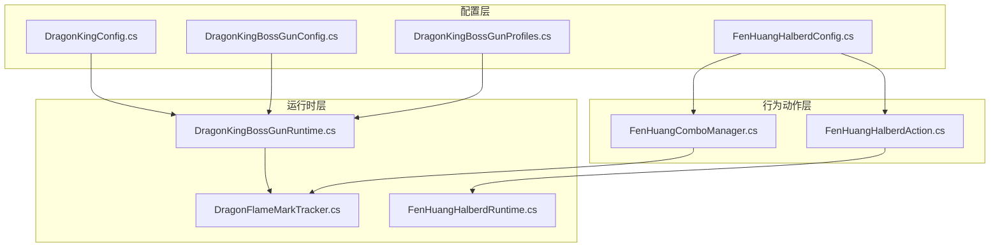
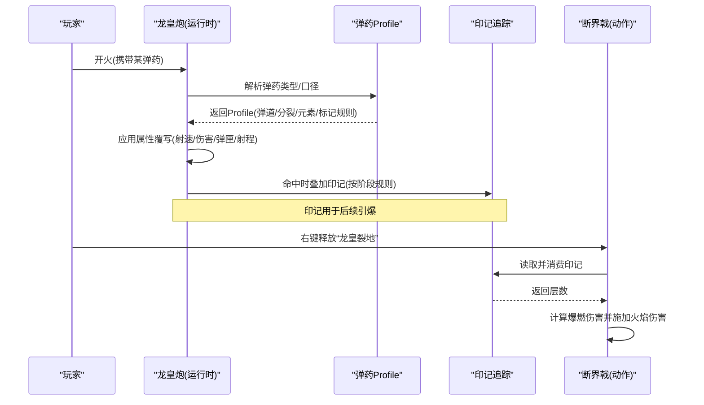
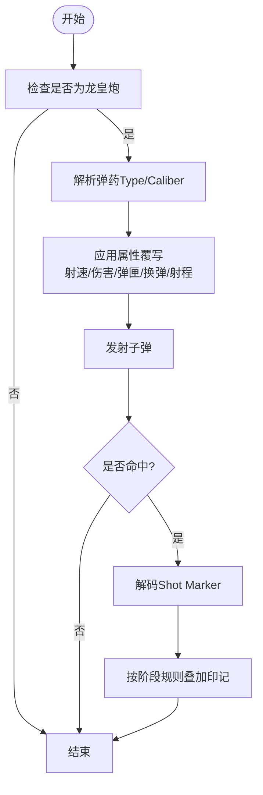
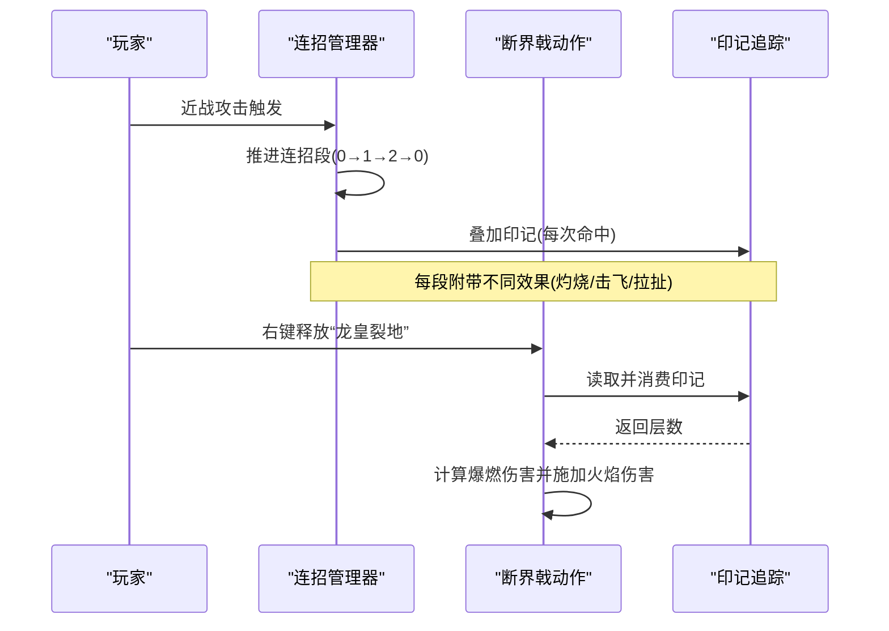
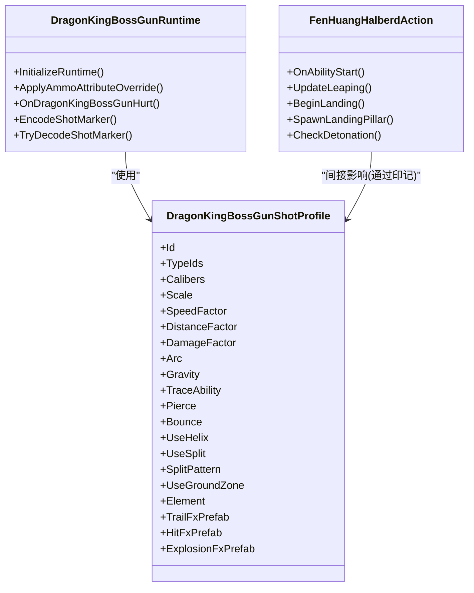
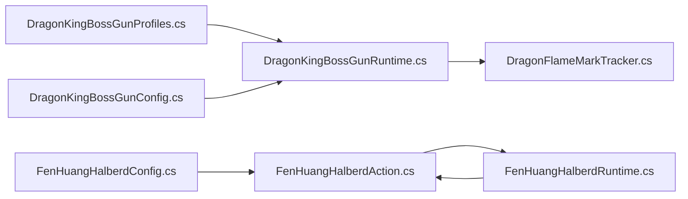

# 武器系统

<cite>
**本文引用的文件**
- [DragonKingConfig.cs](file://Integration/DragonKing/DragonKingConfig.cs)
- [DragonKingBossGunConfig.cs](file://Integration/DragonKing/Weapons/DragonKingBossGunConfig.cs)
- [DragonKingBossGunProfiles.cs](file://Integration/DragonKing/Weapons/DragonKingBossGunProfiles.cs)
- [DragonKingBossGunRuntime.cs](file://Integration/DragonKing/Weapons/DragonKingBossGunRuntime.cs)
- [DragonFlameMarkTracker.cs](file://Integration/DragonKing/Weapons/DragonFlameMarkTracker.cs)
- [FenHuangHalberdConfig.cs](file://Integration/DragonKing/Weapons/FenHuangHalberdConfig.cs)
- [FenHuangComboManager.cs](file://Integration/DragonKing/Weapons/FenHuangComboManager.cs)
- [FenHuangHalberdAction.cs](file://Integration/DragonKing/Weapons/FenHuangHalberdAction.cs)
- [FenHuangHalberdRuntime.cs](file://Integration/DragonKing/Weapons/FenHuangHalberdRuntime.cs)
</cite>

## 目录
1. [简介](#简介)
2. [项目结构](#项目结构)
3. [核心组件](#核心组件)
4. [架构总览](#架构总览)
5. [详细组件分析](#详细组件分析)
6. [依赖关系分析](#依赖关系分析)
7. [性能考量](#性能考量)
8. [故障排查指南](#故障排查指南)
9. [结论](#结论)
10. [附录](#附录)

## 简介
本技术文档围绕“焚天龙皇”的武器系统展开，重点覆盖：
- 龙皇炮（焚天龙铳）的配置与运行时：武器定义、弹药类型映射、伤害计算、弹道物理、特效渲染。
- 特殊武器（焚皇断界戟）的技能系统：三段连招、连击机制、复合攻击模式与印记联动。
- 扩展机制：如何新增武器/弹药、配置文件格式、运行时参数调整。
- 平衡性调优：伤害数值、射速控制、视觉效果优化建议。

## 项目结构
该武器系统位于 Integration/DragonKing 及其子目录 Weapons 下，采用“配置 + 运行时 + 行为动作”的分层组织方式：
- 配置层：集中存放武器与技能的可调参数（如伤害、射速、范围、持续时间等）。
- 运行时层：负责事件订阅、命中处理、属性覆写、标记追踪、资源预热等。
- 行为动作层：封装具体技能流程（如跃击、火柱生成、连招推进）。

图表来源
- [DragonKingConfig.cs:1-736](file://Integration/DragonKing/DragonKingConfig.cs#L1-L736)
- [DragonKingBossGunConfig.cs:1-322](file://Integration/DragonKing/Weapons/DragonKingBossGunConfig.cs#L1-L322)
- [DragonKingBossGunProfiles.cs:1-785](file://Integration/DragonKing/Weapons/DragonKingBossGunProfiles.cs#L1-L785)
- [DragonKingBossGunRuntime.cs:1-800](file://Integration/DragonKing/Weapons/DragonKingBossGunRuntime.cs#L1-L800)
- [DragonFlameMarkTracker.cs:1-151](file://Integration/DragonKing/Weapons/DragonFlameMarkTracker.cs#L1-L151)
- [FenHuangHalberdConfig.cs:1-224](file://Integration/DragonKing/Weapons/FenHuangHalberdConfig.cs#L1-L224)
- [FenHuangComboManager.cs:1-779](file://Integration/DragonKing/Weapons/FenHuangComboManager.cs#L1-L779)
- [FenHuangHalberdAction.cs:1-786](file://Integration/DragonKing/Weapons/FenHuangHalberdAction.cs#L1-L786)
- [FenHuangHalberdRuntime.cs:1-275](file://Integration/DragonKing/Weapons/FenHuangHalberdRuntime.cs#L1-L275)

章节来源
- [DragonKingConfig.cs:1-736](file://Integration/DragonKing/DragonKingConfig.cs#L1-L736)
- [DragonKingBossGunConfig.cs:1-322](file://Integration/DragonKing/Weapons/DragonKingBossGunConfig.cs#L1-L322)

## 核心组件
- 龙皇炮（焚天龙铳）
  - 武器定义与本地化：通过配置类注入名称、描述、默认显示口径、基础属性集合与标签。
  - 弹药类型映射：按 TypeID 或 Caliber 匹配到对应射击 Profile，决定弹道、分裂、爆炸、元素、追踪等。
  - 运行时属性覆写：根据弹药 Profile 动态修改射速、伤害、弹匣、换弹时间、射程、后坐力等。
  - 命中与印记：命中时编码 Shot Marker，解析后叠加“龙焰印记”，供戟类技能引爆。
- 焚皇断界戟
  - 右键技能“龙皇裂地”：跃起砸落、生成多根火柱、范围伤害与爆燃。
  - 三段连招：横扫/上挑/重劈，每段附带不同范围、角度、伤害与附加效果（灼烧、击飞、拉扯）。
  - 印记联动：普通攻击叠加印记，右键砸落时引爆全部印记造成额外火焰伤害。
- 龙焰印记追踪系统
  - 统一管理目标身上的印记层数与过期清理，支持查询与消费。

章节来源
- [DragonKingBossGunConfig.cs:105-322](file://Integration/DragonKing/Weapons/DragonKingBossGunConfig.cs#L105-L322)
- [DragonKingBossGunProfiles.cs:44-178](file://Integration/DragonKing/Weapons/DragonKingBossGunProfiles.cs#L44-L178)
- [DragonKingBossGunRuntime.cs:343-450](file://Integration/DragonKing/Weapons/DragonKingBossGunRuntime.cs#L343-L450)
- [DragonFlameMarkTracker.cs:25-102](file://Integration/DragonKing/Weapons/DragonFlameMarkTracker.cs#L25-L102)
- [FenHuangHalberdConfig.cs:36-211](file://Integration/DragonKing/Weapons/FenHuangHalberdConfig.cs#L36-L211)
- [FenHuangComboManager.cs:28-144](file://Integration/DragonKing/Weapons/FenHuangComboManager.cs#L28-L144)
- [FenHuangHalberdAction.cs:80-276](file://Integration/DragonKing/Weapons/FenHuangHalberdAction.cs#L80-L276)

## 架构总览
龙皇炮与断界戟通过“配置驱动 + 运行时事件”的方式协同工作：
- 配置层提供可调参数与弹药 Profile。
- 运行时层监听命中事件，解析标记并叠加印记；同时根据弹药类型覆写枪械属性。
- 行为动作层实现复杂技能流程（跃击、火柱、连招推进），并与印记系统交互。

图表来源
- [DragonKingBossGunRuntime.cs:343-450](file://Integration/DragonKing/Weapons/DragonKingBossGunRuntime.cs#L343-L450)
- [DragonKingBossGunProfiles.cs:679-782](file://Integration/DragonKing/Weapons/DragonKingBossGunProfiles.cs#L679-L782)
- [DragonFlameMarkTracker.cs:25-102](file://Integration/DragonKing/Weapons/DragonFlameMarkTracker.cs#L25-L102)
- [FenHuangHalberdAction.cs:320-400](file://Integration/DragonKing/Weapons/FenHuangHalberdAction.cs#L320-L400)

## 详细组件分析

### 龙皇炮（焚天龙铳）配置与运行时
- 武器定义与本地化
  - 注入名称、描述、未知口径文本，设置默认口径、耐久、修复损耗、最低价值。
  - 为物品补齐 ItemSetting_Gun 组件，绑定射击/装填键、自动装填、元素类型等。
  - 应用基础属性集（伤害、射速、弹匣、射程、散射、后坐力等），并添加装备标签。
- 弹药类型映射
  - 支持按 TypeID 或 Caliber 匹配 Profile，包含火箭、冲锋枪、突击、重型、狙击、霰弹、左轮、箭矢、能量、粪便、糖果、冰刃、雪球、纳米、烟花等。
  - Profile 定义弹道形态（弧线、螺旋、反弹、穿透）、分裂模式、地面区域、元素、追踪能力、标记规则等。
- 运行时属性覆写
  - 根据当前弹药 Profile 动态覆写射速、伤害、弹匣容量、换弹时间、射程，并统一去除震屏。
  - 缓存基线属性以便恢复或场景重载时重新应用。
- 命中与印记
  - 命中时解码 Shot Marker，确定 Profile 与命中阶段，按规则叠加印记。
  - 使用键值对去重与定时清理，避免重复计数。

图表来源
- [DragonKingBossGunConfig.cs:105-322](file://Integration/DragonKing/Weapons/DragonKingBossGunConfig.cs#L105-L322)
- [DragonKingBossGunProfiles.cs:180-782](file://Integration/DragonKing/Weapons/DragonKingBossGunProfiles.cs#L180-L782)
- [DragonKingBossGunRuntime.cs:564-640](file://Integration/DragonKing/Weapons/DragonKingBossGunRuntime.cs#L564-L640)
- [DragonKingBossGunRuntime.cs:343-450](file://Integration/DragonKing/Weapons/DragonKingBossGunRuntime.cs#L343-L450)

章节来源
- [DragonKingBossGunConfig.cs:105-322](file://Integration/DragonKing/Weapons/DragonKingBossGunConfig.cs#L105-L322)
- [DragonKingBossGunProfiles.cs:180-782](file://Integration/DragonKing/Weapons/DragonKingBossGunProfiles.cs#L180-L782)
- [DragonKingBossGunRuntime.cs:564-640](file://Integration/DragonKing/Weapons/DragonKingBossGunRuntime.cs#L564-L640)
- [DragonKingBossGunRuntime.cs:343-450](file://Integration/DragonKing/Weapons/DragonKingBossGunRuntime.cs#L343-L450)

### 焚皇断界戟：技能系统与连击机制
- 右键技能“龙皇裂地”
  - 前摇蓄力、跃起飞行、落地砸击、生成多根火柱（环形分布），持续伤害与视觉特效。
  - 落地时对范围内敌人施加火焰伤害，并在火柱范围内检测印记进行爆燃。
- 三段连招
  - 第一段横扫：范围较宽，附加火焰伤害。
  - 第二段上挑：抛物线抛起敌人，附加灼烧 Buff。
  - 第三段重劈：范围更大，拉扯敌人为聚怪，附加灼烧 Buff。
  - 连招窗口超时重置，确保节奏感。
- 印记联动
  - 普通攻击叠加印记（最多5层），右键砸落时引爆全部印记，层数越高伤害越大。
  - 印记系统支持查询与消费，并提供过期清理。

图表来源
- [FenHuangComboManager.cs:133-194](file://Integration/DragonKing/Weapons/FenHuangComboManager.cs#L133-L194)
- [FenHuangComboManager.cs:283-358](file://Integration/DragonKing/Weapons/FenHuangComboManager.cs#L283-L358)
- [FenHuangHalberdAction.cs:320-400](file://Integration/DragonKing/Weapons/FenHuangHalberdAction.cs#L320-L400)
- [DragonFlameMarkTracker.cs:25-102](file://Integration/DragonKing/Weapons/DragonFlameMarkTracker.cs#L25-L102)

章节来源
- [FenHuangHalberdConfig.cs:36-211](file://Integration/DragonKing/Weapons/FenHuangHalberdConfig.cs#L36-L211)
- [FenHuangComboManager.cs:133-194](file://Integration/DragonKing/Weapons/FenHuangComboManager.cs#L133-L194)
- [FenHuangComboManager.cs:283-358](file://Integration/DragonKing/Weapons/FenHuangComboManager.cs#L283-L358)
- [FenHuangHalberdAction.cs:80-276](file://Integration/DragonKing/Weapons/FenHuangHalberdAction.cs#L80-L276)
- [FenHuangHalberdAction.cs:320-400](file://Integration/DragonKing/Weapons/FenHuangHalberdAction.cs#L320-L400)

### 弹道物理与碰撞检测
- 弹道物理
  - 支持弧线（低/高）、螺旋轨迹、固定速度、重力、追踪能力、反弹、穿透、地面区域等。
  - 分裂机制：空中爆裂、径向扩散、烟花绽放等，可配置分裂数量、速度、距离、伤害衰减。
- 碰撞检测
  - 命中时使用共享缓冲数组减少分配，结合层掩码过滤有效目标。
  - 地面区域伤害：在触地点生成持续伤害区域，支持元素类型与伤害间隔。
- 特效渲染
  - 为龙皇炮子弹追加火焰特效，爆炸与命中时播放粒子与灯光效果。
  - 断界戟火柱与爆燃特效：粒子系统、点光源、渐隐控制器。

图表来源
- [DragonKingBossGunProfiles.cs:44-178](file://Integration/DragonKing/Weapons/DragonKingBossGunProfiles.cs#L44-L178)
- [DragonKingBossGunRuntime.cs:564-640](file://Integration/DragonKing/Weapons/DragonKingBossGunRuntime.cs#L564-L640)
- [FenHuangHalberdAction.cs:205-305](file://Integration/DragonKing/Weapons/FenHuangHalberdAction.cs#L205-L305)

章节来源
- [DragonKingBossGunProfiles.cs:180-782](file://Integration/DragonKing/Weapons/DragonKingBossGunProfiles.cs#L180-L782)
- [DragonKingBossGunRuntime.cs:564-640](file://Integration/DragonKing/Weapons/DragonKingBossGunRuntime.cs#L564-L640)
- [FenHuangHalberdAction.cs:205-305](file://Integration/DragonKing/Weapons/FenHuangHalberdAction.cs#L205-L305)

### 特殊武器实现：凤凰长戟（焚皇断界戟）
- 技能系统
  - 右键“龙皇裂地”：前摇、跃击、落地砸击、火柱序列、爆燃检测。
  - 连招三段：横扫/上挑/重劈，分别附带范围、角度、伤害与附加效果。
- 连击机制
  - 连招管理器维护当前段数与超时重置，记录每段攻击的目标与已处理目标，避免重复效果。
  - 每段附加不同位移效果（抛起/拉扯）与灼烧 Buff。
- 复合攻击模式
  - 普通攻击叠加印记，右键砸落引爆印记，形成“标记+爆发”的复合循环。
  - 火柱区域与砸击范围均参与印记检测与爆燃。

章节来源
- [FenHuangHalberdConfig.cs:36-211](file://Integration/DragonKing/Weapons/FenHuangHalberdConfig.cs#L36-L211)
- [FenHuangComboManager.cs:133-194](file://Integration/DragonKing/Weapons/FenHuangComboManager.cs#L133-L194)
- [FenHuangComboManager.cs:283-358](file://Integration/DragonKing/Weapons/FenHuangComboManager.cs#L283-L358)
- [FenHuangHalberdAction.cs:80-276](file://Integration/DragonKing/Weapons/FenHuangHalberdAction.cs#L80-L276)
- [FenHuangHalberdAction.cs:320-400](file://Integration/DragonKing/Weapons/FenHuangHalberdAction.cs#L320-L400)

## 依赖关系分析
- 配置依赖
  - 龙皇炮依赖弹药 Profile 表，按 TypeID/Caliber 解析。
  - 断界戟依赖自身配置（技能参数、连招参数、印记参数）。
- 运行时依赖
  - 龙皇炮运行时依赖 Health 事件，解析标记并叠加印记。
  - 断界戟动作依赖 Runtime 工具（射线、层掩码、轨迹计算）。
- 外部集成
  - 资源加载：AssetBundle 预载与同步加载。
  - 音效与特效：通过通用火焰特效接口与音频管理器。

图表来源
- [DragonKingBossGunProfiles.cs:679-782](file://Integration/DragonKing/Weapons/DragonKingBossGunProfiles.cs#L679-L782)
- [DragonKingBossGunRuntime.cs:95-152](file://Integration/DragonKing/Weapons/DragonKingBossGunRuntime.cs#L95-L152)
- [FenHuangHalberdAction.cs:80-276](file://Integration/DragonKing/Weapons/FenHuangHalberdAction.cs#L80-L276)
- [FenHuangHalberdRuntime.cs:19-59](file://Integration/DragonKing/Weapons/FenHuangHalberdRuntime.cs#L19-L59)

章节来源
- [DragonKingBossGunProfiles.cs:679-782](file://Integration/DragonKing/Weapons/DragonKingBossGunProfiles.cs#L679-L782)
- [DragonKingBossGunRuntime.cs:95-152](file://Integration/DragonKing/Weapons/DragonKingBossGunRuntime.cs#L95-L152)
- [FenHuangHalberdAction.cs:80-276](file://Integration/DragonKing/Weapons/FenHuangHalberdAction.cs#L80-L276)
- [FenHuangHalberdRuntime.cs:19-59](file://Integration/DragonKing/Weapons/FenHuangHalberdRuntime.cs#L19-L59)

## 性能考量
- 内存与分配
  - 使用共享缓冲数组（Collider[]）减少碰撞检测时的分配。
  - 使用字典缓存字段信息，避免重复反射开销。
- 事件与清理
  - 定期清理过期印记与命中状态，防止内存泄漏。
  - 场景切换时清理临时缓存，保留关键状态。
- 资源管理
  - 异步预热 Boss_Red 弹幕基底，降低首次加载延迟。
  - 特效对象生命周期管理，及时销毁以释放资源。

章节来源
- [DragonKingBossGunRuntime.cs:32-33](file://Integration/DragonKing/Weapons/DragonKingBossGunRuntime.cs#L32-L33)
- [DragonKingBossGunRuntime.cs:106-152](file://Integration/DragonKing/Weapons/DragonKingBossGunRuntime.cs#L106-L152)
- [DragonFlameMarkTracker.cs:104-148](file://Integration/DragonKing/Weapons/DragonFlameMarkTracker.cs#L104-L148)

## 故障排查指南
- 龙皇炮无法识别弹药
  - 检查弹药 TypeID 或 Caliber 是否在 Profile 表中注册。
  - 确认 TryResolve 成功返回 Profile。
- 属性覆写未生效
  - 检查 StatCollection 是否存在，基线属性是否正确捕获。
  - 确认 ApplyAmmoProfileInternal 被调用且 reason 允许强制应用。
- 印记不叠加或不清理
  - 检查 OnHurt 事件是否订阅，标记规则是否正确解析。
  - 确认 CleanupExpired 正常执行，目标是否存活。
- 断界戟技能异常
  - 检查 AssetBundle 是否加载成功。
  - 确认跃击目标点已准备，轨迹计算无 NaN/Infinity。
  - 验证火柱生成与爆燃检测逻辑。

章节来源
- [DragonKingBossGunRuntime.cs:343-450](file://Integration/DragonKing/Weapons/DragonKingBossGunRuntime.cs#L343-L450)
- [DragonKingBossGunRuntime.cs:564-640](file://Integration/DragonKing/Weapons/DragonKingBossGunRuntime.cs#L564-L640)
- [DragonFlameMarkTracker.cs:25-102](file://Integration/DragonKing/Weapons/DragonFlameMarkTracker.cs#L25-L102)
- [FenHuangHalberdAction.cs:80-276](file://Integration/DragonKing/Weapons/FenHuangHalberdAction.cs#L80-L276)

## 结论
本武器系统通过配置驱动的弹药 Profile 与运行时属性覆写，实现了龙皇炮的多变弹道与战术深度；断界戟则通过连招与印记联动，提供了高策略性的近战体验。系统在性能与资源管理上做了充分优化，具备良好的扩展性与可维护性。

## 附录
- 新武器添加步骤
  - 定义武器配置（名称、描述、基础属性、标签）。
  - 如需弹药兼容，新增 Profile 并注册 TypeID/Caliber。
  - 在运行时中处理命中与特效，必要时扩展印记规则。
- 配置文件格式说明
  - Profile 包含弹道、分裂、地面区域、元素、追踪、标记等字段，可按需调整。
  - 武器基础属性通过 StatCollection 管理，支持运行时覆写。
- 运行时参数调整
  - 通过 Profile 的乘数与覆盖值调整射速、伤害、弹匣、射程等。
  - 使用 Encode/Decode Shot Marker 传递命中阶段与 Profile 信息。

章节来源
- [DragonKingBossGunConfig.cs:105-322](file://Integration/DragonKing/Weapons/DragonKingBossGunConfig.cs#L105-L322)
- [DragonKingBossGunProfiles.cs:44-178](file://Integration/DragonKing/Weapons/DragonKingBossGunProfiles.cs#L44-L178)
- [DragonKingBossGunRuntime.cs:564-640](file://Integration/DragonKing/Weapons/DragonKingBossGunRuntime.cs#L564-L640)