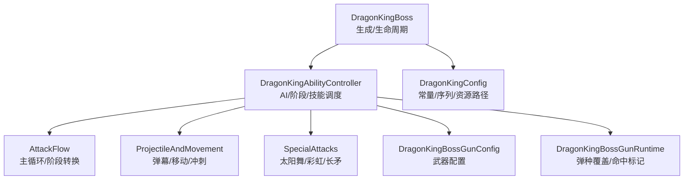
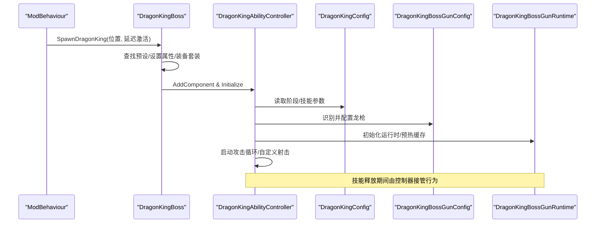
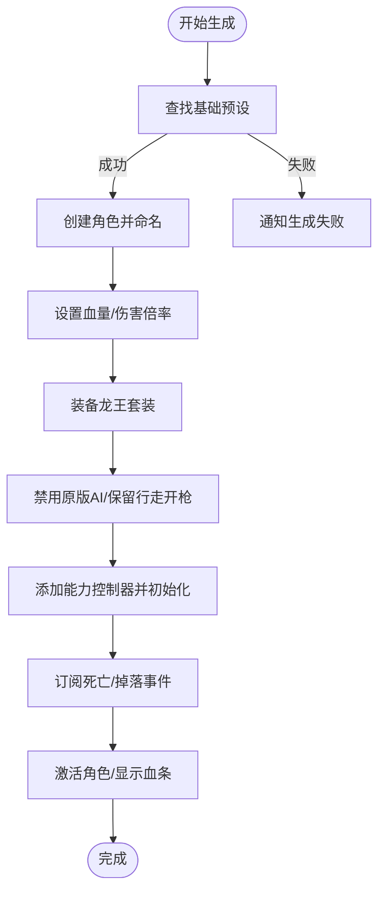
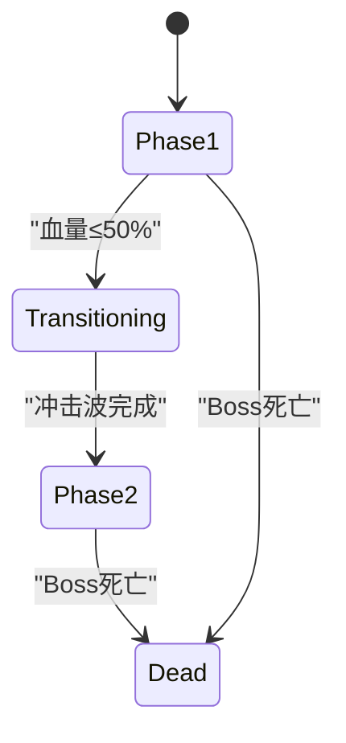
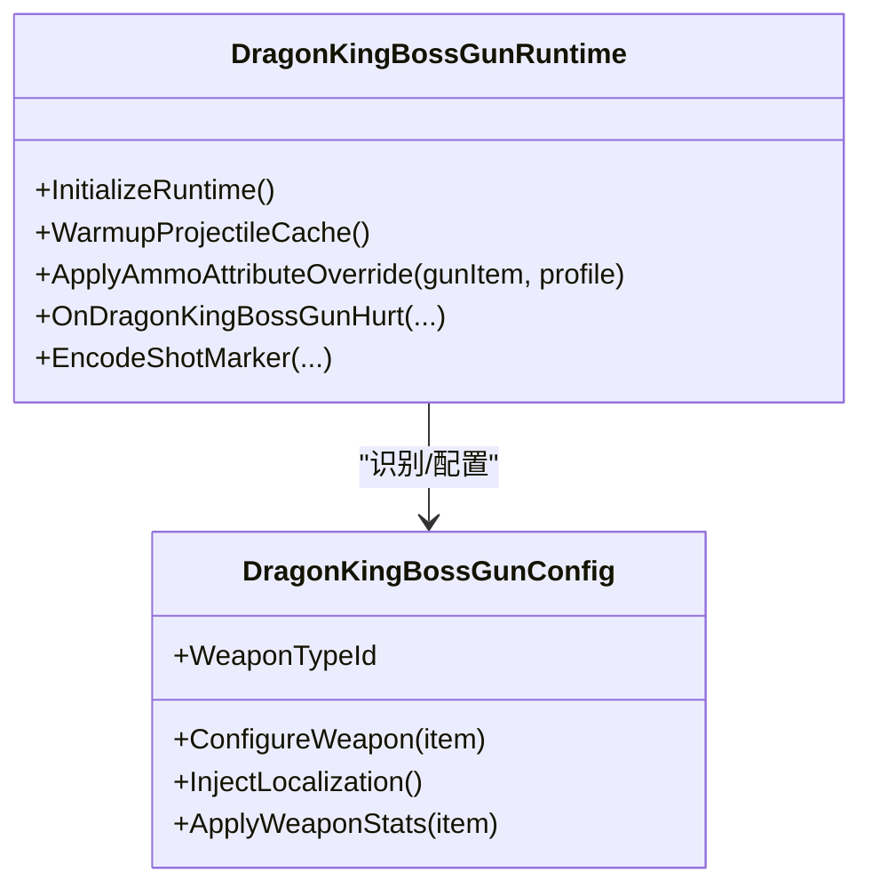
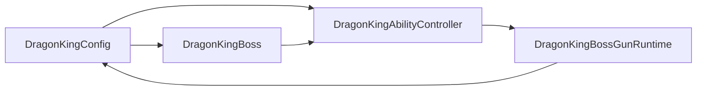

# 焚天龙皇

<cite>
**本文引用的文件**
- [DragonKingBoss.cs](file://Integration/DragonKing/DragonKingBoss.cs)
- [DragonKingConfig.cs](file://Integration/DragonKing/DragonKingConfig.cs)
- [DragonKingAbilityController.cs](file://Integration/DragonKing/DragonKingAbilityController.cs)
- [DragonKingAbilityController_AttackFlow.cs](file://Integration/DragonKing/DragonKingAbilityController_AttackFlow.cs)
- [DragonKingAbilityController_ProjectileAndMovement.cs](file://Integration/DragonKing/DragonKingAbilityController_ProjectileAndMovement.cs)
- [DragonKingAbilityController_SpecialAttacks.cs](file://Integration/DragonKing/DragonKingAbilityController_SpecialAttacks.cs)
- [DragonKingBossGunConfig.cs](file://Integration/DragonKing/Weapons/DragonKingBossGunConfig.cs)
- [DragonKingBossGunRuntime.cs](file://Integration/DragonKing/Weapons/DragonKingBossGunRuntime.cs)
</cite>

## 目录
1. [简介](#简介)
2. [项目结构](#项目结构)
3. [核心组件](#核心组件)
4. [架构总览](#架构总览)
5. [详细组件分析](#详细组件分析)
6. [依赖关系分析](#依赖关系分析)
7. [性能与优化](#性能与优化)
8. [故障排查指南](#故障排查指南)
9. [结论](#结论)
10. [附录：战斗攻略与扩展指南](#附录战斗攻略与扩展指南)

## 简介
本文件为“焚天龙皇”高阶核心 Boss 的全面技术文档。内容涵盖其高级 AI 行为、多阶段战斗系统、复杂技能组合；武器系统（焚天龙铳）的配置、弹道计算与特效渲染；高级 Boss 机制（伤害减免、阶段转换触发条件、特殊状态效果）；以及面向玩家与开发者的实战攻略与扩展指南。

## 项目结构
围绕 DragonKing 模块，代码按职责分层组织：
- 生成与生命周期：DragonKingBoss.cs
- 配置与数值：DragonKingConfig.cs
- 能力控制器与攻击序列：DragonKingAbilityController.cs 及其分文件（AttackFlow、ProjectileAndMovement、SpecialAttacks）
- 武器系统与运行时：DragonKingBossGunConfig.cs、DragonKingBossGunRuntime.cs



图表来源
- [DragonKingBoss.cs:209-371](file://Integration/DragonKing/DragonKingBoss.cs#L209-L371)
- [DragonKingAbilityController.cs:703-755](file://Integration/DragonKing/DragonKingAbilityController.cs#L703-L755)
- [DragonKingConfig.cs:569-597](file://Integration/DragonKing/DragonKingConfig.cs#L569-L597)
- [DragonKingBossGunConfig.cs:126-167](file://Integration/DragonKing/Weapons/DragonKingBossGunConfig.cs#L126-L167)
- [DragonKingBossGunRuntime.cs:95-146](file://Integration/DragonKing/Weapons/DragonKingBossGunRuntime.cs#L95-L146)

章节来源
- [DragonKingBoss.cs:209-371](file://Integration/DragonKing/DragonKingBoss.cs#L209-L371)
- [DragonKingConfig.cs:44-733](file://Integration/DragonKing/DragonKingConfig.cs#L44-L733)

## 核心组件
- 龙王生成与生命周期管理：负责预设查找、属性设置、装备、事件订阅与清理。
- 能力控制器：实现 AI 状态机、攻击序列、阶段转换、技能执行、弹幕与移动控制。
- 武器系统：焚天龙铳的运行时配置、弹种属性覆盖、命中标记叠加与清理。
- 配置中心：集中定义 Boss 基础属性、阶段阈值、技能参数、资源路径与掉落表。

章节来源
- [DragonKingBoss.cs:209-371](file://Integration/DragonKing/DragonKingBoss.cs#L209-L371)
- [DragonKingAbilityController.cs:703-755](file://Integration/DragonKing/DragonKingAbilityController.cs#L703-L755)
- [DragonKingBossGunConfig.cs:126-167](file://Integration/DragonKing/Weapons/DragonKingBossGunConfig.cs#L126-L167)
- [DragonKingBossGunRuntime.cs:95-146](file://Integration/DragonKing/Weapons/DragonKingBossGunRuntime.cs#L95-L146)
- [DragonKingConfig.cs:44-733](file://Integration/DragonKing/DragonKingConfig.cs#L44-L733)

## 架构总览
焚天龙皇采用“生成器 + 能力控制器 + 配置中心 + 武器运行时”的分层架构。生成器负责实例化与装配，能力控制器驱动 AI 与技能，配置中心提供可调参数，武器运行时处理弹种切换与命中反馈。



图表来源
- [DragonKingBoss.cs:209-371](file://Integration/DragonKing/DragonKingBoss.cs#L209-L371)
- [DragonKingAbilityController.cs:703-755](file://Integration/DragonKing/DragonKingAbilityController.cs#L703-L755)
- [DragonKingBossGunConfig.cs:126-167](file://Integration/DragonKing/Weapons/DragonKingBossGunConfig.cs#L126-L167)
- [DragonKingBossGunRuntime.cs:95-146](file://Integration/DragonKing/Weapons/DragonKingBossGunRuntime.cs#L95-L146)

## 详细组件分析

### 生成与生命周期（DragonKingBoss）
- 生成流程：查找基础预设 → 创建角色 → 设置血量/伤害倍率 → 装备套装 → 禁用原版 AI → 添加能力控制器 → 订阅死亡/掉落事件 → 播放登场音效与 BGM。
- 多实例支持：以字典维护多个龙王实例与其能力控制器，确保事件解绑与资源释放正确。
- 套装效果：火焰伤害免疫并转化为治疗，使用全局事件+活跃 Health 集合快速过滤。



图表来源
- [DragonKingBoss.cs:209-371](file://Integration/DragonKing/DragonKingBoss.cs#L209-L371)
- [DragonKingBoss.cs:414-454](file://Integration/DragonKing/DragonKingBoss.cs#L414-L454)
- [DragonKingBoss.cs:459-511](file://Integration/DragonKing/DragonKingBoss.cs#L459-L511)
- [DragonKingBoss.cs:517-551](file://Integration/DragonKing/DragonKingBoss.cs#L517-L551)

章节来源
- [DragonKingBoss.cs:209-371](file://Integration/DragonKing/DragonKingBoss.cs#L209-L371)
- [DragonKingBoss.cs:414-454](file://Integration/DragonKing/DragonKingBoss.cs#L414-L454)
- [DragonKingBoss.cs:459-511](file://Integration/DragonKing/DragonKingBoss.cs#L459-L511)
- [DragonKingBoss.cs:517-551](file://Integration/DragonKing/DragonKingBoss.cs#L517-L551)
- [DragonKingBoss.cs:706-800](file://Integration/DragonKing/DragonKingBoss.cs#L706-L800)

### 能力控制器与阶段系统（DragonKingAbilityController）
- 阶段枚举：Phase1、Phase2、Transitioning、Dead。
- 攻击循环：每轮根据当前阶段选择序列，执行对应技能，等待间隔后推进索引。
- 阶段转换：半血触发，隐藏模型→传送至玩家附近地面→播放冲击波→恢复可见与 AI→重置序列索引→进入 Phase2。
- 孩儿护我：血量降至阈值时触发无敌与召唤，阻止伤害直至结束。



图表来源
- [DragonKingAbilityController.cs:45-51](file://Integration/DragonKing/DragonKingAbilityController.cs#L45-L51)
- [DragonKingAbilityController_AttackFlow.cs:139-287](file://Integration/DragonKing/DragonKingAbilityController_AttackFlow.cs#L139-L287)

章节来源
- [DragonKingAbilityController.cs:45-51](file://Integration/DragonKing/DragonKingAbilityController.cs#L45-L51)
- [DragonKingAbilityController_AttackFlow.cs:139-287](file://Integration/DragonKing/DragonKingAbilityController_AttackFlow.cs#L139-L287)

### 攻击序列与技能实现
- 一阶段序列：棱彩弹、冲刺、太阳舞、永恒彩虹、以太长矛等组合。
- 二阶段序列：加入切屏剑阵（以太长矛2）、螺旋棱彩弹等更高频/更复杂的技能。
- 技能要点：
  - 棱彩弹：周围生成追踪弹幕，延迟后追踪玩家。
  - 棱彩弹2：螺旋发射，追踪时间较短。
  - 冲刺：蓄力→两段冲刺（二阶段第二段），残影带岩浆区域。
  - 太阳舞：传送到玩家附近，发射24方向旋转弹幕+光束伤害。
  - 永恒彩虹：星环扩散收缩，轨迹伤害。
  - 以太长矛：警告线→双向长矛贯穿。
  - 以太长矛2：切屏剑阵，多波长矛同时画出。

```mermaid
sequenceDiagram
participant Loop as "攻击循环"
participant Skill as "技能执行"
participant Move as "移动/定位"
participant FX as "特效/音效"
Loop->>Skill : ExecuteAttack(类型)
alt 棱彩弹/棱彩弹2
Skill->>Move : 暂停AI/锁定位置
Skill->>FX : 生成弹幕/播放音效
Skill->>Move : 恢复AI
else 冲刺
Skill->>FX : 蓄力粒子/倒计时光圈
Skill->>Move : 第一段冲刺/第二段冲刺(二阶段)
Skill->>FX : 残影/岩浆区域
else 太阳舞
Skill->>Move : 传送至有效位置
Skill->>FX : 预警圆圈/旋转弹幕/光束伤害
else 永恒彩虹
Skill->>FX : 星环扩散收缩/轨迹伤害
else 以太长矛/2
Skill->>FX : 警告线/双向长矛
end
```

图表来源
- [DragonKingAbilityController_AttackFlow.cs:483-526](file://Integration/DragonKing/DragonKingAbilityController_AttackFlow.cs#L483-L526)
- [DragonKingAbilityController_ProjectileAndMovement.cs:21-95](file://Integration/DragonKing/DragonKingAbilityController_ProjectileAndMovement.cs#L21-L95)
- [DragonKingAbilityController_ProjectileAndMovement.cs:234-297](file://Integration/DragonKing/DragonKingAbilityController_ProjectileAndMovement.cs#L234-L297)
- [DragonKingAbilityController_ProjectileAndMovement.cs:306-579](file://Integration/DragonKing/DragonKingAbilityController_ProjectileAndMovement.cs#L306-L579)
- [DragonKingAbilityController_SpecialAttacks.cs:19-61](file://Integration/DragonKing/DragonKingAbilityController_SpecialAttacks.cs#L19-L61)
- [DragonKingAbilityController_SpecialAttacks.cs:268-370](file://Integration/DragonKing/DragonKingAbilityController_SpecialAttacks.cs#L268-L370)
- [DragonKingAbilityController_SpecialAttacks.cs:379-452](file://Integration/DragonKing/DragonKingAbilityController_SpecialAttacks.cs#L379-L452)
- [DragonKingAbilityController_SpecialAttacks.cs:753-800](file://Integration/DragonKing/DragonKingAbilityController_SpecialAttacks.cs#L753-L800)

章节来源
- [DragonKingConfig.cs:569-597](file://Integration/DragonKing/DragonKingConfig.cs#L569-L597)
- [DragonKingAbilityController_AttackFlow.cs:483-526](file://Integration/DragonKing/DragonKingAbilityController_AttackFlow.cs#L483-L526)
- [DragonKingAbilityController_ProjectileAndMovement.cs:21-95](file://Integration/DragonKing/DragonKingAbilityController_ProjectileAndMovement.cs#L21-L95)
- [DragonKingAbilityController_ProjectileAndMovement.cs:234-297](file://Integration/DragonKing/DragonKingAbilityController_ProjectileAndMovement.cs#L234-L297)
- [DragonKingAbilityController_ProjectileAndMovement.cs:306-579](file://Integration/DragonKing/DragonKingAbilityController_ProjectileAndMovement.cs#L306-L579)
- [DragonKingAbilityController_SpecialAttacks.cs:19-61](file://Integration/DragonKing/DragonKingAbilityController_SpecialAttacks.cs#L19-L61)
- [DragonKingAbilityController_SpecialAttacks.cs:268-370](file://Integration/DragonKing/DragonKingAbilityController_SpecialAttacks.cs#L268-L370)
- [DragonKingAbilityController_SpecialAttacks.cs:379-452](file://Integration/DragonKing/DragonKingAbilityController_SpecialAttacks.cs#L379-L452)
- [DragonKingAbilityController_SpecialAttacks.cs:753-800](file://Integration/DragonKing/DragonKingAbilityController_SpecialAttacks.cs#L753-L800)

### 武器系统：焚天龙铳（DragonKingBossGun）
- 武器配置：注入本地化、补全 GunSetting、应用默认统计量与标签。
- 弹种覆盖：根据当前弹药类型动态覆写射速、伤害、弹匣、换弹时间、射程与后坐力，仅修改运行时 BaseValue。
- 命中标记：通过 buffChance 编码 shotId/profile/hitStage，在受击事件中解码并叠加“龙焰印记”，与断界戟联动引爆。
- 预加载：异步预热 Boss_Red 子弹基底，绑定到已加载龙枪，减少首帧卡顿。



图表来源
- [DragonKingBossGunConfig.cs:126-167](file://Integration/DragonKing/Weapons/DragonKingBossGunConfig.cs#L126-L167)
- [DragonKingBossGunRuntime.cs:95-146](file://Integration/DragonKing/Weapons/DragonKingBossGunRuntime.cs#L95-L146)
- [DragonKingBossGunRuntime.cs:343-404](file://Integration/DragonKing/Weapons/DragonKingBossGunRuntime.cs#L343-L404)
- [DragonKingBossGunRuntime.cs:520-553](file://Integration/DragonKing/Weapons/DragonKingBossGunRuntime.cs#L520-L553)
- [DragonKingBossGunRuntime.cs:564-640](file://Integration/DragonKing/Weapons/DragonKingBossGunRuntime.cs#L564-L640)

章节来源
- [DragonKingBossGunConfig.cs:126-167](file://Integration/DragonKing/Weapons/DragonKingBossGunConfig.cs#L126-L167)
- [DragonKingBossGunRuntime.cs:95-146](file://Integration/DragonKing/Weapons/DragonKingBossGunRuntime.cs#L95-L146)
- [DragonKingBossGunRuntime.cs:343-404](file://Integration/DragonKing/Weapons/DragonKingBossGunRuntime.cs#L343-L404)
- [DragonKingBossGunRuntime.cs:520-553](file://Integration/DragonKing/Weapons/DragonKingBossGunRuntime.cs#L520-L553)
- [DragonKingBossGunRuntime.cs:564-640](file://Integration/DragonKing/Weapons/DragonKingBossGunRuntime.cs#L564-L640)

### 高级 Boss 机制
- 伤害减免/无敌：阶段转换中不可选中；孩儿护我阶段完全无敌并回血。
- 阶段转换触发：基于当前血量百分比阈值；转换过程包含隐藏、传送、冲击波、恢复可见与 AI。
- 特殊状态：
  - 火焰免疫：龙王套装对火焰伤害免疫并转化为治疗。
  - 龙焰印记：龙枪命中叠加印记，与断界戟联动引爆。
  - 模式 E 兼容：无仇恨目标时跳过攻击/射击，避免死锁。

章节来源
- [DragonKingAbilityController_AttackFlow.cs:419-443](file://Integration/DragonKing/DragonKingAbilityController_AttackFlow.cs#L419-L443)
- [DragonKingAbilityController_AttackFlow.cs:156-287](file://Integration/DragonKing/DragonKingAbilityController_AttackFlow.cs#L156-L287)
- [DragonKingBoss.cs:706-800](file://Integration/DragonKing/DragonKingBoss.cs#L706-L800)
- [DragonKingBossGunRuntime.cs:343-404](file://Integration/DragonKing/Weapons/DragonKingBossGunRuntime.cs#L343-L404)

## 依赖关系分析
- 生成器依赖配置中心获取名称、数值与资源路径。
- 能力控制器依赖配置中心获取阶段阈值、技能参数与序列。
- 武器运行时依赖配置中心识别武器 ID，并在受击事件中处理标记叠加。
- 能力控制器与武器运行时通过共享常量与事件协作，保证技能与武器行为一致。



图表来源
- [DragonKingConfig.cs:44-733](file://Integration/DragonKing/DragonKingConfig.cs#L44-L733)
- [DragonKingBoss.cs:209-371](file://Integration/DragonKing/DragonKingBoss.cs#L209-L371)
- [DragonKingAbilityController.cs:703-755](file://Integration/DragonKing/DragonKingAbilityController.cs#L703-L755)
- [DragonKingBossGunRuntime.cs:95-146](file://Integration/DragonKing/Weapons/DragonKingBossGunRuntime.cs#L95-L146)

章节来源
- [DragonKingConfig.cs:44-733](file://Integration/DragonKing/DragonKingConfig.cs#L44-L733)
- [DragonKingBoss.cs:209-371](file://Integration/DragonKing/DragonKingBoss.cs#L209-L371)
- [DragonKingAbilityController.cs:703-755](file://Integration/DragonKing/DragonKingAbilityController.cs#L703-L755)
- [DragonKingBossGunRuntime.cs:95-146](file://Integration/DragonKing/Weapons/DragonKingBossGunRuntime.cs#L95-L146)

## 性能与优化
- 对象池与预分配：大量使用预分配 List/Stack 与对象池（警告线、光圈、蓄力粒子、倒计时环），降低 GC 压力。
- 反射缓存：AudioManager.Post、hitLayers 字段等反射结果缓存，避免热路径重复反射。
- 数学优化：使用 sqrMagnitude 替代开方，批量更新渐变与材质，减少每帧分配。
- 场景级缓存：清理时保留必要状态（如弹种基准），避免频繁重建。

章节来源
- [DragonKingAbilityController.cs:379-476](file://Integration/DragonKing/DragonKingAbilityController.cs#L379-L476)
- [DragonKingAbilityController.cs:560-590](file://Integration/DragonKing/DragonKingAbilityController.cs#L560-L590)
- [DragonKingAbilityController_SpecialAttacks.cs:147-215](file://Integration/DragonKing/DragonKingAbilityController_SpecialAttacks.cs#L147-L215)
- [DragonKingAbilityController_ProjectileAndMovement.cs:676-758](file://Integration/DragonKing/DragonKingAbilityController_ProjectileAndMovement.cs#L676-L758)

## 故障排查指南
- 生成失败：检查基础预设是否找到；若未找到则调用失败通知。
- 阶段转换异常：确认 Boss 可见性、碰撞检测器启用/禁用顺序；检查传送位置有效性。
- 武器运行时异常：确认 Health.OnHurt 订阅是否正确；检查 buffChance 编码/解码逻辑；验证弹种 profile 解析。
- 音效问题：缓存 AudioManager.Post 方法失败时降级处理；节流避免同帧堆叠。

章节来源
- [DragonKingBoss.cs:209-246](file://Integration/DragonKing/DragonKingBoss.cs#L209-L246)
- [DragonKingAbilityController_AttackFlow.cs:156-287](file://Integration/DragonKing/DragonKingAbilityController_AttackFlow.cs#L156-L287)
- [DragonKingBossGunRuntime.cs:343-404](file://Integration/DragonKing/Weapons/DragonKingBossGunRuntime.cs#L343-L404)
- [DragonKingAbilityController_SpecialAttacks.cs:147-215](file://Integration/DragonKing/DragonKingAbilityController_SpecialAttacks.cs#L147-L215)

## 结论
焚天龙皇通过清晰的分层架构与高性能实现，提供了丰富且具挑战性的多阶段战斗体验。其武器系统与技能体系相互协同，既保证了视觉表现力，也兼顾了运行效率。开发者可基于现有框架便捷扩展新武器与难度平衡。

## 附录：战斗攻略与扩展指南

### 各阶段应对策略
- 一阶段
  - 棱彩弹：注意弹幕延迟追踪，保持距离并侧向走位。
  - 冲刺：留意蓄力粒子与倒计时光圈，远离落点；二段冲刺仅在二阶段出现。
  - 太阳舞：预警圆圈出现后迅速离开中心，避开旋转弹幕与光束。
  - 永恒彩虹：跟随星环扩散节奏向外移动，避免被轨迹覆盖。
  - 以太长矛：观察警告线方向，沿垂直方向躲避。
- 二阶段
  - 切屏剑阵：多波长矛同时画出，优先寻找安全间隙。
  - 螺旋棱彩弹：高频发射，利用掩体或快速位移规避。
  - 整体节奏更快，建议保持机动性与资源管理。

### 输出最大化方法
- 利用技能空窗期进行爆发输出，避免在弹幕密集区停留。
- 针对太阳舞与彩虹阶段，优先打断或拉开距离后再输出。
- 合理使用道具与增益，提高生存与输出效率。

### 开发者扩展指南
- 新增武器
  - 在 DragonKingBossGunConfig 中注册新弹种 profile 与本地化。
  - 在 DragonKingBossGunRuntime 中实现弹种属性覆盖与命中标记规则。
  - 预热所需子弹基底，确保首帧流畅。
- 难度平衡调整
  - 调整 DragonKingConfig 中的阶段阈值、技能参数（数量、速度、持续时间）。
  - 修改攻击序列与间隔，影响整体节奏。
  - 调整掉落概率与装备配置，影响奖励曲线。

章节来源
- [DragonKingConfig.cs:71-399](file://Integration/DragonKing/DragonKingConfig.cs#L71-L399)
- [DragonKingBossGunConfig.cs:126-167](file://Integration/DragonKing/Weapons/DragonKingBossGunConfig.cs#L126-L167)
- [DragonKingBossGunRuntime.cs:564-640](file://Integration/DragonKing/Weapons/DragonKingBossGunRuntime.cs#L564-L640)