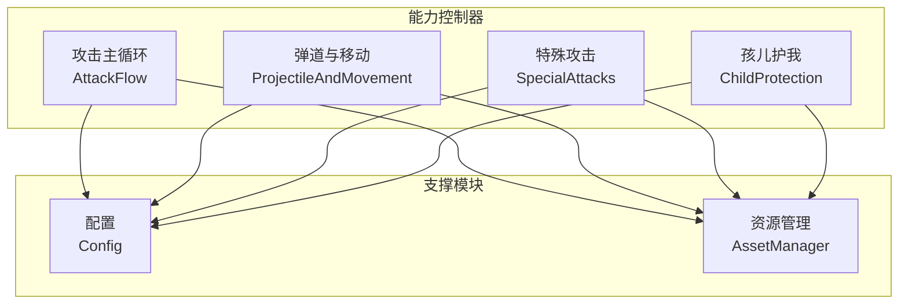
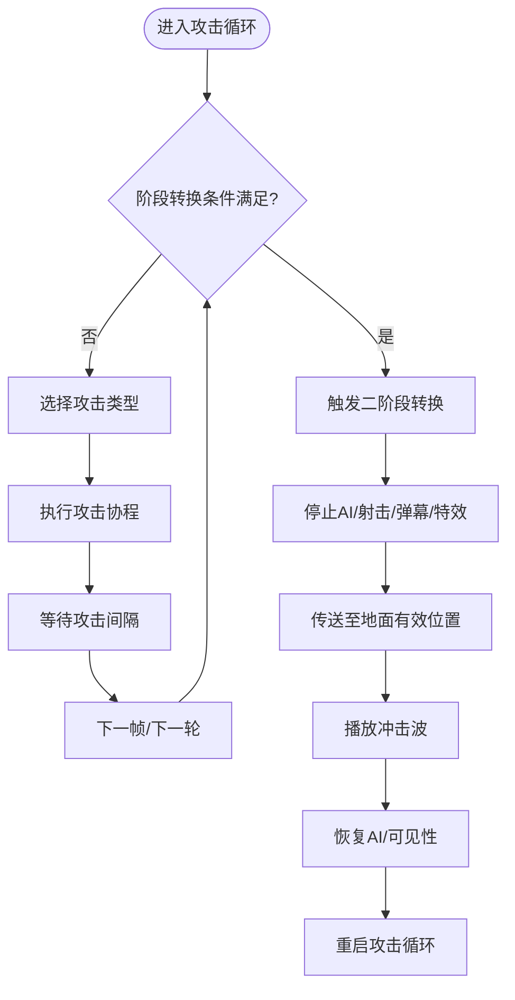
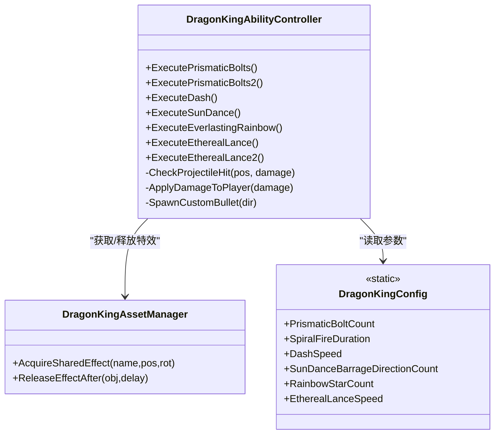
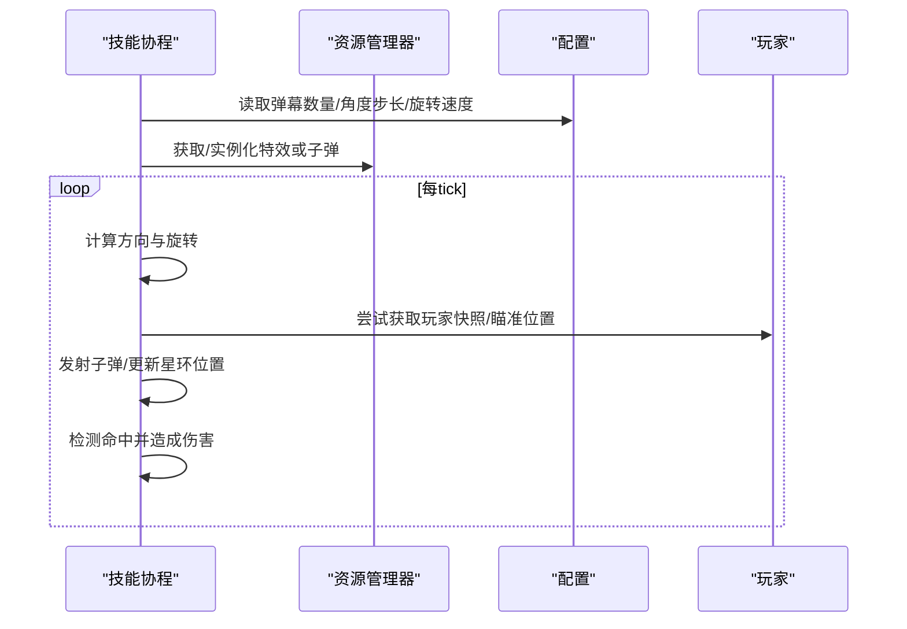
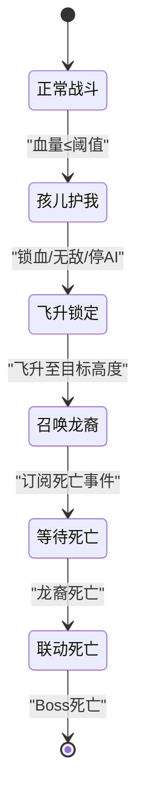
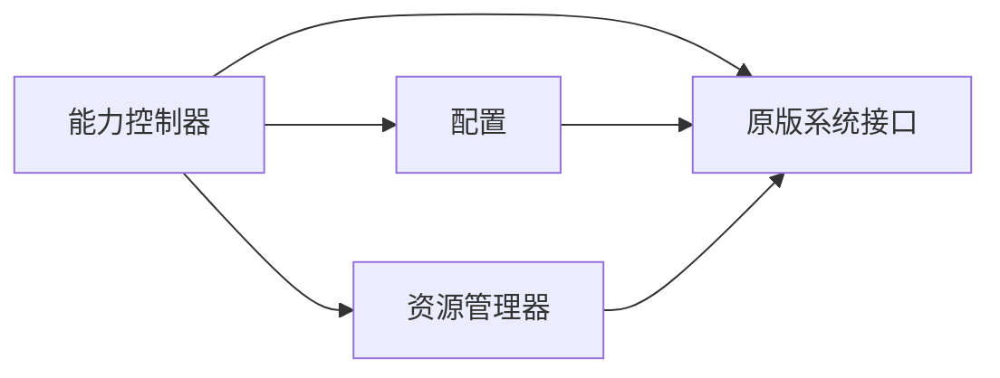

# 能力控制系统

<cite>
**本文引用的文件**
- [DragonKingAbilityController_AttackFlow.cs](file://Integration/DragonKing/DragonKingAbilityController_AttackFlow.cs)
- [DragonKingAbilityController_ProjectileAndMovement.cs](file://Integration/DragonKing/DragonKingAbilityController_ProjectileAndMovement.cs)
- [DragonKingAbilityController_SpecialAttacks.cs](file://Integration/DragonKing/DragonKingAbilityController_SpecialAttacks.cs)
- [DragonKingAbilityController_ChildProtection.cs](file://Integration/DragonKing/DragonKingAbilityController_ChildProtection.cs)
- [DragonKingConfig.cs](file://Integration/DragonKing/DragonKingConfig.cs)
- [DragonKingAssetManager.cs](file://Integration/DragonKing/DragonKingAssetManager.cs)
</cite>

## 目录
1. [简介](#简介)
2. [项目结构](#项目结构)
3. [核心组件](#核心组件)
4. [架构总览](#架构总览)
5. [详细组件分析](#详细组件分析)
6. [依赖关系分析](#依赖关系分析)
7. [性能考量](#性能考量)
8. [故障排查指南](#故障排查指南)
9. [结论](#结论)
10. [附录：扩展与调优指南](#附录：扩展与调优指南)

## 简介
本技术文档面向“焚天龙皇”Boss的能力控制系统，围绕 DragonKingAbilityController 的核心架构展开，覆盖攻击流控制、弹道计算、移动系统、特殊攻击实现、状态机管理、技能调度器、伤害计算与特效触发机制。同时深入解析高级Boss机制（阶段转换、伤害减免、特殊状态效果、AI行为树），并提供战斗机制说明（普通攻击、范围攻击、追踪弹道、地形互动）以及开发者扩展指南（新技能添加、难度平衡调整、性能优化建议）。

## 项目结构
- 控制器拆分：能力控制器按职责拆分为多个 partial 类文件，分别负责攻击主循环与阶段转换、弹道与移动、特殊攻击、孩儿护我等子系统。
- 配置集中：所有可调参数集中在配置类中，便于平衡与调试。
- 资源管理：统一的资源管理器负责 AssetBundle 加载、预制体缓存、对象池预热与回收。



**图表来源**
- [DragonKingAbilityController_AttackFlow.cs:15-120](file://Integration/DragonKing/DragonKingAbilityController_AttackFlow.cs#L15-L120)
- [DragonKingAbilityController_ProjectileAndMovement.cs:15-95](file://Integration/DragonKing/DragonKingAbilityController_ProjectileAndMovement.cs#L15-L95)
- [DragonKingAbilityController_SpecialAttacks.cs:15-61](file://Integration/DragonKing/DragonKingAbilityController_SpecialAttacks.cs#L15-L61)
- [DragonKingAbilityController_ChildProtection.cs:25-134](file://Integration/DragonKing/DragonKingAbilityController_ChildProtection.cs#L25-L134)
- [DragonKingConfig.cs:13-734](file://Integration/DragonKing/DragonKingConfig.cs#L13-L734)
- [DragonKingAssetManager.cs:20-87](file://Integration/DragonKing/DragonKingAssetManager.cs#L20-L87)

**章节来源**
- [DragonKingAbilityController_AttackFlow.cs:15-120](file://Integration/DragonKing/DragonKingAbilityController_AttackFlow.cs#L15-L120)
- [DragonKingConfig.cs:13-734](file://Integration/DragonKing/DragonKingConfig.cs#L13-L734)
- [DragonKingAssetManager.cs:20-87](file://Integration/DragonKing/DragonKingAssetManager.cs#L20-L87)

## 核心组件
- 攻击主循环与阶段转换：维护攻击序列、阶段切换、无敌窗口、自定义射击、玩家目标管理与Mode E兼容。
- 弹道与移动：棱彩弹（追踪/螺旋）、冲刺（蓄力-两段冲刺-残影岩浆区）、太阳舞（旋转弹幕）、永恒彩虹（星环扩散收缩）、以太长矛（横向贯穿/切屏）。
- 特殊攻击：太阳舞弹幕发射循环、预警圈、光束伤害触发、长矛双向发射与命中检测。
- 孩儿护我：锁血无敌、飞升高度锁定、召唤龙裔遗族、联动死亡、状态清理。
- 配置：全部数值、序列、音效路径、掉落物ID、位置偏移等集中管理。
- 资源管理：AssetBundle加载、预制体缓存、共享对象池预热、动态材质清理、后备特效。

**章节来源**
- [DragonKingAbilityController_AttackFlow.cs:15-120](file://Integration/DragonKing/DragonKingAbilityController_AttackFlow.cs#L15-L120)
- [DragonKingAbilityController_ProjectileAndMovement.cs:15-95](file://Integration/DragonKing/DragonKingAbilityController_ProjectileAndMovement.cs#L15-L95)
- [DragonKingAbilityController_SpecialAttacks.cs:15-61](file://Integration/DragonKing/DragonKingAbilityController_SpecialAttacks.cs#L15-L61)
- [DragonKingAbilityController_ChildProtection.cs:25-134](file://Integration/DragonKing/DragonKingAbilityController_ChildProtection.cs#L25-L134)
- [DragonKingConfig.cs:13-734](file://Integration/DragonKing/DragonKingConfig.cs#L13-L734)
- [DragonKingAssetManager.cs:20-87](file://Integration/DragonKing/DragonKingAssetManager.cs#L20-L87)

## 架构总览
能力控制器采用“状态机 + 协程驱动”的架构：
- 状态机：当前阶段（Phase1/Phase2/Transitioning/Dead）、孩儿护我标志、是否正在执行攻击协程。
- 调度器：攻击主循环按序列选择攻击类型，调用 ExecuteAttack 分发到具体技能协程。
- 子系统：弹道系统、移动系统、特效系统、伤害系统通过配置与资源管理器解耦。

```mermaid
sequenceDiagram
participant Loop as "攻击主循环"
participant Seq as "攻击序列"
participant Exec as "ExecuteAttack"
participant Skill as "技能协程"
participant Res as "资源管理器"
participant Cfg as "配置"
Loop->>Seq : 读取当前攻击类型
Loop->>Exec : ExecuteAttack(attackType)
Exec->>Skill : 启动对应技能协程
Skill->>Res : 获取/实例化特效或子弹
Skill->>Cfg : 读取参数速度/伤害/半径等
Skill-->>Loop : 完成并返回
Loop->>Loop : 推进序列索引/等待间隔
```

**图表来源**
- [DragonKingAbilityController_AttackFlow.cs:85-117](file://Integration/DragonKing/DragonKingAbilityController_AttackFlow.cs#L85-L117)
- [DragonKingAbilityController_AttackFlow.cs:483-526](file://Integration/DragonKing/DragonKingAbilityController_AttackFlow.cs#L483-L526)
- [DragonKingAssetManager.cs:723-791](file://Integration/DragonKing/DragonKingAssetManager.cs#L723-L791)
- [DragonKingConfig.cs:564-597](file://Integration/DragonKing/DragonKingConfig.cs#L564-L597)

## 详细组件分析

### 攻击主循环与阶段转换
- 攻击主循环：每轮检查阶段、目标有效性、玩家存活；根据Debug模式或序列选择攻击；执行后推进索引并按阶段间隔等待。
- 阶段转换：血量阈值触发，播放音效，禁用Boss与AI，停止当前攻击与弹幕，清理特效，传送至地面有效位置，播放冲击波，恢复AI并重启攻击循环。
- 伤害回调：在孩儿护我与阶段转换期间进行无敌保护，并在受伤时立即检查阶段转换。



**图表来源**
- [DragonKingAbilityController_AttackFlow.cs:39-117](file://Integration/DragonKing/DragonKingAbilityController_AttackFlow.cs#L39-L117)
- [DragonKingAbilityController_AttackFlow.cs:139-287](file://Integration/DragonKing/DragonKingAbilityController_AttackFlow.cs#L139-L287)
- [DragonKingAbilityController_AttackFlow.cs:422-443](file://Integration/DragonKing/DragonKingAbilityController_AttackFlow.cs#L422-L443)

**章节来源**
- [DragonKingAbilityController_AttackFlow.cs:39-117](file://Integration/DragonKing/DragonKingAbilityController_AttackFlow.cs#L39-L117)
- [DragonKingAbilityController_AttackFlow.cs:139-287](file://Integration/DragonKing/DragonKingAbilityController_AttackFlow.cs#L139-L287)
- [DragonKingAbilityController_AttackFlow.cs:422-443](file://Integration/DragonKing/DragonKingAbilityController_AttackFlow.cs#L422-L443)

### 弹道与移动系统
- 棱彩弹：周围生成多枚弹幕，延迟后追踪玩家；使用sqrMagnitude优化命中检测；支持螺旋发射变体。
- 冲刺：蓄力阶段显示倒计时光圈与粒子聚拢；第一段直接移动到锁定目标；第二段在二阶段额外短冲刺；移动过程中生成残影并附带岩浆伤害区域。
- 太阳舞：传送到玩家附近，收枪并停止AI，发射旋转弹幕；预警圈提示；伤害由触发器调用统一方法。
- 永恒彩虹：星环扩散再收缩，持续对轨迹造成伤害。
- 以太长矛：横向贯穿（警告线→双向长矛）与切屏剑阵（多波长矛从不同方向切过屏幕）。



**图表来源**
- [DragonKingAbilityController_ProjectileAndMovement.cs:15-95](file://Integration/DragonKing/DragonKingAbilityController_ProjectileAndMovement.cs#L15-L95)
- [DragonKingAbilityController_ProjectileAndMovement.cs:229-297](file://Integration/DragonKing/DragonKingAbilityController_ProjectileAndMovement.cs#L229-L297)
- [DragonKingAbilityController_ProjectileAndMovement.cs:300-579](file://Integration/DragonKing/DragonKingAbilityController_ProjectileAndMovement.cs#L300-L579)
- [DragonKingAbilityController_SpecialAttacks.cs:15-61](file://Integration/DragonKing/DragonKingAbilityController_SpecialAttacks.cs#L15-L61)
- [DragonKingAbilityController_SpecialAttacks.cs:262-370](file://Integration/DragonKing/DragonKingAbilityController_SpecialAttacks.cs#L262-L370)
- [DragonKingAbilityController_SpecialAttacks.cs:372-452](file://Integration/DragonKing/DragonKingAbilityController_SpecialAttacks.cs#L372-L452)
- [DragonKingConfig.cs:93-333](file://Integration/DragonKing/DragonKingConfig.cs#L93-L333)
- [DragonKingAssetManager.cs:723-791](file://Integration/DragonKing/DragonKingAssetManager.cs#L723-L791)

**章节来源**
- [DragonKingAbilityController_ProjectileAndMovement.cs:15-95](file://Integration/DragonKing/DragonKingAbilityController_ProjectileAndMovement.cs#L15-L95)
- [DragonKingAbilityController_ProjectileAndMovement.cs:229-297](file://Integration/DragonKing/DragonKingAbilityController_ProjectileAndMovement.cs#L229-L297)
- [DragonKingAbilityController_ProjectileAndMovement.cs:300-579](file://Integration/DragonKing/DragonKingAbilityController_ProjectileAndMovement.cs#L300-L579)
- [DragonKingAbilityController_SpecialAttacks.cs:15-61](file://Integration/DragonKing/DragonKingAbilityController_SpecialAttacks.cs#L15-L61)
- [DragonKingAbilityController_SpecialAttacks.cs:262-370](file://Integration/DragonKing/DragonKingAbilityController_SpecialAttacks.cs#L262-L370)
- [DragonKingAbilityController_SpecialAttacks.cs:372-452](file://Integration/DragonKing/DragonKingAbilityController_SpecialAttacks.cs#L372-L452)
- [DragonKingConfig.cs:93-333](file://Integration/DragonKing/DragonKingConfig.cs#L93-L333)
- [DragonKingAssetManager.cs:723-791](file://Integration/DragonKing/DragonKingAssetManager.cs#L723-L791)

### 特殊攻击实现（太阳舞、永恒彩虹、以太长矛）
- 太阳舞：旋转弹幕发射循环，初始方向指向玩家，每tick整体旋转；子弹使用原武器速度与缩放；伤害通过触发器统一处理。
- 永恒彩虹：星环扩散与收缩，实时跟随Boss中心点，轨迹伤害检测复用通用方法。
- 以太长矛：先绘制警告线（可旋转），随后从两端发射长矛向中间汇聚；命中检测结合射线与包围盒，避免误伤。



**图表来源**
- [DragonKingAbilityController_SpecialAttacks.cs:15-61](file://Integration/DragonKing/DragonKingAbilityController_SpecialAttacks.cs#L15-L61)
- [DragonKingAbilityController_SpecialAttacks.cs:262-370](file://Integration/DragonKing/DragonKingAbilityController_SpecialAttacks.cs#L262-L370)
- [DragonKingAbilityController_SpecialAttacks.cs:372-452](file://Integration/DragonKing/DragonKingAbilityController_SpecialAttacks.cs#L372-L452)
- [DragonKingAssetManager.cs:723-791](file://Integration/DragonKing/DragonKingAssetManager.cs#L723-L791)
- [DragonKingConfig.cs:211-333](file://Integration/DragonKing/DragonKingConfig.cs#L211-L333)

**章节来源**
- [DragonKingAbilityController_SpecialAttacks.cs:15-61](file://Integration/DragonKing/DragonKingAbilityController_SpecialAttacks.cs#L15-L61)
- [DragonKingAbilityController_SpecialAttacks.cs:262-370](file://Integration/DragonKing/DragonKingAbilityController_SpecialAttacks.cs#L262-L370)
- [DragonKingAbilityController_SpecialAttacks.cs:372-452](file://Integration/DragonKing/DragonKingAbilityController_SpecialAttacks.cs#L372-L452)

### 孩儿护我机制
- 触发条件：血量降至阈值时触发，锁血并设置无敌。
- 流程：禁用角色与AI、停止所有攻击与射击、暂停碰撞检测、显示对话气泡、飞升至指定高度、锁定Y坐标、召唤龙裔遗族、订阅死亡事件。
- 联动死亡：龙裔死亡后移除无敌、销毁飞行平台、回传起飞前位置、设置血量为0触发死亡。



**图表来源**
- [DragonKingAbilityController_ChildProtection.cs:25-134](file://Integration/DragonKing/DragonKingAbilityController_ChildProtection.cs#L25-L134)
- [DragonKingAbilityController_ChildProtection.cs:170-236](file://Integration/DragonKing/DragonKingAbilityController_ChildProtection.cs#L170-L236)
- [DragonKingAbilityController_ChildProtection.cs:338-390](file://Integration/DragonKing/DragonKingAbilityController_ChildProtection.cs#L338-L390)
- [DragonKingAbilityController_ChildProtection.cs:597-637](file://Integration/DragonKing/DragonKingAbilityController_ChildProtection.cs#L597-L637)

**章节来源**
- [DragonKingAbilityController_ChildProtection.cs:25-134](file://Integration/DragonKing/DragonKingAbilityController_ChildProtection.cs#L25-L134)
- [DragonKingAbilityController_ChildProtection.cs:170-236](file://Integration/DragonKing/DragonKingAbilityController_ChildProtection.cs#L170-L236)
- [DragonKingAbilityController_ChildProtection.cs:338-390](file://Integration/DragonKing/DragonKingAbilityController_ChildProtection.cs#L338-L390)
- [DragonKingAbilityController_ChildProtection.cs:597-637](file://Integration/DragonKing/DragonKingAbilityController_ChildProtection.cs#L597-L637)

### 伤害计算与特效触发
- 伤害计算：统一通过 ApplyDamageToPlayer 构造 DamageInfo，设置伤害点与元素因子，调用 Health.Hurt；Mode E下玩家死亡时清空仇恨目标。
- 特效触发：通过资源管理器获取/实例化特效，支持对象池与延时回收；无预制体时使用后备视觉效果；自动播放粒子系统与光源。

**章节来源**
- [DragonKingAbilityController_ProjectileAndMovement.cs:131-177](file://Integration/DragonKing/DragonKingAbilityController_ProjectileAndMovement.cs#L131-L177)
- [DragonKingAbilityController_SpecialAttacks.cs:236-259](file://Integration/DragonKing/DragonKingAbilityController_SpecialAttacks.cs#L236-L259)
- [DragonKingAssetManager.cs:322-415](file://Integration/DragonKing/DragonKingAssetManager.cs#L322-L415)
- [DragonKingAssetManager.cs:723-791](file://Integration/DragonKing/DragonKingAssetManager.cs#L723-L791)

## 依赖关系分析
- 控制器依赖配置：所有技能参数、序列、音效路径、掉落物ID均从配置读取，便于平衡与调试。
- 控制器依赖资源管理器：特效与子弹的获取/释放统一由资源管理器管理，确保对象池与内存安全。
- 控制器与原版系统集成：通过 LevelManager.BulletPool、Health.Hurt、DialogueBubblesManager 等接口与游戏系统交互。



**图表来源**
- [DragonKingAbilityController_AttackFlow.cs:483-526](file://Integration/DragonKing/DragonKingAbilityController_AttackFlow.cs#L483-L526)
- [DragonKingConfig.cs:13-734](file://Integration/DragonKing/DragonKingConfig.cs#L13-L734)
- [DragonKingAssetManager.cs:723-791](file://Integration/DragonKing/DragonKingAssetManager.cs#L723-L791)

**章节来源**
- [DragonKingAbilityController_AttackFlow.cs:483-526](file://Integration/DragonKing/DragonKingAbilityController_AttackFlow.cs#L483-L526)
- [DragonKingConfig.cs:13-734](file://Integration/DragonKing/DragonKingConfig.cs#L13-L734)
- [DragonKingAssetManager.cs:723-791](file://Integration/DragonKing/DragonKingAssetManager.cs#L723-L791)

## 性能考量
- 命中检测优化：广泛使用 sqrMagnitude 避免开方运算，减少每帧开销。
- 对象池与预热：资源管理器为高频特效（棱彩弹、彩虹星、长矛、残影等）建立对象池并预热，降低首次实例化成本。
- 协程与WaitForSeconds缓存：攻击间隔与技能等待使用缓存对象，避免频繁分配GC。
- 音效节流：武器射击音效与弹幕音效采用时间间隔节流，防止过多音频叠加。
- 物理检测优化：使用 NonAlloc 版本进行碰撞检测，避免每帧分配Collider数组。

[本节提供通用指导，不直接分析具体文件]

## 故障排查指南
- 阶段转换异常：检查血量阈值、无敌状态、AI停止与恢复逻辑；确认传送位置有效性（地面检测与障碍物校验）。
- 弹幕未命中：核对命中半径、目标位置快照、元素因子设置；确认子弹速度与生命周期配置。
- 孩儿护我卡死：确认锁血、无敌、移动系统禁用与恢复；检查龙裔死亡事件订阅与联动死亡触发。
- 资源缺失：查看AssetBundle加载日志与后备特效创建；确认预制体名称与路径一致。

**章节来源**
- [DragonKingAbilityController_AttackFlow.cs:139-287](file://Integration/DragonKing/DragonKingAbilityController_AttackFlow.cs#L139-L287)
- [DragonKingAbilityController_ProjectileAndMovement.cs:97-129](file://Integration/DragonKing/DragonKingAbilityController_ProjectileAndMovement.cs#L97-L129)
- [DragonKingAbilityController_ChildProtection.cs:597-637](file://Integration/DragonKing/DragonKingAbilityController_ChildProtection.cs#L597-L637)
- [DragonKingAssetManager.cs:110-154](file://Integration/DragonKing/DragonKingAssetManager.cs#L110-L154)

## 结论
焚天龙皇的能力控制系统以清晰的状态机与协程驱动为核心，将攻击序列、弹道计算、移动系统与特效触发解耦于配置与资源管理器之下。通过对象池、热路径优化与Mode E兼容设计，系统在复杂战斗中保持高稳定性与良好性能。孩儿护我机制提供了独特的Boss体验，阶段转换与伤害减免增强了战斗节奏感。

[本节总结性内容，不直接分析具体文件]

## 附录：扩展与调优指南
- 新增技能
  - 在攻击枚举中添加新类型，并在攻击序列中插入。
  - 在 ExecuteAttack 中增加分支，实现对应协程。
  - 在配置中定义参数（伤害、速度、半径、持续时间等）。
  - 使用资源管理器获取/释放特效，必要时加入对象池预热。
- 难度平衡
  - 调整阶段阈值、攻击间隔、弹幕数量与伤害。
  - 修改自定义射击强度（子弹数量、偏移范围、暴击率）。
  - 调整孩儿护我触发阈值与龙裔属性倍率。
- 性能优化
  - 复用 WaitForSeconds 与 List 容量预分配。
  - 使用 NonAlloc 物理检测与 sqrMagnitude 距离判断。
  - 音效节流与对象池上限控制，避免过度实例化。

**章节来源**
- [DragonKingConfig.cs:13-734](file://Integration/DragonKing/DragonKingConfig.cs#L13-L734)
- [DragonKingAbilityController_AttackFlow.cs:85-117](file://Integration/DragonKing/DragonKingAbilityController_AttackFlow.cs#L85-L117)
- [DragonKingAbilityController_AttackFlow.cs:483-526](file://Integration/DragonKing/DragonKingAbilityController_AttackFlow.cs#L483-L526)
- [DragonKingAssetManager.cs:198-226](file://Integration/DragonKing/DragonKingAssetManager.cs#L198-L226)