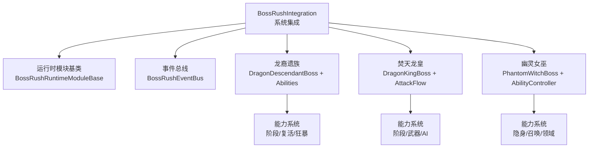
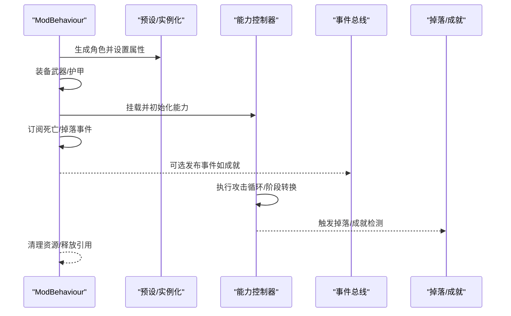
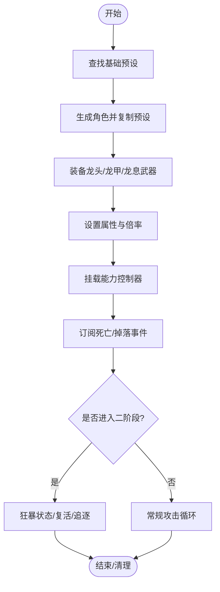
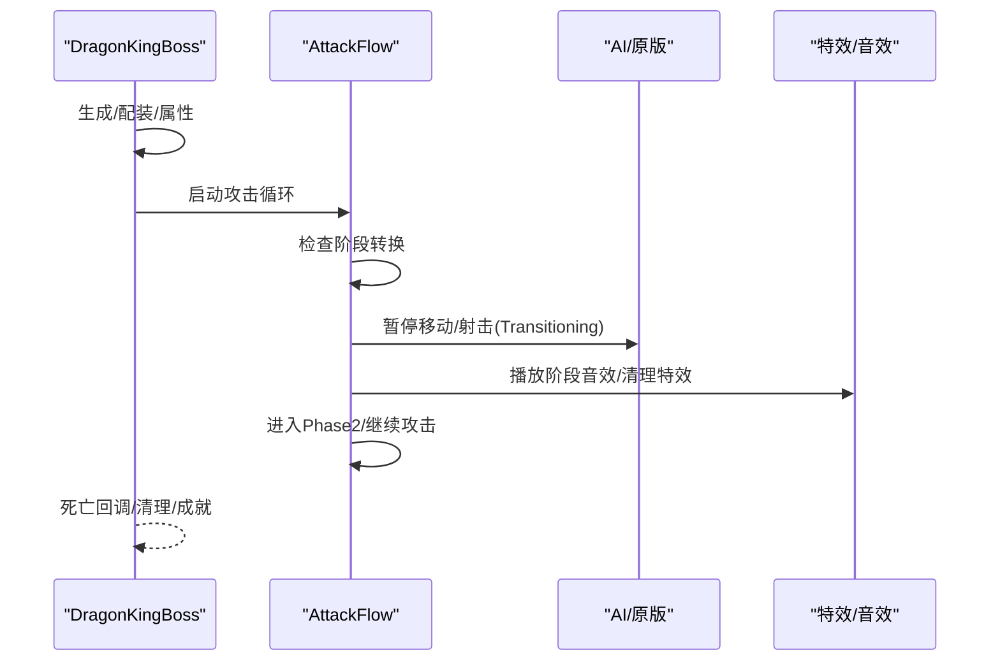
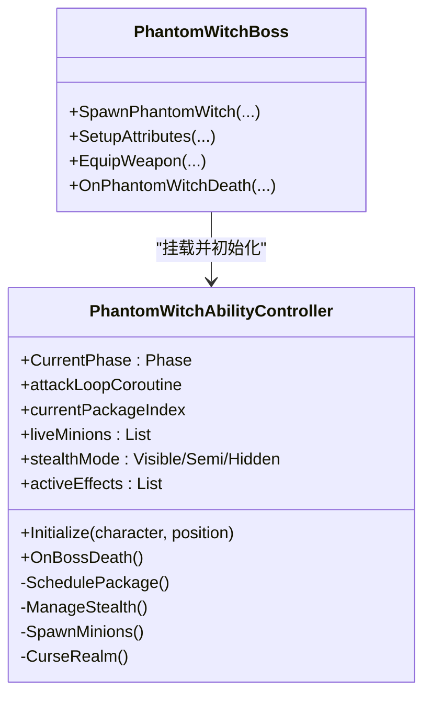
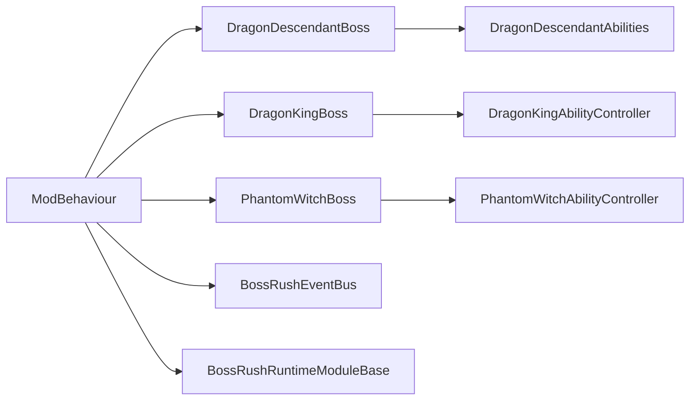

# 自定义 Boss 系统

<cite>
**本文引用的文件**
- [BossRushIntegration.cs](file://Integration/BossRushIntegration.cs)
- [BossRushRuntimeModuleBase.cs](file://Common/Lifecycle/BossRushRuntimeModuleBase.cs)
- [BossRushEventBus.cs](file://Common/Events/BossRushEventBus.cs)
- [DragonDescendantBoss.cs](file://Integration/DragonDescendant/DragonDescendantBoss.cs)
- [DragonDescendantAbilities.cs](file://Integration/DragonDescendant/DragonDescendantAbilities.cs)
- [DragonKingBoss.cs](file://Integration/DragonKing/DragonKingBoss.cs)
- [DragonKingAbilityController_AttackFlow.cs](file://Integration/DragonKing/DragonKingAbilityController_AttackFlow.cs)
- [PhantomWitchBoss.cs](file://Integration/PhantomWitch/PhantomWitchBoss.cs)
- [PhantomWitchAbilityController.cs](file://Integration/PhantomWitch/PhantomWitchAbilityController.cs)
</cite>

## 目录
1. [简介](#简介)
2. [项目结构](#项目结构)
3. [核心组件](#核心组件)
4. [架构总览](#架构总览)
5. [详细组件分析](#详细组件分析)
6. [依赖关系分析](#依赖关系分析)
7. [性能考量](#性能考量)
8. [故障排查指南](#故障排查指南)
9. [结论](#结论)
10. [附录：开发者与玩家指南](#附录开发者与玩家指南)

## 简介
本模块为 BossRushMod 的“自定义 Boss 系统”提供统一框架与三大 Boss（龙裔遗族、焚天龙皇、幽灵女巫）的实现。其创新点在于：
- 以 ModBehaviour 的 partial class 作为 Boss 生命周期入口，配合运行时模块基类与事件总线，形成可扩展的 Boss 框架。
- 能力系统通过独立的能力控制器（AbilityController）解耦战斗逻辑，支持阶段转换、召唤、隐身、领域等复杂机制。
- 统一的生成、配装、属性倍率、掉落追踪、清理回收流程，确保多模式兼容与资源安全。

## 项目结构
- 集成层：BossRushIntegration 负责物品注入、本地化、商店注入、场景加载钩子等。
- 通用基础设施：
  - Common/Lifecycle：运行时模块基类，定义 Awake/Start/Update/LateUpdate/Destroy 生命周期。
  - Common/Events：低开销事件总线，用于跨模块通知（如成就解锁）。
- Boss 实现：
  - DragonDescendant：龙裔遗族（射击+近战+复活+狂暴）。
  - DragonKing：焚天龙皇（多武器、多阶段、高级 AI、护盾/弹幕/范围攻击）。
  - PhantomWitch：幽灵女巫（隐身、召唤、诅咒领域、三阶段战术包调度）。
- 其他：地图配置、战利品、UI、调试工具、模式适配等。

**图表来源**
- [BossRushIntegration.cs:1-120](file://Integration/BossRushIntegration.cs#L1-L120)
- [BossRushRuntimeModuleBase.cs:1-15](file://Common/Lifecycle/BossRushRuntimeModuleBase.cs#L1-L15)
- [BossRushEventBus.cs:1-149](file://Common/Events/BossRushEventBus.cs#L1-L149)

**章节来源**
- [BossRushIntegration.cs:1-120](file://Integration/BossRushIntegration.cs#L1-L120)
- [BossRushRuntimeModuleBase.cs:1-15](file://Common/Lifecycle/BossRushRuntimeModuleBase.cs#L1-L15)
- [BossRushEventBus.cs:1-149](file://Common/Events/BossRushEventBus.cs#L1-L149)

## 核心组件
- Boss 生命周期管理：
  - 通过 ModBehaviour 的 partial class 暴露 SpawnXxx 方法，统一完成预设查找、角色生成、属性设置、装备、能力控制器挂载、血条显示、AI 仇恨、位置校验、掉落追踪、死亡订阅等。
  - 支持延迟激活（deferActivationUntilNextFrame）以降低出场帧尖峰。
- 能力系统：
  - 每个 Boss 拥有独立的 AbilityController，封装技能循环、阶段转换、状态机、特效与音效。
  - 使用协程与异步任务（UniTask）控制时序，避免阻塞主线程。
- 事件与模块：
  - 事件总线提供类型安全的发布/订阅，用于成就、统计等跨模块通信。
  - 运行时模块基类提供统一生命周期钩子，便于扩展。

**章节来源**
- [DragonDescendantBoss.cs:56-235](file://Integration/DragonDescendant/DragonDescendantBoss.cs#L56-L235)
- [DragonKingBoss.cs:206-371](file://Integration/DragonKing/DragonKingBoss.cs#L206-L371)
- [PhantomWitchBoss.cs:137-340](file://Integration/PhantomWitch/PhantomWitchBoss.cs#L137-L340)
- [BossRushEventBus.cs:18-136](file://Common/Events/BossRushEventBus.cs#L18-L136)
- [BossRushRuntimeModuleBase.cs:3-13](file://Common/Lifecycle/BossRushRuntimeModuleBase.cs#L3-L13)

## 架构总览
Boss 系统采用“控制器 + 能力”的分层设计：
- 控制器（Boss 主类）：负责生成、配装、属性、事件订阅、掉落追踪、清理。
- 能力控制器（AbilityController）：负责战斗行为、阶段转换、特效、音效、AI 交互。
- 基础设施：事件总线、运行时模块、资产缓存、性能策略。

**图表来源**
- [DragonDescendantBoss.cs:56-235](file://Integration/DragonDescendant/DragonDescendantBoss.cs#L56-L235)
- [DragonKingBoss.cs:206-371](file://Integration/DragonKing/DragonKingBoss.cs#L206-L371)
- [PhantomWitchBoss.cs:137-340](file://Integration/PhantomWitch/PhantomWitchBoss.cs#L137-L340)
- [BossRushEventBus.cs:60-136](file://Common/Events/BossRushEventBus.cs#L60-L136)

## 详细组件分析

### 龙裔遗族（Dragon Descendant）
- 生成与配装：
  - 查找基础预设（优先 Cname_Boss_Red），创建副本并设置名称/血条。
  - 装备龙头、龙甲，替换主武器为龙息武器，加载高级子弹，刷新模型。
  - 应用全局 Boss 数值倍率，设置 AI 仇恨，注册掉落追踪。
- 能力系统：
  - 火箭弹发射、燃烧弹投掷、首次濒死复活、狂暴追逐与碰撞伤害。
  - 冰属性伤害累计减速机制，音频反射缓存优化。
- 阶段转换：
  - 二阶段基于血量阈值触发，进入狂暴状态，切换攻击节奏。
- 掉落系统：
  - 记录原始掉落数量，参与随机掉落池；孩儿护我召唤的龙裔跳过波次追踪但保留掉落。

**图表来源**
- [DragonDescendantBoss.cs:56-235](file://Integration/DragonDescendant/DragonDescendantBoss.cs#L56-L235)
- [DragonDescendantAbilities.cs:26-200](file://Integration/DragonDescendant/DragonDescendantAbilities.cs#L26-L200)

**章节来源**
- [DragonDescendantBoss.cs:56-235](file://Integration/DragonDescendant/DragonDescendantBoss.cs#L56-L235)
- [DragonDescendantAbilities.cs:26-200](file://Integration/DragonDescendant/DragonDescendantAbilities.cs#L26-L200)

### 焚天龙皇（Dragon King）
- 生成与配装：
  - 复用???预设，创建副本，设置名称/血条，装备龙王之冕与鳞铠，加载高级子弹。
  - 禁用原版 AI 的部分行为，由能力控制器接管技能释放。
- 能力系统：
  - 攻击主循环按序列执行技能，支持调试模式固定技能。
  - 阶段转换：血量低于阈值时进入 Transitioning，停止移动/射击/太阳舞弹幕，清理特效后进入二阶段。
  - 多武器系统：龙枪、范围攻击、追踪弹幕、护盾/保护子单位等。
- 高级 AI：
  - Mode E 阵营感知，无目标时等待原版 AI 搜索；玩家死亡处理区分 Mode E 与非 Mode E。
- 掉落与成就：
  - 订阅掉落事件，触发击杀成就检测；BGM 播放与重置。

**图表来源**
- [DragonKingBoss.cs:206-371](file://Integration/DragonKing/DragonKingBoss.cs#L206-L371)
- [DragonKingAbilityController_AttackFlow.cs:17-200](file://Integration/DragonKing/DragonKingAbilityController_AttackFlow.cs#L17-L200)

**章节来源**
- [DragonKingBoss.cs:206-371](file://Integration/DragonKing/DragonKingBoss.cs#L206-L371)
- [DragonKingAbilityController_AttackFlow.cs:17-200](file://Integration/DragonKing/DragonKingAbilityController_AttackFlow.cs#L17-L200)

### 幽灵女巫（Phantom Witch）
- 生成与配装：
  - 精确匹配 Cname_Ghost 预设，回退到 Cname_Boss_Red；放大模型尺寸，装备镰刀武器（正式或占位）。
  - 在独立 GameObject 上挂载能力控制器，避免 SetActive(false) 导致协程被静默杀死。
- 能力系统：
  - 三阶段战术包调度（Phase1/2/3），包含传送、领域、召怪、隐身/半隐身、近战挥砍等。
  - 隐身机制：记录渲染器与材质属性块，动态调整透明度与可见性；统计各阶段隐身时长。
  - 召唤系统：维护活体仆从列表，角色分工（骚扰/持续），防同步异常。
  - 诅咒领域：Boss-only 领域效果，警告/提交计数，过渡时强制清除。
- 看门狗与恢复：
  - 监控攻击循环推进时间，防止协程被中断导致卡死；超时自动恢复。

**图表来源**
- [PhantomWitchBoss.cs:137-340](file://Integration/PhantomWitch/PhantomWitchBoss.cs#L137-L340)
- [PhantomWitchAbilityController.cs:24-120](file://Integration/PhantomWitch/PhantomWitchAbilityController.cs#L24-L120)

**章节来源**
- [PhantomWitchBoss.cs:137-340](file://Integration/PhantomWitch/PhantomWitchBoss.cs#L137-L340)
- [PhantomWitchAbilityController.cs:24-120](file://Integration/PhantomWitch/PhantomWitchAbilityController.cs#L24-L120)

## 依赖关系分析
- 模块耦合：
  - Boss 主控制器依赖预设、物品系统、健康组件、AI 控制器。
  - 能力控制器依赖特效、音效、路径寻路、Buff 系统。
  - 事件总线与成就系统松耦合，通过类型化事件通信。
- 外部依赖：
  - Unity 场景管理、对象池、协程、异步任务。
  - 游戏内 ItemStatsSystem、Duckov 核心系统。
- 潜在循环依赖：
  - 通过事件总线与静态缓存避免直接强耦合；能力控制器不反向依赖主控制器细节。

**图表来源**
- [BossRushIntegration.cs:1-120](file://Integration/BossRushIntegration.cs#L1-L120)
- [BossRushEventBus.cs:1-149](file://Common/Events/BossRushEventBus.cs#L1-L149)
- [BossRushRuntimeModuleBase.cs:1-15](file://Common/Lifecycle/BossRushRuntimeModuleBase.cs#L1-L15)

**章节来源**
- [BossRushIntegration.cs:1-120](file://Integration/BossRushIntegration.cs#L1-L120)
- [BossRushEventBus.cs:1-149](file://Common/Events/BossRushEventBus.cs#L1-L149)
- [BossRushRuntimeModuleBase.cs:1-15](file://Common/Lifecycle/BossRushRuntimeModuleBase.cs#L1-L15)

## 性能考量
- 预设与物品缓存：
  - 使用静态缓存避免重复 Resources.FindObjectsOfTypeAll；场景切换时清理缓存。
- 协程与等待对象复用：
  - 预分配 WaitForSeconds 对象，减少 GC 压力。
- 事件与反射缓存：
  - AudioManager 反射方法缓存；事件总线快照发布避免迭代期修改。
- 分帧与延迟激活：
  - deferActivationUntilNextFrame 降低出场帧尖峰；能力控制器独立 GO 避免 SetActive 副作用。
- 资源引用计数：
  - 多 Boss 实例共享资源时，使用引用计数在最后一个实例销毁时清理。

[本节为通用指导，无需特定文件来源]

## 故障排查指南
- 生成失败：
  - 检查预设查找逻辑与回退方案；查看日志中的错误信息。
- 能力控制器未生效：
  - 确认已正确挂载并 Initialize；检查协程是否被 StopAllCoroutines 终止。
- 掉落/成就未触发：
  - 验证死亡/掉落事件订阅是否正确；检查事件总线发布与订阅生命周期。
- 内存泄漏：
  - 确保事件监听在 Boss 死亡时移除；静态缓存场景切换时清理。

**章节来源**
- [DragonDescendantBoss.cs:237-260](file://Integration/DragonDescendant/DragonDescendantBoss.cs#L237-L260)
- [DragonKingBoss.cs:559-634](file://Integration/DragonKing/DragonKingBoss.cs#L559-L634)
- [PhantomWitchBoss.cs:626-662](file://Integration/PhantomWitch/PhantomWitchBoss.cs#L626-L662)
- [BossRushEventBus.cs:60-136](file://Common/Events/BossRushEventBus.cs#L60-L136)

## 结论
BossRushMod 的自定义 Boss 系统通过模块化、能力控制器与事件驱动的设计，实现了高内聚、低耦合的 Boss 框架。三大 Boss 各具特色：龙裔遗族的复活与狂暴、焚天龙皇的多阶段与高级 AI、幽灵女巫的隐身与领域。系统在性能、稳定性与可维护性方面做了充分优化，适合扩展更多 Boss 内容。

[本节为总结，无需特定文件来源]

## 附录：开发者与玩家指南

### 开发者：添加新 Boss 的步骤
- 创建 Boss 主控制器（partial class 于 ModBehaviour）：
  - 实现 SpawnXxx 方法，完成预设查找、角色生成、属性设置、装备、能力控制器挂载、事件订阅、掉落追踪。
- 实现能力控制器（AbilityController）：
  - 封装技能循环、阶段转换、特效、音效、AI 交互。
  - 使用协程与异步任务控制时序，避免阻塞。
- 注册预设与本地化：
  - 在敌人预设列表中添加新 Boss；注入本地化文本。
- 性能与清理：
  - 使用静态缓存与引用计数；场景切换时清理缓存与资源。
- 测试与调试：
  - 启用调试模式，观察日志输出；验证阶段转换、掉落、成就触发。

**章节来源**
- [DragonDescendantBoss.cs:56-235](file://Integration/DragonDescendant/DragonDescendantBoss.cs#L56-L235)
- [DragonKingBoss.cs:206-371](file://Integration/DragonKing/DragonKingBoss.cs#L206-L371)
- [PhantomWitchBoss.cs:137-340](file://Integration/PhantomWitch/PhantomWitchBoss.cs#L137-L340)

### 玩家：Boss 战斗策略建议
- 龙裔遗族：
  - 注意其复活机制，在首次濒死时集中爆发；狂暴状态下保持距离，避免碰撞伤害。
- 焚天龙皇：
  - 关注阶段转换提示，避开范围攻击与追踪弹幕；利用掩体躲避太阳舞弹幕。
- 幽灵女巫：
  - 识别隐身与半隐身状态，使用范围技能或视野道具；注意诅咒领域内的持续伤害，及时离开。

[本节为玩家指导，无需特定文件来源]