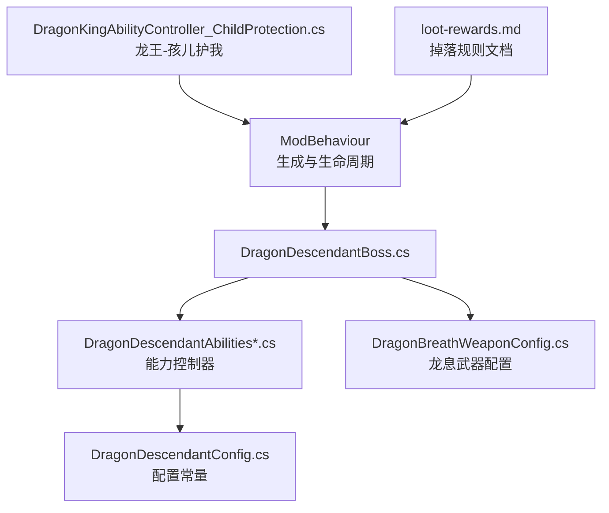
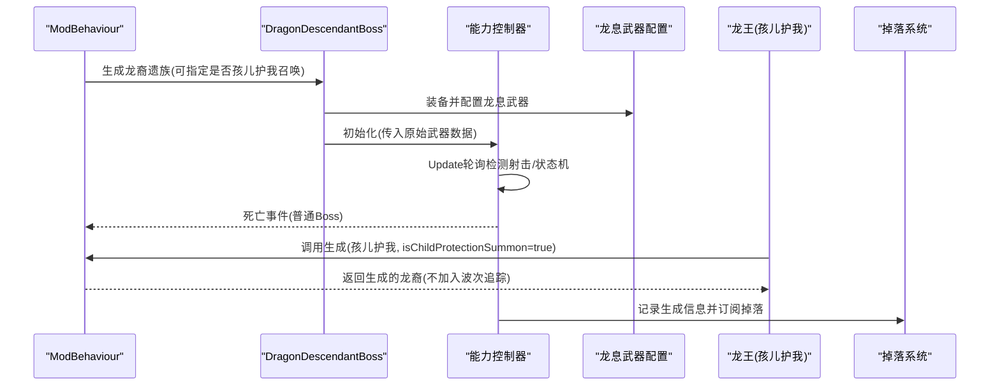
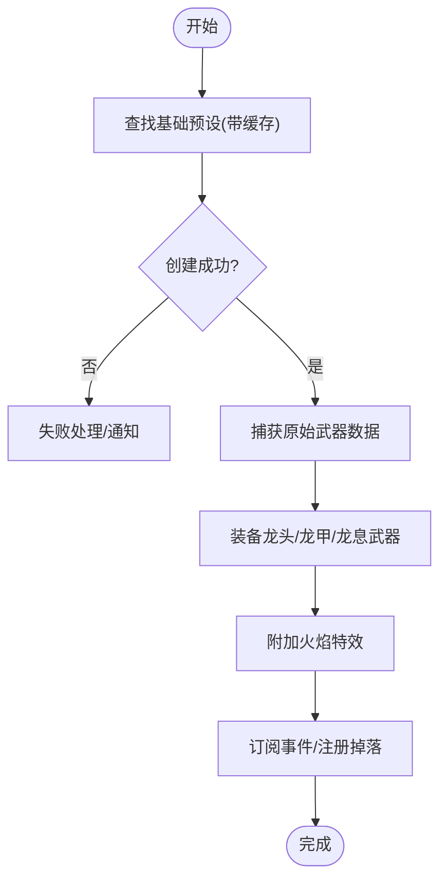
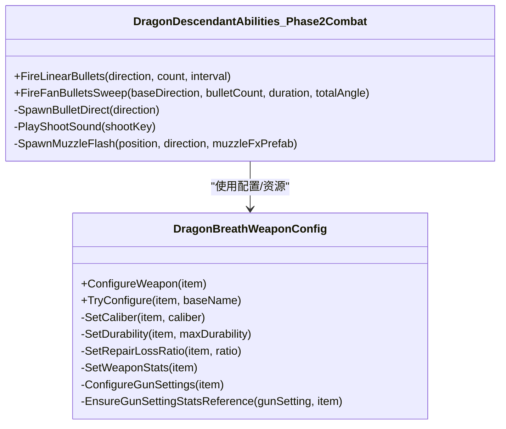
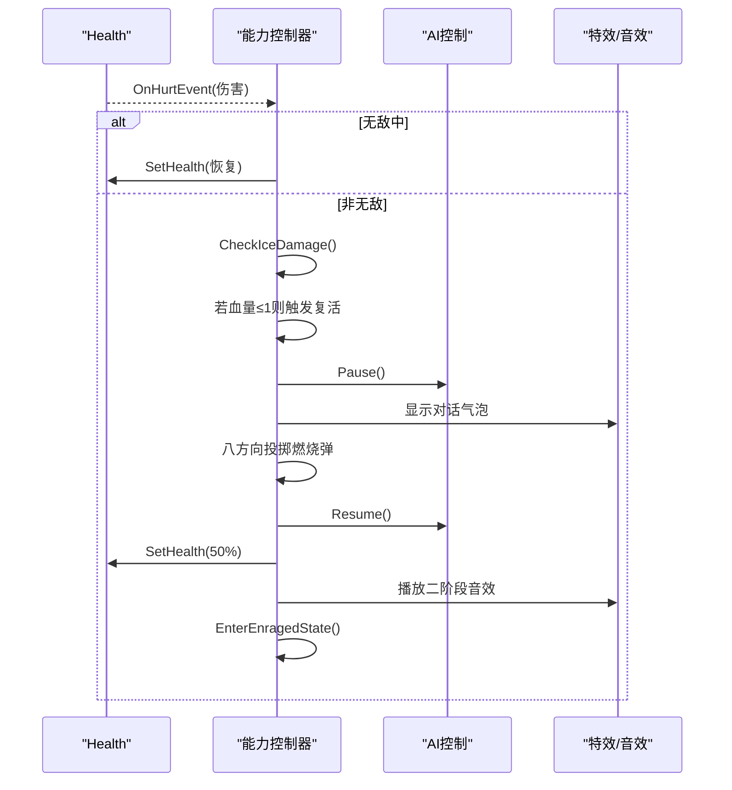
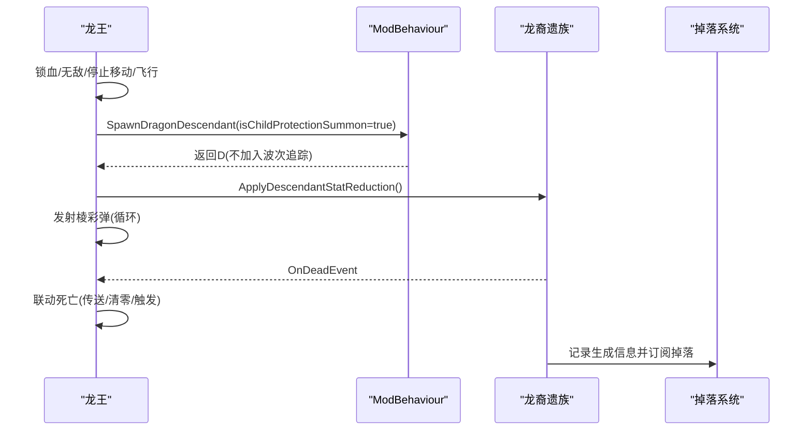
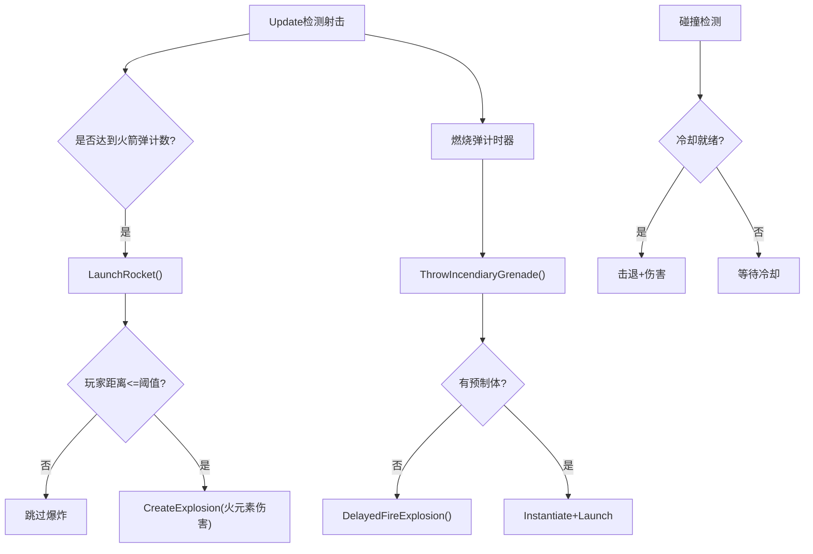
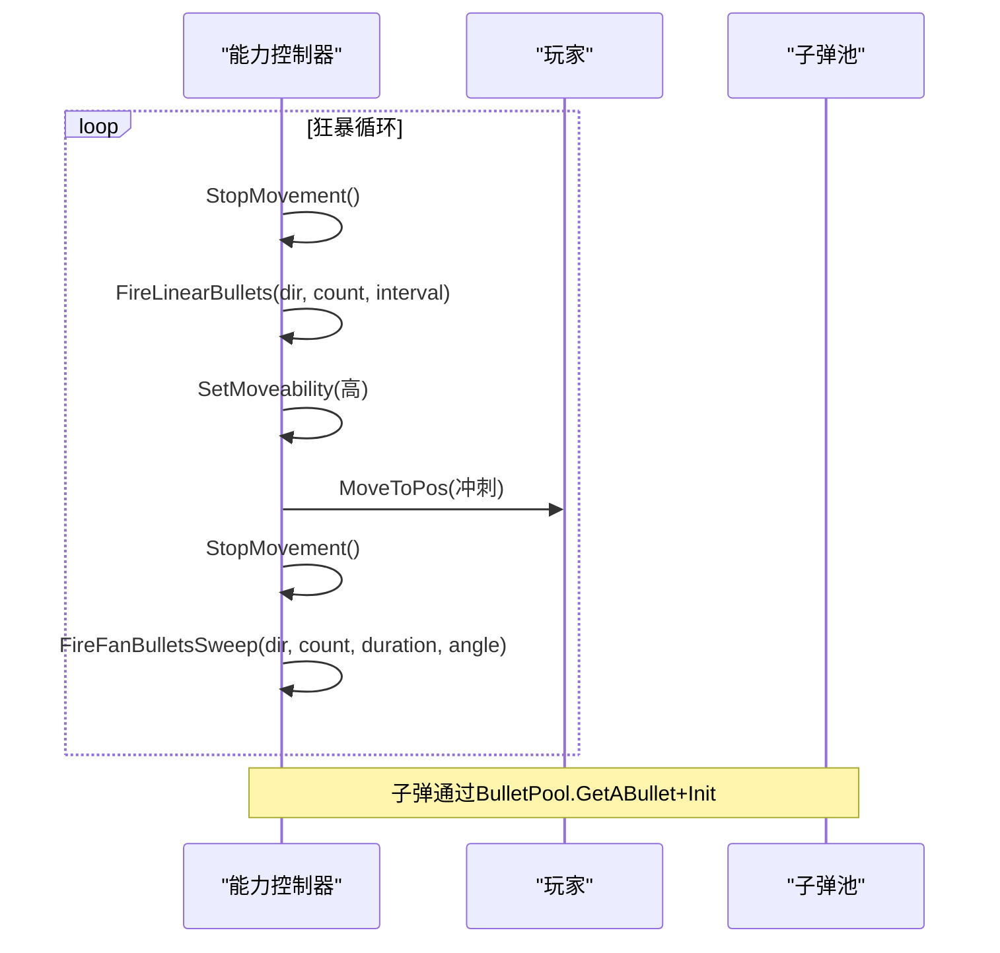
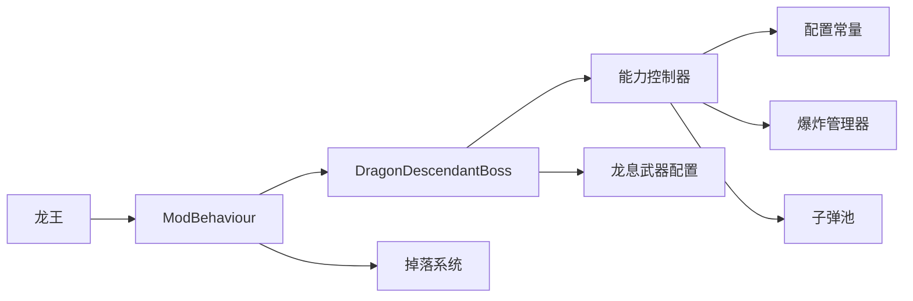
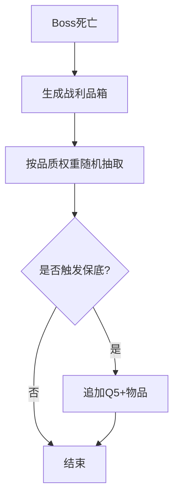

# 龙裔遗族

<cite>
**本文引用的文件**
- [DragonDescendantBoss.cs](file://Integration/DragonDescendant/DragonDescendantBoss.cs)
- [DragonDescendantAbilities.cs](file://Integration/DragonDescendant/DragonDescendantAbilities.cs)
- [DragonDescendantAbilities_ProjectilesAndGrenades.cs](file://Integration/DragonDescendant/DragonDescendantAbilities_ProjectilesAndGrenades.cs)
- [DragonDescendantAbilities_Phase2Combat.cs](file://Integration/DragonDescendant/DragonDescendantAbilities_Phase2Combat.cs)
- [DragonDescendantAbilities_ResurrectionAndPhase.cs](file://Integration/DragonDescendant/DragonDescendantAbilities_ResurrectionAndPhase.cs)
- [DragonBreathWeaponConfig.cs](file://Integration/DragonDescendant/DragonBreathWeaponConfig.cs)
- [DragonDescendantConfig.cs](file://Integration/DragonDescendant/DragonDescendantConfig.cs)
- [DragonKingAbilityController_ChildProtection.cs](file://Integration/DragonKing/DragonKingAbilityController_ChildProtection.cs)
- [loot-rewards.md](file://wiki-site/docs/systems/loot-rewards.md)
</cite>

## 目录
1. [简介](#简介)
2. [项目结构](#项目结构)
3. [核心组件](#核心组件)
4. [架构总览](#架构总览)
5. [详细组件分析](#详细组件分析)
6. [依赖关系分析](#依赖关系分析)
7. [性能与稳定性](#性能与稳定性)
8. [掉落系统](#掉落系统)
9. [战斗策略建议](#战斗策略建议)
10. [开发者扩展指南](#开发者扩展指南)
11. [故障排查](#故障排查)
12. [结论](#结论)

## 简介
本文件为“龙裔遗族”Boss的完整技术文档，覆盖技能实现、阶段转换、掉落机制、战斗策略与扩展指南。内容基于仓库中龙裔遗族相关源码与配置，面向玩家与开发者两类读者，提供从高层到代码级的系统化说明。

## 项目结构
围绕龙裔遗族的实现主要分布在以下模块：
- Boss生成与生命周期：负责生成、装备、属性设置、事件订阅与清理
- 能力控制器：管理射击检测、火箭弹、燃烧弹、复活、狂暴二阶段、碰撞击退等
- 武器配置：定义并配置“龙息”武器（弹药、耐久、标签、属性、枪口火焰）
- 配置常量：血量、伤害倍率、投掷间隔、复活阈值、狂暴参数等
- 龙王联动：孩儿护我阶段由龙王触发，召唤降属性的龙裔遗族保护自身

图表来源
- [DragonDescendantBoss.cs:56-235](file://Integration/DragonDescendant/DragonDescendantBoss.cs#L56-L235)
- [DragonDescendantAbilities.cs:23-279](file://Integration/DragonDescendant/DragonDescendantAbilities.cs#L23-L279)
- [DragonBreathWeaponConfig.cs:145-186](file://Integration/DragonDescendant/DragonBreathWeaponConfig.cs#L145-L186)
- [DragonDescendantConfig.cs:13-231](file://Integration/DragonDescendant/DragonDescendantConfig.cs#L13-L231)
- [DragonKingAbilityController_ChildProtection.cs:23-134](file://Integration/DragonKing/DragonKingAbilityController_ChildProtection.cs#L23-L134)
- [loot-rewards.md:101-117](file://wiki-site/docs/systems/loot-rewards.md#L101-L117)

章节来源
- [DragonDescendantBoss.cs:56-235](file://Integration/DragonDescendant/DragonDescendantBoss.cs#L56-L235)
- [DragonDescendantAbilities.cs:23-279](file://Integration/DragonDescendant/DragonDescendantAbilities.cs#L23-L279)
- [DragonBreathWeaponConfig.cs:145-186](file://Integration/DragonDescendant/DragonBreathWeaponConfig.cs#L145-L186)
- [DragonDescendantConfig.cs:13-231](file://Integration/DragonDescendant/DragonDescendantConfig.cs#L13-L231)
- [DragonKingAbilityController_ChildProtection.cs:23-134](file://Integration/DragonKing/DragonKingAbilityController_ChildProtection.cs#L23-L134)
- [loot-rewards.md:101-117](file://wiki-site/docs/systems/loot-rewards.md#L101-L117)

## 核心组件
- 主控制器（生成/装备/生命周期）：负责查找基础预设、创建角色、复制预设、设置血条、应用全局倍率、获取原始武器数据、装备龙头/龙甲/龙息武器、添加能力控制器、订阅死亡事件、注册掉落追踪等
- 能力控制器：分多个部分实现射击检测、火箭弹、燃烧弹、复活序列、狂暴二阶段、扇形/直线弹幕、碰撞击退、冰属性减速等
- 龙息武器配置：为“龙息”枪械设定口径、耐久、维修损耗、标签、Stats、枪口火焰、子弹预制体等
- 配置常量：集中管理Boss血量、伤害倍率、投掷间隔、复活比例、狂暴参数、掉落概率等
- 龙王联动：在“孩儿护我”阶段锁血无敌、飞行、召唤降属性龙裔遗族、发射棱彩弹、龙裔死亡后联动击杀龙王

章节来源
- [DragonDescendantBoss.cs:56-235](file://Integration/DragonDescendant/DragonDescendantBoss.cs#L56-L235)
- [DragonDescendantAbilities.cs:23-279](file://Integration/DragonDescendant/DragonDescendantAbilities.cs#L23-L279)
- [DragonBreathWeaponConfig.cs:145-186](file://Integration/DragonDescendant/DragonBreathWeaponConfig.cs#L145-L186)
- [DragonDescendantConfig.cs:13-231](file://Integration/DragonDescendant/DragonDescendantConfig.cs#L13-L231)
- [DragonKingAbilityController_ChildProtection.cs:23-134](file://Integration/DragonKing/DragonKingAbilityController_ChildProtection.cs#L23-L134)

## 架构总览
下图展示从生成到战斗循环的关键交互：

图表来源
- [DragonDescendantBoss.cs:56-235](file://Integration/DragonDescendant/DragonDescendantBoss.cs#L56-L235)
- [DragonDescendantAbilities.cs:23-279](file://Integration/DragonDescendant/DragonDescendantAbilities.cs#L23-L279)
- [DragonBreathWeaponConfig.cs:145-186](file://Integration/DragonDescendant/DragonBreathWeaponConfig.cs#L145-L186)
- [DragonKingAbilityController_ChildProtection.cs:341-390](file://Integration/DragonKing/DragonKingAbilityController_ChildProtection.cs#L341-L390)

## 详细组件分析

### 生成与装备流程
- 预设查找：优先匹配“Cname_Boss_Red”，回退至名称包含“Boss_Red/BossRed”，再回退至“???”预设；结果缓存避免重复搜索
- 角色创建：异步创建角色，命名并设置显示血条；非孩儿护我召唤时加入当前波列表
- 原始武器数据捕获：在替换为龙息武器前，通过反射或槽位读取原枪的子弹、枪口特效、射速、伤害、射程、音效键，用于二阶段直接生成子弹
- 装备流程：装备龙头、龙甲、龙息武器；刷新模型；加载最高级弹药；为Boss武器附加火焰特效
- 生命周期：订阅死亡事件（仅普通Boss）、注册掉落追踪、延迟位置校验、注册恢复锚点

图表来源
- [DragonDescendantBoss.cs:56-235](file://Integration/DragonDescendant/DragonDescendantBoss.cs#L56-L235)
- [DragonDescendantBoss.cs:428-566](file://Integration/DragonDescendant/DragonDescendantBoss.cs#L428-L566)
- [DragonDescendantBoss.cs:614-743](file://Integration/DragonDescendant/DragonDescendantBoss.cs#L614-L743)

章节来源
- [DragonDescendantBoss.cs:56-235](file://Integration/DragonDescendant/DragonDescendantBoss.cs#L56-L235)
- [DragonDescendantBoss.cs:428-566](file://Integration/DragonDescendant/DragonDescendantBoss.cs#L428-L566)
- [DragonDescendantBoss.cs:614-743](file://Integration/DragonDescendant/DragonDescendantBoss.cs#L614-L743)

### 技能系统：龙息武器、火焰效果、二阶段射击
- 龙息武器：通过配置器设置口径、耐久、维修损耗、标签、Stats、枪口火焰、子弹预制体；确保ItemSetting_Gun正确引用Stats以修复散布计算问题
- 火焰效果：为Boss武器附加火焰枪口与燃烧子弹；运行时尝试从已加载武器中检索对应预制体并缓存
- 二阶段射击：禁用Boss自身射击，改为直接生成子弹；使用原始武器数据（子弹、速度、射程、伤害、音效、枪口特效），支持直线弹幕与扇形来回扫射

图表来源
- [DragonBreathWeaponConfig.cs:145-186](file://Integration/DragonDescendant/DragonBreathWeaponConfig.cs#L145-L186)
- [DragonBreathWeaponConfig.cs:759-880](file://Integration/DragonDescendant/DragonBreathWeaponConfig.cs#L759-L880)
- [DragonDescendantAbilities_Phase2Combat.cs:182-368](file://Integration/DragonDescendant/DragonDescendantAbilities_Phase2Combat.cs#L182-L368)

章节来源
- [DragonBreathWeaponConfig.cs:145-186](file://Integration/DragonDescendant/DragonBreathWeaponConfig.cs#L145-L186)
- [DragonBreathWeaponConfig.cs:759-880](file://Integration/DragonDescendant/DragonBreathWeaponConfig.cs#L759-L880)
- [DragonDescendantAbilities_Phase2Combat.cs:182-368](file://Integration/DragonDescendant/DragonDescendantAbilities_Phase2Combat.cs#L182-L368)

### 阶段转换：复活与狂暴
- 受伤回调：在无敌期间恢复血量；狂暴阶段累计冰属性伤害，达到阈值触发减速
- 复活序列：当血量≤1且未复活过，进入复活流程——锁血、无敌、暂停AI、显示对话、八方向投掷燃烧弹、恢复AI、恢复50%血量、关闭无敌、播放二阶段音效、进入狂暴
- 狂暴状态：提升伤害倍率、收起武器停止原生射击、扩大发光范围、设置碰撞检测、跑步追逐、启动二阶段行为循环

图表来源
- [DragonDescendantAbilities_ResurrectionAndPhase.cs:18-181](file://Integration/DragonDescendant/DragonDescendantAbilities_ResurrectionAndPhase.cs#L18-L181)
- [DragonDescendantAbilities_ResurrectionAndPhase.cs:324-463](file://Integration/DragonDescendant/DragonDescendantAbilities_ResurrectionAndPhase.cs#L324-L463)

章节来源
- [DragonDescendantAbilities_ResurrectionAndPhase.cs:18-181](file://Integration/DragonDescendant/DragonDescendantAbilities_ResurrectionAndPhase.cs#L18-L181)
- [DragonDescendantAbilities_ResurrectionAndPhase.cs:324-463](file://Integration/DragonDescendant/DragonDescendantAbilities_ResurrectionAndPhase.cs#L324-L463)

### 孩儿护我阶段：召唤与行为变化
- 触发：龙王在特定条件下进入孩儿护我，锁血无敌、禁用移动、停止攻击、飞升至目标高度、锁定Y坐标
- 召唤：随机刷怪点异步生成龙裔遗族，降低其血量与伤害倍率，显示对话气泡，订阅死亡事件
- 防御弹幕：在孩儿护我阶段周期性发射棱彩弹（追踪/飞行）
- 结束：龙裔死亡后联动击杀龙王（传送回起飞前位置、清零血量、触发死亡事件）

图表来源
- [DragonKingAbilityController_ChildProtection.cs:23-134](file://Integration/DragonKing/DragonKingAbilityController_ChildProtection.cs#L23-L134)
- [DragonKingAbilityController_ChildProtection.cs:341-390](file://Integration/DragonKing/DragonKingAbilityController_ChildProtection.cs#L341-L390)
- [DragonKingAbilityController_ChildProtection.cs:597-637](file://Integration/DragonKing/DragonKingAbilityController_ChildProtection.cs#L597-L637)

章节来源
- [DragonKingAbilityController_ChildProtection.cs:23-134](file://Integration/DragonKing/DragonKingAbilityController_ChildProtection.cs#L23-L134)
- [DragonKingAbilityController_ChildProtection.cs:341-390](file://Integration/DragonKing/DragonKingAbilityController_ChildProtection.cs#L341-L390)
- [DragonKingAbilityController_ChildProtection.cs:597-637](file://Integration/DragonKing/DragonKingAbilityController_ChildProtection.cs#L597-L637)

### 技能细节：火箭弹、燃烧弹、碰撞击退
- 火箭弹：每N发子弹触发一次，仅在玩家距离Boss小于阈值时在玩家位置爆炸，使用爆炸管理器创建伤害与特效
- 燃烧弹：按状态选择间隔（正常/狂暴），始终投向玩家脚下；若无预制体则延迟火焰爆炸作为后备
- 碰撞击退：在狂暴状态下启用球形触发器，检测与玩家碰撞，施加击退与伤害，具备冷却时间防止连续触发

图表来源
- [DragonDescendantAbilities_ProjectilesAndGrenades.cs:18-84](file://Integration/DragonDescendant/DragonDescendantAbilities_ProjectilesAndGrenades.cs#L18-L84)
- [DragonDescendantAbilities_ProjectilesAndGrenades.cs:87-274](file://Integration/DragonDescendant/DragonDescendantAbilities_ProjectilesAndGrenades.cs#L87-L274)
- [DragonDescendantAbilities_Phase2Combat.cs:468-528](file://Integration/DragonDescendant/DragonDescendantAbilities_Phase2Combat.cs#L468-L528)

章节来源
- [DragonDescendantAbilities_ProjectilesAndGrenades.cs:18-84](file://Integration/DragonDescendant/DragonDescendantAbilities_ProjectilesAndGrenades.cs#L18-L84)
- [DragonDescendantAbilities_ProjectilesAndGrenades.cs:87-274](file://Integration/DragonDescendant/DragonDescendantAbilities_ProjectilesAndGrenades.cs#L87-L274)
- [DragonDescendantAbilities_Phase2Combat.cs:468-528](file://Integration/DragonDescendant/DragonDescendantAbilities_Phase2Combat.cs#L468-L528)

### 二阶段行为循环
- 循环步骤：停止移动→直线弹幕→高速冲刺→停止移动→扇形弹幕（来回扫射）→重复
- 弹幕生成：优先使用原始武器数据，否则回退到缓存子弹；播放开枪音效、生成枪口特效、从BulletPool获取子弹并Init
- 移动控制：动态调整Moveability，强制跑步输入，必要时清除AI仇恨以避免脱战

图表来源
- [DragonDescendantAbilities_Phase2Combat.cs:18-125](file://Integration/DragonDescendant/DragonDescendantAbilities_Phase2Combat.cs#L18-L125)
- [DragonDescendantAbilities_Phase2Combat.cs:182-368](file://Integration/DragonDescendant/DragonDescendantAbilities_Phase2Combat.cs#L182-L368)

章节来源
- [DragonDescendantAbilities_Phase2Combat.cs:18-125](file://Integration/DragonDescendant/DragonDescendantAbilities_Phase2Combat.cs#L18-L125)
- [DragonDescendantAbilities_Phase2Combat.cs:182-368](file://Integration/DragonDescendant/DragonDescendantAbilities_Phase2Combat.cs#L182-L368)

## 依赖关系分析
- 生成依赖：ModBehaviour → DragonDescendantBoss → 能力控制器/武器配置
- 战斗依赖：能力控制器 → 配置常量/爆炸管理器/子弹池/AI控制
- 联动依赖：龙王 → ModBehaviour（生成龙裔）→ 掉落系统（记录生成与掉落）
- 外部依赖：游戏内置的ExplosionManager、BulletPool、DialogueBubblesManager、ItemAssetsCollection、GameplayDataSettings

图表来源
- [DragonDescendantBoss.cs:56-235](file://Integration/DragonDescendant/DragonDescendantBoss.cs#L56-L235)
- [DragonDescendantAbilities.cs:23-279](file://Integration/DragonDescendant/DragonDescendantAbilities.cs#L23-L279)
- [DragonBreathWeaponConfig.cs:145-186](file://Integration/DragonDescendant/DragonBreathWeaponConfig.cs#L145-L186)
- [DragonKingAbilityController_ChildProtection.cs:341-390](file://Integration/DragonKing/DragonKingAbilityController_ChildProtection.cs#L341-L390)

章节来源
- [DragonDescendantBoss.cs:56-235](file://Integration/DragonDescendant/DragonDescendantBoss.cs#L56-L235)
- [DragonDescendantAbilities.cs:23-279](file://Integration/DragonDescendant/DragonDescendantAbilities.cs#L23-L279)
- [DragonBreathWeaponConfig.cs:145-186](file://Integration/DragonDescendant/DragonBreathWeaponConfig.cs#L145-L186)
- [DragonKingAbilityController_ChildProtection.cs:341-390](file://Integration/DragonKing/DragonKingAbilityController_ChildProtection.cs#L341-L390)

## 性能与稳定性
- 预设与物品查找缓存：避免重复Resources扫描，显著降低生成开销
- 帧级射击检测：每N帧检测一次弹药变化，减少GetGun调用频率
- WaitForSeconds缓存：常用时间对象复用，减少GC分配
- 反射缓存：AudioManager方法、Tag查找、Stat字段等仅首次反射并缓存
- 协程与状态保护：复活/狂暴期间暂停AI与移动，避免无效逻辑执行
- 资源清理：场景切换时清空静态缓存，防止悬挂引用导致崩溃

[本节为通用性能建议，无需具体文件引用]

## 掉落系统
- 常规掉落：每个Boss被击杀后在其死亡位置生成战利品箱，数量随生命值变化
- 品质分布：默认采用原版概率模式，受血量因子与击杀速度因子影响；存在Q5+保底机制
- 龙裔遗族专属掉落：赤龙首（头盔）30%、焰鳞甲（护甲）60%、龙息（枪械）10%
- 掉落追踪：生成时记录时间与原始掉落数量，订阅掉落事件以便统一结算

图表来源
- [loot-rewards.md:1-120](file://wiki-site/docs/systems/loot-rewards.md#L1-L120)
- [DragonDescendantBoss.cs:189-221](file://Integration/DragonDescendant/DragonDescendantBoss.cs#L189-L221)

章节来源
- [loot-rewards.md:1-120](file://wiki-site/docs/systems/loot-rewards.md#L1-L120)
- [DragonDescendantBoss.cs:189-221](file://Integration/DragonDescendant/DragonDescendantBoss.cs#L189-L221)

## 战斗策略建议
- 弱点分析
  - 冰属性：狂暴阶段累计冰属性伤害达到阈值会触发减速，利于输出窗口
  - 二阶段弹幕：直线弹幕需侧向躲避；扇形弹幕利用来回扫射的空隙切入
  - 碰撞击退：保持距离避免近身碰撞，注意冷却时间
- 躲避技巧
  - 火箭弹：仅在靠近Boss时爆炸，保持安全距离
  - 燃烧弹：预判落点，避开玩家脚下区域
  - 二阶段冲刺：观察Boss加速前摇，提前拉开距离
- 输出时机
  - 复活对话期间：Boss无敌，避免浪费输出
  - 扇形弹幕后半段：角度回扫时存在短暂空档，适合爆发
  - 冰减速触发后：提高持续输出效率

[本节为通用策略建议，无需具体文件引用]

## 开发者扩展指南
- 新增技能
  - 在能力控制器中添加新的协程或Update分支，遵循现有帧检测与状态机模式
  - 使用配置常量集中管理数值，便于平衡性调整
  - 复用爆炸管理器与子弹池，保证视觉与性能一致性
- 平衡性调整
  - 修改DragonDescendantConfig中的血量、伤害倍率、投掷间隔、复活阈值等
  - 调整二阶段弹幕数量、持续时间、角度范围
  - 调整掉落概率与保底规则（参考掉落文档）
- 新武器扩展
  - 在DragonBreathWeaponConfig中扩展Stats、标签、枪口特效与子弹预制体
  - 确保ItemSetting_Gun的Stats引用正确，避免散布计算异常
- 联动机制
  - 龙王孩儿护我阶段可通过ModBehaviour生成降属性龙裔，注意isChildProtectionSummon标志
  - 订阅龙裔死亡事件，实现联动击杀与清理

[本节为通用扩展建议，无需具体文件引用]

## 故障排查
- 生成失败
  - 检查预设查找是否命中“Cname_Boss_Red”或回退预设
  - 确认龙息武器TypeID与资源可用
- 技能失效
  - 核对能力控制器初始化是否传入原始武器数据
  - 检查爆炸管理器与子弹池是否可用
- 掉落异常
  - 确认掉落追踪已注册，事件订阅正常
  - 核对品质分布配置与保底逻辑
- 性能问题
  - 检查是否频繁创建WaitForSeconds或反射调用
  - 确认静态缓存是否正确清理

章节来源
- [DragonDescendantBoss.cs:56-235](file://Integration/DragonDescendant/DragonDescendantBoss.cs#L56-L235)
- [DragonDescendantAbilities.cs:23-279](file://Integration/DragonDescendant/DragonDescendantAbilities.cs#L23-L279)
- [DragonBreathWeaponConfig.cs:145-186](file://Integration/DragonDescendant/DragonBreathWeaponConfig.cs#L145-L186)
- [loot-rewards.md:1-120](file://wiki-site/docs/systems/loot-rewards.md#L1-L120)

## 结论
龙裔遗族通过模块化设计实现了清晰的生成、能力、武器与掉落体系。其阶段转换与联动机制提供了丰富的战斗体验，同时兼顾了性能优化与可扩展性。开发者可基于配置与接口快速扩展新技能与平衡性调整，玩家则可依据弱点与弹幕规律制定高效策略。