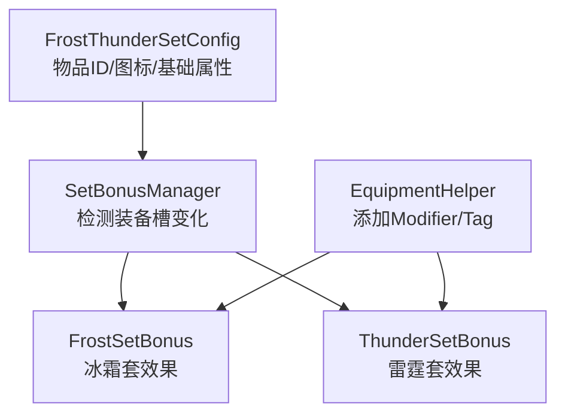
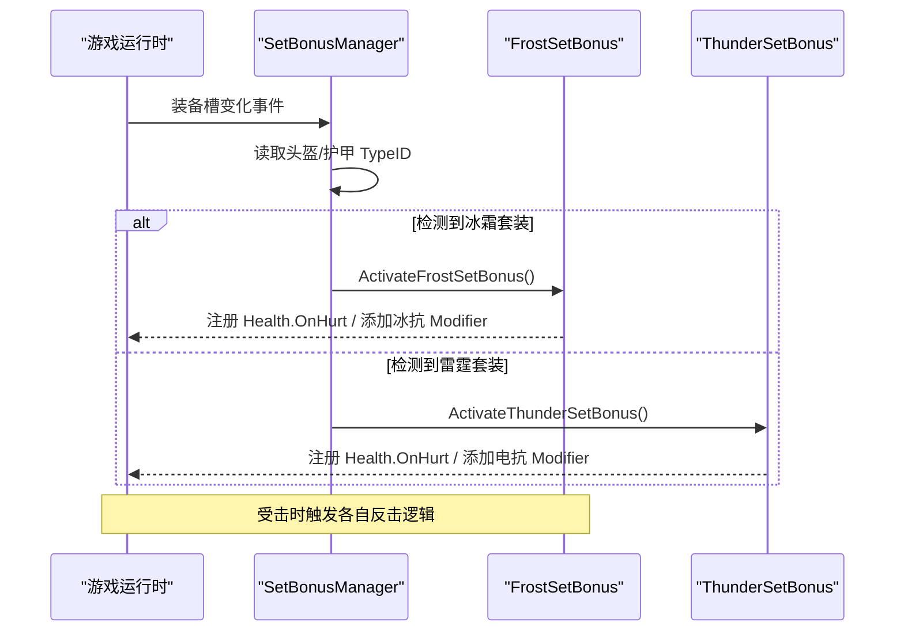
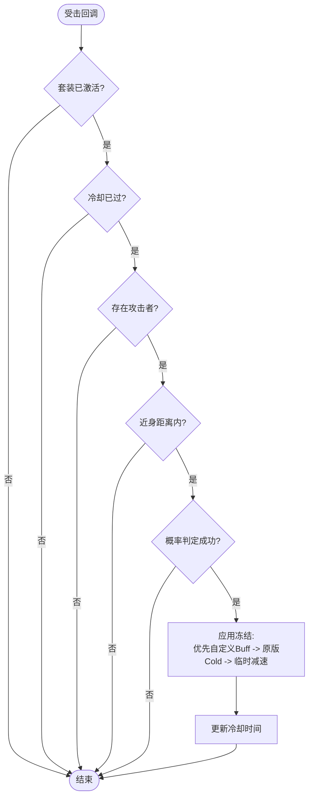
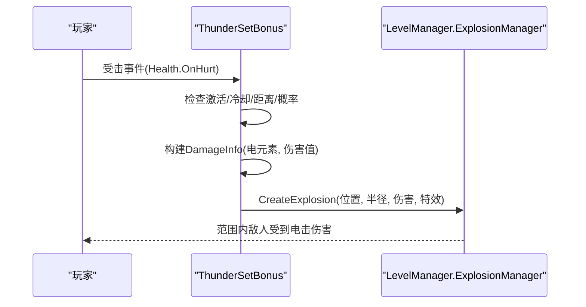
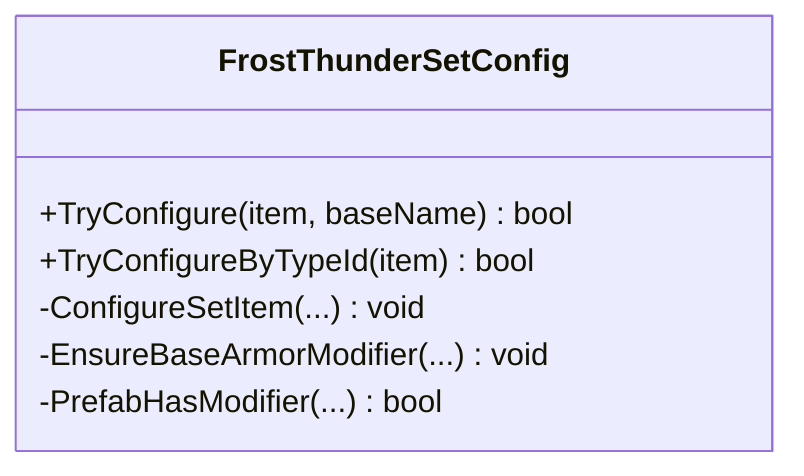
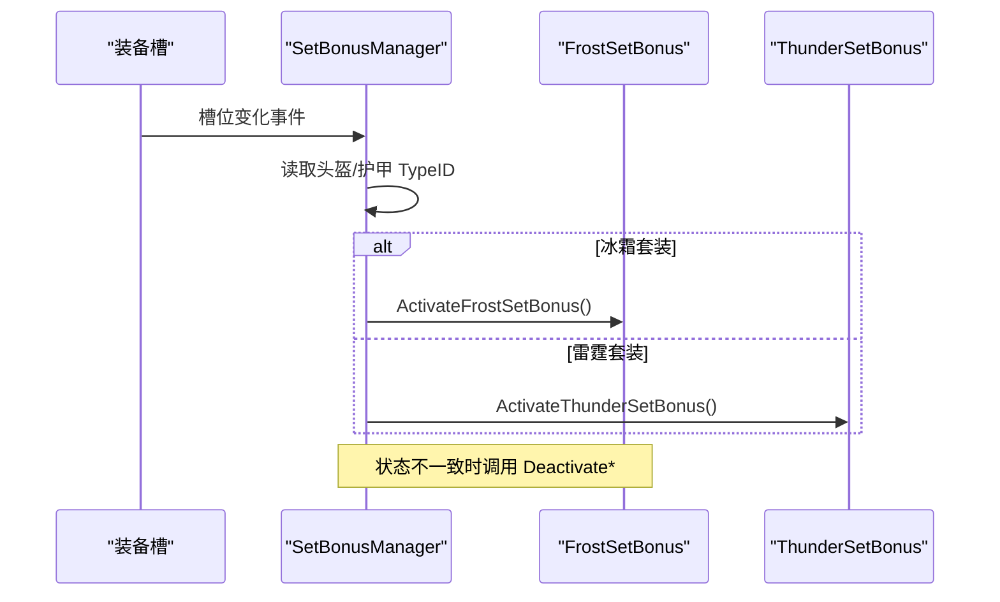
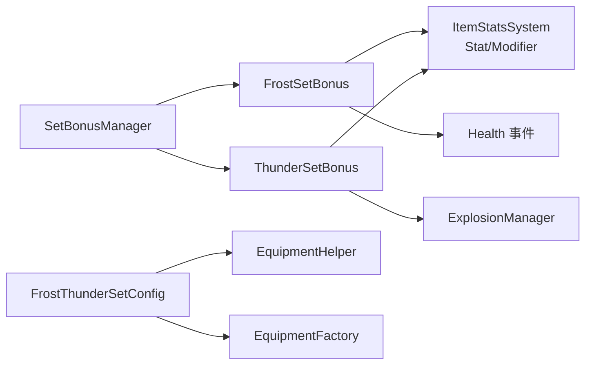

# 冰霜雷霆套装效果

<cite>
**本文引用的文件**
- [FrostThunderSetConfig.cs](file://Integration/Config/FrostThunderSetConfig.cs)
- [FrostSetBonus.cs](file://Integration/Bonus/FrostSetBonus.cs)
- [ThunderSetBonus.cs](file://Integration/Bonus/ThunderSetBonus.cs)
- [SetBonusManager.cs](file://Integration/Bonus/SetBonusManager.cs)
- [EquipmentHelper.cs](file://Integration/EquipmentHelper.cs)
- [SetBonusVisuals.cs](file://Integration/Bonus/SetBonusVisuals.cs)
- [SetBonusDamageObservation.cs](file://Integration/Bonus/SetBonusDamageObservation.cs)
- [ThunderSetBonus_Storm.cs](file://Integration/Bonus/ThunderSetBonus_Storm.cs)
- [FrostSetBonus_Nova.cs](file://Integration/Bonus/FrostSetBonus_Nova.cs)
- [FrostMistEffect.cs](file://Integration/Bonus/FrostMistEffect.cs)
- [SetBonusBossDropHandler.cs](file://Integration/Bonus/SetBonusBossDropHandler.cs)
- [CharacterOnDeadPatch.cs](file://Patches/Combat/CharacterOnDeadPatch.cs)
- [GoblinAffinityConfig.cs](file://Integration/Affinity/NPCs/GoblinAffinityConfig.cs)
</cite>

## 目录
1. [简介](#简介)
2. [项目结构](#项目结构)
3. [核心组件](#核心组件)
4. [架构总览](#架构总览)
5. [详细组件分析](#详细组件分析)
6. [依赖关系分析](#依赖关系分析)
7. [性能考量](#性能考量)
8. [故障排查指南](#故障排查指南)
9. [结论](#结论)
10. [附录：实战技巧与搭配建议](#附录实战技巧与搭配建议)

## 简介
本技术文档聚焦 BossRushMod 中的“冰霜”与“雷霆”两套元素套装的效果系统，系统性说明以下要点：
- 冰霜套装的被动冰抗与冰伤转治疗、击杀触发「冰葬」霜爆、受击触发冻结（含减速回退）机制与冷却控制。
- 雷霆套装的被动电抗与电伤转治疗、击杀触发「引雷术」连锁闪电、受击触发范围电击反制机制与伤害传播方式。
- 共享配置 FrostThunderSetConfig 的结构与作用（物品 ID、图标、基础护甲、天气防护、售价、商店解锁等级）。
- 元素套装叠加规则与冲突规避（基于 Stat 修改器与 Buff 的叠加语义）。
- 获取路径：原版 Boss 额外掉落（SetBonusBossDropHandler，走 OnDead 前缀 + defer 协议）与叮当好感商店。
- PVE/PVP 场景下的使用技巧与最优搭配思路。

> **2026-09-06 重做要点**（与代码基线同步）：
> - 两套装均为「元素伤 50% 转治疗 + 击杀触发技能 + 受击反制 + 常驻表现」的龙王级骨架：冰霜 = 冰葬霜爆（4.5 米 / 20 冰伤 + 冻结 / 1.5 秒冷却 / 不连锁）+ 淡蓝眼光呼吸 + 霜雾；雷霆 = 引雷术（6 米内最多 3 目标 / 35 电伤 / 最多 3 跳 ×0.75）+ 青白眼光电闪 + 肩部电弧。每件额外 `ColdProtection` / `StormProtection +1`。
> - 雷霆反震原先漏传 `canHurtSelf`（玩家会炸到自己）已修，伤害标记 `isFromBuffOrEffect`、`fromWeaponItemID = 0`，结算延后一帧。
> - `Health.OnDead` 每套装只有一个订阅点（`OnFrostSetAnyDead` / `OnThunderSetAnyDead`），回调只做过滤与调度，结算在协程；引雷术用 `thunderChainDepth` 门控嵌套死亡，冰葬用 `frostNovaResolving` 禁止连锁。
> - 场景重载：`SetBonusManager.OnLevelInitializedCheckSetBonus` 先停用两套再 `CheckSetBonusStatus(main, announce:false)`，修掉过图后抗性 Modifier 与视觉丢失的问题。
> - 获取：风暴区 Boss（`Cname_StormBoss*`）掉雷霆、「???」Boss（`Cname_Boss_Blue`）掉冰霜（单格共享 roll，各件 20%）。接在 Harmony `OnDead` 前缀上，**原版地图击杀同样生效**；竞技场进 Mod 奖励箱、无间炼狱走世界掉落、找不到箱模板时还回 characterItem，三条通道由 defer 协议统一。叮当商店 6 级四件各限量 1，`item.Value = 30000`。掉落黑名单不动（只挡随机奖池）。
> - 表现层集中在 `SetBonusVisuals.cs`：眼光复用龙套装头骨查找，爆发环复用龙王残影精灵，电弧为 LineRenderer 实例池，音效由 `tools/gen_setbonus_sfx.py` 合成。

## 项目结构

### 元素回血的精确归因（2026-09-06，COMPAT）

`SetBonusDamageObservation` 在官方 `Health.Hurt` 中逐元素最低 1 点处理之后、总和累加之前
只读采集实际贡献，再按这次 `finalDamage` 分摊最终限额。因此混合弹的物理部分不会变成冰/电回血，
该元素免疫时回补为 0；难度、暴击、护甲、穿甲、本击耐久破损和伤害前 Buff 都沿用官方真实计算。
回血比例仍为 50%，没有更改套装伤害、概率或冷却。

主玩家实际启用套装才分配观察上下文；每次 Hurt 独立、嵌套调用隔离，异常由 Finalizer 还原外层。
卸装或运行时 owner 变化后不得消费旧记录。IL 结构失配会进入既有逐类 Harmony 失败日志，
`IsSupported/SupportDetail` 可读；缺少有效记录时明确诊断并跳过回血，不事后推测抗性前比例。

`tests/fixtures/IntegrationThirdReviewFixes/run.py` 使用完整官方 Hurt 方法体与真实 Harmony 执行，
并额外验证本机真实游戏程序集的 IL 定位和变换；游戏程序集一层仅做 IL 检查，没有启动游戏。
真实套装战斗、补丁启动日志与回血显示仍需实机 smoke。

围绕冰霜/雷霆套装的核心代码分布在 Integration/Bonus 与 Integration/Config 两个子目录中，配合通用装备辅助方法实现属性注入与资源绑定。

图表来源
- [SetBonusManager.cs:155-220](file://Integration/Bonus/SetBonusManager.cs#L155-L220)
- [FrostSetBonus.cs:67-146](file://Integration/Bonus/FrostSetBonus.cs#L67-L146)
- [ThunderSetBonus.cs:53-129](file://Integration/Bonus/ThunderSetBonus.cs#L53-L129)
- [FrostThunderSetConfig.cs:45-111](file://Integration/Config/FrostThunderSetConfig.cs#L45-L111)
- [EquipmentHelper.cs:35-99](file://Integration/EquipmentHelper.cs#L35-L99)

章节来源
- [SetBonusManager.cs:155-220](file://Integration/Bonus/SetBonusManager.cs#L155-L220)
- [FrostThunderSetConfig.cs:45-111](file://Integration/Config/FrostThunderSetConfig.cs#L45-L111)

## 核心组件
- 套装管理器 SetBonusManager：监听角色头盔/护甲槽位变化，按 TypeID 判定是否穿戴了冰霜或雷霆套装，并调用对应激活/停用逻辑。
- 冰霜套装 FrostSetBonus：提供冰抗加成与受击概率冻结近身攻击者；具备冷却时间与后备减速方案。
- 雷霆套装 ThunderSetBonus：提供电抗加成与受击概率范围电击反制；通过爆炸系统对范围内目标造成电击伤害。
- 配置 FrostThunderSetConfig：定义四件套的物品 ID、图标与基础护甲等展示与基础数值。
- 工具 EquipmentHelper：为物品添加 Modifier、标签等，支撑套装基础属性的注入。

章节来源
- [SetBonusManager.cs:155-220](file://Integration/Bonus/SetBonusManager.cs#L155-L220)
- [FrostSetBonus.cs:67-146](file://Integration/Bonus/FrostSetBonus.cs#L67-L146)
- [ThunderSetBonus.cs:53-129](file://Integration/Bonus/ThunderSetBonus.cs#L53-L129)
- [FrostThunderSetConfig.cs:45-111](file://Integration/Config/FrostThunderSetConfig.cs#L45-L111)
- [EquipmentHelper.cs:35-99](file://Integration/EquipmentHelper.cs#L35-L99)

## 架构总览
整体流程以“装备槽变化”为入口，由管理器统一检测并分发到具体套装模块；各模块在激活时注册全局事件（如 Health.OnHurt），在停用时清理状态与事件。

图表来源
- [SetBonusManager.cs:155-220](file://Integration/Bonus/SetBonusManager.cs#L155-L220)
- [FrostSetBonus.cs:155-190](file://Integration/Bonus/FrostSetBonus.cs#L155-L190)
- [ThunderSetBonus.cs:138-173](file://Integration/Bonus/ThunderSetBonus.cs#L138-L173)

## 详细组件分析

### 冰霜套装（FrostSetBonus）
- 被动效果：通过向角色的 ElementFactor_Ice 统计项添加负值 Modifier，降低受到的冰系伤害（即提升冰抗）。
- 主动触发：玩家受击时，若满足冷却时间、距离限制与概率判定，则对攻击者施加冻结效果。优先尝试加载自定义 FrostSet Buff；若不可用，回退至原版 Cold 冻结；极端情况下再回退为临时 WalkSpeed/RunSpeed 百分比乘法减速。
- 冷却与生命周期：记录上次触发时间，避免短间隔重复触发；角色死亡时重置冷却；卸载套装时移除 Modifier 并停止所有后备减速协程。

图表来源
- [FrostSetBonus.cs:207-266](file://Integration/Bonus/FrostSetBonus.cs#L207-L266)
- [FrostSetBonus.cs:271-329](file://Integration/Bonus/FrostSetBonus.cs#L271-L329)

章节来源
- [FrostSetBonus.cs:67-146](file://Integration/Bonus/FrostSetBonus.cs#L67-L146)
- [FrostSetBonus.cs:155-190](file://Integration/Bonus/FrostSetBonus.cs#L155-L190)
- [FrostSetBonus.cs:207-329](file://Integration/Bonus/FrostSetBonus.cs#L207-L329)

### 雷霆套装（ThunderSetBonus）
- 被动效果：通过向角色的 ElementFactor_Electricity 统计项添加负值 Modifier，降低受到的电系伤害（即提升电抗）。
- 主动触发：玩家受击时，若满足冷却时间、距离限制与概率判定，则以玩家为中心释放范围电击反制。通过 ExplosionManager.CreateExplosion 创建爆炸，构造 DamageInfo 并附加电元素因子，对范围内敌人造成伤害。
- 冷却与生命周期：记录上次触发时间；角色死亡时重置冷却；卸载套装时移除 Modifier 并取消事件订阅。

图表来源
- [ThunderSetBonus.cs:187-242](file://Integration/Bonus/ThunderSetBonus.cs#L187-L242)

章节来源
- [ThunderSetBonus.cs:53-129](file://Integration/Bonus/ThunderSetBonus.cs#L53-L129)
- [ThunderSetBonus.cs:138-173](file://Integration/Bonus/ThunderSetBonus.cs#L138-L173)
- [ThunderSetBonus.cs:187-242](file://Integration/Bonus/ThunderSetBonus.cs#L187-L242)

### 共享配置（FrostThunderSetConfig）
- 职责：为冰霜/雷霆四件套（霜冠、寒冰铠甲、雷神之角、雷霆战甲）设置物品 ID、显示名称键、插槽标签、品质、耐久、基础护甲、图标与模型绑定等。
- 关键点：
  - 通过 baseName 或 TypeID 匹配，调用 ConfigureSetItem 完成统一配置。
  - 确保基础护甲 Modifier 存在且唯一（避免重复添加）。
  - 注入图标资源，并在需要时绑定模型资源。

图表来源
- [FrostThunderSetConfig.cs:45-111](file://Integration/Config/FrostThunderSetConfig.cs#L45-L111)
- [FrostThunderSetConfig.cs:113-182](file://Integration/Config/FrostThunderSetConfig.cs#L113-L182)

章节来源
- [FrostThunderSetConfig.cs:45-111](file://Integration/Config/FrostThunderSetConfig.cs#L45-L111)
- [FrostThunderSetConfig.cs:113-182](file://Integration/Config/FrostThunderSetConfig.cs#L113-L182)

### 套装检测与生命周期管理（SetBonusManager）
- 事件注册：复用底层 OnMainCharacterSlotContentChangedEvent，监听头盔/护甲槽位变化；同时订阅场景初始化事件，处理进入游戏时已穿戴套装的情况。
- 检测逻辑：读取当前头盔/护甲 TypeID，判断是否构成完整套装；若状态变化则调用对应 Activate/Deactivate。
- 清理：销毁时取消事件订阅并停用所有套装效果，防止内存泄漏与状态残留。

图表来源
- [SetBonusManager.cs:47-86](file://Integration/Bonus/SetBonusManager.cs#L47-L86)
- [SetBonusManager.cs:135-164](file://Integration/Bonus/SetBonusManager.cs#L135-L164)
- [SetBonusManager.cs:169-220](file://Integration/Bonus/SetBonusManager.cs#L169-L220)

章节来源
- [SetBonusManager.cs:47-86](file://Integration/Bonus/SetBonusManager.cs#L47-L86)
- [SetBonusManager.cs:135-220](file://Integration/Bonus/SetBonusManager.cs#L135-L220)

## 依赖关系分析
- SetBonusManager 依赖 CharacterMainControl 的事件系统与 Slot 信息，用于检测装备变化。
- FrostSetBonus/ThunderSetBonus 依赖 ItemStatsSystem 的 Stat/Modifier 体系进行元素抗性调整，并依赖 Health 事件与 LevelManager 的爆炸系统。
- FrostThunderSetConfig 依赖 EquipmentHelper 与 EquipmentFactory 的资源与属性注入能力。

图表来源
- [SetBonusManager.cs:155-220](file://Integration/Bonus/SetBonusManager.cs#L155-L220)
- [FrostSetBonus.cs:67-146](file://Integration/Bonus/FrostSetBonus.cs#L67-L146)
- [ThunderSetBonus.cs:53-129](file://Integration/Bonus/ThunderSetBonus.cs#L53-L129)
- [FrostThunderSetConfig.cs:113-182](file://Integration/Config/FrostThunderSetConfig.cs#L113-L182)

章节来源
- [SetBonusManager.cs:155-220](file://Integration/Bonus/SetBonusManager.cs#L155-L220)
- [FrostSetBonus.cs:67-146](file://Integration/Bonus/FrostSetBonus.cs#L67-L146)
- [ThunderSetBonus.cs:53-129](file://Integration/Bonus/ThunderSetBonus.cs#L53-L129)
- [FrostThunderSetConfig.cs:113-182](file://Integration/Config/FrostThunderSetConfig.cs#L113-L182)

## 性能考量
- 事件订阅与解绑：在激活/停用阶段正确注册/注销 Health 事件，避免重复订阅与内存泄漏。
- 冷却与距离判定：在受击回调中尽早返回，减少不必要的计算与对象分配。
- 后备减速协程：冻结失败时的临时减速通过协程延时移除，并在卸装时集中清理，避免协程悬挂导致性能问题。
- 爆炸伤害：雷霆反制使用现有爆炸 API，注意范围与频率，避免高频触发造成帧率波动。

[本节为通用性能指导，不直接分析具体文件]

## 故障排查指南
- 未触发冻结/电击反制：
  - 检查是否处于冷却时间内。
  - 确认攻击者是否在近身距离内。
  - 查看日志输出，确认事件是否注册成功。
- 卸装后仍有减速残留：
  - 检查是否在卸装时调用了清理协程与移除 Modifier 的逻辑。
- 元素抗性未生效：
  - 确认 Stat 是否存在（ElementFactor_Ice/ElementFactor_Electricity）。
  - 检查 Modifier 是否正确添加与移除。

章节来源
- [FrostSetBonus.cs:155-190](file://Integration/Bonus/FrostSetBonus.cs#L155-L190)
- [FrostSetBonus.cs:271-329](file://Integration/Bonus/FrostSetBonus.cs#L271-L329)
- [ThunderSetBonus.cs:138-173](file://Integration/Bonus/ThunderSetBonus.cs#L138-L173)

## 结论
冰霜与雷霆套装通过统一的装备检测与事件驱动机制，实现了稳定的被动抗性加成与受击反击效果。两套系统在实现上遵循清晰的激活/停用生命周期，具备良好的容错与回退策略。通过合理配置与场景化搭配，可在不同战斗环境中发挥显著作用。

[本节为总结性内容，不直接分析具体文件]

## 附录：实战技巧与搭配建议
- PVE 环境：
  - 面对高爆发近战 BOSS 时，优先选择冰霜套装，利用冻结控制打断其连招节奏。
  - 面对群怪或密集小怪时，可考虑雷霆套装的范围电击反制，快速清场。
- PVP 环境：
  - 近身缠斗时，冰霜套的冻结能有效限制对手走位与追击。
  - 遭遇远程狙击或风筝战术时，谨慎使用雷霆套，因距离限制可能无法触发反制。
- 元素叠加与冲突：
  - 两套均通过 Stat 修改器影响元素抗性，互不干扰；与其他元素效果叠加时，遵循游戏内 Stat 计算顺序。
  - 避免在同一局内频繁切换套装，以免频繁注册/注销事件带来额外开销。

[本节为概念性指导，不直接分析具体文件]
