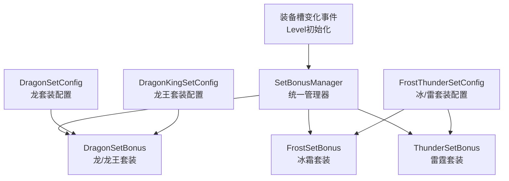
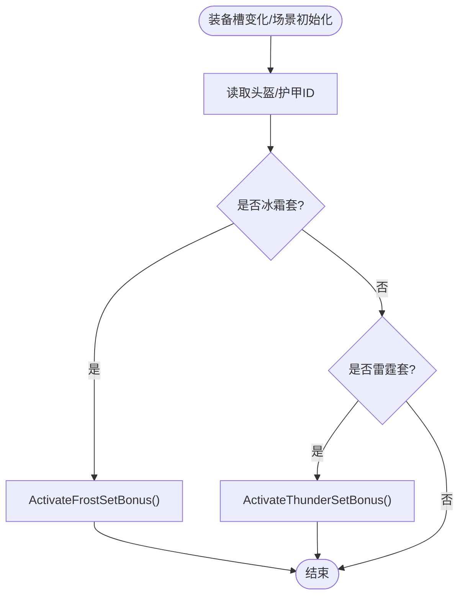
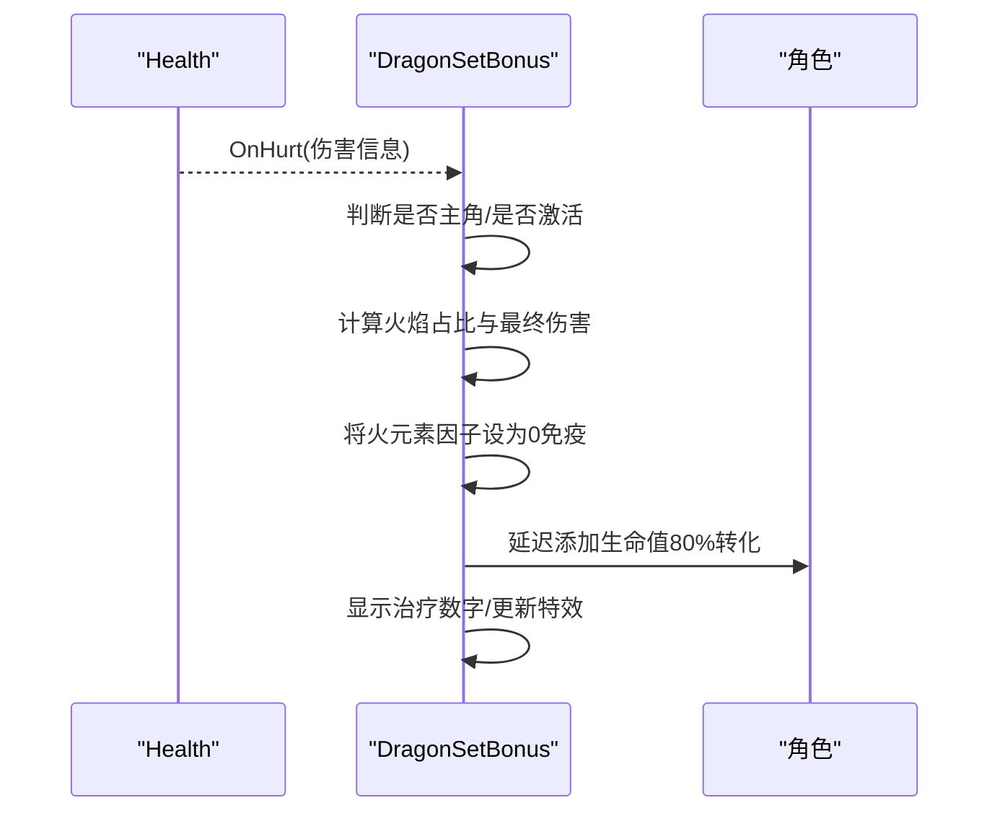
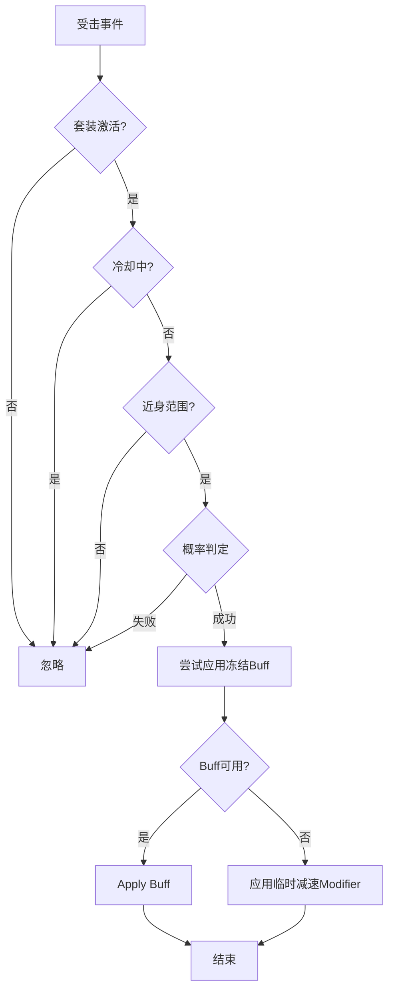
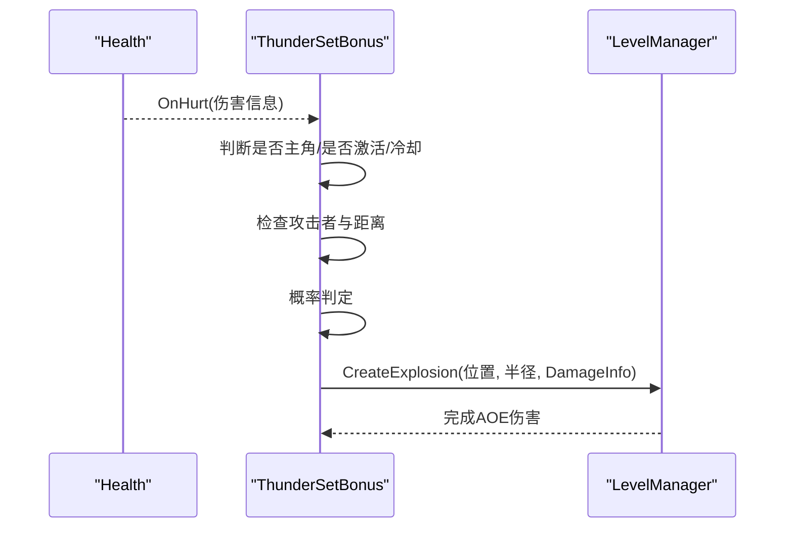
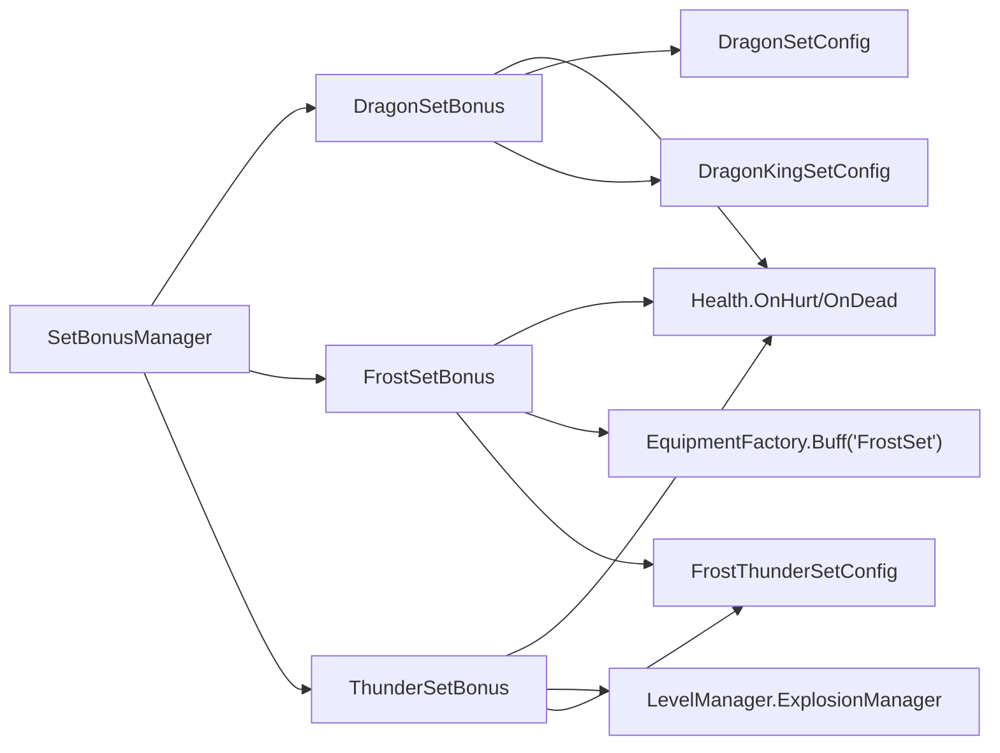

# 套装效果系统

<cite>
**本文引用的文件**
- [SetBonusManager.cs](file://Integration/Bonus/SetBonusManager.cs)
- [DragonSetBonus.cs](file://Integration/Bonus/DragonSetBonus.cs)
- [FrostSetBonus.cs](file://Integration/Bonus/FrostSetBonus.cs)
- [ThunderSetBonus.cs](file://Integration/Bonus/ThunderSetBonus.cs)
- [DragonSetConfig.cs](file://Integration/Config/DragonSetConfig.cs)
- [DragonKingSetConfig.cs](file://Integration/Config/DragonKingSetConfig.cs)
- [FrostThunderSetConfig.cs](file://Integration/Config/FrostThunderSetConfig.cs)
- [LootBlacklist.json](file://Assets/Data/LootBlacklist.json)
</cite>

## 目录
1. [简介](#简介)
2. [项目结构](#项目结构)
3. [核心组件](#核心组件)
4. [架构总览](#架构总览)
5. [详细组件分析](#详细组件分析)
6. [依赖关系分析](#依赖关系分析)
7. [性能考量](#性能考量)
8. [故障排查指南](#故障排查指南)
9. [结论](#结论)
10. [附录](#附录)

## 简介
本技术文档围绕 BossRushMod 的“套装效果系统”展开，系统性说明其整体架构、检测算法、属性加成计算与效果触发机制。文档覆盖四种套装的实现：龙套装（基础属性提升与龙息抗性）、龙王套装（高级属性与Boss伤害加成）、冰霜套装（冰系攻击强化与减速反制）、雷霆套装（电击伤害与连锁AOE）。同时解释配置方式、权重与平衡性调整方法、优先级与冲突处理策略，以及性能优化手段，并提供搭配建议与最佳实践。

## 项目结构
套装系统由“统一管理器 + 各套装实现 + 装备配置器”三部分构成：
- 统一管理器负责监听装备槽变化与场景加载事件，分发到具体套装模块进行激活/停用。
- 各套装实现分别处理自身特效、受击回调、属性修正等逻辑。
- 装备配置器负责为套装物品注入基础数值、标签、图标与本地化信息。



图表来源
- [SetBonusManager.cs:44-126](file://Integration/Bonus/SetBonusManager.cs#L44-L126)
- [DragonSetBonus.cs:80-115](file://Integration/Bonus/DragonSetBonus.cs#L80-L115)
- [FrostSetBonus.cs:62-148](file://Integration/Bonus/FrostSetBonus.cs#L62-L148)
- [ThunderSetBonus.cs:48-131](file://Integration/Bonus/ThunderSetBonus.cs#L48-L131)
- [DragonSetConfig.cs:62-108](file://Integration/Config/DragonSetConfig.cs#L62-L108)
- [DragonKingSetConfig.cs:52-98](file://Integration/Config/DragonKingSetConfig.cs#L52-L98)
- [FrostThunderSetConfig.cs:45-111](file://Integration/Config/FrostThunderSetConfig.cs#L45-L111)

章节来源
- [SetBonusManager.cs:44-126](file://Integration/Bonus/SetBonusManager.cs#L44-L126)
- [DragonSetBonus.cs:80-115](file://Integration/Bonus/DragonSetBonus.cs#L80-L115)
- [FrostSetBonus.cs:62-148](file://Integration/Bonus/FrostSetBonus.cs#L62-L148)
- [ThunderSetBonus.cs:48-131](file://Integration/Bonus/ThunderSetBonus.cs#L48-L131)
- [DragonSetConfig.cs:62-108](file://Integration/Config/DragonSetConfig.cs#L62-L108)
- [DragonKingSetConfig.cs:52-98](file://Integration/Config/DragonKingSetConfig.cs#L52-L98)
- [FrostThunderSetConfig.cs:45-111](file://Integration/Config/FrostThunderSetConfig.cs#L45-L111)

## 核心组件
- 统一管理器（SetBonusManager）：注册/注销事件，检测头盔与护甲槽变化，按TypeID匹配冰霜套与雷霆套并调用对应激活/停用。
- 龙/龙王套装（DragonSetBonus）：通过名称匹配龙头/龙甲或龙王之冕/龙王鳞铠；火焰伤害转治疗、物理减伤、龙眼红光特效。
- 冰霜套装（FrostSetBonus）：冰抗Modifier、受击概率冻结近身攻击者（优先自定义Buff，回退原版Cold，再回退临时减速Modifier）。
- 雷霆套装（ThunderSetBonus）：电抗Modifier、受击概率以玩家为中心释放电击AOE（使用ExplosionManager）。
- 配置器（DragonSetConfig / DragonKingSetConfig / FrostThunderSetConfig）：为套装物品设置护甲值、耐久度、元素抗性、标签、图标与本地化。

章节来源
- [SetBonusManager.cs:152-220](file://Integration/Bonus/SetBonusManager.cs#L152-L220)
- [DragonSetBonus.cs:240-351](file://Integration/Bonus/DragonSetBonus.cs#L240-L351)
- [FrostSetBonus.cs:62-148](file://Integration/Bonus/FrostSetBonus.cs#L62-L148)
- [ThunderSetBonus.cs:48-131](file://Integration/Bonus/ThunderSetBonus.cs#L48-L131)
- [DragonSetConfig.cs:62-108](file://Integration/Config/DragonSetConfig.cs#L62-L108)
- [DragonKingSetConfig.cs:52-98](file://Integration/Config/DragonKingSetConfig.cs#L52-L98)
- [FrostThunderSetConfig.cs:45-111](file://Integration/Config/FrostThunderSetConfig.cs#L45-L111)

## 架构总览
套装系统采用“事件驱动 + 模块化”的架构：
- 事件源：装备槽变化事件、场景加载完成事件。
- 路由层：SetBonusManager根据当前穿戴的头盔与护甲的TypeID或名称匹配，决定激活哪一套装。
- 执行层：各套装模块独立维护状态、注册/注销事件、添加/移除Modifier、创建/销毁特效。
- 数据层：配置器在物品创建阶段注入基础属性与展示资源。

```mermaid
sequenceDiagram
participant Game as "游戏引擎"
participant Manager as "SetBonusManager"
participant Dragon as "DragonSetBonus"
participant Frost as "FrostSetBonus"
participant Thunder as "ThunderSetBonus"
Game->>Manager : 装备槽变化/场景初始化
Manager->>Manager : 读取头盔/护甲ID或名称
alt 匹配冰霜套
Manager->>Frost : ActivateFrostSetBonus()
Frost-->>Manager : 已添加冰抗Modifier/注册受击事件
else 匹配雷霆套
Manager->>Thunder : ActivateThunderSetBonus()
Thunder-->>Manager : 已添加电抗Modifier/注册受击事件
end
Note over Dragon,Frost,Thunder : 龙/龙王套装由DragonSetBonus自行监听事件并检测
```

图表来源
- [SetBonusManager.cs:152-220](file://Integration/Bonus/SetBonusManager.cs#L152-L220)
- [DragonSetBonus.cs:240-351](file://Integration/Bonus/DragonSetBonus.cs#L240-L351)
- [FrostSetBonus.cs:62-148](file://Integration/Bonus/FrostSetBonus.cs#L62-L148)
- [ThunderSetBonus.cs:48-131](file://Integration/Bonus/ThunderSetBonus.cs#L48-L131)

## 详细组件分析

### 统一管理器（SetBonusManager）
- 职责：订阅装备槽变化与场景加载事件；在头盔/护甲槽变化时检查是否满足冰霜套或雷霆套条件；切换激活/停用状态。
- 检测算法：基于TypeID精确匹配（冰霜套与雷霆套），避免字符串匹配带来的不稳定。
- 生命周期管理：确保卸载时取消事件订阅并停用所有套装效果。



图表来源
- [SetBonusManager.cs:152-220](file://Integration/Bonus/SetBonusManager.cs#L152-L220)

章节来源
- [SetBonusManager.cs:44-126](file://Integration/Bonus/SetBonusManager.cs#L44-L126)
- [SetBonusManager.cs:152-220](file://Integration/Bonus/SetBonusManager.cs#L152-L220)

### 龙/龙王套装（DragonSetBonus）
- 检测算法：通过名称包含匹配“龙头/龙甲”或“龙王之冕/龙王鳞铠”，同时穿戴即激活。
- 属性加成：通过装备属性（如ElementFactor_Physics）提供物理减伤；龙王套装移除了毒承伤增加与视野减少的负面效果。
- 效果触发：拦截Health.OnHurt事件，将火焰伤害按比例转化为治疗（80%），并将火元素因子置零以实现免疫；同时创建龙眼红光特效并启动呼吸灯协程。
- 性能优化：缓存反射FieldInfo、头部Transform、避免重复查找。



图表来源
- [DragonSetBonus.cs:200-236](file://Integration/Bonus/DragonSetBonus.cs#L200-L236)
- [DragonSetBonus.cs:422-513](file://Integration/Bonus/DragonSetBonus.cs#L422-L513)
- [DragonSetBonus.cs:517-703](file://Integration/Bonus/DragonSetBonus.cs#L517-L703)

章节来源
- [DragonSetBonus.cs:240-351](file://Integration/Bonus/DragonSetBonus.cs#L240-L351)
- [DragonSetBonus.cs:422-513](file://Integration/Bonus/DragonSetBonus.cs#L422-L513)
- [DragonSetBonus.cs:517-703](file://Integration/Bonus/DragonSetBonus.cs#L517-L703)
- [DragonSetConfig.cs:62-108](file://Integration/Config/DragonSetConfig.cs#L62-L108)
- [DragonKingSetConfig.cs:52-98](file://Integration/Config/DragonKingSetConfig.cs#L52-L98)

### 冰霜套装（FrostSetBonus）
- 被动属性：为角色Item的ElementFactor_Ice添加负向Modifier，降低冰伤承受。
- 效果触发：受击时，若攻击者在近身范围内且冷却完毕，按概率对攻击者施加冻结（优先自定义Buff，回退至原版Cold，极端情况下用临时WalkSpeed/RunSpeed Modifier减速）。
- 生命周期：激活时注册Health.OnHurt/OnDead，停用时移除Modifier并停止仍在运行的减速协程。



图表来源
- [FrostSetBonus.cs:62-148](file://Integration/Bonus/FrostSetBonus.cs#L62-L148)
- [FrostSetBonus.cs:150-266](file://Integration/Bonus/FrostSetBonus.cs#L150-L266)
- [FrostSetBonus.cs:268-392](file://Integration/Bonus/FrostSetBonus.cs#L268-L392)

章节来源
- [FrostSetBonus.cs:62-148](file://Integration/Bonus/FrostSetBonus.cs#L62-L148)
- [FrostSetBonus.cs:150-266](file://Integration/Bonus/FrostSetBonus.cs#L150-L266)
- [FrostSetBonus.cs:268-392](file://Integration/Bonus/FrostSetBonus.cs#L268-L392)
- [FrostThunderSetConfig.cs:45-111](file://Integration/Config/FrostThunderSetConfig.cs#L45-L111)

### 雷霆套装（ThunderSetBonus）
- 被动属性：为角色Item的ElementFactor_Electricity添加负向Modifier，降低电伤承受。
- 效果触发：受击时，若攻击者在近身范围内且冷却完毕，按概率以玩家为中心释放电击AOE（DamageInfo标记爆炸与电元素，使用ExplosionManager）。
- 生命周期：激活时注册Health.OnHurt/OnDead，停用时移除Modifier并注销事件。



图表来源
- [ThunderSetBonus.cs:48-131](file://Integration/Bonus/ThunderSetBonus.cs#L48-L131)
- [ThunderSetBonus.cs:133-242](file://Integration/Bonus/ThunderSetBonus.cs#L133-L242)

章节来源
- [ThunderSetBonus.cs:48-131](file://Integration/Bonus/ThunderSetBonus.cs#L48-L131)
- [ThunderSetBonus.cs:133-242](file://Integration/Bonus/ThunderSetBonus.cs#L133-L242)
- [FrostThunderSetConfig.cs:45-111](file://Integration/Config/FrostThunderSetConfig.cs#L45-L111)

### 配置与数据
- 龙/龙王套装配置：为头盔与护甲设置护甲值、耐久度、风暴/寒冷防护、元素抗性、枪械爆头伤害加成等，并注入本地化与标签。
- 冰/雷套装配置：为四件套设置TypeID、品质、耐久度、基础护甲值、图标绑定与模型支持资源绑定。
- 掉落黑名单：LootBlacklist.json用于控制某些物品不在特定掉落池中生成，其中包含套装相关ID以避免重复或冲突。

章节来源
- [DragonSetConfig.cs:62-108](file://Integration/Config/DragonSetConfig.cs#L62-L108)
- [DragonKingSetConfig.cs:52-98](file://Integration/Config/DragonKingSetConfig.cs#L52-L98)
- [FrostThunderSetConfig.cs:45-111](file://Integration/Config/FrostThunderSetConfig.cs#L45-L111)
- [LootBlacklist.json:1-23](file://Assets/Data/LootBlacklist.json#L1-L23)

## 依赖关系分析
- 事件依赖：
  - SetBonusManager依赖CharacterMainControl的槽位变化事件与LevelManager的场景初始化事件。
  - DragonSetBonus、FrostSetBonus、ThunderSetBonus均依赖Health的静态事件（OnHurt/OnDead）。
- 资源依赖：
  - 冰霜套冻结优先使用自定义Buff（EquipmentFactory.GetLoadedBuff("FrostSet")），否则回退至原版Buffs.Cold。
  - 雷霆套AOE依赖LevelManager.Instance.ExplosionManager。
- 配置依赖：
  - 各套装配置器依赖EquipmentHelper进行Modifier注入与标签设置，依赖EquipmentLocalization进行本地化注入。



图表来源
- [SetBonusManager.cs:44-126](file://Integration/Bonus/SetBonusManager.cs#L44-L126)
- [DragonSetBonus.cs:200-236](file://Integration/Bonus/DragonSetBonus.cs#L200-L236)
- [FrostSetBonus.cs:150-266](file://Integration/Bonus/FrostSetBonus.cs#L150-L266)
- [ThunderSetBonus.cs:133-242](file://Integration/Bonus/ThunderSetBonus.cs#L133-L242)
- [DragonSetConfig.cs:62-108](file://Integration/Config/DragonSetConfig.cs#L62-L108)
- [DragonKingSetConfig.cs:52-98](file://Integration/Config/DragonKingSetConfig.cs#L52-L98)
- [FrostThunderSetConfig.cs:45-111](file://Integration/Config/FrostThunderSetConfig.cs#L45-L111)

章节来源
- [SetBonusManager.cs:44-126](file://Integration/Bonus/SetBonusManager.cs#L44-L126)
- [DragonSetBonus.cs:200-236](file://Integration/Bonus/DragonSetBonus.cs#L200-L236)
- [FrostSetBonus.cs:150-266](file://Integration/Bonus/FrostSetBonus.cs#L150-L266)
- [ThunderSetBonus.cs:133-242](file://Integration/Bonus/ThunderSetBonus.cs#L133-L242)
- [DragonSetConfig.cs:62-108](file://Integration/Config/DragonSetConfig.cs#L62-L108)
- [DragonKingSetConfig.cs:52-98](file://Integration/Config/DragonKingSetConfig.cs#L52-L98)
- [FrostThunderSetConfig.cs:45-111](file://Integration/Config/FrostThunderSetConfig.cs#L45-L111)

## 性能考量
- 事件与反射缓存：
  - 使用静态缓存FieldInfo避免重复反射开销（GetCachedSlotChangedEventField）。
  - 缓存头部Transform以减少每帧查找成本。
- 协程与对象生命周期：
  - 龙眼特效使用协程控制呼吸灯，激活/停用时正确Start/StopCoroutine。
  - 冰霜套fallback减速协程在卸装或死亡时统一清理，防止内存泄漏。
- 事件订阅边界：
  - 仅在套装激活时注册Health事件，停用后立即注销，避免全局热路径污染。
- 资源与渲染：
  - 龙眼Light使用Point Light且小范围、无阴影，降低渲染压力。
- 距离与范围判定：
  - 使用平方距离比较避免开方运算，提高判定效率。

章节来源
- [DragonSetBonus.cs:117-130](file://Integration/Bonus/DragonSetBonus.cs#L117-L130)
- [DragonSetBonus.cs:517-703](file://Integration/Bonus/DragonSetBonus.cs#L517-L703)
- [FrostSetBonus.cs:268-392](file://Integration/Bonus/FrostSetBonus.cs#L268-L392)
- [ThunderSetBonus.cs:187-242](file://Integration/Bonus/ThunderSetBonus.cs#L187-L242)

## 故障排查指南
- 套装未激活：
  - 检查装备槽是否为头盔/护甲槽，确认TypeID或名称匹配逻辑是否生效。
  - 查看日志输出，确认事件注册是否成功。
- 火焰转治疗无效：
  - 确认DragonSetBonus已激活且Health.OnHurt已注册。
  - 检查伤害信息中的elementFactors是否包含火元素。
- 冰霜冻结未触发：
  - 检查冷却时间、距离判定、概率判定。
  - 确认自定义Buff是否存在，若无则应回退至原版Cold或临时减速。
- 雷霆AOE未生效：
  - 检查LevelManager.Instance与ExplosionManager是否可用。
  - 确认DamageInfo是否正确标记爆炸与电元素。
- 资源缺失：
  - 冰霜套冻结Buff缺失时，会回退到原版Cold；若仍失败，会使用临时减速Modifier作为兜底。

章节来源
- [SetBonusManager.cs:152-220](file://Integration/Bonus/SetBonusManager.cs#L152-L220)
- [DragonSetBonus.cs:422-513](file://Integration/Bonus/DragonSetBonus.cs#L422-L513)
- [FrostSetBonus.cs:204-266](file://Integration/Bonus/FrostSetBonus.cs#L204-L266)
- [ThunderSetBonus.cs:187-242](file://Integration/Bonus/ThunderSetBonus.cs#L187-L242)

## 结论
BossRushMod的套装效果系统通过事件驱动与模块化设计，实现了稳定高效的套装检测、属性加成与效果触发。龙/龙王套装侧重生存与火焰转治疗，冰霜与雷霆套装提供防御与反击能力。系统在性能上注重事件边界、反射缓存与协程生命周期管理，确保运行时开销可控。配置器为套装注入基础属性与展示资源，保证内容一致性。

## 附录

### 套装配置与JSON格式说明
- 当前代码中套装配置以C#常量与静态方法形式实现，未使用外部JSON配置文件定义套装数值。
- LootBlacklist.json用于控制掉落池黑名单，包含套装相关ID以避免重复或冲突。
- 如需扩展JSON配置，建议在现有配置器基础上引入解析层，将常量迁移至JSON，并在TryConfigure中读取并应用。

章节来源
- [LootBlacklist.json:1-23](file://Assets/Data/LootBlacklist.json#L1-L23)
- [DragonSetConfig.cs:62-108](file://Integration/Config/DragonSetConfig.cs#L62-L108)
- [DragonKingSetConfig.cs:52-98](file://Integration/Config/DragonKingSetConfig.cs#L52-L98)
- [FrostThunderSetConfig.cs:45-111](file://Integration/Config/FrostThunderSetConfig.cs#L45-L111)

### 属性权重与平衡性调整建议
- 龙/龙王套装：
  - 物理减伤与元素抗性可通过配置器中的常量调整，注意避免过度叠加导致无敌。
  - 火焰转治疗比例（80%）可依据Boss强度调优。
- 冰霜套装：
  - 冻结概率、冷却时间、近身范围可根据战斗节奏调整。
  - 冰抗Modifier幅度需与其他冰系增益协调。
- 雷霆套装：
  - 电击伤害、范围、冷却时间与概率需与Boss血量曲线匹配。
  - 电抗Modifier幅度应与整体电系环境一致。

[本节为通用指导，不直接分析具体文件]

### 优先级与冲突解决
- 套装互斥：头盔与护甲槽同时只能穿戴一套，天然互斥。
- 属性叠加：Modifier按系统规则叠加，注意固定值与百分比类型的不同影响。
- 效果冲突：冰霜与雷霆均为受击触发，但各自独立；龙/龙王套装的火焰免疫与冰/雷的受击触发不冲突。

[本节为通用指导，不直接分析具体文件]

### 搭配指南与最佳实践
- 生存向：龙/龙王套装适合高火伤环境，配合高护甲与元素抗性。
- 控制向：冰霜套装适合近战密集场景，利用冻结打断敌人节奏。
- 反击向：雷霆套装适合面对高攻速敌人，利用AOE电击清场。
- 混合搭配：根据Boss特性选择主副套装，避免重复属性堆叠导致收益递减。

[本节为通用指导，不直接分析具体文件]