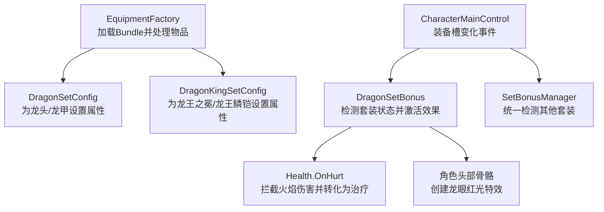
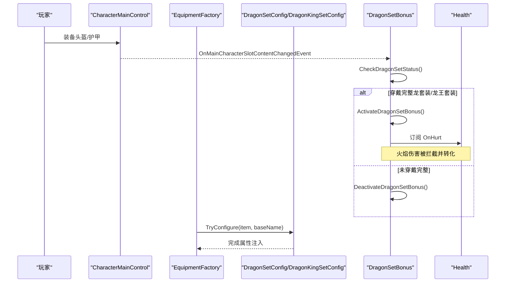
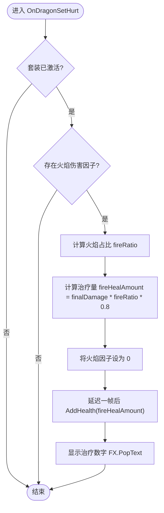
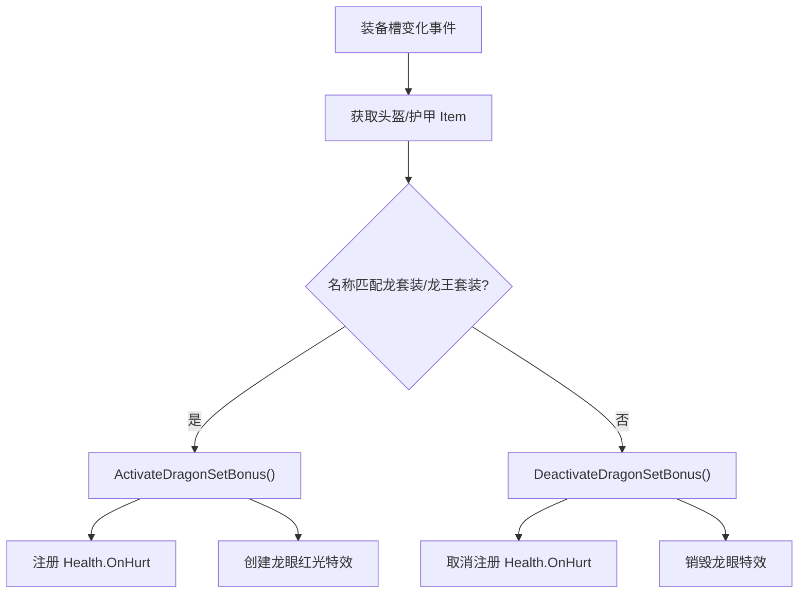
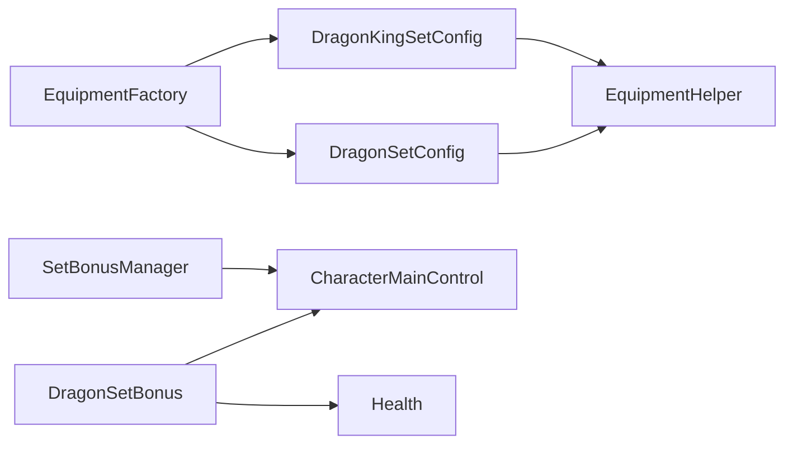

# 龙套装效果

<cite>
**本文引用的文件**
- [DragonSetBonus.cs](file://Integration/Bonus/DragonSetBonus.cs)
- [DragonSetConfig.cs](file://Integration/Config/DragonSetConfig.cs)
- [DragonKingSetConfig.cs](file://Integration/Config/DragonKingSetConfig.cs)
- [EquipmentFactory_ItemProcessing.cs](file://Integration/EquipmentFactory_ItemProcessing.cs)
- [EquipmentFactory.cs](file://Integration/EquipmentFactory.cs)
- [SetBonusManager.cs](file://Integration/Bonus/SetBonusManager.cs)
</cite>

## 目录
1. [简介](#简介)
2. [项目结构](#项目结构)
3. [核心组件](#核心组件)
4. [架构总览](#架构总览)
5. [详细组件分析](#详细组件分析)
6. [依赖关系分析](#依赖关系分析)
7. [性能考量](#性能考量)
8. [故障排查指南](#故障排查指南)
9. [结论](#结论)
10. [附录：配置与实战建议](#附录：配置与实战建议)

## 简介
本技术文档聚焦 BossRushMod 中的“龙套装”效果系统，覆盖以下要点：
- 基础属性提升机制（护甲、耐久度、元素抗性、视野、爆头伤害等）
- 龙息抗性实现原理（火焰伤害减免与转化为治疗的比例、触发条件）
- 套装检测算法（如何识别玩家装备的龙头/龙甲或龙王之冕/龙王鳞铠）
- DragonSetConfig 配置文件结构（各部件属性权重与平衡性参数）
- 搭配建议与实战应用（与其他装备组合策略）

## 项目结构
与龙套装相关的代码主要分布在 Integration 目录下，按职责划分为：
- 配置层：DragonSetConfig、DragonKingSetConfig
- 运行时效果层：DragonSetBonus（含火焰转治疗、龙眼特效、事件注册）
- 装备加载与注入：EquipmentFactory、EquipmentFactory_ItemProcessing
- 套装统一调度：SetBonusManager（统一管理多套装备的检测与激活）

图表来源
- [EquipmentFactory.cs:692-699](file://Integration/EquipmentFactory.cs#L692-L699)
- [DragonSetConfig.cs:62-108](file://Integration/Config/DragonSetConfig.cs#L62-L108)
- [DragonKingSetConfig.cs:52-98](file://Integration/Config/DragonKingSetConfig.cs#L52-L98)
- [DragonSetBonus.cs:80-115](file://Integration/Bonus/DragonSetBonus.cs#L80-L115)
- [DragonSetBonus.cs:240-351](file://Integration/Bonus/DragonSetBonus.cs#L240-L351)
- [SetBonusManager.cs:44-86](file://Integration/Bonus/SetBonusManager.cs#L44-L86)

章节来源
- [EquipmentFactory.cs:692-699](file://Integration/EquipmentFactory.cs#L692-L699)
- [DragonSetConfig.cs:62-108](file://Integration/Config/DragonSetConfig.cs#L62-L108)
- [DragonKingSetConfig.cs:52-98](file://Integration/Config/DragonKingSetConfig.cs#L52-L98)
- [DragonSetBonus.cs:80-115](file://Integration/Bonus/DragonSetBonus.cs#L80-L115)
- [SetBonusManager.cs:44-86](file://Integration/Bonus/SetBonusManager.cs#L44-L86)

## 核心组件
- DragonSetConfig：负责为“龙头”和“龙甲”注入基础属性（护甲值、耐久度、元素抗性、风暴/寒冷防护、爆头伤害加成、视野角度等），并添加可维修与特殊标签。
- DragonKingSetConfig：负责为“龙王之冕”和“龙王鳞铠”注入更优属性（移除毒抗负面与视野减少，提高物理/火/电抗性，提升爆头伤害）。
- DragonSetBonus：监听装备槽变化，检测是否穿戴完整龙套装或龙王套装；激活后注册伤害事件，将火焰伤害按比例转化为治疗，并创建龙眼红光特效。
- EquipmentFactory / EquipmentFactory_ItemProcessing：从 AssetBundle 加载自定义装备，自动识别类型并调用相应配置器（包括龙套装与龙王套装）。
- SetBonusManager：统一管理其他套装（冰霜套、雷霆套）的检测与激活，与龙套装并行运行且互不干扰。

章节来源
- [DragonSetConfig.cs:62-202](file://Integration/Config/DragonSetConfig.cs#L62-L202)
- [DragonKingSetConfig.cs:52-187](file://Integration/Config/DragonKingSetConfig.cs#L52-L187)
- [DragonSetBonus.cs:240-513](file://Integration/Bonus/DragonSetBonus.cs#L240-L513)
- [EquipmentFactory.cs:692-699](file://Integration/EquipmentFactory.cs#L692-L699)
- [SetBonusManager.cs:130-220](file://Integration/Bonus/SetBonusManager.cs#L130-L220)

## 架构总览
龙套装系统的整体流程如下：
- 装备加载阶段：EquipmentFactory 扫描并加载 AssetBundle，识别物品类型，调用 DragonSetConfig/DragonKingSetConfig 注入属性。
- 运行时检测阶段：当 CharacterMainControl 的装备槽发生变化时，DragonSetBonus 与 SetBonusManager 分别检测对应套装状态。
- 效果激活阶段：若检测到完整龙套装或龙王套装，则激活火焰转治疗、龙眼特效等；若未穿戴完整，则停用效果。
- 伤害处理阶段：通过订阅 Health.OnHurt，在主角受到伤害时判断是否为火焰伤害，并将一定比例转化为治疗。

图表来源
- [DragonSetBonus.cs:80-115](file://Integration/Bonus/DragonSetBonus.cs#L80-L115)
- [DragonSetBonus.cs:240-351](file://Integration/Bonus/DragonSetBonus.cs#L240-L351)
- [DragonSetBonus.cs:422-513](file://Integration/Bonus/DragonSetBonus.cs#L422-L513)
- [EquipmentFactory.cs:692-699](file://Integration/EquipmentFactory.cs#L692-L699)
- [DragonSetConfig.cs:62-108](file://Integration/Config/DragonSetConfig.cs#L62-L108)
- [DragonKingSetConfig.cs:52-98](file://Integration/Config/DragonKingSetConfig.cs#L52-L98)

## 详细组件分析

### 基础属性提升机制
- 龙头（赤龙首）：
  - 护甲值：HeadArmor +7
  - 耐久度：MaxDurability = 200
  - 风暴防护：StormProtection +1
  - 寒冷防护：ColdProtection +1
  - 枪械爆头伤害加成：GunCritDamageGain +10%
  - 元素承伤倍率调整：
    - 物理：ElementFactor_Physics -0.1
    - 火：ElementFactor_Fire -0.15
    - 电：ElementFactor_Electricity -0.15
    - 毒：ElementFactor_Poison +0.3（增加中毒伤害）
  - 视野角度：ViewAngle -20%
- 龙甲（焰鳞甲）：
  - 护甲值：BodyArmor +7
  - 耐久度：MaxDurability = 200
  - 风暴防护：StormProtection +1
  - 寒冷防护：ColdProtection +1
  - 元素承伤倍率调整：
    - 物理：ElementFactor_Physics -0.2
    - 火：ElementFactor_Fire -0.2
    - 电：ElementFactor_Electricity -0.2
    - 毒：ElementFactor_Poison +0.4（增加中毒伤害）
- 龙王之冕（对比龙头）：
  - 爆头伤害加成提升至 +15%
  - 物理/火/电抗性更强（-0.15/-0.2/-0.2）
  - 移除毒抗负面与视野减少
- 龙王鳞铠（对比龙甲）：
  - 物理/火/电抗性更强（-0.25）
  - 移除毒抗负面

这些属性通过 EquipmentHelper.AddModifierToItem 与 SetItemConstant 注入到 Item 对象中，并在装备加载阶段生效。

章节来源
- [DragonSetConfig.cs:36-61](file://Integration/Config/DragonSetConfig.cs#L36-L61)
- [DragonSetConfig.cs:113-158](file://Integration/Config/DragonSetConfig.cs#L113-L158)
- [DragonSetConfig.cs:163-202](file://Integration/Config/DragonSetConfig.cs#L163-L202)
- [DragonKingSetConfig.cs:27-50](file://Integration/Config/DragonKingSetConfig.cs#L27-L50)
- [DragonKingSetConfig.cs:103-144](file://Integration/Config/DragonKingSetConfig.cs#L103-L144)
- [DragonKingSetConfig.cs:149-187](file://Integration/Config/DragonKingSetConfig.cs#L149-L187)

### 龙息抗性效果实现原理
- 触发条件：
  - 玩家同时穿戴完整龙套装（龙头+龙甲）或龙王套装（龙王之冕+龙王鳞铠）
  - 仅对主角生效（IsMainCharacterHealth）
- 伤害处理逻辑：
  - 订阅 Health.OnHurt，读取 DamageInfo.elementFactors
  - 计算火焰伤害占比：fireRatio = fireFactor / totalFactor
  - 实际火焰伤害：actualFireDamage = finalDamage * fireRatio
  - 转化为治疗：fireHealAmount = actualFireDamage * 0.8（80%）
  - 将火焰因子设为 0，实现“免疫火焰伤害”
  - 延迟一帧后调用 health.AddHealth(fireHealAmount)，并显示治疗数字
- 视觉效果：
  - 在角色头部附近创建两个点光源作为“龙眼”，强度在 5~15 之间呼吸波动

图表来源
- [DragonSetBonus.cs:422-513](file://Integration/Bonus/DragonSetBonus.cs#L422-L513)

章节来源
- [DragonSetBonus.cs:422-513](file://Integration/Bonus/DragonSetBonus.cs#L422-L513)

### 套装检测算法
- 事件来源：
  - 监听 CharacterMainControl.OnMainCharacterSlotContentChangedEvent（装备槽变化）
  - 场景加载完成后检查（LevelManager.OnAfterLevelInitialized），处理已穿戴装备进入游戏的情况
- 检测逻辑：
  - 获取当前头盔与护甲 Item
  - 名称匹配：
    - 标准龙套装：包含“龙头”、“龙甲”
    - 龙王套装：包含“龙王之冕”、“龙王鳞铠”
  - 若同时穿戴头盔与护甲，则激活套装；否则停用
- 性能优化：
  - 使用缓存的 FieldInfo 避免重复反射
  - 缓存头部 Transform 以快速定位龙眼特效挂载点

图表来源
- [DragonSetBonus.cs:80-115](file://Integration/Bonus/DragonSetBonus.cs#L80-L115)
- [DragonSetBonus.cs:240-351](file://Integration/Bonus/DragonSetBonus.cs#L240-L351)
- [DragonSetBonus.cs:517-703](file://Integration/Bonus/DragonSetBonus.cs#L517-L703)

章节来源
- [DragonSetBonus.cs:80-115](file://Integration/Bonus/DragonSetBonus.cs#L80-L115)
- [DragonSetBonus.cs:240-351](file://Integration/Bonus/DragonSetBonus.cs#L240-L351)
- [DragonSetBonus.cs:517-703](file://Integration/Bonus/DragonSetBonus.cs#L517-L703)

### DragonSetConfig 配置文件结构
- 常量定义：
  - DRAGON_HELM_ARMOR、DRAGON_ARMOR_ARMOR：护甲值
  - DRAGON_HELM_DURABILITY、DRAGON_ARMOR_DURABILITY：耐久度
  - 各元素承伤倍率（ElementFactor_*）
  - StormProtection、ColdProtection：环境防护
  - GunCritDamageGain：爆头伤害加成
  - ViewAngle：视野角度
- 配置方法：
  - TryConfigure(item, baseName)：根据基础名识别是否为龙套装物品
  - ConfigureEquipment(item, isHelm)：分发至具体配置函数
  - ConfigureDragonHelm/ConfigureDragonArmor：注入属性、标签、本地化

章节来源
- [DragonSetConfig.cs:32-61](file://Integration/Config/DragonSetConfig.cs#L32-L61)
- [DragonSetConfig.cs:62-108](file://Integration/Config/DragonSetConfig.cs#L62-L108)
- [DragonSetConfig.cs:113-202](file://Integration/Config/DragonSetConfig.cs#L113-L202)

### 装备加载与注入流程
- EquipmentFactory.LoadAllEquipment 或 LoadBundle：
  - 扫描 Assets/Equipment 目录下的 AssetBundle
  - 解析物品类型（头盔、护甲等）
  - 调用 DragonSetConfig.TryConfigure 与 DragonKingSetConfig.TryConfigure 注入属性
  - 注册到游戏物品系统（ItemAssetsCollection）

章节来源
- [EquipmentFactory.cs:176-215](file://Integration/EquipmentFactory.cs#L176-L215)
- [EquipmentFactory.cs:692-699](file://Integration/EquipmentFactory.cs#L692-L699)

## 依赖关系分析
- EquipmentFactory 依赖 DragonSetConfig 与 DragonKingSetConfig 进行属性注入
- DragonSetBonus 依赖 CharacterMainControl 的事件系统与 Health 的伤害事件
- SetBonusManager 与 DragonSetBonus 并行运行，互不干扰
- 所有属性修改通过 EquipmentHelper 完成，确保与游戏 ItemStatsSystem 兼容

图表来源
- [EquipmentFactory.cs:692-699](file://Integration/EquipmentFactory.cs#L692-L699)
- [DragonSetBonus.cs:80-115](file://Integration/Bonus/DragonSetBonus.cs#L80-L115)
- [DragonSetBonus.cs:422-513](file://Integration/Bonus/DragonSetBonus.cs#L422-L513)
- [SetBonusManager.cs:44-86](file://Integration/Bonus/SetBonusManager.cs#L44-L86)

章节来源
- [EquipmentFactory.cs:692-699](file://Integration/EquipmentFactory.cs#L692-L699)
- [DragonSetBonus.cs:80-115](file://Integration/Bonus/DragonSetBonus.cs#L80-L115)
- [SetBonusManager.cs:44-86](file://Integration/Bonus/SetBonusManager.cs#L44-L86)

## 性能考量
- 事件注册与缓存：
  - 使用静态缓存 FieldInfo 避免重复反射
  - 仅在装备槽变化时检测套装状态，避免轮询
- 特效管理：
  - 头部 Transform 缓存，减少查找开销
  - 协程控制龙眼呼吸灯，避免每帧复杂计算
- 伤害处理：
  - 延迟一帧添加生命值，避免在伤害计算中间修改状态
  - 仅对主角生效，减少无关计算

章节来源
- [DragonSetBonus.cs:62-75](file://Integration/Bonus/DragonSetBonus.cs#L62-L75)
- [DragonSetBonus.cs:117-130](file://Integration/Bonus/DragonSetBonus.cs#L117-L130)
- [DragonSetBonus.cs:517-557](file://Integration/Bonus/DragonSetBonus.cs#L517-L557)
- [DragonSetBonus.cs:492-513](file://Integration/Bonus/DragonSetBonus.cs#L492-L513)

## 故障排查指南
- 套装未激活：
  - 检查装备槽变化事件是否正确注册
  - 确认物品名称是否包含“龙头/龙甲”或“龙王之冕/龙王鳞铠”
- 火焰伤害未转化为治疗：
  - 确认 Health.OnHurt 已订阅
  - 检查 DamageInfo.elementFactors 是否存在火焰因子
- 龙眼特效异常：
  - 检查头部 Transform 是否成功找到并缓存
  - 确认协程未被提前停止

章节来源
- [DragonSetBonus.cs:80-115](file://Integration/Bonus/DragonSetBonus.cs#L80-L115)
- [DragonSetBonus.cs:240-351](file://Integration/Bonus/DragonSetBonus.cs#L240-L351)
- [DragonSetBonus.cs:422-513](file://Integration/Bonus/DragonSetBonus.cs#L422-L513)
- [DragonSetBonus.cs:517-703](file://Integration/Bonus/DragonSetBonus.cs#L517-L703)

## 结论
BossRushMod 的龙套装系统通过配置层与运行时层的清晰分离，实现了稳定的属性注入与动态效果激活。其核心优势在于：
- 高可读性的配置结构，便于平衡性调整
- 事件驱动的检测机制，避免性能浪费
- 灵活的火焰伤害转化逻辑，提供独特的生存体验
- 与龙王套装的平滑升级路径，提升后期玩法深度

## 附录：配置与实战建议
- 配置重点：
  - 调整 ElementFactor_* 以平衡元素抗性
  - 调整 GunCritDamageGain 影响输出能力
  - 考虑 ViewAngle 对视野的影响
- 实战搭配：
  - 对抗火焰系敌人：龙套装提供火焰免疫与治疗，显著提升生存
  - 搭配高暴击武器：利用爆头伤害加成提升输出
  - 注意毒系敌人：龙套装增加中毒伤害，需配合解毒手段或选择龙王套装
- 升级建议：
  - 获得龙王套装后立即替换，移除毒抗负面与视野减少，提升综合性能

章节来源
- [DragonSetConfig.cs:36-61](file://Integration/Config/DragonSetConfig.cs#L36-L61)
- [DragonKingSetConfig.cs:27-50](file://Integration/Config/DragonKingSetConfig.cs#L27-L50)
- [DragonSetBonus.cs:422-513](file://Integration/Bonus/DragonSetBonus.cs#L422-L513)