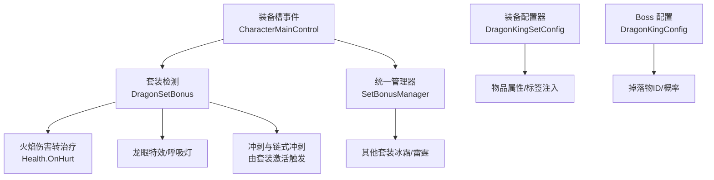
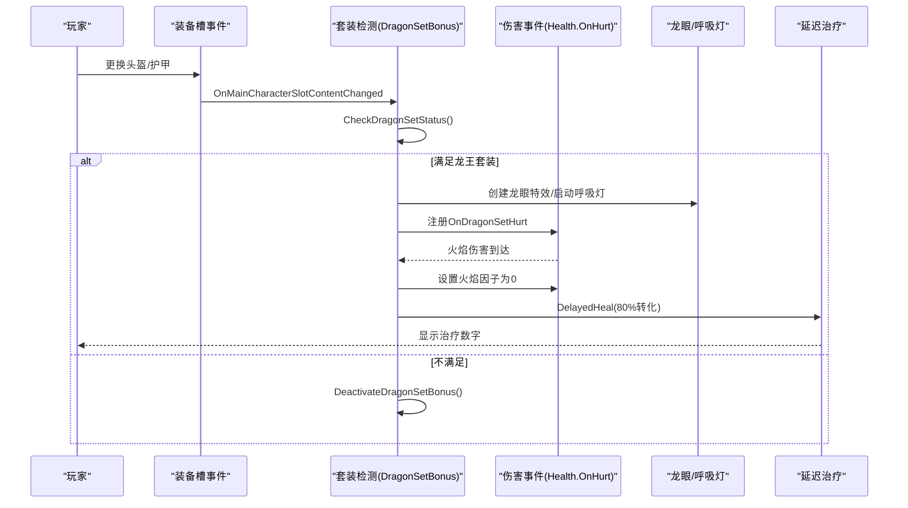
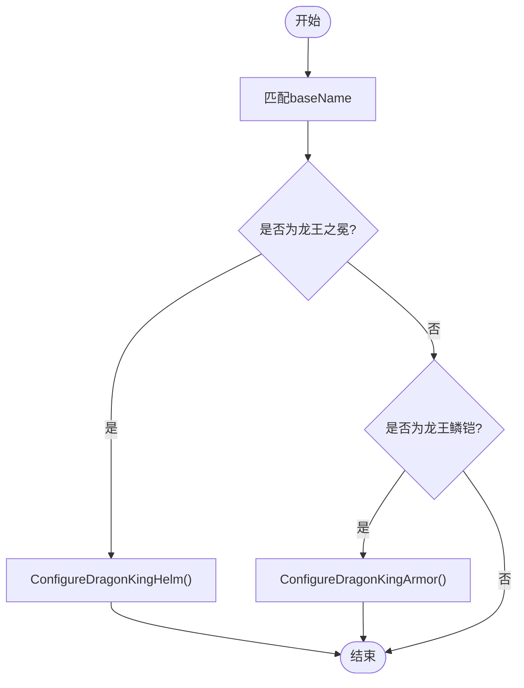
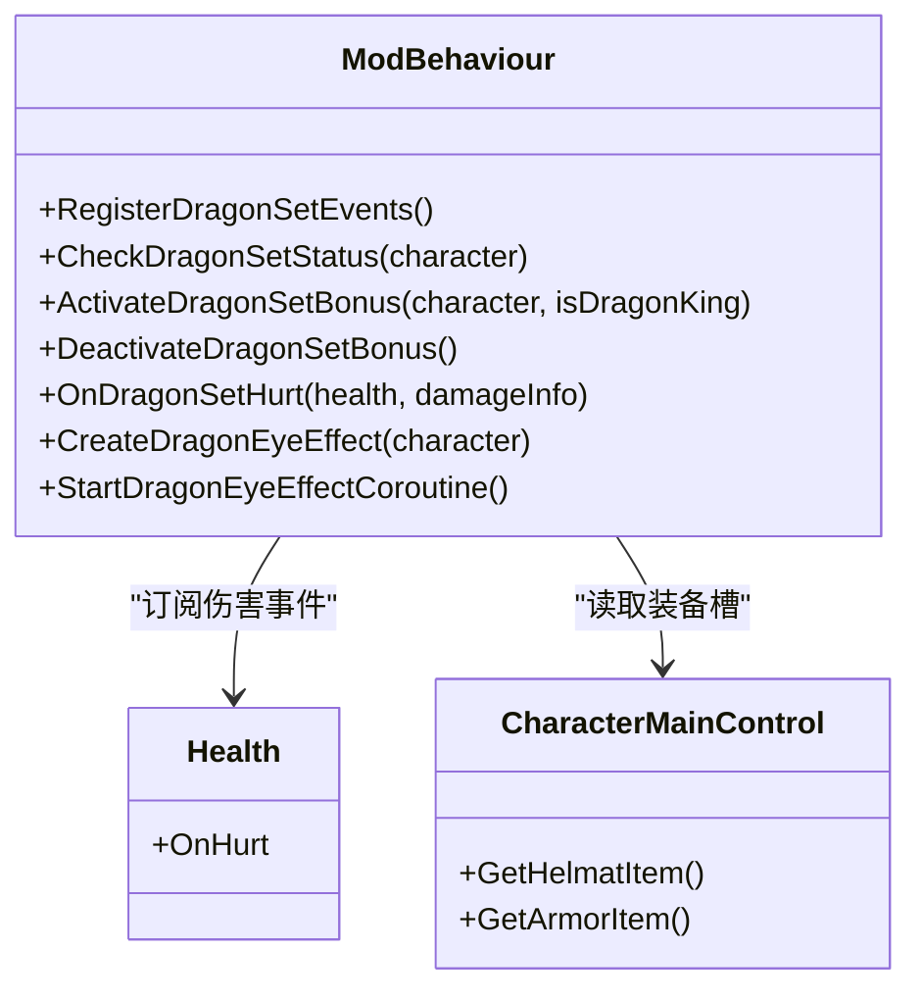
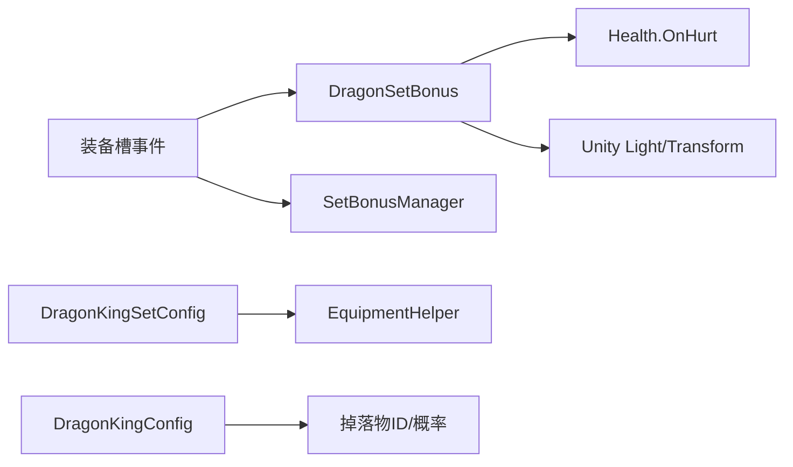

# 龙王套装效果

<cite>
**本文引用的文件**
- [DragonKingSetConfig.cs](file://Integration/Config/DragonKingSetConfig.cs)
- [DragonSetBonus.cs](file://Integration/Bonus/DragonSetBonus.cs)
- [SetBonusManager.cs](file://Integration/Bonus/SetBonusManager.cs)
- [EquipmentEffectManager.cs](file://Common/Equipment/EquipmentEffectManager.cs)
- [DragonKingConfig.cs](file://Integration/DragonKing/DragonKingConfig.cs)
</cite>

## 目录
1. [简介](#简介)
2. [项目结构](#项目结构)
3. [核心组件](#核心组件)
4. [架构总览](#架构总览)
5. [详细组件分析](#详细组件分析)
6. [依赖关系分析](#依赖关系分析)
7. [性能考量](#性能考量)
8. [故障排查指南](#故障排查指南)
9. [结论](#结论)
10. [附录](#附录)

## 简介
本技术文档聚焦 BossRushMod 中的“龙王套装”（龙王之冕 + 龙王鳞铠）效果系统，系统性说明其高级属性加成机制、Boss 伤害加成的实现原理与优先级处理、配置项 DragonKingSetConfig 的高级选项，以及在高难度挑战下的应用策略与技能协同。文档以源码为依据，提供可追溯的章节来源与图示来源，便于读者深入理解并扩展。

## 项目结构
龙王套装相关代码主要分布在以下模块：
- 配置层：DragonKingSetConfig.cs 负责龙王套装物品基础属性与标签注入。
- 运行时效果层：DragonSetBonus.cs 负责套装检测、火焰伤害转治疗、龙眼特效与冲刺联动等。
- 统一管理器：SetBonusManager.cs 统一管理多套装备（冰霜套、雷霆套等），与龙王套装并行运行、互不干扰。
- 通用能力基类：EquipmentEffectManager.cs 提供装备槽变化监听、激活/停用生命周期管理。
- Boss 配置：DragonKingConfig.cs 定义龙王 Boss 的基础参数与掉落物 ID，用于关联套装获取与战斗环境。

图表来源
- [DragonSetBonus.cs:83-115](file://Integration/Bonus/DragonSetBonus.cs#L83-L115)
- [SetBonusManager.cs:47-86](file://Integration/Bonus/SetBonusManager.cs#L47-L86)
- [DragonKingSetConfig.cs:55-98](file://Integration/Config/DragonKingSetConfig.cs#L55-L98)
- [DragonKingConfig.cs:600-671](file://Integration/DragonKing/DragonKingConfig.cs#L600-L671)

章节来源
- [DragonSetBonus.cs:83-115](file://Integration/Bonus/DragonSetBonus.cs#L83-L115)
- [SetBonusManager.cs:47-86](file://Integration/Bonus/SetBonusManager.cs#L47-L86)
- [DragonKingSetConfig.cs:55-98](file://Integration/Config/DragonKingSetConfig.cs#L55-L98)
- [DragonKingConfig.cs:600-671](file://Integration/DragonKing/DragonKingConfig.cs#L600-L671)

## 核心组件
- 龙王套装配置器（DragonKingSetConfig）
  - 通过 baseName 匹配预制体名称，识别龙王之冕与龙王鳞铠，并为其注入护甲值、耐久度、元素抗性修正、风暴/寒冷防护、枪械爆头伤害增益、可维修与 Special 标签，以及本地化文本。
  - 移除毒元素承伤增加与视野角度减少等负面效果，确保龙王套装在生存与体验上优于普通龙套装。
- 套装效果运行时（DragonSetBonus）
  - 监听装备槽变化与场景加载完成事件，检测是否同时穿戴龙头+龙甲或龙王之冕+龙王鳞铠。
  - 激活时注册 Health.OnHurt 事件，将火焰伤害按最终伤害比例转化为治疗（80%），并将火焰因子置零以实现免疫。
  - 创建龙眼红光特效与呼吸灯协程；支持龙王专属冲刺（首段6m、冷却0.5s）与链式冲刺（0.15s内方向输入追加3m），并在路径生成岩浆轨迹对敌人持续灼烧。
- 统一套装管理器（SetBonusManager）
  - 复用已缓存的事件字段，订阅同一装备槽变化事件，检测冰霜套与雷霆套状态，与龙王套装并行运行且天然互斥（头盔+护甲唯一）。
- 装备效果基类（EquipmentEffectManager）
  - 提供统一的装备槽监听、场景切换保护、激活/停用生命周期钩子，避免重复反射与频繁 GetComponent 开销。

章节来源
- [DragonKingSetConfig.cs:55-187](file://Integration/Config/DragonKingSetConfig.cs#L55-L187)
- [DragonSetBonus.cs:83-115](file://Integration/Bonus/DragonSetBonus.cs#L83-L115)
- [DragonSetBonus.cs:245-351](file://Integration/Bonus/DragonSetBonus.cs#L245-L351)
- [DragonSetBonus.cs:427-513](file://Integration/Bonus/DragonSetBonus.cs#L427-L513)
- [SetBonusManager.cs:47-86](file://Integration/Bonus/SetBonusManager.cs#L47-L86)
- [EquipmentEffectManager.cs:107-166](file://Common/Equipment/EquipmentEffectManager.cs#L107-L166)

## 架构总览
龙王套装的效果链路如下：
- 装备槽变化事件触发 → 套装检测 → 若满足条件则激活效果（注册伤害事件、创建特效、启动协程）。
- 伤害事件拦截 → 计算火焰占比 → 免疫火焰并转化为治疗 → 显示治疗数字。
- 套装管理器与其他套装并行运行，通过 TypeID 精确匹配，避免名称歧义。
- 配置器在物品初始化阶段注入属性与标签，确保套装生效时的数值表现稳定。

图表来源
- [DragonSetBonus.cs:83-115](file://Integration/Bonus/DragonSetBonus.cs#L83-L115)
- [DragonSetBonus.cs:245-351](file://Integration/Bonus/DragonSetBonus.cs#L245-L351)
- [DragonSetBonus.cs:427-513](file://Integration/Bonus/DragonSetBonus.cs#L427-L513)

## 详细组件分析

### 龙王套装配置器（DragonKingSetConfig）
- 功能要点
  - 通过 baseName 匹配“dragonking_Helmet”与“dragonking_Armor”，调用 ConfigureEquipment 分别配置头盔与护甲。
  - 注入固定元素抗性修正（物理、火、电），风暴/寒冷防护提升，枪械爆头伤害增益，耐久度与护甲值上限。
  - 添加可维修标签与 Special 标签，注入本地化文本。
- 复杂度与优化
  - 配置过程为一次性操作，时间复杂度 O(1)。
  - 使用字符串常量与大小写不敏感比较，降低误匹配风险。
- 错误处理
  - 配置过程中捕获异常并记录日志，保证健壮性。

图表来源
- [DragonKingSetConfig.cs:55-98](file://Integration/Config/DragonKingSetConfig.cs#L55-L98)
- [DragonKingSetConfig.cs:103-143](file://Integration/Config/DragonKingSetConfig.cs#L103-L143)
- [DragonKingSetConfig.cs:149-187](file://Integration/Config/DragonKingSetConfig.cs#L149-L187)

章节来源
- [DragonKingSetConfig.cs:55-187](file://Integration/Config/DragonKingSetConfig.cs#L55-L187)

### 套装效果运行时（DragonSetBonus）
- 功能要点
  - 事件注册：订阅装备槽变化与场景加载完成事件，确保进入存档时也能正确检测套装。
  - 套装检测：读取头盔与护甲的 DisplayName/DisplayNameRaw，匹配标准龙套装与龙王套装；当两者均穿戴时激活。
  - 火焰伤害转治疗：在 OnDragonSetHurt 中计算火焰占比，将火焰因子置零，并按最终伤害的80%进行延迟治疗。
  - 龙眼特效：动态创建点光源，绑定到头部骨骼，循环调整光强形成呼吸灯。
  - 冲刺与链式冲刺：激活后启用龙王专属冲刺（首段6m、冷却0.5s），0.15s内方向输入触发链式冲刺（追加3m），路径生成岩浆轨迹对敌人持续灼烧。
- 复杂度与优化
  - 事件驱动，仅在槽位变化或伤害发生时执行，避免轮询。
  - 使用静态缓存 FieldInfo 与头部 Transform，减少反射与查找开销。
- 错误处理
  - 多处 try-catch 包裹关键逻辑，记录异常信息，防止崩溃。

图表来源
- [DragonSetBonus.cs:83-115](file://Integration/Bonus/DragonSetBonus.cs#L83-L115)
- [DragonSetBonus.cs:245-351](file://Integration/Bonus/DragonSetBonus.cs#L245-L351)
- [DragonSetBonus.cs:427-513](file://Integration/Bonus/DragonSetBonus.cs#L427-L513)
- [DragonSetBonus.cs:562-608](file://Integration/Bonus/DragonSetBonus.cs#L562-L608)

章节来源
- [DragonSetBonus.cs:83-115](file://Integration/Bonus/DragonSetBonus.cs#L83-L115)
- [DragonSetBonus.cs:245-351](file://Integration/Bonus/DragonSetBonus.cs#L245-L351)
- [DragonSetBonus.cs:427-513](file://Integration/Bonus/DragonSetBonus.cs#L427-L513)
- [DragonSetBonus.cs:562-608](file://Integration/Bonus/DragonSetBonus.cs#L562-L608)

### 统一套装管理器（SetBonusManager）
- 功能要点
  - 复用 DragonSetBonus 缓存的事件字段，订阅同一装备槽变化事件。
  - 通过 TypeID 精确匹配冰霜套与雷霆套，独立维护激活状态，与龙王套装并行运行。
  - 场景加载完成后统一检查所有套装状态，确保一致性。
- 设计原则
  - 各套装之间天然互斥（头盔+护甲唯一），因此不会发生冲突。
  - 类型匹配比名称匹配更可靠，避免本地化或命名变更导致的误判。

章节来源
- [SetBonusManager.cs:47-86](file://Integration/Bonus/SetBonusManager.cs#L47-L86)
- [SetBonusManager.cs:135-220](file://Integration/Bonus/SetBonusManager.cs#L135-L220)

### 装备效果基类（EquipmentEffectManager）
- 功能要点
  - 提供装备槽变化监听、场景切换保护、激活/停用生命周期钩子。
  - 通过反射调用能力管理器的 RegisterAbility/UnregisterAbility，解耦具体能力实现。
  - 缓存角色 Item 组件，避免每帧 GetComponent 带来的性能损耗。
- 适用场景
  - 适用于需要基于装备槽变化自动激活/停用的各类能力与套装效果。

章节来源
- [EquipmentEffectManager.cs:107-166](file://Common/Equipment/EquipmentEffectManager.cs#L107-L166)
- [EquipmentEffectManager.cs:205-304](file://Common/Equipment/EquipmentEffectManager.cs#L205-L304)
- [EquipmentEffectManager.cs:311-364](file://Common/Equipment/EquipmentEffectManager.cs#L311-L364)

## 依赖关系分析
- 事件依赖
  - 装备槽变化事件：CharacterMainControl.OnMainCharacterSlotContentChangedEvent，被 DragonSetBonus 与 SetBonusManager 共同订阅。
  - 伤害事件：Health.OnHurt，仅在被激活的套装期间订阅，避免全局开销。
- 配置依赖
  - DragonKingSetConfig 依赖 EquipmentHelper 注入属性与标签。
  - DragonKingConfig 提供掉落物 TypeID 与概率，用于关联套装获取。
- 运行时依赖
  - 特效依赖 Unity Light 与 Transform 查找（头部骨骼）。
  - 冲刺与链式冲刺依赖输入系统与移动控制（由套装激活后启用）。

图表来源
- [DragonSetBonus.cs:83-115](file://Integration/Bonus/DragonSetBonus.cs#L83-L115)
- [SetBonusManager.cs:47-86](file://Integration/Bonus/SetBonusManager.cs#L47-L86)
- [DragonKingSetConfig.cs:55-98](file://Integration/Config/DragonKingSetConfig.cs#L55-L98)
- [DragonKingConfig.cs:600-671](file://Integration/DragonKing/DragonKingConfig.cs#L600-L671)

章节来源
- [DragonSetBonus.cs:83-115](file://Integration/Bonus/DragonSetBonus.cs#L83-L115)
- [SetBonusManager.cs:47-86](file://Integration/Bonus/SetBonusManager.cs#L47-L86)
- [DragonKingSetConfig.cs:55-98](file://Integration/Config/DragonKingSetConfig.cs#L55-L98)
- [DragonKingConfig.cs:600-671](file://Integration/DragonKing/DragonKingConfig.cs#L600-L671)

## 性能考量
- 事件驱动而非轮询：仅在装备槽变化或伤害发生时执行逻辑，降低 CPU 占用。
- 反射缓存：缓存 OnMainCharacterSlotContentChangedEvent 的 FieldInfo，避免重复反射。
- Transform 缓存：缓存头部 Transform，减少每次特效挂载时的查找成本。
- 场景切换保护：EquipmentEffectManager 在场景卸载时设置保护标记，防止误停用能力，减少不必要的状态切换。
- 特效优化：使用轻量 Point Light 与协程控制呼吸灯强度，避免高开销粒子系统。

章节来源
- [DragonSetBonus.cs:118-130](file://Integration/Bonus/DragonSetBonus.cs#L118-L130)
- [DragonSetBonus.cs:562-608](file://Integration/Bonus/DragonSetBonus.cs#L562-L608)
- [EquipmentEffectManager.cs:143-166](file://Common/Equipment/EquipmentEffectManager.cs#L143-L166)

## 故障排查指南
- 套装未激活
  - 检查装备槽是否正确更新，查看日志输出“装备槽变化”。
  - 确认头盔与护甲名称包含匹配关键字（标准龙套装或龙王套装）。
- 火焰伤害未转化为治疗
  - 确认套装已激活（dragonSetActive 为 true）。
  - 检查 Health.OnHurt 是否已注册，查看日志“已注册伤害事件”。
  - 验证 DamageInfo.elementFactors 中是否存在火焰因子。
- 龙眼特效未显示
  - 检查头部 Transform 是否找到，查看日志“未找到头部 Transform”。
  - 确认 Light 组件已成功添加并配置。
- 套装管理器与其他套装冲突
  - 确认 TypeID 匹配正确，避免名称歧义。
  - 检查场景加载后是否统一检查了所有套装状态。

章节来源
- [DragonSetBonus.cs:245-351](file://Integration/Bonus/DragonSetBonus.cs#L245-L351)
- [DragonSetBonus.cs:427-513](file://Integration/Bonus/DragonSetBonus.cs#L427-L513)
- [DragonSetBonus.cs:562-608](file://Integration/Bonus/DragonSetBonus.cs#L562-L608)
- [SetBonusManager.cs:135-220](file://Integration/Bonus/SetBonusManager.cs#L135-L220)

## 结论
龙王套装在数值与体验上全面超越普通龙套装：移除毒元素承伤增加与视野角度减少，提供更强的元素抗性与枪械爆头伤害增益；运行时实现火焰伤害免疫与80%转化为治疗，配合龙眼特效与高机动冲刺，显著提升高难度挑战中的生存与输出效率。通过统一管理器与基类设计，套装效果模块化、可扩展且性能友好。建议在高难度环境中优先使用龙王套装，并结合技能系统（如近战连招与跳跃攻击）最大化收益。

## 附录
- 高级属性加成机制
  - 龙王之冕：物理承伤倍率固定降低、风暴/寒冷防护提升、枪械爆头伤害增益、火/电承伤倍率固定降低。
  - 龙王鳞铠：物理承伤倍率固定降低、风暴/寒冷防护提升、火/电承伤倍率固定降低。
  - 套装效果：火焰伤害免疫并转化为治疗（80%）、龙眼特效、龙王冲刺（首段6m、冷却0.5s）、链式冲刺（0.15s内追加3m）、岩浆轨迹灼烧。
- Boss 伤害加成与计算公式
  - 火焰伤害占比 = 火焰因子 / 总因子
  - 实际火焰伤害 = 最终伤害 × 火焰占比
  - 治疗量 = 实际火焰伤害 × 0.8
  - 火焰因子置零以实现免疫。
- 优先级处理机制
  - 套装检测优先于其他套装（TypeID 匹配），与冰霜套、雷霆套并行运行且互斥。
  - 伤害事件仅在套装激活期间订阅，避免全局影响。
- 配置项（DragonKingSetConfig）
  - 物品基础名匹配、属性注入、标签与本地化。
  - 移除负面效果（毒元素承伤增加、视野角度减少）。
- 高难度挑战策略
  - 利用龙王冲刺快速接近目标，结合链式冲刺调整位置。
  - 在火焰密集区域主动吸收伤害转化为治疗，提升续航。
  - 与技能系统协同：近战连招叠加标记后使用终结技引爆，配合套装冲刺创造输出窗口。