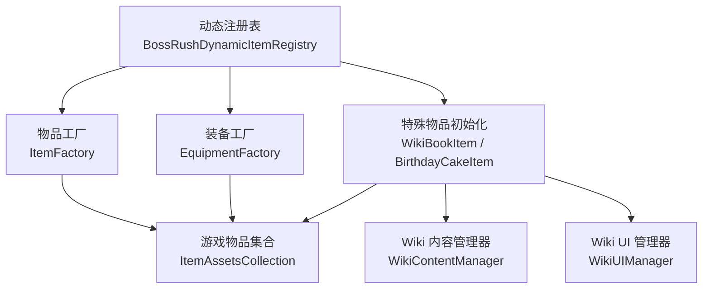
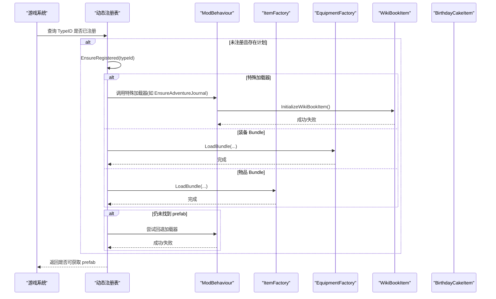
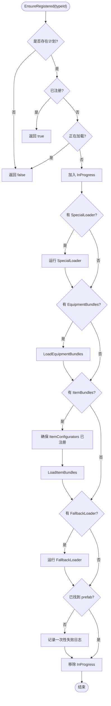
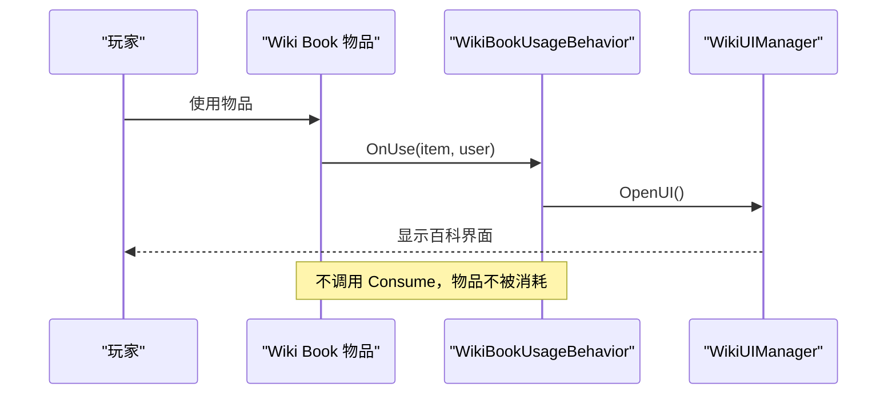
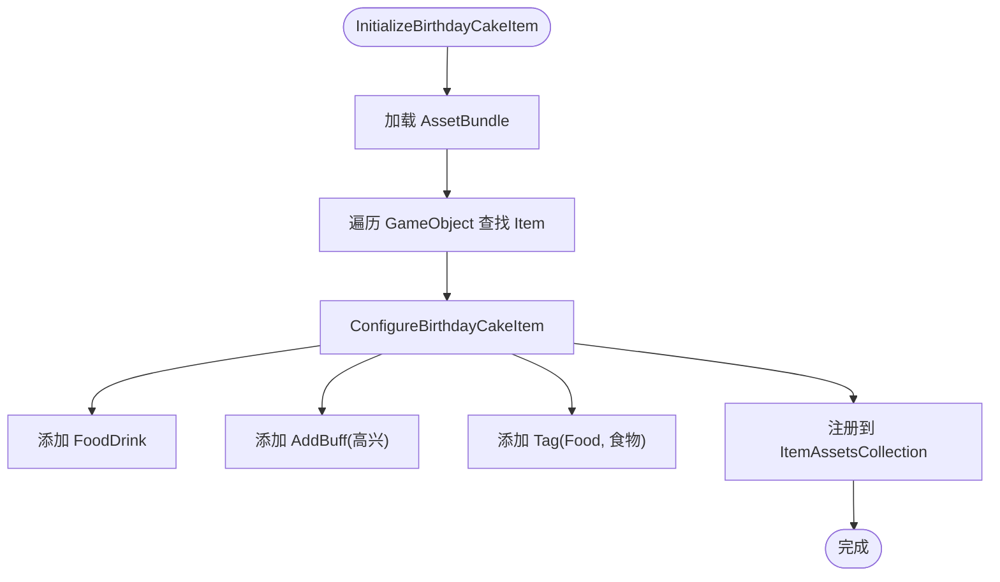
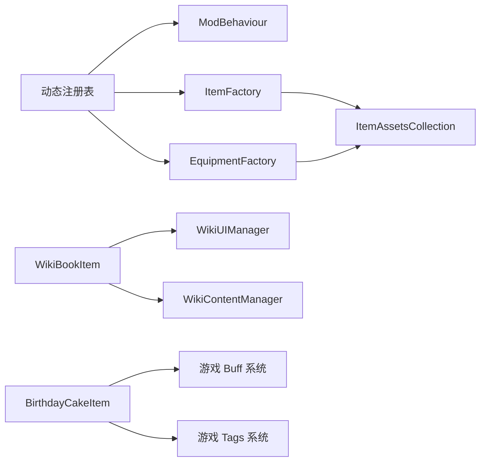

# 物品管理与注册

<cite>
**本文引用的文件**
- [BossRushDynamicItemRegistry.cs](file://Integration/BossRushDynamicItemRegistry.cs)
- [ItemContentRegistry.cs](file://Integration/Items/ItemContentRegistry.cs)
- [ItemFactory.cs](file://Integration/ItemFactory.cs)
- [EquipmentFactory.cs](file://Integration/EquipmentFactory.cs)
- [WikiBookItem.cs](file://Integration/WikiBookItem.cs)
- [BirthdayCakeItem.cs](file://Integration/BirthdayCakeItem.cs)
- [WikiContentManager.cs](file://Integration/WikiContentManager.cs)
- [WikiUIManager.cs](file://Integration/WikiUIManager.cs)
</cite>

## 目录
1. [简介](#简介)
2. [项目结构](#项目结构)
3. [核心组件](#核心组件)
4. [架构总览](#架构总览)
5. [详细组件分析](#详细组件分析)
6. [依赖关系分析](#依赖关系分析)
7. [性能与内存优化](#性能与内存优化)
8. [故障排查指南](#故障排查指南)
9. [结论](#结论)
10. [附录：自定义物品开发指南](#附录自定义物品开发指南)

## 简介
本技术文档围绕 BossRushMod 的物品管理与注册系统展开，重点说明动态物品注册机制、TypeID 分配策略与冲突检测、特殊物品（Wiki百科书、生日蛋糕）的实现逻辑，以及物品生命周期管理、内存优化与资源清理策略。同时解释物品与游戏系统的集成方式（库存、掉落、交易），并提供自定义物品的开发指南与最佳实践。

## 项目结构
BossRushMod 将“物品注册”和“内容加载”解耦为多个层次：
- 动态按需注册层：在官方系统按 TypeID 查询时再加载所需资源，避免启动期全量加载。
- 工厂层：提供统一的 AssetBundle 加载、配置器调用与注册到游戏物品系统的入口。
- 特殊物品层：针对 Wiki 百科书与生日蛋糕等复杂行为进行专用实现。
- UI 与内容层：Wiki 百科书的 UI 管理器与 Markdown 内容解析。

图表来源
- [BossRushDynamicItemRegistry.cs:15-159](file://Integration/BossRushDynamicItemRegistry.cs#L15-L159)
- [ItemFactory.cs:52-117](file://Integration/ItemFactory.cs#L52-L117)
- [EquipmentFactory.cs:132-249](file://Integration/EquipmentFactory.cs#L132-L249)
- [WikiBookItem.cs:90-144](file://Integration/WikiBookItem.cs#L90-L144)
- [BirthdayCakeItem.cs:98-167](file://Integration/BirthdayCakeItem.cs#L98-L167)
- [WikiContentManager.cs:196-231](file://Integration/WikiContentManager.cs#L196-L231)
- [WikiUIManager.cs:110-150](file://Integration/WikiUIManager.cs#L110-L150)

章节来源
- [BossRushDynamicItemRegistry.cs:15-159](file://Integration/BossRushDynamicItemRegistry.cs#L15-L159)
- [ItemFactory.cs:52-117](file://Integration/ItemFactory.cs#L52-L117)
- [EquipmentFactory.cs:132-249](file://Integration/EquipmentFactory.cs#L132-L249)

## 核心组件
- 动态物品注册表：维护每个 TypeID 的“注册计划”，按需加载 Bundle、执行特殊加载器或回退加载器，确保在官方系统请求时可用。
- 物品工厂：从 Assets/Items 下的 AssetBundle 加载消耗品类物品，支持自动扫描、缓存、配置器回调与注册。
- 装备工厂：从 Assets/Equipment 下加载装备/武器/Buff/子弹，自动识别类型并关联模型、设置标签与属性。
- 特殊物品：
  - Wiki 百科书：从 AssetBundle 加载 UI 与物品预制体，注入使用行为打开 Wiki UI，不消耗物品。
  - 生日蛋糕：从 AssetBundle 加载物品预制体，添加食物效果与高兴 Buff，支持商店与本地化。
- Wiki 内容与 UI：内容管理器负责 catalog.tsv 索引与 Markdown 解析；UI 管理器负责书本式翻页展示。

章节来源
- [BossRushDynamicItemRegistry.cs:15-159](file://Integration/BossRushDynamicItemRegistry.cs#L15-L159)
- [ItemFactory.cs:52-117](file://Integration/ItemFactory.cs#L52-L117)
- [EquipmentFactory.cs:132-249](file://Integration/EquipmentFactory.cs#L132-L249)
- [WikiBookItem.cs:90-144](file://Integration/WikiBookItem.cs#L90-L144)
- [BirthdayCakeItem.cs:98-167](file://Integration/BirthdayCakeItem.cs#L98-L167)
- [WikiContentManager.cs:196-231](file://Integration/WikiContentManager.cs#L196-L231)
- [WikiUIManager.cs:110-150](file://Integration/WikiUIManager.cs#L110-L150)

## 架构总览
动态注册流程以“延迟加载 + 兜底注册”为核心，保证在存档/商店/UI 等早期路径中也能找到物品 prefab。

图表来源
- [BossRushDynamicItemRegistry.cs:47-159](file://Integration/BossRushDynamicItemRegistry.cs#L47-L159)
- [BossRushDynamicItemRegistry.cs:265-351](file://Integration/BossRushDynamicItemRegistry.cs#L265-L351)
- [BossRushDynamicItemRegistry.cs:386-412](file://Integration/BossRushDynamicItemRegistry.cs#L386-L412)
- [ItemFactory.cs:163-192](file://Integration/ItemFactory.cs#L163-L192)
- [EquipmentFactory.cs:220-249](file://Integration/EquipmentFactory.cs#L220-L249)
- [WikiBookItem.cs:90-144](file://Integration/WikiBookItem.cs#L90-L144)
- [BirthdayCakeItem.cs:98-167](file://Integration/BirthdayCakeItem.cs#L98-L167)

## 详细组件分析

### 动态物品注册表（BossRushDynamicItemRegistry）
- 设计要点
  - 维护 RegistrationPlan 映射：指定需加载的 EquipmentBundles、ItemBundles、SpecialLoader、FallbackLoader。
  - 并发安全：InProgress 集合防止重复加载同一 TypeID。
  - 防递归：prefabCheckDepth 用于绕过检查循环。
  - 失败去重日志：FailureLogged 仅记录一次失败信息。
- 关键流程
  - EnsureRegistered：按优先级执行 SpecialLoader → 装备 Bundle → 物品 Bundle → FallbackLoader。
  - EnsureItemConfiguratorsRegisteredForDynamicRegistry：懒注册 Item 配置器，确保后续配置生效。
  - BuildPlans：集中声明所有受管 TypeID 及其加载计划。
- 冲突检测与 TypeID 策略
  - 通过 Plans 字典集中管理 TypeID 与加载计划，避免分散注册导致的冲突。
  - 若目标 TypeID 未找到 prefab，会记录一次性警告，便于定位缺失 Bundle 或配置错误。
  - 对部分 TypeID 提供回退加载器（如新武器占位符、套装占位符），保障兼容性。

图表来源
- [BossRushDynamicItemRegistry.cs:47-159](file://Integration/BossRushDynamicItemRegistry.cs#L47-L159)
- [BossRushDynamicItemRegistry.cs:161-185](file://Integration/BossRushDynamicItemRegistry.cs#L161-L185)
- [BossRushDynamicItemRegistry.cs:265-351](file://Integration/BossRushDynamicItemRegistry.cs#L265-L351)

章节来源
- [BossRushDynamicItemRegistry.cs:15-159](file://Integration/BossRushDynamicItemRegistry.cs#L15-L159)
- [BossRushDynamicItemRegistry.cs:265-351](file://Integration/BossRushDynamicItemRegistry.cs#L265-L351)
- [BossRushDynamicItemRegistry.cs:386-412](file://Integration/BossRushDynamicItemRegistry.cs#L386-L412)

### 物品工厂（ItemFactory）
- 职责
  - 从 Assets/Items 下扫描并加载 AssetBundle。
  - 缓存已加载 Bundle、Sprite、Item 预制体。
  - 支持 RegisterConfigurator 回调，在加载后对物品进行二次配置。
  - 提供库存操作工具方法（统计数量、消耗物品）。
- 关键点
  - 避免重复加载：loadedBundles 集合。
  - 图标加载：优先从 Bundle 取 Sprite，否则尝试从文件加载并缓存。
  - 注册到游戏：AddDynamicEntry 将物品加入 ItemAssetsCollection。

章节来源
- [ItemFactory.cs:52-117](file://Integration/ItemFactory.cs#L52-L117)
- [ItemFactory.cs:163-192](file://Integration/ItemFactory.cs#L163-L192)
- [ItemFactory.cs:213-310](file://Integration/ItemFactory.cs#L213-L310)
- [ItemFactory.cs:531-607](file://Integration/ItemFactory.cs#L531-L607)

### 装备工厂（EquipmentFactory）
- 职责
  - 从 Assets/Equipment 下扫描并加载 AssetBundle。
  - 自动识别装备/武器/图腾/近战武器类型，并匹配模型、Buff、子弹。
  - 为装备添加 Tag、注入模型、绑定 Handheld 代理、应用套装配置。
- 关键点
  - 名称解析：根据 Prefab 命名规则推断类型与基础名。
  - 武器处理：自动关联同名 Bullet 与 Buff，必要时清除误识别的 Gun 组件。
  - 近战武器：注册 TypeID 以避免被误识别为枪械。

章节来源
- [EquipmentFactory.cs:132-249](file://Integration/EquipmentFactory.cs#L132-L249)
- [EquipmentFactory.cs:402-494](file://Integration/EquipmentFactory.cs#L402-L494)
- [EquipmentFactory.cs:501-749](file://Integration/EquipmentFactory.cs#L501-L749)

### Wiki 百科书（WikiBookItem）
- 功能
  - 从 AssetBundle 加载 Wiki UI 与书籍物品预制体。
  - 配置物品为耐久度模式（高耐久值），添加 UsageUtilities 与 WikiBookUsageBehavior。
  - 打开 UI 时不消耗物品，支持本地化注入。
- 交互逻辑
  - CanBeUsed 始终返回 true。
  - OnUse 调用 WikiUIManager.Instance.OpenUI()，不调用 Consume。
- 资源管理
  - 加载完成后卸载 AssetBundle，避免内存泄漏。

图表来源
- [WikiBookItem.cs:309-339](file://Integration/WikiBookItem.cs#L309-L339)
- [WikiUIManager.cs:110-150](file://Integration/WikiUIManager.cs#L110-L150)

章节来源
- [WikiBookItem.cs:90-144](file://Integration/WikiBookItem.cs#L90-L144)
- [WikiBookItem.cs:240-290](file://Integration/WikiBookItem.cs#L240-L290)
- [WikiBookItem.cs:309-339](file://Integration/WikiBookItem.cs#L309-L339)

### 生日蛋糕（BirthdayCakeItem）
- 功能
  - 从 AssetBundle 加载物品预制体，添加 FoodDrink（恢复饱食度）、AddBuff（高兴 Buff）、Tag（食物）。
  - 配置音效、本地化、商店注入。
  - 12 月份自动赠送生日蛋糕至玩家背包，并显示祝福横幅。
- 道具效果
  - 食物：恢复 100% 饱食度，一次性消耗。
  - Buff：查找“高兴”相关 Buff 并附加，概率 100%。
  - Tag：标记为“Food”、“食物”。
- 动画与反馈
  - 使用游戏内通知系统显示祝福语横幅。
  - 调试接口支持手动给予蛋糕并显示横幅。

图表来源
- [BirthdayCakeItem.cs:98-167](file://Integration/BirthdayCakeItem.cs#L98-L167)
- [BirthdayCakeItem.cs:172-252](file://Integration/BirthdayCakeItem.cs#L172-L252)
- [BirthdayCakeItem.cs:258-337](file://Integration/BirthdayCakeItem.cs#L258-L337)
- [BirthdayCakeItem.cs:342-406](file://Integration/BirthdayCakeItem.cs#L342-L406)

章节来源
- [BirthdayCakeItem.cs:98-167](file://Integration/BirthdayCakeItem.cs#L98-L167)
- [BirthdayCakeItem.cs:172-252](file://Integration/BirthdayCakeItem.cs#L172-L252)
- [BirthdayCakeItem.cs:258-337](file://Integration/BirthdayCakeItem.cs#L258-L337)
- [BirthdayCakeItem.cs:342-406](file://Integration/BirthdayCakeItem.cs#L342-L406)
- [BirthdayCakeItem.cs:439-539](file://Integration/BirthdayCakeItem.cs#L439-L539)

### Wiki 内容与 UI（WikiContentManager / WikiUIManager）
- 内容管理
  - 加载 catalog.tsv 索引，构建分类与条目数据。
  - 根据语言选择目录，读取 .md 内容文件。
  - Markdown 解析：标题、粗体、列表、代码、链接、提示块等转换为 TMP 富文本。
- UI 管理
  - 单例管理 UI 生命周期，缓存节点，绑定事件。
  - 目录页与正文页切换，书本式分页显示。
  - 字体替换与排版优化，避免长标题换行问题。

章节来源
- [WikiContentManager.cs:196-231](file://Integration/WikiContentManager.cs#L196-L231)
- [WikiContentManager.cs:280-323](file://Integration/WikiContentManager.cs#L280-L323)
- [WikiContentManager.cs:332-395](file://Integration/WikiContentManager.cs#L332-L395)
- [WikiUIManager.cs:110-150](file://Integration/WikiUIManager.cs#L110-L150)
- [WikiUIManager.cs:156-185](file://Integration/WikiUIManager.cs#L156-L185)
- [WikiUIManager.cs:391-446](file://Integration/WikiUIManager.cs#L391-L446)

## 依赖关系分析
- 动态注册表依赖 ModBehaviour 暴露的特殊加载器与配置器注册方法。
- 物品工厂与装备工厂均向 ItemAssetsCollection 注册动态条目，供游戏系统统一访问。
- Wiki 百科书依赖 WikiUIManager 与 WikiContentManager 提供 UI 与内容。
- 生日蛋糕依赖游戏 Buff 系统与 Tags 系统进行效果与标识。

图表来源
- [BossRushDynamicItemRegistry.cs:15-159](file://Integration/BossRushDynamicItemRegistry.cs#L15-L159)
- [ItemFactory.cs:531-607](file://Integration/ItemFactory.cs#L531-L607)
- [EquipmentFactory.cs:501-749](file://Integration/EquipmentFactory.cs#L501-L749)
- [WikiBookItem.cs:90-144](file://Integration/WikiBookItem.cs#L90-L144)
- [BirthdayCakeItem.cs:172-252](file://Integration/BirthdayCakeItem.cs#L172-L252)

章节来源
- [BossRushDynamicItemRegistry.cs:15-159](file://Integration/BossRushDynamicItemRegistry.cs#L15-L159)
- [ItemFactory.cs:531-607](file://Integration/ItemFactory.cs#L531-L607)
- [EquipmentFactory.cs:501-749](file://Integration/EquipmentFactory.cs#L501-L749)
- [WikiBookItem.cs:90-144](file://Integration/WikiBookItem.cs#L90-L144)
- [BirthdayCakeItem.cs:172-252](file://Integration/BirthdayCakeItem.cs#L172-L252)

## 性能与内存优化
- 延迟加载：动态注册表仅在需要时加载 Bundle，减少启动开销。
- 缓存策略：
  - ItemFactory/EquipmentFactory 缓存已加载 Bundle、Sprite、Item、Buff、Bullet。
  - WikiContentManager 缓存分类与条目数据。
- 资源清理：
  - AssetBundle 加载后立即卸载（WikiBookItem、BirthdayCakeItem）。
  - ItemFactory.Shutdown 清理静态缓存并卸载 Bundle。
- 防重复与并发控制：
  - InProgress 集合防止重复加载。
  - FailureLogged 避免重复日志输出。
- UI 优化：
  - WikiUIManager 缓存 UI 节点，避免重复查找。
  - 字体替换与排版优化，减少重绘与换行问题。

章节来源
- [BossRushDynamicItemRegistry.cs:15-159](file://Integration/BossRushDynamicItemRegistry.cs#L15-L159)
- [ItemFactory.cs:52-117](file://Integration/ItemFactory.cs#L52-L117)
- [ItemFactory.cs:612-631](file://Integration/ItemFactory.cs#L612-L631)
- [WikiBookItem.cs:150-235](file://Integration/WikiBookItem.cs#L150-L235)
- [BirthdayCakeItem.cs:98-167](file://Integration/BirthdayCakeItem.cs#L98-L167)
- [WikiContentManager.cs:184-191](file://Integration/WikiContentManager.cs#L184-L191)
- [WikiUIManager.cs:156-185](file://Integration/WikiUIManager.cs#L156-L185)

## 故障排查指南
- 动态注册失败
  - 检查 EnsureRegistered 是否命中计划，确认 Bundle 路径与名称正确。
  - 查看一次性失败日志，定位缺失 Bundle 或配置错误。
- 物品未注册
  - 确认 ItemFactory.RegisterConfigurator 已调用，且配置器逻辑正确。
  - 检查 AddDynamicEntry 是否成功。
- Wiki UI 无法打开
  - 确认 AssetBundle 中存在 Wiki UI 与书籍物品预制体。
  - 检查 WikiUIManager 初始化是否成功，节点缓存是否完整。
- 生日蛋糕效果异常
  - 检查“高兴”Buff 是否能在 allBuffs 中找到。
  - 确认 Tag 添加成功，食物效果参数正确。

章节来源
- [BossRushDynamicItemRegistry.cs:255-263](file://Integration/BossRushDynamicItemRegistry.cs#L255-L263)
- [ItemFactory.cs:531-607](file://Integration/ItemFactory.cs#L531-L607)
- [WikiBookItem.cs:150-235](file://Integration/WikiBookItem.cs#L150-L235)
- [BirthdayCakeItem.cs:258-337](file://Integration/BirthdayCakeItem.cs#L258-L337)

## 结论
BossRushMod 的物品管理系统通过动态注册、工厂抽象与特殊物品专用实现，实现了高效、可扩展且稳定的物品注册与使用流程。延迟加载与缓存策略显著降低了启动与运行时开销，而完善的资源清理与故障日志提升了可维护性。Wiki 百科书与生日蛋糕展示了复杂物品行为的实现范式，为后续扩展提供了参考。

## 附录：自定义物品开发指南
- 新增物品步骤
  - 准备 AssetBundle，包含物品预制体与必要资源。
  - 在动态注册表中添加 TypeID 与加载计划（Bundle 名称、特殊加载器或回退加载器）。
  - 如需二次配置，使用 ItemFactory.RegisterConfigurator 或 EquipmentFactory 的类型识别流程。
  - 注册到 ItemAssetsCollection，确保游戏系统可访问。
- TypeID 分配策略
  - 使用集中常量（如 BossRushItemIds）管理 TypeID，避免冲突。
  - 当前末日丧尸模式便携安全区装置使用 `BossRushItemIds.PortableSafeZoneDevice = 500058`，并通过 `portable_safe_zone_device` Bundle 或运行时兜底注册。
  - 对特殊物品（如 Wiki、生日蛋糕）预留固定 ID，并在动态注册表中声明。
- 冲突检测
  - 利用动态注册表的 Plans 字典与 InProgress 集合，避免重复注册与并发冲突。
  - 通过一次性失败日志快速定位问题。
- 最佳实践
  - 尽量使用延迟加载，避免启动期全量加载。
  - 合理拆分 Bundle，按功能模块组织资源。
  - 使用配置器进行二次配置，保持加载与配置分离。
  - 完善本地化与 UI 适配，提升用户体验。
  - 做好资源清理与缓存管理，避免内存泄漏。
  - 一次性局内物品应同时配置 `Special` / `RunOnly` 标签、使用说明、本地化和掉落黑名单；使用失败时恢复耐久，避免在使用动画期间状态变化造成误扣。

章节来源
- [BossRushDynamicItemRegistry.cs:265-351](file://Integration/BossRushDynamicItemRegistry.cs#L265-L351)
- [ItemFactory.cs:114-117](file://Integration/ItemFactory.cs#L114-L117)
- [EquipmentFactory.cs:402-494](file://Integration/EquipmentFactory.cs#L402-L494)
- [WikiBookItem.cs:90-144](file://Integration/WikiBookItem.cs#L90-L144)
- [BirthdayCakeItem.cs:98-167](file://Integration/BirthdayCakeItem.cs#L98-L167)
