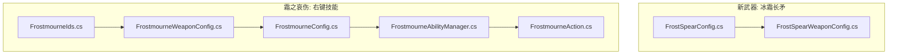
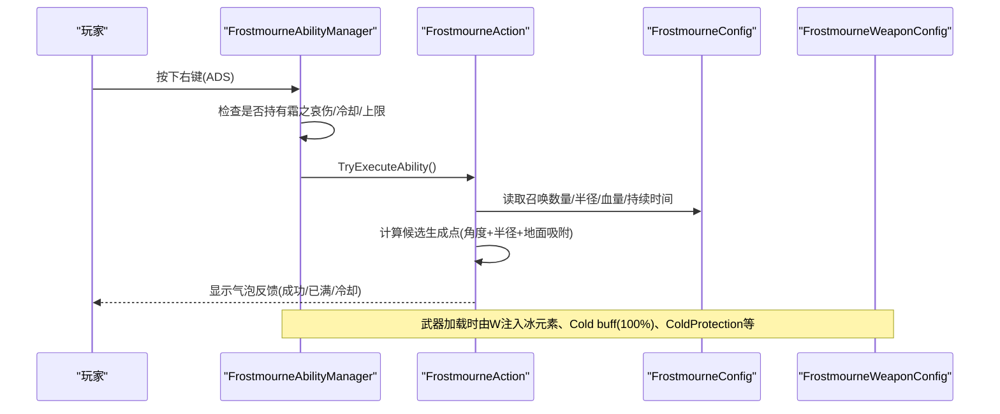
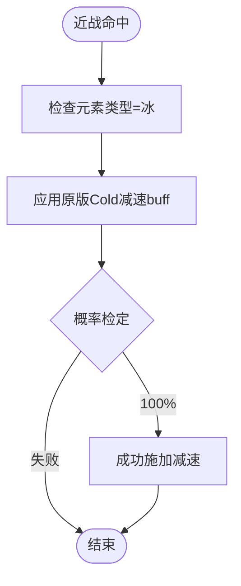
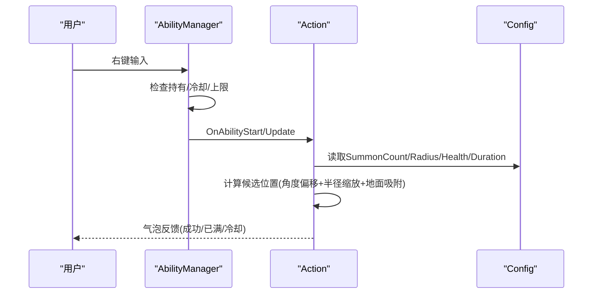
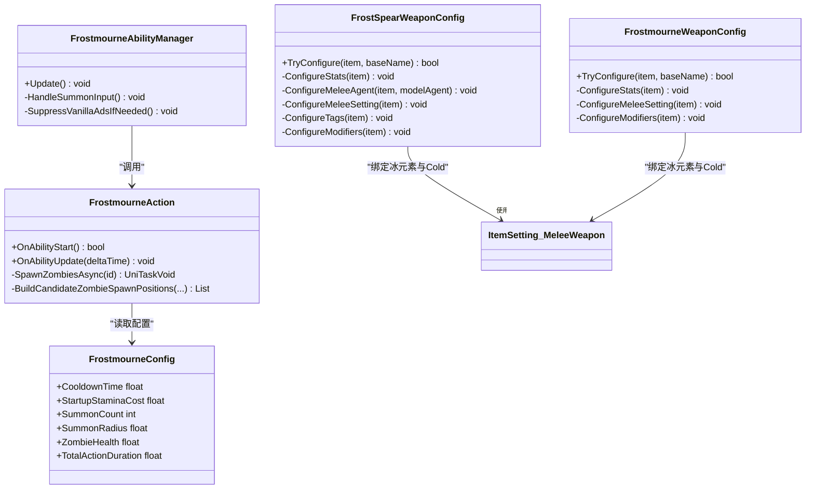

# 冰霜长矛

<cite>
**本文引用的文件**
- [FrostSpearConfig.cs](file://Integration/NewWeapons/FrostSpear/FrostSpearConfig.cs)
- [FrostSpearWeaponConfig.cs](file://Integration/NewWeapons/FrostSpear/FrostSpearWeaponConfig.cs)
- [FrostmourneAbilityManager.cs](file://Integration/Frostmourne/FrostmourneAbilityManager.cs)
- [FrostmourneAction.cs](file://Integration/Frostmourne/FrostmourneAction.cs)
- [FrostmourneConfig.cs](file://Integration/Frostmourne/FrostmourneConfig.cs)
- [FrostmourneWeaponConfig.cs](file://Integration/Frostmourne/FrostmourneWeaponConfig.cs)
- [FrostmourneIds.cs](file://Integration/Frostmourne/FrostmourneIds.cs)
</cite>

## 目录
1. [简介](#简介)
2. [项目结构](#项目结构)
3. [核心组件](#核心组件)
4. [架构总览](#架构总览)
5. [详细组件分析](#详细组件分析)
6. [依赖关系分析](#依赖关系分析)
7. [性能与稳定性](#性能与稳定性)
8. [故障排查指南](#故障排查指南)
9. [结论](#结论)
10. [附录：构建思路与实战策略](#附录构建思路与实战策略)

## 简介
本技术文档围绕“冰霜长矛”武器展开，重点说明其冰系攻击机制、冻结效果的触发与控制、以及与之配套的“霜之哀伤”右键召唤能力。文档同时覆盖配置参数对伤害、范围、冻结概率的影响，并提供流派构建、连招技巧、控场策略以及与队友和环境互动的建议，帮助玩家最大化该武器的控制与输出能力。

## 项目结构
与冰霜长矛相关的代码主要位于两个模块：
- 新武器模块：Integration/NewWeapons/FrostSpear（冰霜长矛的静态配置与装备工厂）
- 霜之哀伤模块：Integration/Frostmourne（右键技能管理器、动作实现、配置与武器工厂）

图表来源
- [FrostSpearConfig.cs:1-56](file://Integration/NewWeapons/FrostSpear/FrostSpearConfig.cs#L1-L56)
- [FrostSpearWeaponConfig.cs:1-233](file://Integration/NewWeapons/FrostSpear/FrostSpearWeaponConfig.cs#L1-L233)
- [FrostmourneAbilityManager.cs:1-326](file://Integration/Frostmourne/FrostmourneAbilityManager.cs#L1-L326)
- [FrostmourneAction.cs:1-800](file://Integration/Frostmourne/FrostmourneAction.cs#L1-L800)
- [FrostmourneConfig.cs:1-88](file://Integration/Frostmourne/FrostmourneConfig.cs#L1-L88)
- [FrostmourneWeaponConfig.cs:1-800](file://Integration/Frostmourne/FrostmourneWeaponConfig.cs#L1-L800)
- [FrostmourneIds.cs:1-38](file://Integration/Frostmourne/FrostmourneIds.cs#L1-L38)

章节来源
- [FrostSpearConfig.cs:1-56](file://Integration/NewWeapons/FrostSpear/FrostSpearConfig.cs#L1-L56)
- [FrostSpearWeaponConfig.cs:1-233](file://Integration/NewWeapons/FrostSpear/FrostSpearWeaponConfig.cs#L1-L233)
- [FrostmourneAbilityManager.cs:1-326](file://Integration/Frostmourne/FrostmourneAbilityManager.cs#L1-L326)
- [FrostmourneAction.cs:1-800](file://Integration/Frostmourne/FrostmourneAction.cs#L1-L800)
- [FrostmourneConfig.cs:1-88](file://Integration/Frostmourne/FrostmourneConfig.cs#L1-L88)
- [FrostmourneWeaponConfig.cs:1-800](file://Integration/Frostmourne/FrostmourneWeaponConfig.cs#L1-L800)
- [FrostmourneIds.cs:1-38](file://Integration/Frostmourne/FrostmourneIds.cs#L1-L38)

## 核心组件
- 冰霜长矛（近战武器）
  - 属性：冰元素、稳定中距离攻击、100%附加冰冻减速、较低暴击率与暴击倍率、提供寒冷防护加成。
  - 关键配置：伤害、攻速、攻击范围、暴击、穿透、体力消耗、命中时间、移速、格挡等。
- 霜之哀伤（右键技能）
  - 功能：在玩家周围按固定角度和半径间隔召唤亡灵仆从，设为同阵营并自动寻敌。
  - 关键配置：冷却时间、启动体力消耗、召唤数量、召唤半径、僵尸血量、技能持续时间。
  - 武器本身：冰元素近战，附带冻伤buff（100%触发），提供寒冷防护加成。

章节来源
- [FrostSpearConfig.cs:15-53](file://Integration/NewWeapons/FrostSpear/FrostSpearConfig.cs#L15-L53)
- [FrostSpearWeaponConfig.cs:29-48](file://Integration/NewWeapons/FrostSpear/FrostSpearWeaponConfig.cs#L29-L48)
- [FrostmourneConfig.cs:15-86](file://Integration/Frostmourne/FrostmourneConfig.cs#L15-L86)
- [FrostmourneWeaponConfig.cs:43-69](file://Integration/Frostmourne/FrostmourneWeaponConfig.cs#L43-L69)

## 架构总览
冰霜长矛与霜之哀伤的运行时交互如下：
- 冰霜长矛通过 ItemSetting_MeleeWeapon 将攻击标记为冰元素，并绑定原版 Cold 减速 buff，设置触发概率为 100%。
- 霜之哀伤通过 AbilityManager 监听 ADS（右键）输入，校验持有武器、冷却与上限后，调用 Action 异步生成亡灵仆从。
- 武器工厂在加载时注入 Stats、标签、Modifier、本地化与特效。

图表来源
- [FrostmourneAbilityManager.cs:99-139](file://Integration/Frostmourne/FrostmourneAbilityManager.cs#L99-L139)
- [FrostmourneAction.cs:133-286](file://Integration/Frostmourne/FrostmourneAction.cs#L133-L286)
- [FrostmourneConfig.cs:35-75](file://Integration/Frostmourne/FrostmourneConfig.cs#L35-L75)
- [FrostmourneWeaponConfig.cs:647-681](file://Integration/Frostmourne/FrostmourneWeaponConfig.cs#L647-L681)

## 详细组件分析

### 冰霜长矛：冰系攻击与冻结机制
- 元素与命中
  - 武器被配置为冰元素，命中时通过 ItemSetting_MeleeWeapon 的 buff 字段绑定原版 Cold 减速效果。
  - 冻结触发概率设置为 100%，即每次近战命中都会尝试施加减速。
- 数值与范围
  - 基础伤害中等，攻速中等，攻击范围 2.4m，适合中距离拉扯。
  - 暴击率与暴击伤害偏低，避免堆叠暴击流。
  - 提供 ColdProtection +1，提升对寒冷环境的抗性。
- 投射物轨迹与范围伤害
  - 冰霜长矛为近战武器，不发射独立投射物；命中判定由近战系统完成，范围由 AttackRange 决定。
  - 无额外范围伤害逻辑，仅单次命中触发一次减速。

图表来源
- [FrostSpearWeaponConfig.cs:151-182](file://Integration/NewWeapons/FrostSpear/FrostSpearWeaponConfig.cs#L151-L182)
- [FrostSpearConfig.cs:25-53](file://Integration/NewWeapons/FrostSpear/FrostSpearConfig.cs#L25-L53)

章节来源
- [FrostSpearWeaponConfig.cs:151-182](file://Integration/NewWeapons/FrostSpear/FrostSpearWeaponConfig.cs#L151-L182)
- [FrostSpearConfig.cs:25-53](file://Integration/NewWeapons/FrostSpear/FrostSpearConfig.cs#L25-L53)

### 霜之哀伤：右键召唤与亡灵行为
- 输入检测与执行
  - 管理器每帧检测 ADS 输入，若持有武器且不在冷却、未达上限则执行能力。
  - 支持显示冷却气泡与上限提示，抑制原版右键行为以避免冲突。
- 召唤流程
  - 异步生成最多 5 只亡灵，分布在玩家周围的角度与半径上。
  - 生成点需满足地面吸附、非墙体碰撞、不与已有召唤点过近等条件。
  - 召唤成功后设置队伍、AI、名称、禁用掉落，并刷新跟随槽位。
- 配置影响
  - 冷却时间、启动体力消耗、召唤数量、召唤半径、僵尸血量、技能持续时间均可通过配置调整。
- 视觉效果
  - 武器本身为冰元素，附带冻伤buff（100%触发），并提供 ColdProtection +2。

图表来源
- [FrostmourneAbilityManager.cs:99-139](file://Integration/Frostmourne/FrostmourneAbilityManager.cs#L99-L139)
- [FrostmourneAction.cs:133-286](file://Integration/Frostmourne/FrostmourneAction.cs#L133-L286)
- [FrostmourneConfig.cs:35-75](file://Integration/Frostmourne/FrostmourneConfig.cs#L35-L75)

章节来源
- [FrostmourneAbilityManager.cs:99-139](file://Integration/Frostmourne/FrostmourneAbilityManager.cs#L99-L139)
- [FrostmourneAction.cs:133-286](file://Integration/Frostmourne/FrostmourneAction.cs#L133-L286)
- [FrostmourneConfig.cs:35-75](file://Integration/Frostmourne/FrostmourneConfig.cs#L35-L75)

### 武器工厂与配置注入
- 冰霜长矛
  - 注入 Stats（伤害、攻速、范围、暴击、穿透、体力消耗、命中时间、移速、格挡等）。
  - 设置冰元素与 100% 触发 Cold 减速，添加 ColdProtection +1。
  - 注入本地化文本与标签。
- 霜之哀伤
  - 注入 Stats（基于断界戟 70% 的近战数值）、冰元素、100% 触发 Cold 减速、ColdProtection +2。
  - 绑定模型、修复渲染、注入本地化与标签。

章节来源
- [FrostSpearWeaponConfig.cs:29-48](file://Integration/NewWeapons/FrostSpear/FrostSpearWeaponConfig.cs#L29-L48)
- [FrostSpearWeaponConfig.cs:151-182](file://Integration/NewWeapons/FrostSpear/FrostSpearWeaponConfig.cs#L151-L182)
- [FrostmourneWeaponConfig.cs:43-69](file://Integration/Frostmourne/FrostmourneWeaponConfig.cs#L43-L69)
- [FrostmourneWeaponConfig.cs:647-681](file://Integration/Frostmourne/FrostmourneWeaponConfig.cs#L647-L681)

## 依赖关系分析
- 冰霜长矛依赖游戏内置的冰元素与 Cold 减速 buff 系统，通过 ItemSetting_MeleeWeapon 进行绑定。
- 霜之哀伤依赖角色预制体（Cname_Zombie）与 AI 系统，使用寻路与跟随组件实现亡灵环绕与追击。
- 两者均依赖 EquipmentFactory 与 ItemStatsSystem 进行运行时配置与统计管理。

图表来源
- [FrostSpearWeaponConfig.cs:53-90](file://Integration/NewWeapons/FrostSpear/FrostSpearWeaponConfig.cs#L53-L90)
- [FrostmourneAbilityManager.cs:18-326](file://Integration/Frostmourne/FrostmourneAbilityManager.cs#L18-L326)
- [FrostmourneAction.cs:25-800](file://Integration/Frostmourne/FrostmourneAction.cs#L25-L800)
- [FrostmourneConfig.cs:15-86](file://Integration/Frostmourne/FrostmourneConfig.cs#L15-L86)
- [FrostmourneWeaponConfig.cs:87-150](file://Integration/Frostmourne/FrostmourneWeaponConfig.cs#L87-L150)

章节来源
- [FrostSpearWeaponConfig.cs:53-90](file://Integration/NewWeapons/FrostSpear/FrostSpearWeaponConfig.cs#L53-L90)
- [FrostmourneAbilityManager.cs:18-326](file://Integration/Frostmourne/FrostmourneAbilityManager.cs#L18-L326)
- [FrostmourneAction.cs:25-800](file://Integration/Frostmourne/FrostmourneAction.cs#L25-L800)
- [FrostmourneConfig.cs:15-86](file://Integration/Frostmourne/FrostmourneConfig.cs#L15-L86)
- [FrostmourneWeaponConfig.cs:87-150](file://Integration/Frostmourne/FrostmourneWeaponConfig.cs#L87-L150)

## 性能与稳定性
- 冰霜长矛
  - 近战命中路径较短，性能开销低；100% 触发减速可能在高密度敌人场景下增加状态更新压力。
  - 建议搭配高穿透与稳定攻速以维持持续减速覆盖率。
- 霜之哀伤
  - 召唤过程使用异步任务与缓冲数组，减少卡顿；每只召唤之间让出一帧，避免批量生成导致的峰值。
  - 生成点检测使用胶囊体重叠与非分配缓存，降低 GC 压力。
  - 建议关注场上亡灵数量上限与清理逻辑，避免过多存活单位造成性能问题。

[本节为通用指导，无需特定文件引用]

## 故障排查指南
- 冰霜长矛
  - 若未触发减速：检查 ItemSetting_MeleeWeapon 的 buff 与 buffChance 是否正确配置。
  - 若范围异常：核对 AttackRange 配置与近战命中时间 DealDamageTime。
- 霜之哀伤
  - 若右键无效：确认 IsHoldingFrostmourne 返回 true、冷却时间归零、未达召唤上限。
  - 若召唤失败：检查 Cname_Zombie 预设是否存在、生成点是否被墙体阻挡或与其他召唤点过近。
  - 若亡灵不攻击：确认队伍设置与 AICharacterController 初始化是否正常。

章节来源
- [FrostSpearWeaponConfig.cs:151-182](file://Integration/NewWeapons/FrostSpear/FrostSpearWeaponConfig.cs#L151-L182)
- [FrostmourneAbilityManager.cs:227-258](file://Integration/Frostmourne/FrostmourneAbilityManager.cs#L227-L258)
- [FrostmourneAction.cs:389-419](file://Integration/Frostmourne/FrostmourneAction.cs#L389-L419)
- [FrostmourneAction.cs:483-526](file://Integration/Frostmourne/FrostmourneAction.cs#L483-L526)

## 结论
冰霜长矛以稳定的中距离冰系攻击与 100% 减速为核心，适合控场与拉扯；霜之哀伤提供强大的战场控制与辅助能力，通过召唤亡灵形成多线牵制。两者的配置清晰、实现稳健，能够在不同场景中发挥出色的控制与输出作用。

[本节为总结性内容，无需特定文件引用]

## 附录：构建思路与实战策略
- 冰系流派构建
  - 优先选择提高攻速与命中时间的装备，以维持高频减速覆盖。
  - 搭配寒冷防护与冰抗装备，增强生存能力。
  - 避免过度堆叠暴击，因冰霜长矛暴击收益较低。
- 连招技巧
  - 保持 2.4m 安全距离，利用长矛优势进行风筝式输出。
  - 配合霜之哀伤召唤，形成“远程减速+近战补刀”的节奏。
- 控场策略
  - 在密集敌人区域优先使用右键召唤，分散敌方阵型。
  - 利用 100% 减速限制高机动敌人（如冲刺类）接近。
- 队友配合
  - 与范围伤害队友协同，先减速再集火。
  - 与护盾/治疗职业配合，保证自身站位安全。
- 敌人弱点与环境互动
  - 对冰弱敌人可叠加更高控制效果。
  - 在狭窄地形利用长矛射程优势压制敌人推进。

[本节为通用指导，无需特定文件引用]