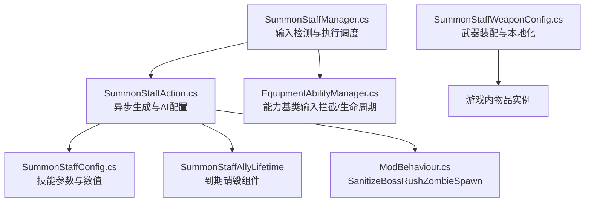
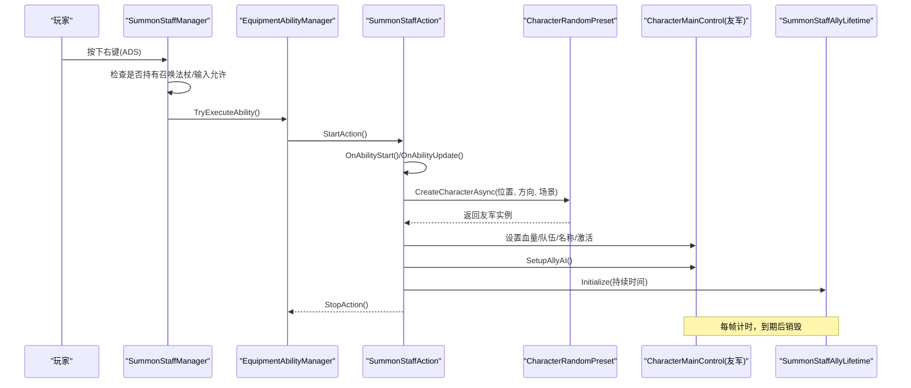
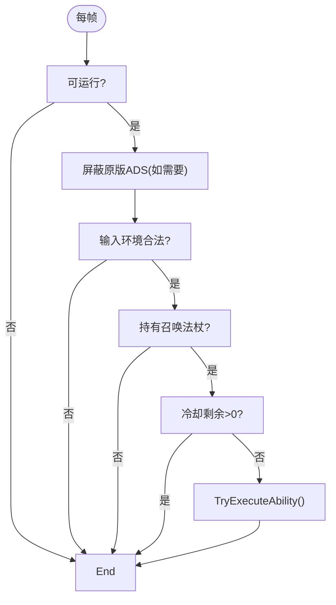
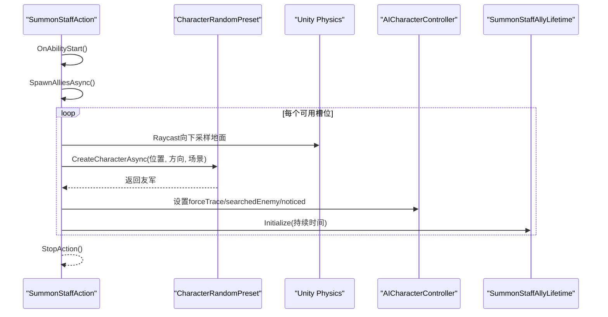
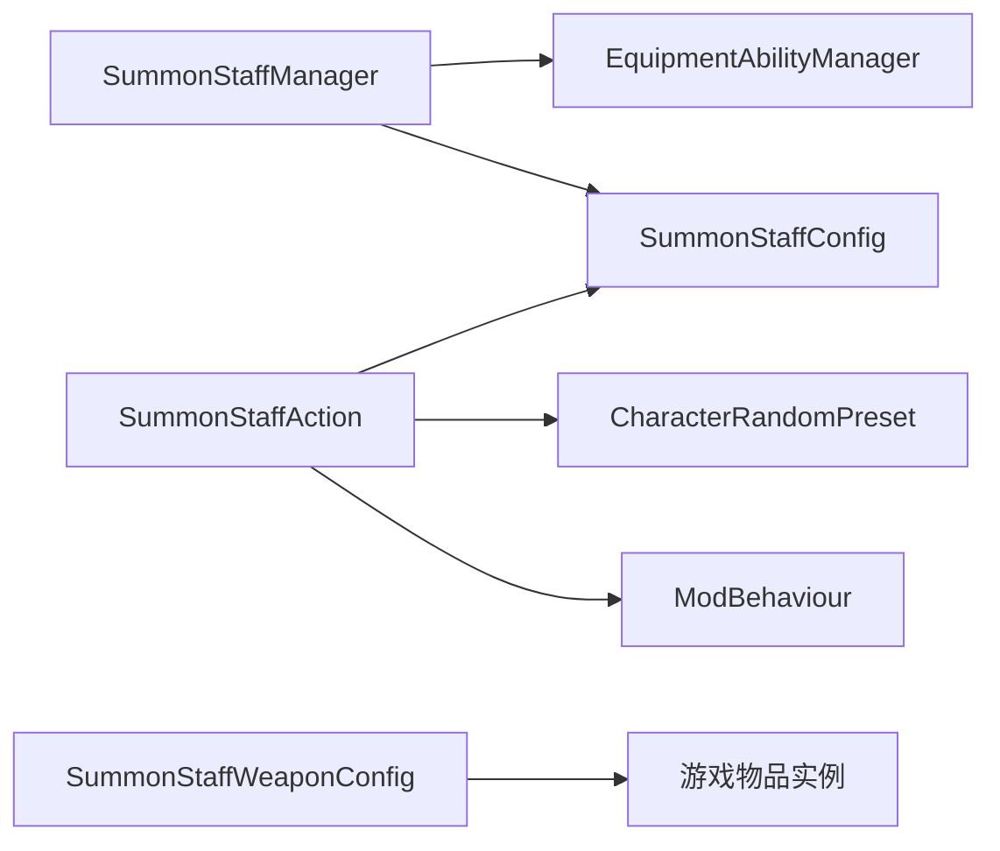

# 召唤法杖

<cite>
**本文引用的文件**
- [SummonStaffManager.cs](file://Integration/NewWeapons/SummonStaff/SummonStaffManager.cs)
- [SummonStaffAction.cs](file://Integration/NewWeapons/SummonStaff/SummonStaffAction.cs)
- [SummonStaffConfig.cs](file://Integration/NewWeapons/SummonStaff/SummonStaffConfig.cs)
- [SummonStaffWeaponConfig.cs](file://Integration/NewWeapons/SummonStaff/SummonStaffWeaponConfig.cs)
- [EquipmentAbilityManager.cs](file://Common/Equipment/EquipmentAbilityManager.cs)
- [ModBehaviour.cs](file://ModBehaviour.cs)
- [summon-staff.md](file://wiki-site/docs/en/equipment/summon-staff.md)
</cite>

## 目录
1. [简介](#简介)
2. [项目结构](#项目结构)
3. [核心组件](#核心组件)
4. [架构总览](#架构总览)
5. [详细组件分析](#详细组件分析)
6. [依赖关系分析](#依赖关系分析)
7. [性能考量](#性能考量)
8. [故障排查指南](#故障排查指南)
9. [结论](#结论)
10. [附录](#附录)

## 简介
本技术文档围绕“召唤法杖”这一近战武器，系统阐述其右键技能「灵魂召唤」的完整实现：包括召唤物的创建、更新、维护与销毁生命周期；AI控制系统的目标选择、移动逻辑、攻击行为与团队协作机制；能力动作的触发条件、冷却管理与资源消耗；不同召唤流的构建方案、输出优化策略与团队配合技巧；以及性能监控方法与内存管理最佳实践，确保在大量召唤物场景下的稳定运行。

该武器定位为“以召唤物压场为主、自身近战偏弱”的策略型近战武器，通过短命友军分散敌人火力，为持有者创造安全输出窗口。

## 项目结构
召唤法杖相关代码集中在 Integration/NewWeapons/SummonStaff 目录下，包含管理器、动作、配置与武器装配器四个核心文件，并通过通用装备能力框架进行统一接入。

图表来源
- [SummonStaffManager.cs:17-90](file://Integration/NewWeapons/SummonStaff/SummonStaffManager.cs#L17-L90)
- [SummonStaffAction.cs:20-100](file://Integration/NewWeapons/SummonStaff/SummonStaffAction.cs#L20-L100)
- [SummonStaffConfig.cs:16-80](file://Integration/NewWeapons/SummonStaff/SummonStaffConfig.cs#L16-L80)
- [EquipmentAbilityManager.cs:15-120](file://Common/Equipment/EquipmentAbilityManager.cs#L15-L120)
- [SummonStaffWeaponConfig.cs:23-88](file://Integration/NewWeapons/SummonStaff/SummonStaffWeaponConfig.cs#L23-L88)

章节来源
- [SummonStaffManager.cs:17-90](file://Integration/NewWeapons/SummonStaff/SummonStaffManager.cs#L17-L90)
- [SummonStaffAction.cs:20-100](file://Integration/NewWeapons/SummonStaff/SummonStaffAction.cs#L20-L100)
- [SummonStaffConfig.cs:16-80](file://Integration/NewWeapons/SummonStaff/SummonStaffConfig.cs#L16-L80)
- [SummonStaffWeaponConfig.cs:23-88](file://Integration/NewWeapons/SummonStaff/SummonStaffWeaponConfig.cs#L23-L88)
- [EquipmentAbilityManager.cs:15-120](file://Common/Equipment/EquipmentAbilityManager.cs#L15-L120)

## 核心组件
- 能力管理器（SummonStaffManager）：负责右键输入检测、持有判定、冷却检查与执行调度，并屏蔽原版ADS输入以避免冲突。
- 能力动作（SummonStaffAction）：实现「灵魂召唤」的异步生成流程，配置友军属性、AI、生命周期与清理逻辑。
- 配置（SummonStaffConfig）：定义技能冷却、启动耐力消耗、近战属性、召唤数量/半径/生命/持续时间等数值。
- 武器装配器（SummonStaffWeaponConfig）：在游戏加载时为目标物品注入近战Stats、Melee组件、标签与本地化文本。
- 通用能力基类（EquipmentAbilityManager）：提供统一的输入拦截、能力注册/注销、动作生命周期与场景切换处理。

章节来源
- [SummonStaffManager.cs:17-90](file://Integration/NewWeapons/SummonStaff/SummonStaffManager.cs#L17-L90)
- [SummonStaffAction.cs:20-100](file://Integration/NewWeapons/SummonStaff/SummonStaffAction.cs#L20-L100)
- [SummonStaffConfig.cs:16-80](file://Integration/NewWeapons/SummonStaff/SummonStaffConfig.cs#L16-L80)
- [SummonStaffWeaponConfig.cs:23-88](file://Integration/NewWeapons/SummonStaff/SummonStaffWeaponConfig.cs#L23-L88)
- [EquipmentAbilityManager.cs:15-120](file://Common/Equipment/EquipmentAbilityManager.cs#L15-L120)

## 架构总览
下图展示了从玩家按下右键到召唤物生成、AI初始化、定时销毁的完整调用链。

图表来源
- [SummonStaffManager.cs:92-112](file://Integration/NewWeapons/SummonStaff/SummonStaffManager.cs#L92-L112)
- [EquipmentAbilityManager.cs:392-428](file://Common/Equipment/EquipmentAbilityManager.cs#L392-L428)
- [SummonStaffAction.cs:63-84](file://Integration/NewWeapons/SummonStaff/SummonStaffAction.cs#L63-L84)
- [SummonStaffAction.cs:102-196](file://Integration/NewWeapons/SummonStaff/SummonStaffAction.cs#L102-L196)
- [SummonStaffAction.cs:365-384](file://Integration/NewWeapons/SummonStaff/SummonStaffAction.cs#L365-L384)

## 详细组件分析

### 能力管理器（SummonStaffManager）
职责
- 每帧检测右键输入，屏蔽原版ADS输入避免冲突。
- 校验持有武器、输入环境合法性（时间缩放、UI焦点等）。
- 读取技能剩余冷却，满足条件则触发能力执行。

关键流程
- Update/LateUpdate 中调用 SuppressVanillaAdsIfNeeded 与 HandleSummonInput。
- IsHoldingSummonStaff 通过近战或手持物品ID判断是否持有召唤法杖。
- OnBeforeTryExecute 再次确认持有状态，防止误触发。

图表来源
- [SummonStaffManager.cs:31-53](file://Integration/NewWeapons/SummonStaff/SummonStaffManager.cs#L31-L53)
- [SummonStaffManager.cs:92-112](file://Integration/NewWeapons/SummonStaff/SummonStaffManager.cs#L92-L112)
- [SummonStaffManager.cs:130-156](file://Integration/NewWeapons/SummonStaff/SummonStaffManager.cs#L130-L156)
- [SummonStaffManager.cs:158-183](file://Integration/NewWeapons/SummonStaff/SummonStaffManager.cs#L158-L183)
- [SummonStaffManager.cs:185-208](file://Integration/NewWeapons/SummonStaff/SummonStaffManager.cs#L185-L208)

章节来源
- [SummonStaffManager.cs:31-53](file://Integration/NewWeapons/SummonStaff/SummonStaffManager.cs#L31-L53)
- [SummonStaffManager.cs:92-112](file://Integration/NewWeapons/SummonStaff/SummonStaffManager.cs#L92-L112)
- [SummonStaffManager.cs:130-183](file://Integration/NewWeapons/SummonStaff/SummonStaffManager.cs#L130-L183)
- [SummonStaffManager.cs:185-208](file://Integration/NewWeapons/SummonStaff/SummonStaffManager.cs#L185-L208)

### 能力动作（SummonStaffAction）
职责
- 异步生成指定数量的友军，按环形分布定位。
- 配置友军血量、队伍归属、AI参数，附加生命周期组件。
- 清理死亡友军，重置预设缓存，支持场景切换。

关键流程
- OnAbilityStart 标记开始，OnAbilityUpdate 首次触发 SpawnAlliesAsync。
- SpawnAlliesAsync 使用 CharacterRandomPreset.CreateCharacterAsync 生成角色，计算地面落点，设置AI与寿命。
- CleanupDeadAllies 定期移除已死亡或无效引用。
- ResetPresetCache/CleanupAllSummonedAllies 用于场景切换与全局清理。

图表来源
- [SummonStaffAction.cs:63-84](file://Integration/NewWeapons/SummonStaff/SummonStaffAction.cs#L63-L84)
- [SummonStaffAction.cs:102-196](file://Integration/NewWeapons/SummonStaff/SummonStaffAction.cs#L102-L196)
- [SummonStaffAction.cs:239-281](file://Integration/NewWeapons/SummonStaff/SummonStaffAction.cs#L239-L281)
- [SummonStaffAction.cs:283-296](file://Integration/NewWeapons/SummonStaff/SummonStaffAction.cs#L283-L296)
- [SummonStaffAction.cs:320-331](file://Integration/NewWeapons/SummonStaff/SummonStaffAction.cs#L320-L331)
- [SummonStaffAction.cs:333-359](file://Integration/NewWeapons/SummonStaff/SummonStaffAction.cs#L333-L359)

章节来源
- [SummonStaffAction.cs:63-84](file://Integration/NewWeapons/SummonStaff/SummonStaffAction.cs#L63-L84)
- [SummonStaffAction.cs:102-196](file://Integration/NewWeapons/SummonStaff/SummonStaffAction.cs#L102-L196)
- [SummonStaffAction.cs:239-296](file://Integration/NewWeapons/SummonStaff/SummonStaffAction.cs#L239-L296)
- [SummonStaffAction.cs:320-359](file://Integration/NewWeapons/SummonStaff/SummonStaffAction.cs#L320-L359)

### 配置（SummonStaffConfig）
- 技能冷却：12秒；启动耐力消耗：12；无持续耐力消耗。
- 近战属性：伤害18、攻速1.2、范围1.8m、暴击率4%、暴击倍率1.3x、护甲穿透1、移速加成105%、格挡子弹0.3、耐力消耗6/次、出血概率0。
- 召唤参数：数量3、半径2.2m、生命值80、存活15秒、预设名“Cname_Zombie”。
- 技能总持续时间：1.2秒。

章节来源
- [SummonStaffConfig.cs:16-80](file://Integration/NewWeapons/SummonStaff/SummonStaffConfig.cs#L16-L80)

### 武器装配器（SummonStaffWeaponConfig）
- 在装备工厂加载AssetBundle后，为目标物品注入近战Stats、ItemAgent_MeleeWeapon、ItemSetting_MeleeWeapon、标签与本地化文本。
- 绑定模型代理，确保动画与持握正确。

章节来源
- [SummonStaffWeaponConfig.cs:23-88](file://Integration/NewWeapons/SummonStaff/SummonStaffWeaponConfig.cs#L23-L88)
- [SummonStaffWeaponConfig.cs:90-175](file://Integration/NewWeapons/SummonStaff/SummonStaffWeaponConfig.cs#L90-L175)
- [SummonStaffWeaponConfig.cs:177-193](file://Integration/NewWeapons/SummonStaff/SummonStaffWeaponConfig.cs#L177-L193)

### 通用能力基类（EquipmentAbilityManager）
- 提供单例、输入拦截、能力注册/注销、动作生命周期管理、场景切换重建。
- 通过反射缓存InputAction以提升性能，并提供备用输入检测。
- 统一日志前缀与错误恢复。

章节来源
- [EquipmentAbilityManager.cs:15-120](file://Common/Equipment/EquipmentAbilityManager.cs#L15-L120)
- [EquipmentAbilityManager.cs:192-331](file://Common/Equipment/EquipmentAbilityManager.cs#L192-L331)
- [EquipmentAbilityManager.cs:335-428](file://Common/Equipment/EquipmentAbilityManager.cs#L335-L428)
- [EquipmentAbilityManager.cs:430-541](file://Common/Equipment/EquipmentAbilityManager.cs#L430-L541)

## 依赖关系分析
- SummonStaffManager 依赖 EquipmentAbilityManager 提供的输入拦截与能力生命周期。
- SummonStaffAction 依赖 CharacterRandomPreset 进行异步生成，依赖 ModBehaviour 对生成的友军进行净化处理。
- SummonStaffConfig 被 Manager 与 Action 共同消费，作为唯一数值来源。
- SummonStaffWeaponConfig 在游戏启动阶段将配置应用到具体物品实例。

图表来源
- [SummonStaffManager.cs:17-90](file://Integration/NewWeapons/SummonStaff/SummonStaffManager.cs#L17-L90)
- [SummonStaffAction.cs:102-196](file://Integration/NewWeapons/SummonStaff/SummonStaffAction.cs#L102-L196)
- [SummonStaffWeaponConfig.cs:23-88](file://Integration/NewWeapons/SummonStaff/SummonStaffWeaponConfig.cs#L23-L88)
- [EquipmentAbilityManager.cs:15-120](file://Common/Equipment/EquipmentAbilityManager.cs#L15-L120)

章节来源
- [SummonStaffManager.cs:17-90](file://Integration/NewWeapons/SummonStaff/SummonStaffManager.cs#L17-L90)
- [SummonStaffAction.cs:102-196](file://Integration/NewWeapons/SummonStaff/SummonStaffAction.cs#L102-L196)
- [SummonStaffWeaponConfig.cs:23-88](file://Integration/NewWeapons/SummonStaff/SummonStaffWeaponConfig.cs#L23-L88)
- [EquipmentAbilityManager.cs:15-120](file://Common/Equipment/EquipmentAbilityManager.cs#L15-L120)

## 性能考量
- 输入检测优化：通过反射缓存 InputAction 与方法引用，减少每帧反射开销。
- 异步生成：使用 UniTask 分帧生成多个友军，避免主线程卡顿。
- 地面采样：Raycast 限制距离与层掩码，降低物理查询成本。
- 列表清理：定期移除死亡友军，避免空引用与内存泄漏。
- 生命周期组件：仅维护时间与销毁，不频繁查找组件，符合测试守卫要求。
- 场景切换：重置预设缓存，重建能力动作，保证跨场景稳定性。

建议
- 在高并发召唤场景下，优先采用批量生成+间隔yield的方式，避免瞬时GC峰值。
- 对高频路径（如IsInputPressed、Raycast）保持最小分配与最短路分支。
- 使用对象池或复用预制体可减少频繁Instantiate/Destroy带来的压力（当前实现基于预设生成，可在后续扩展）。

[本节为通用性能指导，无需特定文件引用]

## 故障排查指南
常见问题与定位要点
- 无法触发右键技能：
  - 检查是否持有召唤法杖（近战或手持物品ID匹配）。
  - 检查输入环境是否合法（时间缩放、UI焦点、事件系统指针覆盖）。
  - 查看技能冷却是否仍在CD。
- 召唤失败：
  - 预设未找到或名称键不匹配（Cname_Zombie）。
  - 场景索引不一致导致生成中断。
  - 生成过程中请求失效（玩家死亡/场景切换/动作停止）。
- 召唤物未生效：
  - AI未正确初始化（forceTrace/searchedEnemy/noticed）。
  - 队伍归属未设置导致敌我识别异常。
  - 生命周期组件未添加或持续时间过短。
- 内存与性能问题：
  - 死亡友军未及时清理导致列表膨胀。
  - 频繁组件查找造成GC抖动（应避免在Update中GetComponent）。

参考定位
- 输入与环境检查：[SummonStaffManager.cs:158-183](file://Integration/NewWeapons/SummonStaff/SummonStaffManager.cs#L158-L183)
- 持有判定：[SummonStaffManager.cs:130-156](file://Integration/NewWeapons/SummonStaff/SummonStaffManager.cs#L130-L156)
- 冷却检查：[SummonStaffManager.cs:100-112](file://Integration/NewWeapons/SummonStaff/SummonStaffManager.cs#L100-L112)
- 预设查找与生成：[SummonStaffAction.cs:209-237](file://Integration/NewWeapons/SummonStaff/SummonStaffAction.cs#L209-L237)
- 生成有效性校验：[SummonStaffAction.cs:198-207](file://Integration/NewWeapons/SummonStaff/SummonStaffAction.cs#L198-L207)
- AI初始化：[SummonStaffAction.cs:269-281](file://Integration/NewWeapons/SummonStaff/SummonStaffAction.cs#L269-L281)
- 生命周期与清理：[SummonStaffAction.cs:320-359](file://Integration/NewWeapons/SummonStaff/SummonStaffAction.cs#L320-L359)

章节来源
- [SummonStaffManager.cs:100-183](file://Integration/NewWeapons/SummonStaff/SummonStaffManager.cs#L100-L183)
- [SummonStaffAction.cs:198-237](file://Integration/NewWeapons/SummonStaff/SummonStaffAction.cs#L198-L237)
- [SummonStaffAction.cs:269-359](file://Integration/NewWeapons/SummonStaff/SummonStaffAction.cs#L269-L359)

## 结论
召唤法杖通过简洁而稳健的能力框架，实现了稳定的右键召唤流：输入拦截→持有校验→冷却检查→异步生成→AI配置→定时销毁。其设计重点在于：
- 低侵入性：复用通用能力基类与预设生成管线。
- 高鲁棒性：多处best-effort异常捕获与场景切换保护。
- 易扩展：配置集中、数值可调，便于后续平衡与功能增强。
在大量召唤物场景下，通过分帧生成、轻量生命周期组件与定期清理，保证了运行时稳定性与性能表现。

[本节为总结性内容，无需特定文件引用]

## 附录

### 能力动作触发条件、冷却与资源消耗
- 触发条件：
  - 持有召唤法杖（近战或手持物品ID匹配）。
  - 输入环境合法（非暂停、非UI遮挡、时间缩放正常）。
  - 技能不在冷却中。
- 冷却管理：
  - 技能冷却12秒，由基类能力系统统一管理。
- 资源消耗：
  - 启动耐力消耗12，无持续每秒消耗。
  - 不自动消耗耐力（ShouldAutoConsumeStamina=false），由基类与配置控制。

章节来源
- [SummonStaffManager.cs:92-112](file://Integration/NewWeapons/SummonStaff/SummonStaffManager.cs#L92-L112)
- [SummonStaffConfig.cs:29-34](file://Integration/NewWeapons/SummonStaff/SummonStaffConfig.cs#L29-L34)
- [SummonStaffAction.cs:48-51](file://Integration/NewWeapons/SummonStaff/SummonStaffAction.cs#L48-L51)

### 不同召唤流的构建方案
- 基础流：默认3只灵魂战士，环形分布，持续15秒。
- 高爆发流：提高召唤数量与初始血量，缩短持续时间，适合快速清怪。
- 持久流：降低数量但延长持续时间，适合长时间压场与Boss战。
- 协作流：调整队伍归属与AI参数，使其更倾向于吸引仇恨与协同攻击。

[本节为概念性内容，无需特定文件引用]

### 输出优化策略与团队配合技巧
- 输出优化：
  - 利用召唤物吸引仇恨，在安全窗口内进行近战输出。
  - 合理站位，使召唤物处于敌人密集区域，最大化分摊伤害。
- 团队配合：
  - 与队友分工：召唤物承担前排，队友提供远程或辅助能力。
  - 在多人场景中，注意队伍标识与AI目标选择，避免误伤。

章节来源
- [summon-staff.md:28-37](file://wiki-site/docs/en/equipment/summon-staff.md#L28-L37)

### 性能监控方法与内存管理最佳实践
- 监控方法：
  - 关注每帧生成次数与延迟（UniTask.Yield间隔）。
  - 统计活跃召唤物数量与销毁频率，评估内存占用。
  - 记录预设查找与Raycast命中情况，定位瓶颈。
- 内存管理：
  - 及时清理死亡友军，避免列表膨胀。
  - 场景切换时重置静态缓存，重建能力动作。
  - 避免在生命周期组件中进行组件查找，直接销毁GameObject。

章节来源
- [SummonStaffAction.cs:320-359](file://Integration/NewWeapons/SummonStaff/SummonStaffAction.cs#L320-L359)
- [SummonStaffAction.cs:365-384](file://Integration/NewWeapons/SummonStaff/SummonStaffAction.cs#L365-L384)
- [SummonStaffManager.cs:86-90](file://Integration/NewWeapons/SummonStaff/SummonStaffManager.cs#L86-L90)